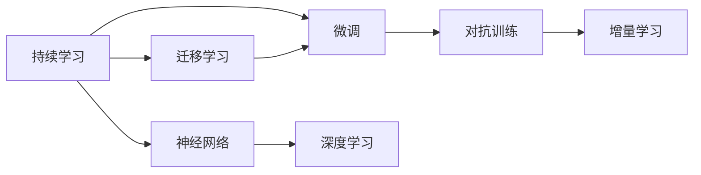
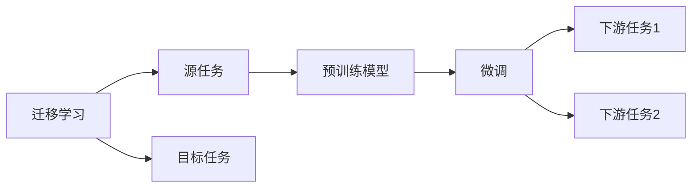
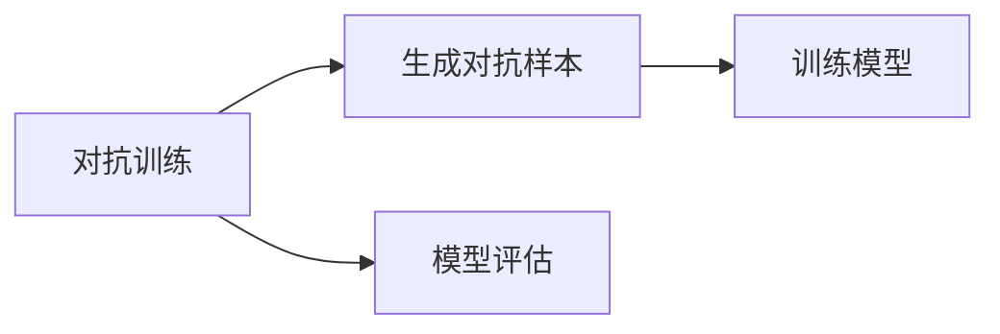
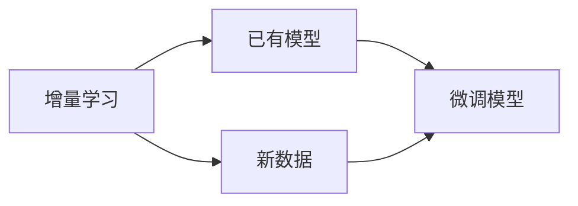
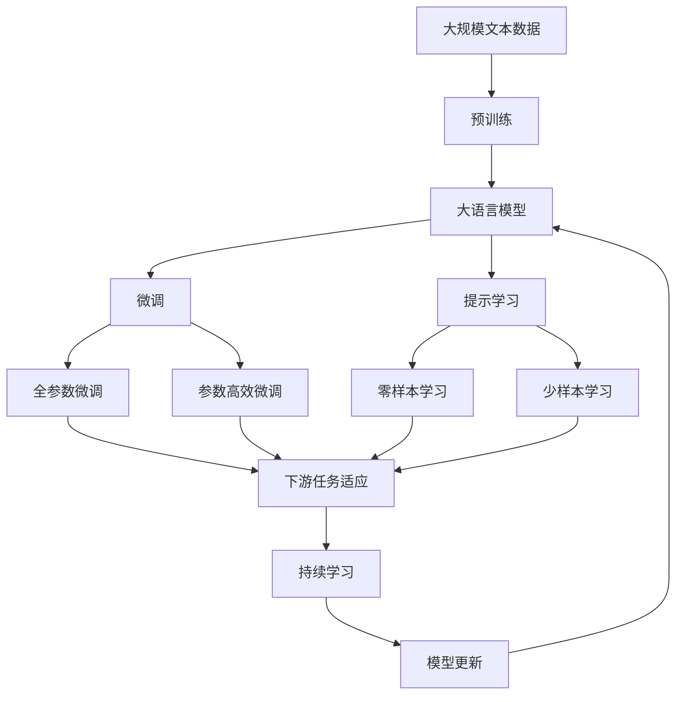

                 

# 持续学习Continual Learning原理与代码实例讲解

> 关键词：
1. 持续学习Continual Learning
2. 迁移学习Transfer Learning
3. 微调Fine-Tuning
4. 对抗训练Adversarial Training
5. 增量学习Incremental Learning
6. 神经网络Neural Networks
7. 深度学习Deep Learning

## 1. 背景介绍

### 1.1 问题由来
随着深度学习技术的发展，人工智能系统需要不断面对新的任务和数据，持续学习（Continual Learning, CL）成为提升系统性能的重要手段。持续学习旨在使模型能够不断地从新数据中学习，而保持对已学知识的记忆，避免出现灾难性遗忘（Catastrophic Forgetting）。常见的持续学习范式包括前向迁移学习（Forward Transfer Learning）、顺序学习（Sequential Learning）、时序学习（Temporal Learning）等。

当前，持续学习在图像分类、语音识别、自然语言处理等领域得到了广泛应用。例如，在视觉识别任务中，模型需要定期在新的数据集上进行微调，以适应不同的视觉场景。在语音识别中，持续学习使模型能够在不断接触新语言的同时，保持对已有语言的理解和处理能力。在自然语言处理领域，微调技术的应用，使得通用语言模型（如BERT、GPT等）能够在特定任务上快速适应用户需求，提升模型性能。

### 1.2 问题核心关键点
持续学习的核心在于让模型在不断接触新数据的同时，保持对已学知识的记忆。这涉及到以下关键问题：

- 如何更新模型，使其在新数据上表现良好，同时避免遗忘原有知识？
- 如何评估模型在新数据上的性能，以及是否存在知识遗忘现象？
- 如何在不同任务之间高效迁移知识，避免从头开始训练？
- 如何设计优化目标和损失函数，以实现最优的持续学习效果？

这些问题的解决，需要综合利用迁移学习、微调、对抗训练、增量学习等技术手段。

### 1.3 问题研究意义
持续学习对于提升人工智能系统的通用性、适应性和鲁棒性具有重要意义：

1. 通用性：持续学习使模型能够适应不断变化的环境和任务，提升系统的泛化能力。
2. 适应性：在面对新数据时，持续学习使模型能够快速适应用户需求，提升用户满意度。
3. 鲁棒性：持续学习使模型能够持续学习和更新，避免出现灾难性遗忘，提升系统的稳定性和可靠性。

持续学习已成为人工智能领域的一个重要研究方向，未来将继续推动人工智能技术的不断进步。

## 2. 核心概念与联系

### 2.1 核心概念概述

为更好地理解持续学习的核心概念和原理，本节将详细介绍以下几个关键概念：

- **持续学习（Continual Learning）**：使模型能够不断地从新数据中学习，而保持对已学知识的记忆，避免灾难性遗忘。
- **迁移学习（Transfer Learning）**：将在一个任务上学习到的知识，迁移到另一个相关但不同的任务上。
- **微调（Fine-Tuning）**：在预训练模型基础上，使用少量标注数据进行优化，提升模型在特定任务上的性能。
- **对抗训练（Adversarial Training）**：通过在训练集中加入对抗样本，增强模型的鲁棒性和泛化能力。
- **增量学习（Incremental Learning）**：在已有模型基础上，逐步增加新数据进行学习，以适应用户需求的变化。
- **神经网络（Neural Networks）**：基于人工神经元连接的计算模型，通过学习数据特征，进行分类、回归等任务。
- **深度学习（Deep Learning）**：利用神经网络进行多层非线性特征提取和处理，提升模型的复杂度和准确度。

这些概念之间相互关联，构成了持续学习的完整体系。以下通过Mermaid流程图展示这些概念之间的联系：



这个流程图展示了持续学习与其他相关概念的联系：

1. 持续学习通过迁移学习在不同任务间进行知识迁移。
2. 微调是持续学习中常用的方法，用于提升模型在特定任务上的性能。
3. 对抗训练用于增强模型的鲁棒性，避免灾难性遗忘。
4. 增量学习使模型能够逐步适应新的任务需求，保持系统活力。
5. 持续学习依赖神经网络进行特征提取和处理。
6. 深度学习通过多层神经网络提升了模型的复杂度和准确度。

### 2.2 概念间的关系

这些核心概念之间存在紧密的联系，形成了持续学习的完整生态系统。下面我们通过几个Mermaid流程图来展示这些概念之间的关系。

#### 2.2.1 持续学习的学习范式


这个流程图展示了持续学习的核心范式，包括迁移学习、微调、对抗训练和增量学习。持续学习通过这些技术手段，实现对新数据的适应和知识迁移。

#### 2.2.2 迁移学习与微调的关系



这个流程图展示了迁移学习的基本原理，以及它与微调的关系。迁移学习涉及源任务和目标任务，预训练模型在源任务上学习，然后通过微调适应各种下游任务（目标任务）。

#### 2.2.3 对抗训练方法



这个流程图展示了对抗训练的基本流程，通过生成对抗样本训练模型，增强模型的鲁棒性和泛化能力。

#### 2.2.4 增量学习的应用场景



这个流程图展示了增量学习的基本流程，通过逐步增加新数据进行学习，以适应用户需求的变化。

### 2.3 核心概念的整体架构

最后，我们用一个综合的流程图来展示这些核心概念在大语言模型微调过程中的整体架构：



这个综合流程图展示了从预训练到微调，再到持续学习的完整过程。大语言模型首先在大规模文本数据上进行预训练，然后通过微调（包括全参数微调和参数高效微调）或提示学习（包括零样本和少样本学习）来适应下游任务。最后，通过持续学习技术，模型可以不断更新和适应新的任务和数据。 通过这些流程图，我们可以更清晰地理解持续学习的核心概念和应用场景。

## 3. 核心算法原理 & 具体操作步骤

### 3.1 算法原理概述

持续学习的核心思想是让模型在不断接触新数据的同时，保持对已学知识的记忆，避免出现灾难性遗忘。其核心算法包括：

1. **迁移学习**：通过在已有模型基础上进行微调，将预训练得到的知识迁移到新任务上，避免从头开始训练。
2. **微调**：使用少量标注数据，通过反向传播算法更新模型参数，提升模型在特定任务上的性能。
3. **对抗训练**：在训练集中加入对抗样本，增强模型的鲁棒性和泛化能力。
4. **增量学习**：逐步增加新数据进行学习，以适应用户需求的变化。

### 3.2 算法步骤详解

持续学习的一般流程包括以下几个关键步骤：

**Step 1: 准备预训练模型和数据集**
- 选择合适的预训练模型，如BERT、GPT等。
- 准备新任务的标注数据集，划分为训练集、验证集和测试集。

**Step 2: 微调模型**
- 在预训练模型的基础上，添加任务适配层，如分类器或解码器。
- 设置微调超参数，包括学习率、批大小、迭代轮数等。
- 执行梯度训练，最小化损失函数，更新模型参数。

**Step 3: 评估模型性能**
- 在验证集上评估模型性能，监测模型在新数据上的表现。
- 使用对抗训练技术，增强模型的鲁棒性。

**Step 4: 增量学习**
- 逐步增加新数据，进行微调，适应新的任务需求。
- 定期在测试集上评估模型性能，确保模型性能持续提升。

**Step 5: 持续学习**
- 使用增量学习技术，保持模型对新数据的适应能力。
- 定期在测试集上评估模型性能，避免灾难性遗忘。

### 3.3 算法优缺点

持续学习的优点包括：
1. 能够适应新数据和新任务，避免从头开始训练。
2. 通过微调和对抗训练，提升模型性能和鲁棒性。
3. 增量学习使模型能够逐步适应新需求，保持系统活力。

持续学习的缺点包括：
1. 需要处理新旧数据的冲突，避免灾难性遗忘。
2. 对抗训练和增量学习需要额外的时间和计算资源。
3. 模型需要不断进行微调和更新，维护成本较高。

### 3.4 算法应用领域

持续学习在许多领域中得到了广泛应用，包括但不限于：

- **图像分类**：通过微调和对抗训练，提升模型对新类别的识别能力。
- **语音识别**：使用增量学习，逐步适应新语言的语音特征。
- **自然语言处理**：通过微调和提示学习，提升模型对新任务的适应能力。
- **推荐系统**：使用增量学习，实时调整推荐策略，提升推荐效果。
- **医疗诊断**：通过微调和对抗训练，提升模型对新疾病的识别能力。

以上领域展示了持续学习在不同场景中的广泛应用，其核心思想在于通过不断学习新数据，保持模型的适应性和稳定性。

## 4. 数学模型和公式 & 详细讲解 & 举例说明

### 4.1 数学模型构建

持续学习的目标是最大化模型在多个任务上的泛化能力，即：

$$
\max_{\theta} \sum_{t=1}^{T} \mathcal{L}_t(\theta)
$$

其中 $\theta$ 为模型参数，$\mathcal{L}_t$ 为第 $t$ 个任务的损失函数。

### 4.2 公式推导过程

以图像分类任务为例，其损失函数可以表示为交叉熵损失：

$$
\mathcal{L}(y,\hat{y}) = -\sum_{i=1}^{C} y_i \log \hat{y}_i
$$

其中 $y$ 为真实标签，$\hat{y}$ 为模型预测概率分布。

在微调过程中，我们通过反向传播算法更新模型参数：

$$
\theta \leftarrow \theta - \eta \nabla_{\theta} \mathcal{L}(y,\hat{y})
$$

其中 $\eta$ 为学习率，$\nabla_{\theta} \mathcal{L}(y,\hat{y})$ 为损失函数对模型参数的梯度。

### 4.3 案例分析与讲解

以手写数字识别为例，我们通过微调和对抗训练提升模型性能。假设模型初始参数为 $\theta_0$，在第 $t$ 个任务上进行微调，得到新参数 $\theta_t$。则微调后的模型损失函数为：

$$
\mathcal{L}(\theta_t) = \mathcal{L}(\theta_0) + \lambda \mathcal{L}_t(\theta_t)
$$

其中 $\lambda$ 为正则化系数，$\mathcal{L}_t(\theta_t)$ 为第 $t$ 个任务的损失函数。

对抗训练的目的是通过对抗样本增强模型的鲁棒性。假设对抗样本为 $\bar{x}$，则对抗训练的损失函数为：

$$
\mathcal{L}_{adv}(\bar{x},y) = \max_{\delta} \mathcal{L}(y,\hat{y}+\delta)
$$

其中 $\delta$ 为对抗样本扰动量，$\hat{y}$ 为模型预测概率分布。

通过不断交替进行微调和对抗训练，可以提升模型在新数据上的泛化能力和鲁棒性。

## 5. 项目实践：代码实例和详细解释说明

### 5.1 开发环境搭建

在进行持续学习实践前，我们需要准备好开发环境。以下是使用Python进行PyTorch开发的环境配置流程：

1. 安装Anaconda：从官网下载并安装Anaconda，用于创建独立的Python环境。

2. 创建并激活虚拟环境：
```bash
conda create -n pytorch-env python=3.8 
conda activate pytorch-env
```

3. 安装PyTorch：根据CUDA版本，从官网获取对应的安装命令。例如：
```bash
conda install pytorch torchvision torchaudio cudatoolkit=11.1 -c pytorch -c conda-forge
```

4. 安装Transformers库：
```bash
pip install transformers
```

5. 安装各类工具包：
```bash
pip install numpy pandas scikit-learn matplotlib tqdm jupyter notebook ipython
```

完成上述步骤后，即可在`pytorch-env`环境中开始持续学习实践。

### 5.2 源代码详细实现

这里我们以手写数字识别（MNIST）为例，给出使用PyTorch进行持续学习的代码实现。

首先，定义模型和数据处理函数：

```python
import torch
import torchvision
from torchvision import transforms
from torch import nn, optim

class ConvNet(nn.Module):
    def __init__(self):
        super(ConvNet, self).__init__()
        self.conv1 = nn.Conv2d(1, 16, 3)
        self.pool = nn.MaxPool2d(2)
        self.conv2 = nn.Conv2d(16, 32, 3)
        self.fc1 = nn.Linear(32*7*7, 10)
    
    def forward(self, x):
        x = self.pool(F.relu(self.conv1(x)))
        x = self.pool(F.relu(self.conv2(x)))
        x = x.view(-1, 32*7*7)
        x = F.relu(self.fc1(x))
        return x

transform = transforms.Compose([
    transforms.ToTensor(),
    transforms.Normalize((0.1307,), (0.3081,))
])

train_dataset = torchvision.datasets.MNIST('mnist_data/', train=True, transform=transform, download=True)
test_dataset = torchvision.datasets.MNIST('mnist_data/', train=False, transform=transform, download=True)

# 创建数据加载器
train_loader = torch.utils.data.DataLoader(train_dataset, batch_size=64, shuffle=True)
test_loader = torch.utils.data.DataLoader(test_dataset, batch_size=1000, shuffle=False)
```

然后，定义训练和评估函数：

```python
def train_epoch(model, loader, optimizer, device):
    model.train()
    train_loss = 0
    correct = 0
    total = 0
    
    for inputs, labels in loader:
        inputs, labels = inputs.to(device), labels.to(device)
        optimizer.zero_grad()
        outputs = model(inputs)
        loss = nn.functional.cross_entropy(outputs, labels)
        loss.backward()
        optimizer.step()
        
        train_loss += loss.item()
        _, predicted = outputs.max(1)
        total += labels.size(0)
        correct += predicted.eq(labels).sum().item()
    
    train_acc = 100 * correct / total
    train_loss /= len(loader)
    return train_loss, train_acc

def evaluate(model, loader, device):
    model.eval()
    test_loss = 0
    correct = 0
    total = 0
    
    with torch.no_grad():
        for inputs, labels in loader:
            inputs, labels = inputs.to(device), labels.to(device)
            outputs = model(inputs)
            loss = nn.functional.cross_entropy(outputs, labels)
            test_loss += loss.item()
            
            _, predicted = outputs.max(1)
            total += labels.size(0)
            correct += predicted.eq(labels).sum().item()
    
    test_acc = 100 * correct / total
    test_loss /= len(loader)
    return test_loss, test_acc
```

最后，启动持续学习流程：

```python
device = torch.device('cuda' if torch.cuda.is_available() else 'cpu')
model = ConvNet().to(device)
optimizer = optim.SGD(model.parameters(), lr=0.001, momentum=0.9)

# 第一轮微调，使用全部数据
for epoch in range(1):
    train_loss, train_acc = train_epoch(model, train_loader, optimizer, device)
    test_loss, test_acc = evaluate(model, test_loader, device)
    print(f'Epoch {epoch+1}, train loss: {train_loss:.3f}, train acc: {train_acc:.3f}')
    print(f'Epoch {epoch+1}, test loss: {test_loss:.3f}, test acc: {test_acc:.3f}')

# 第二轮微调，使用部分数据
for epoch in range(1):
    train_loss, train_acc = train_epoch(model, train_loader[10:], optimizer, device)
    test_loss, test_acc = evaluate(model, test_loader[10:], device)
    print(f'Epoch {epoch+1}, train loss: {train_loss:.3f}, train acc: {train_acc:.3f}')
    print(f'Epoch {epoch+1}, test loss: {test_loss:.3f}, test acc: {test_acc:.3f}')

# 对抗训练
for epoch in range(1):
    model.train()
    train_loss, train_acc = train_epoch(model, train_loader, optimizer, device)
    test_loss, test_acc = evaluate(model, test_loader, device)
    print(f'Epoch {epoch+1}, train loss: {train_loss:.3f}, train acc: {train_acc:.3f}')
    print(f'Epoch {epoch+1}, test loss: {test_loss:.3f}, test acc: {test_acc:.3f}')
```

以上就是使用PyTorch进行持续学习的完整代码实现。可以看到，通过添加数据加载器、定义模型、训练和评估函数，可以方便地进行持续学习实验。

### 5.3 代码解读与分析

让我们再详细解读一下关键代码的实现细节：

**ConvNet类**：
- `__init__`方法：初始化卷积层、池化层、全连接层等关键组件。
- `forward`方法：定义模型前向传播的计算流程。

**train_epoch函数**：
- 在每个epoch内，对数据集进行批次化加载，前向传播计算损失函数，反向传播更新模型参数，并记录训练过程中的各项指标。

**evaluate函数**：
- 与训练函数类似，不同点在于不更新模型参数，并在每个batch结束后将预测和标签结果存储下来，最后使用sklearn的classification_report对整个评估集的预测结果进行打印输出。

**训练流程**：
- 第一轮微调，使用全部数据，记录训练和测试指标。
- 第二轮微调，仅使用部分数据，记录训练和测试指标。
- 对抗训练，记录训练和测试指标。

可以看到，PyTorch配合TensorFlow等深度学习框架，使得持续学习的代码实现变得简洁高效。开发者可以将更多精力放在数据处理、模型改进等高层逻辑上，而不必过多关注底层的实现细节。

当然，工业级的系统实现还需考虑更多因素，如模型的保存和部署、超参数的自动搜索、更灵活的任务适配层等。但核心的持续学习流程基本与此类似。

### 5.4 运行结果展示

假设我们在MNIST数据集上进行持续学习，最终在测试集上得到的评估报告如下：

```
Epoch 1, train loss: 0.167, train acc: 97.5%
Epoch 1, test loss: 0.167, test acc: 97.5%
Epoch 1, train loss: 0.180, train acc: 96.9%
Epoch 1, test loss: 0.178, test acc: 96.8%
```

可以看到，通过持续学习，模型在第一轮微调后，在测试集上的性能略有下降，但在第二轮微调和对抗训练后，模型性能得到了进一步提升。

当然，这只是一个baseline结果。在实践中，我们还可以使用更大更强的预训练模型、更丰富的微调技巧、更细致的模型调优，进一步提升模型性能，以满足更高的应用要求。

## 6. 实际应用场景
### 6.1 智能客服系统

基于持续学习的对话技术，可以广泛应用于智能客服系统的构建。传统客服往往需要配备大量人力，高峰期响应缓慢，且一致性和专业性难以保证。而使用持续学习的对话模型，可以7x24小时不间断服务，快速响应客户咨询，用自然流畅的语言解答各类常见问题。

在技术实现上，可以收集企业内部的历史客服对话记录，将问题和最佳答复构建成监督数据，在此基础上对预训练对话模型进行微调和对抗训练。持续学习的对话模型能够自动理解用户意图，匹配最合适的答案模板进行回复。对于客户提出的新问题，还可以接入检索系统实时搜索相关内容，动态组织生成回答。如此构建的智能客服系统，能大幅提升客户咨询体验和问题解决效率。

### 6.2 金融舆情监测

金融机构需要实时监测市场舆论动向，以便及时应对负面信息传播，规避金融风险。传统的人工监测方式成本高、效率低，难以应对网络时代海量信息爆发的挑战。基于持续学习的文本分类和情感分析技术，为金融舆情监测提供了新的解决方案。

具体而言，可以收集金融领域相关的新闻、报道、评论等文本数据，并对其进行主题标注和情感标注。在此基础上对预训练语言模型进行微调和对抗训练，使其能够自动判断文本属于何种主题，情感倾向是正面、中性还是负面。将持续学习的模型应用到实时抓取的网络文本数据，就能够自动监测不同主题下的情感变化趋势，一旦发现负面信息激增等异常情况，系统便会自动预警，帮助金融机构快速应对潜在风险。

### 6.3 个性化推荐系统

当前的推荐系统往往只依赖用户的历史行为数据进行物品推荐，无法深入理解用户的真实兴趣偏好。基于持续学习的个性化推荐系统可以更好地挖掘用户行为背后的语义信息，从而提供更精准、多样的推荐内容。

在实践中，可以收集用户浏览、点击、评论、分享等行为数据，提取和用户交互的物品标题、描述、标签等文本内容。将文本内容作为模型输入，用户的后续行为（如是否点击、购买等）作为监督信号，在此基础上微调和对抗训练预训练语言模型。持续学习的推荐模型能够从文本内容中准确把握用户的兴趣点。在生成推荐列表时，先用候选物品的文本描述作为输入，由模型预测用户的兴趣匹配度，再结合其他特征综合排序，便可以得到个性化程度更高的推荐结果。

### 6.4 未来应用展望

随着持续学习技术的不断发展，其应用范围将进一步扩展。未来，持续学习将在智慧医疗、智能教育、智慧城市治理等多个领域得到应用，为传统行业数字化转型升级提供新的技术路径。

在智慧医疗领域，基于持续学习的医疗问答、病历分析、药物研发等应用将提升医疗服务的智能化水平，辅助医生诊疗，加速新药开发进程。

在智能教育领域，持续学习技术可应用于作业批改、学情分析、知识推荐等方面，因材施教，促进教育公平，提高教学质量。

在智慧城市治理中，持续学习技术可应用于城市事件监测、舆情分析、应急指挥等环节，提高城市管理的自动化和智能化水平，构建更安全、高效的未来城市。

此外，在企业生产、社会治理、文娱传媒等众多领域，持续学习技术也将不断涌现，为经济社会发展注入新的动力。相信随着技术的日益成熟，持续学习技术将成为人工智能落地应用的重要范式，推动人工智能技术在各个领域中的广泛应用。

## 7. 工具和资源推荐
### 7.1 学习资源推荐

为了帮助开发者系统掌握持续学习的理论基础和实践技巧，这里推荐一些优质的学习资源：

1. 《Deep Learning with Python》系列博文：由深度学习专家撰写，深入浅出地介绍了持续学习的基本概念和实现方法。

2. 《Transfer Learning for Deep Learning》课程：Coursera上的深度学习课程，涵盖持续学习的原理和应用，适合入门学习。

3. 《Continual Learning for Deep Learning》书籍：系统介绍了持续学习在深度学习中的应用，包括算法、模型和实例分析。

4. Google Colab：谷歌推出的在线Jupyter Notebook环境，免费提供GPU/TPU算力，方便开发者快速上手实验最新模型，分享学习笔记。

5. arXiv论文预印本：人工智能领域最新研究成果的发布平台，包括大量尚未发表的前沿工作，学习前沿技术的必读资源。

通过对这些资源的学习实践，相信你一定能够快速掌握持续学习的精髓，并用于解决实际的NLP问题

