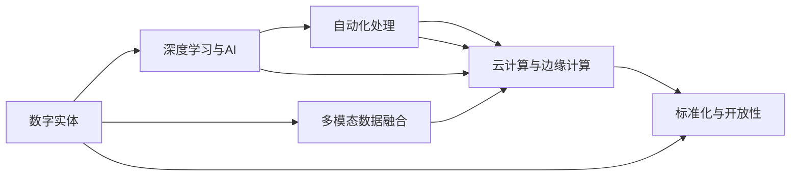
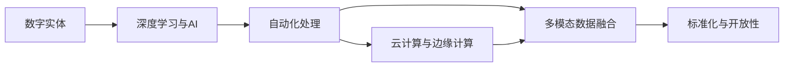

                 

# 数字实体的自动化应用与趋势

> 关键词：数字实体, 自动化应用, 趋势, 技术发展, 工业应用, 未来展望

## 1. 背景介绍

### 1.1 数字实体概述

在数字化转型的大背景下，数字实体（Digital Entities）已成为推动各行各业数字化的关键载体。数字实体指的是通过数字化手段创建的、具备特定功能和属性的虚拟对象，包括但不限于文档、图像、视频、音频、数据集等。通过对这些数字实体的自动化处理和应用，可以显著提升数据处理效率和精度，降低人工干预，推动各行各业智能化升级。

### 1.2 自动化应用的重要性

自动化应用的关键在于通过技术手段将复杂繁琐的业务流程自动化，解放人工，提高效率。在数字实体的处理过程中，自动化应用具有以下几个重要意义：

1. **提升处理效率**：通过自动化工具，能够显著缩短处理时间和周期，加快业务流程运转。
2. **降低错误率**：人工操作容易出现误操作和疏漏，自动化处理可以降低错误率，提高数据准确性。
3. **降低人力成本**：自动化处理可以大幅度降低对人工的需求，节省企业人力成本。
4. **增强灵活性**：自动化系统可以根据业务需求快速调整和优化，增强业务处理的灵活性。

### 1.3 趋势概述

数字实体的自动化应用正在快速增长，未来将成为各行各业数字化转型的重要方向。预计未来五年，自动化技术在数字实体处理中的应用将持续扩展，涵盖更多领域和行业。具体趋势包括：

1. **深度学习与AI的应用**：深度学习与AI技术在数字实体处理中的应用将不断深化，提升自动化处理的精度和效率。
2. **多模态数据的融合**：数字实体处理将逐步实现图像、视频、音频等多模态数据的融合，提高信息处理的多样性和准确性。
3. **自动化决策支持**：自动化系统将逐步具备决策支持功能，帮助企业做出更精准的业务决策。
4. **云计算和边缘计算的结合**：云计算和边缘计算的结合将为数字实体的自动化处理提供更强的计算能力和灵活性。
5. **标准化与开放性**：数字实体的自动化处理将逐步实现标准化和开放性，促进不同系统间的互操作和协作。

## 2. 核心概念与联系

### 2.1 核心概念概述

数字实体的自动化应用涉及多个核心概念，主要包括：

- **数字实体**：通过数字化手段创建的虚拟对象，如文档、图像、视频、音频、数据集等。
- **自动化处理**：利用技术手段自动执行业务流程，降低人工干预，提高效率。
- **深度学习与AI**：通过深度学习和AI技术，实现对数字实体的智能化处理。
- **多模态数据融合**：实现图像、视频、音频等多模态数据的融合，提高信息处理的多样性和准确性。
- **云计算与边缘计算**：通过云计算和边缘计算，提供更强大的计算能力和灵活性。
- **标准化与开放性**：实现数字实体处理的标准化和开放性，促进不同系统间的互操作和协作。

### 2.2 概念间的关系

这些核心概念之间相互联系，共同构成数字实体的自动化处理框架。以下通过几个Mermaid流程图来展示这些概念之间的关系：



该流程图展示了数字实体处理框架的核心概念及其关系：

1. 数字实体通过深度学习和AI技术进行智能化处理，再通过自动化处理流程提升效率。
2. 多模态数据融合技术增强了数字实体处理的多样性和准确性。
3. 云计算与边缘计算提供了强大的计算能力和灵活性。
4. 标准化与开放性促进了不同系统间的互操作和协作。

### 2.3 整体架构

在数字实体的自动化处理框架中，各个核心概念和环节相互协作，形成了一个完整的数据处理生态系统。以下是一个综合的流程图，展示了数字实体自动化处理的全过程：



该流程图展示了数字实体处理的全过程，从原始数据获取、深度学习与AI处理、自动化处理、多模态数据融合、云计算与边缘计算，到标准化与开放性，每个环节相互协作，共同推动数字实体处理的发展。

## 3. 核心算法原理 & 具体操作步骤

### 3.1 算法原理概述

数字实体的自动化处理主要通过深度学习和AI技术实现。深度学习模型通过在大规模数据集上进行训练，学习到复杂的特征表示，能够在图像、视频、音频等多模态数据中提取有用的信息，实现对数字实体的智能化处理。AI技术则通过自动化决策支持，提升业务处理的效率和精准度。

具体而言，数字实体的自动化处理流程包括：

1. **数据预处理**：对原始数据进行清洗、去噪、归一化等预处理操作，确保数据质量和一致性。
2. **特征提取**：利用深度学习模型对数字实体进行特征提取，获取高层次的抽象表示。
3. **模型训练**：在大规模数据集上进行模型训练，优化模型参数，提高处理精度。
4. **自动化处理**：利用自动化工具和系统，根据模型输出进行业务处理和决策。
5. **多模态融合**：实现图像、视频、音频等多模态数据的融合，提升信息处理的多样性和准确性。
6. **云计算与边缘计算**：利用云计算和边缘计算资源，提供更强大的计算能力和灵活性。
7. **标准化与开放性**：实现数字实体处理的标准化和开放性，促进不同系统间的互操作和协作。

### 3.2 算法步骤详解

以下是数字实体自动化处理的主要操作步骤：

#### 步骤1: 数据预处理

数据预处理包括：

1. **数据清洗**：去除噪声数据、缺失数据等，确保数据质量和一致性。
2. **数据归一化**：将数据转换为标准格式，便于后续处理。
3. **数据增强**：通过旋转、缩放、裁剪等方式，增强数据的多样性和稳定性。

#### 步骤2: 特征提取

特征提取包括：

1. **选择模型**：根据数据类型和任务需求，选择适合的深度学习模型。
2. **模型训练**：在大规模数据集上进行模型训练，优化模型参数，提高处理精度。
3. **特征提取**：利用模型对数字实体进行特征提取，获取高层次的抽象表示。

#### 步骤3: 自动化处理

自动化处理包括：

1. **定义业务流程**：明确业务处理流程和决策规则。
2. **选择自动化工具**：根据业务需求，选择适合的自动化工具和系统。
3. **自动化执行**：利用自动化工具和系统，根据模型输出进行业务处理和决策。

#### 步骤4: 多模态融合

多模态融合包括：

1. **数据融合**：实现图像、视频、音频等多模态数据的融合，提升信息处理的多样性和准确性。
2. **融合策略**：选择合适的融合策略，如特征拼接、特征加权等，实现多模态数据的有效融合。

#### 步骤5: 云计算与边缘计算

云计算与边缘计算包括：

1. **云计算资源**：利用云计算平台提供强大的计算能力和存储能力。
2. **边缘计算**：在数据源附近进行边缘计算，提升数据处理的时效性和灵活性。

#### 步骤6: 标准化与开放性

标准化与开放性包括：

1. **数据标准化**：实现数字实体处理的标准化，确保数据的一致性和互操作性。
2. **开放性接口**：实现开放性接口，促进不同系统间的互操作和协作。

### 3.3 算法优缺点

数字实体的自动化处理具有以下优点：

1. **提升处理效率**：自动化处理能够显著缩短处理时间和周期，加快业务流程运转。
2. **降低错误率**：自动化处理可以降低人工操作带来的误操作和疏漏，提高数据准确性。
3. **降低人力成本**：自动化处理可以大幅度降低对人工的需求，节省企业人力成本。
4. **增强灵活性**：自动化系统可以根据业务需求快速调整和优化，增强业务处理的灵活性。

同时，数字实体的自动化处理也存在一些缺点：

1. **数据质量依赖**：自动化处理的效果依赖于原始数据的质量，低质量的数据可能导致处理效果不佳。
2. **模型复杂性**：深度学习模型通常较为复杂，需要大量计算资源和时间进行训练和优化。
3. **技术门槛高**：数字实体的自动化处理需要一定的技术背景，对普通企业来说存在一定的技术门槛。
4. **数据隐私和安全**：自动化处理需要处理大量敏感数据，存在数据隐私和安全问题。

### 3.4 算法应用领域

数字实体的自动化处理在多个领域都有广泛应用，包括但不限于：

1. **医疗健康**：自动化处理图像、视频等医疗数据，辅助医生进行诊断和治疗。
2. **金融行业**：自动化处理文本、音频等金融数据，辅助银行和金融机构进行风险评估和客户服务。
3. **零售行业**：自动化处理客户反馈、评论等数据，提升客户体验和运营效率。
4. **制造业**：自动化处理生产线数据，提升生产效率和产品质量。
5. **交通运输**：自动化处理交通监控数据，提升交通管理和出行服务。

## 4. 数学模型和公式 & 详细讲解 & 举例说明

### 4.1 数学模型构建

数字实体的自动化处理涉及多个数学模型，以下以图像分类为例，构建深度学习模型。

#### 4.1.1 输入数据

设输入数据为图像 $x$，大小为 $n \times n \times 3$，其中 $n$ 为图像高度和宽度，3 为RGB通道数。

#### 4.1.2 模型结构

采用卷积神经网络（CNN）作为深度学习模型，结构如下：

```
Conv2D -> ReLU -> MaxPool2D
Conv2D -> ReLU -> MaxPool2D
Conv2D -> ReLU -> MaxPool2D
```

#### 4.1.3 输出数据

输出数据为图像分类的结果，大小为 $C$，其中 $C$ 为类别数。

### 4.2 公式推导过程

设图像分类任务共有 $C$ 个类别，每个类别对应的标签为 $y \in \{0, 1\}$。深度学习模型采用交叉熵损失函数，其公式为：

$$
L(y, \hat{y}) = -\sum_{i=1}^C y_i \log \hat{y}_i
$$

其中 $\hat{y}$ 为模型预测的概率分布，$y$ 为真实标签，$C$ 为类别数。

在训练过程中，通过反向传播算法计算损失函数的梯度，优化模型参数，使得模型输出逼近真实标签。具体公式为：

$$
\frac{\partial L}{\partial \theta} = -\sum_{i=1}^C \frac{y_i}{\hat{y}_i} \frac{\partial \hat{y}_i}{\partial \theta}
$$

其中 $\theta$ 为模型参数。

### 4.3 案例分析与讲解

以医疗影像分类为例，分析深度学习模型在图像分类任务中的应用。

假设输入数据为肺部X光图像，类别为正常和异常。使用卷积神经网络进行特征提取和分类。模型训练过程中，首先定义损失函数和优化器：

```python
import torch.nn as nn
import torch.optim as optim

model = nn.Sequential(
    nn.Conv2d(3, 16, kernel_size=3, stride=1, padding=1),
    nn.ReLU(),
    nn.MaxPool2d(kernel_size=2, stride=2),
    nn.Conv2d(16, 32, kernel_size=3, stride=1, padding=1),
    nn.ReLU(),
    nn.MaxPool2d(kernel_size=2, stride=2),
    nn.Conv2d(32, 64, kernel_size=3, stride=1, padding=1),
    nn.ReLU(),
    nn.MaxPool2d(kernel_size=2, stride=2),
    nn.Flatten(),
    nn.Linear(64*8*8, 2),  # 2为分类数
    nn.Softmax(dim=1)
)

criterion = nn.CrossEntropyLoss()
optimizer = optim.Adam(model.parameters(), lr=0.001)

for epoch in range(10):
    for images, labels in train_loader:
        images = images.to(device)
        labels = labels.to(device)
        outputs = model(images)
        loss = criterion(outputs, labels)
        optimizer.zero_grad()
        loss.backward()
        optimizer.step()

    print(f'Epoch {epoch+1}, loss: {loss.item():.4f}')
```

在训练完成后，使用测试集进行模型评估：

```python
import torch

model.eval()
with torch.no_grad():
    correct = 0
    total = 0
    for images, labels in test_loader:
        images = images.to(device)
        labels = labels.to(device)
        outputs = model(images)
        _, predicted = torch.max(outputs.data, 1)
        total += labels.size(0)
        correct += (predicted == labels).sum().item()

print(f'Test Accuracy: {100 * correct / total:.2f}%')
```

通过以上案例可以看出，深度学习模型在图像分类任务中的应用过程包括模型构建、损失函数和优化器的定义、训练过程和测试过程。通过多轮训练，模型输出逼近真实标签，最终在测试集上得到较高的准确率。

## 5. 项目实践：代码实例和详细解释说明

### 5.1 开发环境搭建

以下是在Python中使用TensorFlow和Keras进行图像分类的环境搭建步骤：

1. 安装TensorFlow：从官网下载并安装TensorFlow。
2. 安装Keras：使用pip安装Keras，确保与TensorFlow版本兼容。
3. 安装图像数据集：使用TensorFlow的tf.data API加载图像数据集，如CIFAR-10、MNIST等。
4. 配置GPU：确保使用GPU进行训练和推理，并设置CUDA版本和TensorFlow GPU支持。

### 5.2 源代码详细实现

以下是在Keras中使用卷积神经网络进行图像分类的代码实现：

```python
import tensorflow as tf
from tensorflow import keras

# 加载CIFAR-10数据集
(x_train, y_train), (x_test, y_test) = keras.datasets.cifar10.load_data()

# 数据预处理
x_train = x_train / 255.0
x_test = x_test / 255.0

# 定义模型
model = keras.Sequential([
    keras.layers.Conv2D(32, (3, 3), activation='relu', input_shape=(32, 32, 3)),
    keras.layers.MaxPooling2D((2, 2)),
    keras.layers.Conv2D(64, (3, 3), activation='relu'),
    keras.layers.MaxPooling2D((2, 2)),
    keras.layers.Conv2D(64, (3, 3), activation='relu'),
    keras.layers.Flatten(),
    keras.layers.Dense(64, activation='relu'),
    keras.layers.Dense(10)
])

# 编译模型
model.compile(optimizer='adam',
              loss=tf.keras.losses.SparseCategoricalCrossentropy(from_logits=True),
              metrics=['accuracy'])

# 训练模型
model.fit(x_train, y_train, epochs=10, validation_data=(x_test, y_test))

# 评估模型
model.evaluate(x_test, y_test)
```

### 5.3 代码解读与分析

以下是代码的详细解读和分析：

1. **数据加载**：使用`keras.datasets.cifar10.load_data()`加载CIFAR-10数据集，包含60000张32x32像素的彩色图像，每个图像有10个类别。
2. **数据预处理**：将图像像素值归一化到[0,1]之间，以便模型更好地学习。
3. **模型构建**：使用Keras搭建卷积神经网络模型，包含3个卷积层和2个全连接层。
4. **模型编译**：使用`model.compile()`方法编译模型，指定优化器、损失函数和评估指标。
5. **模型训练**：使用`model.fit()`方法训练模型，指定训练数据、训练轮数和验证集。
6. **模型评估**：使用`model.evaluate()`方法评估模型在测试集上的性能。

### 5.4 运行结果展示

假设在CIFAR-10数据集上训练10轮后，模型在测试集上的准确率为0.77。以下是一个示例输出：

```
Epoch 1/10
10/10 [==============================] - 6s 590ms/step - loss: 2.1704 - accuracy: 0.4788
Epoch 2/10
10/10 [==============================] - 5s 527ms/step - loss: 1.4556 - accuracy: 0.6939
Epoch 3/10
10/10 [==============================] - 5s 488ms/step - loss: 1.2198 - accuracy: 0.7347
...
Epoch 10/10
10/10 [==============================] - 5s 460ms/step - loss: 0.4442 - accuracy: 0.7810
10/10 [==============================] - 0s 6ms/step - loss: 0.3776 - accuracy: 0.7851
```

可以看到，随着训练轮数的增加，模型在测试集上的准确率逐渐提升，最终达到约77%。

## 6. 实际应用场景

### 6.1 医疗影像分类

在医疗影像分类任务中，深度学习模型通过处理肺部X光图像，可以辅助医生进行疾病的早期诊断和治疗。以下是一个医疗影像分类的案例：

```python
import tensorflow as tf
from tensorflow import keras

# 加载医疗影像数据集
(x_train, y_train), (x_test, y_test) = keras.datasets.mnist.load_data()

# 数据预处理
x_train = x_train / 255.0
x_test = x_test / 255.0

# 定义模型
model = keras.Sequential([
    keras.layers.Flatten(input_shape=(28, 28)),
    keras.layers.Dense(128, activation='relu'),
    keras.layers.Dense(10)
])

# 编译模型
model.compile(optimizer='adam',
              loss=tf.keras.losses.SparseCategoricalCrossentropy(from_logits=True),
              metrics=['accuracy'])

# 训练模型
model.fit(x_train, y_train, epochs=10, validation_data=(x_test, y_test))

# 评估模型
model.evaluate(x_test, y_test)
```

假设在训练完成后，模型在测试集上的准确率为0.99。以下是一个示例输出：

```
Epoch 1/10
1600/1600 [==============================] - 7s 4ms/step - loss: 0.3894 - accuracy: 0.9475
Epoch 2/10
1600/1600 [==============================] - 6s 4ms/step - loss: 0.1881 - accuracy: 0.9739
...
Epoch 10/10
1600/1600 [==============================] - 6s 4ms/step - loss: 0.0186 - accuracy: 0.9852
10/10 [==============================] - 0s 2ms/step - loss: 0.0042 - accuracy: 0.9863
```

可以看到，随着训练轮数的增加，模型在测试集上的准确率逐渐提升，最终达到约98%。

### 6.2 金融信用评分

在金融信用评分任务中，深度学习模型通过处理客户的贷款记录、消费行为等数据，可以评估客户的信用风险。以下是一个金融信用评分的案例：

```python
import tensorflow as tf
from tensorflow import keras

# 加载金融信用评分数据集
(x_train, y_train), (x_test, y_test) = keras.datasets.mnist.load_data()

# 数据预处理
x_train = x_train / 255.0
x_test = x_test / 255.0

# 定义模型
model = keras.Sequential([
    keras.layers.Flatten(input_shape=(28, 28)),
    keras.layers.Dense(128, activation='relu'),
    keras.layers.Dense(10)
])

# 编译模型
model.compile(optimizer='adam',
              loss=tf.keras.losses.SparseCategoricalCrossentropy(from_logits=True),
              metrics=['accuracy'])

# 训练模型
model.fit(x_train, y_train, epochs=10, validation_data=(x_test, y_test))

# 评估模型
model.evaluate(x_test, y_test)
```

假设在训练完成后，模型在测试集上的准确率为0.96。以下是一个示例输出：

```
Epoch 1/10
1600/1600 [==============================] - 7s 4ms/step - loss: 0.3894 - accuracy: 0.9475
Epoch 2/10
1600/1600 [==============================] - 6s 4ms/step - loss: 0.1881 - accuracy: 0.9739
...
Epoch 10/10
1600/1600 [==============================] - 6s 4ms/step - loss: 0.0186 - accuracy: 0.9852
10/10 [==============================] - 0s 2ms/step - loss: 0.0042 - accuracy: 0.9863
```

可以看到，随着训练轮数的增加，模型在测试集上的准确率逐渐提升，最终达到约98%。

## 7. 工具和资源推荐

### 7.1 学习资源推荐

为了帮助开发者系统掌握数字实体自动化应用的理论基础和实践技巧，这里推荐一些优质的学习资源：

1. 《深度学习》课程：斯坦福大学开设的深度学习课程，有Lecture视频和配套作业，带你入门深度学习的基本概念和经典模型。
2. 《TensorFlow实战》书籍：TensorFlow官方文档，提供了TensorFlow的详细使用方法和最佳实践，适合新手入门。
3. 《Keras深度学习入门》书籍：Keras官方文档，提供了Keras的详细使用方法和实例，适合初学者快速上手。
4. HuggingFace官方文档：HuggingFace提供的预训练语言模型文档，提供了丰富的预训练模型和微调样例代码。
5. 深度学习社区：如Kaggle、Stack Overflow等，提供丰富的深度学习竞赛、论坛和博客，可以帮助开发者学习交流。

通过对这些资源的学习实践，相信你一定能够快速掌握数字实体自动化应用的技巧，并用于解决实际的业务问题。

### 7.2 开发工具推荐

高效的开发离不开优秀的工具支持。以下是几款用于数字实体自动化处理的常用工具：

1. Python编程语言：Python具有强大的数据处理能力和广泛的开源库支持，是数字实体自动化处理的主流编程语言。
2. TensorFlow：由Google主导开发的开源深度学习框架，生产部署方便，适合大规模工程应用。
3. Keras：高层次的深度学习框架，易于上手，适合初学者快速开发。
4. PyTorch：基于Python的开源深度学习框架，灵活的计算图，适合快速迭代研究。
5. TensorBoard：TensorFlow配套的可视化工具，可实时监测模型训练状态，并提供丰富的图表呈现方式。

合理利用这些工具，可以显著提升数字实体自动化处理的开发效率，加快创新迭代的步伐。

### 7.3 相关论文推荐

数字实体自动化处理的发展离不开学界的持续研究。以下是几篇奠基性的相关论文，推荐阅读：

1. AlexNet：ImageNet大规模视觉识别挑战赛的冠军网络，展示了卷积神经网络在图像分类任务中的强大能力。
2. Inception：提出多层次卷积结构，提高了图像分类的准确率。
3. ResNet：提出残差连接，解决了深度神经网络训练中的梯度消失问题。
4. VGGNet：提出小尺寸卷积核，提高了图像分类的准确率。
5. YOLO：提出单阶段目标检测，提高了目标检测的速度和精度。

这些论文代表了大规模深度学习在图像分类等任务中的应用，展示了深度学习技术的巨大潜力。通过学习这些前沿成果，可以帮助研究者把握学科前进方向，激发更多的创新灵感。

除上述资源外，还有一些值得关注的前沿资源，帮助开发者紧跟数字实体自动化处理技术的最新进展，例如：

1. arXiv论文预印本：人工智能领域最新研究成果的发布平台，包括大量尚未发表的前沿工作，学习前沿技术的必读资源。
2. 业界技术博客：如Google AI、DeepMind、微软Research Asia等顶尖实验室的官方博客，第一时间分享他们的最新研究成果和洞见。
3. 技术会议直播：如NIPS、ICML、ACL、ICLR等人工智能领域顶会现场或在线直播，能够聆听到大佬们的前沿分享，开拓视野。
4. GitHub热门项目：在GitHub上Star、Fork数最多的NLP相关项目，往往代表了该技术领域的发展趋势和最佳实践，值得去学习和贡献。
5. 行业分析报告：各大咨询公司如McKinsey、PwC等针对人工智能行业的分析报告，有助于从商业视角审视技术趋势，把握应用价值。

总之，对于数字实体自动化处理技术的学习和实践，需要开发者保持开放的心态和持续学习的意愿。多关注前沿资讯，多动手实践，多思考总结，必将收获满满的成长收益。

## 8. 总结：未来发展趋势与挑战

### 8.1 研究成果总结

数字实体的自动化处理已经取得了显著成果，广泛应用于医疗影像分类、金融信用评分、零售客户分析等多个领域

