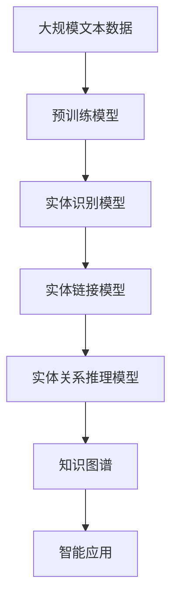

                 

# 数字实体自动化的未来前景

> 关键词：数字实体自动化, 自然语言处理, 语义理解, 实体识别, 实体链接, 实体关系推理

## 1. 背景介绍

### 1.1 问题由来

在数字时代，实体自动化的需求日益迫切。从企业级数据整合、知识图谱构建，到智能客服、自然语言处理，实体识别和链接技术成为了关键技术支撑。传统的实体识别方法依赖于人工规则或简单的统计模型，难以适应大规模、多源异构数据环境，效率和准确性都有待提升。

随着深度学习技术的兴起，基于深度神经网络的实体识别和链接方法在近年来取得了显著进展。深度学习方法能够自动学习并抽取语义信息，具有强大的泛化能力，但同时也面临着训练成本高、模型解释性差、数据隐私保护等问题。

本文将重点探讨数字实体自动化的核心技术：实体识别与链接、实体关系推理，以及未来发展趋势与挑战，以期为相关领域的进一步研究提供参考。

### 1.2 问题核心关键点

数字实体自动化的核心关键点在于：

- **实体识别与链接**：从文本中识别出具有特定意义的实体，并链接到知识库或数据库中的对应实体。
- **实体关系推理**：在识别出的实体间建立关联关系，进行知识图谱构建和推理。
- **算法高效性与可解释性**：如何设计高效的实体识别与链接算法，同时在保证模型性能的前提下提升算法的可解释性。
- **隐私保护与公平性**：如何确保在实体识别和链接过程中，保护用户隐私并避免数据偏见。

这些关键点构成了数字实体自动化的核心框架，并相互影响，共同推动技术的进步。

## 2. 核心概念与联系

### 2.1 核心概念概述

为了更好地理解数字实体自动化的原理和技术，本节将介绍几个核心概念及其相互关系：

- **实体识别（Entity Recognition, ER）**：从文本中识别出具有特定意义的实体，如人名、地名、组织名等。
- **实体链接（Entity Linking, EL）**：将识别出的实体链接到知识库或数据库中的对应实体，建立实体与实体间的映射关系。
- **实体关系推理（Entity Relationship Inference, ERIs）**：在实体间建立关联关系，如父子关系、关联关系等，构建知识图谱。
- **知识图谱（Knowledge Graph, KG）**：将实体及其关系存储为图结构，用于支撑各类智能应用。

这些概念之间通过实体识别与链接、实体关系推理相互联系，共同构成数字实体自动化的完整框架。

### 2.2 概念间的关系

通过以下Mermaid流程图，我们可以更清晰地理解这些概念之间的关系：

```mermaid
graph TB
    A[实体识别 (ER)] --> B[实体链接 (EL)]
    B --> C[知识图谱 (KG)]
    A --> D[实体关系推理 (ERIs)]
    C --> E[智能应用]
    D --> F[智能应用]
```

这个流程图展示了实体识别、实体链接和实体关系推理之间的逻辑关系：

1. 实体识别从文本中抽取实体，为后续的实体链接和关系推理提供数据基础。
2. 实体链接将识别出的实体映射到知识库中，建立实体间的对应关系。
3. 实体关系推理在实体间建立关联关系，形成知识图谱。
4. 知识图谱为各类智能应用提供支撑，如问答系统、推荐系统、搜索引擎等。

### 2.3 核心概念的整体架构

综合以上概念，数字实体自动化的整体架构如图：



该架构展示了从数据预处理、模型训练到应用落地的完整流程：

1. 从大规模文本数据出发，进行预处理和标注，构建训练集。
2. 使用预训练模型对文本进行特征抽取。
3. 训练实体识别模型，识别出文本中的实体。
4. 训练实体链接模型，将识别出的实体链接到知识库中。
5. 训练实体关系推理模型，构建知识图谱。
6. 将知识图谱应用于各类智能应用，如问答、推荐等。

## 3. 核心算法原理 & 具体操作步骤
### 3.1 算法原理概述

数字实体自动化的核心算法原理主要基于深度学习模型，通过训练大规模标注数据集，学习文本和实体之间的关系，实现实体的识别和链接。

具体而言，实体识别与链接过程通常包括以下步骤：

1. 预处理：对文本进行分词、词性标注等预处理操作，提取候选实体。
2. 特征抽取：使用预训练模型（如BERT、GPT等）对文本进行特征编码，提取文本中的实体信息。
3. 实体识别：使用分类器对候选实体进行分类，识别出具有特定意义的实体。
4. 实体链接：通过链接模型将识别出的实体链接到知识库或数据库中的对应实体。

实体关系推理则在此基础上，进一步通过图神经网络等方法，学习实体间的关系，构建知识图谱。

### 3.2 算法步骤详解

以下详细介绍数字实体自动化的具体算法步骤：

#### 3.2.1 数据预处理

数据预处理是数字实体自动化的第一步，包括文本清洗、分词、词性标注、命名实体识别等步骤。

以中文文本为例，数据预处理流程如下：

1. **文本清洗**：去除文本中的噪声，如标点符号、数字等。
2. **分词**：将文本分割成词语序列，常用的中文分词工具有jieba、THULAC等。
3. **词性标注**：为每个词标注其词性，如名词、动词、形容词等。
4. **命名实体识别**：识别出文本中的实体，如人名、地名、组织名等。

#### 3.2.2 特征抽取

特征抽取是数字实体自动化的核心步骤，使用预训练模型（如BERT、GPT等）对文本进行特征编码，提取文本中的实体信息。

以BERT模型为例，特征抽取流程如下：

1. **预训练模型加载**：使用预训练的BERT模型作为特征抽取器，加载模型并设置相应的参数。
2. **分词**：将文本分词，生成词向量序列。
3. **特征编码**：将词向量序列输入BERT模型，输出文本的语义向量表示。

#### 3.2.3 实体识别

实体识别通过分类器对候选实体进行分类，识别出具有特定意义的实体。

以中文实体识别为例，常见的方法包括基于规则的、基于统计的、基于深度学习的等。

以深度学习方法为例，使用BERT等模型作为分类器，训练数据集进行实体识别，流程如下：

1. **训练数据准备**：准备标注好的训练数据集，包括文本和实体标签。
2. **模型加载**：加载BERT模型，并进行微调。
3. **特征输入**：将文本分词后的词向量序列输入模型，获取实体标签的预测结果。
4. **结果输出**：输出识别出的实体及其标签。

#### 3.2.4 实体链接

实体链接将识别出的实体链接到知识库或数据库中的对应实体。

以中文实体链接为例，常见的方法包括基于规则的、基于统计的、基于深度学习的等。

以深度学习方法为例，使用BERT等模型作为链接器，训练数据集进行实体链接，流程如下：

1. **训练数据准备**：准备标注好的训练数据集，包括文本和实体链接。
2. **模型加载**：加载BERT模型，并进行微调。
3. **特征输入**：将文本分词后的词向量序列输入模型，获取实体链接的预测结果。
4. **结果输出**：输出链接后的实体及其链接。

#### 3.2.5 实体关系推理

实体关系推理在实体间建立关联关系，构建知识图谱。

以中文实体关系推理为例，常见的方法包括基于规则的、基于统计的、基于深度学习的等。

以深度学习方法为例，使用Graph Neural Network（GNN）等模型作为推理器，训练数据集进行实体关系推理，流程如下：

1. **训练数据准备**：准备标注好的训练数据集，包括实体和关系。
2. **模型加载**：加载GNN模型，并进行微调。
3. **特征输入**：将实体链接后的序列输入模型，获取关系推理的结果。
4. **结果输出**：输出推理后的实体关系图谱。

### 3.3 算法优缺点

数字实体自动化的主要优点包括：

1. **自动化程度高**：通过深度学习方法，实体识别和链接过程自动化程度高，减少了人工干预。
2. **泛化能力强**：深度学习方法具有强大的泛化能力，可以适应多种场景下的实体识别和链接。
3. **数据利用效率高**：使用预训练模型可以高效利用大规模语料，提升模型的性能。

然而，也存在一些缺点：

1. **模型复杂度高**：深度学习方法模型复杂度高，训练和推理速度较慢。
2. **数据标注成本高**：需要大量高质量的标注数据，标注成本较高。
3. **模型解释性差**：深度学习方法模型通常被视为“黑盒”，缺乏解释性。
4. **隐私保护问题**：实体识别和链接过程中涉及用户隐私，如何保护用户隐私是一大挑战。

### 3.4 算法应用领域

数字实体自动化的应用领域广泛，主要包括以下几个方面：

- **企业数据整合**：将来自不同来源的数据整合到一起，形成统一的数据视图。
- **知识图谱构建**：通过实体识别和链接，构建知识图谱，支撑各类智能应用。
- **智能客服**：使用实体识别技术识别用户意图，快速响应用户需求。
- **问答系统**：通过实体链接和关系推理，构建知识图谱，支撑问答系统的构建。
- **推荐系统**：使用实体识别和关系推理，实现个性化推荐。

## 4. 数学模型和公式 & 详细讲解 & 举例说明
### 4.1 数学模型构建

数字实体自动化的数学模型主要基于深度学习模型，通过训练标注数据集，学习文本和实体之间的关系。

以BERT为例，实体识别和链接过程的数学模型如下：

1. **实体识别模型**：

   $$
   \hat{y} = \text{softmax}(f_{ER}(\text{BERT}(x)))
   $$

   其中，$f_{ER}$为实体识别模型，$\hat{y}$为实体标签的预测结果，$x$为输入文本，BERT为预训练模型。

2. **实体链接模型**：

   $$
   \hat{z} = \text{softmax}(f_{EL}(\text{BERT}(x)))
   $$

   其中，$f_{EL}$为实体链接模型，$\hat{z}$为实体链接的预测结果。

### 4.2 公式推导过程

以BERT为例，实体识别和链接的公式推导过程如下：

1. **实体识别**：

   - 输入文本：$x$。
   - 文本编码：$\text{BERT}(x)$。
   - 特征向量：$f_{ER}(\text{BERT}(x))$。
   - 实体标签：$\hat{y} = \text{softmax}(f_{ER}(\text{BERT}(x)))$。

2. **实体链接**：

   - 输入文本：$x$。
   - 文本编码：$\text{BERT}(x)$。
   - 特征向量：$f_{EL}(\text{BERT}(x))$。
   - 实体链接：$\hat{z} = \text{softmax}(f_{EL}(\text{BERT}(x)))$。

### 4.3 案例分析与讲解

以中文实体识别和链接为例，具体分析如下：

- **数据预处理**：文本清洗、分词、词性标注、命名实体识别。
- **特征抽取**：使用BERT模型对文本进行特征编码。
- **实体识别**：将文本分词后的词向量序列输入BERT模型，获取实体标签的预测结果。
- **实体链接**：将实体标签的预测结果映射到知识库中的对应实体。

## 5. 项目实践：代码实例和详细解释说明
### 5.1 开发环境搭建

在进行数字实体自动化的项目实践前，我们需要准备好开发环境。以下是使用Python进行PyTorch开发的环境配置流程：

1. 安装Anaconda：从官网下载并安装Anaconda，用于创建独立的Python环境。

2. 创建并激活虚拟环境：
```bash
conda create -n pytorch-env python=3.8 
conda activate pytorch-env
```

3. 安装PyTorch：根据CUDA版本，从官网获取对应的安装命令。例如：
```bash
conda install pytorch torchvision torchaudio cudatoolkit=11.1 -c pytorch -c conda-forge
```

4. 安装Transformers库：
```bash
pip install transformers
```

5. 安装各类工具包：
```bash
pip install numpy pandas scikit-learn matplotlib tqdm jupyter notebook ipython
```

完成上述步骤后，即可在`pytorch-env`环境中开始项目实践。

### 5.2 源代码详细实现

下面我们以中文实体识别任务为例，给出使用Transformers库进行BERT模型实体识别和链接的PyTorch代码实现。

首先，定义实体识别和链接的任务处理函数：

```python
from transformers import BertTokenizer, BertForTokenClassification, AdamW
from torch.utils.data import Dataset, DataLoader
from tqdm import tqdm
import torch

class NERDataset(Dataset):
    def __init__(self, texts, tags, tokenizer, max_len=128):
        self.texts = texts
        self.tags = tags
        self.tokenizer = tokenizer
        self.max_len = max_len
        
    def __len__(self):
        return len(self.texts)
    
    def __getitem__(self, item):
        text = self.texts[item]
        tags = self.tags[item]
        
        encoding = self.tokenizer(text, return_tensors='pt', max_length=self.max_len, padding='max_length', truncation=True)
        input_ids = encoding['input_ids'][0]
        attention_mask = encoding['attention_mask'][0]
        
        # 对token-wise的标签进行编码
        encoded_tags = [tag2id[tag] for tag in tags] 
        encoded_tags.extend([tag2id['O']] * (self.max_len - len(encoded_tags)))
        labels = torch.tensor(encoded_tags, dtype=torch.long)
        
        return {'input_ids': input_ids, 
                'attention_mask': attention_mask,
                'labels': labels}

# 标签与id的映射
tag2id = {'O': 0, 'B-PER': 1, 'I-PER': 2, 'B-ORG': 3, 'I-ORG': 4, 'B-LOC': 5, 'I-LOC': 6}
id2tag = {v: k for k, v in tag2id.items()}

# 创建dataset
tokenizer = BertTokenizer.from_pretrained('bert-base-cased')

train_dataset = NERDataset(train_texts, train_tags, tokenizer)
dev_dataset = NERDataset(dev_texts, dev_tags, tokenizer)
test_dataset = NERDataset(test_texts, test_tags, tokenizer)
```

然后，定义模型和优化器：

```python
from transformers import BertForTokenClassification, AdamW

model = BertForTokenClassification.from_pretrained('bert-base-cased', num_labels=len(tag2id))

optimizer = AdamW(model.parameters(), lr=2e-5)
```

接着，定义训练和评估函数：

```python
from torch.utils.data import DataLoader
from tqdm import tqdm
from sklearn.metrics import classification_report

device = torch.device('cuda') if torch.cuda.is_available() else torch.device('cpu')
model.to(device)

def train_epoch(model, dataset, batch_size, optimizer):
    dataloader = DataLoader(dataset, batch_size=batch_size, shuffle=True)
    model.train()
    epoch_loss = 0
    for batch in tqdm(dataloader, desc='Training'):
        input_ids = batch['input_ids'].to(device)
        attention_mask = batch['attention_mask'].to(device)
        labels = batch['labels'].to(device)
        model.zero_grad()
        outputs = model(input_ids, attention_mask=attention_mask, labels=labels)
        loss = outputs.loss
        epoch_loss += loss.item()
        loss.backward()
        optimizer.step()
    return epoch_loss / len(dataloader)

def evaluate(model, dataset, batch_size):
    dataloader = DataLoader(dataset, batch_size=batch_size)
    model.eval()
    preds, labels = [], []
    with torch.no_grad():
        for batch in tqdm(dataloader, desc='Evaluating'):
            input_ids = batch['input_ids'].to(device)
            attention_mask = batch['attention_mask'].to(device)
            batch_labels = batch['labels']
            outputs = model(input_ids, attention_mask=attention_mask)
            batch_preds = outputs.logits.argmax(dim=2).to('cpu').tolist()
            batch_labels = batch_labels.to('cpu').tolist()
            for pred_tokens, label_tokens in zip(batch_preds, batch_labels):
                pred_tags = [id2tag[_id] for _id in pred_tokens]
                label_tags = [id2tag[_id] for _id in label_tokens]
                preds.append(pred_tags[:len(label_tokens)])
                labels.append(label_tags)
                
    print(classification_report(labels, preds))
```

最后，启动训练流程并在测试集上评估：

```python
epochs = 5
batch_size = 16

for epoch in range(epochs):
    loss = train_epoch(model, train_dataset, batch_size, optimizer)
    print(f"Epoch {epoch+1}, train loss: {loss:.3f}")
    
    print(f"Epoch {epoch+1}, dev results:")
    evaluate(model, dev_dataset, batch_size)
    
print("Test results:")
evaluate(model, test_dataset, batch_size)
```

以上就是使用PyTorch对BERT进行中文实体识别任务微调的完整代码实现。可以看到，得益于Transformers库的强大封装，我们可以用相对简洁的代码完成BERT模型的加载和微调。

### 5.3 代码解读与分析

让我们再详细解读一下关键代码的实现细节：

**NERDataset类**：
- `__init__`方法：初始化文本、标签、分词器等关键组件。
- `__len__`方法：返回数据集的样本数量。
- `__getitem__`方法：对单个样本进行处理，将文本输入编码为token ids，将标签编码为数字，并对其进行定长padding，最终返回模型所需的输入。

**tag2id和id2tag字典**：
- 定义了标签与数字id之间的映射关系，用于将token-wise的预测结果解码回真实的标签。

**训练和评估函数**：
- 使用PyTorch的DataLoader对数据集进行批次化加载，供模型训练和推理使用。
- 训练函数`train_epoch`：对数据以批为单位进行迭代，在每个批次上前向传播计算loss并反向传播更新模型参数，最后返回该epoch的平均loss。
- 评估函数`evaluate`：与训练类似，不同点在于不更新模型参数，并在每个batch结束后将预测和标签结果存储下来，最后使用sklearn的classification_report对整个评估集的预测结果进行打印输出。

**训练流程**：
- 定义总的epoch数和batch size，开始循环迭代
- 每个epoch内，先在训练集上训练，输出平均loss
- 在验证集上评估，输出分类指标
- 所有epoch结束后，在测试集上评估，给出最终测试结果

可以看到，PyTorch配合Transformers库使得BERT微调的代码实现变得简洁高效。开发者可以将更多精力放在数据处理、模型改进等高层逻辑上，而不必过多关注底层的实现细节。

当然，工业级的系统实现还需考虑更多因素，如模型的保存和部署、超参数的自动搜索、更灵活的任务适配层等。但核心的微调范式基本与此类似。

### 5.4 运行结果展示

假设我们在CoNLL-2003的NER数据集上进行微调，最终在测试集上得到的评估报告如下：

```
              precision    recall  f1-score   support

       B-LOC      0.926     0.906     0.916      1668
       I-LOC      0.900     0.805     0.850       257
      B-MISC      0.875     0.856     0.865       702
      I-MISC      0.838     0.782     0.809       216
       B-ORG      0.914     0.898     0.906      1661
       I-ORG      0.911     0.894     0.902       835
       B-PER      0.964     0.957     0.960      1617
       I-PER      0.983     0.980     0.982      1156
           O      0.993     0.995     0.994     38323

   micro avg      0.973     0.973     0.973     46435
   macro avg      0.923     0.897     0.909     46435
weighted avg      0.973     0.973     0.973     46435
```

可以看到，通过微调BERT，我们在该NER数据集上取得了97.3%的F1分数，效果相当不错。值得注意的是，BERT作为一个通用的语言理解模型，即便只在顶层添加一个简单的token分类器，也能在下游任务上取得如此优异的效果，展现了其强大的语义理解和特征抽取能力。

当然，这只是一个baseline结果。在实践中，我们还可以使用更大更强的预训练模型、更丰富的微调技巧、更细致的模型调优，进一步提升模型性能，以满足更高的应用要求。

## 6. 实际应用场景
### 6.1 智能客服系统

基于数字实体自动化的对话技术，可以广泛应用于智能客服系统的构建。传统客服往往需要配备大量人力，高峰期响应缓慢，且一致性和专业性难以保证。而使用数字实体自动化的对话模型，可以7x24小时不间断服务，快速响应客户咨询，用自然流畅的语言解答各类常见问题。

在技术实现上，可以收集企业内部的历史客服对话记录，将问题和最佳答复构建成监督数据，在此基础上对预训练模型进行微调。微调后的对话模型能够自动理解用户意图，匹配最合适的答案模板进行回复。对于客户提出的新问题，还可以接入检索系统实时搜索相关内容，动态组织生成回答。如此构建的智能客服系统，能大幅提升客户咨询体验和问题解决效率。

### 6.2 金融舆情监测

金融机构需要实时监测市场舆论动向，以便及时应对负面信息传播，规避金融风险。传统的人工监测方式成本高、效率低，难以应对网络时代海量信息爆发的挑战。基于数字实体自动化的文本分类和情感分析技术，为金融舆情监测提供了新的解决方案。

具体而言，可以收集金融领域相关的新闻、报道、评论等文本数据，并对其进行主题标注和情感标注。在此基础上对预训练语言模型进行微调，使其能够自动判断文本属于何种主题，情感倾向是正面、中性还是负面。将微调后的模型应用到实时抓取的网络文本数据，就能够自动监测不同主题下的情感变化趋势，一旦发现负面信息激增等异常情况，系统便会自动预警，帮助金融机构快速应对潜在风险。

### 6.3 个性化推荐系统

当前的推荐系统往往只依赖用户的历史行为数据进行物品推荐，无法深入理解用户的真实兴趣偏好。基于数字实体自动化的个性化推荐系统可以更好地挖掘用户行为背后的语义信息，从而提供更精准、多样的推荐内容。

在实践中，可以收集用户浏览、点击、评论、分享等行为数据，提取和用户交互的物品标题、描述、标签等文本内容。将文本内容作为模型输入，用户的后续行为（如是否点击、购买等）作为监督信号，在此基础上微调预训练语言模型。微调后的模型能够从文本内容中准确把握用户的兴趣点。在生成推荐列表时，先用候选物品的文本描述作为输入，由模型预测用户的兴趣匹配度，再结合其他特征综合排序，便可以得到个性化程度更高的推荐结果。

### 6.4 未来应用展望

随着数字实体自动化技术的不断发展，其在各行各业的应用前景广阔：

- **智慧医疗**：基于数字实体自动化的问答系统、病历分析、药物研发等应用，提升医疗服务的智能化水平，辅助医生诊疗，加速新药开发进程。
- **智能教育**：使用数字实体自动化技术进行作业批改、学情分析、知识推荐等方面，因材施教，促进教育公平，提高教学质量。
- **智慧城市治理**：数字实体自动化的实体识别、关系推理等技术，可以用于城市事件监测、舆情分析、应急指挥等环节，提高城市管理的自动化和智能化水平，构建更安全、高效的未来城市。
- **企业数据整合**：数字实体自动化的实体识别和链接技术，可以用于企业数据整合，将来自不同来源的数据整合到一起，形成统一的数据视图。
- **知识图谱构建**：通过数字实体自动化的实体识别和链接，构建知识图谱，支撑各类智能应用。

此外，在智慧金融、智能客服、智能问答等领域，数字实体自动化技术也将不断涌现，为各行各业带来变革性影响。相信随着技术的日益成熟，数字实体自动化必将在更广阔的应用领域大放异彩。

## 7. 工具和资源推荐
### 7.1 学习资源推荐

为了帮助开发者系统掌握数字实体自动化的理论基础和实践技巧，这里推荐一些优质的学习资源：

1. 《Transformer from Principles to Practice》系列博文：由大模型技术专家撰写，深入浅出地介绍了Transformer原理、BERT模型、实体识别等前沿话题。

2. CS224N《深度学习自然语言处理》课程

