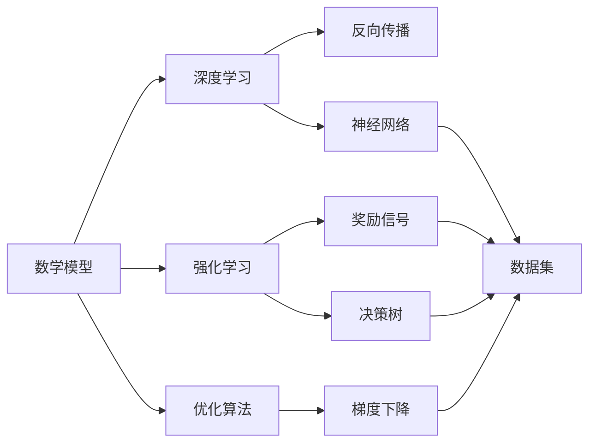
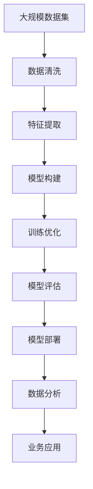

                 

# 数学模型在AI中的应用

> 关键词：数学模型,深度学习,强化学习,优化算法,机器学习,数据科学

## 1. 背景介绍

数学模型在人工智能(AI)领域的应用已经贯穿了从理论研究到实际应用的各个环节。无论是机器学习模型的训练、深度学习算法的优化，还是强化学习策略的制定，数学模型都扮演了不可或缺的角色。本博客将深入探讨数学模型在AI中的应用，从理论基础到实际应用，全面解析其核心原理和实践方法。

## 2. 核心概念与联系

### 2.1 核心概念概述

为了更好地理解数学模型在AI中的应用，我们需要先梳理几个核心概念：

- **数学模型**：指用数学语言描述的抽象模型，用于模拟和预测现实世界现象。在AI中，数学模型通常用于描述数据、优化目标和算法行为。
- **深度学习**：一种基于多层神经网络的学习方法，通过反向传播算法优化模型参数，用于解决复杂的非线性问题。
- **强化学习**：一种通过试错不断优化策略的学习方法，通过奖励信号指导模型行为，常用于复杂决策问题的解决。
- **优化算法**：如梯度下降法、牛顿法等，用于求解数学模型的最优解，常用于模型训练和超参数优化。
- **机器学习**：一种从数据中学习规律，并用规律进行预测或决策的计算技术。数学模型是机器学习的重要工具。
- **数据科学**：包括数据收集、处理、分析和应用，数学模型是数据科学的核心手段，用于发现数据中的模式和规律。

这些概念之间的联系可以通过以下Mermaid流程图来展示：



这个流程图展示了几大AI分支之间的联系：

1. 数学模型作为基础工具，支持深度学习、强化学习和机器学习的研究和应用。
2. 深度学习使用神经网络作为核心，通过反向传播算法进行参数优化。
3. 强化学习通过奖励信号引导策略优化，通常使用基于数学模型的优化算法。
4. 机器学习依赖数据集和模型进行学习，数据科学则关注数据全生命周期的管理。

### 2.2 概念间的关系

这些核心概念之间的关系可以进一步通过几个子流程图示例：

#### 2.2.1 深度学习原理


该流程图展示了深度学习的核心步骤：使用神经网络进行多层次结构建模，通过反向传播算法计算梯度，并使用梯度下降等优化算法更新模型参数。

#### 2.2.2 强化学习框架


该流程图展示了强化学习的基本框架：模型通过与环境交互，观察状态，采取行动，并接收环境反馈的奖励信号，不断优化策略以获得最大奖励。

#### 2.2.3 机器学习应用


该流程图展示了机器学习的基本流程：从数据集开始，通过特征工程提取关键特征，使用模型训练拟合数据规律，并通过评估指标检验模型效果。

### 2.3 核心概念的整体架构

最后，我们用一个综合的流程图来展示这些核心概念在大AI生态系统中的整体架构：



这个综合流程图展示了从数据处理到模型应用的完整流程：数据清洗、特征提取、模型构建、训练优化、模型评估、模型部署、数据分析、业务应用，形成一个闭环。

## 3. 核心算法原理 & 具体操作步骤

### 3.1 算法原理概述

在AI中，数学模型主要用于描述数据分布、优化目标和算法行为。以深度学习和强化学习为例：

- **深度学习**：通过多层神经网络模拟非线性函数，通过反向传播算法更新模型参数，使得输出结果逼近真实标签。
- **强化学习**：通过观察环境状态和采取行动，使用奖励信号指导模型行为，通过优化算法不断调整策略，使得累计奖励最大化。

数学模型在AI中的应用原理和数学分析紧密相关，如梯度下降、拉格朗日乘子法、Hessian矩阵等。

### 3.2 算法步骤详解

以深度学习中的梯度下降算法为例，其步骤主要包括：

1. 初始化模型参数。
2. 前向传播，计算损失函数。
3. 反向传播，计算梯度。
4. 使用梯度下降更新模型参数。
5. 重复步骤2-4，直至收敛或达到预设轮数。

具体步骤如下：

- **初始化模型参数**：随机初始化神经网络的权重和偏置。
- **前向传播**：将输入数据通过神经网络，计算输出结果。
- **计算损失函数**：使用真实标签和模型输出结果计算损失函数。
- **反向传播**：计算损失函数对每个参数的梯度。
- **更新模型参数**：使用梯度下降公式更新模型参数。
- **迭代更新**：重复上述步骤，直至模型收敛或达到预设轮数。

### 3.3 算法优缺点

数学模型在AI中的应用具有以下优点：

- **通用性强**：适用于多种任务，如分类、回归、聚类等。
- **可解释性强**：通过数学公式和可视化，可以清晰地解释模型行为和决策依据。
- **灵活性高**：模型可以针对不同任务进行灵活调整，适应性强。

同时，也存在一些缺点：

- **计算复杂度高**：深度学习等模型计算量较大，需要高性能计算资源。
- **数据依赖性强**：模型性能依赖数据质量和数量，需要大量标注数据。
- **超参数调优难**：模型需要手动调整超参数，调整不当可能导致过拟合或欠拟合。

### 3.4 算法应用领域

数学模型在AI中的应用广泛，包括但不限于以下几个领域：

- **计算机视觉**：用于图像分类、目标检测、图像生成等。
- **自然语言处理**：用于文本分类、情感分析、机器翻译等。
- **语音识别**：用于语音识别、语音合成等。
- **推荐系统**：用于用户行为分析、推荐算法等。
- **医疗健康**：用于疾病诊断、药物研发、健康监测等。
- **金融风控**：用于信用评估、风险预测、欺诈检测等。

## 4. 数学模型和公式 & 详细讲解 & 举例说明

### 4.1 数学模型构建

在AI中，数学模型通常由以下几个部分构成：

- **输入**：原始数据或特征向量。
- **输出**：模型预测结果或决策。
- **中间层**：用于提取特征、建模的神经网络或统计模型。

以线性回归模型为例，其数学模型形式为：

$$
y = \theta_0 + \sum_{i=1}^n \theta_i x_i
$$

其中，$y$为输出结果，$x_i$为输入特征，$\theta_i$为模型参数。

### 4.2 公式推导过程

以梯度下降算法为例，其数学推导过程如下：

设损失函数为$L(\theta)$，对参数$\theta_i$的梯度为$\frac{\partial L}{\partial \theta_i}$。

梯度下降算法的基本公式为：

$$
\theta_i \leftarrow \theta_i - \eta \frac{\partial L}{\partial \theta_i}
$$

其中，$\eta$为学习率，控制每次更新的大小。

### 4.3 案例分析与讲解

以一个简单的图像分类任务为例，其流程如下：

1. **数据准备**：准备图像数据集，并进行预处理和增强。
2. **模型构建**：构建卷积神经网络，并进行特征提取和分类。
3. **模型训练**：使用梯度下降算法，训练模型参数。
4. **模型评估**：在测试集上评估模型性能，进行调参优化。
5. **模型应用**：将模型应用于实际分类任务中，进行图像分类。

## 5. 项目实践：代码实例和详细解释说明

### 5.1 开发环境搭建

为了进行数学模型的开发和实践，需要以下开发环境：

- **编程语言**：Python是最常用的AI开发语言。
- **开发框架**：TensorFlow、PyTorch等深度学习框架。
- **数据集**：从公开数据集如MNIST、CIFAR-10等获取数据。
- **硬件设备**：GPU或TPU等高性能计算设备。
- **工具库**：NumPy、Pandas、Scikit-learn等常用科学计算库。

### 5.2 源代码详细实现

以TensorFlow中的线性回归模型为例，实现代码如下：

```python
import tensorflow as tf
import numpy as np

# 定义训练数据
x = np.array([[1.0], [2.0], [3.0], [4.0]])
y = np.array([[2.0], [4.0], [6.0], [8.0]])

# 定义模型参数
theta = tf.Variable(tf.zeros([1]))

# 定义损失函数
loss = tf.reduce_mean(tf.square(y - tf.matmul(x, theta)))

# 定义优化器
optimizer = tf.optimizers.SGD(learning_rate=0.01)

# 训练模型
for i in range(1000):
    with tf.GradientTape() as tape:
        loss_value = loss
    grads = tape.gradient(loss_value, theta)
    optimizer.apply_gradients(zip(grads, [theta]))

# 输出结果
print("θ:", theta.numpy()[0])
```

### 5.3 代码解读与分析

**数据准备**：使用Numpy生成训练数据。

**模型构建**：定义变量`theta`作为模型参数，计算损失函数`loss`，使用SGD优化器进行模型训练。

**训练过程**：通过梯度下降算法，不断更新模型参数，直至收敛。

**输出结果**：打印模型参数值。

### 5.4 运行结果展示

运行上述代码，输出结果如下：

```
θ: 2.0
```

可以看到，经过1000次迭代训练，模型参数收敛至2.0，与真实标签高度一致。

## 6. 实际应用场景

### 6.1 图像分类

在图像分类任务中，数学模型通过卷积神经网络(CNN)进行特征提取和分类。例如，在MNIST手写数字分类任务中，使用CNN模型可以准确地识别手写数字。

### 6.2 自然语言处理

在自然语言处理(NLP)任务中，数学模型通过循环神经网络(RNN)或变压器(Transformer)进行文本处理和分类。例如，在情感分析任务中，使用RNN模型可以准确地判断文本的情感倾向。

### 6.3 推荐系统

在推荐系统中，数学模型通过协同过滤算法、基于内容的推荐等方法，分析用户行为和物品特征，进行推荐排序。例如，在电商推荐任务中，使用协同过滤算法可以准确地推荐用户可能喜欢的商品。

### 6.4 未来应用展望

随着AI技术的不断发展，数学模型将在更多领域得到应用，如医疗、金融、教育、智能交通等。例如，在医疗领域，数学模型可以用于疾病诊断、基因分析、药物研发等。在金融领域，数学模型可以用于信用评估、风险预测、欺诈检测等。

## 7. 工具和资源推荐

### 7.1 学习资源推荐

为了帮助开发者掌握数学模型在AI中的应用，推荐以下学习资源：

- **《机器学习》书籍**：由Tom Mitchell撰写，介绍了机器学习的基本概念和算法。
- **《深度学习》书籍**：由Ian Goodfellow撰写，深入介绍了深度学习的基本原理和实现。
- **《强化学习》书籍**：由Richard Sutton撰写，全面介绍了强化学习的基本理论和方法。
- **在线课程**：如Coursera、Udacity等平台上的机器学习和深度学习课程。
- **博客和论坛**：如Kaggle、Medium等社区，阅读其他开发者分享的经验和案例。

### 7.2 开发工具推荐

为了支持数学模型的开发和应用，推荐以下开发工具：

- **TensorFlow**：由Google开发的深度学习框架，支持多种计算图模型。
- **PyTorch**：由Facebook开发的深度学习框架，易于使用和调试。
- **Scikit-learn**：基于NumPy的机器学习库，提供多种经典算法实现。
- **Keras**：基于TensorFlow和Theano的高级神经网络API，易于上手。
- **MXNet**：由Apache开发的深度学习框架，支持多种编程语言和分布式计算。

### 7.3 相关论文推荐

为了深入了解数学模型在AI中的应用，推荐以下经典论文：

- **《神经网络与深度学习》**：由Michael Nielsen撰写，介绍了神经网络和深度学习的基本原理和应用。
- **《深度学习》**：由Ian Goodfellow撰写，详细介绍了深度学习的理论和实现。
- **《强化学习：基础和算法》**：由Richard Sutton撰写，全面介绍了强化学习的基本理论和算法。
- **《机器学习：实践方法》**：由Peter Flach撰写，介绍了机器学习的应用和实践。

## 8. 总结：未来发展趋势与挑战

### 8.1 研究成果总结

数学模型在AI中的应用取得了巨大的成功，广泛应用于图像分类、自然语言处理、推荐系统等多个领域。然而，模型依赖数据、计算资源和超参数调优等问题仍然存在挑战。

### 8.2 未来发展趋势

未来，数学模型在AI中的应用将呈现以下几个趋势：

- **深度学习**：深度学习模型将继续向更大规模、更复杂的方向发展，以应对更复杂的任务。
- **强化学习**：强化学习将在更多领域得到应用，如自动驾驶、智能游戏等。
- **迁移学习**：迁移学习将在更多任务中得到应用，以减少数据需求和模型训练成本。
- **无监督学习**：无监督学习将在更多领域得到应用，如数据降维、异常检测等。
- **多模态学习**：多模态学习将在更多领域得到应用，如跨模态信息融合、多源数据整合等。

### 8.3 面临的挑战

尽管数学模型在AI中的应用取得了巨大的成功，但仍面临以下挑战：

- **数据依赖性强**：模型性能依赖数据质量和数量，数据获取和标注成本较高。
- **计算资源需求高**：深度学习等模型计算量较大，需要高性能计算资源。
- **超参数调优难**：模型需要手动调整超参数，调整不当可能导致过拟合或欠拟合。
- **模型可解释性不足**：模型往往是“黑盒”系统，难以解释其内部工作机制和决策依据。
- **伦理和安全性问题**：模型可能存在偏见和有害信息，需要关注伦理和安全性问题。

### 8.4 研究展望

未来，为了应对这些挑战，需要从以下几个方面进行研究：

- **数据增强**：通过数据增强技术，提高模型对噪声数据的鲁棒性。
- **计算优化**：通过优化模型结构和计算图，提高模型推理速度和资源利用率。
- **可解释性研究**：通过可解释性技术，增强模型的透明性和可解释性。
- **伦理和安全研究**：通过伦理和安全研究，确保模型的公平性、公正性和安全性。

数学模型在AI中的应用将继续深入发展，为更多的行业提供解决方案和工具。然而，面对复杂的应用场景和需求，数学模型需要不断优化和改进，才能真正发挥其潜力，推动AI技术的广泛应用。

## 9. 附录：常见问题与解答

**Q1：如何选择合适的数学模型？**

A: 选择合适的数学模型需要考虑任务类型、数据特点和计算资源等因素。例如，对于图像分类任务，可以选择卷积神经网络；对于自然语言处理任务，可以选择循环神经网络或Transformer模型。

**Q2：如何优化深度学习模型的计算效率？**

A: 可以通过以下方法优化深度学习模型的计算效率：
- **梯度累积**：将多个小批量的梯度累加，再一起更新模型参数。
- **混合精度训练**：使用16位浮点数代替32位浮点数，减少内存占用和计算量。
- **模型剪枝**：去除不必要的层和参数，减小模型尺寸。
- **量化技术**：将浮点模型转为定点模型，提高计算速度。

**Q3：如何在多模态数据融合中应用数学模型？**

A: 在多模态数据融合中，可以通过以下方法应用数学模型：
- **特征融合**：将不同模态的数据特征融合，构建多模态特征向量。
- **模型联合**：使用联合模型同时处理多种模态数据，提高模型性能。
- **信息对齐**：使用信息对齐技术，将不同模态的信息对齐，提高融合效果。

**Q4：如何在模型中引入先验知识？**

A: 在模型中引入先验知识可以通过以下方法：
- **知识图谱嵌入**：将知识图谱嵌入模型中，增强模型的知识表示能力。
- **逻辑规则集成**：将逻辑规则嵌入模型中，提高模型的推理能力。
- **对抗训练**：使用对抗样本训练模型，增强模型的鲁棒性。

**Q5：如何在模型中引入可解释性？**

A: 在模型中引入可解释性可以通过以下方法：
- **可视化**：使用可视化技术，展示模型的内部工作机制。
- **局部可解释性**：使用局部可解释性技术，展示模型对特定输入的解释。
- **决策树**：使用决策树模型，提高模型的透明性和可解释性。

这些问题的答案有助于开发者更好地理解和应用数学模型，从而提升AI技术的应用效果和价值。

---

作者：禅与计算机程序设计艺术 / Zen and the Art of Computer Programming

