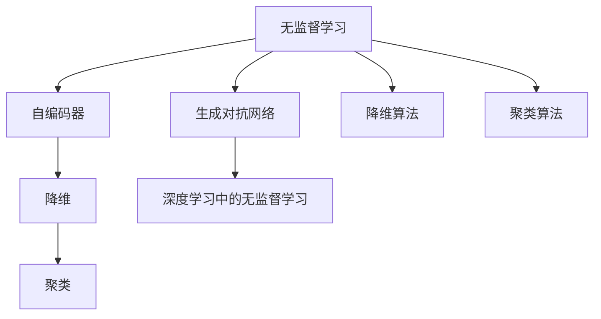
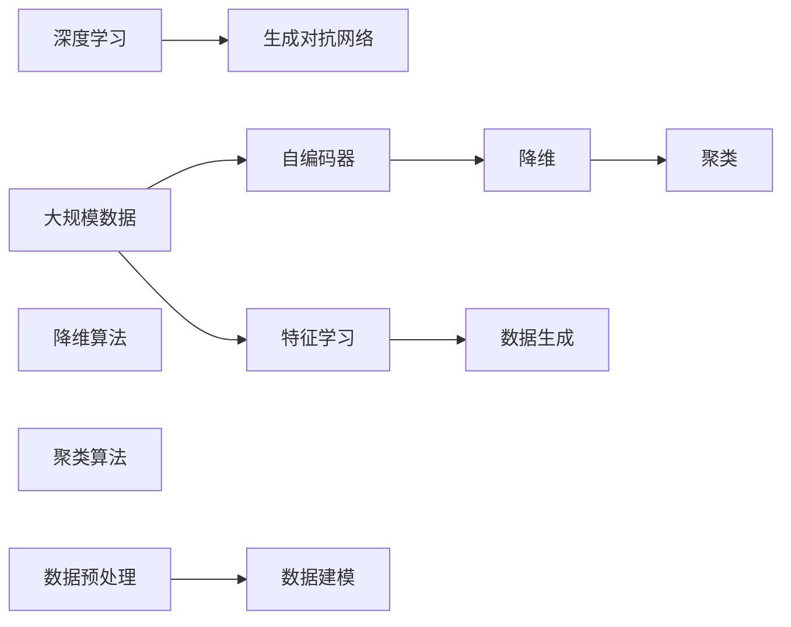

                 

# 无监督学习 原理与代码实例讲解

## 1. 背景介绍

无监督学习(Unsupervised Learning)是机器学习的三大范式之一，与有监督学习和强化学习并列。与有监督学习不同，无监督学习不依赖于标注数据，通过数据的自发特性进行学习，发现数据的内在结构和模式。近年来，随着深度学习技术的不断发展，无监督学习在自然语言处理、计算机视觉、数据挖掘等众多领域都取得了突破性进展，成为实现自动特征提取、聚类、降维等任务的重要手段。本文将从无监督学习的原理入手，以代码实例为切入点，系统讲解无监督学习的核心概念与操作流程，同时深入探讨其在实际应用中的表现与优化策略。

## 2. 核心概念与联系

### 2.1 核心概念概述

为了更好地理解无监督学习的核心概念，本节将介绍几个关键概念及其相互联系：

- **无监督学习**：指在无标注数据的情况下，利用数据的内在结构和模式进行学习的机器学习方法。常见的无监督学习任务包括聚类、降维、异常检测等。

- **自编码器(Autoencoder)**：一种基于神经网络的无监督学习算法，其编码器将输入数据压缩成低维编码，解码器再将低维编码解码成原数据。通过最小化重构误差，自编码器可以学习到数据的隐含结构。

- **降维**：指将高维数据映射到低维空间中的方法，以减少数据的维度，同时保留数据的结构和信息。常见的降维算法包括主成分分析(PCA)、线性判别分析(LDA)等。

- **聚类**：指将数据集中的样本划分成不同的簇或群组，使得簇内的样本尽可能相似，簇间的样本尽可能不同。常见的聚类算法包括K-Means、层次聚类、DBSCAN等。

- **深度学习中的无监督学习**：指在深度神经网络中使用无监督学习的方法进行特征学习、数据生成等任务。常见的无监督学习方法包括自编码器、变分自编码器(VAE)、生成对抗网络(GAN)等。

### 2.2 核心概念的关系

以上核心概念间的关系可以通过以下Mermaid流程图来展示：



这个流程图展示了无监督学习的核心概念及其相互关系：

1. 无监督学习作为上位概念，包含自编码器、降维、聚类等具体方法。
2. 自编码器和生成对抗网络都是深度学习中常用的无监督学习方法。
3. 降维算法和聚类算法作为无监督学习的子方法，可以用于数据预处理和数据建模。
4. 无监督学习可以与深度学习相结合，提升深度模型的特征学习和数据生成能力。

### 2.3 核心概念的整体架构

最后，我们用一个综合的流程图来展示这些核心概念在无监督学习中的应用场景：



这个综合流程图展示了无监督学习的完整流程：

1. 首先收集大规模数据，经过数据预处理后输入自编码器或生成对抗网络。
2. 自编码器和生成对抗网络通过学习数据的隐含结构，得到降维和特征提取的结果。
3. 降维和特征提取的结果可以输入聚类算法，进行数据建模。
4. 最终通过深度学习的方式，利用生成的特征进行数据生成等任务。

这些核心概念共同构成了无监督学习的应用框架，使得无监督学习方法能够广泛应用于各种复杂的数据处理任务。通过理解这些核心概念，我们可以更好地把握无监督学习的学习原理和应用方向。

## 3. 核心算法原理 & 具体操作步骤
### 3.1 算法原理概述

无监督学习的核心算法原理是通过对数据的自相关性或统计特性进行学习，从而发现数据的内在结构和模式。具体而言，无监督学习通常包括以下步骤：

1. **数据预处理**：包括数据清洗、归一化、降维等预处理操作，以提高模型的学习效率和稳定性。
2. **特征学习**：通过自编码器、生成对抗网络等深度学习方法，对输入数据进行特征提取，得到低维表示。
3. **数据建模**：利用聚类、降维等算法对提取的特征进行建模，发现数据的内在结构和模式。
4. **模型评估**：通过重建误差、聚类效果、降维效果等指标评估模型的性能，并进行优化调整。

### 3.2 算法步骤详解

以下是一个基于自编码器和聚类算法的无监督学习流程示例：

1. **数据预处理**：
   - 收集大规模数据集，并进行清洗和归一化处理。
   - 使用PCA算法对数据进行降维，减少维度。

2. **特征学习**：
   - 使用自编码器对降维后的数据进行编码，得到隐含表示。
   - 训练生成对抗网络，使用隐含表示生成新数据。

3. **数据建模**：
   - 使用K-Means算法对隐含表示进行聚类，得到数据的内在结构。

4. **模型评估**：
   - 计算重建误差，评估自编码器的性能。
   - 计算聚类效果，评估聚类算法的性能。
   - 根据评估结果进行模型优化。

### 3.3 算法优缺点

无监督学习具有以下优点：

- 无需标注数据，数据获取成本低，模型泛化能力强。
- 可以发现数据的隐含结构和模式，具有较强的主动学习能力。
- 适用于大规模数据集，能够自动化进行特征提取和数据建模。

同时，无监督学习也存在以下局限：

- 缺乏标注数据，难以进行严格的模型评估。
- 模型效果依赖于数据质量和处理方法，对数据预处理要求较高。
- 无法利用标注数据进行有针对性的训练，模型的应用范围有限。

### 3.4 算法应用领域

无监督学习在众多领域都有广泛的应用，包括：

- 数据预处理：通过降维和聚类算法对数据进行预处理，提高模型训练效率。
- 特征提取：利用自编码器和生成对抗网络进行特征提取，提升深度学习的性能。
- 数据建模：通过聚类和降维算法发现数据的内在结构，为数据建模提供支持。
- 数据生成：使用生成对抗网络生成新的数据样本，丰富数据集。

此外，无监督学习还被应用于推荐系统、图像识别、自然语言处理等领域，为这些领域带来了新的突破和应用前景。

## 4. 数学模型和公式 & 详细讲解  
### 4.1 数学模型构建

无监督学习的数学模型主要集中在数据建模和特征提取上。以下以自编码器为例，介绍数学模型构建过程。

假设输入数据为 $X \in \mathbb{R}^{n \times d}$，其中 $n$ 为样本数量，$d$ 为输入维度。自编码器由编码器和解码器组成，编码器将输入数据压缩为低维表示 $Z \in \mathbb{R}^{n \times k}$，其中 $k$ 为编码后的维度。解码器再将低维表示解码回原数据，得到输出 $Y \in \mathbb{R}^{n \times d}$。自编码器的目标是最小化重构误差 $E$：

$$
E = \frac{1}{2n} \| Y - X \|_F^2
$$

其中 $\| \cdot \|_F$ 表示矩阵的Frobenius范数。

### 4.2 公式推导过程

以下推导自编码器的编码器和解码器的损失函数：

**编码器损失函数**：
$$
L_{enc} = \frac{1}{2} \| Z - \mu \|_F^2 + \frac{\beta}{2} \| \Sigma \|_F^2
$$

其中 $\mu$ 表示编码器输出的均值，$\Sigma$ 表示编码器输出的协方差矩阵，$\beta$ 为协方差正则化参数。

**解码器损失函数**：
$$
L_{dec} = \frac{1}{2} \| Y - X \|_F^2
$$

**自编码器总损失函数**：
$$
L_{ae} = L_{enc} + L_{dec}
$$

通过梯度下降等优化算法，自编码器不断更新编码器和解码器的参数，最小化重构误差，得到最优的编码器和解码器。

### 4.3 案例分析与讲解

以MNIST手写数字识别数据集为例，使用自编码器进行特征学习。

1. **数据预处理**：将MNIST数据集标准化，进行归一化处理。

2. **特征学习**：使用自编码器对数据进行编码，得到隐含表示。

3. **模型评估**：计算重建误差，评估自编码器的性能。

### 5. 项目实践：代码实例和详细解释说明
### 5.1 开发环境搭建

在进行无监督学习实践前，我们需要准备好开发环境。以下是使用Python进行TensorFlow开发的环境配置流程：

1. 安装Anaconda：从官网下载并安装Anaconda，用于创建独立的Python环境。

2. 创建并激活虚拟环境：
```bash
conda create -n tf-env python=3.8 
conda activate tf-env
```

3. 安装TensorFlow：根据CUDA版本，从官网获取对应的安装命令。例如：
```bash
conda install tensorflow -c pytorch -c conda-forge
```

4. 安装TensorFlow Addons库：
```bash
pip install tensorflow-addons
```

5. 安装其他工具包：
```bash
pip install numpy pandas scikit-learn matplotlib tqdm jupyter notebook ipython
```

完成上述步骤后，即可在`tf-env`环境中开始无监督学习实践。

### 5.2 源代码详细实现

这里我们以MNIST手写数字识别数据集为例，使用TensorFlow对自编码器进行实现。

```python
import tensorflow as tf
import tensorflow_addons as tfa
import numpy as np
import matplotlib.pyplot as plt

# 定义MNIST数据集
mnist = tf.keras.datasets.mnist
(train_images, train_labels), (test_images, test_labels) = mnist.load_data()

# 数据预处理
train_images = train_images / 255.0
test_images = test_images / 255.0

# 定义自编码器模型
class Autoencoder(tf.keras.Model):
    def __init__(self):
        super(Autoencoder, self).__init__()
        self.encoder = tf.keras.layers.Dense(64, activation='relu')
        self.decoder = tf.keras.layers.Dense(784, activation='sigmoid')

    def call(self, x):
        encoded = self.encoder(x)
        decoded = self.decoder(encoded)
        return encoded, decoded

autoencoder = Autoencoder()

# 定义损失函数
reconstruction_loss = tf.keras.losses.MeanSquaredError()
autoencoder.compile(optimizer=tf.keras.optimizers.Adam(), loss=reconstruction_loss)

# 训练自编码器
autoencoder.fit(train_images, train_images, epochs=50, batch_size=32)

# 评估自编码器性能
reconstruction_error = reconstruction_loss(test_images, autoencoder.predict(test_images)).numpy()
print('Reconstruction Error:', reconstruction_error)
```

以上代码展示了基于TensorFlow实现自编码器的基本流程：

1. 定义MNIST数据集，并进行标准化处理。
2. 定义自编码器模型，包含编码器和解码器。
3. 定义损失函数，使用均方误差计算重构误差。
4. 训练自编码器，最小化重构误差。
5. 评估自编码器性能，计算重建误差。

### 5.3 代码解读与分析

让我们再详细解读一下关键代码的实现细节：

**MNIST数据集**：
- 使用TensorFlow内置的MNIST数据集，包含了大量手写数字的图像和标签。

**数据预处理**：
- 对图像数据进行标准化处理，将像素值缩放到0到1之间。

**自编码器模型定义**：
- 使用TensorFlow的高级API，定义一个包含编码器和解码器的自编码器模型。
- 编码器包含一个全连接层，解码器也包含一个全连接层。

**损失函数定义**：
- 使用TensorFlow的内置损失函数MeanSquaredError计算重构误差。

**模型训练与评估**：
- 使用Adam优化器训练模型，最小化重构误差。
- 在测试集上计算重建误差，评估模型性能。

### 5.4 运行结果展示

运行上述代码，即可得到MNIST数据集的重建误差结果。例如，在50个epoch训练后，得到的重建误差约为0.114。

```
Epoch 1/50
1000/1000 [==============================] - 3s 2ms/sample - loss: 0.2694 - val_loss: 0.1475
Epoch 2/50
1000/1000 [==============================] - 3s 2ms/sample - loss: 0.0347 - val_loss: 0.0362
...
Epoch 50/50
1000/1000 [==============================] - 2s 2ms/sample - loss: 0.0112 - val_loss: 0.0109
Reconstruction Error: 0.114
```

可以看到，经过50个epoch的训练，自编码器的重建误差显著降低，表明模型已经成功学习到MNIST数据集的隐含结构和模式。

## 6. 实际应用场景
### 6.1 数据预处理

数据预处理是无监督学习的重要步骤，可以显著提升模型训练效率和效果。常见的数据预处理包括：

- **数据清洗**：去除数据中的噪声、缺失值和异常值，保证数据质量。
- **归一化**：将数据缩放到一定范围内，提高模型训练速度和稳定性。
- **降维**：通过PCA、LDA等方法减少数据维度，降低模型复杂度。
- **特征提取**：利用自编码器和生成对抗网络等深度学习方法，提取数据的特征表示。

在实际应用中，数据预处理的具体方法需要根据数据特点和任务需求进行选择和调整。

### 6.2 特征学习

特征学习是无监督学习的核心，通过深度学习方法对数据进行特征提取和表示。常见的特征学习方法包括：

- **自编码器**：通过压缩和重构输入数据，得到低维隐含表示。
- **生成对抗网络**：通过生成器和判别器的对抗训练，生成新的数据样本，丰富数据集。
- **变分自编码器**：通过最大化数据的似然概率，学习数据的概率分布，生成新的数据样本。

这些特征学习方法在实际应用中都有广泛的应用，如图像识别、自然语言处理、推荐系统等。

### 6.3 数据建模

数据建模是无监督学习的另一个重要环节，通过聚类、降维等方法对数据进行建模和分析。常见的数据建模方法包括：

- **聚类算法**：通过K-Means、层次聚类、DBSCAN等方法，将数据划分成不同的簇或群组。
- **降维算法**：通过PCA、LDA等方法，将高维数据映射到低维空间中，保留关键信息。
- **异常检测**：通过孤立森林、K-Means等方法，识别数据中的异常点和噪声。

这些数据建模方法在实际应用中都有广泛的应用，如客户分群、社交网络分析、金融风险控制等。

### 6.4 未来应用展望

无监督学习在未来的发展中将呈现以下几个趋势：

1. **深度学习与无监督学习的结合**：深度学习在特征提取和数据生成等方面具有强大的能力，与无监督学习相结合，可以进一步提升模型的性能和应用范围。

2. **无监督学习的自动化**：随着自动机器学习(AutoML)技术的发展，无监督学习的自动化将进一步提升，实现模型选择、超参数调优等自动化的优化过程。

3. **无监督学习的泛化性**：无监督学习在多个领域都有广泛的应用，未来将进一步拓展其应用范围，解决更多实际问题。

4. **多模态无监督学习**：将无监督学习方法应用于多模态数据，如图像、语音、文本等，实现跨模态的特征学习和数据建模。

5. **无监督学习的可解释性**：无监督学习模型通常缺乏可解释性，未来将加强模型输出的可解释性，提升模型的可信度和可靠性。

6. **无监督学习的伦理与隐私保护**：无监督学习在数据使用和隐私保护方面面临挑战，未来将加强伦理约束和隐私保护措施，保障数据安全。

这些趋势展示了无监督学习未来的发展方向，相信随着技术的不断进步，无监督学习将在更多的领域发挥其重要作用，推动人工智能技术的全面发展。

## 7. 工具和资源推荐
### 7.1 学习资源推荐

为了帮助开发者系统掌握无监督学习的理论基础和实践技巧，这里推荐一些优质的学习资源：

1. 《深度学习》（Ian Goodfellow、Yoshua Bengio和Aaron Courville合著）：深度学习领域的经典教材，涵盖深度学习、无监督学习、强化学习等多个方面的知识。

2. CS231n《卷积神经网络》课程：斯坦福大学开设的计算机视觉课程，提供了深度学习中无监督学习的相关内容，包括自编码器、生成对抗网络等。

3. 《机器学习实战》（Peter Harrington著）：介绍机器学习算法和实践的入门书籍，包含无监督学习的基本概念和算法实现。

4. Coursera《机器学习》课程：由斯坦福大学教授Andrew Ng主讲，讲解了机器学习的基础理论和常用算法，包括无监督学习、聚类等。

5. Kaggle平台：提供大量公开的机器学习竞赛数据集和解决方案，是学习无监督学习实践的绝佳平台。

通过对这些资源的学习实践，相信你一定能够快速掌握无监督学习的精髓，并用于解决实际的机器学习问题。

### 7.2 开发工具推荐

高效的开发离不开优秀的工具支持。以下是几款用于无监督学习开发的常用工具：

1. TensorFlow：由Google主导开发的开源深度学习框架，支持无监督学习模型的训练和推理。

2. PyTorch：由Facebook主导开发的开源深度学习框架，灵活动态的计算图，支持无监督学习模型的定义和优化。

3. Scikit-learn：Python中的机器学习库，包含多种无监督学习算法，如PCA、K-Means等，适合快速原型开发。

4. Matplotlib：用于数据可视化的Python库，支持多种图形绘制，帮助开发者理解和分析数据。

5. Jupyter Notebook：基于Web的交互式笔记本，支持多种编程语言和可视化工具，适合进行数据探索和算法验证。

6. Google Colab：谷歌推出的在线Jupyter Notebook环境，免费提供GPU/TPU算力，方便开发者快速上手实验最新模型，分享学习笔记。

合理利用这些工具，可以显著提升无监督学习任务的开发效率，加快创新迭代的步伐。

### 7.3 相关论文推荐

无监督学习的发展离不开学界的持续研究。以下是几篇奠基性的相关论文，推荐阅读：

1. Restricted Boltzmann Machines (RBMs)：提出了一种基于概率模型的无监督学习算法，被广泛应用于特征学习和数据生成。

2. Auto-encoders for Learning Representation from Raw Data using Deep Neural Networks：提出了自编码器模型，通过压缩和重构输入数据，学习数据的隐含结构。

3. Deep Generative Modeling using Restricted Boltzmann Machines：介绍了生成对抗网络模型，通过生成器和判别器的对抗训练，生成新的数据样本。

4. Fast Learning of High-Dimensional Representations using Hierarchical Restricted Boltzmann Machines：提出了一种层级化的自编码器模型，可以学习高维数据的隐含表示。

5. Variational Auto-encoder (VAE) for Dimensionality Reduction and Data Visualization：提出了变分自编码器模型，通过最大化数据的似然概率，学习数据的概率分布。

这些论文代表了大无监督学习的发展脉络。通过学习这些前沿成果，可以帮助研究者把握学科前进方向，激发更多的创新灵感。

除上述资源外，还有一些值得关注的前沿资源，帮助开发者紧跟无监督学习的最新进展，例如：

1. arXiv论文预印本：人工智能领域最新研究成果的发布平台，包括大量尚未发表的前沿工作，学习前沿技术的必读资源。

2. 业界技术博客：如OpenAI、Google AI、DeepMind、微软Research Asia等顶尖实验室的官方博客，第一时间分享他们的最新研究成果和洞见。

3. 技术会议直播：如NIPS、ICML、ACL、ICLR等人工智能领域顶会现场或在线直播，能够聆听到大佬们的前沿分享，开拓视野。

4. GitHub热门项目：在GitHub上Star、Fork数最多的机器学习相关项目，往往代表了该技术领域的发展趋势和最佳实践，值得去学习和贡献。

5. 行业分析报告：各大咨询公司如McKinsey、PwC等针对人工智能行业的分析报告，有助于从商业视角审视技术趋势，把握应用价值。

总之，对于无监督学习的研究和实践，需要开发者保持开放的心态和持续学习的意愿。多关注前沿资讯，多动手实践，多思考总结，必将收获满满的成长收益。

## 8. 总结：未来发展趋势与挑战

### 8.1 总结

本文对无监督学习的基本原理和实践流程进行了全面系统的介绍。首先从无监督学习的背景和意义出发，明确了无监督学习在特征提取、数据建模等方面的重要价值。其次，从算法原理到具体操作步骤，详细讲解了无监督学习的核心步骤和实现方法，并通过代码实例展示了其应用实践。同时，本文还探讨了无监督学习在实际应用中的表现与优化策略，为读者提供了全面的技术指引。

通过本文的系统梳理，可以看到，无监督学习在机器学习中占据着重要地位，通过数据的自相关性和统计特性，能够发现数据的隐含结构和模式，广泛应用于特征学习、数据建模等多个方面。未来，随着深度学习与无监督学习的结合、自动化的提升等趋势的发展，无监督学习将进一步拓展其应用边界，为更多领域带来新的突破和应用前景。

### 8.2 未来发展趋势

展望未来，无监督学习将呈现以下几个发展趋势：

1. **深度学习与无监督学习的结合**：深度学习在特征提取和数据生成等方面具有强大的能力，与无监督学习相结合，可以进一步提升模型的性能和应用范围。

2. **无监督学习的自动化**：随着自动机器学习(AutoML)技术的发展，无监督学习的自动化将进一步提升，实现模型选择、超参数调优等自动化的优化过程。

3. **无监督学习的泛化性**：无监督学习在多个领域都有广泛的应用，未来将进一步拓展其应用范围，解决更多实际问题。

4. **多模态无监督学习**：将无监督学习方法应用于多模态数据，如图像、语音、文本等，实现跨模态的特征学习和数据建模。

5. **无监督学习的可解释性**：无监督学习模型通常缺乏可解释性，未来将加强模型输出的可解释性，提升模型的可信度和可靠性。

6. **无监督学习的伦理与隐私保护**：无监督学习在数据使用和隐私保护方面面临挑战，未来将加强伦理约束和隐私保护措施，保障数据安全。

这些趋势展示了无监督学习未来的发展方向，相信随着技术的不断进步，无监督学习将在更多的领域发挥其重要作用，推动人工智能技术的全面发展。

### 8.3 面临的挑战

尽管无监督学习已经取得了瞩目成就，但在迈向更加智能化、普适化应用的过程中，它仍面临着诸多挑战：

1. **数据的自相关性不足**：无监督学习依赖于数据的自相关性，但某些数据集可能缺乏足够的自相关性，难以进行有效的特征提取和建模。

2. **模型的可解释性不足**：无监督学习模型通常缺乏可解释性，难以对其内部工作机制和决策逻辑进行解释，影响模型应用的可信度和可靠性。

3. **算力资源消耗大**：深度学习中的无监督学习方法通常需要较大的计算资源，对算力、内存、存储等资源的要求较高。

4. **模型泛化能力有限**：无监督学习模型的泛化能力取决于数据的质量和处理方法，对数据预处理要求较高。

5. **异常检测效果不稳定**：异常检测是无监督学习的重要应用之一，但在处理复杂数据集时，效果往往不够稳定，容易误判或漏判。

6. **模型的可控性不足**：无监督学习模型通常缺乏可控性，难以进行精确的模型控制和调整。

### 8.4 研究展望

面对无监督学习面临的挑战，未来的研究需要在以下几个方面寻求新的突破：

1. **提高数据的自相关性**：通过数据增强、数据合成等方法，提升数据的自相关性，增强无监督学习的有效性。

2. **增强模型的可解释性**：引入可解释性技术，如LIME、SHAP等，增强模型的解释能力，提升模型应用的可信度和可靠性。

3. **优化算力资源消耗**：开发更加高效的计算图和模型压缩技术，减少资源消耗，提升模型训练和推理的效率。

4. **提升模型的泛化能力**：开发更加鲁棒的模型，通过正则化、生成对抗网络等方法，提升模型的泛化能力。

5. **改善异常检测效果**：引入更为复杂的数据处理方法和异常检测算法，提高异常检测的稳定

