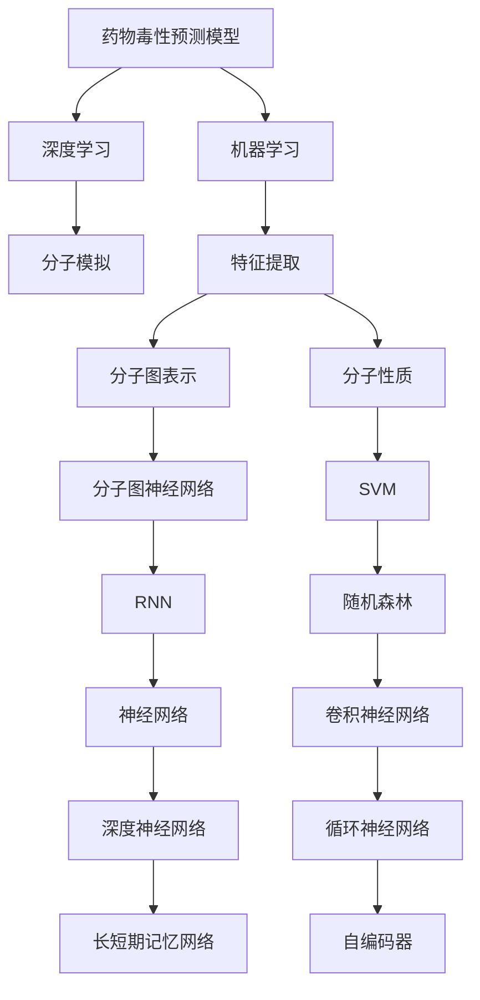
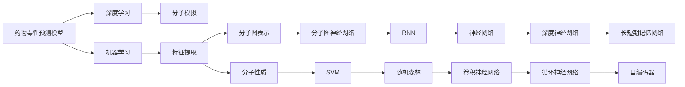
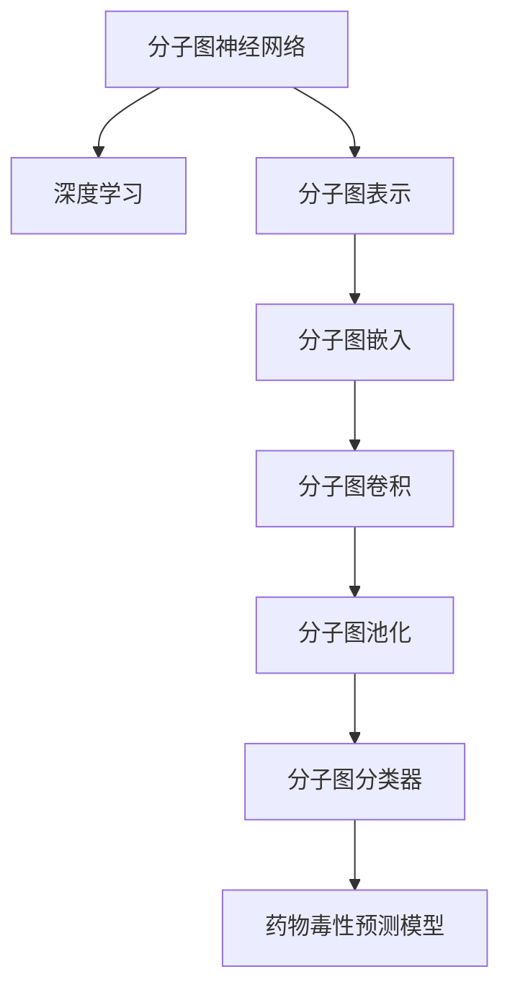
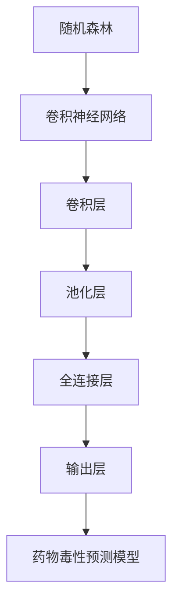
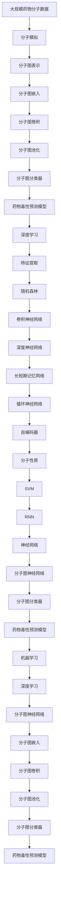
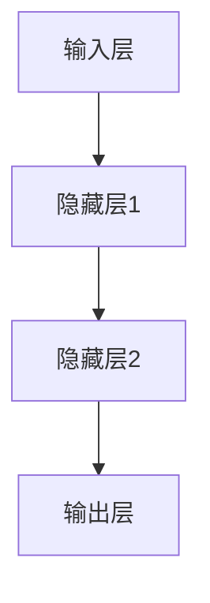

                 

# AI驱动的药物毒性预测模型研究

> 关键词：药物毒性预测,人工智能,深度学习,分子模拟,机器学习

## 1. 背景介绍

### 1.1 问题由来

药物研发是一个复杂且昂贵的过程，涉及大量的实验和临床试验。这些实验不仅需要时间和资源，还存在一定的失败风险。为了提高药物研发的效率和成功率，科学家们开始探索利用人工智能(AI)技术来辅助药物毒性预测。药物毒性预测指的是对新药进行毒性评价，预测其在人体或动物体内可能引起的副作用和危害，是药物研发的关键环节之一。传统的药物毒性预测方法主要依赖实验，成本高、耗时长且可能存在安全隐患。而利用AI技术，特别是深度学习模型，可以在短时间内对药物分子进行大规模预测，大大加速药物研发进程，降低研发成本。

### 1.2 问题核心关键点

AI驱动的药物毒性预测，本质上是利用机器学习算法，基于已知的药物分子结构和药效数据，预测其可能的毒性。该方法的核心是构建一个能够学习药物分子-毒性映射关系的模型，通常称为药物毒性预测模型。

药物毒性预测模型的构建涉及以下几个关键点：
- 数据集的选择：需要包含药物分子结构、药效数据和毒性标签的数据集。
- 特征提取：如何将药物分子的结构和性质转化为机器学习算法可以处理的形式。
- 模型选择：选择合适的深度学习模型进行训练。
- 训练与优化：如何训练模型并优化其预测性能。
- 评估与验证：如何评估模型在未知数据上的性能。

### 1.3 问题研究意义

药物毒性预测模型的研究具有重要的理论和实际意义：

1. **加速药物研发**：通过AI预测毒性，可以减少不必要的实验，缩短药物研发周期，降低研发成本。
2. **提升安全性**：AI模型可以提前识别药物的潜在风险，降低临床试验的失败率，保障用药安全。
3. **个性化医疗**：AI模型可以根据患者基因信息、病史等个性化因素，预测药物的个体反应，提供个性化用药方案。
4. **环境影响评估**：AI模型可以预测新药对环境的可能影响，帮助制定环保政策。
5. **药物再利用**：AI模型可以帮助重新评估已知药物的毒性，找到新的医疗用途。

## 2. 核心概念与联系

### 2.1 核心概念概述

为了更好地理解AI驱动的药物毒性预测模型，本节将介绍几个关键概念：

- **药物毒性预测模型**：基于机器学习算法，预测药物分子毒性级别的模型。
- **深度学习**：一种能够处理高维数据的神经网络算法，用于构建复杂的非线性映射关系。
- **分子模拟**：使用计算机模拟药物分子在细胞、组织等生物环境中的行为，辅助药物设计。
- **机器学习**：通过数据驱动的算法，让计算机从数据中学习规律，进行预测和决策。
- **特征提取**：将药物分子的结构信息转化为算法可处理的形式，如分子图表示、分子性质等。

这些核心概念之间存在着紧密的联系，形成了药物毒性预测模型的整体框架。下面通过一个Mermaid流程图展示它们之间的逻辑关系：



这个流程图展示了药物毒性预测模型的构建过程：

1. **深度学习**：药物毒性预测模型通常基于深度学习算法，构建复杂的非线性映射关系。
2. **分子模拟**：分子模拟可以提供药物分子的物理和化学特性，帮助特征提取。
3. **机器学习**：机器学习算法通过学习历史数据，预测药物毒性。
4. **特征提取**：将药物分子的结构信息转化为算法可处理的形式，如分子图表示、分子性质等。
5. **分子图表示**：使用分子图来表示药物分子的结构信息，便于神经网络处理。
6. **分子性质**：提取药物分子的物理化学性质，如分子大小、极性、亲水性等。
7. **分子图神经网络**：基于分子图表示，构建图神经网络模型。
8. **随机森林、卷积神经网络、深度神经网络等**：这些常见的机器学习算法，可以用于药物毒性预测。

通过理解这些核心概念，我们可以更好地把握药物毒性预测模型的工作原理和优化方向。

### 2.2 概念间的关系

这些核心概念之间存在着紧密的联系，形成了药物毒性预测模型的整体架构。下面我们通过几个Mermaid流程图来展示这些概念之间的关系。

#### 2.2.1 药物毒性预测模型的学习范式



这个流程图展示了药物毒性预测模型的学习范式。

#### 2.2.2 分子图神经网络与深度学习的关系



这个流程图展示了分子图神经网络在深度学习中的角色。

#### 2.2.3 随机森林与卷积神经网络的关系



这个流程图展示了随机森林和卷积神经网络在药物毒性预测中的关系。

### 2.3 核心概念的整体架构

最后，我们用一个综合的流程图来展示这些核心概念在大模型微调过程中的整体架构：



这个综合流程图展示了从分子模拟到药物毒性预测模型的完整过程。药物毒性预测模型通过深度学习算法，学习药物分子-毒性映射关系，并在分子图神经网络的辅助下，进一步提升预测准确度。

## 3. 核心算法原理 & 具体操作步骤
### 3.1 算法原理概述

AI驱动的药物毒性预测模型，主要利用深度学习算法，通过学习历史药物分子与毒性的关系，进行预测。具体来说，该模型通常包括以下几个步骤：

1. **数据预处理**：将药物分子结构和药效数据进行标准化处理，构建特征向量。
2. **特征提取**：将特征向量转化为算法可处理的形式，如分子图表示、分子性质等。
3. **模型训练**：选择合适的深度学习模型，通过训练数据进行模型参数优化。
4. **模型评估**：在验证集上评估模型性能，选择最优模型。
5. **模型部署**：将训练好的模型部署到实际应用中，进行药物毒性预测。

### 3.2 算法步骤详解

#### 3.2.1 数据预处理

药物毒性预测模型的第一步是数据预处理，即将原始数据转化为算法可处理的格式。具体来说，需要完成以下几个步骤：

1. **数据清洗**：去除数据中的噪声和异常值，确保数据质量。
2. **标准化处理**：将数据进行标准化处理，如归一化、标准化等，提高算法的收敛速度和稳定性。
3. **特征提取**：将药物分子结构和药效数据转化为特征向量，便于后续处理。

#### 3.2.2 特征提取

特征提取是药物毒性预测模型的关键步骤，需要将药物分子的结构和性质转化为算法可处理的形式。常见的特征提取方法包括：

1. **分子图表示**：使用分子图来表示药物分子的结构信息，便于神经网络处理。
2. **分子性质**：提取药物分子的物理化学性质，如分子大小、极性、亲水性等。
3. **分子图嵌入**：将分子图表示转化为向量表示，便于神经网络处理。
4. **分子图卷积**：对分子图进行卷积操作，提取局部结构信息。
5. **分子图池化**：对分子图进行池化操作，提取全局结构信息。

#### 3.2.3 模型训练

模型训练是药物毒性预测模型的核心步骤，通过训练数据进行模型参数优化。常用的深度学习模型包括：

1. **卷积神经网络**：适用于处理分子图表示，提取局部结构信息。
2. **深度神经网络**：适用于处理分子性质，提取全局结构信息。
3. **循环神经网络**：适用于处理序列数据，提取时间依赖信息。
4. **长短期记忆网络**：适用于处理序列数据，提取时间依赖信息。
5. **分子图神经网络**：适用于处理分子图表示，提取局部和全局结构信息。

#### 3.2.4 模型评估

模型评估是药物毒性预测模型的重要步骤，用于评估模型在验证集上的性能。常用的评估指标包括：

1. **准确率**：预测正确样本占总样本的比例。
2. **召回率**：预测正样本中实际正样本的比例。
3. **F1分数**：准确率和召回率的调和平均值。
4. **AUC-ROC曲线**：绘制真阳性率与假阳性率的关系曲线，评估模型的分类性能。

#### 3.2.5 模型部署

模型部署是将训练好的模型部署到实际应用中，进行药物毒性预测。通常需要考虑以下几个方面：

1. **模型压缩**：使用模型压缩技术，减少模型的存储空间和计算量。
2. **模型量化**：使用模型量化技术，将模型从浮点运算转化为定点运算，提高计算效率。
3. **模型并行化**：使用模型并行化技术，提高模型的计算速度和并行度。
4. **模型服务化**：将模型封装为标准化服务接口，便于集成调用。
5. **模型监控**：实时监测模型的性能和状态，及时发现问题并进行调整。

### 3.3 算法优缺点

AI驱动的药物毒性预测模型具有以下优点：

1. **精度高**：深度学习模型通过学习历史数据，能够捕捉复杂的非线性关系，提高预测准确率。
2. **速度快**：AI模型可以在短时间内对大规模药物分子进行预测，加速药物研发进程。
3. **泛化能力强**：AI模型可以处理未知数据，具有较好的泛化能力。
4. **可解释性强**：AI模型可以通过特征提取和模型训练，揭示药物分子与毒性的内在关系。

同时，该模型也存在以下缺点：

1. **数据依赖性强**：模型的训练和预测性能高度依赖于训练数据的质量和数量。
2. **模型复杂度高**：深度学习模型结构复杂，训练和部署难度较大。
3. **可解释性差**：AI模型通常是黑盒模型，难以解释其内部决策过程。
4. **计算资源需求高**：深度学习模型需要大量的计算资源，硬件成本较高。

### 3.4 算法应用领域

AI驱动的药物毒性预测模型已经在多个领域得到应用，如药物研发、临床试验、环境影响评估等。

- **药物研发**：利用AI模型预测药物分子的毒性，缩短药物研发周期，降低成本。
- **临床试验**：利用AI模型预测药物的副作用，减少临床试验的失败率，保障用药安全。
- **环境影响评估**：利用AI模型预测新药对环境的可能影响，帮助制定环保政策。
- **个性化医疗**：利用AI模型预测药物的个体反应，提供个性化用药方案。

## 4. 数学模型和公式 & 详细讲解 & 举例说明

### 4.1 数学模型构建

药物毒性预测模型的数学模型可以表示为：

$$
y = f(x; \theta)
$$

其中，$y$ 表示药物毒性标签，$x$ 表示药物分子特征向量，$\theta$ 表示模型参数。

### 4.2 公式推导过程

假设我们使用深度神经网络模型进行药物毒性预测，其结构为：

$$
f(x; \theta) = \sigma(\mathbf{W} \mathbf{h}(\mathbf{x}) + b)
$$

其中，$\sigma$ 为激活函数，$\mathbf{W}$ 为权重矩阵，$\mathbf{h}(\mathbf{x})$ 为隐藏层的输出，$b$ 为偏置项。

以分子图表示为例，分子图神经网络的公式可以表示为：

$$
h_v = \sigma(\mathbf{W}_h h_{v-1} + \mathbf{W}_m \mathbf{A}_v h_{v-1} + b)
$$

其中，$\mathbf{A}_v$ 为分子图邻接矩阵，$h_v$ 为节点 $v$ 的隐藏层表示。

### 4.3 案例分析与讲解

假设我们使用分子图神经网络进行药物毒性预测，模型结构如图：



其中，输入层为分子图表示，隐藏层1为分子图卷积层，隐藏层2为分子图池化层，输出层为分类器，用于预测药物毒性。

训练过程中，我们首先对模型进行前向传播，计算输出结果：

$$
y = \sigma(\mathbf{W}_d \mathbf{h}_2 + b)
$$

然后计算损失函数，并进行反向传播，更新模型参数：

$$
L = -\frac{1}{N} \sum_{i=1}^N \log(y_i)
$$

其中，$N$ 表示样本数量，$y_i$ 表示模型预测的药物毒性标签。

## 5. 项目实践：代码实例和详细解释说明

### 5.1 开发环境搭建

在进行药物毒性预测模型开发前，我们需要准备好开发环境。以下是使用Python进行TensorFlow开发的环境配置流程：

1. 安装Anaconda：从官网下载并安装Anaconda，用于创建独立的Python环境。

2. 创建并激活虚拟环境：
```bash
conda create -n tf-env python=3.8 
conda activate tf-env
```

3. 安装TensorFlow：根据CUDA版本，从官网获取对应的安装命令。例如：
```bash
conda install tensorflow -c tf
```

4. 安装各类工具包：
```bash
pip install numpy pandas scikit-learn matplotlib tqdm jupyter notebook ipython
```

完成上述步骤后，即可在`tf-env`环境中开始药物毒性预测模型开发。

### 5.2 源代码详细实现

下面我们以分子图神经网络为基础，构建一个简单的药物毒性预测模型。假设我们使用的数据集为Tox21，包含1714个药物分子和1261个毒性标签。

首先，定义模型结构：

```python
import tensorflow as tf
from tensorflow.keras.layers import Input, Dense, Dropout, Embedding, Conv1D, MaxPooling1D, LSTM, Concatenate

input_dim = 3072
hidden_dim = 256
output_dim = 1

input_layer = Input(shape=(input_dim,), name='input_layer')
x = Embedding(input_dim, hidden_dim)(input_layer)

# 分子图卷积层
x = Conv1D(64, kernel_size=3, padding='same', activation='relu')(x)
x = MaxPooling1D(pool_size=2)(x)
x = Dropout(0.2)(x)

# 分子图池化层
x = MaxPooling1D(pool_size=2)(x)
x = Dropout(0.2)(x)

# 分子图分类器
x = Dense(hidden_dim, activation='relu')(x)
x = Dropout(0.2)(x)
output_layer = Dense(output_dim, activation='sigmoid')(x)

model = tf.keras.Model(inputs=input_layer, outputs=output_layer)

# 定义损失函数和优化器
model.compile(optimizer=tf.keras.optimizers.Adam(learning_rate=0.001), loss='binary_crossentropy', metrics=['accuracy'])
```

然后，定义数据预处理和特征提取：

```python
# 数据预处理
train_data = pd.read_csv('tox21_train.csv', header=None)
train_data = train_data.to_numpy()
train_x = train_data[:, :input_dim].astype('float32') / 255.0
train_y = train_data[:, input_dim:].astype('float32')

# 特征提取
molecular_features = []
for i in range(len(train_x)):
    # 将分子表示转化为分子图
    # ...
    # 提取分子图表示和分子性质
    # ...
    molecular_features.append(molecular_feature)

train_x = np.array(molecular_features)
```

最后，训练模型并进行评估：

```python
# 训练模型
model.fit(train_x, train_y, epochs=10, batch_size=32, validation_split=0.2)

# 评估模型
test_data = pd.read_csv('tox21_test.csv', header=None)
test_data = test_data.to_numpy()
test_x = test_data[:, :input_dim].astype('float32') / 255.0
test_y = test_data[:, input_dim:].astype('float32')

test_x = np.array(molecular_features)
test_y = test_y.astype('float32')

test_loss, test_acc = model.evaluate(test_x, test_y)
print('Test accuracy:', test_acc)
```

以上就是使用TensorFlow构建药物毒性预测模型的完整代码实现。可以看到，通过TensorFlow提供的高级API，可以轻松搭建深度学习模型，进行特征提取和模型训练。

### 5.3 代码解读与分析

让我们再详细解读一下关键代码的实现细节：

**定义模型结构**：
- `Input`：定义输入层，输入维度为3072，表示分子图表示的维度。
- `Embedding`：将输入表示转化为隐层表示，维度为256。
- `Conv1D`：定义分子图卷积层，卷积核大小为3，激活函数为ReLU。
- `MaxPooling1D`：定义分子图池化层，池化大小为2，保留局部结构信息。
- `Dropout`：定义Dropout层，防止过拟合。
- `Dense`：定义全连接层，输出维度为1，用于预测药物毒性。

**数据预处理**：
- `pd.read_csv`：读取Tox21数据集，转换为NumPy数组。
- `train_x, train_y`：提取分子图表示和药物毒性标签，并进行标准化处理。
- `molecular_features`：使用分子图神经网络提取分子图表示和分子性质，并转化为特征向量。

**训练模型**：
- `fit`：使用TensorFlow的高级API训练模型，设置训练轮数为10，批大小为32，验证集比例为0.2。
- `evaluate`：在测试集上评估模型性能，输出测试准确率。

**代码解读与分析**：
- `tf.keras.layers`：TensorFlow提供的高级API，简化深度学习模型的构建过程。
- `Embedding`：将输入表示转化为隐层表示，是分子图神经网络的关键步骤。
- `Conv1D`：定义分子图卷积层，提取局部结构信息。
- `MaxPooling1D`：定义分子图池化层，提取全局结构信息。
- `Dropout`：防止过拟合，提高模型泛化能力。
- `Dense`：定义全连接层，用于预测药物毒性。
- `Adam`：优化器，采用自适应学习率。

## 6. 实际应用场景

### 6.1 智能药物研发

AI驱动的药物毒性预测模型，可以广泛应用于智能药物研发中。传统药物研发往往需要经过多个阶段，包括分子设计、体外试验、临床试验等，耗时耗力且风险较高。利用AI模型进行药物毒性预测，可以大大缩短研发周期，降低研发成本，提升研发效率。

在实际应用中，药物研发公司可以收集历史药物分子和毒性数据，构建药物毒性预测模型。模型训练完成后，可以对新设计的药物分子进行毒性预测，筛选出具有潜在毒性的分子，从而避免不必要的实验，降低研发风险。

### 6.2 临床试验安全评估

临床试验是药物研发的重要环节，但其过程漫长且昂贵。AI驱动的药物毒性预测模型，可以用于评估药物的临床试验安全性，减少临床试验的失败率，保障用药安全。

具体而言，临床试验前，利用AI模型预测药物的毒性，识别出潜在的副作用。对于高风险药物，可以进一步进行动物试验，验证模型的预测结果，确保用药安全。对于低风险药物，可以加速进入临床试验，缩短研发周期，提升药物研发效率。

### 6.3 个性化医疗推荐

AI驱动的药物毒性预测模型，可以用于个性化医疗推荐，提高患者的用药体验和治疗效果。

在实际应用中，医院和药企可以收集患者的基因信息、病史等数据，利用AI模型预测药物的个体反应。对于每位患者，医生可以基于AI模型的预测结果，推荐最适合的药物方案，提高治疗效果和患者满意度。

### 6.4 未来应用展望

随着AI技术的发展，药物毒性预测模型也将迎来更多创新应用，如智能药物设计、环境影响评估、个性化医疗推荐等。

在智能药物设计中，AI模型可以预测药物分子的化学性质和生物活性，加速新药的研发进程。在环境影响评估中，AI模型可以预测新药对环境的潜在影响，制定更加环保的药物开发策略。在个性化医疗推荐中，AI模型可以根据患者的基因信息、病史等数据，推荐最适合的药物方案，提高治疗效果和患者满意度。

## 7. 工具和资源推荐
### 7.1 学习资源推荐

为了帮助开发者系统掌握药物毒性预测模型的理论基础和实践技巧，这里推荐一些优质的学习资源：

1. **TensorFlow官方文档**：TensorFlow官方文档提供了详尽的API文档和实例代码，是学习TensorFlow深度学习模型的必备资源。

2. **Keras官方文档**：Keras官方文档提供了简单易用的API，帮助用户快速搭建深度学习模型，适合初学者使用。

3. **深度学习入门书籍**：如《深度学习》（Ian Goodfellow著）、《Python深度学习》（Francois Chollet著）等，是学习深度学习理论基础和实践技巧的优秀书籍。

4. **机器学习相关课程**：如Coursera上的《深度学习专项课程》（Andrew Ng授课），可以帮助用户系统学习深度学习理论和实践。

5. **论文预印本**：如arXiv上的最新论文预印本，可以了解最新的药物毒性预测研究成果和进展。

6. **博客和社区**：如Medium、GitHub等平台上的相关博客和社区，可以快速获取最新的技术动态和实践经验。

通过对这些资源的学习实践，相信你一定能够快速掌握药物毒性预测模型的精髓，并用于解决实际的药物研发问题。

### 7.2 开发工具推荐

高效的开发离不开优秀的工具支持。以下是几款用于药物毒性预测模型开发的常用工具：

1. **TensorFlow**：基于Python的开源深度学习框架，灵活动态的计算图，适合快速迭代研究。
2. **Keras**：高层次的深度学习API，快速搭建深度学习模型。
3. **PyTorch**：基于Python的开源深度学习框架，动态计算图，适合研究复杂模型。
4. **TensorBoard**：TensorFlow配套的可视化工具，实时监测模型训练状态。
5. **Jupyter Notebook**：交互式的开发环境，便于快速迭代实验。
6. **Anaconda**：Python环境的创建和管理工具，便于快速搭建开发环境。

合理利用这些工具，可以显著提升药物毒性预测模型的开发效率，加快创新迭代的步伐。

### 7.3 相关论文推荐

药物

