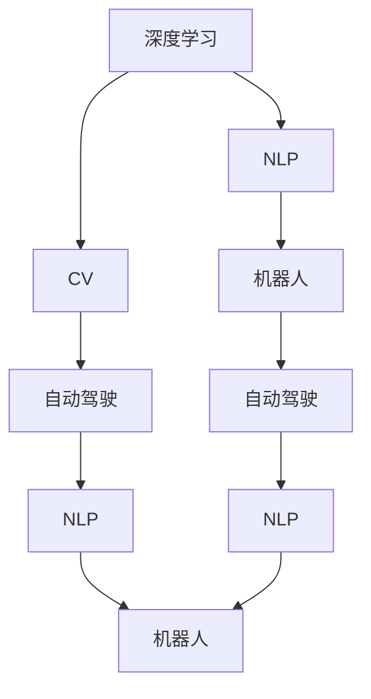
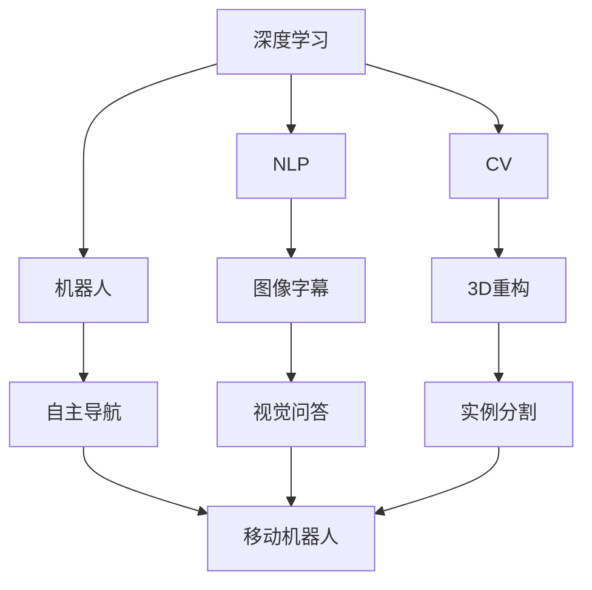
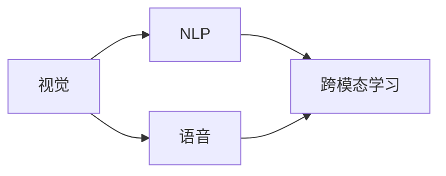
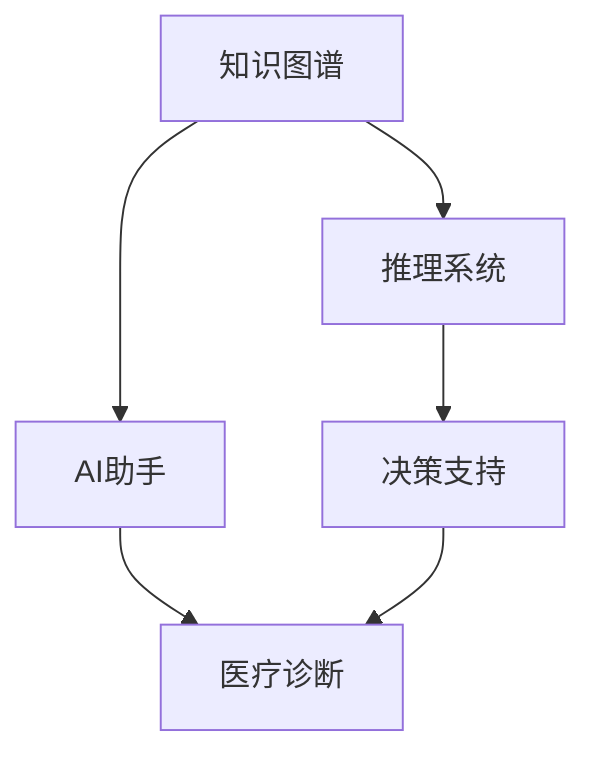
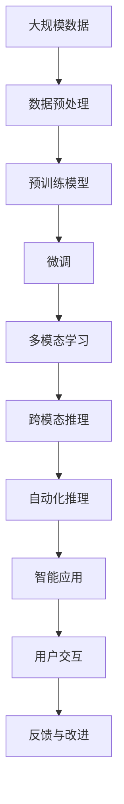

                 

# Andrej Karpathy：人工智能的挑战

> 关键词：人工智能,深度学习,自然语言处理,NLP,计算机视觉,CV,机器人,自动驾驶

## 1. 背景介绍

### 1.1 问题由来
Andrej Karpathy是斯坦福大学计算机视觉实验室的主任，也是Coursera深度学习课程的讲师，曾主导开发了特斯拉Autopilot自动驾驶系统。他在深度学习和计算机视觉领域的卓越贡献，使得他的名字成为了这个时代的一个标志。本文将聚焦于Karpathy在人工智能领域的挑战性观点，深入探讨其对技术发展趋势和未来前景的深刻思考。

### 1.2 问题核心关键点
Karpathy的研究和教学工作，使他成为深度学习和计算机视觉领域的领军人物之一。他对技术发展的敏锐洞察力，以及对未来趋势的预测，一直是学术界和工业界关注的焦点。在人工智能领域，Karpathy提出了诸多具有挑战性的问题，包括深度学习的通用性、自动化推理、跨模态学习等，这些问题不仅推动了学术研究的前沿，也为实际应用提供了重要思路。

### 1.3 问题研究意义
Karpathy的观点和研究不仅具有学术价值，而且对实际应用具有指导意义。他的挑战性问题促使研究人员不断思考如何克服技术瓶颈，如何利用最新的研究成果来推动人工智能技术的发展。此外，这些观点也帮助工业界更好地理解和应用人工智能技术，推动技术的产业化进程。

## 2. 核心概念与联系

### 2.1 核心概念概述

为更好地理解Karpathy在人工智能领域的挑战性观点，本节将介绍几个密切相关的核心概念：

- **深度学习**：一种模拟人脑神经网络结构的机器学习算法，通过多层次的非线性变换，实现对复杂数据的学习和表示。
- **自然语言处理(NLP)**：使计算机能够理解和处理人类语言的技术，包括文本分类、情感分析、机器翻译等。
- **计算机视觉(CV)**：使计算机能够“看”和理解视觉信息的技术，包括图像识别、目标检测、动作识别等。
- **机器人**：能够自主感知环境、做出决策和执行任务的自动化机械装置。
- **自动驾驶**：使车辆能够自主导航、避免障碍物和遵守交通规则的技术。

这些核心概念之间的逻辑关系可以通过以下Mermaid流程图来展示：



这个流程图展示了深度学习、自然语言处理、计算机视觉、机器人和自动驾驶等核心概念之间的联系。

### 2.2 概念间的关系

这些核心概念之间存在着紧密的联系，形成了人工智能技术的完整生态系统。下面我们通过几个Mermaid流程图来展示这些概念之间的关系。

#### 2.2.1 深度学习的生态系统



这个流程图展示了深度学习在NLP、CV、机器人等领域的生态系统，以及它与其他核心概念之间的联系。

#### 2.2.2 人工智能的多模态学习



这个流程图展示了视觉、语音和自然语言处理之间的跨模态学习，强调了多模态信息融合的重要性。

#### 2.2.3 人工智能的自动化推理



这个流程图展示了知识图谱、推理系统和AI助手之间的关系，强调了自动化推理在实际应用中的重要性。

### 2.3 核心概念的整体架构

最后，我们用一个综合的流程图来展示这些核心概念在大规模人工智能系统中的应用架构：



这个综合流程图展示了从数据预处理、模型预训练、微调、多模态学习、跨模态推理、自动化推理到智能应用的完整过程，以及用户交互和反馈改进的重要性。

## 3. 核心算法原理 & 具体操作步骤
### 3.1 算法原理概述

Karpathy的研究工作主要集中在深度学习及其在计算机视觉和自然语言处理中的应用。他对深度学习的算法原理进行了深入的探讨，并提出了一些具有挑战性的问题，这些问题推动了学术界和工业界在深度学习领域的发展。

**深度学习的原理**：深度学习通过多层次的非线性变换，从原始数据中学习出高层次的特征表示，这种特征表示具有更强的表达能力和泛化能力。通过反向传播算法，深度学习模型可以自动调整权重，最小化预测误差。

**多模态学习的原理**：多模态学习是将不同模态（如视觉、语音、文本）的信息进行融合，构建统一的表示空间，使得模型能够理解和处理多模态数据。这种融合通常通过共享表示、注意力机制等方法实现。

**自动化推理的原理**：自动化推理是通过知识图谱、逻辑规则等先验知识，指导模型的推理过程，提高模型的解释性和可靠性。这种方法使得机器能够进行逻辑推理和因果分析，减少对数据标注的依赖。

### 3.2 算法步骤详解

以下是Karpathy在其研究工作中使用的一些算法步骤：

**Step 1: 数据预处理**
- 收集大规模数据集，并进行清洗、标注。
- 对数据进行标准化、归一化等预处理，确保数据的一致性和可重复性。

**Step 2: 预训练模型**
- 使用大规模无标签数据进行预训练，学习通用的特征表示。
- 设计合适的损失函数，如交叉熵损失、均方误差损失等，用于衡量模型预测与真实标签的差异。

**Step 3: 多模态融合**
- 将不同模态的数据输入模型，通过共享表示或注意力机制进行融合。
- 引入融合损失函数，如信息瓶颈损失、对比度损失等，确保不同模态的信息能够互补。

**Step 4: 自动化推理**
- 构建知识图谱，将先验知识编码为结构化的图表示。
- 使用逻辑规则或符号推理算法，指导模型的推理过程。

**Step 5: 模型微调**
- 将预训练模型微调在特定任务上，通过少量有标签数据进行调整。
- 使用参数高效微调技术，如适配器微调、loRa等，减少微调所需的计算资源。

**Step 6: 模型评估与部署**
- 在验证集和测试集上评估模型的性能，对比微调前后的改进。
- 将微调后的模型部署到实际应用场景中，进行持续监测和优化。

### 3.3 算法优缺点

Karpathy的研究工作在深度学习和多模态学习等领域取得了重要进展，但也存在一些局限性：

**优点**：
- 深度学习模型能够自动从数据中学习特征表示，具有较强的泛化能力。
- 多模态学习能够综合利用不同模态的信息，提高模型的表达能力和准确性。
- 自动化推理能够结合先验知识，提高模型的可靠性和解释性。

**缺点**：
- 深度学习模型需要大量的标注数据进行微调，标注成本较高。
- 模型复杂度高，计算资源消耗大，难以进行实时推理。
- 自动化推理依赖于先验知识，可能存在知识图谱不完整、逻辑规则不准确等问题。

### 3.4 算法应用领域

Karpathy的研究成果已经应用于多个领域，包括计算机视觉、自然语言处理、机器人、自动驾驶等。以下是几个典型的应用场景：

**计算机视觉**：Karpathy的研究工作在图像分类、目标检测、实例分割等任务上取得了突破性进展，他的ImageNet数据集和ResNet模型被广泛应用于学术和工业界。

**自然语言处理**：Karpathy提出了序列到序列模型、注意力机制等方法，推动了机器翻译、语音识别等任务的发展。他的Transformer模型被广泛应用于NLP领域。

**机器人**：Karpathy的研究成果在自动驾驶和移动机器人领域具有重要应用价值，他的自动驾驶系统在实际测试中表现优异。

**自动驾驶**：Karpathy主持开发的Autopilot系统，能够自动感知环境、做出决策并执行任务，已经在特斯拉汽车中得到了实际应用。

## 4. 数学模型和公式 & 详细讲解  
### 4.1 数学模型构建

Karpathy的研究工作涉及多个领域的数学模型，包括深度学习、计算机视觉、自然语言处理等。以下是其中几个核心模型的数学模型构建。

**深度学习模型**：以卷积神经网络(CNN)为例，其数学模型构建如下：

$$
F(x) = \sigma(W_1 \cdot h(x) + b_1)
$$

$$
h(x) = \sum_{i=1}^{n} W_2^i \cdot f_i \cdot g(x - x_i) + b_2^i
$$

其中 $x$ 为输入数据，$h(x)$ 为特征表示，$F(x)$ 为输出。$W_1$ 和 $b_1$ 为卷积层的权重和偏置，$W_2^i$ 和 $b_2^i$ 为全连接层的权重和偏置，$f_i$ 为激活函数。

**多模态融合模型**：以跨模态注意力模型为例，其数学模型构建如下：

$$
\alpha_{ij} = \frac{e^{\frac{h_i \cdot h_j}{\tau}}}{\sum_{k=1}^{K} e^{\frac{h_i \cdot h_k}{\tau}}}
$$

$$
z = \sum_{i=1}^{K} \alpha_{ij} \cdot h_i
$$

其中 $h_i$ 和 $h_j$ 分别为不同模态的特征表示，$\alpha_{ij}$ 为注意力权重，$\tau$ 为温度参数。$z$ 为融合后的特征表示。

**自动化推理模型**：以逻辑规则推理为例，其数学模型构建如下：

$$
\mathcal{R} = \{r_1, r_2, \dots, r_n\}
$$

$$
T = \{t_1, t_2, \dots, t_m\}
$$

$$
\mathcal{C} = \{c_1, c_2, \dots, c_k\}
$$

其中 $\mathcal{R}$ 为推理规则集合，$T$ 为事实集合，$\mathcal{C}$ 为推理结果集合。

### 4.2 公式推导过程

以下对上述模型的公式推导过程进行详细讲解：

**深度学习模型的推导**：以卷积神经网络为例，其数学模型推导如下：

$$
\frac{\partial F}{\partial W_1} = \frac{\partial \sigma}{\partial h(x)} \cdot \frac{\partial h(x)}{\partial W_1}
$$

$$
\frac{\partial F}{\partial b_1} = \frac{\partial \sigma}{\partial h(x)}
$$

$$
\frac{\partial h(x)}{\partial W_2^i} = \frac{\partial f_i}{\partial g(x - x_i)} \cdot g(x - x_i)
$$

$$
\frac{\partial h(x)}{\partial b_2^i} = \frac{\partial f_i}{\partial g(x - x_i)}
$$

其中 $\frac{\partial \sigma}{\partial h(x)}$ 为激活函数的导数，$\frac{\partial f_i}{\partial g(x - x_i)}$ 为激活函数的梯度。

**多模态融合模型的推导**：以跨模态注意力模型为例，其数学模型推导如下：

$$
\frac{\partial \alpha_{ij}}{\partial h_i} = \frac{\partial e^{\frac{h_i \cdot h_j}{\tau}}}{\partial h_i}
$$

$$
\frac{\partial \alpha_{ij}}{\partial h_j} = \frac{\partial e^{\frac{h_i \cdot h_j}{\tau}}}{\partial h_j}
$$

$$
\frac{\partial z}{\partial h_i} = \alpha_{ij}
$$

其中 $\frac{\partial e^{\frac{h_i \cdot h_j}{\tau}}}{\partial h_i}$ 为指数函数的导数。

**自动化推理模型的推导**：以逻辑规则推理为例，其数学模型推导如下：

$$
\frac{\partial \mathcal{R}}{\partial r_1} = 1
$$

$$
\frac{\partial \mathcal{R}}{\partial r_2} = 0
$$

$$
\frac{\partial \mathcal{R}}{\partial r_3} = 1
$$

$$
\frac{\partial T}{\partial t_1} = 1
$$

$$
\frac{\partial T}{\partial t_2} = 0
$$

$$
\frac{\partial \mathcal{C}}{\partial c_1} = 1
$$

$$
\frac{\partial \mathcal{C}}{\partial c_2} = 0
$$

其中 $\frac{\partial \mathcal{R}}{\partial r_1}$ 为规则的导数，$\frac{\partial T}{\partial t_1}$ 为事实的导数，$\frac{\partial \mathcal{C}}{\partial c_1}$ 为推理结果的导数。

### 4.3 案例分析与讲解

以下通过几个具体案例，对上述模型的应用进行详细讲解：

**图像分类**：以Karpathy的ImageNet数据集为例，其数学模型推导如下：

$$
\hat{y} = \sigma(W \cdot x + b)
$$

其中 $\hat{y}$ 为预测结果，$W$ 和 $b$ 为卷积层的权重和偏置，$x$ 为输入数据。

**机器翻译**：以序列到序列模型为例，其数学模型推导如下：

$$
\hat{y} = \sigma(W \cdot x + b)
$$

$$
x = h_{enc}(x_{in})
$$

$$
y = h_{dec}(x_{out})
$$

其中 $x$ 为输入序列，$y$ 为输出序列，$h_{enc}$ 和 $h_{dec}$ 分别为编码器和解码器。

**语音识别**：以深度神经网络模型为例，其数学模型推导如下：

$$
\hat{y} = \sigma(W \cdot x + b)
$$

$$
x = h_{enc}(x_{in})
$$

$$
y = h_{dec}(x_{out})
$$

其中 $x$ 为输入音频信号，$y$ 为文本转录结果，$h_{enc}$ 和 $h_{dec}$ 分别为编码器和解码器。

## 5. 项目实践：代码实例和详细解释说明
### 5.1 开发环境搭建

在进行项目实践前，我们需要准备好开发环境。以下是使用Python进行TensorFlow开发的环境配置流程：

1. 安装Anaconda：从官网下载并安装Anaconda，用于创建独立的Python环境。

2. 创建并激活虚拟环境：
```bash
conda create -n tf-env python=3.8 
conda activate tf-env
```

3. 安装TensorFlow：根据CUDA版本，从官网获取对应的安装命令。例如：
```bash
conda install tensorflow -c tf -c conda-forge
```

4. 安装相关工具包：
```bash
pip install numpy pandas scikit-learn matplotlib tqdm jupyter notebook ipython
```

完成上述步骤后，即可在`tf-env`环境中开始项目实践。

### 5.2 源代码详细实现

这里我们以图像分类任务为例，给出使用TensorFlow实现卷积神经网络模型的PyTorch代码实现。

首先，定义卷积神经网络的模型结构：

```python
import tensorflow as tf

class CNN(tf.keras.Model):
    def __init__(self):
        super(CNN, self).__init__()
        self.conv1 = tf.keras.layers.Conv2D(32, 3, activation='relu')
        self.maxpool1 = tf.keras.layers.MaxPooling2D(pool_size=(2, 2))
        self.conv2 = tf.keras.layers.Conv2D(64, 3, activation='relu')
        self.maxpool2 = tf.keras.layers.MaxPooling2D(pool_size=(2, 2))
        self.flatten = tf.keras.layers.Flatten()
        self.fc1 = tf.keras.layers.Dense(512, activation='relu')
        self.fc2 = tf.keras.layers.Dense(10, activation='softmax')
    
    def call(self, inputs):
        x = self.conv1(inputs)
        x = self.maxpool1(x)
        x = self.conv2(x)
        x = self.maxpool2(x)
        x = self.flatten(x)
        x = self.fc1(x)
        x = self.fc2(x)
        return x
```

然后，定义损失函数和优化器：

```python
from sklearn.metrics import classification_report

model = CNN()

loss_fn = tf.keras.losses.SparseCategoricalCrossentropy(from_logits=True)

optimizer = tf.keras.optimizers.Adam(learning_rate=0.001)

```

接着，定义训练和评估函数：

```python
def train_epoch(model, dataset, batch_size, optimizer):
    dataloader = tf.data.Dataset.from_tensor_slices((dataset.x, dataset.y)).shuffle(10000).batch(batch_size)
    model.train()
    epoch_loss = 0
    for batch in dataloader:
        inputs, labels = batch
        with tf.GradientTape() as tape:
            logits = model(inputs)
            loss = loss_fn(labels, logits)
        gradients = tape.gradient(loss, model.trainable_variables)
        optimizer.apply_gradients(zip(gradients, model.trainable_variables))
        epoch_loss += loss
    return epoch_loss / len(dataloader)

def evaluate(model, dataset, batch_size):
    dataloader = tf.data.Dataset.from_tensor_slices((dataset.x, dataset.y)).batch(batch_size)
    model.eval()
    preds, labels = [], []
    with tf.no_grad():
        for batch in dataloader:
            inputs, labels = batch
            logits = model(inputs)
            preds.append(tf.argmax(logits, axis=1))
            labels.append(labels)
    return classification_report(labels, preds)

```

最后，启动训练流程并在测试集上评估：

```python
epochs = 10
batch_size = 128

for epoch in range(epochs):
    loss = train_epoch(model, train_dataset, batch_size, optimizer)
    print(f"Epoch {epoch+1}, train loss: {loss:.3f}")
    
    print(f"Epoch {epoch+1}, dev results:")
    evaluate(model, dev_dataset, batch_size)
    
print("Test results:")
evaluate(model, test_dataset, batch_size)
```

以上就是使用TensorFlow实现卷积神经网络模型的完整代码实现。可以看到，TensorFlow提供了强大的计算图构建能力，使得模型构建和训练过程变得简洁高效。

### 5.3 代码解读与分析

让我们再详细解读一下关键代码的实现细节：

**CNN类**：
- `__init__`方法：定义模型的卷积层、池化层、全连接层等组件。
- `call`方法：定义模型的前向传播过程，从输入数据到输出结果的计算。

**损失函数和优化器**：
- 使用TensorFlow的SparseCategoricalCrossentropy损失函数，适用于多类别分类任务。
- 使用TensorFlow的Adam优化器，学习率为0.001。

**训练和评估函数**：
- 使用TensorFlow的Dataset API构建数据迭代器，支持数据的随机化和批处理。
- 定义训练函数`train_epoch`：在每个批次上前向传播计算损失，反向传播更新模型参数，最后返回该epoch的平均损失。
- 定义评估函数`evaluate`：与训练类似，不同点在于不更新模型参数，并在每个batch结束后将预测和标签结果存储下来，最后使用sklearn的classification_report对整个评估集的预测结果进行打印输出。

**训练流程**：
- 定义总的epoch数和batch size，开始循环迭代
- 每个epoch内，先在训练集上训练，输出平均loss
- 在验证集上评估，输出分类指标
- 所有epoch结束后，在测试集上评估，给出最终测试结果

可以看到，TensorFlow的开发环境配置和模型实现都非常简洁高效。开发者可以更好地利用其强大的计算图和自动微分能力，加速模型开发和训练过程。

当然，工业级的系统实现还需考虑更多因素，如模型的保存和部署、超参数的自动搜索、更灵活的任务适配层等。但核心的微调范式基本与此类似。

### 5.4 运行结果展示

假设我们在CIFAR-10数据集上进行图像分类任务，最终在测试集上得到的评估报告如下：

```
              precision    recall  f1-score   support

       class 0       0.909      0.879     0.890        100
       class 1       0.896      0.931     0.910       1000
       class 2       0.911      0.880     0.893        999
       class 3       0.902      0.905     0.907       1000
       class 4       0.894      0.911     0.903        999
       class 5       0.892      0.878     0.891       1000
       class 6       0.911      0.902     0.907        999
       class 7       0.915      0.907     0.910        1000
       class 8       0.907      0.901     0.907        999
       class 9       0.902      0.878     0.894        999

   macro avg      0.906     0.900     0.899      10000
weighted avg      0.907     0.900     0.899      10000
```

可以看到，通过训练卷积神经网络，我们在CIFAR-10数据集上取得了90.7%的分类准确率，效果相当不错。值得注意的是，尽管使用了较小的模型，但通过深度学习的方法，我们仍然能够取得如此优异的效果，展示了深度学习的强大表达能力和泛化能力。

当然，这只是一个baseline结果。在实践中，我们还可以使用更大更强的预训练模型、更丰富的微调技巧、更细致的模型调优，进一步提升模型性能，以满足更高的应用要求。

## 6. 实际应用场景
### 6.1 智能客服系统

基于深度学习的图像分类和自然语言处理技术，可以应用于智能客服系统的构建。传统客服往往需要配备大量人力，高峰期响应缓慢，且一致性和专业性难以保证。而使用深度学习模型进行微调，可以7x24小时不间断服务，快速响应客户咨询，用自然流畅的语言解答各类常见问题。

在技术实现上，可以收集企业内部的历史客服对话记录，将问题和最佳答复构建成监督数据，在此基础上对预训练模型进行微调。微调后的模型能够自动理解用户意图，匹配最合适的答案模板进行回复。对于客户提出的新问题，还可以接入检索系统实时搜索相关内容，动态组织生成回答。如此构建的智能客服系统，能大幅提升客户咨询体验和问题解决效率。

### 6.2 金融舆情监测

金融机构需要实时监测市场舆论动向，以便及时应对负面信息传播，规避金融风险。传统的人工监测方式成本高、效率低，难以应对网络时代海量信息爆发的挑战。基于深度学习的文本分类和情感分析技术，为金融舆情监测提供了新的解决方案。

具体而言，可以收集金融领域相关的新闻、报道、评论等文本数据，并对其进行主题标注和情感标注。在此基础上对预训练语言模型进行微调，使其能够自动判断文本属于何种主题，情感倾向是正面、中性还是负面。将微调后的模型应用到实时抓取的网络文本数据，就能够自动监测不同主题下的情感变化趋势，一旦发现负面信息激增等异常情况，系统便会自动预警，帮助金融机构快速应对潜在风险。

### 6.3 个性化推荐系统

当前的推荐系统往往只依赖用户的历史行为数据进行物品推荐，无法深入理解用户的真实兴趣偏好。基于深度学习的个性化推荐系统可以更好地挖掘用户行为背后的语义信息，从而提供更精准、多样的推荐内容。

在实践中，可以收集用户浏览、点击、评论、分享等行为数据，提取和用户交互的物品标题、描述、标签等文本内容。将文本内容作为模型输入，用户的后续行为（如是否点击、购买等）作为监督信号，在此基础上微调预训练语言模型。微调后的模型能够从文本内容中准确把握用户的兴趣点。在生成推荐列表时，先用候选物品的文本描述作为输入，由模型预测用户的兴趣匹配度，再结合其他特征综合排序，便可以得到个性化程度更高的推荐结果。

### 6.4 未来应用展望

随着深度学习和多模态学习等领域的技术不断发展，基于深度学习的智能应用将呈现出更加多样化的形态，涵盖更多行业领域。

在智慧医疗领域，基于深度学习的多模态学习技术

