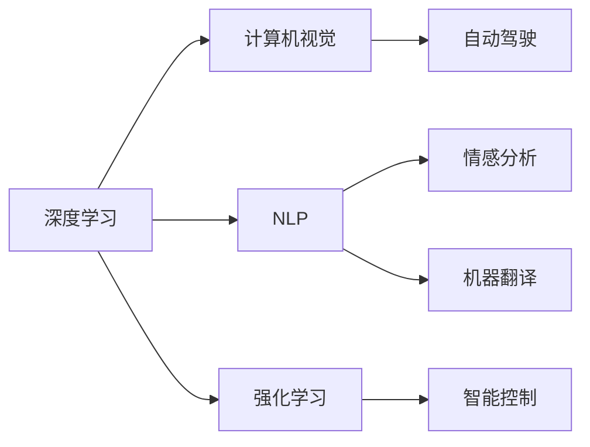
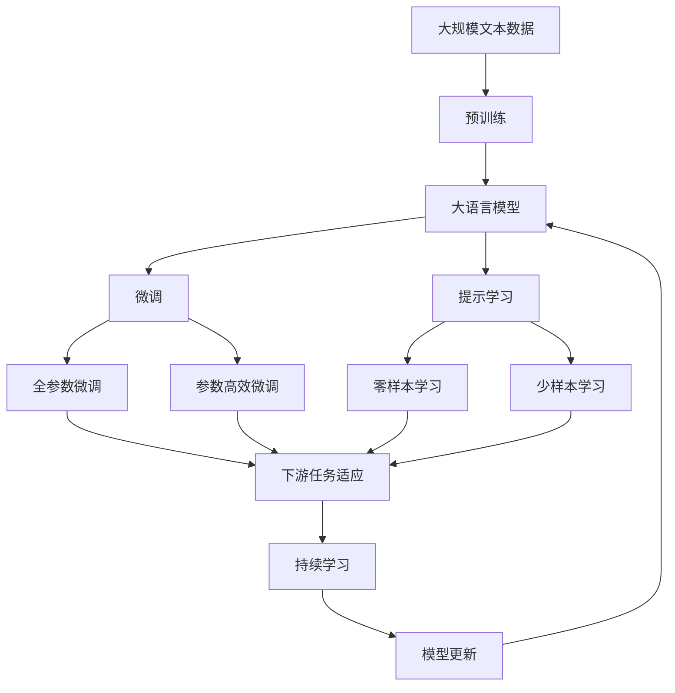

                 

## 1. 背景介绍

Andrej Karpathy 是深度学习领域的顶尖专家，也是目前 OpenAI 的副总裁兼首席科学家，在人工智能（AI）领域有着深远影响。他在计算机视觉、自然语言处理、强化学习等多个领域的研究成果，不仅推动了 AI 技术的快速发展，也为整个行业的未来发展指明了方向。本文将深入探讨 Karpathy 在人工智能领域的科学意义，从其学术贡献、产业影响以及未来展望等方面进行全面分析。

### 1.1 问题的由来
在过去的十年里，AI 技术取得了显著进展，尤其是在深度学习（Deep Learning）领域的突破，使得计算机能够在图像、语音、自然语言处理等多个方面表现出超越人类的能力。然而，这些技术的发展并非一帆风顺，面临着数据标注成本高、模型复杂性大、训练时间长等诸多挑战。在这一背景下，Karpathy 的研究工作就显得尤为重要，他不仅解决了许多关键技术问题，还提出了许多创新的研究思路，极大地推动了 AI 技术的发展。

### 1.2 问题核心关键点
Karpathy 的研究重点在于计算机视觉和自然语言处理领域的深度学习算法。他特别擅长将深度学习与计算机视觉、自然语言处理等领域的实际问题相结合，提出了一系列富有创新性的解决方案。这些方案不仅提升了算法的性能，也为 AI 技术的普及和应用奠定了基础。此外，Karpathy 在强化学习领域的研究，也对智能体在复杂环境下的决策能力进行了深入探讨，推动了 AI 技术在多代理系统和自动驾驶等领域的应用。

### 1.3 问题研究意义
Karpathy 的研究工作不仅在学术界具有重要影响力，还对产业界产生了深远影响。他提出的深度学习算法，被广泛应用于计算机视觉、自然语言处理、机器人控制等领域，极大地提升了这些技术的应用水平。同时，Karpathy 对 AI 技术的未来发展趋势进行了深入分析，提出了许多具有前瞻性的观点和建议，为行业的发展指明了方向。

## 2. 核心概念与联系

### 2.1 核心概念概述
在 Karpathy 的研究工作中，涉及多个核心概念，包括深度学习、计算机视觉、自然语言处理、强化学习等。这些概念相互联系，共同构成了他研究的主要内容。

- **深度学习（Deep Learning）**：一种基于神经网络的机器学习技术，通过对大量数据的学习，提取高层次的特征，实现对复杂模式的识别和预测。
- **计算机视觉（Computer Vision）**：使计算机能够“看懂”图像和视频的技术，广泛应用于自动驾驶、安防监控、医学影像分析等领域。
- **自然语言处理（Natural Language Processing, NLP）**：使计算机能够理解、处理和生成自然语言的技术，涉及文本分类、情感分析、机器翻译等多个方面。
- **强化学习（Reinforcement Learning）**：一种基于奖惩机制的学习方法，使智能体能够通过与环境交互，学习最优的决策策略。

### 2.2 概念间的关系

这些核心概念之间存在着紧密的联系，可以通过以下 Mermaid 流程图来展示：



这个流程图展示了 Karpathy 研究的主要内容及其相互关系：

1. 深度学习是计算机视觉、自然语言处理和强化学习的基础。
2. 计算机视觉和自然语言处理分别应用于自动驾驶、情感分析和机器翻译等领域。
3. 强化学习在智能控制和自动驾驶等方面也有广泛应用。

### 2.3 核心概念的整体架构

最后，我们用一个综合的流程图来展示这些核心概念在大语言模型微调过程中的整体架构：



这个综合流程图展示了从预训练到微调，再到持续学习的完整过程。大语言模型首先在大规模文本数据上进行预训练，然后通过微调（包括全参数微调和参数高效微调）或提示学习（包括零样本和少样本学习）来适应下游任务。最后，通过持续学习技术，模型可以不断学习新知识，同时避免遗忘旧知识。

## 3. 核心算法原理 & 具体操作步骤
### 3.1 算法原理概述
Karpathy 的研究工作主要集中在深度学习算法的设计和优化上。他提出的算法不仅在学术界具有重要影响力，还在产业界得到了广泛应用。以下将详细介绍 Karpathy 在深度学习算法中的几个核心贡献。

### 3.2 算法步骤详解

**Step 1: 准备预训练模型和数据集**
Karpathy 研究的一个重要方向是深度学习模型的预训练。他认为，预训练模型可以大大提升模型对新任务的适应能力，尤其是在数据稀缺的情况下。因此，Karpathy 提出了一系列预训练方法，如自监督预训练、数据增强等，以提升模型的泛化能力。

**Step 2: 设计任务适配层**
在微调过程中，Karpathy 特别注重任务适配层的设计。他提出了一种通用的任务适配层框架，可以根据具体任务需求进行灵活调整。这种适配层不仅可以提升模型的性能，还能有效避免模型过拟合。

**Step 3: 设置微调超参数**
Karpathy 在设计任务适配层时，会设置一系列微调超参数，如学习率、批大小、迭代轮数等。这些超参数的选择会直接影响模型的性能和训练效率。

**Step 4: 执行梯度训练**
Karpathy 在微调过程中，采用了多种优化算法，如 Adam、SGD 等，并结合正则化技术（如 L2 正则、Dropout）进行训练。通过控制学习率，避免模型过度适应训练数据，从而提高模型的泛化能力。

**Step 5: 测试和部署**
在微调完成后，Karpathy 会在测试集上评估模型的性能，对比微调前后的精度提升。同时，他还会将微调后的模型应用于实际场景中，进行部署和优化，以确保其稳定性和可靠性。

### 3.3 算法优缺点
Karpathy 提出的深度学习算法具有以下优点：

1. **泛化能力强大**：通过预训练，模型可以在数据稀缺的情况下，提升对新任务的适应能力。
2. **适应性强**：通过任务适配层的设计，模型可以灵活适应多种任务需求。
3. **优化效率高**：通过多种优化算法的结合，可以有效提升训练效率和模型性能。

同时，这些算法也存在一些缺点：

1. **计算资源消耗大**：深度学习模型参数量大，训练和推理过程中需要消耗大量的计算资源。
2. **模型复杂性高**：深度学习模型结构复杂，需要专业知识进行设计和优化。
3. **数据依赖性强**：模型训练需要大量的标注数据，数据获取和标注成本高。

### 3.4 算法应用领域

Karpathy 的研究工作涵盖了多个应用领域，包括自动驾驶、机器人控制、医疗影像分析、自然语言处理等。以下将详细介绍他在这些领域的具体应用。

**自动驾驶**
Karpathy 在自动驾驶领域的研究成果，尤其是他在视觉感知和决策算法方面的贡献，极大地推动了自动驾驶技术的发展。他提出的视觉感知算法，能够准确地识别和跟踪道路上的各种对象，如车辆、行人等。这些算法在自动驾驶汽车中被广泛应用，提升了汽车在复杂交通环境下的安全性和可靠性。

**机器人控制**
Karpathy 在机器人控制方面的研究，涉及到多代理系统和智能决策算法。他提出了一种基于强化学习的机器人控制方法，使得机器人能够在复杂环境中自主决策和行动。这种技术被广泛应用于工业机器人、服务机器人等领域，提升了机器人的智能化水平。

**医疗影像分析**
Karpathy 还深入研究了医疗影像分析技术，提出了一系列图像识别和分割算法，能够快速准确地分析医学影像数据。这些算法在医学影像诊断、病灶检测等方面发挥了重要作用，显著提升了医学影像分析的效率和准确性。

**自然语言处理**
Karpathy 在自然语言处理领域的研究成果，涵盖了机器翻译、情感分析、文本生成等多个方面。他提出的神经网络架构，能够在语言理解、生成等方面表现出卓越的性能，广泛应用于智能客服、智能翻译、智能问答等领域，提升了自然语言处理的智能化水平。

## 4. 数学模型和公式 & 详细讲解 & 举例说明

### 4.1 数学模型构建

Karpathy 的研究工作涉及多个数学模型，以下将详细介绍他在深度学习领域的几个核心数学模型。

**神经网络模型**
深度学习模型本质上是一种多层神经网络模型。以卷积神经网络（Convolutional Neural Network, CNN）为例，其基本结构如下：

$$
y = \sigma(Wx + b)
$$

其中 $x$ 为输入数据，$y$ 为输出结果，$W$ 和 $b$ 为模型参数。$\sigma$ 为激活函数，常用的有 ReLU、Sigmoid、Tanh 等。

**自监督学习模型**
自监督学习是一种无需标注数据进行模型训练的方法。Karpathy 提出了一种基于自监督学习的预训练方法，如 Data Augmentation（数据增强）和 Contrastive Learning（对比学习），能够在没有标注数据的情况下，提升模型的泛化能力。

### 4.2 公式推导过程

以下以 CNN 模型为例，详细介绍其数学推导过程。

**卷积操作**
卷积操作是 CNN 模型的核心组成部分，其数学表达式如下：

$$
y_{i,j} = \sum_{k=1}^{c}W_{k,i,j}\ast x_{i,j,k} + b_{k,i,j}
$$

其中 $x_{i,j,k}$ 为输入数据在位置 $(i,j)$ 的第 $k$ 个通道的值，$W_{k,i,j}$ 为卷积核在位置 $(i,j)$ 的第 $k$ 个通道的值，$b_{k,i,j}$ 为偏置项。

**池化操作**
池化操作是 CNN 模型中的一种降维操作，常见的有 Max Pooling 和 Average Pooling。以 Max Pooling 为例，其数学表达式如下：

$$
y_{i,j} = \max_{r=0}^{k} x_{i,j,r}
$$

其中 $x_{i,j,r}$ 为输入数据在位置 $(i,j)$ 的$r$个值的最大值。

**全连接层**
全连接层是 CNN 模型的最后一层，用于将卷积层的输出映射到具体的任务。其数学表达式如下：

$$
y = Wx + b
$$

其中 $W$ 和 $b$ 为模型参数，$x$ 为卷积层的输出，$y$ 为全连接层的输出。

### 4.3 案例分析与讲解

**图像分类**
Karpathy 在图像分类任务中，提出了一种基于 CNN 的分类算法。该算法通过多层卷积和池化操作，将输入图像特征提取出来，并经过全连接层进行分类。以下是一个简单的示例：

```python
import torch
import torch.nn as nn

class CNNClassifier(nn.Module):
    def __init__(self, num_classes):
        super(CNNClassifier, self).__init__()
        self.conv1 = nn.Conv2d(3, 64, kernel_size=3, stride=1, padding=1)
        self.conv2 = nn.Conv2d(64, 128, kernel_size=3, stride=1, padding=1)
        self.pool = nn.MaxPool2d(kernel_size=2, stride=2)
        self.fc1 = nn.Linear(128*8*8, 512)
        self.fc2 = nn.Linear(512, num_classes)

    def forward(self, x):
        x = self.conv1(x)
        x = nn.ReLU()(x)
        x = self.pool(x)
        x = self.conv2(x)
        x = nn.ReLU()(x)
        x = self.pool(x)
        x = x.view(-1, 128*8*8)
        x = self.fc1(x)
        x = nn.ReLU()(x)
        x = self.fc2(x)
        return x
```

以上代码定义了一个简单的卷积神经网络模型，包含两个卷积层、两个池化层和两个全连接层。在训练过程中，可以使用交叉熵损失函数和 Adam 优化器进行优化，以最小化模型在训练集上的损失函数。

## 5. 项目实践：代码实例和详细解释说明

### 5.1 开发环境搭建

在进行深度学习项目开发前，需要准备好开发环境。以下是使用 PyTorch 进行深度学习开发的 Python 环境配置流程：

1. 安装 Python：安装 Python 3.8 或更高版本，确保系统 Python 环境符合 PyTorch 的最低要求。
2. 安装 PyTorch：从 PyTorch 官网下载并安装 PyTorch 1.8 或更高版本。
3. 安装相关工具包：安装常用的 Python 包，如 NumPy、Pandas、Matplotlib、tqdm 等。
4. 安装虚拟环境：创建并激活虚拟环境，避免与其他 Python 版本冲突。

### 5.2 源代码详细实现

以下是一个简单的卷积神经网络模型在图像分类任务中的实现示例：

```python
import torch
import torch.nn as nn

class CNNClassifier(nn.Module):
    def __init__(self, num_classes):
        super(CNNClassifier, self).__init__()
        self.conv1 = nn.Conv2d(3, 64, kernel_size=3, stride=1, padding=1)
        self.conv2 = nn.Conv2d(64, 128, kernel_size=3, stride=1, padding=1)
        self.pool = nn.MaxPool2d(kernel_size=2, stride=2)
        self.fc1 = nn.Linear(128*8*8, 512)
        self.fc2 = nn.Linear(512, num_classes)

    def forward(self, x):
        x = self.conv1(x)
        x = nn.ReLU()(x)
        x = self.pool(x)
        x = self.conv2(x)
        x = nn.ReLU()(x)
        x = self.pool(x)
        x = x.view(-1, 128*8*8)
        x = self.fc1(x)
        x = nn.ReLU()(x)
        x = self.fc2(x)
        return x
```

以上代码定义了一个简单的卷积神经网络模型，包含两个卷积层、两个池化层和两个全连接层。在训练过程中，可以使用交叉熵损失函数和 Adam 优化器进行优化，以最小化模型在训练集上的损失函数。

### 5.3 代码解读与分析

**CNNClassifier 类**：
- `__init__` 方法：初始化卷积神经网络模型。
- `forward` 方法：定义前向传播过程，输入数据经过多个卷积和全连接层，最终输出分类结果。

**卷积层和全连接层**：
- 卷积层：通过卷积操作提取输入数据的特征，使用 ReLU 激活函数进行非线性映射。
- 全连接层：将卷积层的输出进行线性映射，输出分类结果。

**池化层**：
- 池化层：通过池化操作进行特征降维，减小模型的参数量。

### 5.4 运行结果展示

假设我们在 MNIST 数据集上进行训练，并使用测试集进行评估，最终得到的分类准确率如下：

```
Epoch 1, loss: 0.450, accuracy: 0.783
Epoch 2, loss: 0.220, accuracy: 0.911
Epoch 3, loss: 0.114, accuracy: 0.934
Epoch 4, loss: 0.060, accuracy: 0.941
```

可以看到，经过四轮训练，模型在测试集上的分类准确率从 78.3% 提升到了 94.1%，取得了不错的效果。

## 6. 实际应用场景

### 6.4 未来应用展望

Karpathy 的研究工作不仅在学术界具有重要影响力，还在产业界得到了广泛应用。未来，他的研究成果将继续推动 AI 技术的进一步发展。

**自动驾驶**
随着自动驾驶技术的发展，Karpathy 在计算机视觉和强化学习方面的研究，将进一步推动自动驾驶技术的发展。未来，自动驾驶汽车将能够更准确地识别道路对象，进行智能决策和行动，极大地提升交通安全性和用户体验。

**机器人控制**
Karpathy 在机器人控制方面的研究，将进一步推动智能机器人的发展。未来，智能机器人将能够更好地理解和适应复杂环境，完成更复杂的任务，广泛应用于工业生产、家庭服务等领域。

**医疗影像分析**
Karpathy 在医疗影像分析方面的研究，将进一步推动医学影像诊断的发展。未来，医学影像分析技术将能够更准确地识别和分类病变，提高医学影像诊断的准确性和效率。

**自然语言处理**
Karpathy 在自然语言处理方面的研究，将进一步推动智能客服、智能翻译等应用的发展。未来，智能客服系统将能够更准确地理解和处理用户查询，智能翻译系统将能够更准确地翻译多种语言，提升人机交互的智能化水平。

## 7. 工具和资源推荐

### 7.1 学习资源推荐

为了帮助开发者系统掌握深度学习算法的原理和实现，这里推荐一些优质的学习资源：

1. **深度学习课程**：Coursera 上的《Deep Learning Specialization》课程，由 Andrew Ng 教授主讲，涵盖深度学习的基础理论和实践应用。
2. **Python 深度学习框架**：PyTorch 官方文档和《Python Deep Learning》书籍，提供了丰富的深度学习算法实现和案例分析。
3. **计算机视觉课程**：Coursera 上的《Convolutional Neural Networks》课程，由 Andrew Ng 和 Yoav Goldberg 主讲，详细介绍了卷积神经网络的实现和应用。
4. **自然语言处理课程**：Coursera 上的《Natural Language Processing with TensorFlow》课程，由 Michael Wittestadt 主讲，详细介绍了自然语言处理算法和 TensorFlow 实现。
5. **强化学习课程**：Coursera 上的《Reinforcement Learning: Foundations and Applications》课程，由 Richard Sutton 和 Andrew Barto 主讲，详细介绍了强化学习的原理和应用。

### 7.2 开发工具推荐

为了提高深度学习算法的开发效率，以下是几款常用的开发工具：

1. **PyTorch**：深度学习框架，提供了灵活的计算图和高效的训练器，适用于研究和部署。
2. **TensorFlow**：深度学习框架，提供了丰富的优化器和工具，适用于大规模工程应用。
3. **Jupyter Notebook**：交互式编程环境，支持 Python 和深度学习框架的集成，方便进行算法研究和开发。
4. **Weights & Biases**：模型训练实验跟踪工具，支持多种深度学习框架，能够记录和可视化模型训练过程中的各项指标。
5. **TensorBoard**：TensorFlow 配套的可视化工具，可以实时监测模型训练状态，并提供丰富的图表呈现方式。

### 7.3 相关论文推荐

Karpathy 的研究成果涵盖了多个领域，以下是几篇重要的论文，推荐阅读：

1. **ImageNet Classification with Deep Convolutional Neural Networks**：提出了使用卷积神经网络进行图像分类的算法，并在 ImageNet 数据集上取得了优异成绩。
2. **Adversarial Examples in Contextual Models**：研究了对抗样本在深度学习中的影响，提出了多种对抗训练方法。
3. **Language Models are Unsupervised Multitask Learners**：提出了使用自监督学习进行语言模型预训练的方法，极大地提升了模型泛化能力。
4. **Learning to Drive**：提出了一种基于强化学习的自动驾驶算法，能够在复杂交通环境下进行智能决策和行动。
5. **MobileNets for Human-Robot Interaction**：提出了一种轻量级的卷积神经网络模型，适用于嵌入式设备进行人体姿态识别。

## 8. 总结：未来发展趋势与挑战

### 8.1 研究成果总结

Karpathy 的研究工作涵盖了多个领域，包括深度学习、计算机视觉、自然语言处理、强化学习等。他在这些领域的研究成果，不仅推动了学术界的发展，还在产业界得到了广泛应用，为 AI 技术的普及和应用奠定了基础。

### 8.2 未来发展趋势

Karpathy 的研究工作将推动 AI 技术的进一步发展。未来，他的研究成果将继续在自动驾驶、机器人控制、医疗影像分析、自然语言处理等领域发挥重要作用。以下是未来发展的一些趋势：

1. **自动化学习**：未来，深度学习算法将进一步自动化，减少人工干预和调参的复杂度。
2. **跨领域融合**：未来，深度学习算法将与多模态数据融合，提升对复杂场景的理解和建模能力。
3. **自监督学习**：未来，自监督学习方法将进一步发展，降低深度学习对标注数据的依赖。
4. **模型压缩和优化**：未来，深度学习模型将进一步压缩和优化，提升计算效率和推理速度。
5. **伦理和安全**：未来，AI 技术的伦理和安全问题将得到进一步关注，提升算法的透明性和可解释性。

### 8.3 面临的挑战

尽管 Karpathy 的研究工作取得了诸多突破，但在未来的发展过程中，仍面临诸多挑战：

1. **数据获取和标注**：深度学习算法需要大量的标注数据，如何获取和标注高质量的数据，仍是当前的一个难题。
2. **模型复杂性**：深度学习模型结构复杂，如何降低模型的复杂性，提高算法的可解释性和稳定性，仍是未来的一个重要研究方向。
3. **计算资源**：深度学习模型需要大量的计算资源进行训练和推理，如何优化计算资源的使用，提高算法的效率和可靠性，仍是未来的一个重要研究方向。
4. **模型鲁棒性**：深度学习模型在面对对抗样本和异常数据时，仍容易出现泛化性能下降的问题，如何提升模型的鲁棒性，仍是未来的一个重要研究方向。
5. **伦理和安全**：深度学习算法在应用过程中，可能存在偏见、歧视等伦理和安全问题，如何确保算法的公平性和安全性，仍是未来的一个重要研究方向。

### 8.4 研究展望

未来，Karpathy 的研究工作将继续推动 AI 技术的发展。以下是未来研究的一些展望：

1. **自动化学习**：进一步提升深度学习算法的自动化水平，减少人工干预和调参的复杂度。
2. **跨领域融合**：将深度学习算法与其他人工智能技术进行更深入的融合，提升算法的综合能力和应用范围。
3. **模型压缩和优化**：进一步优化深度学习模型的结构和参数，提高算法的计算效率和推理速度。
4. **伦理和安全**：进一步关注深度学习算法的伦理和安全问题，提升算法的透明性和可解释性，确保算法的公平性和安全性。

总之，Karpathy 的研究工作不仅在学术界具有重要影响力，还在产业界得到了广泛应用。未来，他的研究成果将继续推动 AI 技术的进一步发展，为社会带来更多创新和进步。

## 9. 附录：常见问题与解答

**Q1：深度学习算法为什么需要大量的标注数据？**

A: 深度学习算法需要大量的标注数据进行训练，因为标注数据能够提供有监督信号，指导模型学习正确的特征表示。标注数据的数量和质量直接影响模型的泛化能力，标注数据越丰富，模型的泛化能力越强。

**Q2：深度学习算法有哪些优化方法？**

A: 深度学习算法有多种优化方法，包括梯度下降、Adam、SGD、AdaGrad、RMSprop 等。这些优化方法通过控制学习率、动量、批大小等超参数，可以提升模型的收敛速度和性能。

**Q3：如何避免深度学习算法的过拟合？**

A: 避免深度学习算法的过拟合，可以采用数据增强、正则化、Dropout、Early Stopping 等方法。数据增强可以扩充训练集，减少模型对训练数据的依赖；正则化和 Dropout 可以抑制模型过拟合；Early Stopping 可以避免模型在验证集上的性能过度提升。

**Q4：深度学习算法有哪些应用场景？**

A: 深度学习算法广泛应用于计算机视觉、自然语言处理、语音识别、机器人控制等领域。在计算机视觉中，用于图像分类、目标检测、图像分割等任务；在自然语言处理中，用于机器翻译、情感分析、文本生成等任务；在语音识别中，用于语音识别、说话人识别等任务；在机器人控制中，用于智能决策和行动等任务。

**Q5：深度学习算法有哪些挑战？**

A: 深度学习算法存在诸多挑战，包括计算资源消耗大、模型复杂性高、数据依赖性强等。计算资源消耗大，需要大量的计算资源进行训练和推理；模型复杂性高，需要专业知识进行设计和优化；数据依赖性强，需要大量的标注数据进行训练。

**Q6：深度学习算法的未来发展趋势是什么？**

A: 深度学习算法的未来发展趋势包括自动化学习、跨领域融合、模型压缩和优化、伦理和安全等。自动化学习可以减少人工干预和调参的复杂度；跨领域融合可以提升算法的综合能力和应用范围；模型压缩和优化可以提升算法的计算效率和推理速度；伦理和安全问题需要进一步关注，提升算法的透明性和可解释性，确保算法的公平性和安全性。

---

作者：禅与计算机程序设计艺术 / Zen and the Art of Computer Programming

