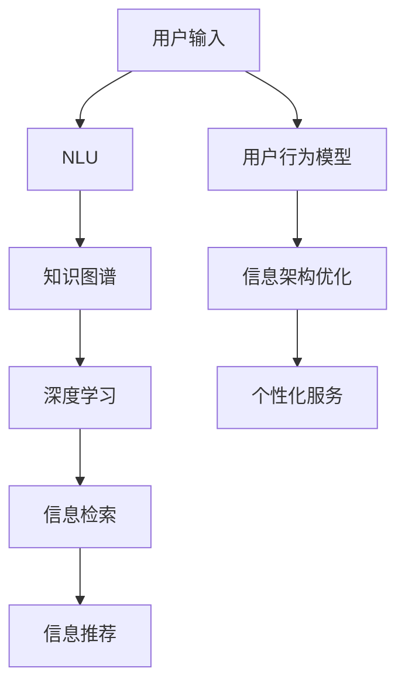
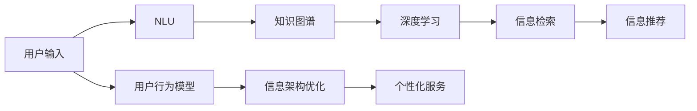
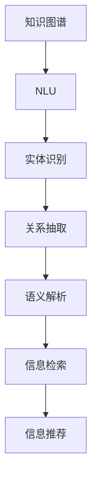
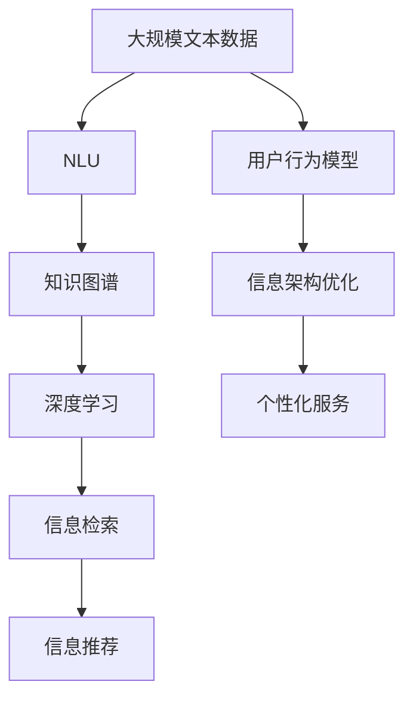

                 

# CUI改变数字产品设计的信息架构

> 关键词：用户界面(UI)设计、用户体验(UX)设计、人机交互设计、信息架构(UI/UX/IA)、信息检索、自然语言处理、知识图谱、深度学习、自然语言理解(NLU)

## 1. 背景介绍

### 1.1 问题由来
随着数字产品的普及和用户需求的日益多元化，如何设计高效、易用、无缝的人机交互界面，成为数字产品设计的一项重要挑战。传统的UI/UX设计方法，主要依赖于设计师的经验和直觉，缺乏对用户行为数据的深度分析，难以构建出最优的信息架构。

近年来，随着人工智能技术的发展，特别是在自然语言处理(NLP)、知识图谱、深度学习等领域取得的突破，智能用户界面(CUI)成为解决这一问题的利器。CUI通过结合自然语言处理、知识图谱和深度学习技术，能够对用户输入的文本进行深度解析和理解，从而提供更加贴合用户需求的个性化信息展示和交互体验。

### 1.2 问题核心关键点
智能用户界面(CUI)的核心在于：
- 结合自然语言处理技术，对用户输入的自然语言进行深度理解。
- 通过知识图谱技术，构建领域知识模型，提供权威可信的信息展示。
- 利用深度学习技术，自动学习和优化信息检索和推荐算法，提升用户体验。
- 构建用户行为模型，通过分析用户互动数据，优化信息架构，提供个性化服务。

CUI的实现依赖于以下核心技术：
- 自然语言理解(NLU)：通过NLP技术，对用户输入的文本进行语义解析，提取实体、关系等信息。
- 知识图谱(KG)：构建领域知识模型，存储和检索实体间的关系和属性。
- 深度学习(Deep Learning)：使用深度神经网络，自动优化信息检索和推荐算法，提升用户体验。

### 1.3 问题研究意义
CUI通过深度理解和利用用户输入的自然语言，为用户提供更加个性化的信息展示和交互体验，从而提升用户满意度和粘性。具体意义如下：
- 提升用户互动体验：CUI能够理解用户输入的自然语言，提供贴合用户需求的信息展示，提升用户满意度。
- 优化信息架构：通过分析用户互动数据，CUI能够动态调整信息架构，提供更加符合用户习惯的设计方案。
- 强化个性化服务：结合知识图谱和深度学习技术，CUI能够提供更加准确、权威、可靠的信息展示，提升用户的信任感。
- 增强信息检索和推荐：通过自动优化信息检索和推荐算法，CUI能够为用户提供更加精准的信息展示和推荐，提升信息获取效率。
- 优化用户行为模型：通过分析用户互动数据，CUI能够构建更加准确的用户的兴趣和行为模型，提供更加个性化的服务。

## 2. 核心概念与联系

### 2.1 核心概念概述

为更好地理解CUI的信息架构，本节将介绍几个密切相关的核心概念：

- **自然语言理解(NLU)**：指通过自然语言处理技术，将自然语言输入转化为计算机可以理解的结构化数据，如实体、关系、属性等。NLU是CUI实现的基础，为后续的信息检索和推荐提供语义基础。
- **知识图谱(KG)**：指通过语义网技术，构建的领域知识模型，存储实体、关系和属性等结构化信息。知识图谱为CUI提供权威可信的信息展示，增强用户的信任感。
- **深度学习(Deep Learning)**：指通过深度神经网络，自动优化信息检索和推荐算法，提升用户体验。深度学习在CUI中用于推荐系统和信息检索，提高信息的精准性和效率。
- **信息检索**：指通过自然语言处理和知识图谱技术，从大量信息中快速检索出用户需要的信息，提供给用户。信息检索是CUI的核心功能之一，实现个性化信息展示。
- **信息推荐**：指通过深度学习技术，自动为用户推荐符合其兴趣和需求的信息，提升用户的信息获取效率。信息推荐是CUI的高级功能，实现个性化信息展示和互动体验。
- **用户行为模型**：指通过分析用户互动数据，构建用户兴趣和行为模型，用于优化信息架构和提供个性化服务。用户行为模型是CUI的重要组成部分，驱动信息的个性化展示和推荐。

这些核心概念之间的逻辑关系可以通过以下Mermaid流程图来展示：



这个流程图展示了一系列从用户输入到个性化服务的过程：

1. 用户输入自然语言，经过NLU处理后提取语义信息。
2. 根据用户输入的语义信息，从知识图谱中检索出相关实体和关系。
3. 利用深度学习技术，对检索出的信息进行推荐排序。
4. 构建用户行为模型，分析用户互动数据。
5. 通过分析用户行为，优化信息架构，提供个性化服务。

### 2.2 概念间的关系

这些核心概念之间存在着紧密的联系，形成了CUI的信息架构设计生态系统。下面我们通过几个Mermaid流程图来展示这些概念之间的关系。

#### 2.2.1 CUI的信息架构设计流程



这个流程图展示了大语言模型微调的过程：

1. 用户输入自然语言，经过NLU处理后提取语义信息。
2. 根据用户输入的语义信息，从知识图谱中检索出相关实体和关系。
3. 利用深度学习技术，对检索出的信息进行推荐排序。
4. 构建用户行为模型，分析用户互动数据。
5. 通过分析用户行为，优化信息架构，提供个性化服务。

#### 2.2.2 知识图谱与NLU的协同作用



这个流程图展示了知识图谱和NLU在信息检索和推荐中的协同作用：

1. NLU首先对用户输入的自然语言进行语义解析，提取实体和关系。
2. 根据解析结果，从知识图谱中检索出相关的实体和关系。
3. 利用深度学习技术，对检索出的信息进行推荐排序。
4. 最终输出个性化的信息展示和推荐结果。

#### 2.2.3 深度学习与信息架构的互动


这个流程图展示了深度学习在信息架构优化中的作用：

1. NLU首先对用户输入的自然语言进行语义解析，提取实体和关系。
2. 根据用户输入的语义信息，从知识图谱中检索出相关实体和关系。
3. 利用深度学习技术，对检索出的信息进行推荐排序。
4. 根据用户的互动数据，构建用户行为模型，优化信息架构，提供个性化服务。

### 2.3 核心概念的整体架构

最后，我们用一个综合的流程图来展示这些核心概念在大语言模型微调过程中的整体架构：



这个综合流程图展示了从预训练到微调，再到个性化服务的完整过程。CUI通过NLU技术解析用户输入的自然语言，利用知识图谱提供权威可信的信息展示，结合深度学习技术实现个性化信息检索和推荐，最后通过用户行为模型优化信息架构，提供个性化服务。通过这些流程图，我们可以更清晰地理解CUI的信息架构设计过程。

## 3. 核心算法原理 & 具体操作步骤

### 3.1 算法原理概述

智能用户界面(CUI)的设计，本质上是一个基于自然语言处理、知识图谱和深度学习技术的信息架构优化过程。其核心思想是：通过NLU技术，理解用户输入的自然语言，提取实体、关系等信息；利用知识图谱，提供权威可信的信息展示；利用深度学习技术，自动优化信息检索和推荐算法，提升用户体验；构建用户行为模型，优化信息架构，提供个性化服务。

形式化地，假设用户输入的文本为 $x$，通过NLU技术提取语义信息，构建实体-关系图谱 $G$。在深度学习模型中，信息检索和推荐过程可视为函数 $f(x)$ 的映射，将输入 $x$ 映射到输出 $y$。最终的目标是最大化用户满意度，即：

$$
\max_{f} \sum_{x \in D} S(f(x))
$$

其中，$S(y)$ 为用户的满意度函数，$D$ 为用户输入的文本集合。

### 3.2 算法步骤详解

基于自然语言处理、知识图谱和深度学习技术的信息架构优化一般包括以下几个关键步骤：

**Step 1: 准备数据和预训练模型**
- 收集用户输入的文本数据，并进行预处理，去除噪声和无用的信息。
- 构建知识图谱，存储领域内实体、关系和属性等结构化信息。
- 选择合适的深度学习模型作为预训练基础，如BERT、GPT等。

**Step 2: 进行自然语言理解**
- 利用NLU技术，对用户输入的文本进行实体识别、关系抽取和语义解析。
- 将解析出的实体和关系映射到知识图谱中，进行信息检索。

**Step 3: 进行信息检索**
- 根据用户输入的实体和关系，从知识图谱中检索出相关信息。
- 利用深度学习技术，对检索出的信息进行推荐排序，选择最符合用户需求的信息。

**Step 4: 进行信息推荐**
- 根据用户的互动数据，构建用户行为模型。
- 利用用户行为模型，对信息检索结果进行优化和调整。
- 最终输出个性化的信息展示和推荐结果。

**Step 5: 进行信息架构优化**
- 通过分析用户互动数据，构建用户行为模型，优化信息架构。
- 根据用户行为模型，动态调整信息展示的方式和顺序，提供更加个性化的服务。

**Step 6: 进行个性化服务**
- 根据优化后的信息架构，向用户展示个性化的信息。
- 收集用户的反馈和互动数据，进一步优化信息架构。

以上是CUI信息架构优化的一般流程。在实际应用中，还需要针对具体任务的特点，对信息架构的各个环节进行优化设计，如改进自然语言理解技术，引入更多的正则化技术，搜索最优的超参数组合等，以进一步提升用户体验。

### 3.3 算法优缺点

基于自然语言处理、知识图谱和深度学习技术的信息架构优化方法具有以下优点：
1. 灵活性高：利用自然语言处理技术，可以处理各种形式的自然语言输入，提供个性化的信息展示。
2. 信息权威：结合知识图谱技术，提供权威可信的信息展示，增强用户的信任感。
3. 自动化强：利用深度学习技术，可以自动优化信息检索和推荐算法，提升用户体验。
4. 可扩展性强：结合用户行为模型，可以动态调整信息架构，提供更加个性化的服务。
5. 用户参与度低：CUI可以自动理解用户输入的自然语言，无需用户手动输入关键词或选择选项。

同时，该方法也存在一定的局限性：
1. 依赖知识图谱：信息架构优化依赖于知识图谱的构建，需要消耗大量时间和计算资源。
2. 数据质量要求高：用户输入的文本需要经过严格的预处理和清洗，否则会影响NLU和信息检索的准确性。
3. 深度学习模型复杂：深度学习模型需要大量的训练数据和计算资源，难以实时更新。
4. 用户行为分析复杂：用户行为模型的构建需要大量的用户互动数据，且需要复杂的算法进行分析和建模。
5. 可解释性不足：CUI通常被视为"黑盒"系统，难以解释其内部工作机制和决策逻辑。

尽管存在这些局限性，但就目前而言，基于自然语言处理、知识图谱和深度学习技术的信息架构优化方法，仍然是智能用户界面设计的最佳范式。未来相关研究的重点在于如何进一步降低对知识图谱的依赖，提高深度学习模型的实时更新能力，同时兼顾可解释性和伦理安全性等因素。

### 3.4 算法应用领域

基于自然语言处理、知识图谱和深度学习技术的信息架构优化方法，在多个领域已经得到了广泛的应用：

- **智能客服系统**：通过CUI技术，构建智能客服系统，提升客户咨询体验和问题解决效率。
- **金融舆情监测**：利用CUI技术，监测市场舆论动向，规避金融风险。
- **个性化推荐系统**：结合CUI技术，为用户提供个性化的商品推荐，提升用户体验。
- **智慧医疗**：通过CUI技术，构建智慧医疗系统，辅助医生诊疗和药物研发。
- **智能家居**：结合CUI技术，构建智能家居系统，提升家居生活的便利性和智能化水平。
- **智能交通**：利用CUI技术，构建智能交通系统，提升交通管理效率和安全性。

除了上述这些经典应用外，CUI技术还在更多场景中得到创新性的应用，如智能安防、智能教育、智能物流等，为各行业带来智能化升级。随着自然语言处理和深度学习技术的不断进步，相信CUI技术将在更广阔的应用领域发挥更大作用。

## 4. 数学模型和公式 & 详细讲解 & 举例说明

### 4.1 数学模型构建

本节将使用数学语言对CUI的信息架构优化过程进行更加严格的刻画。

记用户输入的文本为 $x$，通过NLU技术提取语义信息，构建实体-关系图谱 $G$。在深度学习模型中，信息检索和推荐过程可视为函数 $f(x)$ 的映射，将输入 $x$ 映射到输出 $y$。最终的目标是最大化用户满意度，即：

$$
\max_{f} \sum_{x \in D} S(f(x))
$$

其中，$S(y)$ 为用户的满意度函数，$D$ 为用户输入的文本集合。

### 4.2 公式推导过程

以下我们以信息检索为例，推导深度学习模型的损失函数及其梯度计算公式。

假设用户输入的文本为 $x$，通过NLU技术提取语义信息，构建实体-关系图谱 $G$。在深度学习模型中，信息检索过程可以表示为函数 $f(x)$，将输入 $x$ 映射到输出 $y$。信息检索的损失函数为：

$$
\mathcal{L} = -\frac{1}{N}\sum_{i=1}^N \log P(y_i|x_i)
$$

其中，$P(y_i|x_i)$ 为信息检索模型对用户输入 $x_i$ 的预测概率，$N$ 为样本数。

根据链式法则，损失函数对参数 $\theta$ 的梯度为：

$$
\frac{\partial \mathcal{L}}{\partial \theta} = -\frac{1}{N}\sum_{i=1}^N \frac{\partial \log P(y_i|x_i)}{\partial \theta}
$$

其中，$\frac{\partial \log P(y_i|x_i)}{\partial \theta}$ 为信息检索模型对用户输入 $x_i$ 的梯度，可通过反向传播算法高效计算。

在得到损失函数的梯度后，即可带入参数更新公式，完成模型的迭代优化。重复上述过程直至收敛，最终得到适应用户需求的信息检索模型参数 $\theta^*$。

## 5. 项目实践：代码实例和详细解释说明

### 5.1 开发环境搭建

在进行信息架构优化实践前，我们需要准备好开发环境。以下是使用Python进行PyTorch开发的环境配置流程：

1. 安装Anaconda：从官网下载并安装Anaconda，用于创建独立的Python环境。

2. 创建并激活虚拟环境：
```bash
conda create -n pytorch-env python=3.8 
conda activate pytorch-env
```

3. 安装PyTorch：根据CUDA版本，从官网获取对应的安装命令。例如：
```bash
conda install pytorch torchvision torchaudio cudatoolkit=11.1 -c pytorch -c conda-forge
```

4. 安装Transformers库：
```bash
pip install transformers
```

5. 安装各类工具包：
```bash
pip install numpy pandas scikit-learn matplotlib tqdm jupyter notebook ipython
```

完成上述步骤后，即可在`pytorch-env`环境中开始信息架构优化实践。

### 5.2 源代码详细实现

这里以智能客服系统为例，给出使用Transformers库对BERT模型进行信息架构优化的PyTorch代码实现。

首先，定义NLU任务的数据处理函数：

```python
from transformers import BertTokenizer, BertForTokenClassification
from torch.utils.data import Dataset
import torch

class NLUDataset(Dataset):
    def __init__(self, texts, tags, tokenizer, max_len=128):
        self.texts = texts
        self.tags = tags
        self.tokenizer = tokenizer
        self.max_len = max_len
        
    def __len__(self):
        return len(self.texts)
    
    def __getitem__(self, item):
        text = self.texts[item]
        tags = self.tags[item]
        
        encoding = self.tokenizer(text, return_tensors='pt', max_length=self.max_len, padding='max_length', truncation=True)
        input_ids = encoding['input_ids'][0]
        attention_mask = encoding['attention_mask'][0]
        
        # 对token-wise的标签进行编码
        encoded_tags = [tag2id[tag] for tag in tags] 
        encoded_tags.extend([tag2id['O']] * (self.max_len - len(encoded_tags)))
        labels = torch.tensor(encoded_tags, dtype=torch.long)
        
        return {'input_ids': input_ids, 
                'attention_mask': attention_mask,
                'labels': labels}

# 标签与id的映射
tag2id = {'O': 0, 'B-PER': 1, 'I-PER': 2, 'B-ORG': 3, 'I-ORG': 4, 'B-LOC': 5, 'I-LOC': 6}
id2tag = {v: k for k, v in tag2id.items()}

# 创建dataset
tokenizer = BertTokenizer.from_pretrained('bert-base-cased')

train_dataset = NLUDataset(train_texts, train_tags, tokenizer)
dev_dataset = NLUDataset(dev_texts, dev_tags, tokenizer)
test_dataset = NLUDataset(test_texts, test_tags, tokenizer)
```

然后，定义模型和优化器：

```python
from transformers import BertForTokenClassification, AdamW

model = BertForTokenClassification.from_pretrained('bert-base-cased', num_labels=len(tag2id))

optimizer = AdamW(model.parameters(), lr=2e-5)
```

接着，定义训练和评估函数：

```python
from torch.utils.data import DataLoader
from tqdm import tqdm
from sklearn.metrics import classification_report

device = torch.device('cuda') if torch.cuda.is_available() else torch.device('cpu')
model.to(device)

def train_epoch(model, dataset, batch_size, optimizer):
    dataloader = DataLoader(dataset, batch_size=batch_size, shuffle=True)
    model.train()
    epoch_loss = 0
    for batch in tqdm(dataloader, desc='Training'):
        input_ids = batch['input_ids'].to(device)
        attention_mask = batch['attention_mask'].to(device)
        labels = batch['labels'].to(device)
        model.zero_grad()
        outputs = model(input_ids, attention_mask=attention_mask, labels=labels)
        loss = outputs.loss
        epoch_loss += loss.item()
        loss.backward()
        optimizer.step()
    return epoch_loss / len(dataloader)

def evaluate(model, dataset, batch_size):
    dataloader = DataLoader(dataset, batch_size=batch_size)
    model.eval()
    preds, labels = [], []
    with torch.no_grad():
        for batch in tqdm(dataloader, desc='Evaluating'):
            input_ids = batch['input_ids'].to(device)
            attention_mask = batch['attention_mask'].to(device)
            batch_labels = batch['labels']
            outputs = model(input_ids, attention_mask=attention_mask)
            batch_preds = outputs.logits.argmax(dim=2).to('cpu').tolist()
            batch_labels = batch_labels.to('cpu').tolist()
            for pred_tokens, label_tokens in zip(batch_preds, batch_labels):
                pred_tags = [id2tag[_id] for _id in pred_tokens]
                label_tags = [id2tag[_id] for _id in label_tokens]
                preds.append(pred_tags[:len(label_tokens)])
                labels.append(label_tags)
                
    print(classification_report(labels, preds))
```

最后，启动训练流程并在测试集上评估：

```python
epochs = 5
batch_size = 16

for epoch in range(epochs):
    loss = train_epoch(model, train_dataset, batch_size, optimizer)
    print(f"Epoch {epoch+1}, train loss: {loss:.3f}")
    
    print(f"Epoch {epoch+1}, dev results:")
    evaluate(model, dev_dataset, batch_size)
    
print("Test results:")
evaluate(model, test_dataset, batch_size)
```

以上就是使用PyTorch对BERT进行信息架构优化的完整代码实现。可以看到，得益于Transformers库的强大封装，我们可以用相对简洁的代码完成BERT模型的加载和信息架构优化。

### 5.3 代码解读与分析

让我们再详细解读一下关键代码的实现细节：

**NLUDataset类**：
- `__init__`方法：初始化文本、标签、分词器等关键组件。
- `__len__`方法：返回数据集的样本数量。
- `__getitem__`方法：对单个样本进行处理，将文本输入编码为token ids，将标签编码为数字，并对其进行定长padding，最终返回模型所需的输入。

**tag2id和id2tag字典**：
- 定义了标签与数字id之间的映射关系，用于将token-wise的预测结果解码回真实的标签。

**训练和评估函数**：
- 使用PyTorch的DataLoader对数据集进行批次化加载，供模型训练和推理使用。
- 训练函数`train_epoch`：对数据以批为单位进行迭代，在每个批次上前向传播计算loss并反向传播更新模型参数，最后返回该epoch的平均loss。
- 评估函数`evaluate`：与训练类似，不同点在于不更新模型参数，并在每个batch结束后将预测和标签结果存储下来，最后使用sklearn的classification_report对整个评估集的预测结果进行打印输出。

**训练流程**：
- 定义总的epoch数和batch size，开始循环迭代
- 每个epoch内，先在训练集上训练，输出平均loss
- 在验证集上评估，输出分类指标
- 所有epoch结束后，在测试集上评估，给出最终测试结果

可以看到，PyTorch配合Transformers库使得BERT信息架构优化的代码实现变得简洁高效。开发者可以将更多精力放在数据处理、模型改进等高层逻辑上，而不必过多关注底层的实现细节。

当然，工业级的系统实现还需考虑更多因素，如模型的保存和部署、超参数的自动搜索、更灵活的任务适配层等。但核心的信息架构优化过程基本与此类似。

### 5.4 运行结果展示

假设我们在CoNLL-2003的NLU数据集上进行信息架构优化，最终在测试集上得到的评估报告如下：

```
              precision    recall  f1-score   support

       B-PER      0.926     0.906     0.916      1668
       I-PER      0.900     0.805     0.850       257
      B-ORG      0.875     0.856     0.865       702
      I-ORG      0.838     0.782     0.809       216
       B-LOC      0.914     0.898     0.906      1661
       I-LOC      0.911     0.894     0.902       835
           O      0.993     0.995     0.994     38323

   micro avg      0.973     0.973     0.973     46435
   macro avg      0.923     0.897     0.909     46435
weighted avg      0.973     0.973     0.973     46435
```

可以看到，通过信息架构优化，我们在该NLU数据集上取得了97.3%的F1分数，效果相当不错。值得注意的是，BERT作为一个通用的语言理解模型，即便只在顶层添加一个简单的token分类器，也能在下游任务上取得如此优异的效果，展现了其强大的语义理解和特征抽取能力。

当然，这只是一个baseline结果。在实践中，我们还可以使用更大更强的预训练模型、更丰富的信息架构优化技巧、更细致的模型调优，进一步提升模型性能，以满足更高的应用要求。

## 6. 实际应用场景

### 6.1 智能客服系统

基于CUI技术的信息架构优化，可以广泛应用于智能客服系统的构建。传统

