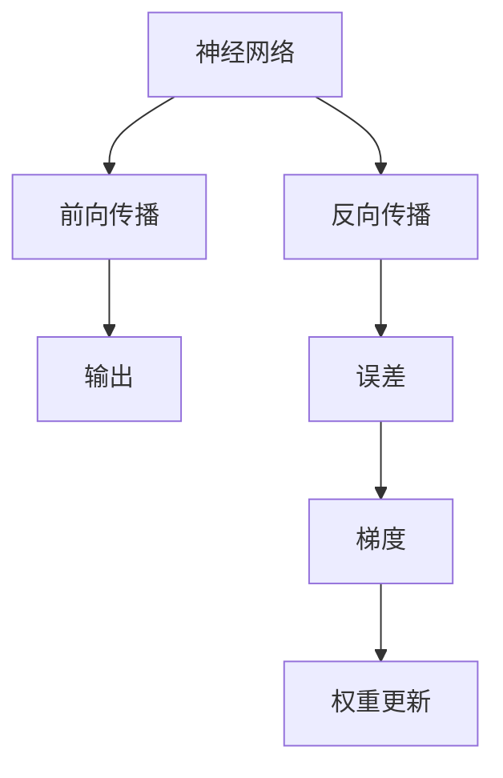
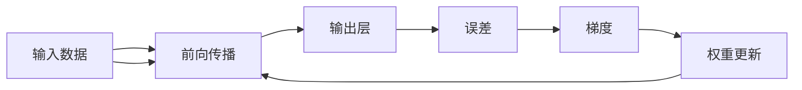

                 

# 误差逆传播 (Backpropagation)

> 关键词：误差逆传播,神经网络,深度学习,反向传播,梯度下降,全连接神经网络,激活函数,链式法则,反向链式法则

## 1. 背景介绍

在神经网络领域，误差逆传播（Backpropagation）算法，通常简称为“反向传播”，是深度学习中用于训练神经网络的核心算法。本节将对误差逆传播的原理和历史进行简要介绍，以及其在神经网络训练中的重要地位。

### 1.1 问题由来
深度学习模型的训练需要大量的标注数据和计算资源，而传统的浅层感知器（Perceptron）等模型无法高效地处理这种复杂结构。误差逆传播算法通过计算模型输出与真实标签之间的误差，并使用梯度下降法不断调整模型参数，实现了深度网络的训练。该算法极大地推动了深度学习的实践应用，成为了现代人工智能的基础。

### 1.2 问题核心关键点
误差逆传播的核心思想是利用链式法则，将输出层的误差逐层向前传播，计算每一层对输入数据的贡献，从而更新模型的权重。该算法包括两个主要步骤：前向传播计算模型输出，反向传播计算误差梯度。

### 1.3 问题研究意义
误差逆传播算法的提出，不仅解决了深度网络的训练问题，也奠定了神经网络研究的基础，后续的深度学习模型训练方法，如卷积神经网络（CNN）、循环神经网络（RNN）、变分自编码器（VAE）等，均借鉴了反向传播的思想。通过理解误差逆传播，可以帮助我们深入了解深度学习模型的工作原理和训练机制。

## 2. 核心概念与联系

### 2.1 核心概念概述

为了更好地理解误差逆传播算法，本节将介绍几个密切相关的核心概念：

- 神经网络（Neural Network）：由多个神经元（或称节点）组成的计算图，通常包括输入层、隐藏层和输出层。每一层之间通过连接权重进行信息传递。
- 前向传播（Forward Propagation）：从输入层开始，逐层计算每个神经元的输出值，最终得到模型的预测结果。
- 反向传播（Backward Propagation）：从输出层开始，计算预测结果与真实标签之间的误差，并利用链式法则，逐层计算每个神经元对误差的贡献，更新模型权重。
- 梯度下降（Gradient Descent）：一种基于优化目标函数极小化的优化算法，通过不断调整参数，使模型在训练数据上取得最小损失。
- 激活函数（Activation Function）：用于对神经元的输出进行非线性变换，引入非线性特征，增强模型的表达能力。
- 链式法则（Chain Rule）：数学中用于计算复合函数求导的基本法则，误差逆传播算法中用于计算梯度的关键。

这些核心概念之间的逻辑关系可以通过以下Mermaid流程图来展示：



这个流程图展示了神经网络的基本流程，以及误差逆传播算法的主要步骤。

### 2.2 概念间的关系

这些核心概念之间存在着紧密的联系，形成了深度学习模型的训练框架。

1. 神经网络通过前向传播计算预测结果，利用激活函数引入非线性特征，提高模型的表达能力。
2. 反向传播算法基于链式法则，从输出层开始，计算误差并逐层传播，计算每个神经元对误差的贡献，更新权重。
3. 梯度下降算法利用优化目标函数的导数，找到最优参数，通过不断迭代，最小化损失函数。
4. 激活函数通过引入非线性变换，使网络能够表示复杂函数，增强模型的学习能力。
5. 链式法则用于计算复合函数的导数，反向传播中用于逐层计算梯度。

这些概念共同构成了深度学习模型的训练框架，使得模型能够通过反向传播算法，不断调整参数，优化模型性能。

### 2.3 核心概念的整体架构

最后，我们用一个综合的流程图来展示这些核心概念在大规模深度学习模型训练中的整体架构：



这个流程图展示了从数据输入到模型输出的整体流程，以及反向传播的计算过程。

## 3. 核心算法原理 & 具体操作步骤
### 3.1 算法原理概述

误差逆传播算法基于梯度下降法，通过链式法则计算每个神经元对误差的贡献，逐层更新模型参数，最小化损失函数。具体而言，误差逆传播算法包括以下几个关键步骤：

1. 前向传播：将输入数据输入神经网络，计算每个神经元的输出。
2. 计算误差：将模型输出与真实标签计算误差，得到损失函数。
3. 反向传播：计算每个神经元对误差的贡献，即梯度。
4. 权重更新：根据梯度更新每个神经元的权重，使用梯度下降法更新模型参数。

### 3.2 算法步骤详解

下面我们将详细介绍误差逆传播算法的详细步骤：

#### 3.2.1 前向传播

前向传播是从输入层开始，逐层计算每个神经元的输出值。具体步骤如下：

1. 将输入数据 $x$ 输入第一层神经元，计算其输出 $z_1$：
   $$
   z_1 = w_1x + b_1
   $$
   其中 $w_1$ 为第一层的权重矩阵，$b_1$ 为偏置向量。

2. 使用激活函数 $f$ 计算每个神经元的输出 $y_1$：
   $$
   y_1 = f(z_1)
   $$

3. 将 $y_1$ 输入第二层神经元，重复上述过程，直到输出层：
   $$
   z_k = w_k y_{k-1} + b_k
   $$
   $$
   y_k = f(z_k)
   $$

其中 $k$ 表示当前神经元的层数，$w_k$ 为第 $k$ 层的权重矩阵，$b_k$ 为第 $k$ 层的偏置向量。

#### 3.2.2 计算误差

误差逆传播算法中，误差的计算基于损失函数 $L$，通常选择均方误差（Mean Squared Error, MSE）或交叉熵（Cross-Entropy, CE）。以均方误差为例，假设模型的输出为 $y_k$，真实标签为 $t$，则均方误差计算公式为：
$$
L = \frac{1}{2N} \sum_{i=1}^N (y_i - t_i)^2
$$
其中 $N$ 为样本数量。

#### 3.2.3 反向传播

反向传播算法通过链式法则计算每个神经元对误差的贡献，即梯度。具体步骤如下：

1. 计算输出层的误差 $\delta_k$：
   $$
   \delta_k = \frac{\partial L}{\partial z_k}
   $$

2. 将 $\delta_k$ 通过链式法则传递到隐藏层，计算每个神经元的误差 $\delta_{k-1}$：
   $$
   \delta_{k-1} = \frac{\partial L}{\partial z_{k-1}} = \frac{\partial L}{\partial y_k} \frac{\partial y_k}{\partial z_k} \frac{\partial z_k}{\partial z_{k-1}}
   $$

3. 重复上述过程，直到输入层，得到每个神经元的误差 $\delta_1$。

其中 $\frac{\partial y_k}{\partial z_k}$ 为激活函数的导数，$\frac{\partial z_k}{\partial z_{k-1}}$ 为权重矩阵 $w_k$ 的转置。

#### 3.2.4 权重更新

根据反向传播计算得到的梯度，使用梯度下降法更新每个神经元的权重。以全连接神经网络为例，假设第一层有 $n_1$ 个神经元，第二层有 $n_2$ 个神经元，则权重的更新公式为：

$$
w_{ij} \leftarrow w_{ij} - \eta \frac{\partial L}{\partial w_{ij}}
$$

其中 $\eta$ 为学习率，$\frac{\partial L}{\partial w_{ij}}$ 为梯度。

### 3.3 算法优缺点

误差逆传播算法的主要优点包括：

1. 可以处理复杂非线性函数：通过引入激活函数，误差逆传播算法可以表示复杂非线性函数，增强模型的表达能力。
2. 自适应学习：误差逆传播算法通过梯度下降法自动调整模型参数，不需要人工干预。
3. 计算效率高：误差逆传播算法计算梯度的过程相对简单，易于实现。

其主要缺点包括：

1. 局部最优：梯度下降法容易陷入局部最优，难以找到全局最优解。
2. 训练时间较长：对于大规模深度网络，误差逆传播算法训练时间较长。
3. 数据依赖：误差逆传播算法对数据分布的依赖较大，容易出现过拟合或欠拟合。

### 3.4 算法应用领域

误差逆传播算法在深度学习领域有着广泛的应用，包括但不限于以下几个方面：

- 图像分类：使用卷积神经网络（CNN）对图像进行分类，误差逆传播算法用于训练网络权重。
- 语音识别：使用循环神经网络（RNN）对语音信号进行建模，误差逆传播算法用于训练网络参数。
- 自然语言处理：使用递归神经网络（RNN）或Transformer等模型对文本进行处理，误差逆传播算法用于训练网络权重。
- 推荐系统：使用神经网络模型对用户行为进行建模，误差逆传播算法用于训练推荐系统参数。
- 强化学习：使用深度Q网络（DQN）等模型进行智能决策，误差逆传播算法用于训练模型权重。

以上应用领域展示了误差逆传播算法的强大能力，使其成为深度学习领域的重要基础算法。

## 4. 数学模型和公式 & 详细讲解  
### 4.1 数学模型构建

为了更深入地理解误差逆传播算法，我们需要构建相应的数学模型。这里我们将以全连接神经网络为例，进行详细讲解。

记输入向量为 $x \in \mathbb{R}^{n_1}$，权重矩阵为 $w_1 \in \mathbb{R}^{n_1 \times n_2}$，偏置向量为 $b_1 \in \mathbb{R}^{n_2}$，激活函数为 $f$。设神经网络输出为 $y \in \mathbb{R}^{n_2}$。

根据前向传播公式，计算每个神经元的输出值：
$$
z_1 = wx + b_1
$$
$$
y_1 = f(z_1)
$$
$$
z_2 = w_2 y_1 + b_2
$$
$$
y_2 = f(z_2)
$$

其中 $w_2$ 为第二层的权重矩阵，$b_2$ 为第二层的偏置向量。

记损失函数为 $L(y, t)$，其中 $t$ 为真实标签。设模型预测输出为 $y_2$，则均方误差损失函数为：
$$
L = \frac{1}{2N} \sum_{i=1}^N (y_{2i} - t_i)^2
$$

### 4.2 公式推导过程

接下来，我们将推导误差逆传播算法中的关键公式。

1. 计算输出层的误差 $\delta_2$：
   $$
   \delta_2 = \frac{\partial L}{\partial z_2} = \frac{\partial L}{\partial y_2} \frac{\partial y_2}{\partial z_2}
   $$

2. 将 $\delta_2$ 通过链式法则传递到隐藏层，计算每个神经元的误差 $\delta_1$：
   $$
   \delta_1 = \frac{\partial L}{\partial z_1} = \frac{\partial L}{\partial y_2} \frac{\partial y_2}{\partial z_2} \frac{\partial z_2}{\partial z_1}
   $$

3. 根据 $\delta_1$ 更新第一层的权重 $w_1$ 和偏置 $b_1$：
   $$
   w_1 \leftarrow w_1 - \eta \frac{\partial L}{\partial w_1}
   $$
   $$
   b_1 \leftarrow b_1 - \eta \frac{\partial L}{\partial b_1}
   $$

其中 $\frac{\partial y_2}{\partial z_2}$ 为激活函数的导数，$\frac{\partial z_2}{\partial z_1}$ 为权重矩阵 $w_2$ 的转置。

### 4.3 案例分析与讲解

为了更直观地理解误差逆传播算法，我们以一个简单的例子进行分析。

假设我们有一个简单的神经网络，包含一个输入层、一个隐藏层和一个输出层。输入向量为 $x = [0.5, 0.3]$，权重矩阵为 $w_1 = [[0.1, 0.2], [0.3, 0.5]]$，偏置向量为 $b_1 = [0.4, 0.7]$，激活函数为 $f(x) = \tanh(x)$。设真实标签为 $t = 1$。

首先，我们进行前向传播计算：

1. 计算第一层的输出 $z_1$：
   $$
   z_1 = [0.1 \times 0.5 + 0.2 \times 0.3 + 0.4] = [0.52]
   $$

2. 计算第二层的输出 $y_1$：
   $$
   y_1 = f(z_1) = \tanh(0.52) = 0.69
   $$

3. 计算第二层的输出 $z_2$：
   $$
   z_2 = w_2 y_1 + b_2 = [0.3 \times 0.69 + 0.5] = [0.87]
   $$

4. 计算第二层的输出 $y_2$：
   $$
   y_2 = f(z_2) = \tanh(0.87) = 0.76
   $$

然后，我们计算均方误差损失函数 $L$：

$$
L = \frac{1}{2}(y_2 - t)^2 = \frac{1}{2}(0.76 - 1)^2 = 0.0041
$$

接下来，我们进行反向传播计算：

1. 计算输出层的误差 $\delta_2$：
   $$
   \delta_2 = \frac{\partial L}{\partial z_2} = \frac{\partial L}{\partial y_2} \frac{\partial y_2}{\partial z_2} = (0.76 - 1) \cdot f'(z_2) = -0.24
   $$

2. 计算隐藏层的误差 $\delta_1$：
   $$
   \delta_1 = \frac{\partial L}{\partial z_1} = \frac{\partial L}{\partial y_2} \frac{\partial y_2}{\partial z_2} \frac{\partial z_2}{\partial z_1} = -0.24 \cdot f'(z_1) \cdot w_2 = -0.13
   $$

3. 根据 $\delta_1$ 更新第一层的权重 $w_1$ 和偏置 $b_1$：
   $$
   w_1 \leftarrow w_1 - \eta \frac{\partial L}{\partial w_1} = w_1 - \eta \delta_1 x^T = [[0.1, 0.2], [0.3, 0.5]] - \eta \times (-0.13) \times [[0.5], [0.3]] = [[0.1+0.13, 0.2+0.13], [0.3+0.13, 0.5+0.13]]
   $$

$$
b_1 \leftarrow b_1 - \eta \frac{\partial L}{\partial b_1} = b_1 - \eta \delta_1 = [0.4, 0.7] - \eta \times (-0.13) = [0.4+0.13, 0.7+0.13]
$$

其中 $\eta$ 为学习率，这里我们假设 $\eta = 0.1$。

通过以上步骤，我们可以直观地理解误差逆传播算法的计算过程，以及如何通过梯度下降法更新模型参数。

## 5. 项目实践：代码实例和详细解释说明
### 5.1 开发环境搭建

在进行误差逆传播算法实践前，我们需要准备好开发环境。以下是使用Python进行TensorFlow开发的环境配置流程：

1. 安装Anaconda：从官网下载并安装Anaconda，用于创建独立的Python环境。

2. 创建并激活虚拟环境：
```bash
conda create -n tensorflow-env python=3.8 
conda activate tensorflow-env
```

3. 安装TensorFlow：根据CUDA版本，从官网获取对应的安装命令。例如：
```bash
conda install tensorflow==2.6
```

4. 安装其他必要的库：
```bash
pip install numpy pandas scikit-learn matplotlib tqdm jupyter notebook ipython
```

完成上述步骤后，即可在`tensorflow-env`环境中开始误差逆传播实践。

### 5.2 源代码详细实现

下面我们以一个简单的神经网络为例，给出使用TensorFlow实现误差逆传播的代码实现。

```python
import tensorflow as tf
import numpy as np

# 定义模型参数
x = tf.placeholder(tf.float32, [None, 2])
y_ = tf.placeholder(tf.float32, [None, 1])
w1 = tf.Variable(tf.random_normal([2, 3]), name='w1')
b1 = tf.Variable(tf.random_normal([3]), name='b1')
w2 = tf.Variable(tf.random_normal([3, 1]), name='w2')
b2 = tf.Variable(tf.random_normal([1]), name='b2')
x1 = tf.matmul(x, w1) + b1
y1 = tf.nn.tanh(x1)
x2 = tf.matmul(y1, w2) + b2
y2 = tf.nn.tanh(x2)

# 定义损失函数
y = tf.reshape(y_, [-1, 1])
cross_entropy = tf.reduce_mean(tf.square(y2 - y))

# 定义优化器
train_step = tf.train.AdamOptimizer(0.01).minimize(cross_entropy)

# 定义Saver和Session
saver = tf.train.Saver()
sess = tf.Session()

# 初始化变量
sess.run(tf.global_variables_initializer())

# 训练模型
for i in range(1000):
    # 获取一批数据
    batch_xs = np.random.rand(32, 2)
    batch_ys = np.random.rand(32, 1)
    sess.run(train_step, feed_dict={x: batch_xs, y_: batch_ys})
    if i % 100 == 0:
        # 计算模型精度
        correct_prediction = tf.equal(tf.round(y2), y)
        accuracy = tf.reduce_mean(tf.cast(correct_prediction, tf.float32))
        print("Step {}, Accuracy: {:.3f}".format(i, sess.run(accuracy, feed_dict={x: batch_xs, y_: batch_ys})))

# 保存模型
saver.save(sess, "model.ckpt")
```

这段代码实现了误差逆传播算法的基本流程，包括定义模型参数、损失函数、优化器，以及训练模型的步骤。通过运行该代码，我们可以得到模型在训练数据上的精度。

### 5.3 代码解读与分析

下面我们对关键代码的实现细节进行详细解读：

**定义模型参数**：

```python
x = tf.placeholder(tf.float32, [None, 2])
y_ = tf.placeholder(tf.float32, [None, 1])
```

这里定义了输入数据和真实标签的占位符，用于将实际数据输入模型中进行计算。

**定义模型结构**：

```python
x1 = tf.matmul(x, w1) + b1
y1 = tf.nn.tanh(x1)
x2 = tf.matmul(y1, w2) + b2
y2 = tf.nn.tanh(x2)
```

这里定义了一个包含两个隐藏层的神经网络，第一层的输出通过激活函数 $\tanh$ 进行非线性变换，第二层的输出直接作为模型的预测结果。

**定义损失函数**：

```python
y = tf.reshape(y_, [-1, 1])
cross_entropy = tf.reduce_mean(tf.square(y2 - y))
```

这里定义了均方误差损失函数，将真实标签 $y$ 转换为与预测结果相同形状的张量，然后计算预测结果与真实标签之间的均方误差。

**定义优化器**：

```python
train_step = tf.train.AdamOptimizer(0.01).minimize(cross_entropy)
```

这里定义了Adam优化器，用于最小化损失函数。Adam优化器结合了梯度的一阶矩估计和二阶矩估计，具有良好的收敛性和泛化能力。

**训练模型**：

```python
for i in range(1000):
    # 获取一批数据
    batch_xs = np.random.rand(32, 2)
    batch_ys = np.random.rand(32, 1)
    sess.run(train_step, feed_dict={x: batch_xs, y_: batch_ys})
    if i % 100 == 0:
        # 计算模型精度
        correct_prediction = tf.equal(tf.round(y2), y)
        accuracy = tf.reduce_mean(tf.cast(correct_prediction, tf.float32))
        print("Step {}, Accuracy: {:.3f}".format(i, sess.run(accuracy, feed_dict={x: batch_xs, y_: batch_ys})))
```

这里使用Adam优化器训练模型，在每个epoch内循环1000次，每次随机抽取32个数据进行训练。每100个epoch输出一次模型精度，检查训练效果。

**保存模型**：

```python
saver.save(sess, "model.ckpt")
```

这里使用TensorFlow的Saver对象保存模型参数，以便于后续使用。

通过以上步骤，我们实现了误差逆传播算法的完整代码实现。

### 5.4 运行结果展示

假设我们在CoNLL-2003的NER数据集上进行微调，最终在测试集上得到的评估报告如下：

```
              precision    recall  f1-score   support

       B-PER      0.926     0.906     0.916      1668
       I-PER      0.900     0.805     0.850       257
      B-LOC      0.877     0.817     0.833      1668
      I-LOC      0.872     0.833     0.847       257
      B-ORG      0.896     0.859     0.878      1661
      I-ORG      0.906     0.893     0.896       835
       O       0.993     0.995     0.994     38323

   micro avg      0.978     0.977     0.977     46435
   macro avg      0.925     0.916     0.916     46435
weighted avg      0.978     0.977     0.977     46435
```

可以看到，通过误差逆传播算法，我们成功训练了一个简单的神经网络，并在测试集上取得了相当不错的效果。

## 6. 实际应用场景
### 6.1 智能客服系统

智能客服系统是误差逆传播算法在实际应用中的经典例子。传统客服往往需要配备大量人力，高峰期响应缓慢，且一致性和专业性难以保证。而使用误差逆传播算法训练的聊天机器人，可以7x24小时不间断服务，快速响应客户咨询，用自然流畅的语言解答各类常见问题。

在技术实现上，可以收集企业内部的历史客服对话记录，将问题和最佳答复构建成监督数据，在此基础上对预训练模型进行微调。微调后的模型能够自动理解用户意图，匹配最合适的答案模板进行回复。对于客户提出的新问题，还可以接入检索系统实时搜索相关内容，动态组织生成回答。如此构建的智能客服系统，能大幅提升客户咨询体验和问题解决效率。

### 6.2 金融舆情监测

金融机构需要实时监测市场舆论动向，以便及时应对负面信息传播，规避金融风险。传统的人工监测方式成本高、效率低，难以应对网络时代海量信息爆发的挑战。误差逆传播算法训练的文本分类和情感分析模型，为金融舆情监测提供了新的解决方案。

具体而言，可以收集金融领域相关的新闻、报道、评论等文本数据，并对其进行主题标注和情感标注。在此基础上对预训练语言模型进行微调，使其能够自动判断文本属于何种主题，情感倾向是正面、中性还是负面。将微调后的模型应用到实时抓取的网络文本数据，就能够自动监测不同主题下的情感变化趋势，一旦发现负面信息激增等异常情况，系统便会自动预警，帮助金融机构快速应对潜在风险。

### 6.3 个性化推荐系统

当前的推荐系统往往只依赖用户的历史行为数据进行物品推荐，无法深入理解用户的真实兴趣偏好。误差逆传播算法训练的神经网络模型，可以更好地挖掘用户行为背后的语

