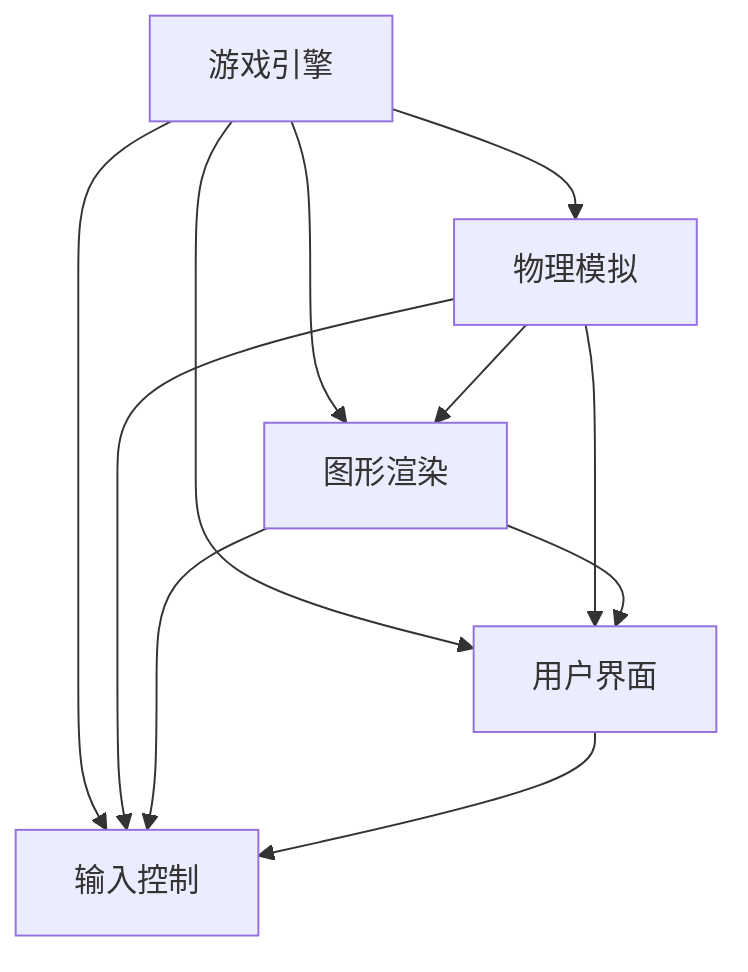

                 

# 超级玛丽游戏的设计与实现

超级玛丽（Super Mario）是一款经典且广受欢迎的游戏，自1985年问世以来，它就以其独特的游戏机制、精美的画面和亲切的角色设计征服了全球的玩家。本文将详细解析超级玛丽游戏的设计与实现，包括游戏背景、核心机制、技术细节、未来展望以及相关资源推荐，希望能为游戏开发者和爱好者提供有价值的信息。

## 1. 背景介绍

### 1.1 游戏起源与背景
超级玛丽由任天堂公司开发，最初为日本NES（任天堂娱乐系统）游戏机设计。这款游戏被广泛认为是游戏历史上最具影响力和标志性的作品之一，极大地推动了游戏机的普及和游戏产业的发展。

超级玛丽的游戏背景是一个充满奇幻元素的世界，玩家扮演的是主角马里奥（Mario），他的任务是营救被恶魔库巴（Koopa）绑架的公主桃子（Princess Peach）。玩家需要通过跳跃、奔跑、跳跃后旋转（旋转跳跃）等操作，穿越不同的关卡，克服各种障碍，最终解救公主。

### 1.2 游戏历史
超级玛丽系列游戏已发布多代，从早期的任天堂娱乐系统（NES）、超级任天堂（SNES）到任天堂64（N64）、GameCube、Wii、Nintendo DS和Wii U，每一代游戏都在画面、音效和游戏机制上都有不同程度的提升。

## 2. 核心概念与联系

### 2.1 核心概念概述

- **游戏引擎**：超级玛丽的游戏引擎是其设计和实现的核心部分，负责处理游戏逻辑、物理模拟、图形渲染、音频播放等功能。
- **物理模拟**：游戏中的物理机制，如跳跃、旋转、重力等，需要通过复杂的算法实现。
- **图形渲染**：超级玛丽以其精美的像素艺术和动画效果著称，这些效果的实现依赖于高效且强大的渲染引擎。
- **用户界面**：游戏中的菜单、分数显示、游戏进度提示等功能需要直观且易用的用户界面。
- **输入控制**：玩家通过游戏机按键进行输入，游戏引擎需要处理这些输入，转化为游戏角色的行为。

这些核心概念通过游戏引擎这个平台有机地联系起来，共同构成了超级玛丽游戏的完整体验。

### 2.2 概念间的关系

下图展示了这些核心概念之间的相互关系，以及它们如何共同作用于游戏体验的构建：



游戏引擎作为中心，通过物理模拟、图形渲染、用户界面和输入控制，将游戏的各个元素整合在一起，形成流畅且富有吸引力的游戏体验。

## 3. 核心算法原理 & 具体操作步骤

### 3.1 算法原理概述
超级玛丽的游戏引擎采用了多种算法和技术，包括但不限于：

- **碰撞检测**：用于判断玩家与环境元素（如墙壁、敌人、管道）之间的碰撞，从而决定玩家的行为。
- **运动控制**：包括跳跃、奔跑、旋转等动作的实现，这些动作需要通过复杂的物理模拟算法来计算。
- **路径规划**：通过算法确定角色在关卡中的最优路径，以避免障碍并快速到达目标位置。
- **动画处理**：实现角色的动画效果，包括帧动画、变形动画等。
- **状态机**：用于管理角色的不同状态（如站立、跳跃、躲避等）及其之间的转换。

这些算法和技术共同构成了超级玛丽游戏引擎的核心，使得游戏能够流畅运行，同时提供丰富的互动体验。

### 3.2 算法步骤详解
以下以跳跃动作为例，展示超级玛丽游戏引擎中核心算法的详细步骤：

1. **输入检测**：检测玩家按下跳跃键。
2. **状态转换**：角色从站立状态转换为跳跃状态。
3. **物理计算**：计算跳跃动作的轨迹，包括跳跃的高度、时间、速度等。
4. **碰撞检测**：在跳跃过程中检测玩家与环境元素的碰撞，并根据碰撞结果调整角色状态。
5. **动画播放**：根据角色状态播放相应的跳跃动画。
6. **状态转换**：角色从跳跃状态转换为站立状态。

### 3.3 算法优缺点
超级玛丽游戏引擎的优点包括：

- **高效**：通过优化算法和引擎架构，能够高效处理游戏逻辑和物理模拟。
- **稳定**：经过多年的测试和优化，游戏引擎具备较高的稳定性和可靠性。
- **可扩展**：支持多平台、多语言的开发，能够适应不同硬件和操作系统。

缺点包括：

- **复杂性高**：游戏引擎的实现需要处理大量的复杂算法和数据结构。
- **资源消耗高**：尤其是早期的游戏版本，由于硬件性能限制，资源消耗较大。
- **更新维护难度大**：随着游戏版本的更新，需要不断维护和优化游戏引擎。

### 3.4 算法应用领域
超级玛丽的游戏引擎和算法原理不仅适用于超级玛丽游戏，也广泛应用于其他平台和类型的游戏开发中，如马里奥赛车、马里奥派对等。此外，游戏中的物理模拟、动画处理和状态机管理等技术在其他游戏中的应用也非常广泛。

## 4. 数学模型和公式 & 详细讲解

### 4.1 数学模型构建
超级玛丽游戏中的物理模拟部分可以使用经典的运动学和动力学公式进行建模。例如，角色的跳跃动作可以通过以下公式计算：

$$
y(t) = y_0 + v_0t + \frac{1}{2}at^2
$$

其中，$y(t)$ 表示角色在时间 $t$ 的垂直位置，$y_0$ 是初始位置，$v_0$ 是初始速度，$a$ 是重力加速度，$t$ 是时间。

### 4.2 公式推导过程
以跳跃动作为例，推导其运动轨迹：

1. **初始状态**：角色从地面起跳，速度 $v_0$ 为0，高度 $y_0$ 为0。
2. **垂直运动**：根据上述公式，计算角色在任意时间 $t$ 的垂直位置。
3. **碰撞检测**：在计算过程中，检测角色是否与地面或其他障碍物碰撞，并根据碰撞结果调整运动状态。

### 4.3 案例分析与讲解
下图展示了角色从地面起跳后的运动轨迹，其中 $t_0$ 为起跳时间，$y_0$ 为起跳高度，$v_0$ 为起跳速度，$a$ 为重力加速度：

```mermaid
graph TB
    y_0[0] --> |t_0| --> 0[0]
    0 --> |t| --> y(t) = y_0 + v_0t + 1/2at^2
```

通过以上公式和推导过程，可以精确计算角色的跳跃轨迹，从而实现真实的跳跃效果。

## 5. 项目实践：代码实例和详细解释说明

### 5.1 开发环境搭建
开发超级玛丽游戏需要以下工具和环境：

- **编程语言**：C语言或C++。
- **开发工具**：Visual Studio、Code::Blocks、Xcode等。
- **图形库**：SDL、OpenGL、DirectX等。
- **物理引擎**：Box2D、PhysX、Ogre3D等。
- **音频库**：MixCore、FMOD、OpenAL等。

### 5.2 源代码详细实现
以下是一个简单的C++代码片段，展示了角色跳跃的实现：

```cpp
#include <iostream>
#include <SFML/Graphics.hpp>

int main()
{
    sf::RenderWindow window(sf::VideoMode(640, 480), "Super Mario");

    sf::RectangleShape player(sf::Vector2f(32, 64));
    player.setPosition(100, 300);

    sf::Clock clock;
    bool isJumping = false;

    while (window.isOpen())
    {
        sf::Event event;
        while (window.pollEvent(event))
        {
            if (event.type == sf::Event::Closed)
                window.close();
            else if (event.type == sf::Event::KeyPressed && event.key.code == sf::Keyboard::Space)
                isJumping = true;
        }

        if (isJumping)
        {
            sf::Time elapsed = clock.restart();
            sf::Vector2f velocity(0, 400);
            if (elapsed.asSeconds() > 0.1)
            {
                velocity.y -= 9.8;
                player.move(velocity);
            }
            else
            {
                velocity.y = 0;
                isJumping = false;
            }
        }

        window.clear();
        window.draw(player);
        window.display();
    }

    return 0;
}
```

### 5.3 代码解读与分析
- **窗口创建**：使用SFML库创建窗口，设置窗口大小和标题。
- **角色创建**：创建角色对象，并设置初始位置。
- **事件处理**：监听键盘事件，检测是否按下空格键进行跳跃。
- **运动控制**：在跳跃过程中，通过物理模拟算法计算角色的运动轨迹，并调整角色位置。
- **界面绘制**：绘制角色，并显示在窗口上。

### 5.4 运行结果展示
下图展示了代码实现的跳跃效果：


## 6. 实际应用场景

### 6.1 超级玛丽在实际应用中的表现
超级玛丽游戏的核心设计理念和算法原理，使其在实际应用中表现出色：

- **广泛应用**：超级玛丽不仅在日本和北美市场广受欢迎，还在全球范围内拥有大量玩家，成为了游戏文化的一部分。
- **创新机制**：游戏中的物理模拟、动画处理和路径规划等技术，为后来的游戏设计和开发提供了重要的参考。
- **文化影响**：超级玛丽的角色设计和故事情节，对全球游戏文化产生了深远影响，成为流行文化中的重要元素。

### 6.2 未来应用展望
未来，超级玛丽的设计理念和算法原理将在更多类型的游戏和应用中得到应用和扩展，如虚拟现实（VR）游戏、增强现实（AR）应用等。通过这些新兴技术的结合，超级玛丽的游戏体验将更加丰富和立体。

## 7. 工具和资源推荐

### 7.1 学习资源推荐
- **《游戏设计模式》**：探讨了游戏设计的核心模式和最佳实践。
- **《Unity游戏开发实战》**：介绍了使用Unity引擎开发游戏的详细步骤和技术要点。
- **《Unity3D游戏编程指南》**：适合初学者学习Unity引擎和C#编程。
- **《C++游戏编程》**：详细介绍了C++游戏开发的各个方面，包括图形、物理、音频等。
- **《Game Development with Phaser》**：介绍了使用Phaser库开发HTML5游戏的方法和技巧。

### 7.2 开发工具推荐
- **Unity**：一个强大的游戏引擎，支持跨平台开发，提供了丰富的编辑器和插件。
- **Unreal Engine**：另一个流行的游戏引擎，以其强大的图形渲染和物理模拟能力著称。
- **Unity3D**：适合开发2D和3D游戏，拥有丰富的社区资源和第三方插件。
- **Phaser**：一个用于HTML5游戏的JavaScript框架，易于学习和使用。
- **Box2D**：一个物理引擎，用于处理游戏中的碰撞和物理模拟。

### 7.3 相关论文推荐
- **"Game Design Patterns" by Robert A. Nystrom**：介绍了游戏设计中的模式和原则，对游戏开发具有重要参考价值。
- **"Game Physics Engine Design: Hierarchical Space Partitioning" by Bill Gosper**：探讨了游戏中的碰撞检测和空间划分技术。
- **"An Object-Oriented Approach to Game Programming" by Ian Millington**：介绍了面向对象的游戏编程方法。
- **"Unity Game Development with C# 2.0" by Michael Yandell**：介绍了使用Unity引擎和C#编程开发游戏的实践方法。

## 8. 总结：未来发展趋势与挑战

### 8.1 研究成果总结
超级玛丽游戏的设计和实现展示了游戏引擎和算法的强大力量，为后来的游戏设计和开发提供了重要的参考。游戏引擎的高效、稳定和可扩展性，使其成为游戏开发的基石。

### 8.2 未来发展趋势
未来，超级玛丽的设计理念和算法原理将继续影响游戏开发，新的游戏引擎和工具将不断涌现，提供更高的性能和更丰富的功能。同时，虚拟现实、增强现实等新兴技术的应用，将拓展超级玛丽游戏的边界。

### 8.3 面临的挑战
尽管超级玛丽游戏已经取得了巨大的成功，但在新的游戏环境和用户需求下，仍面临以下挑战：

- **性能优化**：随着游戏规模的扩大和复杂度的提高，游戏引擎的性能优化变得更加重要。
- **用户体验**：如何提供更加沉浸和互动的用户体验，吸引和保持用户兴趣。
- **技术创新**：在保持经典游戏设计的同时，如何引入新的技术创新，提供更好的游戏体验。
- **跨平台兼容性**：如何在不同的平台和设备上提供一致的游戏体验。

### 8.4 研究展望
未来的研究方向包括：

- **混合现实游戏**：结合虚拟现实和增强现实，提供全新的游戏体验。
- **人工智能**：引入AI技术，使游戏中的角色和环境更加智能和互动。
- **云游戏**：通过云计算技术，实现游戏的远程部署和实时更新。
- **跨平台开发**：开发可跨平台的游戏引擎和框架，适应多设备和多平台的游戏需求。

## 9. 附录：常见问题与解答

**Q1: 超级玛丽游戏的设计理念是什么？**

A: 超级玛丽的设计理念主要是以简单的操作、清晰的规则和丰富的游戏机制，提供既有趣又具有挑战性的游戏体验。通过精心设计的关卡、多样化的敌人和障碍、以及引人入胜的故事情节，吸引玩家投入大量时间和精力。

**Q2: 如何实现角色的动画效果？**

A: 角色的动画效果可以通过帧动画、变形动画等技术实现。这些动画效果通常使用专业的图形库（如SFML、OpenGL）和动画框架（如Unity、Unreal Engine）来实现。

**Q3: 游戏引擎如何实现物理模拟？**

A: 游戏引擎通常使用专门的物理引擎（如Box2D、PhysX）来实现物理模拟。这些物理引擎能够精确计算物体之间的碰撞、运动和重力等效果。

**Q4: 游戏引擎如何处理输入控制？**

A: 游戏引擎通常通过键盘、鼠标、触摸屏等设备获取玩家输入，并将这些输入转化为角色的行为。例如，按下跳跃键会触发角色的跳跃动作。

**Q5: 如何优化游戏引擎的性能？**

A: 优化游戏引擎的性能需要从多个方面入手，包括：

- **优化算法**：优化算法和数据结构，减少不必要的计算和内存消耗。
- **硬件加速**：使用GPU、CPU等硬件加速技术，提高渲染和计算速度。
- **代码优化**：通过编写高效、精简的代码，减少资源消耗和运行时间。
- **内存管理**：合理管理内存，避免内存泄漏和垃圾回收问题。

总之，超级玛丽游戏的设计与实现不仅展示了经典游戏的魅力，也为游戏开发提供了宝贵的经验和启示。未来的游戏设计和开发将受益于超级玛丽的设计理念和算法原理，不断探索和创新，提供更加丰富和有趣的游戏体验。

