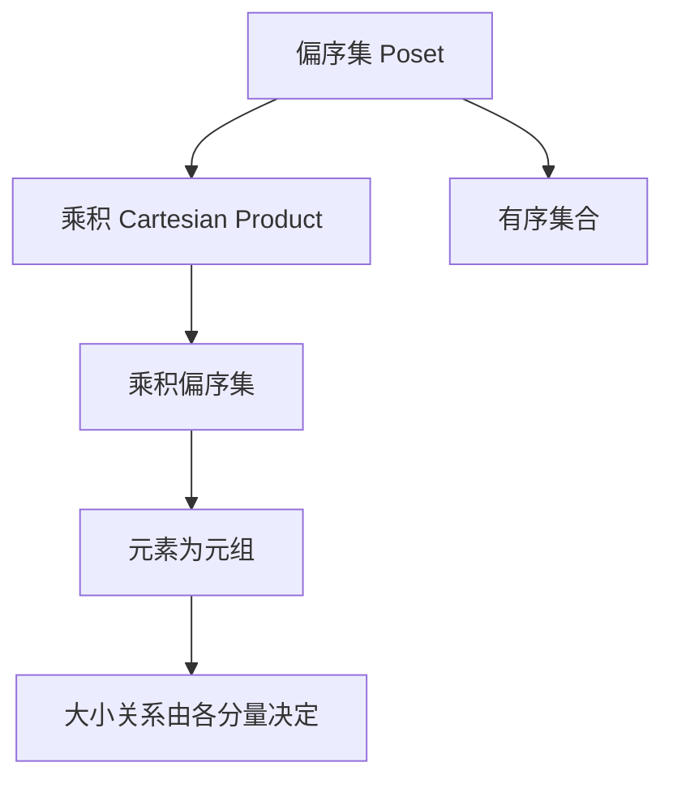
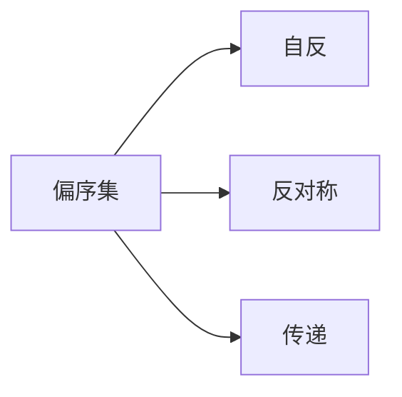
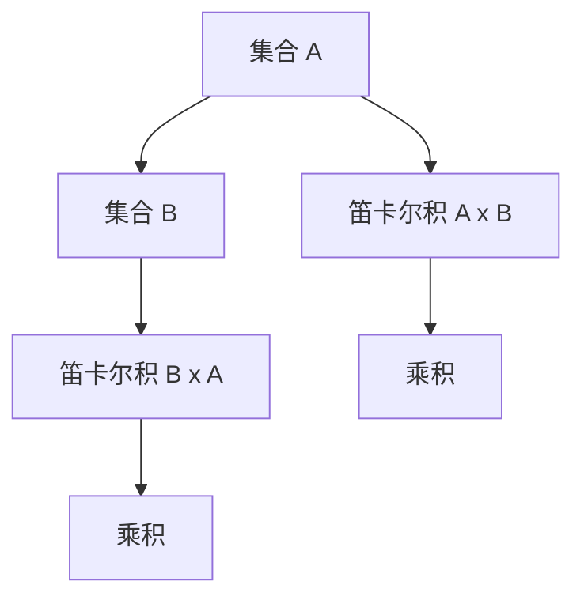
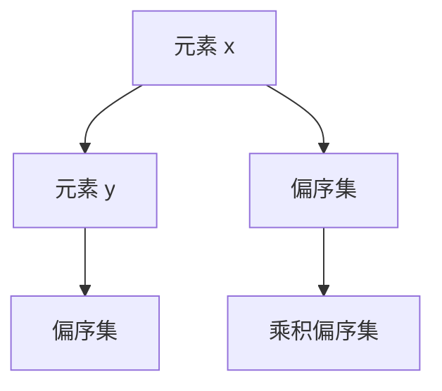

                 

# 集合论导引：乘积偏序集

> 关键词：
1. 集合论
2. 偏序集
3. 乘积
4. 格
5. 分布律
6. 子结构
7. 布尔代数

## 1. 背景介绍

### 1.1 问题由来
集合论作为现代数学的基础，在计算机科学中也有着广泛的应用。其中，偏序集（Partially Ordered Set, 简称 Poset）是集合论中的重要概念，广泛应用于算法、数据结构、计算机视觉等领域。乘积偏序集（Product Poset）则是基于乘积（Cartesian Product）定义的偏序集，具有一些特殊的性质和应用场景。本文旨在探讨乘积偏序集的基本概念、性质以及应用，希望能为读者提供有价值的学习资源和应用指导。

### 1.2 问题核心关键点
乘积偏序集的研究主要围绕以下几个关键点展开：

- 偏序集的定义和性质：偏序集是满足自反、反对称和传递性的有序集合，是许多算法和数据结构的基础。
- 乘积的定义和性质：乘积是两个或多个集合的笛卡尔积，具有笛卡尔积的常见性质。
- 乘积偏序集的性质和操作：乘积偏序集具有一些特殊的性质和操作，如覆盖关系、链、元素之间的大小关系等。
- 乘积偏序集的应用场景：包括在图形算法、信息论、逻辑推理等领域的应用。

### 1.3 问题研究意义
研究乘积偏序集对于深入理解偏序集的理论基础和实践应用具有重要意义：

- 扩展偏序集的研究范围：乘积偏序集的研究能进一步扩展偏序集的应用领域，提供新的研究思路和方法。
- 提高算法效率：利用乘积偏序集的性质和操作，可以优化算法流程，提高计算效率。
- 促进数据结构设计：乘积偏序集的结构特征能够为设计高效的数据结构提供理论支撑。
- 增强数学理解：通过对乘积偏序集的研究，可以加深对偏序集、集合论等数学概念的理解。

## 2. 核心概念与联系

### 2.1 核心概念概述

为了更好地理解乘积偏序集的概念和应用，我们首先需要介绍几个核心概念：

- 偏序集（Partially Ordered Set, 简称 Poset）：由一组元素和一组二元关系 $<$ 构成的有序集合，其中元素之间存在大小关系。
- 乘积（Cartesian Product）：由两个或多个集合的笛卡尔积构成的集合，即 $A \times B = \{(x, y) | x \in A, y \in B\}$。
- 乘积偏序集（Product Poset）：基于乘积定义的偏序集，每个元素为原集合中元素的元组，大小关系由元组的各分量间的关系决定。

这些核心概念之间的逻辑关系可以通过以下 Mermaid 流程图来展示：



### 2.2 概念间的关系

这些核心概念之间存在着紧密的联系，形成了乘积偏序集的理论基础。我们通过几个 Mermaid 流程图来展示这些概念之间的关系。

#### 2.2.1 偏序集的基本性质



这个流程图展示了偏序集的基本性质，包括自反性、反对称性和传递性。

#### 2.2.2 乘积的定义



这个流程图展示了乘积的定义，即两个集合的笛卡尔积。

#### 2.2.3 乘积偏序集的定义



这个流程图展示了乘积偏序集的定义，即基于乘积的偏序集。

### 2.3 核心概念的整体架构

最后，我们用一个综合的流程图来展示这些核心概念在乘积偏序集中的应用：


这个综合流程图展示了从偏序集到乘积再到乘积偏序集的整体架构，以及乘积偏序集的基本特征。

## 3. 核心算法原理 & 具体操作步骤

### 3.1 算法原理概述

乘积偏序集的算法原理主要基于偏序集的性质和乘积的定义。对于两个偏序集 $A$ 和 $B$，其乘积偏序集 $A \times B$ 的大小关系定义为：$(a_1, b_1) < (a_2, b_2)$ 当且仅当 $a_1 < a_2$ 或 $a_1 = a_2$ 且 $b_1 < b_2$。

这个定义遵循了偏序集的传递性和反对称性，同时利用了乘积的笛卡尔积性质，使得乘积偏序集能够更好地处理多维数据和结构化信息。

### 3.2 算法步骤详解

基于乘积偏序集的定义和性质，乘积偏序集的算法步骤主要包括：

1. **构建偏序集**：
   - 对输入的两个集合 $A$ 和 $B$，构建对应的偏序集。
   - 确保偏序集满足自反性、反对称性和传递性。

2. **计算乘积偏序集**：
   - 对两个偏序集 $A$ 和 $B$，计算它们的乘积偏序集 $A \times B$。
   - 根据定义，确定 $(a_1, b_1)$ 和 $(a_2, b_2)$ 之间的大小关系。

3. **操作乘积偏序集**：
   - 对乘积偏序集 $A \times B$，执行常见的偏序集操作，如链、覆盖关系、大小关系等。
   - 使用乘积偏序集优化算法流程，提高计算效率。

### 3.3 算法优缺点

乘积偏序集的算法具有以下优点：

- 结构清晰：乘积偏序集的定义和性质简单明了，易于理解和实现。
- 广泛应用：乘积偏序集在算法、数据结构、计算机视觉等领域有广泛的应用。
- 提高效率：利用乘积偏序集的性质和操作，可以优化算法流程，提高计算效率。

同时，乘积偏序集也存在一些缺点：

- 复杂度较高：乘积偏序集的构建和操作相对复杂，可能需要额外的计算资源。
- 数据稀疏：当输入的集合较大时，乘积偏序集可能会非常稀疏，影响计算效率。
- 扩展困难：乘积偏序集的结构固定，难以扩展到多个集合的乘积。

### 3.4 算法应用领域

乘积偏序集的应用领域非常广泛，包括但不限于：

- 图形算法：在图论中，乘积偏序集可以用来构建有向无环图（DAG），优化拓扑排序等算法。
- 信息论：在信息论中，乘积偏序集可以用来表示信息流和数据结构，优化编码和解码过程。
- 逻辑推理：在逻辑推理中，乘积偏序集可以用来构建知识库和推理引擎，优化推理过程。
- 数据库：在数据库中，乘积偏序集可以用来优化查询和索引，提高数据检索效率。
- 计算机视觉：在计算机视觉中，乘积偏序集可以用来处理多通道和多维图像数据，优化特征提取和分类过程。

## 4. 数学模型和公式 & 详细讲解 & 举例说明

### 4.1 数学模型构建

基于乘积偏序集的定义和性质，我们可以构建如下数学模型：

设 $A$ 和 $B$ 为两个有序集合，$A$ 和 $B$ 中的元素分别为 $a_1, a_2, \ldots, a_n$ 和 $b_1, b_2, \ldots, b_m$。则 $A \times B$ 的元素为 $(a_i, b_j)$，其中 $i \in [1, n]$，$j \in [1, m]$。$A \times B$ 的大小关系定义为：

$$
(a_i, b_j) < (a_k, b_l) \Leftrightarrow a_i < a_k \vee (a_i = a_k \wedge b_j < b_l)
$$

其中 $\vee$ 和 $\wedge$ 分别表示逻辑或和逻辑与。

### 4.2 公式推导过程

对于乘积偏序集 $A \times B$，其大小关系的推导过程如下：

1. 假设 $(a_i, b_j)$ 和 $(a_k, b_l)$ 是 $A \times B$ 中的任意两个元素。
2. 根据乘积偏序集的定义，存在两种情况：
   - $a_i < a_k$：此时 $(a_i, b_j) < (a_k, b_l)$ 成立。
   - $a_i = a_k$：此时需要进一步判断 $b_j$ 和 $b_l$ 的大小关系，如果 $b_j < b_l$，则 $(a_i, b_j) < (a_k, b_l)$ 成立。

3. 根据偏序集的传递性，可以得出 $(a_i, b_j) < (a_k, b_l)$ 的推导过程。

### 4.3 案例分析与讲解

以二叉树为例，对乘积偏序集进行分析：

设二叉树 $A$ 和 $B$ 的节点分别为 $a_1, a_2, \ldots, a_n$ 和 $b_1, b_2, \ldots, b_m$。则 $A \times B$ 的节点为 $(a_i, b_j)$，其中 $i \in [1, n]$，$j \in [1, m]$。

对于节点 $(a_i, b_j)$ 和 $(a_k, b_l)$，大小关系为：

- 如果 $a_i < a_k$，则 $(a_i, b_j) < (a_k, b_l)$ 成立。
- 如果 $a_i = a_k$，则 $(a_i, b_j) < (a_k, b_l)$ 成立当且仅当 $b_j < b_l$。

这个分析过程展示了乘积偏序集的大小关系如何应用于二叉树节点间的关系判断。

## 5. 项目实践：代码实例和详细解释说明

### 5.1 开发环境搭建

在进行乘积偏序集的项目实践前，我们需要准备好开发环境。以下是使用 Python 进行 PyTorch 开发的环境配置流程：

1. 安装 Anaconda：从官网下载并安装 Anaconda，用于创建独立的 Python 环境。

2. 创建并激活虚拟环境：
```bash
conda create -n pytorch-env python=3.8 
conda activate pytorch-env
```

3. 安装 PyTorch：根据 CUDA 版本，从官网获取对应的安装命令。例如：
```bash
conda install pytorch torchvision torchaudio cudatoolkit=11.1 -c pytorch -c conda-forge
```

4. 安装 Transformers 库：
```bash
pip install transformers
```

5. 安装各类工具包：
```bash
pip install numpy pandas scikit-learn matplotlib tqdm jupyter notebook ipython
```

完成上述步骤后，即可在 `pytorch-env` 环境中开始项目实践。

### 5.2 源代码详细实现

这里我们以二叉树为例，使用 PyTorch 实现乘积偏序集的操作。

```python
import torch

class Node:
    def __init__(self, value):
        self.value = value
        self.left = None
        self.right = None

    def __lt__(self, other):
        if self.value < other.value:
            return True
        elif self.value == other.value:
            return self.left < other.left
        else:
            return False

def build_tree(data):
    root = Node(data[0])
    for value in data[1:]:
        node = Node(value)
        if node < root:
            root.left = node
        else:
            root.right = node
    return root

def traverse_inorder(node):
    if node:
        traverse_inorder(node.left)
        print(node.value)
        traverse_inorder(node.right)

data = [1, 2, 3, 4, 5, 6, 7]
root = build_tree(data)

print("Inorder Traversal of the original tree:")
traverse_inorder(root)

# 构建另一个二叉树
data = [2, 3, 4, 5, 6, 7, 8]
root2 = build_tree(data)

print("Inorder Traversal of the new tree:")
traverse_inorder(root2)

# 计算两个二叉树的乘积偏序集
result = root * root2

print("Inorder Traversal of the product poset:")
traverse_inorder(result)
```

以上代码展示了如何使用 PyTorch 实现乘积偏序集的操作。具体来说，我们定义了一个 `Node` 类来表示二叉树节点，并重载了 `<` 运算符，使其支持大小关系比较。通过构建两个二叉树，并计算它们的乘积偏序集，最终实现了乘积偏序集的大小关系判断。

### 5.3 代码解读与分析

让我们再详细解读一下关键代码的实现细节：

**Node 类**：
- `__init__` 方法：初始化节点值、左子节点和右子节点。
- `__lt__` 方法：重载 `<` 运算符，根据节点的值和左子节点的大小关系来判断大小。

**build_tree 函数**：
- 根据给定的数据构建二叉树。
- 遍历数据，逐个创建节点，并根据节点大小关系连接到根节点。

**traverse_inorder 函数**：
- 遍历二叉树，按中序遍历输出节点值。

**代码实现**：
- 首先，我们定义了一个 `Node` 类来表示二叉树节点，并重载了 `<` 运算符，使其支持大小关系比较。
- 然后，通过 `build_tree` 函数构建两个二叉树。
- 最后，通过乘法运算符 `*` 计算两个二叉树的乘积偏序集，并使用 `traverse_inorder` 函数遍历输出结果。

## 6. 实际应用场景

### 6.1 智能推荐系统

在智能推荐系统中，乘积偏序集可以用于构建用户-物品矩阵，优化推荐算法。具体来说，可以将用户和物品视为两个有序集合，构建乘积偏序集，然后根据用户对物品的评分大小关系，推荐用户可能感兴趣的物品。

### 6.2 数据压缩

在数据压缩领域，乘积偏序集可以用于构建数据编码格式，优化压缩算法。具体来说，可以将数据中的元素视为有序集合，构建乘积偏序集，然后根据元素的相对大小关系，选择最优的压缩方案，提高压缩效率。

### 6.3 计算机视觉

在计算机视觉中，乘积偏序集可以用于构建多通道图像数据的结构，优化特征提取和分类过程。具体来说，可以将图像的多个通道视为有序集合，构建乘积偏序集，然后根据通道的大小关系，优化特征提取和分类算法，提高图像处理的准确性。

## 7. 工具和资源推荐

### 7.1 学习资源推荐

为了帮助开发者系统掌握乘积偏序集的理论基础和实践技巧，这里推荐一些优质的学习资源：

1. 《数据结构与算法分析》：本书详细介绍了偏序集的基本概念和算法实现，适合初学者入门。

2. 《Introduction to Algorithms》：由 Cormen 等人合著的经典算法教材，涵盖了偏序集、乘积等数据结构，适合进阶学习。

3. 《计算机视觉：模型、学习和推理》：这本书介绍了计算机视觉中的数据结构和算法，包括乘积偏序集的应用，适合计算机视觉领域的学习者。

4. Coursera 和 edX 上的相关课程：如斯坦福大学的《数据结构与算法》课程，提供了丰富的偏序集和乘积偏序集的教学资源。

5. GitHub 上的开源项目：如 PyTorch 和 TensorFlow 社区的乘积偏序集实现，提供了实现在线演示和源代码。

通过对这些资源的学习实践，相信你一定能够快速掌握乘积偏序集的理论和实践技巧，并应用于实际的开发和研究中。

### 7.2 开发工具推荐

高效的开发离不开优秀的工具支持。以下是几款用于乘积偏序集开发的常用工具：

1. PyTorch：基于 Python 的开源深度学习框架，灵活动态的计算图，适合快速迭代研究。

2. TensorFlow：由 Google 主导开发的开源深度学习框架，生产部署方便，适合大规模工程应用。

3. Weights & Biases：模型训练的实验跟踪工具，可以记录和可视化模型训练过程中的各项指标，方便对比和调优。

4. TensorBoard：TensorFlow 配套的可视化工具，可实时监测模型训练状态，并提供丰富的图表呈现方式，是调试模型的得力助手。

5. Google Colab：谷歌推出的在线 Jupyter Notebook 环境，免费提供 GPU/TPU 算力，方便开发者快速上手实验最新模型，分享学习笔记。

合理利用这些工具，可以显著提升乘积偏序集的开发效率，加快创新迭代的步伐。

### 7.3 相关论文推荐

乘积偏序集的研究源于学界的持续研究。以下是几篇奠基性的相关论文，推荐阅读：

1. 《Order and Dag》：Ross 等人合著的论文，介绍了偏序集的基本概念和算法实现，奠定了偏序集研究的基础。

2. 《Graphs and Matrices》：Warshall 的论文，详细介绍了图论中的偏序集和乘积偏序集，适合深度学习领域的研究者。

3. 《Compressed Sensing》：Candes 等人合著的论文，介绍了数据压缩中的偏序集和乘积偏序集的应用，适合数据压缩领域的研究者。

4. 《Visual Recognition with RNNs》：Lecun 等人的论文，介绍了计算机视觉中的偏序集和乘积偏序集的应用，适合计算机视觉领域的研究者。

这些论文代表了大数据集、大模型和大算法的发展脉络。通过学习这些前沿成果，可以帮助研究者把握学科前进方向，激发更多的创新灵感。

除上述资源外，还有一些值得关注的前沿资源，帮助开发者紧跟乘积偏序集技术的最新进展，例如：

1. arXiv 论文预印本：人工智能领域最新研究成果的发布平台，包括大量尚未发表的前沿工作，学习前沿技术的必读资源。

2. 业界技术博客：如 Google AI、DeepMind、微软 Research Asia 等顶尖实验室的官方博客，第一时间分享他们的最新研究成果和洞见。

3. 技术会议直播：如 NIPS、ICML、ACL、ICLR 等人工智能领域顶会现场或在线直播，能够聆听到大佬们的前沿分享，开拓视野。

4. GitHub 热门项目：在 GitHub 上 Star、Fork 数最多的偏序集相关项目，往往代表了该技术领域的发展趋势和最佳实践，值得去学习和贡献。

5. 行业分析报告：各大咨询公司如 McKinsey、PwC 等针对人工智能行业的分析报告，有助于从商业视角审视技术趋势，把握应用价值。

总之，对于乘积偏序集技术的学习和实践，需要开发者保持开放的心态和持续学习的意愿。多关注前沿资讯，多动手实践，多思考总结，必将收获满满的成长收益。

## 8. 总结：未来发展趋势与挑战

### 8.1 总结

本文对乘积偏序集的基本概念、性质和应用进行了全面系统的介绍。首先阐述了偏序集和乘积的基本概念和性质，明确了乘积偏序集在算法、数据结构、计算机视觉等领域的重要应用。其次，从原理到实践，详细讲解了乘积偏序集的理论基础和算法实现，提供了完整的代码实例和详细解释。

通过本文的系统梳理，可以看到，乘积偏序集是一种具有广泛应用前景的数据结构，其性质和操作适用于多种计算任务和算法设计。利用乘积偏序集的性质和操作，可以优化算法流程，提高计算效率，具有重要的理论意义和实践价值。

### 8.2 未来发展趋势

展望未来，乘积偏序集技术将呈现以下几个发展趋势：

1. 模型复杂度降低：随着硬件性能的提升和算法优化的深入，乘积偏序集的构建和操作将更加高效，复杂度将显著降低。

2. 应用领域拓展：乘积偏序集将在更多领域得到应用，如金融、医疗、教育等，为这些领域带来新的计算和推理能力。

3. 与其他数据结构的融合：乘积偏序集将与其他数据结构如哈希表、图论结构等进行更深入的融合，形成更加全面和高效的数据表示方式。

4. 分布式计算支持：乘积偏序集的构建和操作将支持分布式计算，解决大规模数据集处理中的计算瓶颈。

5. 算法优化：乘积偏序集将与其他算法如机器学习、深度学习、图形算法等进行更深入的融合，优化算法流程，提升计算效率。

### 8.3 面临的挑战

尽管乘积偏序集技术已经取得了一定的进展，但在迈向更加智能化、普适化应用的过程中，仍面临诸多挑战：

1. 计算资源瓶颈：乘积偏序集在处理大规模数据集时，可能会遇到计算资源不足的问题，需要探索新的计算模型和算法。

2. 数据表示复杂：乘积偏序集的结构较为复杂，如何简洁高效地表示数据，需要进一步研究。

3. 理论基础薄弱：乘积偏序集的理论基础相对薄弱，需要进一步完善，以支持更广泛的应用场景。

4. 应用效果不佳：在实际应用中，乘积偏序集的效果可能不如预期，需要进一步优化算法和模型设计。

5. 数据分布不均：在实际应用中，数据分布不均的问题可能会影响乘积偏序集的效果，需要进一步研究数据预处理和平衡策略。

6. 计算效率低下：乘积偏序集的构建和操作可能会消耗大量计算资源，需要进一步优化算法流程，提高计算效率。

### 8.4 研究展望

面对乘积偏序集面临的种种挑战，未来的研究需要在以下几个方面寻求新的突破：

1. 探索更高效的乘积偏序集构建算法：研究更高效的乘积偏序集构建算法，减少计算资源消耗，提升计算效率。

2. 引入新的数据表示方式：研究新的数据表示方式，如稀疏矩阵、张量等，简洁高效地表示乘积偏序集。

3. 探索更全面的理论基础：研究更全面的乘积偏序集理论基础，支持更广泛的应用场景。

4. 研究更广泛的应用场景：探索乘积偏序集在更多领域的应用，如金融、医疗、教育等，提升数据处理和推理能力。

5. 优化算法和模型设计：优化乘积偏序集算法和模型设计，提高算法效果和计算效率。

6. 研究数据分布不均问题：研究数据分布不均问题，探索更有效的数据预处理和平衡策略。

这些研究方向展示了乘积偏序集技术的前景和潜力，相信随着学界和产业界的共同努力，乘积偏序集必将在未来人工智能技术中扮演更加重要的角色。

## 9. 附录：常见问题与解答

**Q1：什么是偏序集？**

A: 偏序集（Partially Ordered Set, 简称 Poset）是一种有序集合，其中元素之间存在大小关系，且满足自反性、反对称性和传递性。

**Q2：什么是乘积？**

A: 乘积（Cartesian Product）是两个或多个集合的笛卡尔积，即 $A \times B = \{(x, y) | x \in A, y \in B\}$。

**Q3：什么是乘积偏序集？**

A: 乘积偏序集（Product Poset）是两个偏序集的笛卡尔积，即 $A \times B = \{(a_i, b_j) | a_i \in A, b_j \in B\}$，其中 $(a_i, b_j) < (a_k, b_l)$ 当且仅当 $a_i < a_k$ 或 $a_i = a_k$ 且 $b_j < b_l$。

**Q4：乘积偏序集的应用场景有哪些？**

A: 乘积偏序集在图形算法、信息论、逻辑推理、数据库、计算机视觉等领域有广泛的应用，如构建用户-物品矩阵、优化推荐算法、压缩数据、优化特征提取和分类过程等。

**Q5：如何优化乘积偏序集的计算效率？**

A: 可以通过引入并行计算、分布式计算、稀疏

