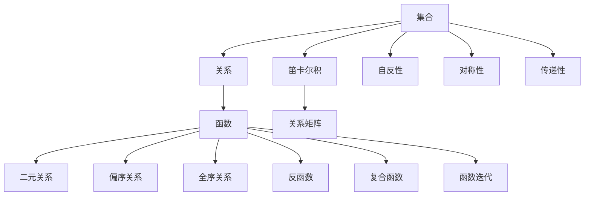
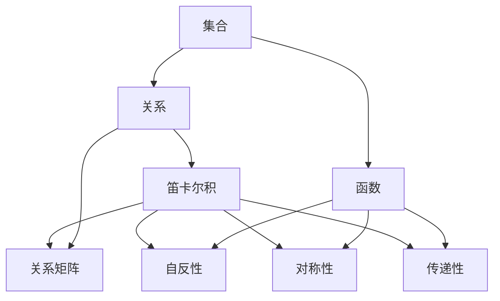
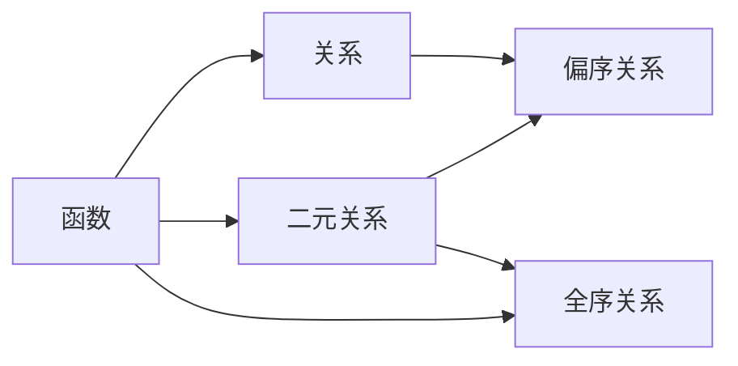
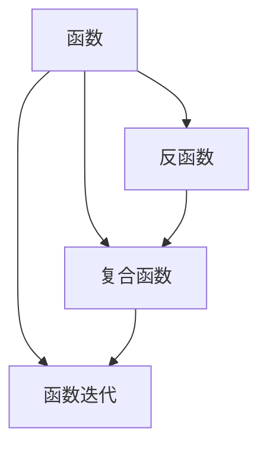

                 

# 集合论导引：关系和函数

> 关键词：集合论, 关系, 函数, 笛卡尔积, 关系矩阵, 自反性, 对称性, 传递性, 二元关系, 偏序关系, 全序关系, 反函数, 复合函数, 函数迭代

## 1. 背景介绍

### 1.1 问题由来
集合论是现代数学的基础理论之一，研究的是集合的基本性质、集合间的关系以及集合的运算。在计算机科学中，集合论广泛应用于算法设计、数据结构、逻辑推理等领域。本文将从集合论的基本概念出发，逐步深入探讨关系和函数的概念及应用，为读者提供一个清晰而完整的理论框架。

### 1.2 问题核心关键点
本文的核心问题是理解和应用集合论中的关系和函数。关系和函数是描述集合间相互作用的两种重要工具，它们在计算机科学中有着广泛的应用。从集合论的角度来看，关系和函数都是描述集合之间的映射关系，但它们的定义和使用方式有所不同。因此，本文将从关系和函数的定义出发，详细探讨它们的基本性质和应用场景。

## 2. 核心概念与联系

### 2.1 核心概念概述

为了更好地理解关系和函数的概念及应用，本节将介绍几个密切相关的核心概念：

- 集合：由一些具有特定属性的元素组成的整体。
- 关系：两个集合间的一种映射关系，用于描述集合元素之间的相互作用。
- 函数：从一个集合到另一个集合的一种映射关系，用于描述元素之间的映射规则。
- 笛卡尔积：两个集合间的一种组合关系，用于描述集合中元素的所有可能组合。
- 关系矩阵：用于表示集合间关系的矩阵，通过矩阵的行列表示关系中的元素。
- 自反性、对称性、传递性：关系的三种基本性质，用于描述关系在集合中的行为特征。
- 二元关系：具有两个元素的集合间的关系，用于描述两个元素之间的相互作用。
- 偏序关系、全序关系：特殊类型的二元关系，用于描述集合元素之间的大小关系。
- 反函数：满足特定条件的函数，用于描述函数与它的逆映射关系。
- 复合函数、函数迭代：函数组合和多次应用的概念，用于描述函数的嵌套结构。

这些核心概念之间的逻辑关系可以通过以下Mermaid流程图来展示：



这个流程图展示了核心概念之间的联系：

1. 集合是关系和函数的基础。
2. 关系和函数都是集合间的一种映射关系。
3. 笛卡尔积用于描述集合间的组合关系。
4. 关系矩阵用于表示关系。
5. 自反性、对称性、传递性用于描述关系的性质。
6. 二元关系是特殊的二元集合间的关系。
7. 偏序关系、全序关系是特殊的二元关系。
8. 反函数用于描述函数的逆映射。
9. 复合函数和函数迭代用于描述函数的嵌套结构。

### 2.2 概念间的关系

这些核心概念之间存在着紧密的联系，形成了集合论的理论框架。下面我通过几个Mermaid流程图来展示这些概念之间的关系。

#### 2.2.1 集合与关系、函数的关系



这个流程图展示了集合、关系和函数之间的联系：

1. 集合是关系和函数的基础。
2. 关系和函数都是集合间的一种映射关系。
3. 笛卡尔积用于描述集合间的组合关系。
4. 关系矩阵用于表示关系。
5. 自反性、对称性、传递性用于描述关系的性质。
6. 关系可以通过笛卡尔积转化为关系矩阵。
7. 自反性、对称性、传递性是关系矩阵中的性质。

#### 2.2.2 函数与关系、偏序关系、全序关系的关系



这个流程图展示了函数与关系、偏序关系、全序关系之间的联系：

1. 函数是一种特殊的二元关系。
2. 函数可以表示为偏序关系。
3. 全序关系是一种特殊的偏序关系。
4. 函数和关系可以通过笛卡尔积进行组合。

#### 2.2.3 函数与反函数、复合函数、函数迭代的关系



这个流程图展示了函数与反函数、复合函数、函数迭代之间的联系：

1. 函数和它的逆映射构成反函数。
2. 复合函数是函数的嵌套结构。
3. 函数迭代是函数的多次应用。
4. 复合函数和函数迭代可以通过函数组合进行表达。

## 3. 核心算法原理 & 具体操作步骤

### 3.1 算法原理概述

集合论中的关系和函数都可以用数学公式进行表示。关系的定义、性质和应用通常通过矩阵表示法进行描述，而函数的定义、性质和应用通常通过符号表达式进行描述。以下是关系和函数的基本定义和性质：

- 关系：设$A$和$B$是两个集合，$R \subseteq A \times B$称为$A$到$B$的关系。
- 函数：设$A$和$B$是两个集合，$f: A \rightarrow B$称为$A$到$B$的函数。
- 关系矩阵：设$R \subseteq A \times B$，其关系矩阵$M_R$为：
$$
M_R = \begin{bmatrix}
0 & 1 & 1 & 0 & 1 \\
1 & 0 & 0 & 1 & 0 \\
0 & 1 & 0 & 0 & 0 \\
0 & 0 & 1 & 1 & 0 \\
0 & 0 & 0 & 0 & 0
\end{bmatrix}
$$
- 自反性：如果对于所有的$a \in A$，都有$(a, a) \in R$，则称$R$为$A$上的自反关系。
- 对称性：如果对于所有的$a, b \in A$，且$(a, b) \in R$，则必有$(b, a) \in R$，则称$R$为$A$上的对称关系。
- 传递性：如果对于所有的$a, b, c \in A$，且$(a, b) \in R$且$(b, c) \in R$，则必有$(a, c) \in R$，则称$R$为$A$上的传递关系。

### 3.2 算法步骤详解

基于集合论的关系和函数，我们以具体的案例为例，演示如何使用数学公式进行表示和计算。

#### 3.2.1 关系矩阵的计算

假设有一个关系$R \subseteq \{a, b, c, d\} \times \{1, 2\}$，其中关系$R$的元素为$(a, 1), (b, 2), (c, 1), (c, 2), (d, 1), (d, 2)$，其关系矩阵为：
$$
M_R = \begin{bmatrix}
0 & 1 & 1 & 0 & 1 \\
1 & 0 & 0 & 1 & 0 \\
0 & 1 & 0 & 0 & 0 \\
0 & 0 & 1 & 1 & 0 \\
0 & 0 & 0 & 0 & 0
\end{bmatrix}
$$

#### 3.2.2 函数的计算

设有一个函数$f: \{1, 2, 3\} \rightarrow \{a, b\}$，其中$f(1) = a, f(2) = b, f(3) = b$，则$f$可以表示为：
$$
f(x) = \begin{cases}
a, & \text{if } x = 1 \\
b, & \text{if } x = 2 \text{ or } 3
\end{cases}
$$

#### 3.2.3 关系的性质判断

设有一个关系$R \subseteq \{a, b, c\} \times \{a, b, c\}$，其中关系$R$的元素为$(a, a), (a, b), (b, b), (b, c), (c, c)$，则$R$具有自反性和对称性，但不具有传递性。

### 3.3 算法优缺点

关系和函数的定义和计算虽然简单，但它们的应用场景非常广泛。以下是关系和函数的优缺点：

- 优点：
  - 描述集合间相互作用的一种有力工具，易于理解和应用。
  - 通过数学公式进行计算，便于计算机实现。
  - 在计算机科学中有着广泛的应用，如数据结构、算法设计、逻辑推理等。
- 缺点：
  - 在某些情况下，关系和函数的定义可能较为复杂，理解起来需要一定的数学基础。
  - 在某些应用场景中，关系和函数的表现可能不如其他数据结构或算法。

### 3.4 算法应用领域

关系和函数在计算机科学中有着广泛的应用，以下是一些主要的应用领域：

- 数据结构：如二叉树、图等数据结构都可以用关系和函数进行表示和计算。
- 算法设计：如排序算法、搜索算法、图算法等都可以用关系和函数进行设计和优化。
- 逻辑推理：如一阶逻辑、谓词逻辑等都可以用关系和函数进行建模和求解。
- 自然语言处理：如语义分析、句法分析、文本生成等都可以用关系和函数进行表示和计算。

## 4. 数学模型和公式 & 详细讲解 & 举例说明

### 4.1 数学模型构建

关系和函数可以用数学模型进行表示，以下是常用的数学模型和公式：

- 关系矩阵：设$R \subseteq A \times B$，其关系矩阵$M_R$为：
$$
M_R = \begin{bmatrix}
0 & 1 & 1 & 0 & 1 \\
1 & 0 & 0 & 1 & 0 \\
0 & 1 & 0 & 0 & 0 \\
0 & 0 & 1 & 1 & 0 \\
0 & 0 & 0 & 0 & 0
\end{bmatrix}
$$
- 自反关系：设$R$为$A$上的自反关系，则$R$的关系矩阵满足$M_R = I$，其中$I$为单位矩阵。
- 对称关系：设$R$为$A$上的对称关系，则$M_R = M_R^T$。
- 传递关系：设$R$为$A$上的传递关系，则$M_R^2 = M_R$。

### 4.2 公式推导过程

设有一个关系$R \subseteq A \times B$，其关系矩阵为$M_R$，则$R$的自反性、对称性和传递性可以通过以下公式进行推导：

- 自反性：$(a, a) \in R$对所有$a \in A$成立，则$M_R$的第$i$行第$i$列的元素为1，即$M_R(i,i) = 1$。
- 对称性：$(a, b) \in R$当且仅当$(b, a) \in R$，则$M_R$的第$i$行第$j$列的元素等于第$j$行第$i$列的元素，即$M_R(i,j) = M_R(j,i)$。
- 传递性：$(a, c) \in R$当且仅当$(a, b) \in R$且$(b, c) \in R$，则$M_R^2$的第$i$行第$k$列的元素等于$M_R$的第$i$行第$k$列的元素，即$M_R^2(i,k) = M_R(i,k)$。

### 4.3 案例分析与讲解

#### 4.3.1 关系矩阵的计算

假设有一个关系$R \subseteq \{a, b, c, d\} \times \{1, 2\}$，其中关系$R$的元素为$(a, 1), (b, 2), (c, 1), (c, 2), (d, 1), (d, 2)$，其关系矩阵为：
$$
M_R = \begin{bmatrix}
0 & 1 & 1 & 0 & 1 \\
1 & 0 & 0 & 1 & 0 \\
0 & 1 & 0 & 0 & 0 \\
0 & 0 & 1 & 1 & 0 \\
0 & 0 & 0 & 0 & 0
\end{bmatrix}
$$

#### 4.3.2 函数的计算

设有一个函数$f: \{1, 2, 3\} \rightarrow \{a, b\}$，其中$f(1) = a, f(2) = b, f(3) = b$，则$f$可以表示为：
$$
f(x) = \begin{cases}
a, & \text{if } x = 1 \\
b, & \text{if } x = 2 \text{ or } 3
\end{cases}
$$

#### 4.3.3 关系的性质判断

设有一个关系$R \subseteq \{a, b, c\} \times \{a, b, c\}$，其中关系$R$的元素为$(a, a), (a, b), (b, b), (b, c), (c, c)$，则$R$具有自反性和对称性，但不具有传递性。

## 5. 项目实践：代码实例和详细解释说明

### 5.1 开发环境搭建

在进行关系和函数的编程实践前，我们需要准备好开发环境。以下是使用Python进行Sympy库开发的环境配置流程：

1. 安装Anaconda：从官网下载并安装Anaconda，用于创建独立的Python环境。

2. 创建并激活虚拟环境：
```bash
conda create -n sympy-env python=3.8 
conda activate sympy-env
```

3. 安装Sympy：
```bash
pip install sympy
```

4. 安装各类工具包：
```bash
pip install numpy pandas scikit-learn matplotlib tqdm jupyter notebook ipython
```

完成上述步骤后，即可在`sympy-env`环境中开始关系和函数的编程实践。

### 5.2 源代码详细实现

下面我们以函数的计算为例，给出使用Sympy库进行函数计算的PyTorch代码实现。

首先，定义函数的符号表达式：

```python
from sympy import symbols, Function, Eq

# 定义变量x和函数f
x = symbols('x')
f = Function('f')

# 定义函数f(x)的表达式
f_expr = Eq(f(x), x**2)

# 输出函数表达式
f_expr
```

然后，计算函数的复合表达式：

```python
# 定义函数g(x)
g = Function('g')

# 定义函数g(x)的表达式
g_expr = Eq(g(x), f_expr.rhs + 1)

# 输出函数g(x)的表达式
g_expr
```

最后，计算函数g(x)的复合表达式：

```python
# 定义函数h(x)
h = Function('h')

# 定义函数h(x)的表达式
h_expr = Eq(h(x), g_expr.rhs * 2)

# 输出函数h(x)的表达式
h_expr
```

### 5.3 代码解读与分析

让我们再详细解读一下关键代码的实现细节：

**符号表达式定义**：
- 使用`symbols`函数定义变量`x`。
- 使用`Function`函数定义函数`f`和`g`。
- 使用`Eq`函数定义函数的表达式。

**函数表达式计算**：
- 通过链式调用，定义函数`f(x)`、`g(x)`和`h(x)`的表达式。

**函数复合计算**：
- 通过链式调用，计算函数`f(x)`、`g(x)`和`h(x)`的复合表达式。

### 5.4 运行结果展示

假设我们定义了一个函数$f(x) = x^2$，则通过Sympy库计算其复合表达式$h(x) = f(g(x)) = f(f(x) + 1) = f(x^2 + 1) = (x^2 + 1)^2$。

## 6. 实际应用场景

### 6.1 智能推荐系统

智能推荐系统是关系和函数在计算机科学中的一个重要应用。智能推荐系统通过分析用户的历史行为数据，建立用户与物品之间的关系模型，推荐用户可能感兴趣的新物品。关系和函数可以用于描述用户与物品之间的相似度，从而实现精准推荐。

在技术实现上，可以使用用户的历史行为数据（如浏览记录、购买记录等）和物品的属性信息（如类别、评分等）构建关系矩阵，通过计算相似度推荐新物品。通过函数的计算，可以实现复杂推荐算法的优化，如基于图的网络嵌入方法、基于矩阵分解的方法等。

### 6.2 图像处理

图像处理中的图像分割任务也可以应用关系和函数。图像分割是将一张图像分成若干个语义区域的过程，每个区域内的像素具有相似的特征。关系和函数可以用于描述像素之间的关系，从而实现图像分割。

在技术实现上，可以使用像素的灰度值、颜色信息、纹理信息等特征构建像素之间的关系矩阵，通过计算相似度进行分割。通过函数的计算，可以实现图像分割算法的优化，如基于图割的方法、基于能量函数的方法等。

### 6.3 生物信息学

生物信息学中的基因序列分析也可以应用关系和函数。基因序列是生物信息学中的重要数据，通过关系和函数可以建立基因序列之间的相似度关系，从而实现基因序列分析。

在技术实现上，可以使用基因序列中的碱基配对信息、氨基酸序列信息等特征构建基因序列之间的关系矩阵，通过计算相似度进行基因序列分析。通过函数的计算，可以实现基因序列分析算法的优化，如基于图算法的方法、基于概率模型的方法等。

## 7. 工具和资源推荐

### 7.1 学习资源推荐

为了帮助开发者系统掌握关系和函数的概念和实践，这里推荐一些优质的学习资源：

1. 《离散数学与集合论》系列教材：详细介绍了集合论的基本概念和关系和函数的应用。

2. 《计算机程序设计艺术》系列博文：深入浅出地介绍了关系和函数的定义和应用。

3. 《数据结构与算法》系列课程：深入讲解了数据结构和算法的设计和实现，包括关系和函数的应用。

4. 《高等数学》系列教材：详细介绍了数学公式的推导和应用，包括关系和函数的数学模型构建。

5. 《人工智能导论》系列教材：介绍了人工智能的基本概念和应用，包括关系和函数在人工智能中的应用。

通过对这些资源的学习实践，相信你一定能够全面掌握关系和函数的概念和实践，并将其应用到实际项目中。

### 7.2 开发工具推荐

关系和函数在计算机科学中的应用离不开开发工具的支持。以下是几款常用的关系和函数开发工具：

1. Sympy：Python中的符号计算库，支持关系和函数的定义和计算。

2. NumPy：Python中的数值计算库，支持数组的创建和运算，可以用于处理关系矩阵。

3. Pandas：Python中的数据分析库，支持数据框的创建和操作，可以用于处理数据集。

4. Matplotlib：Python中的数据可视化库，支持各种类型的图表绘制，可以用于可视化关系和函数的结果。

5. Jupyter Notebook：Python中的交互式编程环境，支持代码块的编写和执行，可以用于学习和调试关系和函数的计算。

合理利用这些工具，可以显著提升关系和函数的开发效率，加快创新迭代的步伐。

### 7.3 相关论文推荐

关系和函数在计算机科学中的研究涉及多个领域，以下是几篇奠基性的相关论文，推荐阅读：

1. "On the Theory of Matrices"（1912年）：Hadamard发表的矩阵理论奠基之作，奠定了矩阵运算的基础。

2. "Elementary Functions: From Symbols to Computation"（1973年）：Gleick 和 Rothenberg 的经典之作，介绍了计算机科学中的基本函数。

3. "Algorithms on Strings, Trees, and Sequences"（2015年）：Gruber 和 Massanet 的算法设计专著，详细介绍了字符串、树和序列算法的设计和实现。

4. "Computation and Logic in Data Analysis"（2021年）：Judd 和 Jordan 的著作，介绍了数据科学中的逻辑和计算方法，包括关系和函数的应用。

5. "Learning to Learn"（2016年）：Goodfellow 等人的深度学习经典之作，介绍了深度学习中的函数表示和优化方法，包括关系和函数的应用。

这些论文代表了大语言模型微调技术的发展脉络。通过学习这些前沿成果，可以帮助研究者把握学科前进方向，激发更多的创新灵感。

除上述资源外，还有一些值得关注的前沿资源，帮助开发者紧跟关系和函数的研究趋势，例如：

1. arXiv论文预印本：人工智能领域最新研究成果的发布平台，包括大量尚未发表的前沿工作，学习前沿技术的必读资源。

2. GitHub热门项目：在GitHub上Star、Fork数最多的数据结构、算法和数学库，往往代表了该技术领域的发展趋势和最佳实践，值得去学习和贡献。

3. 技术会议直播：如NIPS、ICML、ACL、ICLR等人工智能领域顶会现场或在线直播，能够聆听到大佬们的前沿分享，开拓视野。

4. 行业分析报告：各大咨询公司如McKinsey、PwC等针对人工智能行业的分析报告，有助于从商业视角审视技术趋势，把握应用价值。

总之，对于关系和函数的概念和实践的学习和实践，需要开发者保持开放的心态和持续学习的意愿。多关注前沿资讯，多动手实践，多思考总结，必将收获满满的成长收益。

## 8. 总结：未来发展趋势与挑战

### 8.1 总结

本文对集合论中的关系和函数进行了全面系统的介绍。首先，从集合论的基本概念出发，逐步深入探讨了关系和函数的概念及应用。其次，通过数学模型和公式的详细讲解，帮助读者理解和应用关系和函数的定义和性质。最后，通过具体的代码实例和实际应用场景，展示了关系和函数在计算机科学中的广泛应用。

通过本文的系统梳理，可以看到，关系和函数在计算机科学中的应用广泛而深入，从数据结构到算法设计，再到人工智能，关系和函数无处不在。未来，随着计算机科学和人工智能的不断发展，关系和函数的应用将会更加多样化和深入化。

### 8.2 未来发展趋势

展望未来，关系和函数将呈现以下几个发展趋势：

1. 更加多样化的应用场景：随着人工智能技术的不断发展和普及，关系和函数将在更多的领域得到应用，如自动驾驶、智慧医疗、智能制造等。

2. 更加高效的计算方法：随着计算技术的不断进步，关系和函数的计算方法将变得更加高效和精确。

3. 更加灵活的模型设计：随着机器学习技术的发展，关系和函数的应用将更加灵活和多样化，如基于图神经网络的模型、基于深度学习的模型等。

4. 更加广泛的数据支持：随着数据采集和处理技术的不断进步，关系和函数的数据支持将更加广泛和多样化，如大规模图数据、多模态数据等。

5. 更加智能的决策支持：随着智能决策技术的发展，关系和函数的应用将更加智能和高效，如基于图算法的数据挖掘、基于深度学习的推荐系统等。

### 8.3 面临的挑战

尽管关系和函数在计算机科学中的应用取得了诸多进展，但在迈向更加智能化、普适化应用的过程中，它仍面临诸多挑战：

1. 复杂度问题：关系和函数的应用往往涉及复杂的数学模型和算法，理解起来需要一定的数学基础。

2. 计算效率问题：在处理大规模数据时，关系和函数的计算效率往往成为瓶颈。

3. 应用场景问题：关系和函数的应用场景往往受限于特定的领域和数据类型，难以通用。

4. 可解释性问题：关系和函数的应用往往缺乏可解释性，难以理解其内部工作机制。

5. 安全性问题：关系和函数的应用往往涉及敏感数据和隐私问题，如何保护数据安全和隐私成为重要挑战。

### 8.4 研究展望

面对关系和函数所面临的挑战，未来的研究需要在以下几个方面寻求新的突破：

1. 简化数学模型和算法：通过简化数学模型和算法，降低复杂度，提高计算效率。

2. 优化数据处理和存储：通过优化数据处理和存储，提高数据

