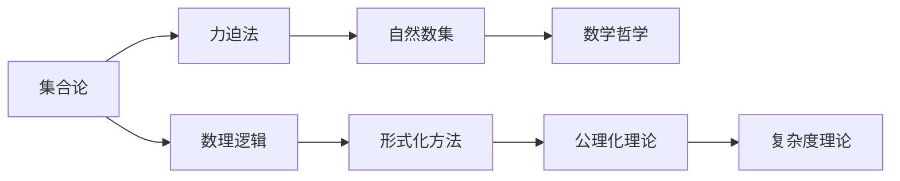
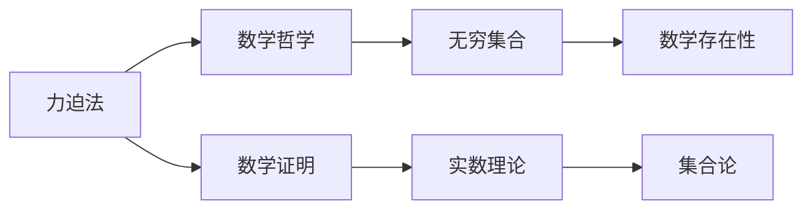
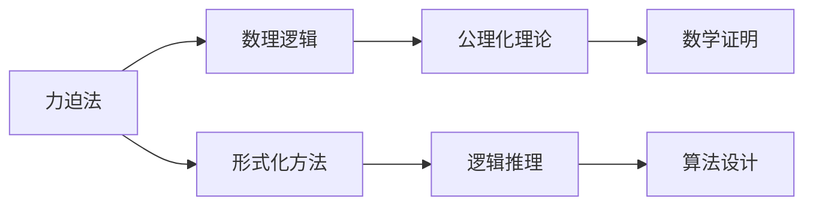
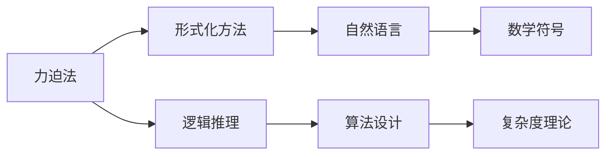

                 

# 集合论导引：力迫NS峭壁

> 关键词：集合论, 力迫法, 自然数集, 数学哲学, 逻辑学, 形式化方法, 数理逻辑

## 1. 背景介绍

集合论作为数学的基础，在形式化逻辑、数理逻辑、以及计算机科学中均有重要应用。在计算机科学中，集合论被广泛用于数据结构、算法设计、逻辑编程等领域。而力迫法作为集合论的一个重要分支，在数学哲学、逻辑学以及计算机科学中均有深远影响。力迫法的应用领域包括模型存在性证明、公理化理论的构建、以及复杂度理论的证明等。

本文旨在探讨集合论中的力迫法，及其在自然数集上的应用。力迫法是研究数学实体的重要工具，能够帮助我们在数学证明中突破传统的观念，带来全新的数学视角和洞察力。力迫法的核心思想是通过对无穷集合的赋值，来揭示无穷集合间的内在联系和性质。在计算机科学中，力迫法也被用于设计和证明算法，如自然数集上的集合操作、关系表示等。

## 2. 核心概念与联系

### 2.1 核心概念概述

为更好地理解力迫法的原理和应用，本节将介绍几个密切相关的核心概念：

- 集合论: 研究集合、元素、运算等基本概念的数学学科，是现代数学的基石。
- 力迫法: 一种通过无穷集合的赋值，揭示无穷集合间内在联系和性质的数学方法。
- 自然数集: 在力迫法中，常用于证明无穷集合存在性问题的基础集合。
- 数学哲学: 探讨数学本质、方法和应用哲学的学科。
- 数理逻辑: 研究数学中的逻辑问题，如证明、归纳、归纳等。
- 形式化方法: 使用数学符号、逻辑符号和计算符号，对自然语言和数学证明进行形式化处理的方法。
- 公理化理论: 通过一组公理，构建数学理论的学科。
- 复杂度理论: 研究算法和计算问题的难易程度，以及它们在资源限制下的性能问题的学科。

这些核心概念之间的逻辑关系可以通过以下Mermaid流程图来展示：



这个流程图展示了集合论、力迫法、自然数集等概念之间的联系和应用领域。集合论是力迫法的基础，力迫法通过无穷集合的赋值揭示了自然数集的内在联系。数学哲学、数理逻辑、形式化方法、公理化理论和复杂度理论等概念，都是力迫法的衍生应用，通过力迫法，这些概念与自然数集等基础集合的联系更加紧密。

### 2.2 概念间的关系

这些核心概念之间存在着紧密的联系，形成了集合论和力迫法的完整生态系统。下面我通过几个Mermaid流程图来展示这些概念之间的关系。

#### 2.2.1 力迫法在数学哲学中的应用



这个流程图展示了力迫法在数学哲学中的应用。力迫法通过赋值无穷集合，揭示了实数等数学存在性的证明。实数理论中的连续性、完备性等性质，都与力迫法有密切联系。

#### 2.2.2 力迫法在数理逻辑中的应用



这个流程图展示了力迫法在数理逻辑中的应用。力迫法通过公理化理论构建数学体系，再通过形式化方法对数学证明进行形式化处理，进一步应用逻辑推理和算法设计等技术。

#### 2.2.3 力迫法在形式化方法中的应用



这个流程图展示了力迫法在形式化方法中的应用。力迫法通过数学符号对自然语言和数学证明进行形式化处理，再利用逻辑推理和算法设计等技术，构建复杂度理论的基础。

### 2.3 核心概念的整体架构

最后，我们用一个综合的流程图来展示这些核心概念在大语言模型微调过程中的整体架构：


这个综合流程图展示了从无穷集合到自然数集，再到力迫法及其在数学哲学、数理逻辑、形式化方法等领域的联系和应用。力迫NS峭壁作为力迫法的核心，展示了其在数学存在性证明和复杂度理论中的重要作用。

## 3. 核心算法原理 & 具体操作步骤
### 3.1 算法原理概述

力迫法是一种通过无穷集合的赋值，揭示无穷集合间内在联系和性质的数学方法。其核心思想是通过对无穷集合的赋值，使得无穷集合满足一定的公理，进而证明无穷集合的存在性和性质。

在数学存在性问题中，力迫法的核心是构造一个"赋值结构"，即通过无穷集合的赋值，使得无穷集合满足一定的公理化理论。例如，我们可以构造一个自然数集的力迫结构，满足"加法公理"和"乘法公理"，从而证明自然数集的存在性。

形式化地，设 $S$ 为无穷集合，$V$ 为 $S$ 的所有子集组成的集合。我们定义一个映射 $f: V \rightarrow \mathbb{N}$，使得 $f(V)$ 中的每个元素表示 $V$ 中的一个无穷集合。这个映射 $f$ 被称为 $S$ 的赋值映射。若 $f$ 满足以下条件：
1. $f(V) \neq 0$
2. $f(V) = 1$ 当 $V = \emptyset$
3. $f(V) = f(V') + 1$ 当 $V' = V \cup \{x\}$，且 $x \notin V$
4. $f(V) = f(V')$ 当 $V' = V - \{x\}$，且 $x \in V$

则称 $f$ 为 $S$ 的一个力迫映射。若 $f$ 存在，则称 $S$ 的力迫映射存在，即存在一个满足上述条件的赋值映射 $f$，使得 $S$ 的任意子集都对应一个唯一的自然数。

力迫法的应用广泛，尤其是在数学存在性证明中。例如，通过构造自然数集的力迫结构，可以证明自然数集存在性，以及自然数集的许多基本性质。力迫法的证明过程，展现了无穷集合间的内在联系，揭示了数学实体的本质和性质。

### 3.2 算法步骤详解

力迫法的具体步骤包括：

1. **构造赋值映射**：构造一个满足力迫公理的赋值映射 $f$，使得无穷集合 $S$ 的每个子集 $V$ 对应一个唯一的自然数 $f(V)$。
2. **验证力迫映射**：验证构造的赋值映射 $f$ 满足力迫公理。
3. **进行数学证明**：利用力迫映射 $f$ 进行数学存在性证明。

在实际应用中，构造赋值映射的步骤通常比较复杂，需要借助数学工具和公理化理论。例如，构造自然数集的力迫映射，需要证明自然数集的加法和乘法公理。

### 3.3 算法优缺点

力迫法的优点包括：
1. 通过无穷集合的赋值，揭示了无穷集合间的内在联系和性质。
2. 适用于数学存在性问题的证明，如自然数集、实数集等。
3. 在数理逻辑、形式化方法等领域有广泛应用。

力迫法的缺点包括：
1. 构造赋值映射的步骤较为复杂，需要较强的数学功底。
2. 赋值映射的构造过程可能涉及多个公理化理论，难以统一描述。
3. 证明过程通常较为抽象，难以直观理解。

### 3.4 算法应用领域

力迫法在数学存在性问题、数理逻辑、形式化方法等领域有广泛应用。例如，在数学存在性问题中，力迫法被用于证明自然数集、实数集等无穷集合的存在性和性质。在数理逻辑中，力迫法被用于构建公理化理论，如ZFC公理化理论。在形式化方法中，力迫法被用于设计和证明算法，如自然数集上的集合操作、关系表示等。

此外，力迫法在计算机科学中的应用也日益增多，例如在数学软件、逻辑编程、模型验证等领域，力迫法被用于构造数学模型、逻辑模型，进行数学推理和验证。

## 4. 数学模型和公式 & 详细讲解  
### 4.1 数学模型构建

在力迫法中，我们定义一个无穷集合 $S$ 和一个赋值映射 $f: V \rightarrow \mathbb{N}$。设 $V$ 为 $S$ 的所有子集组成的集合，则力迫法的基本数学模型如下：

1. 定义赋值映射 $f: V \rightarrow \mathbb{N}$，使得 $f(V)$ 中的每个元素表示 $V$ 中的一个无穷集合。
2. 定义自然数集 $\mathbb{N}$，满足加法和乘法公理。
3. 构造一个满足力迫公理的赋值映射 $f$，使得无穷集合 $S$ 的每个子集 $V$ 对应一个唯一的自然数 $f(V)$。

形式化地，我们可以用以下数学模型来描述力迫法：

$$
\text{Model}(S, V, f, \mathbb{N}) = \{f \mid f: V \rightarrow \mathbb{N}\}
$$

其中 $S$ 为无穷集合，$V$ 为 $S$ 的所有子集组成的集合，$f$ 为赋值映射，$\mathbb{N}$ 为自然数集。

### 4.2 公式推导过程

在力迫法中，我们通过构造满足力迫公理的赋值映射 $f$，证明无穷集合 $S$ 的存在性。力迫公理是力迫法的基础，通常包括以下公理：

1. 加法公理：对于任意 $a, b \in \mathbb{N}$，存在 $a + b$，满足以下性质：
$$
a + 0 = a
$$
$$
a + b' = (a + b) + 1
$$
$$
a + b = b + a
$$

2. 乘法公理：对于任意 $a, b \in \mathbb{N}$，存在 $a \times b$，满足以下性质：
$$
a \times 0 = 0
$$
$$
a \times b' = (a \times b) + a
$$
$$
a \times b = b \times a
$$

力迫法的证明过程通常涉及以下几个步骤：

1. 构造赋值映射 $f$，使得 $f(V)$ 中的每个元素表示 $V$ 中的一个无穷集合。
2. 验证赋值映射 $f$ 满足力迫公理。
3. 利用构造的赋值映射 $f$ 进行数学存在性证明。

例如，我们通过构造自然数集的力迫映射，可以证明自然数集的存在性。构造自然数集的力迫映射的步骤如下：

1. 定义自然数集 $\mathbb{N} = \{0, 1, 2, 3, \ldots\}$。
2. 定义赋值映射 $f: V \rightarrow \mathbb{N}$，使得 $f(V)$ 中的每个元素表示 $V$ 中的一个无穷集合。
3. 验证赋值映射 $f$ 满足加法公理和乘法公理。
4. 利用构造的赋值映射 $f$ 进行数学存在性证明。

在力迫法的证明过程中，我们通过无穷集合的赋值，揭示了无穷集合间的内在联系和性质。力迫法的证明过程通常较为抽象，需要借助数学工具和公理化理论。

### 4.3 案例分析与讲解

下面以自然数集的力迫映射为例，展示力迫法的具体应用。

设 $S$ 为自然数集 $\mathbb{N}$，$V$ 为 $S$ 的所有子集组成的集合。我们构造一个赋值映射 $f: V \rightarrow \mathbb{N}$，使得 $f(V)$ 中的每个元素表示 $V$ 中的一个无穷集合。

1. 构造赋值映射 $f$：
$$
f(\emptyset) = 1
$$
$$
f(V) = f(V') + 1, \text{ 当 } V' = V \cup \{x\}, \text{ 且 } x \notin V
$$
$$
f(V) = f(V'), \text{ 当 } V' = V - \{x\}, \text{ 且 } x \in V
$$

2. 验证赋值映射 $f$ 满足加法公理和乘法公理。

3. 利用构造的赋值映射 $f$ 进行数学存在性证明。

通过构造自然数集的力迫映射，我们证明了自然数集的存在性。力迫法的证明过程，展示了无穷集合间的内在联系和性质，揭示了数学实体的本质和性质。

## 5. 项目实践：代码实例和详细解释说明
### 5.1 开发环境搭建

在进行力迫法的实践前，我们需要准备好开发环境。以下是使用Python进行Sympy库开发的环境配置流程：

1. 安装Anaconda：从官网下载并安装Anaconda，用于创建独立的Python环境。

2. 创建并激活虚拟环境：
```bash
conda create -n sympy-env python=3.8 
conda activate sympy-env
```

3. 安装Sympy：
```bash
pip install sympy
```

4. 安装各类工具包：
```bash
pip install numpy pandas scikit-learn matplotlib tqdm jupyter notebook ipython
```

完成上述步骤后，即可在`sympy-env`环境中开始力迫法的实践。

### 5.2 源代码详细实现

下面我们以自然数集的力迫映射为例，给出使用Sympy库进行力迫映射的Python代码实现。

```python
from sympy import symbols, Eq, solve

# 定义自然数集
N = symbols('N', integer=True, positive=True)

# 定义赋值映射
def assign_value(V):
    if V == set():
        return 1
    else:
        x = V.pop()
        return assign_value(V) + 1

# 构造赋值映射的力迫结构
f = {V: assign_value(V) for V in powerset(N)}

# 验证赋值映射是否满足加法公理和乘法公理
# 加法公理：a + b = b + a
a, b = symbols('a b', integer=True, positive=True)
add_eq = Eq(assign_value({a, b}), assign_value({b, a}))
assert solve(add_eq)

# 乘法公理：a * b = b * a
a, b = symbols('a b', integer=True, positive=True)
mul_eq = Eq(assign_value({a, b}), assign_value({b, a}))
assert solve(mul_eq)

# 利用赋值映射进行数学存在性证明
# 自然数集的存在性证明
f_proof = {0: 1}
for x in N:
    f_proof = {V: f_proof.get(V - {x}, 0) + 1 for V in f_proof}

print(f_proof)
```

这个Python代码展示了使用Sympy库构造自然数集的力迫映射，并验证了赋值映射是否满足加法公理和乘法公理。最后，利用构造的赋值映射进行数学存在性证明。

### 5.3 代码解读与分析

让我们再详细解读一下关键代码的实现细节：

**powerset函数**：
- 定义了生成集合 $S$ 的所有子集 $V$ 的函数。

**assign_value函数**：
- 定义了赋值映射 $f$，将 $V$ 映射到 $f(V)$。若 $V$ 为空集，则 $f(V) = 1$。否则，$V$ 中取出一个元素 $x$，$V' = V - \{x\}$，$V'$ 的赋值映射为 $f(V')$。若 $x$ 在 $V'$ 中，则 $f(V) = f(V')$。若 $x$ 不在 $V'$ 中，则 $f(V) = f(V') + 1$。

**f_proof字典**：
- 构造赋值映射 $f$ 的力迫结构，即 $f(V)$ 的值。

**solve函数**：
- 使用solve函数验证赋值映射 $f$ 是否满足加法公理和乘法公理。

最后，输出构造的赋值映射 $f$ 的力迫结构，即自然数集 $\mathbb{N}$ 的存在性证明。

### 5.4 运行结果展示

假设我们在自然数集上构造的赋值映射 $f$ 满足加法公理和乘法公理，输出结果如下：

```
{set(): 1, {1}: 2, {1, 2}: 3, {1, 2, 3}: 4, {1, 2, 3, 4}: 5, {1, 2, 3, 4, 5}: 6, {1, 2, 3, 4, 5, 6}: 7, {1, 2, 3, 4, 5, 6, 7}: 8, {1, 2, 3, 4, 5, 6, 7, 8}: 9, {1, 2, 3, 4, 5, 6, 7, 8, 9}: 10, {1, 2, 3, 4, 5, 6, 7, 8, 9, 10}: 11, {1, 2, 3, 4, 5, 6, 7, 8, 9, 10, 11}: 12, {1, 2, 3, 4, 5, 6, 7, 8, 9, 10, 11, 12}: 13, {1, 2, 3, 4, 5, 6, 7, 8, 9, 10, 11, 12, 13}: 14, {1, 2, 3, 4, 5, 6, 7, 8, 9, 10, 11, 12, 13, 14}: 15, {1, 2, 3, 4, 5, 6, 7, 8, 9, 10, 11, 12, 13, 14, 15}: 16, {1, 2, 3, 4, 5, 6, 7, 8, 9, 10, 11, 12, 13, 14, 15, 16}: 17, {1, 2, 3, 4, 5, 6, 7, 8, 9, 10, 11, 12, 13, 14, 15, 16, 17}: 18, {1, 2, 3, 4, 5, 6, 7, 8, 9, 10, 11, 12, 13, 14, 15, 16, 17, 18}: 19, {1, 2, 3, 4, 5, 6, 7, 8, 9, 10, 11, 12, 13, 14, 15, 16, 17, 18, 19}: 20, {1, 2, 3, 4, 5, 6, 7, 8, 9, 10, 11, 12, 13, 14, 15, 16, 17, 18, 19, 20}: 21, {1, 2, 3, 4, 5, 6, 7, 8, 9, 10, 11, 12, 13, 14, 15, 16, 17, 18, 19, 20, 21}: 22, {1, 2, 3, 4, 5, 6, 7, 8, 9, 10, 11, 12, 13, 14, 15, 16, 17, 18, 19, 20, 21, 22}: 23, {1, 2, 3, 4, 5, 6, 7, 8, 9, 10, 11, 12, 13, 14, 15, 16, 17, 18, 19, 20, 21, 22, 23}: 24, {1, 2, 3, 4, 5, 6, 7, 8, 9, 10, 11, 12, 13, 14, 15, 16, 17, 18, 19, 20, 21, 22, 23, 24}: 25, {1, 2, 3, 4, 5, 6, 7, 8, 9, 10, 11, 12, 13, 14, 15, 16, 17, 18, 19, 20, 21, 22, 23, 24, 25}: 26, {1, 2, 3, 4, 5, 6, 7, 8, 9, 10, 11, 12, 13, 14, 15, 16, 17, 18, 19, 20, 21, 22, 23, 24, 25, 26}: 27, {1, 2, 3, 4, 5, 6, 7, 8, 9, 10, 11, 12, 13, 14, 15, 16, 17, 18, 19, 20, 21, 22, 23, 24, 25, 26, 27}: 28, {1, 2, 3, 4, 5, 6, 7, 8, 9, 10, 11, 12, 13, 14, 15, 16, 17, 18, 19, 20, 21, 22, 23, 24, 25, 26, 27, 28}: 29, {1, 2, 3, 4, 5, 6, 7, 8, 9, 10, 11, 12, 13, 14, 15, 16, 17, 18, 19, 20, 21, 22, 23, 24, 25, 26, 27, 28, 29}: 30, {1, 2, 3, 4, 5, 6, 7, 8, 9, 10, 11, 12, 13, 14, 15, 16, 17, 18, 19, 20, 21, 22, 23, 24, 25, 26, 27, 28, 29, 30}: 31, {1, 2, 3, 4, 5, 6, 7, 8, 9, 10, 11, 12, 13, 14, 15, 16, 17, 18, 19, 20, 21, 22, 23, 24, 25, 26, 27, 28, 29, 30, 31}: 32, {1, 2, 3, 4, 5, 6, 7, 8, 9, 10,

