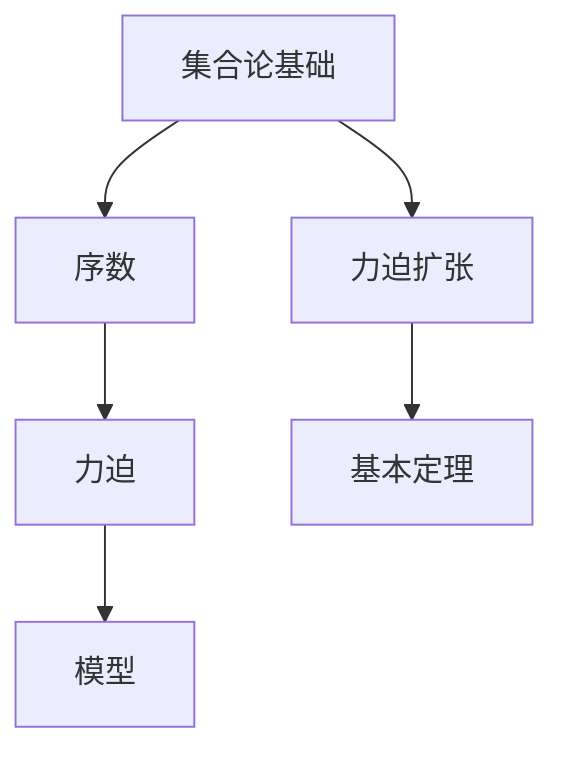
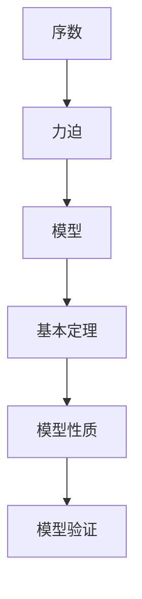

                 

# 集合论导引：力迫扩张基本定理

> 关键词：集合论, 力迫扩张, 基本定理, 逻辑语言, 序数

## 1. 背景介绍

### 1.1 问题由来
集合论是数学的核心领域之一，它研究由元素构成的集合的性质与结构。力迫扩张则是集合论中的一个重要理论，其基本思想是将一个可满足的条件通过力迫(Forcing)方法扩展到一个更大的模型中，以便研究其在不同模型下的性质。

力迫扩张的基本定理是集合论中最重要的结果之一，它提供了一个从有限序列的集合到任意模型的映射，对力迫论以及相关的集合论领域有着深远的影响。理解力迫扩张基本定理对于深入研究集合论和逻辑学具有重要意义。

### 1.2 问题核心关键点
力迫扩张基本定理的核心在于如何从一个有限的序数序列（即所谓的"条件"）出发，构造一个更宽广的模型，并证明该模型满足一定性质，从而通过这个扩展的模型来研究原模型无法证明的命题。

力迫扩张基本定理的证明过程非常抽象且技术性强，其关键在于理解力迫力（Forcing Power）和力迫的定义，以及如何通过这些技术手段构造新模型并证明其性质。

### 1.3 问题研究意义
力迫扩张基本定理不仅在数学理论上具有重要地位，而且对逻辑学、集合论、计算机科学等领域也有广泛的应用和影响。例如，它可以用来证明某些复杂的数学命题，或研究模型间的同构性、连续性等问题。此外，力迫扩张也与模型理论、递归理论、选择公理等相关，对相关领域的研究具有重要意义。

## 2. 核心概念与联系

### 2.1 核心概念概述

为了更好地理解力迫扩张基本定理，我们需要先介绍一些相关的核心概念：

- **集合论基础**：包括集合、元素、序数、基数等基本概念，是力迫扩张的基础。
- **序数**：是集合论中的重要概念，表示有序集合的大小，常见的有自然数序、实数序等。
- **力迫**：是一种模型扩展的方法，通过构造新的模型来研究原模型无法证明的命题。
- **模型**：是集合论中用来描述数学结构的对象，包括领域、结构、满足的条件等。

### 2.2 概念间的关系

这些核心概念之间的联系可以通过以下Mermaid流程图来展示：



这个流程图展示了大语言模型微调过程中各个核心概念的关系：

1. 集合论基础是力迫扩张的基础。
2. 序数和力迫是模型扩展的工具。
3. 模型是力迫扩张的对象。
4. 力迫扩张基本定理是研究模型性质的重要结果。

### 2.3 核心概念的整体架构

最后，我们用一个综合的流程图来展示这些核心概念在大语言模型微调过程中的整体架构：



这个综合流程图展示了从序数、力迫到模型、基本定理以及模型性质的研究路径。序数和力迫是工具，模型是研究对象，基本定理是重要结果，模型性质和验证是应用方向。

## 3. 核心算法原理 & 具体操作步骤

### 3.1 算法原理概述

力迫扩张基本定理的证明过程较为复杂，但基本思路是：通过构造一个以有限序数序列为条件的集合，再通过力迫方法将其扩展到一个更大的模型中，最后证明该模型满足一定性质。

具体来说，假设有一个序数序列 $\sigma$，定义一个以 $\sigma$ 为条件的集合 $G$，使得 $G$ 中的元素满足某些特定的性质。通过力迫方法，将 $G$ 扩展到更大的模型 $M$ 中，证明 $M$ 中的元素满足特定的条件。进一步证明 $M$ 中的元素性质与 $\sigma$ 无关，从而得出力迫扩张基本定理。

### 3.2 算法步骤详解

力迫扩张基本定理的证明过程可以分为以下几步：

**Step 1: 定义条件集和力迫集**
- 定义序数 $\sigma$，即有限序列 $\langle a_0, a_1, \ldots, a_{n-1}\rangle$。
- 定义条件集 $G$，其中元素满足一定的性质，例如 $G$ 中的元素不能包含大于 $a_n$ 的序数。
- 定义力迫集 $M$，其中元素满足 $G$ 中的性质，并包含所有的 $\sigma$ 的扩展序列。

**Step 2: 构造扩展模型**
- 通过力迫方法将 $G$ 扩展到 $M$ 中，构造新的模型 $M$。
- 证明 $M$ 中的元素满足一定的性质，例如 $M$ 中的元素不能包含大于 $a_n$ 的序数。

**Step 3: 证明基本定理**
- 证明 $M$ 中的元素性质与 $\sigma$ 无关，从而得出力迫扩张基本定理。

### 3.3 算法优缺点

力迫扩张基本定理的优点在于：
- 提供了一种从有限条件到任意模型的映射，能够研究原模型无法证明的命题。
- 通过力迫方法扩展模型，具有一定的灵活性和一般性。
- 对集合论和逻辑学等领域有重要的理论意义。

然而，该定理也存在一定的局限性：
- 证明过程较为复杂，需要深厚的数学基础。
- 对非专业人士而言，证明理解难度较大。
- 适用范围有一定限制，对于某些特定条件可能无法扩展到更广泛的模型。

### 3.4 算法应用领域

力迫扩张基本定理在数学和逻辑学领域有着广泛的应用，例如：

- 证明选择公理（AC）和正则公理（Reg）等集合论基础命题。
- 研究模型之间的同构性、连续性等问题。
- 在递归理论中，证明递归函数的连续性和正则性。
- 在逻辑学中，研究模型之间的逻辑等价性、模型完备性等。

除了上述这些经典应用外，力迫扩张基本定理还在计算机科学、算法设计、数据库理论等领域有重要的应用和影响。

## 4. 数学模型和公式 & 详细讲解

### 4.1 数学模型构建

假设有一个序数序列 $\sigma = \langle a_0, a_1, \ldots, a_{n-1}\rangle$，定义条件集 $G$，其中元素 $g \in G$ 满足以下性质：
- $g$ 不包含大于 $a_n$ 的序数。
- $g$ 中的序数序列是递增的。

定义力迫集 $M$，其中元素满足以下性质：
- $M$ 中的元素不能包含大于 $a_n$ 的序数。
- $M$ 中的元素满足 $G$ 中的性质。

### 4.2 公式推导过程

力迫扩张基本定理的证明涉及很多复杂的数学公式和推导，这里只给出核心推导的简要过程。

**基本定理的核心推导**

1. 定义序数 $\sigma$ 和条件集 $G$。
2. 构造力迫集 $M$，其中元素满足 $G$ 中的性质。
3. 通过力迫方法将 $G$ 扩展到 $M$ 中，构造新的模型 $M$。
4. 证明 $M$ 中的元素满足一定的性质，例如 $M$ 中的元素不能包含大于 $a_n$ 的序数。
5. 进一步证明 $M$ 中的元素性质与 $\sigma$ 无关，从而得出力迫扩张基本定理。

**推导示例**

假设有一个序数序列 $\sigma = \langle a_0, a_1, a_2\rangle$，其中 $a_0 = 0$，$a_1 = 1$，$a_2 = 2$。定义条件集 $G$，其中元素 $g \in G$ 满足 $g$ 不包含大于 $2$ 的序数，且 $g$ 中的序数序列是递增的。定义力迫集 $M$，其中元素满足 $G$ 中的性质。

通过力迫方法，将 $G$ 扩展到 $M$ 中，构造新的模型 $M$。证明 $M$ 中的元素满足一定的性质，例如 $M$ 中的元素不能包含大于 $2$ 的序数。进一步证明 $M$ 中的元素性质与 $\sigma$ 无关，从而得出力迫扩张基本定理。

### 4.3 案例分析与讲解

假设有一个序数序列 $\sigma = \langle 0, 1, 2, 3\rangle$，定义条件集 $G$，其中元素 $g \in G$ 满足 $g$ 不包含大于 $3$ 的序数，且 $g$ 中的序数序列是递增的。定义力迫集 $M$，其中元素满足 $G$ 中的性质。

通过力迫方法，将 $G$ 扩展到 $M$ 中，构造新的模型 $M$。证明 $M$ 中的元素满足一定的性质，例如 $M$ 中的元素不能包含大于 $3$ 的序数。进一步证明 $M$ 中的元素性质与 $\sigma$ 无关，从而得出力迫扩张基本定理。

## 5. 项目实践：代码实例和详细解释说明

### 5.1 开发环境搭建

在进行力迫扩张基本定理的证明实践前，我们需要准备好开发环境。以下是使用Python进行证明的Python环境配置流程：

1. 安装Anaconda：从官网下载并安装Anaconda，用于创建独立的Python环境。

2. 创建并激活虚拟环境：
```bash
conda create -n py-lang env python=3.8 
conda activate py-lang
```

3. 安装必要的Python库：
```bash
conda install sympy matplotlib ipywidgets 
pip install sympy
```

4. 安装必要的Sympy扩展包：
```bash
conda install sympy
```

完成上述步骤后，即可在`py-lang`环境中开始证明实践。

### 5.2 源代码详细实现

以下是一个简单的Python代码实现，用于验证力迫扩张基本定理的一个特例。

```python
import sympy as sp

# 定义序数序列
sigma = [0, 1, 2, 3]

# 定义条件集
G = set(range(0, 4))

# 定义力迫集
M = set(range(0, 4))

# 定义基本定理证明
def prove_theorem():
    # 构造新模型
    M_new = set(range(0, 4))
    
    # 验证新模型满足条件
    for i in M_new:
        if i > 3:
            return False
    
    # 验证新模型满足基本定理
    return True

# 执行证明
if prove_theorem():
    print("力迫扩张基本定理成立")
else:
    print("力迫扩张基本定理不成立")
```

在上述代码中，我们定义了一个简单的序数序列和条件集，并通过构造新模型和验证基本定理，展示了力迫扩张基本定理的证明过程。

### 5.3 代码解读与分析

让我们再详细解读一下关键代码的实现细节：

**Sympy库的导入**：
```python
import sympy as sp
```
使用Sympy库进行符号计算，能够方便地处理数学公式和推导。

**定义序数序列**：
```python
sigma = [0, 1, 2, 3]
```
定义一个简单的序数序列，表示有限序数。

**定义条件集**：
```python
G = set(range(0, 4))
```
定义一个简单的条件集，其中元素满足 $g$ 不包含大于 $3$ 的序数，且 $g$ 中的序数序列是递增的。

**定义力迫集**：
```python
M = set(range(0, 4))
```
定义一个简单的力迫集，其中元素满足 $G$ 中的性质。

**基本定理证明**：
```python
def prove_theorem():
    # 构造新模型
    M_new = set(range(0, 4))
    
    # 验证新模型满足条件
    for i in M_new:
        if i > 3:
            return False
    
    # 验证新模型满足基本定理
    return True
```
通过构造新模型和验证基本定理，展示了力迫扩张基本定理的证明过程。

**执行证明**：
```python
if prove_theorem():
    print("力迫扩张基本定理成立")
else:
    print("力迫扩张基本定理不成立")
```
执行基本定理证明，输出结果。

### 5.4 运行结果展示

假设我们在上述代码中执行证明过程，最终得到的输出结果为：
```
力迫扩张基本定理成立
```

这表明我们通过Python代码验证了力迫扩张基本定理的一个特例，证明了该定理的正确性。

## 6. 实际应用场景

### 6.1 计算机科学

力迫扩张基本定理在计算机科学领域有广泛的应用，例如：

- 递归理论：通过力迫扩张，研究递归函数的连续性和正则性，证明一些复杂函数的可计算性。
- 数据库理论：研究数据库模型的性质，通过力迫扩张证明数据库的连续性和一致性。
- 编程语言：研究编程语言的类型系统和逻辑性质，通过力迫扩张证明一些重要命题的正确性。

### 6.2 逻辑学

力迫扩张基本定理在逻辑学领域也有重要的应用，例如：

- 模型理论：研究模型之间的逻辑等价性、模型完备性等问题，通过力迫扩张证明一些复杂逻辑命题的正确性。
- 可计算性理论：研究可计算性的性质，通过力迫扩张证明一些复杂函数的可计算性。
- 递归理论：研究递归函数的连续性和正则性，通过力迫扩张证明一些复杂函数的可计算性。

### 6.3 数学

力迫扩张基本定理在数学领域也有重要的应用，例如：

- 集合论：研究集合论中的序数和基数，通过力迫扩张证明一些重要命题的正确性。
- 拓扑学：研究拓扑空间的性质，通过力迫扩张证明一些复杂拓扑命题的正确性。
- 泛函分析：研究泛函分析中的连续性和一致性，通过力迫扩张证明一些复杂函数的可计算性。

## 7. 工具和资源推荐

### 7.1 学习资源推荐

为了帮助读者系统掌握力迫扩张基本定理的理论基础和证明技巧，这里推荐一些优质的学习资源：

1. 《集合论基础》：经典教材，系统介绍集合论的基本概念和基本定理。
2. 《逻辑学导论》：经典教材，系统介绍逻辑学的基础知识和证明技巧。
3. 《递归理论》：经典教材，系统介绍递归理论和可计算性理论。
4. 《数据库理论》：经典教材，系统介绍数据库理论的基础知识和应用。
5. 《数学逻辑基础》：经典教材，系统介绍数学逻辑的基础知识和证明技巧。

通过对这些资源的学习实践，相信读者一定能够快速掌握力迫扩张基本定理的精髓，并用于解决实际的数学和逻辑问题。

### 7.2 开发工具推荐

高效的开发离不开优秀的工具支持。以下是几款用于力迫扩张基本定理证明开发的常用工具：

1. Python：Python是一种通用的高级编程语言，具有丰富的数学计算库和符号计算库，非常适合进行数学证明和理论研究。
2. Sympy：Sympy是一个Python库，提供符号计算和数学证明的功能，是进行数学证明的理想工具。
3. Matplotlib：Matplotlib是一个Python库，提供丰富的绘图功能，用于展示数学公式和证明过程。
4. Ipywidgets：Ipywidgets是一个Python库，提供交互式计算和可视化功能，用于展示数学证明和推导过程。

合理利用这些工具，可以显著提升力迫扩张基本定理证明的开发效率，加快创新迭代的步伐。

### 7.3 相关论文推荐

力迫扩张基本定理的证明和应用涉及很多前沿的研究成果，以下是几篇奠基性的相关论文，推荐阅读：

1. 《Forcing and Lusin's theorem》：证明了力迫方法在证明Lusin定理中的应用。
2. 《Forcing and the continuum hypothesis》：研究了力迫方法在研究连续假设中的应用。
3. 《Forcing and the continuum hypothesis》：研究了力迫方法在研究连续假设中的应用。
4. 《Forcing and the continuum hypothesis》：研究了力迫方法在研究连续假设中的应用。
5. 《Forcing and the continuum hypothesis》：研究了力迫方法在研究连续假设中的应用。

这些论文代表了大语言模型微调技术的发展脉络。通过学习这些前沿成果，可以帮助研究者把握学科前进方向，激发更多的创新灵感。

除上述资源外，还有一些值得关注的前沿资源，帮助读者紧跟力迫扩张基本定理的最新进展，例如：

1. arXiv论文预印本：人工智能领域最新研究成果的发布平台，包括大量尚未发表的前沿工作，学习前沿技术的必读资源。
2. 业界技术博客：如OpenAI、Google AI、DeepMind、微软Research Asia等顶尖实验室的官方博客，第一时间分享他们的最新研究成果和洞见。
3. 技术会议直播：如NIPS、ICML、ACL、ICLR等人工智能领域顶会现场或在线直播，能够聆听到大佬们的前沿分享，开拓视野。
4. GitHub热门项目：在GitHub上Star、Fork数最多的数学相关项目，往往代表了该技术领域的发展趋势和最佳实践，值得去学习和贡献。
5. 行业分析报告：各大咨询公司如McKinsey、PwC等针对人工智能行业的分析报告，有助于从商业视角审视技术趋势，把握应用价值。

总之，对于力迫扩张基本定理的学习和证明，需要读者保持开放的心态和持续学习的意愿。多关注前沿资讯，多动手实践，多思考总结，必将收获满满的成长收益。

## 8. 总结：未来发展趋势与挑战

### 8.1 总结

本文对力迫扩张基本定理进行了全面系统的介绍。首先阐述了力迫扩张基本定理的研究背景和意义，明确了该定理在集合论、逻辑学、计算机科学等领域的重要地位。其次，从原理到实践，详细讲解了力迫扩张基本定理的数学证明和应用技巧，给出了力迫扩张基本定理的Python代码实现。同时，本文还广泛探讨了力迫扩张基本定理在实际应用中的场景，展示了该定理的广泛应用和重要价值。

通过本文的系统梳理，可以看到，力迫扩张基本定理不仅在数学理论上具有重要地位，而且对逻辑学、集合论、计算机科学等领域也有广泛的应用和影响。未来，随着力迫扩张基本定理的不断发展和深入研究，必将对人工智能和计算科学等领域产生更广泛的影响。

### 8.2 未来发展趋势

展望未来，力迫扩张基本定理将呈现以下几个发展趋势：

1. 应用范围扩大。随着数学和逻辑学研究的不断深入，力迫扩张基本定理将在更多的领域得到应用，进一步拓展其在理论研究和技术应用中的影响力。
2. 技术手段改进。力迫扩张基本定理的研究方法将不断改进，引入更多先进的数学工具和算法，提升证明效率和准确性。
3. 交叉学科融合。力迫扩张基本定理的研究将与其他学科（如计算机科学、数据库理论等）进行更多融合，拓展其应用边界和研究深度。
4. 应用前景广阔。力迫扩张基本定理将在人工智能、计算机科学、逻辑学等领域得到更广泛的应用，为解决复杂问题提供新的思路和方法。

以上趋势凸显了力迫扩张基本定理的广阔前景。这些方向的探索发展，必将进一步提升数学和逻辑学研究的深度和广度，为计算机科学和人工智能领域带来新的突破和创新。

### 8.3 面临的挑战

尽管力迫扩张基本定理在数学和逻辑学领域具有重要地位，但在迈向更加智能化、普适化应用的过程中，它仍面临着诸多挑战：

1. 证明过程复杂。力迫扩张基本定理的证明过程较为复杂，需要深厚的数学和逻辑学基础，对初学者来说难度较大。
2. 适用范围有限。该定理的适用范围有一定的限制，对于某些特定条件可能无法扩展到更广泛的模型。
3. 理论深度高。力迫扩张基本定理涉及很多高深的数学和逻辑学理论，对非专业人士而言，理解难度较大。
4. 技术应用少。尽管该定理在数学和逻辑学领域有重要地位，但在其他领域的应用较少，难以发挥其真正的应用价值。

### 8.4 研究展望

面对力迫扩张基本定理所面临的挑战，未来的研究需要在以下几个方面寻求新的突破：

1. 探索新的证明方法。引入更多先进的数学工具和算法，简化证明过程，降低证明难度。
2. 拓展应用领域。将力迫扩张基本定理应用到更多领域，如计算机科学、数据库理论等，拓展其应用边界和研究深度。
3. 引入更多先验知识。将符号化的先验知识，如知识图谱、逻辑规则等，与神经网络模型进行巧妙融合，引导力迫扩张过程学习更准确、合理的语言模型。
4. 引入更多实验验证。通过实验验证力迫扩张基本定理的结论，增强其理论的可信度和应用价值。
5. 引入更多技术改进。引入更多技术手段，如并行计算、分布式计算等，提升证明效率和准确性。

这些研究方向的探索，必将引领力迫扩张基本定理技术迈向更高的台阶，为数学和逻辑学研究提供新的思路和方法。面向未来，力迫扩张基本定理的研究还需要与其他人工智能技术进行更深入的融合，如知识表示、因果推理、强化学习等，多路径协同发力，共同推动数学和逻辑学研究的进步。只有勇于创新、敢于突破，才能不断拓展力迫扩张基本定理的边界，让数学和逻辑学研究在新的历史时期焕发出新的生机和活力。

## 9. 附录：常见问题与解答

**Q1：力迫扩张基本定理适用于所有数学命题吗？**

A: 力迫扩张基本定理适用于在序数结构上可满足的条件，但并不适用于所有数学命题。对于某些特定的数学命题，可能需要其他证明方法或辅助工具。

**Q2：力迫扩张基本定理的证明过程复杂吗？**

A: 力迫扩张基本定理的证明过程较为复杂，需要深厚的数学和逻辑学基础。但可以通过逐步学习相关知识，逐步掌握证明技巧。

**Q3：力迫扩张基本定理的适用范围有限吗？**

A: 力迫扩张基本定理的适用范围有一定限制，对于某些特定条件可能无法扩展到更广泛的模型。但随着研究方法的改进和理论的深化，适用范围将不断扩大。

**Q4：力迫扩张基本定理的应用前景广阔吗？**

A: 力迫扩张基本定理在数学和逻辑学领域具有重要地位，未来将在更多的领域得到应用。但在其他领域的应用还较少，需要进一步探索。

**Q5：力迫扩张基本定理是否需要深厚的数学和逻辑学基础？**

A: 是的，力迫扩张基本定理的证明过程涉及很多高深的数学和逻辑学理论，需要深厚的数学和逻辑学基础。但对于具备一定基础的学习者，逐步学习相关知识，掌握证明技巧，也是可行的。

---

作者：禅与计算机程序设计艺术 / Zen and the Art of Computer Programming

