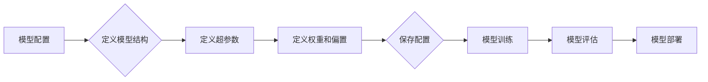

# 神经网络模型的配置管理

> 关键词：神经网络，配置管理，模型配置，自动化，可扩展性，可复现性，版本控制

## 1. 背景介绍

随着深度学习技术的飞速发展，神经网络模型在各个领域中的应用越来越广泛。然而，随着模型复杂性的增加，如何有效地管理这些模型的配置变得越来越重要。本文将探讨神经网络模型的配置管理，包括核心概念、算法原理、具体操作步骤、数学模型、项目实践、应用场景、工具和资源推荐，以及未来发展趋势和挑战。

## 2. 核心概念与联系

### 2.1 神经网络模型配置

神经网络模型配置是指定义和存储神经网络模型结构和参数的过程。它包括以下几个关键组成部分：

- **模型结构**：包括网络层数、每层神经元数量、激活函数、损失函数等。
- **超参数**：包括学习率、批次大小、正则化强度等。
- **权重和偏置**：模型的初始权重和偏置值。

### 2.2 配置管理的重要性

有效的配置管理对于以下方面至关重要：

- **可复现性**：确保模型的结果可以在不同的环境和条件下复现。
- **可扩展性**：方便模型在不同规模的数据集上进行训练和部署。
- **自动化**：通过自动化工具提高开发效率和模型维护的便捷性。

### 2.3 Mermaid 流程图



## 3. 核心算法原理 & 具体操作步骤

### 3.1 算法原理概述

神经网络模型配置管理通常涉及以下步骤：

1. **定义配置**：使用配置文件、代码注释或配置管理系统来定义模型结构和参数。
2. **配置存储**：将配置信息存储在中央存储系统中，如数据库、版本控制系统等。
3. **配置管理工具**：使用工具如Ansible、Chef、Kubernetes等来自动化配置管理流程。
4. **配置验证**：验证配置的完整性和正确性。
5. **配置更新**：根据需要更新配置信息。

### 3.2 算法步骤详解

1. **定义配置**：使用YAML、JSON或Python代码等方式定义模型结构和参数。
2. **配置存储**：将配置信息存储在Git仓库、数据库或配置中心等。
3. **配置管理工具**：使用Ansible脚本来自动化部署模型，或使用Kubernetes来管理模型的生命周期。
4. **配置验证**：编写验证脚本，确保配置信息满足要求。
5. **配置更新**：通过版本控制系统或其他方式更新配置信息。

### 3.3 算法优缺点

**优点**：

- **提高可复现性**：通过统一的配置管理，确保模型在不同环境下的可复现性。
- **提高可扩展性**：方便模型在不同规模的数据集上进行训练和部署。
- **提高自动化程度**：通过自动化工具提高开发效率和模型维护的便捷性。

**缺点**：

- **配置复杂性**：随着模型复杂性的增加，配置管理变得更加复杂。
- **学习曲线**：需要学习配置管理工具的使用。

### 3.4 算法应用领域

神经网络模型配置管理适用于以下领域：

- **机器学习和深度学习**：管理模型结构和参数。
- **自动化部署**：自动化部署机器学习模型。
- **持续集成/持续部署（CI/CD）**：在CI/CD流程中管理模型配置。

## 4. 数学模型和公式 & 详细讲解 & 举例说明

### 4.1 数学模型构建

神经网络模型配置管理通常不涉及复杂的数学模型。以下是神经网络模型的一些基本数学公式：

- **神经网络前向传播**：

$$
y = f(W \cdot x + b)
$$

其中 $y$ 是输出，$W$ 是权重，$x$ 是输入，$b$ 是偏置，$f$ 是激活函数。

- **反向传播算法**：

$$
\delta W = \eta \cdot \frac{\partial L}{\partial W}
$$

$$
\delta b = \eta \cdot \frac{\partial L}{\partial b}
$$

其中 $\delta W$ 和 $\delta b$ 分别是权重和偏置的梯度，$\eta$ 是学习率，$L$ 是损失函数。

### 4.2 公式推导过程

神经网络模型的损失函数和反向传播算法的推导过程涉及微积分和线性代数等数学知识。由于篇幅限制，这里不进行详细推导。

### 4.3 案例分析与讲解

假设我们有一个简单的神经网络模型，包含一个输入层、一个隐藏层和一个输出层。输入层有3个神经元，隐藏层有5个神经元，输出层有2个神经元。使用Sigmoid激活函数和交叉熵损失函数进行训练。

- **定义模型结构**：

```python
from keras.models import Sequential
from keras.layers import Dense, Activation

model = Sequential()
model.add(Dense(5, input_dim=3))
model.add(Activation('sigmoid'))
model.add(Dense(2))
model.add(Activation('sigmoid'))
```

- **定义损失函数和优化器**：

```python
model.compile(loss='categorical_crossentropy', optimizer='adam', metrics=['accuracy'])
```

- **训练模型**：

```python
model.fit(X_train, y_train, epochs=10, batch_size=32)
```

以上是使用Keras构建和训练简单神经网络模型的示例。

## 5. 项目实践：代码实例和详细解释说明

### 5.1 开发环境搭建

为了进行神经网络模型配置管理，我们需要以下开发环境：

- Python 3.x
- Keras或TensorFlow
- Git
- Docker
- Kubernetes

### 5.2 源代码详细实现

以下是一个使用Docker和Kubernetes进行神经网络模型配置管理的示例：

```Dockerfile
# Dockerfile
FROM tensorflow/tensorflow:2.4.1-gpu-py3

RUN pip install keras

COPY model.py /model.py

CMD ["python", "/model.py"]
```

```yaml
# Kubernetes deployment manifest
apiVersion: apps/v1
kind: Deployment
metadata:
  name: neural-network-model
spec:
  replicas: 1
  selector:
    matchLabels:
      app: neural-network-model
  template:
    metadata:
      labels:
        app: neural-network-model
    spec:
      containers:
      - name: neural-network-model
        image: neural-network-model:latest
        ports:
        - containerPort: 8080
```

### 5.3 代码解读与分析

- **Dockerfile**：定义了一个基于TensorFlow GPU的Docker镜像，并安装了Keras。
- **Kubernetes deployment manifest**：定义了一个Kubernetes部署，将神经网络模型部署到Kubernetes集群中。

### 5.4 运行结果展示

通过运行以下命令，我们可以将神经网络模型部署到Kubernetes集群中：

```bash
kubectl apply -f deployment.yaml
```

之后，我们可以通过访问`http://<k8s-cluster-ip>:8080`来访问模型。

## 6. 实际应用场景

### 6.1 机器学习和深度学习

神经网络模型配置管理在机器学习和深度学习领域非常重要。它可以确保模型在不同环境下的可复现性，并提高开发效率和模型维护的便捷性。

### 6.2 自动化部署

神经网络模型配置管理可以与自动化部署工具（如Docker、Kubernetes）结合，实现模型的自动化部署和扩展。

### 6.3 持续集成/持续部署（CI/CD）

神经网络模型配置管理可以集成到CI/CD流程中，确保模型在开发、测试和部署过程中的配置一致性。

## 7. 工具和资源推荐

### 7.1 学习资源推荐

- 《深度学习》[Goodfellow, Bengio, Courville]
- 《动手学深度学习》[Dive into Deep Learning]
- TensorFlow官方文档
- Keras官方文档

### 7.2 开发工具推荐

- Docker
- Kubernetes
- Git
- Jupyter Notebook
- Keras/TensorFlow

### 7.3 相关论文推荐

- "Accurate, Large Minibatch SGD: Training ImageNet in 1 Hour" [Sutskever et al.]
- "Distilling the Knowledge in a Neural Network" [Hinton et al.]

## 8. 总结：未来发展趋势与挑战

### 8.1 研究成果总结

本文介绍了神经网络模型配置管理的基本概念、算法原理、具体操作步骤、数学模型、项目实践、应用场景、工具和资源推荐以及未来发展趋势和挑战。

### 8.2 未来发展趋势

- **自动化配置管理**：使用自动化工具进一步提高配置管理的效率。
- **可解释性配置管理**：提高配置管理的可解释性和透明度。
- **知识图谱和语义搜索**：使用知识图谱和语义搜索技术来管理配置信息。

### 8.3 面临的挑战

- **配置复杂性**：随着模型复杂性的增加，配置管理变得更加复杂。
- **安全性**：确保配置信息的安全性。
- **可扩展性**：确保配置管理系统的可扩展性。

### 8.4 研究展望

未来，神经网络模型配置管理将朝着更加自动化、可解释和可扩展的方向发展。随着技术的不断进步，配置管理将变得更加容易，并能够更好地支持模型的开发、部署和维护。

## 9. 附录：常见问题与解答

**Q1：什么是神经网络模型配置管理？**

A：神经网络模型配置管理是指定义和存储神经网络模型结构和参数的过程。

**Q2：配置管理有哪些好处？**

A：配置管理可以提高可复现性、可扩展性和自动化程度。

**Q3：配置管理有哪些挑战？**

A：配置管理的主要挑战包括配置复杂性、安全性和可扩展性。

**Q4：如何进行神经网络模型配置管理？**

A：可以使用配置文件、代码注释、配置管理系统和自动化工具来进行神经网络模型配置管理。

**Q5：配置管理有哪些应用场景？**

A：神经网络模型配置管理适用于机器学习和深度学习、自动化部署和持续集成/持续部署等场景。

作者：禅与计算机程序设计艺术 / Zen and the Art of Computer Programming