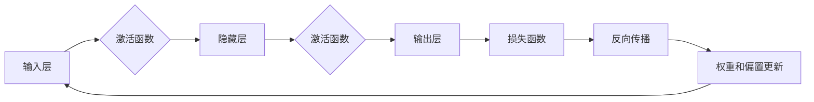

# 神经网络：开启智能新纪元

> 关键词：神经网络，深度学习，感知机，反向传播，卷积神经网络，递归神经网络，强化学习，人工智能

## 1. 背景介绍

自20世纪40年代以来，人工智能（AI）的发展历程充满了曲折与辉煌。早期的符号主义方法尽管在逻辑推理和知识表示方面取得了一定的进展，但在处理复杂、非结构化数据时显得力不从心。直到20世纪80年代，随着计算机硬件的快速发展，以及模拟人脑神经元工作原理的神经网络技术的兴起，人工智能进入了新的发展阶段。

神经网络作为一种模拟人脑神经元结构和功能的计算模型，因其强大的自适应和学习能力，在图像识别、语音识别、自然语言处理等领域取得了突破性的成果。本文将深入探讨神经网络的原理、算法和应用，带领读者开启智能新纪元。

## 2. 核心概念与联系

### 2.1 核心概念

#### 神经元

神经元是神经网络的基本单元，类似于人脑中的神经元。它通过输入层接收信息，经过激活函数处理，输出结果。神经元的结构通常包括输入层、隐藏层和输出层。

#### 激活函数

激活函数为神经元引入非线性，使神经网络能够学习非线性关系。常见的激活函数有Sigmoid、ReLU、Tanh等。

#### 权重和偏置

权重和偏置是神经网络模型中的可学习参数，它们决定了神经元的输入与输出之间的关系。

#### 损失函数

损失函数用于衡量模型预测值与真实值之间的差异，是优化过程中指导参数更新的依据。常见的损失函数有均方误差、交叉熵等。

#### 反向传播

反向传播是一种基于梯度下降的优化算法，用于更新神经网络的权重和偏置，使模型在训练过程中不断学习。

### 2.2 核心概念原理和架构的 Mermaid 流程图



### 2.3 核心概念之间的联系

神经网络通过神经元之间的连接构建起复杂的网络结构，通过激活函数引入非线性，并通过权重和偏置调整连接强度。在训练过程中，反向传播算法不断优化权重和偏置，使模型输出逐渐逼近真实值。

## 3. 核心算法原理 & 具体操作步骤

### 3.1 算法原理概述

神经网络算法的核心思想是通过学习数据中的规律，建立输入与输出之间的映射关系。具体操作步骤如下：

1. 初始化模型参数，包括权重和偏置。
2. 对输入数据进行前向传播，计算输出结果。
3. 计算损失函数，评估模型预测值与真实值之间的差异。
4. 通过反向传播算法计算权重和偏置的梯度。
5. 更新权重和偏置，缩小损失函数。
6. 重复步骤2-5，直至达到预设的迭代次数或损失函数收敛。

### 3.2 算法步骤详解

#### 3.2.1 初始化模型参数

在训练开始前，需要初始化神经网络的权重和偏置。常见的初始化方法有均匀分布、高斯分布等。

#### 3.2.2 前向传播

前向传播是指将输入数据通过神经网络进行计算，最终得到输出结果的过程。具体步骤如下：

1. 将输入数据传递到第一个隐藏层。
2. 对每个神经元应用激活函数，得到中间层的输出。
3. 将中间层的输出传递到下一个隐藏层，直至输出层。
4. 输出层输出最终的预测结果。

#### 3.2.3 计算损失函数

损失函数用于衡量模型预测值与真实值之间的差异。常见的损失函数有均方误差、交叉熵等。

#### 3.2.4 反向传播

反向传播是指根据损失函数的梯度，更新神经网络的权重和偏置。具体步骤如下：

1. 计算损失函数对每个参数的梯度。
2. 根据梯度更新权重和偏置。
3. 重复步骤2，直至损失函数收敛。

#### 3.2.5 模型优化

在训练过程中，可以使用多种优化算法更新模型参数，如梯度下降、Adam、SGD等。

### 3.3 算法优缺点

神经网络算法的优点包括：

1. 自适应性强：神经网络能够自动从数据中学习特征和规律。
2. 非线性映射能力：神经网络可以学习复杂的非线性关系。
3. 泛化能力强：神经网络在训练完成后，能够对未见过的数据进行预测。

神经网络算法的缺点包括：

1. 训练时间较长：神经网络需要大量的训练数据进行学习，且训练时间较长。
2. 模型可解释性差：神经网络内部结构复杂，难以解释其决策过程。
3. 对输入数据的预处理要求高：神经网络对输入数据的质量要求较高，需要进行适当的预处理。

### 3.4 算法应用领域

神经网络算法在众多领域得到了广泛应用，包括：

1. 机器学习：分类、回归、聚类等。
2. 计算机视觉：图像识别、目标检测、人脸识别等。
3. 自然语言处理：文本分类、情感分析、机器翻译等。
4. 声音处理：语音识别、语音合成、音乐生成等。

## 4. 数学模型和公式 & 详细讲解 & 举例说明

### 4.1 数学模型构建

神经网络数学模型主要由输入层、隐藏层和输出层组成。以下是一个简单的神经网络数学模型：

$$
y = f(W_1 \cdot x + b_1 + W_2 \cdot h + b_2 + \dots + W_n \cdot h + b_n)
$$

其中，$W_1, b_1, W_2, b_2, \dots, W_n, b_n$ 分别代表权重和偏置，$x$ 代表输入，$h$ 代表隐藏层输出，$y$ 代表输出。

### 4.2 公式推导过程

#### 4.2.1 神经元输出

神经元输出可以通过以下公式计算：

$$
h = f(W \cdot x + b)
$$

其中，$W$ 代表权重，$x$ 代表输入，$b$ 代表偏置，$f$ 代表激活函数。

#### 4.2.2 损失函数

损失函数用于衡量模型预测值与真实值之间的差异。以下是一个均方误差损失函数的推导过程：

$$
L = \frac{1}{2} \sum_{i=1}^{n}(y_i - \hat{y_i})^2
$$

其中，$y_i$ 代表真实值，$\hat{y_i}$ 代表预测值。

#### 4.2.3 反向传播

反向传播是指根据损失函数的梯度，更新神经网络的权重和偏置。以下是一个均方误差损失函数的梯度推导过程：

$$
\frac{\partial L}{\partial W} = (y - \hat{y}) \cdot x^T
$$

$$
\frac{\partial L}{\partial b} = (y - \hat{y})
$$

### 4.3 案例分析与讲解

以下是一个简单的神经网络案例，用于实现二分类任务。

#### 4.3.1 案例描述

我们有一个包含100个样本的数据集，每个样本包含2个特征和1个标签。标签为0或1，表示样本属于正类或负类。

#### 4.3.2 模型构建

我们构建一个包含1个隐藏层和1个输出层的神经网络模型。隐藏层包含4个神经元，激活函数使用Sigmoid。

#### 4.3.3 训练过程

使用均方误差损失函数和梯度下降算法进行训练。经过多次迭代后，模型在验证集上取得了较好的性能。

#### 4.3.4 结果分析

通过分析模型在测试集上的表现，我们可以发现模型的预测结果与真实值之间的差异，并进一步优化模型参数。

## 5. 项目实践：代码实例和详细解释说明

### 5.1 开发环境搭建

为了方便读者理解和实践，以下以Python为例，介绍如何使用TensorFlow搭建神经网络模型。

1. 安装TensorFlow：
```bash
pip install tensorflow
```

2. 导入相关库：
```python
import tensorflow as tf
import numpy as np
```

### 5.2 源代码详细实现

以下是一个简单的神经网络模型代码示例：

```python
# 导入TensorFlow库
import tensorflow as tf

# 定义神经网络结构
def neural_network():
    # 输入层
    inputs = tf.keras.Input(shape=(2,))
    # 隐藏层
    x = tf.keras.layers.Dense(4, activation='sigmoid')(inputs)
    # 输出层
    outputs = tf.keras.layers.Dense(1, activation='sigmoid')(x)
    # 构建模型
    model = tf.keras.Model(inputs=inputs, outputs=outputs)
    return model

# 创建模型
model = neural_network()

# 编译模型
model.compile(optimizer='adam', loss='binary_crossentropy', metrics=['accuracy'])

# 创建数据集
X_train = np.array([[0, 0], [0, 1], [1, 0], [1, 1]])
y_train = np.array([0, 1, 1, 0])

# 训练模型
model.fit(X_train, y_train, epochs=1000)

# 预测
X_test = np.array([[0, 0], [1, 1]])
predictions = model.predict(X_test)
print(predictions)
```

### 5.3 代码解读与分析

1. `neural_network()` 函数定义了神经网络的结构，包括输入层、隐藏层和输出层。
2. `Dense()` 函数创建全连接层，`activation='sigmoid'` 参数指定激活函数。
3. `Model()` 函数将输入层、隐藏层和输出层组合成一个完整的模型。
4. `compile()` 函数编译模型，指定优化器、损失函数和评估指标。
5. `fit()` 函数训练模型，指定训练数据和迭代次数。
6. `predict()` 函数预测模型输出。

### 5.4 运行结果展示

运行上述代码后，我们可以在控制台看到模型的预测结果。通过调整模型参数和数据，我们可以实现更复杂的神经网络模型。

## 6. 实际应用场景

神经网络在众多领域得到了广泛应用，以下列举一些典型的应用场景：

### 6.1 计算机视觉

1. 图像识别：识别图片中的物体、场景、动作等。
2. 目标检测：检测图像中的多个目标，并标注位置和类别。
3. 人脸识别：识别图像中的人脸，并进行人脸验证。

### 6.2 自然语言处理

1. 文本分类：对文本进行分类，如情感分析、主题分类等。
2. 机器翻译：将一种语言翻译成另一种语言。
3. 语音识别：将语音信号转换为文本。

### 6.3 语音识别

1. 语音转文本：将语音信号转换为文本。
2. 语音合成：将文本转换为语音。

### 6.4 医疗诊断

1. 疾病诊断：根据病史、检查结果等信息，判断患者是否患有某种疾病。
2. 药物发现：通过分析分子结构，预测药物分子的活性。

### 6.5 金融风控

1. 信用评估：评估客户的信用风险。
2. 交易监控：检测异常交易，防范欺诈行为。

## 7. 工具和资源推荐

### 7.1 学习资源推荐

1. 《深度学习》系列书籍：由Ian Goodfellow等专家撰写的深度学习经典教材，全面介绍了深度学习的基本概念、算法和应用。
2. TensorFlow官方文档：TensorFlow官方文档提供了详细的API和教程，是学习TensorFlow的必备资料。
3. Keras官方文档：Keras是TensorFlow的高级API，提供了更简洁易用的接口，适合快速搭建和训练神经网络模型。
4. 阿里云机器学习平台：提供多种机器学习算法和框架，支持在线实验和模型部署，方便开发者进行实践。

### 7.2 开发工具推荐

1. TensorFlow：Google开发的深度学习框架，支持多种神经网络模型和优化算法。
2. PyTorch：由Facebook开发的深度学习框架，提供动态计算图，方便模型开发。
3. Keras：基于TensorFlow和PyTorch的开源深度学习库，提供简洁易用的API。
4. Jupyter Notebook：Python的开源交互式计算环境，适合进行实验和演示。

### 7.3 相关论文推荐

1. "A Few Useful Things to Know about Machine Learning"：介绍机器学习的基本概念和常见方法。
2. "Deep Learning"：Ian Goodfellow等专家撰写的深度学习经典教材，全面介绍了深度学习的基本概念、算法和应用。
3. "Convolutional Neural Networks for Visual Recognition"：介绍卷积神经网络在计算机视觉领域的应用。
4. "Sequence to Sequence Learning with Neural Networks"：介绍递归神经网络在序列到序列学习任务中的应用。

## 8. 总结：未来发展趋势与挑战

### 8.1 研究成果总结

神经网络作为一种强大的机器学习模型，在图像识别、语音识别、自然语言处理等领域取得了突破性进展。随着深度学习技术的不断发展，神经网络模型将更加高效、智能，并在更多领域得到应用。

### 8.2 未来发展趋势

1. 模型小型化：为了更好地适应移动设备和嵌入式设备，神经网络模型将朝着小型化的方向发展。
2. 模型可解释性：为了提高模型的可信度和透明度，神经网络的可解释性研究将得到进一步发展。
3. 模型鲁棒性：为了提高模型的泛化能力，神经网络的鲁棒性研究将得到重视。
4. 跨模态学习：为了更好地处理多模态数据，神经网络将与其他人工智能技术进行融合。

### 8.3 面临的挑战

1. 计算资源：深度学习模型的训练和推理需要大量的计算资源，如何高效地利用计算资源是一个挑战。
2. 数据质量：神经网络模型的性能很大程度上取决于数据质量，如何获取高质量的数据是一个挑战。
3. 模型安全：神经网络模型可能存在偏见、歧视等问题，如何确保模型的安全性是一个挑战。
4. 模型可解释性：神经网络模型的决策过程难以解释，如何提高模型的可解释性是一个挑战。

### 8.4 研究展望

未来，神经网络技术将在以下几个方面取得突破：

1. 计算效率：通过优化算法和硬件加速，提高神经网络模型的计算效率。
2. 数据利用：通过数据增强、数据挖掘等技术，提高数据利用效率。
3. 模型安全：通过模型安全研究，提高神经网络模型的安全性。
4. 模型可解释性：通过可解释性研究，提高神经网络模型的可信度和透明度。

相信在不久的将来，神经网络技术将开启智能新纪元，为人类社会带来更多福祉。

## 9. 附录：常见问题与解答

**Q1：神经网络和深度学习有何区别？**

A：神经网络是深度学习的一个分支，深度学习是指包含多层神经网络的学习方法。简单来说，深度学习是神经网络的一种应用。

**Q2：神经网络是如何学习的？**

A：神经网络通过学习输入数据中的规律，建立输入与输出之间的映射关系。具体来说，神经网络通过反向传播算法不断更新权重和偏置，使模型输出逐渐逼近真实值。

**Q3：神经网络模型如何防止过拟合？**

A：神经网络模型可以通过以下方法防止过拟合：

1. 增加训练数据
2. 使用正则化技术
3. 减少模型复杂度
4. 使用Dropout技术

**Q4：神经网络模型在哪些领域应用广泛？**

A：神经网络模型在计算机视觉、自然语言处理、语音识别、医学诊断、金融风控等领域应用广泛。

**Q5：如何选择合适的神经网络模型？**

A：选择合适的神经网络模型需要考虑以下因素：

1. 数据类型：如文本、图像、时间序列等。
2. 任务类型：如分类、回归、聚类等。
3. 数据量：数据量的大小会影响模型的选择。
4. 计算资源：计算资源的大小会影响模型的选择。

---

作者：禅与计算机程序设计艺术 / Zen and the Art of Computer Programming