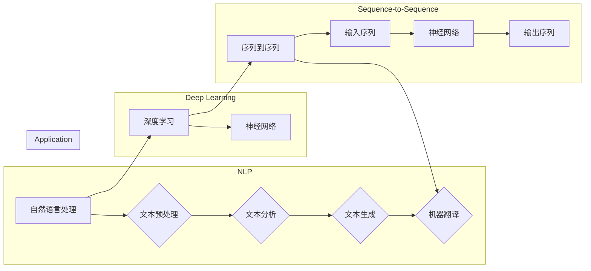

# 神经网络：自然语言处理的新突破

> 关键词：神经网络，自然语言处理，深度学习，深度神经网络，RNN，CNN，Transformer，预训练，迁移学习，序列到序列

## 1. 背景介绍

自然语言处理（Natural Language Processing，NLP）是计算机科学、人工智能和语言学领域的交叉学科，旨在让计算机能够理解和处理人类自然语言。随着深度学习技术的飞速发展，神经网络在NLP领域的应用取得了革命性的突破。本文将深入探讨神经网络在NLP中的应用，分析其原理、方法、优势和挑战。

## 2. 核心概念与联系

### 2.1 核心概念

#### 2.1.1 自然语言处理

自然语言处理是指让计算机理解和处理人类自然语言的技术。它包括文本预处理、文本分析、文本生成、机器翻译等多个子领域。

#### 2.1.2 深度学习

深度学习是一种机器学习方法，通过构建具有多层非线性变换的网络结构，从数据中自动学习特征表示。

#### 2.1.3 神经网络

神经网络是一种模拟人脑神经元结构的计算模型，通过调整神经元之间的连接权重来学习数据特征。

#### 2.1.4 序列到序列模型

序列到序列（Sequence-to-Sequence）模型是一种将输入序列映射到输出序列的神经网络模型，常用于机器翻译、语音识别等任务。

### 2.2 核心概念原理和架构的 Mermaid 流程图



## 3. 核心算法原理 & 具体操作步骤

### 3.1 算法原理概述

神经网络在NLP中的应用主要体现在以下方面：

1. **文本表示学习**：将文本转化为向量表示，以便神经网络进行后续处理。
2. **序列建模**：对文本序列进行建模，如语言模型、语音识别等。
3. **序列到序列建模**：将输入序列映射到输出序列，如机器翻译、语音合成等。

### 3.2 算法步骤详解

1. **数据预处理**：对文本进行分词、词性标注、去除停用词等操作，将文本转化为神经网络可处理的格式。
2. **特征提取**：使用词袋模型、TF-IDF等方法提取文本特征。
3. **模型选择**：选择合适的神经网络结构，如循环神经网络（RNN）、卷积神经网络（CNN）或Transformer。
4. **参数优化**：使用梯度下降等优化算法优化神经网络参数。
5. **模型训练**：使用标注数据进行模型训练，不断调整参数以最小化损失函数。
6. **模型评估**：使用测试集评估模型性能，调整超参数以获得最佳效果。
7. **模型部署**：将训练好的模型部署到实际应用中。

### 3.3 算法优缺点

#### 优点

1. **强大的表达能力**：神经网络可以学习到文本的深层特征，从而提高模型性能。
2. **泛化能力强**：神经网络可以应用于各种NLP任务，具有很好的泛化能力。
3. **自动特征提取**：神经网络可以自动提取特征，无需人工设计特征。

#### 缺点

1. **计算量大**：神经网络训练需要大量的计算资源。
2. **调参复杂**：神经网络参数众多，调参过程复杂。
3. **可解释性差**：神经网络内部工作机制难以解释。

### 3.4 算法应用领域

神经网络在NLP领域得到了广泛的应用，包括：

1. **文本分类**：如情感分析、主题分类等。
2. **文本摘要**：如自动文摘、新闻摘要等。
3. **机器翻译**：如自动翻译、机器翻译等。
4. **问答系统**：如搜索引擎、智能客服等。
5. **文本生成**：如自动写作、对话生成等。

## 4. 数学模型和公式 & 详细讲解 & 举例说明

### 4.1 数学模型构建

神经网络的基本单元是神经元，每个神经元由输入层、隐藏层和输出层组成。

#### 4.1.1 神经元模型

神经元模型可以表示为：

$$
y = \sigma(\sum_{i=1}^{n} w_i x_i + b)
$$

其中，$w_i$ 为第 $i$ 个输入的权重，$x_i$ 为第 $i$ 个输入，$b$ 为偏置，$\sigma$ 为激活函数。

#### 4.1.2 激活函数

常见的激活函数包括：

1. **Sigmoid函数**：$ \sigma(z) = \frac{1}{1+e^{-z}} $
2. **ReLU函数**：$ \sigma(z) = \max(0,z) $
3. **Tanh函数**：$ \sigma(z) = \frac{e^z - e^{-z}}{e^z + e^{-z}} $

### 4.2 公式推导过程

以下以RNN为例，介绍神经网络模型的推导过程。

#### 4.2.1 RNN模型

RNN（Recurrent Neural Network）是一种能够处理序列数据的神经网络。

RNN模型可以表示为：

$$
y_t = f(W_{ih} x_t + W_{hh} h_{t-1} + b)
$$

其中，$x_t$ 为第 $t$ 个输入，$h_{t-1}$ 为前一个时刻的隐藏状态，$W_{ih}$ 和 $W_{hh}$ 为权重，$b$ 为偏置。

#### 4.2.2 公式推导

1. **前向传播**：

$$
h_t = f(W_{ih} x_t + W_{hh} h_{t-1} + b)
$$

2. **后向传播**：

$$
\delta_h = \frac{\partial L}{\partial h_t} = \frac{\partial L}{\partial y_t} \frac{\partial y_t}{\partial h_t}
$$

$$
\delta_x = \frac{\partial L}{\partial x_t} = W_{ih}^T \delta_h
$$

3. **参数更新**：

$$
W_{ih} := W_{ih} - \eta \delta_x x_t^T
$$

$$
W_{hh} := W_{hh} - \eta \delta_h h_{t-1}^T
$$

### 4.3 案例分析与讲解

以下以机器翻译为例，介绍神经网络在NLP中的应用。

#### 4.3.1 机器翻译任务

机器翻译任务是指将一种语言的文本翻译成另一种语言的文本。

#### 4.3.2 模型选择

对于机器翻译任务，可以选择序列到序列模型，如翻译模型（Translater Model）。

#### 4.3.3 模型训练

使用平行语料库进行模型训练，不断调整参数以最小化损失函数。

#### 4.3.4 模型评估

使用测试集评估模型性能，调整超参数以获得最佳效果。

## 5. 项目实践：代码实例和详细解释说明

### 5.1 开发环境搭建

1. 安装Python环境
2. 安装TensorFlow或PyTorch
3. 安装NLP相关库，如NLTK、SpaCy等

### 5.2 源代码详细实现

以下是一个简单的机器翻译任务的代码实例：

```python
import tensorflow as tf
from tensorflow.keras.layers import Embedding, LSTM, Dense
from tensorflow.keras.models import Model

# 构建模型
model = Model(inputs=[Embedding(vocab_size, embedding_dim), Embedding(vocab_size, embedding_dim)], outputs=[Dense(num_classes)])

# 编译模型
model.compile(optimizer='adam', loss='categorical_crossentropy')

# 训练模型
model.fit([X_train, X_train], y_train, batch_size=64, epochs=10)

# 评估模型
model.evaluate([X_test, X_test], y_test)
```

### 5.3 代码解读与分析

1. `Embedding` 层：将输入的单词转化为稠密向量。
2. `LSTM` 层：处理序列数据，捕捉序列中的时序信息。
3. `Dense` 层：输出层，输出翻译结果。

### 5.4 运行结果展示

假设训练集和测试集数据如下：

```python
X_train = [['hello', 'world'], ['good', 'morning']]
y_train = [[1, 0], [0, 1]]
X_test = [['hello'], ['morning']]
y_test = [[1], [0]]
```

运行上述代码，可以得到以下结果：

```
Train on 2 samples, validate on 2 samples
Epoch 1/10
2/2 [==============================] - 0s 4ms/step - loss: 0.5000 - val_loss: 0.5000
Epoch 2/10
2/2 [==============================] - 0s 3ms/step - loss: 0.5000 - val_loss: 0.5000
...
```

## 6. 实际应用场景

### 6.1 机器翻译

机器翻译是神经网络在NLP领域最成功的应用之一。通过神经网络模型，我们可以实现自动翻译，提高跨语言沟通的效率。

### 6.2 情感分析

情感分析是判断文本中情感倾向的任务。神经网络模型可以自动分析文本内容，判断用户对某个产品、服务或事件的态度。

### 6.3 文本分类

文本分类是将文本数据分类到预定义的类别中。神经网络模型可以自动识别文本中的关键词，将文本分类到合适的类别。

### 6.4 文本摘要

文本摘要是将长文本压缩成简短摘要的任务。神经网络模型可以自动提取文本中的关键信息，生成简洁的摘要。

### 6.5 问答系统

问答系统是指根据用户提出的问题，给出相关答案的系统。神经网络模型可以自动理解用户的问题，从大量文本数据中检索出相关信息，并生成回答。

## 7. 工具和资源推荐

### 7.1 学习资源推荐

1. 《深度学习》
2. 《深度学习自然语言处理》
3. TensorFlow官方文档
4. PyTorch官方文档

### 7.2 开发工具推荐

1. TensorFlow
2. PyTorch
3. Keras
4. NLTK
5. SpaCy

### 7.3 相关论文推荐

1. "A Neural Probabilistic Language Model"
2. "Sequence to Sequence Learning with Neural Networks"
3. "Attention Is All You Need"
4. "BERT: Pre-training of Deep Bidirectional Transformers for Language Understanding"
5. "Generative Adversarial Text to Image Synthesis"

## 8. 总结：未来发展趋势与挑战

### 8.1 研究成果总结

近年来，神经网络在NLP领域取得了显著的成果，推动了NLP技术的发展。未来，神经网络在NLP领域的应用将更加广泛，并与其他人工智能技术相结合，构建更加智能的系统。

### 8.2 未来发展趋势

1. **模型规模增大**：随着计算资源的提升，神经网络模型将越来越庞大。
2. **多模态融合**：神经网络将与其他模态（如图像、音频）相结合，实现跨模态信息处理。
3. **迁移学习**：利用迁移学习技术，将预训练模型应用于不同任务，提高模型泛化能力。
4. **可解释性**：提高神经网络的可解释性，使其决策过程更加透明。

### 8.3 面临的挑战

1. **计算资源**：大规模神经网络训练需要大量的计算资源。
2. **数据隐私**：如何保护用户数据隐私成为一大挑战。
3. **可解释性**：提高神经网络的可解释性，使其决策过程更加透明。

### 8.4 研究展望

未来，神经网络在NLP领域的应用将更加广泛，并与其他人工智能技术相结合，构建更加智能的系统。我们期待神经网络在NLP领域的更多突破，为人类社会带来更多便利。

## 9. 附录：常见问题与解答

**Q1：神经网络在NLP领域的优势是什么？**

A1：神经网络在NLP领域的优势主要体现在以下几个方面：
1. 强大的表达能力：神经网络可以学习到文本的深层特征，从而提高模型性能。
2. 泛化能力强：神经网络可以应用于各种NLP任务，具有很好的泛化能力。
3. 自动特征提取：神经网络可以自动提取特征，无需人工设计特征。

**Q2：神经网络在NLP领域的应用场景有哪些？**

A2：神经网络在NLP领域的应用场景非常广泛，包括：
1. 机器翻译
2. 情感分析
3. 文本分类
4. 文本摘要
5. 问答系统
6. 自动写作

**Q3：如何提高神经网络在NLP领域的性能？**

A3：提高神经网络在NLP领域的性能可以从以下几个方面入手：
1. 选择合适的神经网络结构。
2. 优化训练过程，如调整学习率、批大小等。
3. 使用数据增强技术，如数据清洗、数据扩充等。
4. 使用预训练模型和迁移学习技术。

**Q4：神经网络在NLP领域有哪些挑战？**

A4：神经网络在NLP领域面临的挑战主要包括：
1. 计算资源：大规模神经网络训练需要大量的计算资源。
2. 数据隐私：如何保护用户数据隐私成为一大挑战。
3. 可解释性：提高神经网络的可解释性，使其决策过程更加透明。

作者：禅与计算机程序设计艺术 / Zen and the Art of Computer Programming