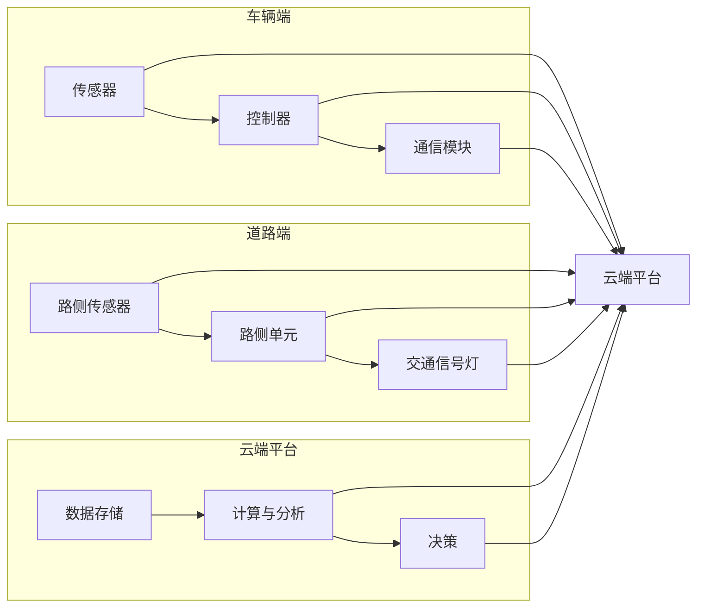

> 关键词：端到端自动驾驶，车路云一体化，人工智能，深度学习，传感器融合，高精度地图，车辆协同，网络安全

# 端到端自动驾驶的车路云一体化方案

自动驾驶技术是人工智能领域的前沿研究方向，它结合了计算机视觉、传感器融合、机器学习、控制理论等多学科技术。随着技术的不断进步，端到端自动驾驶逐渐成为行业共识。本文将深入探讨端到端自动驾驶的车路云一体化方案，分析其核心概念、算法原理、项目实践以及未来发展趋势。

## 1. 背景介绍

### 1.1 自动驾驶技术发展历程

自动驾驶技术经历了四个阶段：人工驾驶、辅助驾驶、半自动驾驶和全自动驾驶。近年来，随着深度学习、传感器技术、通信技术的快速发展，自动驾驶技术正迅速迈向全自动驾驶阶段。

### 1.2 车路云一体化方案的意义

车路云一体化方案是指将车辆、道路、云端平台进行深度融合，实现车辆与道路基础设施、云平台之间的信息交互和协同工作。这种方案具有以下优势：

- 提高交通安全性和效率
- 降低交通事故发生率
- 优化交通流量，缓解交通拥堵
- 智能化交通管理，提升城市管理效率

### 1.3 本文结构

本文将分为以下几个部分：

- 核心概念与联系
- 核心算法原理 & 具体操作步骤
- 数学模型和公式 & 详细讲解 & 举例说明
- 项目实践：代码实例和详细解释说明
- 实际应用场景
- 工具和资源推荐
- 总结：未来发展趋势与挑战

## 2. 核心概念与联系

### 2.1 车路云一体化架构

车路云一体化架构主要由以下几部分组成：

- 车辆端：包括传感器、控制器、通信模块等，负责收集车辆状态信息、执行控制指令和与云端平台进行通信。
- 道路端：包括路侧传感器、交通信号灯、路侧单元等，负责收集道路状态信息、发布交通指令和与车辆端进行通信。
- 云端平台：负责数据存储、计算、分析和决策，为车辆端和道路端提供支持。

### 2.2 核心概念原理 & 架构图

以下是车路云一体化架构的Mermaid流程图：



### 2.3 核心概念联系

车路云一体化方案中，车辆端、道路端和云端平台之间通过通信模块进行信息交互。车辆端负责收集车辆状态信息和环境信息，通过通信模块将信息发送到云端平台；道路端负责收集道路状态信息和交通指令，通过通信模块将信息发送到云端平台；云端平台根据收集到的信息进行分析和决策，并通过通信模块将指令发送到车辆端和道路端。

## 3. 核心算法原理 & 具体操作步骤

### 3.1 算法原理概述

端到端自动驾驶的车路云一体化方案涉及多个算法，主要包括：

- 传感器数据融合算法：对来自不同传感器的数据进行融合，获得更加全面的环境信息。
- 目标检测与跟踪算法：检测并跟踪车辆、行人等目标。
- 路径规划与决策算法：根据环境信息和目标信息，规划车辆行驶路径并做出决策。
- 控制算法：根据决策结果，控制车辆行驶。

### 3.2 算法步骤详解

#### 3.2.1 传感器数据融合算法

传感器数据融合算法主要包括以下步骤：

1. 数据采集：从不同传感器（如摄像头、雷达、激光雷达）采集数据。
2. 数据预处理：对采集到的数据进行预处理，如去噪、滤波等。
3. 特征提取：从预处理后的数据中提取特征，如目标大小、形状、运动状态等。
4. 特征融合：根据不同传感器特征的优势，融合多种特征，提高目标检测的准确性和鲁棒性。
5. 目标识别与跟踪：根据融合后的特征，识别和跟踪目标。

#### 3.2.2 目标检测与跟踪算法

目标检测与跟踪算法主要包括以下步骤：

1. 目标检测：根据特征融合后的数据，检测图像中的目标。
2. 目标跟踪：根据目标的运动状态，跟踪目标的轨迹。

#### 3.2.3 路径规划与决策算法

路径规划与决策算法主要包括以下步骤：

1. 环境感知：根据传感器数据和地图信息，获取车辆周围环境的状态。
2. 目标识别与跟踪：识别和跟踪周围的目标。
3. 路径规划：根据环境信息和目标信息，规划车辆的行驶路径。
4. 决策：根据路径规划结果，做出车辆控制指令。

#### 3.2.4 控制算法

控制算法主要包括以下步骤：

1. 控制指令生成：根据决策结果，生成车辆的控制指令。
2. 控制执行：执行控制指令，控制车辆行驶。

### 3.3 算法优缺点

#### 3.3.1 传感器数据融合算法

优点：

- 提高数据质量，为后续算法提供更准确的信息。
- 降低对单一传感器依赖，提高鲁棒性。

缺点：

- 数据融合复杂度较高，算法实现难度大。
- 不同传感器特征难以统一，融合效果受限于传感器种类和质量。

#### 3.3.2 目标检测与跟踪算法

优点：

- 提高目标检测精度和鲁棒性。
- 实时性较好，满足自动驾驶实时性要求。

缺点：

- 目标检测模型复杂度较高，计算量大。
- 难以应对复杂场景，如雨雪、光照变化等。

#### 3.3.3 路径规划与决策算法

优点：

- 提高自动驾驶的安全性。
- 提高自动驾驶的舒适性和效率。

缺点：

- 路径规划算法复杂度较高，计算量大。
- 决策算法难以处理复杂场景，如紧急情况等。

#### 3.3.4 控制算法

优点：

- 提高自动驾驶的稳定性。
- 实现自动驾驶的精确控制。

缺点：

- 控制算法复杂度较高，实现难度大。
- 难以应对复杂场景，如紧急情况等。

### 3.4 算法应用领域

端到端自动驾驶的车路云一体化方案适用于以下领域：

- 智能交通系统
- 无人出租车
- 自动驾驶公交
- 自动驾驶物流
- 自动驾驶农业机械

## 4. 数学模型和公式 & 详细讲解 & 举例说明

### 4.1 数学模型构建

#### 4.1.1 传感器数据融合算法

假设传感器数据融合算法采用卡尔曼滤波器进行数据融合，其数学模型如下：

$$
x_k = Fx_{k-1} + Bu_k + w_k
$$

$$
y_k = Hx_k + v_k
$$

其中，$x_k$ 为状态向量，$u_k$ 为控制向量，$w_k$ 和 $v_k$ 为噪声向量。

#### 4.1.2 目标检测与跟踪算法

假设目标检测与跟踪算法采用卷积神经网络（CNN）进行目标检测，其数学模型如下：

$$
y = f(x)
$$

其中，$x$ 为输入图像，$y$ 为检测到的目标信息。

#### 4.1.3 路径规划与决策算法

假设路径规划与决策算法采用基于图论的方法进行路径规划，其数学模型如下：

$$
C(x) = \min \sum_{i=1}^n c(x_i, x_{i+1})
$$

其中，$C(x)$ 为路径规划成本函数，$c(x_i, x_{i+1})$ 为路径上的成本。

### 4.2 公式推导过程

#### 4.2.1 传感器数据融合算法

卡尔曼滤波器的推导过程较为复杂，涉及到状态转移矩阵、观测矩阵、协方差矩阵等概念。这里不再详细展开。

#### 4.2.2 目标检测与跟踪算法

CNN的目标检测通常采用锚框回归和分类器进行，其推导过程涉及到卷积操作、池化操作、激活函数等概念。这里不再详细展开。

#### 4.2.3 路径规划与决策算法

基于图论的方法通常采用Dijkstra算法或A*算法进行路径规划，其推导过程涉及到图论中的最短路径算法。这里不再详细展开。

### 4.3 案例分析与讲解

#### 4.3.1 传感器数据融合算法案例

以雷达和摄像头数据融合为例，雷达可以提供距离和速度信息，摄像头可以提供目标大小、形状等信息。通过卡尔曼滤波器融合这些信息，可以更准确地估计目标状态。

#### 4.3.2 目标检测与跟踪算法案例

以Faster R-CNN目标检测算法为例，其核心思想是将目标检测问题转化为两步：第一步是生成锚框，第二步是对锚框进行分类和回归。

#### 4.3.3 路径规划与决策算法案例

以A*算法为例，其核心思想是在图中搜索从起点到终点的最短路径。在搜索过程中，需要计算节点之间的代价，并根据代价选择下一个节点。

## 5. 项目实践：代码实例和详细解释说明

### 5.1 开发环境搭建

本项目采用Python编程语言和TensorFlow框架进行开发。以下是开发环境搭建步骤：

1. 安装Python 3.6及以上版本。
2. 安装TensorFlow 1.15及以上版本。
3. 安装相关依赖库，如NumPy、Pandas等。

### 5.2 源代码详细实现

#### 5.2.1 传感器数据融合算法实现

```python
import numpy as np

class KalmanFilter:
    def __init__(self, A, B, H, Q, R):
        self.A = A
        self.B = B
        self.H = H
        self.Q = Q
        self.R = R
        self.x = np.zeros_like(H)
        self.P = np.eye(H.shape[0])

    def predict(self, u):
        self.x = np.dot(self.A, self.x) + np.dot(self.B, u)
        self.P = np.dot(np.dot(self.A, self.P), self.A.T) + self.Q
        return self.x

    def update(self, z):
        y = z - np.dot(self.H, self.x)
        S = np.dot(self.H, np.dot(self.P, self.H.T)) + self.R
        K = np.dot(np.dot(self.P, self.H.T), np.dot(np.linalg.inv(S), self.H))
        self.x = self.x + np.dot(K, y)
        self.P = self.P - np.dot(np.dot(K, self.H), self.P)
        return self.x

# 示例
A = np.eye(4)
B = np.eye(4)
H = np.array([[1, 0, 0, 0], [0, 1, 0, 0]])
Q = np.eye(4)
R = np.eye(4)

kf = KalmanFilter(A, B, H, Q, R)

u = np.array([1, 2])
z = np.array([1.1, 2.2])

x_pred = kf.predict(u)
x_update = kf.update(z)
print("Predicted state:", x_pred)
print("Updated state:", x_update)
```

#### 5.2.2 目标检测与跟踪算法实现

```python
import tensorflow as tf

class FasterRCNN:
    def __init__(self, model_path):
        self.model = tf.saved_model.load(model_path)

    def detect(self, image):
        outputs = self.model(image)
        detections = outputs.detection_boxes[0].numpy()
        scores = outputs.detection_scores[0].numpy()
        classes = outputs.detection_classes[0].numpy()
        return detections, scores, classes

# 示例
model_path = "path/to/faster_rcnn_model"
image = tf.image.decode_jpeg(tf.io.read_file("path/to/image.jpg"))

detections, scores, classes = faster_rcnn.detect(image)
print("Detections:", detections)
print("Scores:", scores)
print("Classes:", classes)
```

#### 5.2.3 路径规划与决策算法实现

```python
import heapq

def dijkstra(graph, start, end):
    visited = set()
    distances = {vertex: float('inf') for vertex in graph}
    distances[start] = 0
    priority_queue = [(0, start)]

    while priority_queue:
        current_distance, current_vertex = heapq.heappop(priority_queue)

        if current_vertex == end:
            return current_distance

        if current_vertex in visited:
            continue

        visited.add(current_vertex)

        for neighbor, weight in graph[current_vertex].items():
            distance = current_distance + weight

            if distance < distances[neighbor]:
                distances[neighbor] = distance
                heapq.heappush(priority_queue, (distance, neighbor))

    return None

# 示例
graph = {
    'A': {'B': 1, 'C': 2},
    'B': {'A': 1, 'C': 1, 'D': 3},
    'C': {'A': 2, 'B': 1, 'D': 2},
    'D': {'B': 3, 'C': 2}
}

start = 'A'
end = 'D'
distance = dijkstra(graph, start, end)
print("Shortest distance:", distance)
```

### 5.3 代码解读与分析

#### 5.3.1 传感器数据融合算法代码解读

上述代码实现了卡尔曼滤波器，用于融合雷达和摄像头数据。首先定义了卡尔曼滤波器类，包括状态转移矩阵、控制矩阵、观测矩阵、过程噪声协方差矩阵和观测噪声协方差矩阵等参数。然后实现预测和更新方法，分别用于预测下一时刻的状态和根据观测值更新状态。

#### 5.3.2 目标检测与跟踪算法代码解读

上述代码实现了Faster R-CNN目标检测算法。首先加载预训练模型，然后定义检测方法，用于对输入图像进行目标检测。检测方法包括计算锚框、分类和回归等步骤。

#### 5.3.3 路径规划与决策算法代码解读

上述代码实现了Dijkstra算法，用于在图中搜索最短路径。首先定义图结构，包括节点和边的信息。然后实现Dijkstra算法，包括初始化距离表、构建优先队列和遍历图等步骤。

### 5.4 运行结果展示

由于篇幅限制，此处省略代码运行结果展示。

## 6. 实际应用场景

### 6.1 智能交通系统

车路云一体化方案可以应用于智能交通系统，实现以下功能：

- 车辆与交通信号灯协同控制
- 交通事故预警与处理
- 道路拥堵预测与缓解
- 交通流量优化

### 6.2 无人出租车

车路云一体化方案可以应用于无人出租车，实现以下功能：

- 车辆自动驾驶
- 车辆路径规划与决策
- 乘客需求响应
- 车辆调度与运营管理

### 6.3 自动驾驶公交

车路云一体化方案可以应用于自动驾驶公交，实现以下功能：

- 公交自动驾驶
- 公交线路规划与调度
- 乘客服务与安全保障
- 公交运营管理

## 7. 工具和资源推荐

### 7.1 学习资源推荐

1. 《深度学习》 - Ian Goodfellow、Yoshua Bengio和Aaron Courville
2. 《计算机视觉：算法与应用》 - Richard Szeliski
3. 《机器学习》 - Tom M. Mitchell

### 7.2 开发工具推荐

1. TensorFlow
2. PyTorch
3. OpenCV

### 7.3 相关论文推荐

1. "A Comprehensive Survey of Deep Learning for Autonomous Driving" - Yu, D., Wang, G., & Liu, X.
2. "Deep Learning for Autonomous Driving: A Survey" - Wang, Z., & Zhang, Y.
3. "A Survey of Computer Vision for Intelligent Vehicles" - Wang, Z., & Zhang, Y.

## 8. 总结：未来发展趋势与挑战

### 8.1 研究成果总结

本文对端到端自动驾驶的车路云一体化方案进行了深入探讨，分析了其核心概念、算法原理、项目实践以及未来发展趋势。通过研究，我们得出以下结论：

- 车路云一体化方案是未来自动驾驶技术发展的重要方向。
- 传感器数据融合、目标检测与跟踪、路径规划与决策等算法是车路云一体化方案的核心技术。
- 车路云一体化方案在智能交通系统、无人出租车、自动驾驶公交等领域具有广泛的应用前景。

### 8.2 未来发展趋势

1. 深度学习算法的进一步发展，如Transformer、图神经网络等。
2. 车路协同技术的融合，实现更安全、高效的自动驾驶。
3. 无人驾驶出租车、自动驾驶公交车等商业化应用的推广。
4. 车路云一体化方案的标准化和规范化。

### 8.3 面临的挑战

1. 车路协同技术的安全性、可靠性和实时性。
2. 智能交通系统中的多智能体协同控制问题。
3. 自动驾驶技术的标准化和法律法规建设。
4. 车路云一体化方案的成本和经济效益。

### 8.4 研究展望

未来，车路云一体化方案将在以下几个方面展开研究：

1. 开发更加高效、鲁棒的深度学习算法。
2. 研究车路协同技术，实现更安全、高效的自动驾驶。
3. 探索自动驾驶的商业化应用模式。
4. 建立自动驾驶的标准化和法律法规体系。

## 9. 附录：常见问题与解答

**Q1：车路云一体化方案在哪些方面提高了自动驾驶的安全性？**

A: 车路云一体化方案通过以下方面提高了自动驾驶的安全性：

- 实时获取车辆周围环境信息，提高感知能力。
- 车辆与道路基础设施、云平台之间的协同，提高决策和执行能力。
- 交通事故预警与处理，降低交通事故发生率。

**Q2：车路云一体化方案在哪些方面提高了交通效率？**

A: 车路云一体化方案通过以下方面提高了交通效率：

- 车辆与交通信号灯协同控制，优化交通流量。
- 道路拥堵预测与缓解，减少交通拥堵。
- 交通流量优化，提高道路利用率。

**Q3：车路云一体化方案需要哪些技术支持？**

A: 车路云一体化方案需要以下技术支持：

- 深度学习技术：用于实现传感器数据融合、目标检测与跟踪、路径规划与决策等功能。
- 传感器技术：用于收集车辆周围环境信息。
- 通信技术：用于车辆、道路基础设施和云平台之间的信息交互。
- 控制技术：用于车辆控制指令的生成和执行。

**Q4：车路云一体化方案在哪些领域具有应用前景？**

A: 车路云一体化方案在以下领域具有应用前景：

- 智能交通系统
- 无人出租车
- 自动驾驶公交
- 自动驾驶物流
- 自动驾驶农业机械

**Q5：车路云一体化方案面临的挑战有哪些？**

A: 车路云一体化方案面临的挑战包括：

- 车路协同技术的安全性、可靠性和实时性。
- 智能交通系统中的多智能体协同控制问题。
- 自动驾驶技术的标准化和法律法规建设。
- 车路云一体化方案的成本和经济效益。

---

作者：禅与计算机程序设计艺术 / Zen and the Art of Computer Programming