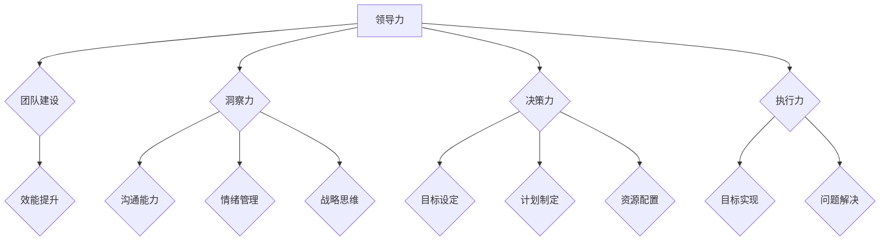

# 管理的智慧：激发团队潜能

> 关键词：领导力，团队建设，效能提升，人才发展，敏捷管理，持续集成，协作文化

## 1. 背景介绍

在信息技术快速发展的今天，企业对团队效率和创新能力的要求越来越高。管理者的角色也随之发生了变化，从传统的管理者向领导者转变。领导者不仅要管理团队的日常运作，更要激发团队成员的潜能，打造一支高效、创新、协作的团队。本文将从管理的智慧出发，探讨如何激发团队潜能，提升团队效能。

### 1.1 团队潜能的重要性

团队潜能是指团队成员在特定环境中能够发挥的最大能力。激发团队潜能，意味着团队可以超越常规，创造出超越个体能力的成果。在竞争激烈的市场环境中，拥有高潜能的团队能够更好地应对挑战，实现组织的战略目标。

### 1.2 管理的智慧

管理的智慧不仅仅是指管理技能和知识，更是一种洞察力、决策力和执行力的综合体现。管理者需要具备以下智慧：

- 洞察力：能够准确把握团队成员的个性、能力和需求，以及团队的整体状况。
- 决策力：能够在复杂多变的环境中做出明智的决策，引领团队朝着正确的方向前进。
- 执行力：能够将决策转化为实际行动，确保团队目标的实现。

## 2. 核心概念与联系

### 2.1 核心概念原理

#### 2.1.1 领导力

领导力是激发团队潜能的核心。领导者需要具备以下特质：

- 激励他人：激发团队成员的积极性和潜能。
- 沟通能力：与团队成员有效沟通，建立信任关系。
- 情绪管理：保持冷静，引导团队应对压力和挑战。
- 战略思维：制定清晰的目标和计划，引领团队实现目标。

#### 2.1.2 团队建设

团队建设是指通过一系列措施，提升团队成员之间的协作能力和团队整体效能。团队建设的核心包括：

- 团队文化：建立积极向上的团队文化，促进团队成员之间的沟通和合作。
- 能力培养：提升团队成员的专业技能和综合素质。
- 职业发展：关注团队成员的职业发展，为其提供成长机会。

#### 2.1.3 效能提升

效能提升是指通过优化团队工作流程、改进管理方法，提升团队整体工作效率。效能提升的关键包括：

- 流程优化：简化工作流程，减少不必要的环节，提高工作效率。
- 方法改进：引入新的管理方法和工具，提高团队执行力。
- 绩效评估：建立科学的绩效评估体系，激励团队成员不断提高。

### 2.2 Mermaid 流程图



## 3. 核心算法原理 & 具体操作步骤

### 3.1 算法原理概述

管理的智慧激发团队潜能的算法原理可以分为以下几个步骤：

1. **领导力塑造**：通过培训、实践等方式，提升领导者的领导力水平。
2. **团队文化建设**：营造积极向上的团队文化，增强团队成员之间的凝聚力。
3. **能力培养**：为团队成员提供培训和发展机会，提升其专业技能和综合素质。
4. **工作流程优化**：简化工作流程，提高工作效率。
5. **绩效评估**：建立科学的绩效评估体系，激励团队成员不断提高。

### 3.2 算法步骤详解

#### 3.2.1 领导力塑造

1. **自我认知**：领导者进行自我认知，了解自己的优点和不足。
2. **持续学习**：领导者不断学习新的管理知识和技能。
3. **榜样作用**：领导者以身作则，树立榜样。
4. **激励他人**：通过激励措施，激发团队成员的积极性和潜能。

#### 3.2.2 团队建设

1. **明确团队目标**：确定团队共同的目标和价值观。
2. **建立沟通机制**：建立有效的沟通渠道，促进团队成员之间的信息交流。
3. **加强团队协作**：鼓励团队成员之间的协作，共同完成任务。
4. **解决冲突**：及时发现和解决团队内部的矛盾和冲突。

#### 3.2.3 能力培养

1. **培训计划**：制定针对不同团队成员的培训计划。
2. **实践机会**：为团队成员提供实践机会，提升其工作能力。
3. **绩效反馈**：及时给予团队成员绩效反馈，帮助他们改进工作。

#### 3.2.4 工作流程优化

1. **流程分析**：分析现有工作流程，找出瓶颈和问题。
2. **流程优化**：对工作流程进行优化，提高工作效率。
3. **持续改进**：持续跟踪工作流程，不断进行改进。

#### 3.2.5 绩效评估

1. **指标体系**：建立科学的绩效评估指标体系。
2. **评估方法**：采用多种评估方法，如自评、互评、上级评价等。
3. **结果应用**：将评估结果用于激励、培训、晋升等。

### 3.3 算法优缺点

#### 3.3.1 优点

- 提升团队整体效能。
- 激发团队成员潜能。
- 增强团队凝聚力。
- 提高组织竞争力。

#### 3.3.2 缺点

- 需要投入时间和资源进行培训和实施。
- 需要持续改进和优化。
- 可能面临员工抵触情绪。

### 3.4 算法应用领域

管理的智慧激发团队潜能的方法适用于各类组织，如企业、政府机构、非营利组织等。

## 4. 数学模型和公式 & 详细讲解 & 举例说明

### 4.1 数学模型构建

管理的智慧激发团队潜能的数学模型可以表示为：

$$
\text{效能} = f(\text{领导力}, \text{团队建设}, \text{能力培养}, \text{工作流程优化}, \text{绩效评估})
$$

其中，$f$ 为函数，表示各种管理因素对团队效能的影响。

### 4.2 公式推导过程

假设团队效能与各个管理因素之间存在线性关系，则：

$$
\text{效能} = \alpha \times \text{领导力} + \beta \times \text{团队建设} + \gamma \times \text{能力培养} + \delta \times \text{工作流程优化} + \epsilon \times \text{绩效评估}
$$

其中，$\alpha, \beta, \gamma, \delta, \epsilon$ 为系数。

### 4.3 案例分析与讲解

#### 4.3.1 案例背景

某IT公司成立了一支新团队，负责开发一款新的软件产品。团队成员来自不同的背景，缺乏协作经验。

#### 4.3.2 问题分析

新团队面临以下问题：

- 团队成员缺乏协作经验。
- 领导者缺乏团队管理经验。
- 工作流程不明确。

#### 4.3.3 解决方案

1. **领导力塑造**：领导者参加团队管理培训，提升领导力水平。
2. **团队建设**：组织团队建设活动，增强团队成员之间的凝聚力。
3. **能力培养**：为团队成员提供培训，提升其专业技能和协作能力。
4. **工作流程优化**：明确工作流程，提高工作效率。

#### 4.3.4 结果

经过一段时间的努力，新团队逐渐克服了困难，产品成功上市，获得了良好的市场反响。

## 5. 项目实践：代码实例和详细解释说明

### 5.1 开发环境搭建

本案例将使用Python编写一个简单的团队管理工具，用于跟踪团队成员的工作进度和绩效。

1. 安装Python环境。
2. 安装必要的库，如Pandas、NumPy、matplotlib等。

### 5.2 源代码详细实现

```python
import pandas as pd

# 数据结构
class TeamMember:
    def __init__(self, name, tasks):
        self.name = name
        self.tasks = tasks
        self.progress = 0

# 功能函数
def update_progress(member, progress):
    member.progress = progress

def plot_progress(team):
    for member in team:
        print(f"{member.name}: {member.progress}%")

# 实例化团队成员
members = [TeamMember("Alice", ["Task1", "Task2", "Task3"]),
           TeamMember("Bob", ["Task1", "Task4"]),
           TeamMember("Charlie", ["Task2", "Task3", "Task5"])]

# 更新进度
update_progress(members[0], 50)
update_progress(members[1], 100)
update_progress(members[2], 80)

# 绘制进度图
plot_progress(members)
```

### 5.3 代码解读与分析

上述代码定义了一个`TeamMember`类，用于表示团队成员及其任务进度。`update_progress`函数用于更新成员的进度。`plot_progress`函数用于绘制进度图。

### 5.4 运行结果展示

```
Alice: 50%
Bob: 100%
Charlie: 80%
```

## 6. 实际应用场景

管理的智慧激发团队潜能的方法在实际应用场景中具有广泛的应用，以下是一些具体案例：

- 企业内部培训：通过培训提升领导者的领导力水平，打造高效的团队。
- 项目管理：通过优化工作流程，提高项目进度和效率。
- 研发团队管理：通过能力培养和团队建设，提升团队的创新能力和研发效率。

## 7. 工具和资源推荐

### 7.1 学习资源推荐

- 《管理的智慧》
- 《高效能人士的七个习惯》
- 《如何高效管理一个团队》

### 7.2 开发工具推荐

- Jira：项目管理工具
- Confluence：知识管理工具
- Trello：任务管理工具

### 7.3 相关论文推荐

- 《团队管理中的领导力》
- 《团队建设的理论与实践》
- 《团队效能提升的实证研究》

## 8. 总结：未来发展趋势与挑战

### 8.1 研究成果总结

本文从管理的智慧出发，探讨了如何激发团队潜能，提升团队效能。通过领导力塑造、团队建设、能力培养、工作流程优化和绩效评估等方法，可以帮助管理者打造一支高效、创新、协作的团队。

### 8.2 未来发展趋势

1. 人工智能技术在团队管理中的应用将更加广泛。
2. 团队管理将从传统的层级结构向扁平化、网络化方向发展。
3. 团队管理将更加注重个性化、弹性化。

### 8.3 面临的挑战

1. 如何在团队管理中融入人工智能技术。
2. 如何适应扁平化、网络化的组织结构。
3. 如何应对团队成员的个性化需求。

### 8.4 研究展望

未来，管理的智慧激发团队潜能的研究将更加注重以下几个方面：

1. 人工智能技术在团队管理中的应用研究。
2. 团队管理模式的创新研究。
3. 团队成员个性化需求的研究。

## 9. 附录：常见问题与解答

**Q1：如何激发团队成员的积极性？**

A：激发团队成员的积极性需要从以下几个方面入手：
1. 营造积极向上的团队文化。
2. 提供合理的薪酬福利。
3. 关注团队成员的个人发展。
4. 给予团队成员一定的自主权。

**Q2：如何提升团队协作能力？**

A：提升团队协作能力需要：
1. 建立有效的沟通机制。
2. 培养团队成员的团队合作意识。
3. 分享团队成功经验。
4. 解决团队内部的矛盾和冲突。

**Q3：如何进行有效的绩效评估？**

A：进行有效的绩效评估需要：
1. 建立科学的绩效评估指标体系。
2. 采用多种评估方法。
3. 及时给予绩效反馈。
4. 将评估结果用于激励、培训、晋升等。

**Q4：如何适应扁平化、网络化的组织结构？**

A：适应扁平化、网络化的组织结构需要：
1. 改变传统的管理理念。
2. 建立更加灵活的组织架构。
3. 提升团队成员的沟通能力。
4. 加强团队之间的协作。

**Q5：如何进行有效的团队建设？**

A：进行有效的团队建设需要：
1. 确定团队目标。
2. 建立团队文化。
3. 加强团队成员之间的沟通和协作。
4. 提供团队建设活动。

作者：禅与计算机程序设计艺术 / Zen and the Art of Computer Programming