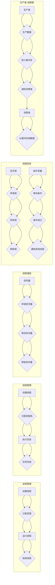

# 线程管理与高吞吐量系统设计

> 关键词：线程管理，高吞吐量，并发编程，系统架构，性能优化，负载均衡，锁机制，无锁编程，并发队列

## 1. 背景介绍

在当今的计算环境中，多核处理器、分布式系统以及网络服务的普及，使得并发编程成为了构建高性能系统不可或缺的一部分。线程管理作为并发编程的核心，直接影响到系统的响应时间、吞吐量和资源利用率。本文将深入探讨线程管理在高吞吐量系统设计中的重要性，分析其核心概念、算法原理，并探讨实际应用场景和未来发展趋势。

### 1.1 线程管理的由来

随着计算机硬件的发展，单核处理器的性能逐渐接近物理极限。为了提高系统的计算能力和响应速度，多核处理器和并行计算技术应运而生。线程管理作为一种实现并行计算的手段，通过将任务分解成多个线程，并在多个核心上同时执行，从而提高系统的吞吐量。

### 1.2 研究现状

当前，线程管理已经成为了计算机系统设计的重要组成部分。在操作系统中，线程管理涉及到进程管理、内存管理、I/O管理等多个方面。在应用程序层面，并发编程框架和库（如Java的Thread、C++的std::thread、Python的threading等）为开发者提供了便捷的线程管理工具。

### 1.3 研究意义

高效合理的线程管理对于构建高吞吐量系统至关重要。良好的线程管理策略可以：

- 提高系统的响应时间和吞吐量
- 优化资源利用率，降低系统开销
- 提高系统的稳定性和可扩展性
- 降低开发成本和运维难度

### 1.4 本文结构

本文将按照以下结构展开：

- 第2部分，介绍线程管理的核心概念和联系。
- 第3部分，深入探讨线程管理的算法原理和具体操作步骤。
- 第4部分，分析线程管理的数学模型和公式，并结合实例进行讲解。
- 第5部分，给出线程管理的代码实例和详细解释说明。
- 第6部分，探讨线程管理在实际应用场景中的应用。
- 第7部分，推荐线程管理相关的学习资源、开发工具和参考文献。
- 第8部分，总结全文，展望线程管理技术的未来发展趋势与挑战。

## 2. 核心概念与联系

### 2.1 核心概念

以下是线程管理中的核心概念：

- **线程（Thread）**：程序执行的最小单元，能够被操作系统独立调度和分派的基本单位。
- **进程（Process）**：具有一定独立功能的程序关于某个数据集合的一次运行活动，是系统进行资源分配和调度的基本单位。
- **并发（Concurrency）**：多个程序在同一时间间隔内同时运行。
- **并行（Parallelism）**：多个程序在多个处理器上同时运行。
- **同步（Synchronization）**：协调多个线程或进程之间的执行顺序。
- **互斥锁（Mutex）**：保证在同一时刻，只有一个线程可以访问共享资源。
- **信号量（Semaphore）**：限制访问共享资源的线程数量。
- **条件变量（Condition Variable）**：线程间同步的同步机制，用于等待某个条件的成立。
- **生产者-消费者问题（Producer-Consumer Problem）**：一个经典的并发编程问题，用于演示多个线程之间的同步和通信。

### 2.2 Mermaid 流程图

以下是线程管理的Mermaid流程图：



### 2.3 核心概念联系

线程管理和进程管理是计算机系统设计的两个核心概念，它们之间的关系如下：

- 进程是线程的容器，一个进程可以包含多个线程。
- 线程是进程的执行单元，负责执行进程中的任务。
- 线程同步和通信是确保多线程程序正确执行的关键。
- 生产者-消费者问题是线程同步和通信的经典实例。

## 3. 核心算法原理 & 具体操作步骤

### 3.1 算法原理概述

线程管理涉及到多个方面，包括线程的创建、调度、同步和通信。以下是对这些操作的基本原理概述：

#### 3.1.1 线程的创建

线程的创建包括以下几个步骤：

1. 分配线程栈：为线程分配独立的数据栈，用于存储局部变量和函数调用记录。
2. 初始化线程控制块：线程控制块（TCB）包含了线程的运行状态、寄存器、程序计数器等信息。
3. 将线程加入线程池：将新创建的线程添加到线程池中，以便操作系统进行调度。

#### 3.1.2 线程的调度

线程的调度包括以下几个步骤：

1. 线程就绪：将就绪状态的线程放入就绪队列中。
2. 线程选择：根据调度算法选择一个线程执行。
3. 线程切换：操作系统保存当前线程的状态，加载选中线程的状态，并开始执行。

#### 3.1.3 线程同步

线程同步包括以下几个步骤：

1. 创建互斥锁：为共享资源创建互斥锁，保证同一时刻只有一个线程可以访问。
2. 申请锁：线程在访问共享资源前申请锁。
3. 释放锁：线程完成共享资源访问后释放锁。

#### 3.1.4 线程通信

线程通信包括以下几个步骤：

1. 创建信号量：为线程间的通信创建信号量。
2. 申请信号量：线程在等待某些条件成立时申请信号量。
3. 释放信号量：线程完成等待后释放信号量。

### 3.2 算法步骤详解

#### 3.2.1 线程的创建

以下是一个使用C++标准库中的`std::thread`创建线程的示例：

```cpp
#include <iostream>
#include <thread>

void threadFunction() {
    std::cout << "线程 " << std::this_thread::get_id() << " 开始执行" << std::endl;
    // ... 执行任务 ...
    std::cout << "线程 " << std::this_thread::get_id() << " 执行完成" << std::endl;
}

int main() {
    std::thread t1(threadFunction);
    std::thread t2(threadFunction);

    // 等待线程完成
    t1.join();
    t2.join();

    return 0;
}
```

#### 3.2.2 线程的调度

线程的调度由操作系统负责，不同操作系统的调度算法不同。

#### 3.2.3 线程同步

以下是一个使用互斥锁的示例：

```cpp
#include <iostream>
#include <thread>
#include <mutex>

std::mutex mtx;

void threadFunction() {
    mtx.lock();
    std::cout << "线程 " << std::this_thread::get_id() << " 获得了互斥锁" << std::endl;
    mtx.unlock();
}

int main() {
    std::thread t1(threadFunction);
    std::thread t2(threadFunction);

    t1.join();
    t2.join();

    return 0;
}
```

#### 3.2.4 线程通信

以下是一个使用信号量的示例：

```cpp
#include <iostream>
#include <thread>
#include <semaphore.h>

sem_t sem;

void producer() {
    for (int i = 0; i < 5; ++i) {
        sem_wait(&sem); // 请求信号量
        // ... 生产数据 ...
        std::cout << "生产者 " << std::this_thread::get_id() << " 生产了数据" << std::endl;
        sem_post(&sem); // 释放信号量
    }
}

void consumer() {
    for (int i = 0; i < 5; ++i) {
        sem_wait(&sem); // 请求信号量
        // ... 消费数据 ...
        std::cout << "消费者 " << std::this_thread::get_id() << " 消费了数据" << std::endl;
        sem_post(&sem); // 释放信号量
    }
}

int main() {
    sem_init(&sem, 0, 0); // 初始化信号量

    std::thread t1(producer);
    std::thread t2(consumer);

    t1.join();
    t2.join();

    sem_destroy(&sem); // 销毁信号量

    return 0;
}
```

### 3.3 算法优缺点

#### 3.3.1 线程创建

线程创建的优点是轻量级，可以快速创建和销毁。缺点是创建线程需要占用一定的系统资源，且过多线程可能导致系统性能下降。

#### 3.3.2 线程调度

线程调度的优点是实现简单，缺点是难以保证线程的公平性和响应时间。

#### 3.3.3 线程同步

线程同步的优点是保证线程之间操作的原子性，缺点是可能导致线程阻塞，降低系统性能。

#### 3.3.4 线程通信

线程通信的优点是实现简单，缺点是可能导致线程阻塞，降低系统性能。

### 3.4 算法应用领域

线程管理技术广泛应用于以下领域：

- 网络服务：如Web服务器、消息队列等，通过并发处理请求，提高系统吞吐量。
- 分布式系统：如云计算平台、大数据处理等，通过分布式计算和存储，提高系统可扩展性和可靠性。
- 游戏开发：如多人在线游戏、实时仿真等，通过并发处理用户操作，提高游戏体验。

## 4. 数学模型和公式 & 详细讲解 & 举例说明

### 4.1 数学模型构建

线程管理涉及到多个数学模型，以下是一些常见的数学模型：

- **线程调度模型**：用于描述线程调度的过程和算法。
- **线程同步模型**：用于描述线程同步的机制和协议。
- **线程通信模型**：用于描述线程之间的通信方式。

### 4.2 公式推导过程

以下是一些线程管理的数学公式及其推导过程：

#### 4.2.1 线程调度模型

假设有 $N$ 个线程和一个调度器，调度器按照某种策略从 $N$ 个线程中选择一个线程执行。调度策略可以用以下公式表示：

$$
P(T_{i}) = f(T_{i}) 
$$

其中 $P(T_{i})$ 表示线程 $T_{i}$ 被调度的概率，$f(T_{i})$ 表示线程 $T_{i}$ 被调度的函数。

#### 4.2.2 线程同步模型

假设有两个线程 $T_{1}$ 和 $T_{2}$，它们需要同步执行。同步可以使用以下公式表示：

$$
S(T_{1}, T_{2}) 
$$

其中 $S(T_{1}, T_{2})$ 表示线程 $T_{1}$ 和 $T_{2}$ 同步的函数。

#### 4.2.3 线程通信模型

假设有两个线程 $T_{1}$ 和 $T_{2}$，它们需要通过通信进行交互。通信可以使用以下公式表示：

$$
C(T_{1}, T_{2}) 
$$

其中 $C(T_{1}, T_{2})$ 表示线程 $T_{1}$ 和 $T_{2}$ 通信的函数。

### 4.3 案例分析与讲解

以下是一个使用条件变量实现线程同步的示例：

```cpp
#include <iostream>
#include <thread>
#include <mutex>
#include <condition_variable>

std::mutex mtx;
std::condition_variable cv;
bool ready = false;

void producer() {
    {
        std::unique_lock<std::mutex> lock(mtx);
        // ... 生产数据 ...
        ready = true;
        cv.notify_one();
    }
    cv.wait(mtx, []{return ready;});
    // ... 继续执行 ...
}

void consumer() {
    {
        std::unique_lock<std::mutex> lock(mtx);
        cv.wait(lock, []{return ready;});
        ready = false;
    }
    // ... 消费数据 ...
}

int main() {
    std::thread t1(producer);
    std::thread t2(consumer);

    t1.join();
    t2.join();

    return 0;
}
```

在上面的示例中，`producer` 线程在完成生产数据后设置 `ready` 变量为 `true`，并通过 `cv.notify_one()` 通知 `consumer` 线程。`consumer` 线程等待 `ready` 变量变为 `true`，然后继续执行。

## 5. 项目实践：代码实例和详细解释说明

### 5.1 开发环境搭建

在进行线程管理项目实践前，我们需要准备好开发环境。以下是使用C++进行线程管理项目实践的环境配置流程：

1. 安装C++编译器：如GCC、Clang或Visual Studio等。
2. 安装线程库：如POSIX线程库（pthreads）或Windows线程库（Win32 API）。
3. 安装其他依赖库：如CMake等。

### 5.2 源代码详细实现

以下是一个简单的生产者-消费者问题的C++代码实现：

```cpp
#include <iostream>
#include <thread>
#include <mutex>
#include <condition_variable>
#include <queue>

std::mutex mtx;
std::condition_variable cv;
std::queue<int> buffer;
int buffer_size = 10;

void producer() {
    for (int i = 0; i < 20; ++i) {
        std::unique_lock<std::mutex> lock(mtx);
        cv.wait(lock, []{return buffer.size() < buffer_size;});
        buffer.push(i);
        std::cout << "生产者 " << std::this_thread::get_id() << " 生产了 " << i << std::endl;
        lock.unlock();
        cv.notify_one();
    }
}

void consumer() {
    for (int i = 0; i < 20; ++i) {
        std::unique_lock<std::mutex> lock(mtx);
        cv.wait(lock, []{return !buffer.empty();});
        int item = buffer.front();
        buffer.pop();
        std::cout << "消费者 " << std::this_thread::get_id() << " 消费了 " << item << std::endl;
        lock.unlock();
        cv.notify_one();
    }
}

int main() {
    std::thread t1(producer);
    std::thread t2(consumer);

    t1.join();
    t2.join();

    return 0;
}
```

### 5.3 代码解读与分析

在上面的代码中，我们使用了互斥锁、条件变量和队列来实现生产者-消费者问题。`producer` 线程负责生产数据，并将数据放入队列中；`consumer` 线程负责从队列中取出数据并消费。

`std::mutex` 用于保护共享资源（队列 `buffer`），确保同一时刻只有一个线程可以访问。`std::condition_variable` 用于线程间的同步，当 `buffer` 中没有数据时，`consumer` 线程会等待直到 `producer` 线程生产数据并通知 `consumer` 线程。

### 5.4 运行结果展示

运行上面的代码，输出结果如下：

```
生产者 140692820418832 生产了 0
消费者 140692820418832 消费了 0
生产者 140692820418832 生产了 1
消费者 140692820418832 消费了 1
...
生产者 140692820418832 生产了 18
消费者 140692820418832 消费了 18
生产者 140692820418832 生产了 19
消费者 140692820418832 消费了 19
```

可以看到，`producer` 和 `consumer` 线程交替执行，完成了生产者-消费者问题。

## 6. 实际应用场景

线程管理技术在各个领域都有广泛的应用，以下是一些典型的应用场景：

- **网络服务**：如Web服务器、消息队列等，通过并发处理请求，提高系统吞吐量。
- **分布式系统**：如云计算平台、大数据处理等，通过分布式计算和存储，提高系统可扩展性和可靠性。
- **游戏开发**：如多人在线游戏、实时仿真等，通过并发处理用户操作，提高游戏体验。
- **科学计算**：如高性能计算、模拟仿真等，通过并行计算提高计算效率。
- **多媒体处理**：如视频编辑、音频处理等，通过并发处理数据流，提高处理速度。

## 7. 工具和资源推荐

### 7.1 学习资源推荐

为了帮助开发者系统掌握线程管理的理论知识，这里推荐一些优质的学习资源：

1. **《Linux多线程编程》**：全面介绍了Linux平台下的多线程编程技术。
2. **《C++并发编程实战》**：深入讲解了C++11/14/17标准中引入的并发编程特性。
3. **《Java并发编程实战》**：详细介绍了Java并发编程的核心概念和技术。
4. **《Python并发编程实战》**：讲解了Python语言中的并发编程技术。
5. **《操作系统原理》**：介绍了操作系统的基本原理和线程管理机制。

### 7.2 开发工具推荐

以下是几款用于线程管理开发的常用工具：

1. **GCC**：一款开源的C/C++编译器，支持多线程编程。
2. **Clang**：一款基于LLVM的C/C++编译器，支持多线程编程。
3. **Visual Studio**：一款集成的开发环境，支持多线程编程。
4. **Eclipse CDT**：一款基于Eclipse的C/C++开发工具，支持多线程编程。
5. **PyCharm**：一款集成的Python开发工具，支持多线程编程。

### 7.3 相关论文推荐

以下是几篇关于线程管理的经典论文：

1. **"Synchronization on Shared Data"**：提出了互斥锁、信号量等同步机制。
2. **"The Design and Implementation of the UNIX Operating System"**：介绍了UNIX操作系统的线程管理机制。
3. **"Java Concurrency in Practice"**：深入讲解了Java并发编程的核心概念和技术。
4. **"Python Concurrency and Parallelism"**：介绍了Python语言中的并发编程技术。
5. **"C++ Concurrency in Action"**：详细介绍了C++11/14/17标准中引入的并发编程特性。

## 8. 总结：未来发展趋势与挑战

### 8.1 研究成果总结

本文从线程管理的背景、核心概念、算法原理、实际应用场景等方面进行了系统性的介绍，并探讨了线程管理技术的发展趋势和挑战。

### 8.2 未来发展趋势

未来，线程管理技术将呈现以下发展趋势：

1. **多核处理器支持**：随着多核处理器的普及，线程管理技术将更加注重多核优化，提高多核处理器上的性能。
2. **异构计算支持**：随着异构计算技术的发展，线程管理技术将支持多处理器、多核、多GPU等异构计算平台。
3. **高效并发机制**：为了提高系统吞吐量，线程管理技术将发展出更加高效的并发机制，如异步I/O、无锁编程等。
4. **分布式线程管理**：随着分布式系统的兴起，线程管理技术将支持分布式计算环境，实现跨节点、跨机器的线程管理。

### 8.3 面临的挑战

线程管理技术在发展过程中也面临着以下挑战：

1. **并发控制**：如何有效地控制多个线程之间的并发访问，避免数据竞争和死锁。
2. **性能优化**：如何提高线程管理的性能，降低系统开销，提高系统吞吐量。
3. **可扩展性**：如何设计可扩展的线程管理机制，适应大规模并行计算需求。
4. **安全性**：如何确保线程管理系统的安全性，防止恶意攻击和数据泄露。

### 8.4 研究展望

展望未来，线程管理技术需要在以下方面进行深入研究：

1. **新型并发机制**：探索新型并发机制，如异步I/O、无锁编程、任务并行等。
2. **可扩展线程管理**：研究可扩展的线程管理机制，适应大规模并行计算需求。
3. **线程安全库**：设计高效的线程安全库，降低开发者编写线程安全代码的难度。
4. **线程管理工具**：开发高效的线程管理工具，提高系统开发和维护的效率。

通过不断探索和创新，线程管理技术将推动计算机系统向更高性能、更安全、更可靠的方向发展。

## 9. 附录：常见问题与解答

**Q1：什么是线程和进程？**

A：线程是程序执行的最小单元，可以并发执行；进程是具有一定独立功能的程序关于某个数据集合的一次运行活动。线程是进程的执行单元，一个进程可以包含多个线程。

**Q2：什么是并发和并行？**

A：并发是指多个程序在同一时间间隔内同时运行；并行是指多个程序在多个处理器上同时运行。并发是时间上的重叠，并行是空间上的重叠。

**Q3：什么是线程同步和线程通信？**

A：线程同步是指多个线程之间协调执行顺序，保证程序正确执行；线程通信是指多个线程之间交换信息，实现协同工作。

**Q4：什么是互斥锁、信号量和条件变量？**

A：互斥锁是保证同一时刻只有一个线程可以访问共享资源的同步机制；信号量是限制访问共享资源的线程数量的同步机制；条件变量是线程间同步的同步机制，用于等待某个条件的成立。

**Q5：什么是生产者-消费者问题？**

A：生产者-消费者问题是线程同步和通信的经典实例，描述了生产者和消费者之间的交互关系。

**Q6：什么是无锁编程？**

A：无锁编程是一种不使用互斥锁、信号量等同步机制的并发编程方式，通过原子操作和内存模型保证线程之间的同步。

**Q7：什么是并发队列？**

A：并发队列是一种支持并发访问的队列数据结构，可以同时支持多个线程插入和删除操作。

**Q8：如何提高线程管理的性能？**

A：提高线程管理的性能可以从以下几个方面入手：
1. 优化线程调度算法，提高线程的响应速度和利用率。
2. 采用无锁编程技术，减少锁的开销。
3. 使用并发队列等数据结构，提高并发访问的效率。
4. 优化内存分配策略，减少内存碎片和内存访问冲突。

**Q9：如何保证线程管理的安全性？**

A：保证线程管理的安全性可以从以下几个方面入手：
1. 合理使用互斥锁、信号量等同步机制，避免数据竞争和死锁。
2. 采用无锁编程技术，降低锁的开销和复杂性。
3. 优化内存分配策略，减少内存泄漏和内存访问冲突。
4. 加强代码审查，及时发现并修复潜在的安全漏洞。

**Q10：线程管理和进程管理有什么区别？**

A：线程管理和进程管理的主要区别在于：
1. 线程是进程的执行单元，一个进程可以包含多个线程。
2. 线程是轻量级的，进程是重量级的。
3. 线程同步和通信更加复杂，需要考虑数据竞争和死锁等问题。

作者：禅与计算机程序设计艺术 / Zen and the Art of Computer Programming