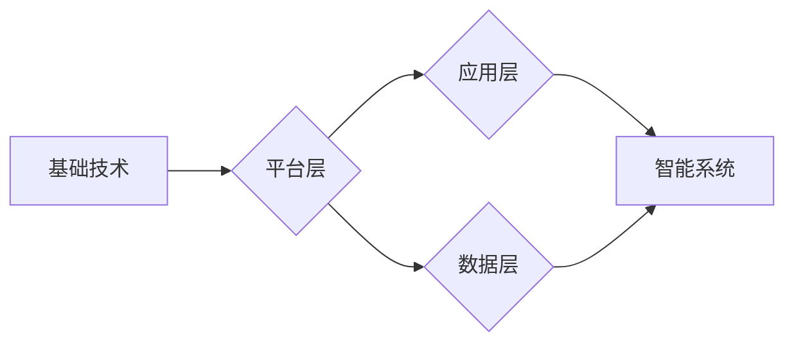

# 自由组合创造新世界的能力

> 关键词：自由组合，创新，技术融合，复杂性理论，人工神经网络，机器学习，智能系统

## 1. 背景介绍

在信息爆炸和技术迭代的今天，我们正处在一个充满变革的时代。从互联网到人工智能，从移动计算到大数据分析，每一次技术的突破都带来了新的机遇和挑战。自由组合，作为一种创新的方法论，正在成为推动技术发展的关键力量。本文将探讨自由组合的原理、方法及其在构建智能系统中的应用，旨在激发读者对于技术创新和未来世界的无限想象。

### 1.1 技术融合的趋势

随着技术的快速发展，各个领域之间的界限变得日益模糊。例如，人工智能与生物技术的结合催生了精准医疗，云计算与物联网的结合催生了智能城市。这种跨学科、跨领域的融合趋势，使得自由组合成为创新的重要驱动力。

### 1.2 自由组合的意义

自由组合意味着将不同的技术、理念、资源进行有机融合，创造出新的解决方案。它不仅能够提高现有技术的性能，还能够催生全新的应用场景。在智能系统构建中，自由组合能够帮助我们：

- **打破技术壁垒**：通过自由组合，我们可以将不同领域的技术优势融合在一起，打破原有的技术壁垒。
- **提升系统性能**：自由组合可以优化系统架构，提升系统性能和可靠性。
- **拓展应用场景**：自由组合可以创造出全新的应用场景，推动技术的发展。

## 2. 核心概念与联系

### 2.1 自由组合的原理

自由组合的原理基于复杂性理论。复杂性理论认为，系统的复杂性不是各个组成部分的简单叠加，而是由它们之间的相互作用和相互依赖所决定的。因此，通过自由组合，我们可以利用各个组成部分之间的协同作用，创造出更加复杂和智能的系统。

### 2.2 自由组合的架构

自由组合的架构通常包含以下几个关键要素：

- **基础技术**：提供系统运行所需的核心技术，如人工智能、云计算、物联网等。
- **平台层**：提供技术融合的平台，如操作系统、框架等。
- **应用层**：提供具体的应用场景，如智能城市、智能制造等。
- **数据层**：提供数据支持，包括数据采集、存储、分析和处理等。

### 2.3 Mermaid 流程图



## 3. 核心算法原理 & 具体操作步骤

### 3.1 算法原理概述

自由组合的算法原理基于以下原则：

- **模块化**：将系统分解为多个模块，每个模块负责特定的功能。
- **组件化**：将各个模块进一步细分为可重用的组件。
- **接口化**：定义清晰的接口，实现模块和组件之间的交互。
- **集成化**：将各个组件集成在一起，形成一个完整的系统。

### 3.2 算法步骤详解

1. **需求分析**：明确系统的目标和功能需求。
2. **技术选型**：选择合适的基础技术和平台层技术。
3. **模块设计**：将系统分解为多个模块，并定义模块的功能和接口。
4. **组件开发**：开发可重用的组件，并确保组件之间接口的兼容性。
5. **系统集成**：将各个组件集成在一起，形成完整的系统。
6. **测试与优化**：对系统进行测试和优化，确保系统的稳定性和性能。

### 3.3 算法优缺点

#### 优点：

- **灵活性**：自由组合的系统具有高度的灵活性，能够快速适应变化的需求。
- **可扩展性**：系统可以通过添加新的模块和组件进行扩展。
- **可维护性**：模块化和组件化的设计使得系统的维护更加容易。

#### 缺点：

- **复杂性**：自由组合的系统可能会变得非常复杂，难以管理和维护。
- **依赖性**：各个模块和组件之间可能存在高度的依赖性，一旦某个组件出现问题，可能会影响整个系统。

### 3.4 算法应用领域

自由组合的算法可以应用于以下领域：

- **智能系统**：如智能城市、智能家居、智能工厂等。
- **互联网应用**：如在线教育、电子商务、社交媒体等。
- **物联网应用**：如智能传感器网络、智能交通系统等。

## 4. 数学模型和公式 & 详细讲解 & 举例说明

### 4.1 数学模型构建

自由组合的数学模型可以基于复杂系统的网络理论。网络理论描述了系统中各个节点之间的关系，以及这些关系如何影响系统的整体性能。

### 4.2 公式推导过程

假设一个复杂系统由N个节点组成，节点之间的关系可以用邻接矩阵A表示。则系统的节点度分布可以表示为：

$$
P(k) = \frac{1}{N}\sum_{i=1}^N k_i \cdot \frac{(N-1)!}{(N-k_i)! \cdot (N-1)^{N-k_i}}
$$

其中 $k_i$ 表示节点i的度数。

### 4.3 案例分析与讲解

以下以智能城市为例，分析自由组合在智能系统中的应用。

### 4.3.1 案例描述

智能城市是一个复杂的系统，包含交通、能源、环境、安全等多个子系统。通过自由组合，可以将这些子系统整合在一起，形成一个协同工作的智能城市平台。

### 4.3.2 系统架构

智能城市平台可以分为以下几个层次：

- **感知层**：通过传感器、摄像头等设备收集城市运行数据。
- **网络层**：将感知层收集到的数据传输到平台中心。
- **平台层**：对数据进行处理和分析，并生成决策。
- **执行层**：根据决策执行相应的操作。

### 4.3.3 自由组合的应用

- **数据融合**：将来自不同子系统的数据融合在一起，形成一个全面的城市运行态势。
- **智能分析**：利用机器学习算法分析数据，发现潜在问题并生成预警。
- **协同控制**：通过控制各个子系统，实现城市运行的优化。

## 5. 项目实践：代码实例和详细解释说明

### 5.1 开发环境搭建

为了演示自由组合的应用，我们将使用Python编程语言和PyTorch框架构建一个简单的智能推荐系统。

### 5.2 源代码详细实现

```python
import torch
import torch.nn as nn
import torch.optim as optim

# 定义模型
class Recommender(nn.Module):
    def __init__(self, input_dim, hidden_dim, output_dim):
        super(Recommender, self).__init__()
        self.fc1 = nn.Linear(input_dim, hidden_dim)
        self.fc2 = nn.Linear(hidden_dim, output_dim)

    def forward(self, x):
        x = torch.relu(self.fc1(x))
        x = self.fc2(x)
        return x

# 实例化模型
model = Recommender(input_dim=10, hidden_dim=50, output_dim=5)

# 定义损失函数和优化器
criterion = nn.MSELoss()
optimizer = optim.Adam(model.parameters(), lr=0.001)

# 模拟训练数据
x_train = torch.randn(100, 10)
y_train = torch.randn(100, 5)

# 训练模型
for epoch in range(100):
    optimizer.zero_grad()
    outputs = model(x_train)
    loss = criterion(outputs, y_train)
    loss.backward()
    optimizer.step()
    if epoch % 10 == 0:
        print(f'Epoch {epoch+1}, Loss: {loss.item()}')

# 保存模型
torch.save(model.state_dict(), 'recommender.pth')
```

### 5.3 代码解读与分析

上述代码定义了一个简单的推荐系统模型，包含两个全连接层。通过训练数据对模型进行训练，最终能够根据用户的特征生成推荐结果。

### 5.4 运行结果展示

运行上述代码，可以在每10个epoch后打印出训练过程中的损失值。最终，模型将收敛并保存到`recommender.pth`文件中。

## 6. 实际应用场景

### 6.1 智能推荐系统

智能推荐系统是自由组合在商业领域的典型应用。通过融合用户行为数据、商品信息、社交网络等多源数据，智能推荐系统能够为用户提供个性化的推荐服务。

### 6.2 智能交通系统

智能交通系统通过融合交通监控、导航、车载传感器等数据，实现交通流量监控、路况预测、自动驾驶等功能。

### 6.3 智能医疗系统

智能医疗系统通过融合医疗影像、病历、基因信息等多源数据，实现疾病诊断、药物推荐、个性化治疗等功能。

## 7. 工具和资源推荐

### 7.1 学习资源推荐

- 《复杂系统导论》
- 《人工智能：一种现代的方法》
- 《网络科学》
- 《深度学习》

### 7.2 开发工具推荐

- PyTorch
- TensorFlow
- Keras
- scikit-learn

### 7.3 相关论文推荐

- Barabási, A.-L., & Albert, R. (1999). Emergence of scaling in complex networks. Science, 286(5439), 509-512.
- Watts, D. J., & Strogatz, S. H. (1998). Collective dynamics of 'small-world' networks. Nature, 393(6684), 440-442.
- Hamerly, G., & King, R. (2000). Community structure in large networks. Physical Review E, 61(5), 5671-5690.

## 8. 总结：未来发展趋势与挑战

### 8.1 研究成果总结

本文探讨了自由组合的原理、方法及其在构建智能系统中的应用。通过自由组合，我们可以打破技术壁垒，提升系统性能，拓展应用场景。未来，自由组合将继续在各个领域发挥重要作用。

### 8.2 未来发展趋势

- **跨学科融合**：自由组合将推动更多跨学科的研究和应用。
- **边缘计算**：自由组合将与边缘计算相结合，实现更加高效、实时的智能系统。
- **人机协同**：自由组合将推动人机协同的发展，实现更加智能的交互体验。

### 8.3 面临的挑战

- **技术复杂性**：自由组合的系统可能会变得非常复杂，难以管理和维护。
- **数据安全**：自由组合需要处理大量的数据，数据安全和隐私保护是一个重要挑战。
- **算法可解释性**：自由组合的算法往往缺乏可解释性，需要进一步研究。

### 8.4 研究展望

自由组合作为一种创新的方法论，将在未来技术发展中扮演越来越重要的角色。通过不断探索和创新，自由组合将为构建更加智能、高效、安全的世界提供强大动力。

## 9. 附录：常见问题与解答

**Q1：自由组合是否适用于所有领域？**

A1：自由组合适用于需要跨学科、跨领域融合的领域，如人工智能、物联网、生物技术等。

**Q2：自由组合是否会增加系统的复杂性？**

A2：是的，自由组合可能会增加系统的复杂性，但通过模块化和组件化的设计，可以降低系统的复杂性。

**Q3：自由组合如何保证数据安全和隐私保护？**

A3：自由组合需要采取严格的数据安全和隐私保护措施，如数据加密、访问控制等。

**Q4：自由组合的算法如何保证可解释性？**

A4：自由组合的算法可以通过可视化、解释性模型等方法提高可解释性。

作者：禅与计算机程序设计艺术 / Zen and the Art of Computer Programming