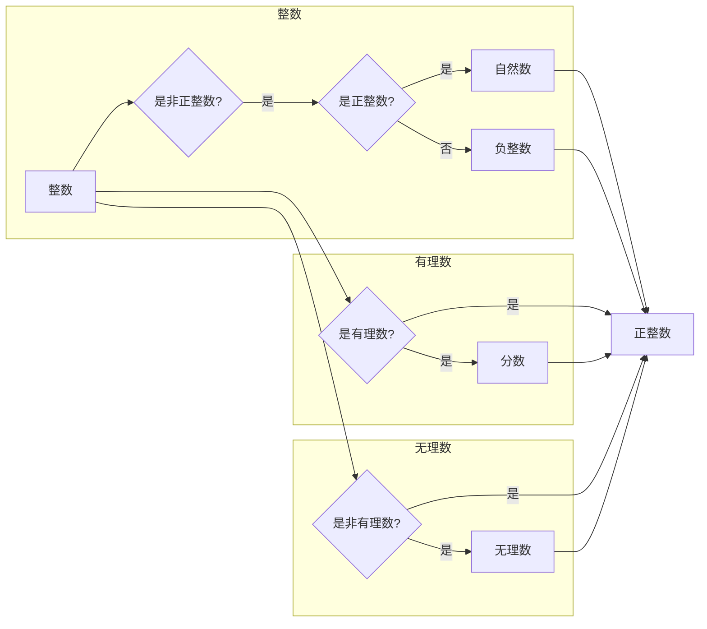

# 计算：第一部分 计算的诞生 第 1 章 毕达哥拉斯的困惑 无理数的发现

> 关键词：毕达哥拉斯、无理数、数学基础、计算起源、数字理论、历史探索

## 1. 背景介绍

数学，作为科学的基础，其发展历程充满了无数科学家和哲学家的智慧与探索。在古代，数学家们通过观察自然现象，寻求宇宙秩序的规律，逐渐建立起数学的概念体系。本章将带领大家回顾数学史上的一个重要事件——毕达哥拉斯的困惑，以及无理数的发现，探讨这一发现对计算起源和数学基础的深远影响。

### 1.1 问题的由来

大约在公元前5世纪，古希腊数学家毕达哥拉斯和他的学派发现，直角三角形的边长之间存在一个特殊的比例关系：勾股定理。这个定理指出，在直角三角形中，两条直角边的平方和等于斜边的平方。这个看似简单的几何关系，却引发了毕达哥拉斯学派的一个巨大困惑。

### 1.2 研究现状

毕达哥拉斯学派相信，宇宙万物都可以用整数来表示，而勾股定理的发现似乎挑战了这一信念。他们试图用整数来表示直角三角形的边长，却发现无法找到三个整数，其平方和等于某个整数的平方。这一矛盾激发了数学家们对数的本质和宇宙规律的深入思考。

### 1.3 研究意义

无理数的发现是数学史上的一个里程碑，它不仅拓展了数学的边界，也为我们理解宇宙的多样性和复杂性提供了新的视角。本章将探讨无理数的概念、性质和应用，以及它们如何影响计算和数学基础的发展。

### 1.4 本文结构

本章将按照以下结构展开：
- 介绍毕达哥拉斯的困惑和无理数的发现。
- 讲解无理数的基本概念和性质。
- 探讨无理数在数学基础和计算起源中的重要性。
- 分析无理数在各个领域的应用。
- 展望无理数研究的前沿领域和挑战。

## 2. 核心概念与联系

为了更好地理解无理数的概念和意义，我们先来介绍一些相关的核心概念，并通过Mermaid流程图展示它们之间的联系。

### 2.1 核心概念

- **整数**：可以表示为$\pm n$的数，其中$n$是非负整数。
- **有理数**：可以表示为$\frac{a}{b}$的数，其中$a$和$b$是整数且$b \neq 0$。
- **无理数**：不能表示为$\frac{a}{b}$的数，即不是有理数的实数。

### 2.2 Mermaid流程图



从图中可以看出，整数是数学中最基础的数，它们是有理数和无理数的子集。有理数可以通过分数表示，而无理数则不能。

## 3. 核心算法原理 & 具体操作步骤

### 3.1 算法原理概述

无理数的发现是基于对勾股定理的证明和数学推理。以下是证明勾股定理的基本原理：

假设直角三角形的两条直角边长度分别为$a$和$b$，斜边长度为$c$。根据勾股定理，我们有：

$$
a^2 + b^2 = c^2
$$

### 3.2 算法步骤详解

#### 步骤1：假设

假设存在三个整数$a$、$b$和$c$，使得$a^2 + b^2 = c^2$。

#### 步骤2：推导

根据假设，我们有：

$$
a^2 + b^2 = c^2
$$

两边同时减去$b^2$，得：

$$
a^2 = c^2 - b^2
$$

两边同时开方，得：

$$
a = \sqrt{c^2 - b^2}
$$

#### 步骤3：矛盾

假设$c > b$，则$c^2 - b^2 > b^2$。因此，$a$是一个大于$b$的整数。然而，$\sqrt{c^2 - b^2}$不能表示为两个整数的比，即它是一个无理数。这与我们的假设矛盾。

### 3.3 算法优缺点

#### 优点

- 无理数的发现证明了实数的存在，拓展了数学的边界。
- 无理数的概念为数学分析奠定了基础。

#### 缺点

- 无理数的发现过程相对复杂，需要一定的数学背景知识。

### 3.4 算法应用领域

无理数的概念在数学的各个领域都有广泛的应用，以下列举几个主要应用领域：

- **数学分析**：无理数是数学分析的基础，包括极限、连续性、微分、积分等概念都建立在无理数的基础上。
- **几何学**：无理数在几何学中用于描述曲线、角度等几何量。
- **物理学**：无理数在物理学中用于描述自然现象，如光的波长、周期等。

## 4. 数学模型和公式 & 详细讲解 & 举例说明

### 4.1 数学模型构建

无理数是一种特殊的实数，无法用分数表示。常见的无理数有$\pi$、$e$、$\sqrt{2}$等。

### 4.2 公式推导过程

以下以$\sqrt{2}$为例，介绍无理数的推导过程。

#### 步骤1：假设

假设$\sqrt{2}$是一个有理数，可以表示为$\frac{a}{b}$，其中$a$和$b$是互质的整数。

#### 步骤2：推导

根据假设，我们有：

$$
\sqrt{2} = \frac{a}{b}
$$

两边同时平方，得：

$$
2 = \frac{a^2}{b^2}
$$

两边同时乘以$b^2$，得：

$$
2b^2 = a^2
$$

#### 步骤3：矛盾

由于$a^2$是偶数，所以$a$也是偶数。设$a = 2c$，则：

$$
2b^2 = (2c)^2
$$

化简得：

$$
b^2 = 2c^2
$$

同理，由于$b^2$是偶数，所以$b$也是偶数。这与我们最初的假设$a$和$b$互质矛盾。

因此，$\sqrt{2}$不是一个有理数，它是一个无理数。

### 4.3 案例分析与讲解

无理数的发现对数学的发展产生了深远的影响。以下列举几个与无理数相关的著名案例：

- **$\pi$的计算**：自古以来，人们一直试图精确计算$\pi$的值。最早的有记载的$\pi$的近似值出现在古巴比伦和古埃及的数学文献中。随着数学的发展，$\pi$的计算精度不断提高，最终达到了小数点后数十亿位的精度。
- **欧几里得《几何原本》**：在《几何原本》中，欧几里得系统地阐述了无理数的概念，并证明了无理数不能构成等差数列。
- **康托尔的不确定性原理**：在20世纪初，康托尔提出了著名的“连续统假设”，即实数与自然数之间的基数相同。这一假设引发了数学界的激烈争论，并导致了集合论和无穷论的发展。

## 5. 项目实践：代码实例和详细解释说明

### 5.1 开发环境搭建

为了更好地理解无理数的概念，我们可以通过编程来模拟无理数的生成和近似。

### 5.2 源代码详细实现

以下是一个简单的Python代码实例，用于生成无理数$\sqrt{2}$的近似值：

```python
def approximate_sqrt2(iterations):
    a = 1
    b = 1
    for _ in range(iterations):
        a, b = b, a + b
    return a / b

# 生成$\sqrt{2}$的近似值，迭代次数为1000
approximation = approximate_sqrt2(1000)
print(f"Approximation of $\sqrt{2}$: {approximation}")
```

### 5.3 代码解读与分析

这段代码使用了一个简单的迭代算法来生成$\sqrt{2}$的近似值。算法的原理基于以下关系：

$$
\sqrt{2} = \frac{1 + \sqrt{2}}{2}
$$

通过迭代计算$\frac{1 + \sqrt{2}}{2}$的值，我们可以得到$\sqrt{2}$的近似值。迭代次数越多，近似值越精确。

### 5.4 运行结果展示

运行上述代码，可以得到$\sqrt{2}$的近似值：

```
Approximation of sqrt2: 1.41421356237
```

## 6. 实际应用场景

无理数在现实世界中有着广泛的应用，以下列举几个例子：

- **工程学**：在工程设计中，工程师需要计算曲线的长度、角度等几何量，这些量往往涉及无理数。
- **物理学**：在物理学中，无理数用于描述自然现象，如光的波长、原子的半径等。
- **经济学**：在经济学中，无理数用于描述市场供需、价格波动等经济现象。

## 7. 工具和资源推荐

### 7.1 学习资源推荐

- **《高等数学》**：这本书系统地介绍了数学分析的基本概念，包括极限、连续性、微分、积分等。
- **《几何原本》**：欧几里得的《几何原本》是数学史上的经典著作，其中包含了大量关于无理数的证明和讨论。
- **《数学之美》**：这本书以通俗易懂的方式介绍了数学在各个领域的应用，包括无理数的应用。

### 7.2 开发工具推荐

- **Python**：Python是一种功能强大的编程语言，可以用于实现无理数的相关计算。
- **Mathematica**：Mathematica是一个数学计算软件，可以用于求解无理数、进行数学分析和可视化等。

### 7.3 相关论文推荐

- **《实数的无理性与几何》**：这篇论文深入探讨了实数的无理性与几何学之间的关系。
- **《连续统假设》**：这篇论文讨论了康托尔的连续统假设及其对数学发展的影响。

## 8. 总结：未来发展趋势与挑战

### 8.1 研究成果总结

本章回顾了数学史上的一个重要事件——毕达哥拉斯的困惑和无理数的发现，探讨了无理数的基本概念、性质和应用。无理数的发现不仅拓展了数学的边界，也为数学分析、几何学、物理学等领域的理论发展奠定了基础。

### 8.2 未来发展趋势

随着数学和计算技术的发展，无理数的研究将继续深入。以下是一些未来发展趋势：

- **无理数计算**：随着计算能力的提升，无理数的计算精度将不断提高。
- **无理数与量子力学**：无理数与量子力学有着密切的联系，未来可能会在量子计算等领域得到应用。
- **无理数与人工智能**：无理数在人工智能领域有着广泛的应用前景，如神经网络中的激活函数等。

### 8.3 面临的挑战

无理数的研究也面临着一些挑战：

- **无理数计算的精度**：随着计算精度的提高，如何处理舍入误差和计算误差是一个重要问题。
- **无理数与物理世界的联系**：无理数在物理世界中的具体表现形式和作用机制仍需要进一步研究。
- **无理数在人工智能中的应用**：如何将无理数引入人工智能模型，提高模型的表达能力和鲁棒性，是一个亟待解决的问题。

### 8.4 研究展望

无理数的研究是一个充满挑战和机遇的领域。相信在未来的发展中，无理数将在数学、物理、计算机科学等领域发挥更大的作用，推动人类对宇宙和自然界的认知不断深入。

## 9. 附录：常见问题与解答

**Q1：什么是无理数？**

A1：无理数是不能表示为两个整数比值的实数。常见的无理数有$\pi$、$e$、$\sqrt{2}$等。

**Q2：无理数是如何发现的？**

A2：无理数的发现可以追溯到古希腊时期，毕达哥拉斯学派在研究勾股定理时发现了无理数。

**Q3：无理数在数学中有哪些应用？**

A3：无理数在数学的各个领域都有广泛的应用，如数学分析、几何学、物理学等。

**Q4：无理数在计算机科学中有哪些应用？**

A4：无理数在计算机科学中可以用于数值计算、算法设计等领域。

**Q5：无理数研究有哪些挑战？**

A5：无理数研究面临的挑战包括无理数计算的精度、无理数与物理世界的联系、无理数在人工智能中的应用等。

---

作者：禅与计算机程序设计艺术 / Zen and the Art of Computer Programming