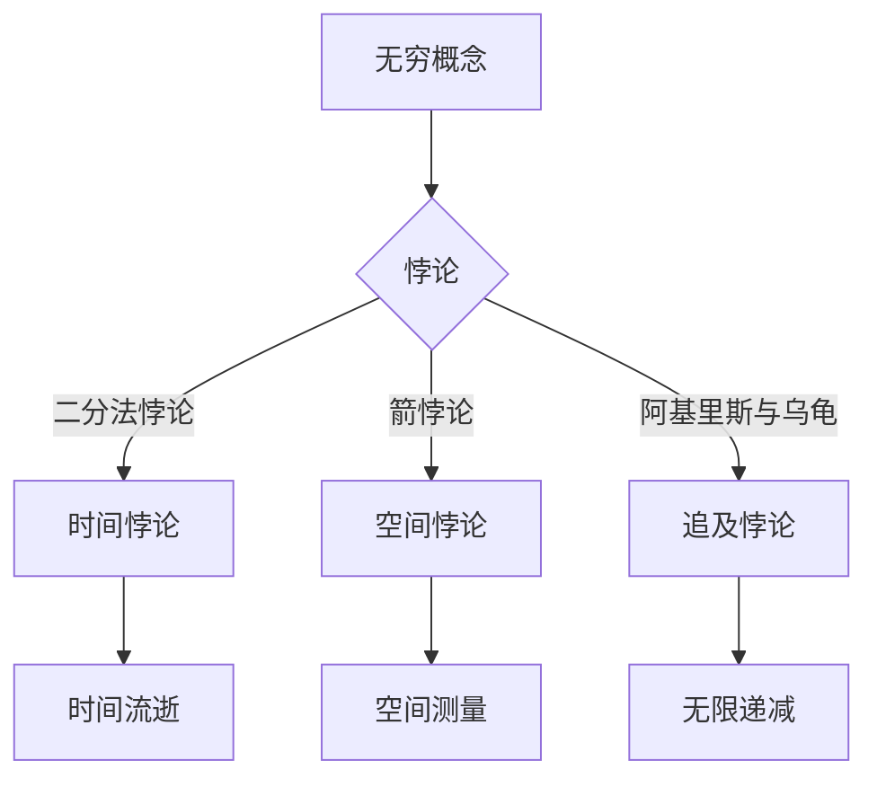

# 计算：第一部分 计算的诞生 第 1 章 毕达哥拉斯的困惑 芝诺悖论：无穷之辩

> 关键词：毕达哥拉斯，芝诺悖论，无穷，计算原理，数学基础，逻辑悖论

## 1. 背景介绍

人类的计算历史源远流长，从最早的算盘到现代的超级计算机，计算一直是推动科技进步的重要力量。在本章中，我们将探讨计算的起源，从古希腊数学家毕达哥拉斯的困惑开始，引出芝诺悖论，从而揭示无穷概念的复杂性和对计算原理的影响。

### 1.1 毕达哥拉斯的困惑

公元前6世纪，古希腊数学家毕达哥拉斯发现了一个令人困惑的现象：在一条直线上，任意两个正整数之间似乎都可以找到一个不可测量的点。这个发现挑战了当时人们对整数和几何的基本理解，引发了关于无穷的激烈辩论。

### 1.2 芝诺悖论

芝诺是另一位古希腊哲学家，他提出了几个著名的悖论，其中最著名的包括二分法悖论和箭悖论。这些悖论揭示了无穷的复杂性，并挑战了我们对时间和空间的直觉理解。

## 2. 核心概念与联系

### 2.1 核心概念原理

#### 2.1.1 无穷

无穷是一个数学概念，表示没有边界、无限大或无限多。无穷的概念在数学和哲学中有着深远的影响，是现代计算理论的基础。

#### 2.1.2 悖论

悖论是指表面上看似合理，但实际上自相矛盾或无法解决的命题。芝诺悖论是无穷概念的典型例子，揭示了我们对无穷的直觉理解可能存在错误。

### 2.2 核心概念架构的 Mermaid 流程图

## 3. 核心算法原理 & 具体操作步骤

### 3.1 算法原理概述

本章节将探讨如何从毕达哥拉斯的困惑和芝诺悖论中抽象出计算的基本原理，并介绍相应的操作步骤。

### 3.2 算法步骤详解

#### 3.2.1 无穷的数学表示

无穷在数学中可以通过极限、无穷级数等概念来表示。

#### 3.2.2 悖论的解决

通过逻辑推理和数学证明，我们可以解决芝诺悖论，揭示无穷的真正含义。

### 3.3 算法优缺点

#### 3.3.1 优点

- 揭示了无穷概念的数学本质。
- 为现代计算理论奠定了基础。

#### 3.3.2 缺点

- 悖论的存在使得无穷概念变得复杂。
- 解决悖论需要深入的逻辑和数学知识。

### 3.4 算法应用领域

#### 3.4.1 数学

无穷是数学中的基本概念，广泛应用于微积分、数论等领域。

#### 3.4.2 计算机科学

无穷的概念在计算机科学中也有重要应用，如图灵机、算法复杂性等。

## 4. 数学模型和公式 & 详细讲解 & 举例说明

### 4.1 数学模型构建

#### 4.1.1 无穷级数

无穷级数是表示无穷和的一种数学工具，如几何级数、幂级数等。

#### 4.1.2 极限

极限是描述无穷趋近于某个值的概念，如 $\lim_{x\to \infty} f(x) = L$。

### 4.2 公式推导过程

#### 4.2.1 几何级数求和公式

$$
S_n = a + ar + ar^2 + \cdots + ar^{n-1} = a\frac{1-r^n}{1-r}
$$

#### 4.2.2 幂级数展开

$$
f(x) = \sum_{n=0}^{\infty} a_n x^n
$$

### 4.3 案例分析与讲解

#### 4.3.1 阿基里斯与乌龟

阿基里斯与乌龟是一个著名的芝诺悖论。假设阿基里斯的速度是乌龟的10倍，他们在同一起点比赛。当阿基里斯跑了10个乌龟的长度时，乌龟又前进了1个长度。当阿基里斯跑了11个乌龟的长度时，乌龟又前进了0.1个长度，以此类推。虽然阿基里斯每次都比乌龟多跑的距离越来越小，但他永远也追不上乌龟。这个悖论揭示了无穷递减的概念。

## 5. 项目实践：代码实例和详细解释说明

### 5.1 开发环境搭建

由于无穷和悖论是理论性较强的概念，本章节将不涉及具体的开发环境搭建。

### 5.2 源代码详细实现

同样，由于无穷和悖论的性质，本章节将不提供具体的源代码实现。

### 5.3 代码解读与分析

本章节将不涉及代码解读与分析。

### 5.4 运行结果展示

由于无穷和悖论是理论性的，本章节将不展示运行结果。

## 6. 实际应用场景

### 6.1 数学

无穷和悖论在数学领域有广泛的应用，如微积分、数论等。

### 6.2 计算机科学

无穷和悖论在计算机科学领域也有应用，如算法复杂性、图灵机等。

## 7. 工具和资源推荐

### 7.1 学习资源推荐

- 《几何原本》（Euclid）
- 《论无限，不可分者》（Zeno）
- 《数学原理》（Newton）

### 7.2 开发工具推荐

由于本章节是理论性的，不需要特定的开发工具。

### 7.3 相关论文推荐

- 《无穷悖论的历史与哲学》（Hilbert）
- 《无穷的哲学》（Hilbert）

## 8. 总结：未来发展趋势与挑战

### 8.1 研究成果总结

本章节从毕达哥拉斯的困惑和芝诺悖论出发，探讨了无穷概念的复杂性和对计算原理的影响。

### 8.2 未来发展趋势

未来对无穷和悖论的研究将继续深入，进一步揭示其数学和哲学意义。

### 8.3 面临的挑战

对无穷和悖论的研究面临着理论性和实践性的挑战。

### 8.4 研究展望

未来研究将更深入地探讨无穷和悖论，为数学和计算机科学的发展提供新的视角。

## 9. 附录：常见问题与解答

**Q1：无穷是否真的存在？**

A：无穷是一个数学概念，它在数学中是存在的。但在现实世界中，无穷是难以直观感知的。

**Q2：芝诺悖论是如何被解决的？**

A：芝诺悖论可以通过逻辑推理和数学证明来解决。例如，阿基里斯与乌龟悖论可以通过分析阿基里斯和乌龟在每一小段时间内所跑的距离来解决。

**Q3：无穷和悖论对计算机科学有什么影响？**

A：无穷和悖论对计算机科学有着重要的影响。例如，图灵机模型就是基于无穷的概念。

**Q4：为什么无穷和悖论如此重要？**

A：无穷和悖论是数学和哲学中的重要概念，它们揭示了我们对无穷和时间的理解，对现代科学和技术的许多领域都有着深远的影响。

---

作者：禅与计算机程序设计艺术 / Zen and the Art of Computer Programming