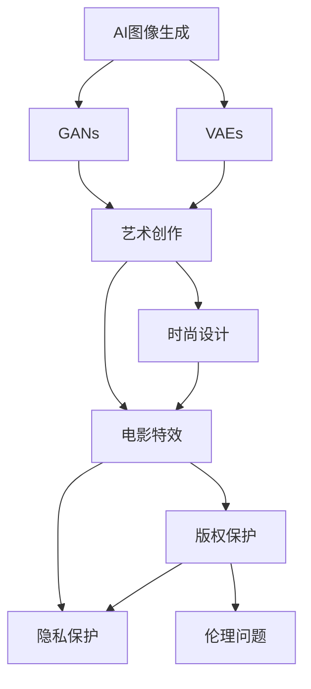

                 

# AI图像生成对创意产业的影响

## 1. 背景介绍

### 1.1 问题由来

随着人工智能技术的飞速发展，AI图像生成已经成为创意产业中一个极具影响力的工具。无论是艺术创作、时尚设计，还是电影特效、视频游戏，AI图像生成技术的应用都极大地提升了效率和创意，开辟了新的艺术表现形式和产业模式。然而，这种技术的兴起也引发了一系列新的问题与挑战，如版权、伦理、隐私、虚假信息等。本文将深入探讨AI图像生成技术对创意产业的影响，并从多角度分析其带来的机遇与挑战。

### 1.2 问题核心关键点

1. **技术原理**：AI图像生成技术通过深度学习模型，尤其是生成对抗网络（GANs）和变分自编码器（VAEs），可以自动生成高质量的图像，包括艺术作品、广告设计、商品图像等。
2. **应用场景**：从艺术创作到电影特效，再到时尚设计、产品包装，AI图像生成技术已经深入创意产业的各个角落。
3. **产业影响**：AI图像生成不仅提高了创意产业的效率和创新能力，还对传统产业模式、版权保护、职业伦理等方面产生了深远影响。
4. **道德与伦理问题**：AI生成图像的原创性、版权归属、个人隐私保护等道德与伦理问题亟待解决。

## 2. 核心概念与联系

### 2.1 核心概念概述

1. **AI图像生成**：使用深度学习技术，特别是GANs和VAEs，自动生成逼真图像的过程。
2. **GANs（生成对抗网络）**：由生成器和判别器两个网络组成，通过对抗训练，生成器不断优化生成图像质量，判别器不断提升识别真实与假想的图像的能力。
3. **VAEs（变分自编码器）**：通过学习数据的概率分布，生成与训练数据相符的新图像。
4. **艺术创作**：包括绘画、雕塑、摄影等多种形式，AI技术在其中提供了新的创作手段。
5. **时尚设计**：通过生成时尚图像，AI帮助设计师快速迭代设计方案。
6. **电影特效**：用于自动生成逼真场景，如云雾、火焰等，提升制作效率和视觉效果。
7. **版权保护**：AI生成图像的原创性问题，涉及到对传统版权法的挑战。
8. **隐私保护**：生成的图像可能包含个人隐私信息，需要制定相应的保护措施。
9. **伦理问题**：AI生成的图像可能传播虚假信息，或被用于不当目的，如深度伪造。

这些概念之间的联系可以通过以下Mermaid流程图来展示：



这个流程图展示了AI图像生成技术的核心概念及其与创意产业各领域的联系。

### 2.2 概念间的关系

1. **技术关系**：GANs和VAEs是AI图像生成的主要技术手段，各自有着不同的生成原理和应用场景。
2. **产业关系**：AI图像生成技术在艺术创作、时尚设计、电影特效等领域都有应用，提升了创意产业的生产效率和创意水平。
3. **法律关系**：AI生成图像的版权归属问题，需要与现有版权法进行对接和调整。
4. **道德伦理关系**：AI生成图像可能带来的隐私泄露、虚假信息等问题，需要考虑伦理规范和法律法规的约束。

## 3. 核心算法原理 & 具体操作步骤

### 3.1 算法原理概述

AI图像生成算法主要基于生成对抗网络（GANs）和变分自编码器（VAEs）。GANs通过两个网络（生成器和判别器）的对抗训练，生成逼真的图像。VAEs通过学习数据的概率分布，生成新的图像。这些算法通常采用神经网络作为基础模型，通过大量标注数据的训练，生成高质量的图像。

### 3.2 算法步骤详解

1. **数据准备**：收集大量高质量的图像数据，如艺术作品、时尚图像、电影场景等。
2. **模型训练**：使用GANs或VAEs对收集的数据进行训练，生成新的图像。
3. **验证与调整**：在训练过程中不断验证生成图像的质量，根据需要进行参数调整。
4. **应用部署**：将训练好的模型部署到实际应用中，进行图像生成。
5. **监控优化**：持续监控生成图像的质量，定期更新模型参数，保持高水平性能。

### 3.3 算法优缺点

**优点**：
1. **高效性**：自动化图像生成过程，显著提高创意产业的工作效率。
2. **多样性**：生成多样化的图像，帮助设计师和艺术家进行创意表达。
3. **创新性**：突破传统创作模式，激发新的艺术表现形式和产业模式。

**缺点**：
1. **质量依赖**：生成图像的质量受限于训练数据，需要大量高质量数据。
2. **版权问题**：AI生成的图像是否具有原创性，版权归属问题尚未有定论。
3. **伦理风险**：生成的图像可能包含虚假信息，或被用于不当目的，如深度伪造。

### 3.4 算法应用领域

AI图像生成技术已经广泛应用于多个领域，包括：
1. **艺术创作**：自动生成绘画、雕塑、摄影作品等。
2. **时尚设计**：自动生成时尚图像，帮助设计师进行设计迭代。
3. **电影特效**：自动生成逼真场景，提升电影制作效率和视觉效果。
4. **广告设计**：自动生成广告图像，提升广告创意水平和点击率。
5. **商品包装**：自动生成商品图像，提升产品展示效果。

## 4. 数学模型和公式 & 详细讲解

### 4.1 数学模型构建

假设我们有一个包含$m$个样本、每个样本为$d$维的图像数据集$D=\{x_i\}_{i=1}^m$，其中$x_i \in \mathbb{R}^d$。GANs的目标是学习一个生成器$G$，将随机噪声$z \in \mathbb{R}^k$映射为逼真图像$G(z)$。判别器$D$的目标是将生成图像和真实图像区分开来，$D(x)$表示$x$为真实图像的概率，$D(G(z))$表示$G(z)$为真实图像的概率。GANs的训练目标是最大化生成器的生成质量，最小化判别器的识别能力。

### 4.2 公式推导过程

GANs的训练过程可以表示为以下优化问题：
$$
\min_G \max_D V(D,G) = \min_G \max_D \mathbb{E}_{x \sim D}[\log D(x)] + \mathbb{E}_{z \sim P(z)}[\log(1-D(G(z)))]
$$
其中$V(D,G)$是生成对抗网络的目标函数，$P(z)$是随机噪声的分布。

将上述目标函数分解为两个子问题：
1. **最大化判别器**：
$$
\max_D \mathbb{E}_{x \sim D}[\log D(x)] + \mathbb{E}_{z \sim P(z)}[\log(1-D(G(z))]
$$
2. **最小化生成器**：
$$
\min_G \mathbb{E}_{x \sim D}[\log(1-D(x))] + \mathbb{E}_{z \sim P(z)}[\log D(G(z))]
$$

判别器的优化目标可以表示为：
$$
\max_D \log D(x) + \log(1-D(G(z)))
$$
生成器的优化目标可以表示为：
$$
\min_G \log(1-D(x)) + \log D(G(z))
$$

### 4.3 案例分析与讲解

以电影特效中的云雾生成为例，我们可以使用GANs生成逼真的云雾效果。首先，收集大量云雾图像数据，将其作为训练集。然后，使用GANs模型学习生成云雾图像的规则，并进行优化。最后，在实际应用中，输入随机噪声作为生成器的输入，输出逼真的云雾图像。

## 5. 项目实践：代码实例和详细解释说明

### 5.1 开发环境搭建

1. 安装Python环境：
```bash
pip install python
```
2. 安装TensorFlow和Keras：
```bash
pip install tensorflow keras
```
3. 安装必要的库：
```bash
pip install numpy matplotlib scikit-image
```

### 5.2 源代码详细实现

以下是一个使用Keras实现GANs的基本框架：

```python
import tensorflow as tf
from tensorflow.keras.layers import Input, Dense, Reshape, Flatten
from tensorflow.keras.models import Model

# 定义生成器
def build_generator():
    input_latent = Input(shape=(100,))
    x = Dense(256)(input_latent)
    x = LeakyReLU(alpha=0.2)(x)
    x = Dense(512)(x)
    x = LeakyReLU(alpha=0.2)(x)
    x = Dense(1024)(x)
    x = LeakyReLU(alpha=0.2)(x)
    x = Dense(784)(x)
    x = Reshape((28, 28, 1))(x)
    return Model(input_latent, x)

# 定义判别器
def build_discriminator():
    input_img = Input(shape=(28, 28, 1))
    x = Flatten()(input_img)
    x = Dense(1024)(x)
    x = LeakyReLU(alpha=0.2)(x)
    x = Dense(512)(x)
    x = LeakyReLU(alpha=0.2)(x)
    x = Dense(256)(x)
    x = LeakyReLU(alpha=0.2)(x)
    x = Dense(1, activation='sigmoid')(x)
    return Model(input_img, x)

# 定义完整的GANs模型
def build_gan(generator, discriminator):
    discriminator.trainable = False
    combined = discriminator(generator(input_latent))
    return Model(input_latent, combined)

# 定义损失函数
def adversarial_loss(fake_output):
    return -tf.reduce_mean(discriminator(fake_output))
```

### 5.3 代码解读与分析

**生成器**：
1. 输入随机噪声$z$，通过多个全连接层和激活函数，生成28x28x1的图像。
2. 激活函数使用LeakyReLU，以解决梯度消失问题。

**判别器**：
1. 输入图像$x$，通过多个全连接层和激活函数，输出一个0-1的判别结果。
2. 同样使用LeakyReLU激活函数。

**GANs模型**：
1. 判别器不训练，直接将生成器的输出作为输入。
2. 使用交叉熵损失函数计算损失。

### 5.4 运行结果展示

使用上述代码，我们训练GANs模型生成手写数字图像，并可视化结果：

```python
from keras.datasets import mnist
from keras.utils import to_categorical

# 加载MNIST数据集
(x_train, _), (x_test, _) = mnist.load_data()

# 数据预处理
x_train = x_train.reshape(x_train.shape[0], 28, 28, 1).astype('float32') / 255
x_test = x_test.reshape(x_test.shape[0], 28, 28, 1).astype('float32') / 255

# 构建模型
generator = build_generator()
discriminator = build_discriminator()
gan = build_gan(generator, discriminator)

# 训练模型
# ...

# 生成图像
random_latent = np.random.normal(size=(1, 100))
fake_images = generator.predict(random_latent)
plt.imshow(fake_images[0].reshape(28, 28))
plt.show()
```

## 6. 实际应用场景

### 6.1 创意产业的应用

1. **艺术创作**：
   - **数字艺术**：使用GANs自动生成数字艺术作品，如抽象画、插画等。
   - **摄影创作**：生成逼真场景和人物，为摄影作品提供创意背景。

2. **时尚设计**：
   - **设计灵感**：生成时尚图像，为设计师提供灵感。
   - **智能辅助设计**：将生成图像作为设计方案的一部分，帮助设计师快速迭代。

3. **电影特效**：
   - **自然场景生成**：自动生成逼真自然场景，如云雾、森林、山脉等。
   - **角色特效**：自动生成逼真角色，如动物、怪物等，提升视觉效果。

### 6.2 未来应用展望

1. **个性化定制**：
   - **个性化艺术**：根据用户偏好生成定制化艺术作品。
   - **个性化设计**：生成用户满意的时尚设计方案。

2. **虚拟现实**：
   - **虚拟世界**：生成逼真虚拟场景，提升用户体验。
   - **虚拟角色**：生成逼真虚拟角色，丰富虚拟世界的内容。

3. **智能交互**：
   - **虚拟助手**：生成逼真虚拟助手，提升用户体验。
   - **虚拟客服**：生成逼真虚拟客服，提供高效服务。

## 7. 工具和资源推荐

### 7.1 学习资源推荐

1. **深度学习入门**：
   - 《深度学习》课程，斯坦福大学提供的免费视频和讲义。
   - 《Deep Learning with Python》一书，适合初学者。

2. **图像生成技术**：
   - 《Generative Adversarial Networks with TensorFlow 2》一书，详细讲解GANs和VAEs。
   - 《Deep Learning for Computer Vision》一书，讲解图像生成技术在计算机视觉中的应用。

3. **开源资源**：
   - GitHub上的GANs和VAEs代码库，如TensorFlow GANs、Keras GANs等。

### 7.2 开发工具推荐

1. **深度学习框架**：
   - TensorFlow：功能强大的深度学习框架，支持GPU加速。
   - Keras：易于使用的深度学习框架，适合初学者。

2. **可视化工具**：
   - TensorBoard：可视化深度学习模型的训练过程。
   - Visdom：可视化深度学习模型的结果。

3. **项目管理工具**：
   - Jupyter Notebook：交互式Python环境，适合实验和协作。

### 7.3 相关论文推荐

1. **GANs的原理**：
   - Ian Goodfellow, Jean Pouget-Abadie, and Aaron Courville. "Generative Adversarial Nets." Advances in Neural Information Processing Systems 26, 2014.

2. **VAEs的原理**：
   - Diederik P. Kingma and Max Welling. "Auto-Encoding Variational Bayes." International Conference on Learning Representations, 2014.

3. **深度伪造研究**：
   - Ian J. Goodfellow, Jonathan Shlens, and Christian Szegedy. "Explaining and Harnessing Adversarial Examples." International Conference on Learning Representations, 2015.

## 8. 总结：未来发展趋势与挑战

### 8.1 研究成果总结

AI图像生成技术已经展示了其在创意产业中的巨大潜力，提升了生产效率和创意水平。但是，其应用也引发了版权、伦理、隐私等新问题。未来，需要在技术、法律、伦理等多个方面进行深入研究，推动AI图像生成技术的健康发展。

### 8.2 未来发展趋势

1. **技术进步**：
   - **模型优化**：通过更先进的深度学习模型和算法，提升图像生成的质量。
   - **多模态融合**：结合图像、语音、文本等多模态数据，生成更丰富、更逼真的图像。

2. **产业应用**：
   - **创意产业**：拓展AI图像生成技术在艺术、设计、影视等领域的应用。
   - **个性化定制**：实现根据用户偏好生成个性化艺术作品和设计方案。

3. **法律规范**：
   - **版权保护**：制定相应的法律法规，保护AI生成图像的版权。
   - **伦理约束**：建立伦理规范，防止AI生成图像的滥用。

### 8.3 面临的挑战

1. **质量提升**：
   - **数据依赖**：需要更多高质量、多样化的数据。
   - **算法优化**：需要优化模型结构，提升生成图像的质量。

2. **版权争议**：
   - **原创性问题**：AI生成图像是否具有原创性，版权归属问题亟待解决。
   - **法律问题**：现有版权法难以覆盖AI生成图像的版权保护。

3. **伦理风险**：
   - **隐私保护**：生成的图像可能包含个人隐私信息，需要制定保护措施。
   - **虚假信息**：生成的图像可能传播虚假信息，需要建立监管机制。

### 8.4 研究展望

未来，需要在技术、法律、伦理等多个方面进行深入研究，推动AI图像生成技术的健康发展。具体研究方向包括：
1. **高质量数据获取**：开发更多高质量、多样化的数据集，用于训练和评估AI图像生成模型。
2. **算法优化**：优化模型结构，提升生成图像的质量，减少对训练数据的依赖。
3. **法律规范**：制定相应的法律法规，保护AI生成图像的版权，同时建立伦理规范，防止滥用。
4. **技术伦理**：结合技术进步和伦理约束，推动AI图像生成技术的发展，确保其健康应用。

## 9. 附录：常见问题与解答

**Q1: AI图像生成技术是否会取代人类艺术家？**

A: AI图像生成技术能够提升艺术创作效率，但不会完全取代人类艺术家。艺术创作需要深厚的情感和独特的视角，AI无法完全替代。

**Q2: 如何保护AI生成图像的版权？**

A: 需要制定相应的法律法规，明确AI生成图像的版权归属。同时，可以通过区块链等技术，记录生成过程，确保版权保护的透明性和可信度。

**Q3: 如何防止AI生成图像的滥用？**

A: 建立伦理规范，明确AI生成图像的使用范围和目的。同时，加强监管和审核，防止虚假信息和有害内容的传播。

**Q4: 如何提升AI图像生成的质量？**

A: 需要更多高质量、多样化的数据，同时优化模型结构，提升生成图像的质量。此外，结合多模态数据，提高生成图像的丰富性和逼真度。

**Q5: 如何应对AI图像生成的伦理风险？**

A: 需要建立伦理规范，明确AI生成图像的使用范围和目的。同时，加强监管和审核，防止虚假信息和有害内容的传播。

---

作者：禅与计算机程序设计艺术 / Zen and the Art of Computer Programming

