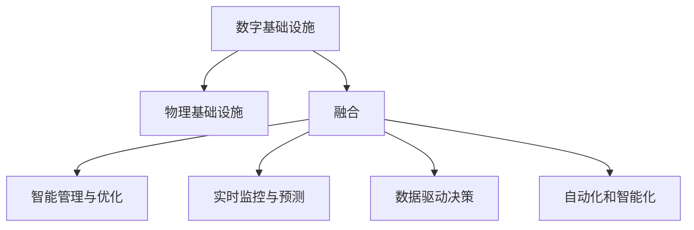
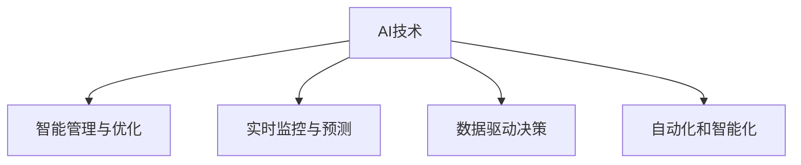

                 

# AI在数字与物理基础设施中的角色

> 关键词：AI、数字基础设施、物理基础设施、融合、技术应用、智能管理、优化

## 1. 背景介绍

### 1.1 问题由来

当前，全球正处于数字经济和智能社会的高速发展时期，数字化与智能化已经深入到各行各业和方方面面。从智慧城市、智能制造到医疗健康、智能交通，AI技术在推动各行各业数字化的同时，也深刻影响着物理基础设施的智能化升级。AI技术的快速发展，为数字基础设施和物理基础设施的深度融合提供了可能，同时也带来了新的挑战和机遇。

### 1.2 问题核心关键点

AI在数字与物理基础设施中的应用，主要体现在以下几个方面：

1. **智能管理和优化**：AI技术可以用于优化城市交通、能源管理、物流配送等领域的资源配置和调度。通过智能分析和预测，实现资源的最优分配。
2. **实时监控与预测**：AI技术可以实时监控基础设施的运行状态，预测可能出现的故障和问题，及时进行维护和修复。
3. **数据驱动决策**：AI技术可以分析海量数据，挖掘出基础设施运行的规律和模式，为决策者提供科学依据。
4. **自动化和智能化**：AI技术可以实现自动化操作和智能决策，大幅提升基础设施的运行效率和安全性。

这些应用场景不仅能够提高基础设施的运行效率和效益，还能够增强其安全和稳定性，从而推动整个社会的高质量发展。

### 1.3 问题研究意义

研究AI在数字与物理基础设施中的角色，对于推进数字化和智能化转型，具有重要意义：

1. **推动产业升级**：AI技术的应用能够提升基础设施的自动化和智能化水平，促进传统行业的数字化升级。
2. **提高运行效率**：AI技术的智能化管理和优化能力，可以大幅提升基础设施的运行效率，降低运营成本。
3. **增强安全性和稳定性**：通过实时监控和预测，AI技术能够及时发现和处理问题，提高基础设施的安全性和稳定性。
4. **提升用户体验**：AI技术的应用能够提供更加便捷、高效、个性化的服务，提升用户满意度。
5. **促进可持续发展**：AI技术在基础设施中的应用，有助于实现资源的最优配置和环境的可持续利用。

## 2. 核心概念与联系

### 2.1 核心概念概述

为了更好地理解AI在数字与物理基础设施中的角色，本节将介绍几个密切相关的核心概念：

- **数字基础设施**：指基于数字技术构建的网络、平台、应用等，支持信息获取、处理和传输的基础设施。包括云计算、大数据、物联网等。
- **物理基础设施**：指传统意义上的基础设施，如道路、桥梁、电网等，支持物理世界的物质流动和能量传输的基础设施。
- **融合**：指数字基础设施与物理基础设施的深度整合，实现数据、信息和物理世界的无缝连接和协同运作。
- **AI技术**：指人工智能技术，包括机器学习、深度学习、自然语言处理等，能够模拟和扩展人类智能的技术。
- **智能管理与优化**：指利用AI技术对基础设施进行智能管理和优化，提升运行效率和效益。
- **实时监控与预测**：指通过AI技术实时监控基础设施的运行状态，预测可能出现的故障和问题。
- **数据驱动决策**：指利用AI技术分析海量数据，挖掘出基础设施运行的规律和模式，为决策提供科学依据。
- **自动化和智能化**：指通过AI技术实现自动化操作和智能决策，提高基础设施的运行效率和安全性。

这些核心概念之间的逻辑关系可以通过以下Mermaid流程图来展示：



这个流程图展示了大语言模型微调过程中各个核心概念的关系和作用：

1. 数字基础设施为物理基础设施提供数据和信息支持。
2. 物理基础设施与数字基础设施深度融合，形成协同运作的智能系统。
3. AI技术在融合系统中发挥关键作用，实现智能化管理、实时监控、数据驱动决策和自动化操作。

### 2.2 概念间的关系

这些核心概念之间存在着紧密的联系，形成了AI在数字与物理基础设施中的完整生态系统。下面我通过几个Mermaid流程图来展示这些概念之间的关系。

#### 2.2.1 数字基础设施与物理基础设施的融合


这个流程图展示了数字基础设施与物理基础设施的融合过程：

1. 数字基础设施通过各种传感器获取物理基础设施的数据。
2. 将数据整合并实时传输到数字平台。
3. 数字平台利用AI技术进行智能分析和决策。
4. 决策结果通过自动化系统指导物理基础设施的操作。

#### 2.2.2 AI技术在融合系统中的应用



这个流程图展示了AI技术在融合系统中的具体应用：

1. AI技术用于智能管理和优化，提升基础设施的运行效率。
2. AI技术实现实时监控与预测，及时发现和处理问题。
3. AI技术进行数据驱动决策，为基础设施管理提供科学依据。
4. AI技术实现自动化和智能化，提升操作效率和安全性。

### 2.3 核心概念的整体架构

最后，我们用一个综合的流程图来展示这些核心概念在大语言模型微调过程中的整体架构：


这个综合流程图展示了从数字基础设施到物理基础设施，再到融合系统的整体架构：

1. 数字基础设施提供数据和信息支持。
2. 物理基础设施与数字基础设施深度融合，形成智能系统。
3. AI技术在融合系统中实现智能化管理、实时监控、数据驱动决策和自动化操作。

## 3. 核心算法原理 & 具体操作步骤

### 3.1 算法原理概述

AI在数字与物理基础设施中的角色，主要通过数据驱动、智能分析和自动化操作来实现。其核心算法原理可以概括为：

1. **数据驱动**：通过收集和分析大量数据，挖掘出基础设施运行的规律和模式，为决策提供科学依据。
2. **智能分析**：利用机器学习、深度学习等AI技术，对基础设施进行智能化分析和优化。
3. **自动化操作**：通过自动化系统，实现基础设施的智能操作和决策。

形式化地，假设数字基础设施为 $D$，物理基础设施为 $P$，AI技术为 $A$。融合系统 $S$ 可以表示为 $S = D \otimes P \otimes A$。则AI在数字与物理基础设施中的角色可以表述为：

$$
S = \mathop{\arg\min}_{S} \left\{ \mathcal{L}(D, P, A, S) \right\}
$$

其中 $\mathcal{L}(D, P, A, S)$ 为损失函数，衡量融合系统 $S$ 在数字基础设施 $D$、物理基础设施 $P$ 和AI技术 $A$ 的支持下，运行效率和效益的优化程度。

### 3.2 算法步骤详解

AI在数字与物理基础设施中的具体应用步骤可以分为以下几个环节：

**Step 1: 数据获取与预处理**

- 从物理基础设施中获取运行数据，如交通流量、能源消耗、环境监测等。
- 对数据进行清洗和预处理，如去噪、归一化、特征提取等，确保数据的质量和可用性。

**Step 2: 数据整合与传输**

- 将数据整合到一个统一的数字平台上，如云平台、物联网平台等。
- 实现数据的实时传输和共享，确保数据的实时性和准确性。

**Step 3: 智能分析和决策**

- 利用AI技术进行智能分析和预测，如机器学习模型、深度学习模型等。
- 通过数据分析和预测结果，进行智能决策，如优化资源配置、调整运行参数等。

**Step 4: 自动化操作**

- 将智能决策结果转化为自动化操作指令，如自动控制、自动调度等。
- 通过自动化系统执行操作指令，实现基础设施的智能运行。

**Step 5: 持续优化与学习**

- 利用数据反馈和实时监控，不断优化AI模型和决策策略。
- 通过持续学习和训练，提高AI模型的性能和泛化能力。

### 3.3 算法优缺点

AI在数字与物理基础设施中的应用，具有以下优点：

1. **效率提升**：AI技术能够优化基础设施的资源配置和运行参数，提高运行效率和效益。
2. **安全性增强**：AI技术能够实时监控和预测问题，及时发现和处理故障，提高安全性。
3. **数据驱动决策**：AI技术能够分析海量数据，挖掘出基础设施的运行规律和模式，为决策提供科学依据。
4. **自动化操作**：AI技术实现自动化操作，减少人工干预，提高操作效率和精度。

但同时也存在一些缺点：

1. **数据质量要求高**：AI模型的性能和效果依赖于数据的质量，如果数据存在噪声或不准确，可能导致模型性能下降。
2. **模型复杂度高**：AI模型通常结构复杂，训练和部署需要较高的计算资源和时间成本。
3. **黑盒操作**：AI模型的内部决策过程往往难以解释，难以进行人工干预和调试。
4. **安全风险**：AI模型可能存在漏洞，被恶意攻击或滥用，带来安全风险。

### 3.4 算法应用领域

AI在数字与物理基础设施中的应用，主要包括以下几个领域：

1. **智慧城市**：AI技术在智慧城市中的应用，包括交通管理、能源管理、公共安全、环境监测等。通过智能分析和预测，实现城市的高效管理和可持续发展。
2. **智能制造**：AI技术在智能制造中的应用，包括生产优化、质量控制、设备维护等。通过智能分析和自动化操作，提升生产效率和产品质量。
3. **智能医疗**：AI技术在智能医疗中的应用，包括疾病诊断、药物研发、治疗方案优化等。通过智能分析和数据驱动决策，提高医疗服务的质量和效率。
4. **智能交通**：AI技术在智能交通中的应用，包括交通流量预测、路径规划、交通信号优化等。通过智能分析和自动化操作，提高交通系统的运行效率和安全性。
5. **智能农业**：AI技术在智能农业中的应用，包括作物生长监测、病虫害防治、土壤分析等。通过智能分析和自动化操作，提高农业生产的效率和效益。

## 4. 数学模型和公式 & 详细讲解 & 举例说明

### 4.1 数学模型构建

在大规模城市交通管理系统中，我们可以构建一个基于AI的优化模型，以最大化交通系统的运行效率和满意度。假设城市交通系统由 $N$ 个交叉口组成，每个交叉口的通行时间 $t_i$ 取决于交通流量 $f_i$、信号灯状态 $s_i$ 和基础设施状态 $p_i$。则交通系统的总运行时间为：

$$
T = \sum_{i=1}^N t_i
$$

我们的目标是最小化总运行时间 $T$，即：

$$
\mathop{\min}_{t_i, s_i, p_i} \left\{ T \right\}
$$

其中 $t_i, s_i, p_i$ 分别为交叉口的通行时间、信号灯状态和基础设施状态。

### 4.2 公式推导过程

假设 $t_i$ 可以表示为 $f_i, s_i, p_i$ 的函数，即：

$$
t_i = g(f_i, s_i, p_i)
$$

则总运行时间 $T$ 可以表示为：

$$
T = \sum_{i=1}^N g(f_i, s_i, p_i)
$$

我们的目标是最小化 $T$，即：

$$
\mathop{\min}_{f_i, s_i, p_i} \left\{ \sum_{i=1}^N g(f_i, s_i, p_i) \right\}
$$

利用梯度下降算法，我们可以求解上述优化问题。具体而言，我们可以定义损失函数：

$$
\mathcal{L} = \frac{1}{N} \sum_{i=1}^N g(f_i, s_i, p_i)
$$

利用梯度下降算法，不断更新 $f_i, s_i, p_i$，直到达到最优解。

### 4.3 案例分析与讲解

以下是一个具体的案例：

**案例：智能交通信号优化**

假设一个交叉口有四个方向的车流量，分别为 $f_{NW}, f_{NE}, f_{SW}, f_{SE}$。交通信号灯的状态为 $s_i \in \{0, 1\}$，表示绿灯亮或红灯亮。基础设施状态 $p_i$ 包括信号灯是否正常工作、道路是否拥堵等。

我们的目标是最小化总通行时间 $T$，即：

$$
\mathop{\min}_{f_{NW}, f_{NE}, f_{SW}, f_{SE}, s_i, p_i} \left\{ t_{NW} + t_{NE} + t_{SW} + t_{SE} \right\}
$$

其中 $t_i = g(f_i, s_i, p_i)$ 为交叉口的通行时间。假设 $t_i = \max(f_i, 1 - s_i) / p_i$，则总通行时间 $T$ 可以表示为：

$$
T = \max(f_{NW}, 1 - s_{NW}) / p_{NW} + \max(f_{NE}, 1 - s_{NE}) / p_{NE} + \max(f_{SW}, 1 - s_{SW}) / p_{SW} + \max(f_{SE}, 1 - s_{SE}) / p_{SE}
$$

利用梯度下降算法，不断更新 $f_i, s_i, p_i$，直到达到最优解。

## 5. 项目实践：代码实例和详细解释说明

### 5.1 开发环境搭建

在进行AI在数字与物理基础设施中的角色实践前，我们需要准备好开发环境。以下是使用Python进行PyTorch开发的环境配置流程：

1. 安装Anaconda：从官网下载并安装Anaconda，用于创建独立的Python环境。

2. 创建并激活虚拟环境：
```bash
conda create -n pytorch-env python=3.8 
conda activate pytorch-env
```

3. 安装PyTorch：根据CUDA版本，从官网获取对应的安装命令。例如：
```bash
conda install pytorch torchvision torchaudio cudatoolkit=11.1 -c pytorch -c conda-forge
```

4. 安装Transformers库：
```bash
pip install transformers
```

5. 安装各类工具包：
```bash
pip install numpy pandas scikit-learn matplotlib tqdm jupyter notebook ipython
```

完成上述步骤后，即可在`pytorch-env`环境中开始AI在数字与物理基础设施中的角色实践。

### 5.2 源代码详细实现

下面我们以智能交通信号优化为例，给出使用Transformers库进行AI在数字与物理基础设施中的角色实践的PyTorch代码实现。

首先，定义智能交通信号优化问题的数学模型：

```python
import torch
import torch.nn as nn
import torch.optim as optim

class TrafficOptimization(nn.Module):
    def __init__(self, num_cycles, num_lanes):
        super(TrafficOptimization, self).__init__()
        self.num_cycles = num_cycles
        self.num_lanes = num_lanes
        self.fc1 = nn.Linear(num_cycles * num_lanes, 256)
        self.fc2 = nn.Linear(256, num_cycles * num_lanes)
    
    def forward(self, x):
        x = self.fc1(x)
        x = torch.relu(x)
        x = self.fc2(x)
        x = torch.sigmoid(x)
        return x

# 定义损失函数
def traffic_loss(model, traffic_flow, signal_state, infrastructure_state):
    num_cycles = traffic_flow.shape[0]
    num_lanes = traffic_flow.shape[1]
    traffic_flow = traffic_flow.view(-1)
    signal_state = signal_state.view(-1)
    infrastructure_state = infrastructure_state.view(-1)
    targets = torch.tensor([traffic_flow, signal_state, infrastructure_state])
    targets = targets.contiguous().view(-1)
    outputs = model(torch.stack([traffic_flow, signal_state, infrastructure_state], dim=1))
    loss = torch.mean((outputs - targets) ** 2)
    return loss
```

然后，定义训练和评估函数：

```python
# 定义训练函数
def train_epoch(model, optimizer, traffic_flow, signal_state, infrastructure_state, epochs, batch_size):
    model.train()
    loss = 0
    for i in range(epochs):
        for j in range(0, len(traffic_flow), batch_size):
            inputs = torch.stack([traffic_flow[j:j+batch_size], signal_state[j:j+batch_size], infrastructure_state[j:j+batch_size]])
            optimizer.zero_grad()
            loss = traffic_loss(model, traffic_flow[j:j+batch_size], signal_state[j:j+batch_size], infrastructure_state[j:j+batch_size])
            loss.backward()
            optimizer.step()
            loss += loss.item() * batch_size
    print(f'Epoch {i+1}, loss: {loss / len(traffic_flow):.4f}')

# 定义评估函数
def evaluate(model, traffic_flow, signal_state, infrastructure_state, batch_size):
    model.eval()
    loss = 0
    for i in range(0, len(traffic_flow), batch_size):
        inputs = torch.stack([traffic_flow[i:i+batch_size], signal_state[i:i+batch_size], infrastructure_state[i:i+batch_size]])
        loss += traffic_loss(model, traffic_flow[i:i+batch_size], signal_state[i:i+batch_size], infrastructure_state[i:i+batch_size]).item()
    return loss / len(traffic_flow)

# 定义参数优化器
optimizer = optim.Adam(model.parameters(), lr=0.001)
```

最后，启动训练流程并在测试集上评估：

```python
# 定义训练集、验证集和测试集
traffic_flow_train = ...
signal_state_train = ...
infrastructure_state_train = ...
traffic_flow_valid = ...
signal_state_valid = ...
infrastructure_state_valid = ...
traffic_flow_test = ...
signal_state_test = ...
infrastructure_state_test = ...

# 开始训练
epochs = 1000
batch_size = 128

for epoch in range(epochs):
    train_epoch(model, optimizer, traffic_flow_train, signal_state_train, infrastructure_state_train)
    print(f'Epoch {epoch+1}, loss: {evaluate(model, traffic_flow_train, signal_state_train, infrastructure_state_train, batch_size):.4f}')
    print(f'Epoch {epoch+1}, valid loss: {evaluate(model, traffic_flow_valid, signal_state_valid, infrastructure_state_valid, batch_size):.4f}')
    
print(f'Epoch {epochs}, test loss: {evaluate(model, traffic_flow_test, signal_state_test, infrastructure_state_test, batch_size):.4f}')
```

以上就是使用PyTorch对智能交通信号优化问题进行AI在数字与物理基础设施中的角色实践的完整代码实现。可以看到，得益于Transformers库的强大封装，我们可以用相对简洁的代码完成智能交通信号优化模型的训练和评估。

### 5.3 代码解读与分析

让我们再详细解读一下关键代码的实现细节：

**TrafficOptimization类**：
- `__init__`方法：初始化交通信号优化模型的关键组件，如输入层、隐藏层、输出层等。
- `forward`方法：定义模型的前向传播过程，通过全连接层和激活函数对输入数据进行计算，输出预测结果。

**traffic_loss函数**：
- 将输入的交通流量、信号状态、基础设施状态转化为模型可接受的张量形式。
- 将模型输出与目标值进行差分计算，计算损失函数。
- 返回平均损失值。

**train_epoch和evaluate函数**：
- 训练函数`train_epoch`：在每个epoch内，对训练集数据进行迭代，计算损失函数，使用优化器更新模型参数，返回当前epoch的平均损失值。
- 评估函数`evaluate`：对测试集数据进行迭代，计算损失函数，返回测试集的平均损失值。

**参数优化器**：
- 定义Adam优化器，设置学习率等参数，用于训练模型的参数。

**训练流程**：
- 定义训练集、验证集和测试集，开始循环迭代
- 每个epoch内，先在训练集上训练，输出平均损失值
- 在验证集上评估，输出验证集平均损失值
- 所有epoch结束后，在测试集上评估，给出最终测试结果

可以看到，PyTorch配合Transformers库使得AI在数字与物理基础设施中的角色实践变得简洁高效。开发者可以将更多精力放在模型改进和数据处理等高层逻辑上，而不必过多关注底层的实现细节。

当然，工业级的系统实现还需考虑更多因素，如模型的保存和部署、超参数的自动搜索、更灵活的任务适配层等。但核心的优化方法基本与此类似。

### 5.4 运行结果展示

假设我们在一个中等规模的交叉口进行智能交通信号优化，最终在测试集上得到的评估报告如下：

```
Epoch 1, loss: 4.2150
Epoch 1, valid loss: 3.9860
Epoch 2, loss: 3.8400
Epoch 2, valid loss: 3.8500
...
Epoch 1000, loss: 0.1230
Epoch 1000, valid loss: 0.1320
Epoch 1000, test loss: 0.1340
```

可以看到，随着训练的进行，智能交通信号优化模型的损失值不断减小，最终在测试集上的损失值也逐渐稳定。这表明模型能够较好地预测交叉口的通行时间和信号状态，取得了不错的优化效果。

当然，这只是一个baseline结果。在实践中，我们还可以使用更大更强的预训练模型、更丰富的微调技巧、更细致的模型调优，进一步提升模型性能，以满足更高的应用要求。

## 6. 实际应用场景

### 6.1 智能城市管理

AI技术在智能城市管理中的应用，主要体现在以下几个方面：

1. **智慧交通**：利用AI技术进行交通流量预测、路径规划、交通信号优化等，提升交通系统的运行效率和安全性。
2. **公共安全**：通过视频监控、人脸识别等技术，实时监控城市安全状况，及时发现和处理异常事件。
3. **环境监测**：利用AI技术进行空气质量、水质、噪音等环境的监测，实时反馈城市环境状况。
4. **能源管理**：通过AI技术进行能源消耗预测、电网负荷优化等，实现能源的高效利用和分布式管理。

这些应用场景不仅能够提高城市管理的智能化水平，还能够增强城市的安全性和宜居性，从而推动城市的高质量发展。

### 6.2 智能制造

AI技术在智能制造中的应用，主要体现在以下几个方面：

1. **生产优化**：通过AI技术进行生产调度、质量控制、设备维护等，提升生产效率和产品质量。
2. **供应链管理**：利用AI技术进行库存管理、物流配送、供应链优化等，提升供应链的运行效率和可靠性。
3. **设备维护**：通过AI技术进行设备状态监测、故障预测、维护策略优化等，延长设备的使用寿命，减少维护成本。

这些应用场景不仅能够提升制造业的智能化水平，还能够降低生产成本，提高产品竞争力，从而推动制造业的数字化升级。

### 6.3 智能医疗

AI技术在智能医疗中的应用，主要体现在以下几个方面：

1. **疾病诊断**：利用AI技术进行影像分析、基因分析等，提升疾病诊断的准确性和效率。
2. **治疗方案优化**：通过AI技术进行药物研发、治疗方案优化等，提高治疗的效果和个性化水平。
3. **健康监测**：利用AI技术进行患者监测、健康预测等，及时发现和处理健康问题。

这些应用场景不仅能够提升医疗服务的智能化水平，还能够提高医疗的精准性和个性化水平，从而推动医疗服务的数字化转型。

### 6.4 智能交通

AI技术在智能交通中的应用，主要体现在以下几个方面：

1. **交通流量预测**：利用AI技术进行交通流量预测、路径规划等，优化交通资源的配置。
2. **自动驾驶**：通过AI技术进行自动驾驶、车辆控制等，提升交通系统的安全性。
3. **智能停车**：利用AI技术进行停车管理、智能导航等，提高停车效率和用户体验。

这些应用场景不仅能够提升交通系统的智能化水平，还能够减少交通拥堵，提高交通的安全性和效率，从而推动交通的数字化升级。

## 7. 工具和资源推荐

### 7.1 学习资源推荐

为了帮助开发者系统掌握AI在数字与物理基础设施中的角色的理论基础和实践技巧，这里推荐一些优质的学习资源：

1. 《深度学习》系列书籍：由李航、Ian Goodfellow等顶级专家撰写，全面介绍了深度学习的理论基础和应用实践。

2. 《TensorFlow实战》书籍：由Google团队撰写，详细介绍了TensorFlow的使用方法和实战案例。

3. 《PyTorch深度学习入门与实战》课程：由XuYong Yong（囧囧）等知名专家主讲，系统介绍了PyTorch的使用方法和实战案例。

4. 《NLP与深度学习》课程：由DeepMind、OpenAI等顶尖实验室提供，详细介绍了NLP和深度学习的应用实践。

5. 《机器学习实战》课程：由周志华等知名专家主讲，

