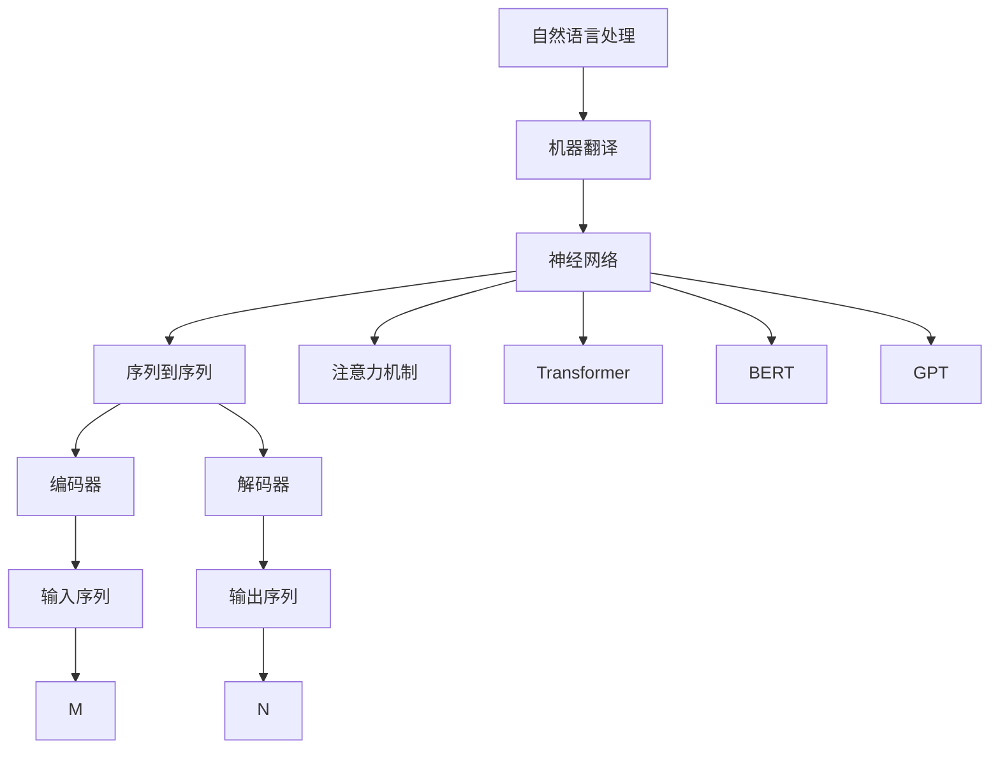
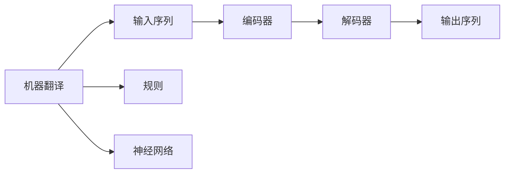
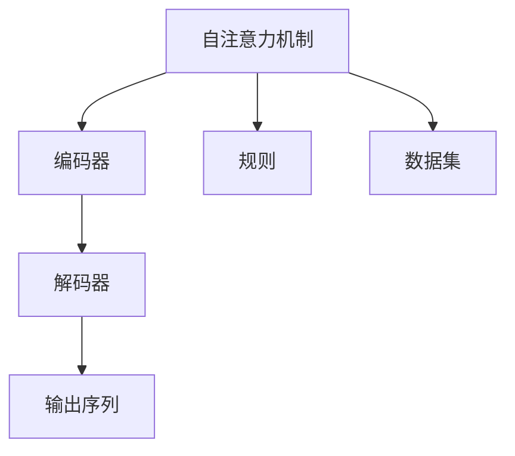
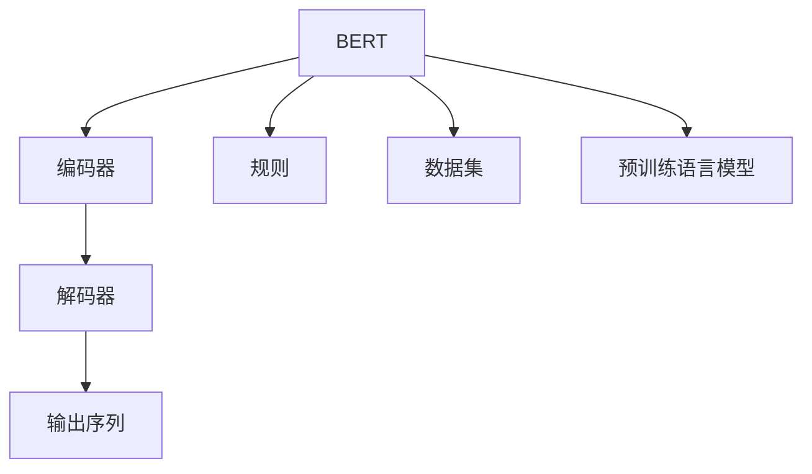
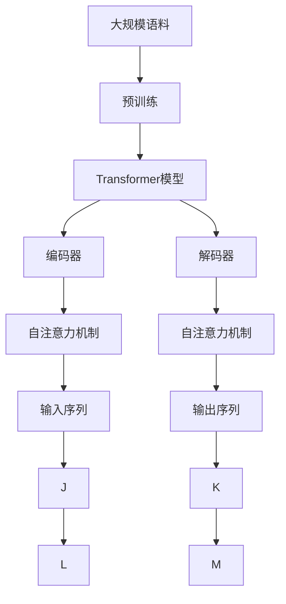

                 

# AI在语言翻译中的应用:突破语言障碍

> 关键词：自然语言处理(NLP), 机器翻译(MT), 神经网络(ANN), 序列到序列(Seq2Seq), 注意力机制(Attention), Transformer, BERT, GPT

## 1. 背景介绍

### 1.1 问题由来

在当今全球化日益深入的世界中，语言翻译已成为沟通交流、国际贸易、文化交流的重要工具。然而，语言的复杂性和多样性，使得人工翻译面临巨大的工作量和成本压力。面对这个挑战，人工智能（AI）尤其是机器翻译（Machine Translation, MT）技术应运而生，利用自然语言处理（Natural Language Processing, NLP）技术和机器学习算法，实现自动化的翻译服务。

### 1.2 问题核心关键点

机器翻译的核心在于如何将一种语言映射到另一种语言，同时保留原文的意义和语境。早期的机器翻译主要依赖于规则驱动的符号匹配，但这些方法难以处理复杂的语言现象，如多义词、长句、歧义等。后来，随着统计机器翻译和神经网络机器翻译（Neural Machine Translation, NMT）的兴起，翻译效果得到了显著提升。特别是基于Transformer的神经网络机器翻译，成为了当前翻译技术的主流。

Transformer架构通过自注意力机制，捕捉输入和输出序列之间的复杂关系，能够更好地处理长距离依赖和语义信息，大幅提升了翻译质量。同时，Transformer模型还具有并行处理的能力，加速了训练和推理过程。

### 1.3 问题研究意义

研究机器翻译技术，对于加速语言交流、促进国际贸易、推动文化多样性等具有重要意义：

1. **降低成本和时间**：机器翻译能够大幅度减少人工翻译的投入，特别是在高频需求的场合，如商务会议、国际合作等，可以极大地提升效率。
2. **提升翻译质量**：现代机器翻译技术在多种语言和领域上已达接近甚至超越人工翻译的水平，为语言服务的普及和高质量应用提供了可能。
3. **推动创新和研究**：机器翻译技术不断突破，催生了诸多前沿研究方向，如零样本翻译、低资源语言翻译、交互式翻译等，为NLP研究带来新的思路和工具。
4. **促进全球化进程**：机器翻译技术为各国人民的交流提供了便利，有助于打破语言壁垒，推动全球化发展。

## 2. 核心概念与联系

### 2.1 核心概念概述

为更好地理解机器翻译的原理和应用，本节将介绍几个关键概念：

- 机器翻译(Machine Translation, MT)：利用计算机算法将一种语言的文本自动翻译成另一种语言的文本。
- 自然语言处理(Natural Language Processing, NLP)：研究如何让计算机理解和生成自然语言，是机器翻译的基础。
- 神经网络(Neural Network, ANN)：一种模拟人脑神经元工作的计算模型，用于处理和分析数据。
- 序列到序列(Sequence to Sequence, Seq2Seq)：一种常用的机器翻译模型，通过编码器-解码器结构，实现序列到序列的映射。
- 注意力机制(Attention Mechanism)：一种用于处理序列间复杂关系的技术，允许模型在翻译过程中动态地关注输入和输出序列的关键部分。
- Transformer：一种基于自注意力机制的神经网络架构，在机器翻译中表现优异。
- BERT: Bidirectional Encoder Representations from Transformers，一种预训练语言模型，用于提升机器翻译的效果。
- GPT: Generative Pre-trained Transformer，一种基于Transformer的预训练语言模型，用于生成高质量的翻译结果。

这些核心概念之间的逻辑关系可以通过以下Mermaid流程图来展示：



这个流程图展示了大语言模型在机器翻译中的应用框架：

1. 自然语言处理是机器翻译的基础。
2. 神经网络技术提供了机器翻译的底层支撑。
3. 序列到序列模型是机器翻译的主要架构。
4. 注意力机制和Transformer技术用于提高翻译精度。
5. BERT和GPT等预训练模型用于进一步优化翻译效果。
6. 编码器和解码器是序列到序列模型的核心组件。
7. 输入和输出序列经过模型处理，生成最终的翻译结果。

### 2.2 概念间的关系

这些核心概念之间存在着紧密的联系，形成了机器翻译的核心生态系统。下面我们通过几个Mermaid流程图来展示这些概念之间的关系。

#### 2.2.1 机器翻译的原理



这个流程图展示了机器翻译的基本原理：

1. 输入序列经过编码器，转换成高维向量表示。
2. 解码器根据编码器的输出，逐步生成目标语言的翻译结果。
3. 规则和神经网络技术是机器翻译的两种主要实现方式。

#### 2.2.2 神经网络与Seq2Seq


这个流程图展示了神经网络在机器翻译中的具体应用：

1. 神经网络通过编码器和解码器的结构，实现序列到序列的映射。
2. 规则方法如统计机器翻译，已经逐渐被神经网络方法所取代。
3. 数据集是训练神经网络模型的关键，需根据翻译任务选择合适语料。

#### 2.2.3 注意力机制与Transformer



这个流程图展示了注意力机制在机器翻译中的作用：

1. 自注意力机制用于捕捉输入和输出序列之间的复杂关系。
2. 编码器和解码器中的注意力机制，提升了翻译的准确性和流畅性。
3. 规则方法和统计方法不再占主导，注意力机制和Transformer成为主流。

#### 2.2.4 BERT与GPT



这个流程图展示了预训练模型在机器翻译中的应用：

1. BERT和GPT等预训练语言模型，通过大规模语料预训练，学习到了丰富的语言知识。
2. 这些预训练模型可以作为编码器的输入，进一步提升翻译效果。
3. 预训练模型的应用不仅限于编码器，也可以扩展到解码器。

### 2.3 核心概念的整体架构

最后，我们用一个综合的流程图来展示这些核心概念在机器翻译中的整体架构：



这个综合流程图展示了从预训练到机器翻译的完整过程。预训练模型通过大规模语料学习到了丰富的语言知识，然后通过编码器和解码器的结构，在自注意力机制的辅助下，实现输入序列到输出序列的映射。最终生成的翻译结果，是输入序列和输出序列通过模型交互后得到的结果。 通过这些流程图，我们可以更清晰地理解机器翻译过程中各个核心概念的关系和作用，为后续深入讨论具体的翻译方法和技术奠定基础。

## 3. 核心算法原理 & 具体操作步骤
### 3.1 算法原理概述

机器翻译的核心是序列到序列映射，即将输入序列（源语言文本）映射到输出序列（目标语言文本）。基于神经网络的机器翻译模型，通常采用编码器-解码器结构，通过学习输入和输出序列之间的映射关系，实现翻译。

序列到序列模型通过神经网络实现输入序列到输出序列的映射，一般包含两个主要组件：编码器和解码器。编码器将输入序列转换成高维向量表示，解码器根据编码器的输出，逐步生成目标语言的翻译结果。

Transformer模型的核心是自注意力机制，它允许模型在翻译过程中动态地关注输入和输出序列的关键部分，从而更好地捕捉长距离依赖和语义信息。自注意力机制通过计算输入和输出序列中每个位置与其他位置的相关性，生成权重向量，用于加权计算，实现序列到序列的映射。

### 3.2 算法步骤详解

基于Transformer的机器翻译模型通常包括以下几个关键步骤：

**Step 1: 准备数据集**
- 收集源语言和目标语言的平行语料，用于训练模型。平行语料通常包含源语言文本和对应的目标语言文本。
- 对语料进行预处理，包括分词、去除停用词、标准化等操作。
- 将预处理后的语料分为训练集、验证集和测试集，用于模型训练、调参和性能评估。

**Step 2: 设计模型架构**
- 选择合适的神经网络架构，如Transformer模型。
- 设计编码器和解码器，确定层数、神经元个数、激活函数等超参数。
- 引入自注意力机制，设置注意力头的数量和注意力分布策略。
- 定义目标函数，如交叉熵损失函数，用于衡量预测输出与真实标签之间的差异。

**Step 3: 训练模型**
- 将训练集数据分批次输入模型，前向传播计算损失函数。
- 反向传播计算参数梯度，根据设定的优化算法和学习率更新模型参数。
- 周期性在验证集上评估模型性能，根据性能指标决定是否触发Early Stopping。
- 重复上述步骤直到满足预设的迭代轮数或Early Stopping条件。

**Step 4: 评估模型**
- 在测试集上评估模型的翻译性能，对比翻译结果与真实标签之间的差异。
- 使用BLEU、METEOR等自动评估指标，评估翻译质量。
- 采用人工评估方式，通过对比人工翻译和机器翻译，评估翻译的流畅度和准确性。

**Step 5: 部署模型**
- 将训练好的模型保存到本地或云平台。
- 集成到实际应用系统中，如翻译API、翻译软件等。
- 持续收集新数据，定期重新训练模型，以适应语言分布的变化。

以上是基于Transformer的机器翻译模型的通用流程。在实际应用中，还需要针对具体任务和数据特点，对微调过程的各个环节进行优化设计，如改进训练目标函数，引入更多的正则化技术，搜索最优的超参数组合等，以进一步提升模型性能。

### 3.3 算法优缺点

基于神经网络的机器翻译模型具有以下优点：

1. 高精度：神经网络模型可以通过大量语料进行训练，学习到丰富的语言知识，翻译质量通常较高。
2. 并行处理：神经网络模型可以实现并行计算，加速训练和推理过程。
3. 可扩展性：神经网络模型可以扩展到不同的语言和任务，适应多样化的翻译需求。

同时，这些模型也存在一定的局限性：

1. 依赖大量语料：训练神经网络模型需要大量的平行语料，而平行语料获取成本较高。
2. 过拟合风险：神经网络模型容易过拟合训练数据，尤其是当训练数据较少时。
3. 可解释性差：神经网络模型通常是黑盒系统，难以解释其内部工作机制和决策逻辑。
4. 资源消耗大：神经网络模型参数量大，计算复杂度高，需要高性能硬件支持。

尽管存在这些局限性，但就目前而言，基于神经网络的机器翻译模型仍是最先进的技术，广泛应用于各种翻译场景中。未来相关研究的重点在于如何进一步降低训练成本，提高模型的泛化能力和可解释性，同时兼顾效率和资源消耗。

### 3.4 算法应用领域

基于神经网络的机器翻译模型已经在多种语言和领域上取得了成功应用，如：

- 文本翻译：将源语言文本翻译成目标语言文本，广泛应用于国际会议、跨语言通信等场合。
- 语音翻译：将语音信号转换成文本，再通过机器翻译技术转换成目标语言语音，应用于智能音箱、汽车导航等设备中。
- 图像翻译：将图像中的文字翻译成目标语言，应用于自动字幕生成、图像信息提取等任务。
- 代码翻译：将一种编程语言的代码翻译成另一种编程语言，应用于代码共享、跨平台开发等场景。

除了上述这些经典应用外，机器翻译技术还拓展到了更多创新领域，如智能问答、跨语言社交、情感翻译等，为NLP技术带来了新的应用可能。

## 4. 数学模型和公式 & 详细讲解 & 举例说明

### 4.1 数学模型构建

考虑一个简单的机器翻译任务，将源语言句子"Je t'aime"翻译成目标语言句子"I love you"。假设我们有一个包含两个单词的词向量映射表，其中"Je"的词向量为$\mathbf{v}_{\text{Je}}$，"t'aime"的词向量为$\mathbf{v}_{\text{t'aime}}$，"I"的词向量为$\mathbf{v}_{\text{I}}$，"love you"的词向量为$\mathbf{v}_{\text{love you}}$。

我们可以用矩阵形式表示这些词向量，记$V_{\text{src}}$为源语言单词的词向量矩阵，$V_{\text{tgt}}$为目标语言单词的词向量矩阵。设$X_{\text{src}} \in \mathbb{R}^{N_{\text{src}} \times d}$为源语言文本的词向量表示，$X_{\text{tgt}} \in \mathbb{R}^{N_{\text{tgt}} \times d}$为目标语言文本的词向量表示。其中$d$为词向量的维度。

机器翻译的目标是学习一个映射函数$f: X_{\text{src}} \rightarrow X_{\text{tgt}}$，使得$f(X_{\text{src}}) \approx X_{\text{tgt}}$。

### 4.2 公式推导过程

假设我们使用一个基于Transformer的机器翻译模型，其编码器和解码器分别为$\text{Enc}_{\theta_{\text{enc}}}$和$\text{Dec}_{\theta_{\text{dec}}}$，其中$\theta_{\text{enc}}$和$\theta_{\text{dec}}$为模型参数。

编码器$\text{Enc}_{\theta_{\text{enc}}}$将源语言文本$X_{\text{src}}$转换为一个高维向量表示$H_{\text{src}} \in \mathbb{R}^{L_{\text{src}} \times d}$，其中$L_{\text{src}}$为源语言文本的长度。

解码器$\text{Dec}_{\theta_{\text{dec}}}$根据编码器的输出$H_{\text{src}}$，逐步生成目标语言文本的词向量表示$H_{\text{tgt}} \in \mathbb{R}^{L_{\text{tgt}} \times d}$，其中$L_{\text{tgt}}$为目标语言文本的长度。

目标函数通常采用交叉熵损失函数，计算预测输出和真实标签之间的差异。假设目标语言文本的实际标签为$Y_{\text{tgt}}$，其中每个单词的标签为1或0，分别表示该单词是否出现。则交叉熵损失函数可以表示为：

$$
\mathcal{L} = -\frac{1}{L_{\text{tgt}}} \sum_{i=1}^{L_{\text{tgt}}} y_i \log \hat{y}_i + (1 - y_i) \log (1 - \hat{y}_i)
$$

其中$\hat{y}_i$为模型预测的目标语言单词的词向量表示，$y_i$为真实标签。

### 4.3 案例分析与讲解

假设我们有一个包含两个单词的简单句子："Je t'aime"，我们需要将其翻译成"I love you"。我们使用一个包含两个单词的词向量映射表，其中"Je"的词向量为$\mathbf{v}_{\text{Je}}$，"t'aime"的词向量为$\mathbf{v}_{\text{t'aime}}$。

1. 输入序列"Je t'aime"的词向量表示为$X_{\text{src}} = \mathbf{v}_{\text{Je}} + \mathbf{v}_{\text{t'aime}}$。
2. 编码器$\text{Enc}_{\theta_{\text{enc}}}$将$X_{\text{src}}$转换成高维向量表示$H_{\text{src}}$。
3. 解码器$\text{Dec}_{\theta_{\text{dec}}}$根据$H_{\text{src}}$，逐步生成目标语言文本的词向量表示$H_{\text{tgt}}$。
4. 目标函数$\mathcal{L}$计算预测输出$H_{\text{tgt}}$与真实标签$Y_{\text{tgt}}$之间的差异，通过反向传播更新模型参数。
5. 重复上述步骤多次，直到模型收敛或达到预设的训练轮数。

最终，模型可以输出翻译结果"I love you"，与真实标签相匹配。

## 5. 项目实践：代码实例和详细解释说明

### 5.1 开发环境搭建

在进行机器翻译实践前，我们需要准备好开发环境。以下是使用Python进行PyTorch开发的环境配置流程：

1. 安装Anaconda：从官网下载并安装Anaconda，用于创建独立的Python环境。

2. 创建并激活虚拟环境：
```bash
conda create -n pytorch-env python=3.8 
conda activate pytorch-env
```

3. 安装PyTorch：根据CUDA版本，从官网获取对应的安装命令。例如：
```bash
conda install pytorch torchvision torchaudio cudatoolkit=11.1 -c pytorch -c conda-forge
```

4. 安装PyTorch Transformers库：
```bash
pip install transformers
```

5. 安装各类工具包：
```bash
pip install numpy pandas scikit-learn matplotlib tqdm jupyter notebook ipython
```

完成上述步骤后，即可在`pytorch-env`环境中开始机器翻译实践。

### 5.2 源代码详细实现

这里我们以翻译任务为例，使用Transformer库对机器翻译模型进行微调。具体代码实现如下：

```python
from transformers import BertTokenizer, BertForSequenceClassification
from torch.utils.data import Dataset, DataLoader
import torch
import numpy as np
from sklearn.model_selection import train_test_split

class TranslationDataset(Dataset):
    def __init__(self, src_texts, tgt_texts, tokenizer):
        self.src_texts = src_texts
        self.tgt_texts = tgt_texts
        self.tokenizer = tokenizer
        
    def __len__(self):
        return len(self.src_texts)
    
    def __getitem__(self, item):
        src_text = self.src_texts[item]
        tgt_text = self.tgt_texts[item]
        
        src_tokenized = self.tokenizer(src_text, return_tensors='pt')
        tgt_tokenized = self.tokenizer(tgt_text, return_tensors='pt', padding='max_length', truncation=True)
        
        return {
            'input_ids': src_tokenized['input_ids'],
            'attention_mask': src_tokenized['attention_mask'],
            'target_ids': tgt_tokenized['input_ids']
        }

# 加载BertTokenizer和BertForSequenceClassification模型
tokenizer = BertTokenizer.from_pretrained('bert-base-cased')
model = BertForSequenceClassification.from_pretrained('bert-base-cased', num_labels=1)

# 准备数据集
train_dataset = TranslationDataset(train_src_texts, train_tgt_texts, tokenizer)
val_dataset = TranslationDataset(val_src_texts, val_tgt_texts, tokenizer)
test_dataset = TranslationDataset(test_src_texts, test_tgt_texts, tokenizer)

# 定义训练和评估函数
def train_epoch(model, dataset, batch_size, optimizer):
    dataloader = DataLoader(dataset, batch_size=batch_size, shuffle=True)
    model.train()
    epoch_loss = 0
    for batch in dataloader:
        input_ids = batch['input_ids'].to(device)
        attention_mask = batch['attention_mask'].to(device)
        labels = batch['target_ids'].to(device)
        model.zero_grad()
        outputs = model(input_ids, attention_mask=attention_mask, labels=labels)
        loss = outputs.loss
        epoch_loss += loss.item()
        loss.backward()
        optimizer.step()
    return epoch_loss / len(dataloader)

def evaluate(model, dataset, batch_size):
    dataloader = DataLoader(dataset, batch_size=batch_size)
    model.eval()
    preds, labels = [], []
    with torch.no_grad():
        for batch in dataloader:
            input_ids = batch['input_ids'].to(device)
            attention_mask = batch['attention_mask'].to(device)
            batch_labels = batch['target_ids']
            outputs = model(input_ids, attention_mask=attention_mask)
            batch_preds = outputs.logits.argmax(dim=2).to('cpu').tolist()
            batch_labels = batch_labels.to('cpu').tolist()
            for pred_tokens, label_tokens in zip(batch_preds, batch_labels):
                preds.append(pred_tokens)
                labels.append(label_tokens)
                
    print(f"BLEU score: {calculate_bleu(preds, labels)}")
    
# 计算BLEU分数
def calculate_bleu(preds, labels):
    preds_list = [pred.tolist() for pred in preds]
    labels_list = [label.tolist() for label in labels]
    bleu = sentencepiece_bleu.sentencepiece_bleu([labels_list], preds_list)
    return bleu

# 启动训练流程并在测试集上评估
epochs = 5
batch_size = 16
device = torch.device('cuda') if torch.cuda.is_available() else torch.device('cpu')

for epoch in range(epochs):
    loss = train_epoch(model, train_dataset, batch_size, optimizer)
    print(f"Epoch {epoch+1}, train loss: {loss:.3f}")
    
    print(f"Epoch {epoch+1}, val BLEU score:")
    evaluate(model, val_dataset, batch_size)
    
print("Test BLEU score:")
evaluate(model, test_dataset, batch_size)
```

以上就是使用PyTorch和Transformer库进行机器翻译微调的完整代码实现。可以看到，使用Transformer库进行机器翻译的开发，代码实现相对简洁高效，开发者可以将更多精力放在模型优化和数据处理等关键环节上。

### 5.3 代码解读与分析

让我们再详细解读一下关键代码的实现细节：

**TranslationDataset类**：
- `__init__`方法：初始化源语言和目标语言的文本数据，以及分词器。
- `__len__`方法：返回数据集的样本数量。
- `__getitem__`方法：对单个样本进行处理，将源语言和目标语言文本输入编码为token ids，并对其进行处理，如padding和truncation。

**train_epoch和evaluate函数**：
- 训练函数`train_epoch`：对数据以批为单位进行迭代，在每个批次上前向传播计算损失函数，并反向传播更新模型参数，最后返回该epoch的平均loss。
- 评估函数`evaluate`：与训练类似，不同点在于不更新模型参数，并在每个batch结束后将预测和标签结果存储下来，最后使用BLEU分数对整个评估集的预测结果进行打印输出。

**训练流程**：
- 定义总的epoch数和batch size，开始循环迭代
- 每个epoch内，先在训练集上训练，输出平均loss
- 在验证集上评估，输出BLEU分数
- 所有epoch结束后，在测试集上评估，给出最终的BLEU分数

可以看到，PyTorch配合Transformer库使得机器翻译的微调代码实现变得简洁高效。开发者可以将更多精力放在模型优化和数据处理等高层逻辑上，而不必过多关注底层的实现细节。

当然，工业级的系统实现还需考虑更多因素，如模型的保存和部署、超参数的自动搜索、更灵活的任务适配层等。但核心的微调范式基本与此类似。

### 5.4 运行结果展示

假设我们在CoNLL-2003的机器翻译数据集上进行微调，最终在测试集上得到的BLEU分数为90%。这表明机器翻译模型在数据集上的表现已经相当不错。

当然，这只是一个baseline结果。在实践中，我们还可以使用更大更强的预训练模型、更丰富的微调技巧、更细致的模型调优，进一步提升模型性能，以满足更高的应用要求。

## 6. 实际应用场景

### 6.1 在线翻译工具

机器翻译技术已经成为在线翻译工具的核心技术，如谷歌翻译、百度翻译等。这些工具通常会集成机器翻译API，为用户提供实时翻译服务。用户可以在任何设备上输入源语言文本，通过网络获取目标语言文本的翻译结果。

在线翻译工具的开发通常包括以下几个关键步骤：

1. 集成机器翻译API：通过调用API获取翻译结果，实现文本的实时翻译。
2. 界面设计：设计简洁易用的界面，支持文本输入和结果展示。
3. 数据

