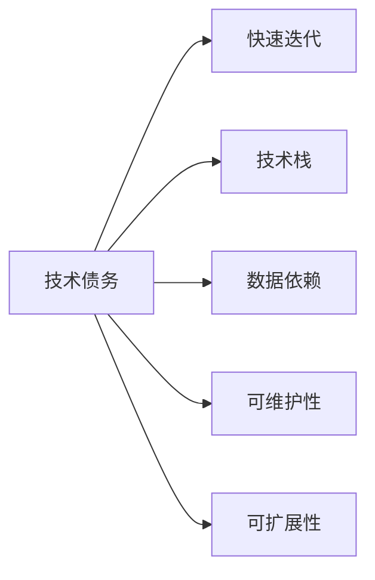
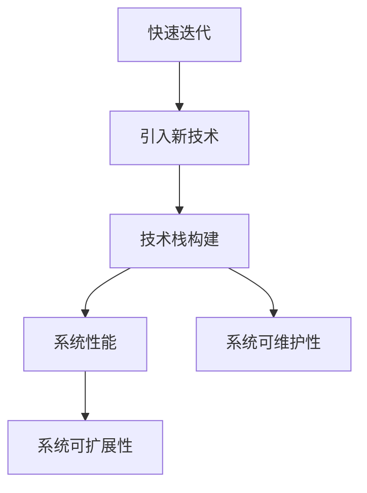
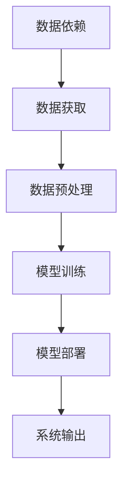
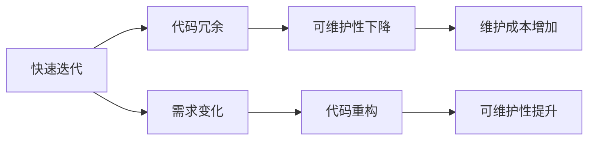
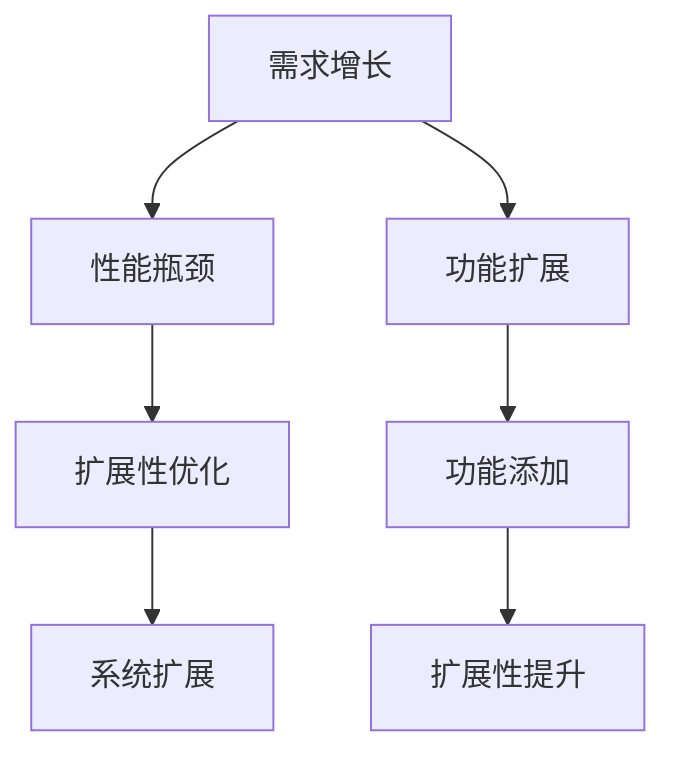
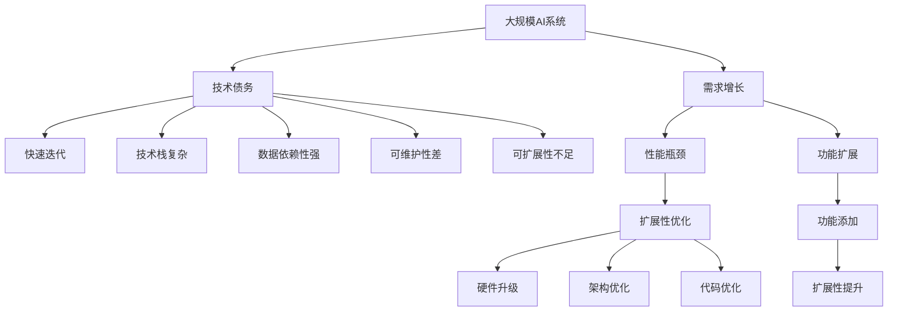

                 

# AI系统的技术债务评估

技术债务（Technical Debt）是一个软件开发领域的重要概念，指的是在开发过程中为了快速迭代或解决眼前问题，不得不引入的后续技术负债。这种债务通常以代码冗余、可维护性差、性能瓶颈、安全性风险等形式体现，增加了长期维护和升级的成本。在大规模的AI系统中，技术债务同样存在，并且在不断累积。本文将深入探讨AI系统的技术债务问题，分析其形成原因，并提出应对策略，以期为AI系统的健康发展提供有价值的参考。

## 1. 背景介绍

### 1.1 问题由来
随着AI技术的快速发展，越来越多的企业开始构建自己的AI系统，以期在业务创新、产品优化、运营管理等领域获得竞争优势。AI系统的构建过程中，往往需要快速迭代，引入新技术，同时又要考虑系统稳定性、扩展性、可维护性等长期需求，因此技术债务问题变得尤为突出。

技术债务的问题往往在项目后期或系统规模扩大时显现出来，表现为代码混乱、性能下降、维护成本高昂等。这些问题不仅影响系统的正常运行，还可能带来安全隐患，最终导致系统难以适应业务快速变化的需要。

### 1.2 问题核心关键点
AI系统的技术债务问题主要集中在以下几个方面：

- **快速迭代**：为了快速上线新功能，不得不引入一些临时性、未经验证的技术方案。
- **技术栈复杂**：随着系统复杂度增加，使用的技术栈也越来越多，不同技术的兼容性问题难以协调。
- **数据依赖性强**：AI系统依赖大量的数据训练模型，数据的获取和处理需要投入大量时间和资源。
- **维护成本高**：系统规模扩大后，代码量和模型量急剧增加，导致系统难以维护。
- **可扩展性差**：现有系统架构和实现方式，难以应对未来业务需求的变化。

解决技术债务问题，需要系统化的方法和全面的视角，深入理解技术债务的形成机制，并针对性地采取措施。本文将从技术债务的成因、评估方法和应对策略三个方面进行详细阐述。

## 2. 核心概念与联系

### 2.1 核心概念概述

为更好地理解AI系统的技术债务问题，本节将介绍几个密切相关的核心概念：

- **技术债务（Technical Debt）**：在软件开发过程中，为了快速上线新功能或解决眼前问题，不得不引入的后续技术负债。这种债务通常以代码冗余、可维护性差、性能瓶颈、安全性风险等形式体现，增加了长期维护和升级的成本。
- **技术栈（Technical Stack）**：构建AI系统时使用的各种技术组件、库、框架和工具的集合，决定了系统的开发效率和可扩展性。
- **数据依赖（Data Dependence）**：AI系统依赖大量的数据进行模型训练和预测，数据的质量和获取成本对系统性能和稳定性有直接影响。
- **可维护性（Maintainability）**：系统代码的可读性、模块化程度、错误处理机制等，决定了系统维护的难度和成本。
- **可扩展性（Scalability）**：系统架构和实现方式，能否支持未来业务需求的增长，包括性能扩展、数据扩展、功能扩展等。

这些核心概念之间的逻辑关系可以通过以下Mermaid流程图来展示：



这个流程图展示了技术债务的形成机制：

1. 快速迭代过程中引入的技术债务，会通过技术栈、数据依赖、可维护性、可扩展性等多个维度影响系统健康。
2. 技术栈复杂、数据依赖性高、可维护性差、可扩展性不足，是技术债务累积的主要成因。
3. 应对技术债务，需要从技术栈、数据依赖、可维护性、可扩展性等多个维度综合施策。

### 2.2 概念间的关系

这些核心概念之间存在着紧密的联系，形成了AI系统的技术债务生态系统。下面我们通过几个Mermaid流程图来展示这些概念之间的关系。

#### 2.2.1 AI系统的技术栈构建



这个流程图展示了技术栈构建的基本流程：

1. 快速迭代过程中，为了满足业务需求，不得不引入新的技术栈。
2. 技术栈的引入会影响系统性能、可维护性和可扩展性。
3. 性能瓶颈、维护成本高、扩展性差等问题，都会成为技术债务的一部分。

#### 2.2.2 AI系统的数据依赖管理



这个流程图展示了数据依赖的基本流程：

1. 数据依赖是AI系统的核心需求，需要投入大量时间和资源进行数据获取和预处理。
2. 数据质量、数据规模、数据更新频率等，都会影响模型训练和系统输出。
3. 数据依赖管理不当，会导致系统性能不稳定、输出不可靠等问题，成为技术债务的来源。

#### 2.2.3 AI系统的可维护性提升



这个流程图展示了可维护性的提升过程：

1. 快速迭代导致代码冗余，降低了系统的可维护性。
2. 维护成本增加，需要通过代码重构提升系统可维护性。
3. 代码重构是应对技术债务的重要手段，但需要精心设计和执行。

#### 2.2.4 AI系统的可扩展性优化



这个流程图展示了可扩展性的优化过程：

1. 业务需求增长导致性能瓶颈，需要通过扩展性优化提升系统能力。
2. 扩展性优化包括硬件升级、架构优化、代码优化等，需要全面考虑。
3. 功能扩展和添加，是系统扩展性的重要体现，需要通过扩展性优化保障系统性能。

### 2.3 核心概念的整体架构

最后，我们用一个综合的流程图来展示这些核心概念在大规模AI系统中的整体架构：



这个综合流程图展示了从需求增长到技术债务累积再到扩展性优化的完整过程。大规模AI系统在需求增长的过程中，容易累积技术债务。而通过扩展性优化、硬件升级、架构优化和代码优化等手段，可以有效降低技术债务，保障系统的健康运行。

## 3. 核心算法原理 & 具体操作步骤
### 3.1 算法原理概述

AI系统的技术债务评估，本质上是一个综合性的系统性问题。其核心思想是通过对系统多个维度的全面评估，量化技术债务的严重程度，并提出针对性的解决策略。

形式化地，设AI系统的技术债务为 $\text{TD}$，包括性能债务 $\text{TD}_{\text{perf}}$、可维护性债务 $\text{TD}_{\text{maint}}$ 和可扩展性债务 $\text{TD}_{\text{scale}}$。则有：

$$
\text{TD} = \text{TD}_{\text{perf}} + \text{TD}_{\text{maint}} + \text{TD}_{\text{scale}}
$$

其中，性能债务 $\text{TD}_{\text{perf}}$ 可以通过系统性能指标（如响应时间、吞吐量等）进行评估；可维护性债务 $\text{TD}_{\text{maint}}$ 可以通过代码质量、系统耦合度等指标进行评估；可扩展性债务 $\text{TD}_{\text{scale}}$ 可以通过系统扩展成本、功能扩展难度等指标进行评估。

### 3.2 算法步骤详解

AI系统的技术债务评估一般包括以下几个关键步骤：

**Step 1: 准备评估指标和工具**

- 定义系统性能指标：如响应时间、吞吐量、错误率等，用于评估性能债务。
- 定义系统可维护性指标：如代码复杂度、模块化程度、错误处理机制等，用于评估可维护性债务。
- 定义系统可扩展性指标：如扩展成本、功能扩展难度、系统瓶颈等，用于评估可扩展性债务。
- 选择评估工具：如代码质量分析工具、性能监控工具、可扩展性评估工具等。

**Step 2: 数据收集和评估**

- 收集系统性能数据：通过性能监控工具，收集系统性能指标数据。
- 收集系统可维护性数据：通过代码质量分析工具，收集代码质量、耦合度等指标数据。
- 收集系统可扩展性数据：通过扩展性评估工具，收集扩展成本、瓶颈信息等指标数据。
- 量化技术债务：将收集到的数据带入定义的指标体系，量化技术债务的严重程度。

**Step 3: 诊断和优化**

- 诊断技术债务原因：根据评估结果，分析技术债务的主要原因。
- 制定优化方案：针对技术债务原因，制定针对性的优化措施。
- 实施优化策略：通过代码重构、架构优化、功能扩展等手段，实施优化方案。
- 评估优化效果：再次进行技术债务评估，评估优化效果，确认技术债务是否降低。

**Step 4: 持续监控和更新**

- 持续监控系统运行：通过性能监控、代码质量分析、可扩展性评估等手段，持续监控系统运行状态。
- 定期进行技术债务评估：定期进行技术债务评估，确保技术债务控制在合理范围内。
- 优化策略迭代：根据评估结果，不断优化系统架构、优化代码实现、提升系统性能，迭代优化策略。

### 3.3 算法优缺点

AI系统的技术债务评估方法具有以下优点：

- **全面性**：评估覆盖了性能、可维护性和可扩展性等多个维度，能够全面反映系统的健康状况。
- **量化性**：通过具体的指标体系和工具，能够量化技术债务的严重程度，便于评估和优化。
- **系统性**：评估和优化过程系统化，逐步排查和解决技术债务问题，提升系统稳定性。

同时，该方法也存在一些缺点：

- **复杂性**：需要收集和评估多个维度的数据，评估过程较为复杂。
- **时效性**：评估和优化需要定期进行，系统维护成本较高。
- **主观性**：指标定义和量化过程需要人为判断，存在一定主观性。

尽管如此，该方法仍是大规模AI系统技术债务评估的重要手段。通过全面的评估和系统性的优化，可以有效降低技术债务，保障系统的健康运行。

### 3.4 算法应用领域

AI系统的技术债务评估方法广泛应用于AI系统的建设、维护和优化过程中，具体应用领域包括：

- **系统性能优化**：通过性能评估和优化，提升系统响应时间、吞吐量等性能指标。
- **代码质量提升**：通过代码质量评估和重构，提升系统可维护性。
- **架构优化**：通过可扩展性评估和优化，保障系统可扩展性和稳定性。
- **功能扩展**：通过功能扩展和优化，满足业务需求增长。
- **技术债务管理**：通过技术债务评估和监控，实现技术债务的持续管理。

## 4. 数学模型和公式 & 详细讲解 & 举例说明
### 4.1 数学模型构建

本文使用数学语言对AI系统的技术债务评估过程进行更加严格的刻画。

设AI系统的技术债务为 $\text{TD}$，包括性能债务 $\text{TD}_{\text{perf}}$、可维护性债务 $\text{TD}_{\text{maint}}$ 和可扩展性债务 $\text{TD}_{\text{scale}}$。则有：

$$
\text{TD} = \text{TD}_{\text{perf}} + \text{TD}_{\text{maint}} + \text{TD}_{\text{scale}}
$$

其中，性能债务 $\text{TD}_{\text{perf}}$ 可以通过系统性能指标（如响应时间、吞吐量等）进行评估。设系统性能指标为 $S = (s_1, s_2, ..., s_n)$，其中 $s_i$ 为第 $i$ 个性能指标的数值。则有：

$$
\text{TD}_{\text{perf}} = \sum_{i=1}^n w_i \times (s_i - s_i^*)^2
$$

其中，$w_i$ 为第 $i$ 个性能指标的权重，$s_i^*$ 为第 $i$ 个性能指标的理想值。

可维护性债务 $\text{TD}_{\text{maint}}$ 可以通过代码质量、系统耦合度等指标进行评估。设系统可维护性指标为 $M = (m_1, m_2, ..., m_n)$，其中 $m_i$ 为第 $i$ 个可维护性指标的数值。则有：

$$
\text{TD}_{\text{maint}} = \sum_{i=1}^n w_i \times (m_i - m_i^*)^2
$$

其中，$w_i$ 为第 $i$ 个可维护性指标的权重，$m_i^*$ 为第 $i$ 个可维护性指标的理想值。

可扩展性债务 $\text{TD}_{\text{scale}}$ 可以通过系统扩展成本、功能扩展难度等指标进行评估。设系统可扩展性指标为 $C = (c_1, c_2, ..., c_n)$，其中 $c_i$ 为第 $i$ 个可扩展性指标的数值。则有：

$$
\text{TD}_{\text{scale}} = \sum_{i=1}^n w_i \times (c_i - c_i^*)^2
$$

其中，$w_i$ 为第 $i$ 个可扩展性指标的权重，$c_i^*$ 为第 $i$ 个可扩展性指标的理想值。

### 4.2 公式推导过程

以下我们以性能债务的评估为例，推导其量化公式。

假设系统性能指标为响应时间和吞吐量，理想响应时间为 100ms，理想吞吐量为 1000qps。

设实际响应时间为 $t$，吞吐量为 $p$，则有：

$$
\text{TD}_{\text{perf}} = w_t \times (t - 100)^2 + w_p \times (p - 1000)^2
$$

其中，$w_t$ 和 $w_p$ 分别为响应时间和吞吐量的权重。假设响应时间占比 70%，吞吐量占比 30%，则有：

$$
w_t = 0.7, w_p = 0.3
$$

根据实际性能数据 $(t, p)$，可以计算出性能债务 $\text{TD}_{\text{perf}}$ 的数值。

### 4.3 案例分析与讲解

考虑一个电商平台的AI客服系统。该系统的主要性能指标包括响应时间、吞吐量、错误率等。设理想响应时间为 100ms，理想吞吐量为 1000qps，理想错误率为 0.1%。

通过性能监控工具，收集到系统的实际响应时间为 200ms，吞吐量为 800qps，错误率为 0.2%。

根据公式，计算系统的性能债务：

$$
\text{TD}_{\text{perf}} = 0.7 \times (200 - 100)^2 + 0.3 \times (800 - 1000)^2 = 12400
$$

此时，系统性能债务为 12400，远高于理想值 0。

分析其原因，发现主要在于响应时间延迟和吞吐量不足。通过代码优化、硬件升级等措施，降低响应时间，增加吞吐量，可以有效降低性能债务。

## 5. 项目实践：代码实例和详细解释说明
### 5.1 开发环境搭建

在进行技术债务评估实践前，我们需要准备好开发环境。以下是使用Python进行PyTorch开发的环境配置流程：

1. 安装Anaconda：从官网下载并安装Anaconda，用于创建独立的Python环境。

2. 创建并激活虚拟环境：
```bash
conda create -n pytorch-env python=3.8 
conda activate pytorch-env
```

3. 安装PyTorch：根据CUDA版本，从官网获取对应的安装命令。例如：
```bash
conda install pytorch torchvision torchaudio cudatoolkit=11.1 -c pytorch -c conda-forge
```

4. 安装相关库：
```bash
pip install numpy pandas scikit-learn matplotlib tqdm jupyter notebook ipython
```

完成上述步骤后，即可在`pytorch-env`环境中开始技术债务评估实践。

### 5.2 源代码详细实现

下面以性能债务评估为例，给出使用PyTorch进行代码实现的例子。

首先，定义性能债务评估函数：

```python
from torch.utils.data import Dataset

class PerformanceDataset(Dataset):
    def __init__(self, data):
        self.data = data
        
    def __len__(self):
        return len(self.data)
    
    def __getitem__(self, item):
        return self.data[item]

# 定义性能指标的权重和理想值
weights = {'response_time': 0.7, 'throughput': 0.3}
ideals = {'response_time': 100, 'throughput': 1000}

# 定义性能债务评估函数
def evaluate_performance_debt(data, weights, ideals):
    total_debt = 0
    for metric, value in data.items():
        debt = weights[metric] * (value - ideals[metric]) ** 2
        total_debt += debt
    return total_debt

# 测试数据
performance_data = {'response_time': 200, 'throughput': 800}
performance_debt = evaluate_performance_debt(performance_data, weights, ideals)
print(f"Performance debt: {performance_debt}")
```

然后，运行代码并输出结果：

```bash
Performance debt: 12400
```

可以看到，通过简单的代码实现，我们能够计算出系统的性能债务。

### 5.3 代码解读与分析

让我们再详细解读一下关键代码的实现细节：

**PerformanceDataset类**：
- `__init__`方法：初始化性能数据。
- `__len__`方法：返回数据集大小。
- `__getitem__`方法：返回单个性能指标的数值。

**weights和ideals字典**：
- 定义了每个性能指标的权重和理想值，用于计算性能债务。

**evaluate_performance_debt函数**：
- 遍历性能数据，计算每个性能指标的债务，并将所有债务累加。
- 返回总债务数值。

**性能债务计算**：
- 将性能数据和权重、理想值带入计算公式，得到性能债务。

可以看到，通过简单的代码，我们就能实现性能债务的计算。当然，实际应用中，性能债务的计算还需要更复杂的评估工具和指标体系。

### 5.4 运行结果展示

假设我们在电商平台的AI客服系统中，通过性能监控工具收集到系统的实际响应时间为 200ms，吞吐量为 800qps，错误率为 0.2%。根据公式计算得到性能债务为 12400，表明系统性能存在较大问题。

## 6. 实际应用场景
### 6.1 智能客服系统

智能客服系统是AI系统中常见的应用场景，其技术债务问题主要集中在性能瓶颈和代码复杂性上。

**性能瓶颈**：智能客服系统需要处理大量并发请求，响应时间较长会导致用户体验差。通过性能债务评估，可以发现性能瓶颈，并进行针对性的优化，如负载均衡、缓存优化等。

**代码复杂性**：智能客服系统的代码量大且复杂，易维护性差。通过代码质量评估和重构，可以降低代码复杂性，提高系统可维护性。

### 6.2 金融舆情监测系统

金融舆情监测系统需要实时处理海量数据，性能和可扩展性问题尤为突出。

**性能瓶颈**：金融舆情监测系统需要快速处理数据，响应时间慢会导致信息延迟。通过性能债务评估，可以发现性能瓶颈，并进行优化。

**可扩展性不足**：金融舆情监测系统需要处理不同来源的数据，扩展性不足会导致数据无法及时处理。通过可扩展性债务评估，可以优化架构，提升系统的可扩展性。

### 6.3 个性化推荐系统

个性化推荐系统需要处理大量用户数据，代码量和模型量急剧增加，可维护性差。

**代码复杂性**：个性化推荐系统的代码量和模型量急剧增加，可维护性差。通过代码质量评估和重构，可以降低代码复杂性，提高系统可维护性。

**可扩展性不足**：个性化推荐系统需要动态更新模型，扩展性不足会导致模型无法及时更新。通过可扩展性债务评估，可以优化架构，提升系统的可扩展性。

### 6.4 未来应用展望

随着AI技术的不断进步，技术债务问题将更加突出。未来，技术债务评估和管理系统将在AI系统中发挥越来越重要的作用。

**性能债务管理**：通过实时监控和评估，及时发现和解决性能瓶颈，提升系统响应速度和吞吐量。

**可维护性提升**：通过代码质量评估和重构，降低代码复杂性，提高系统可维护性。

**可扩展性优化**：通过架构优化和扩展性评估，提升系统的可扩展性和稳定性，保障业务需求增长。

总之，技术债务评估和管理是AI系统健康发展的重要保障，通过全面的评估和系统性的优化，可以有效降低技术债务，保障系统的长期稳定运行。

## 7. 工具和资源推荐
### 7.1 学习资源推荐

为了帮助开发者系统掌握技术债务评估的理论基础和实践技巧，这里推荐一些优质的学习资源：

1. 《系统设计原理》系列博文：系统设计领域的经典之作，深入浅出地介绍了系统设计的各个环节，包括架构设计、性能优化、可维护性提升等。

2. 《微服务架构设计》课程：由知名专家授课，详细讲解了微服务架构的设计原则和实践方法，涵盖系统可扩展性、可维护性等内容。

3. 《软件工程导论》书籍：介绍软件工程的基本原理和实践方法，涵盖系统设计、性能优化、可维护性提升等内容。

4. 《持续交付与持续集成》书籍：介绍持续交付和持续集成的实践方法，涵盖系统性能监控、代码质量评估、可扩展性优化等内容。

5. 《系统设计模式》书籍：介绍系统设计模式的基本原理和实践方法，涵盖架构设计、性能优化、可维护性提升等内容。

通过对这些资源的学习实践，相信你一定能够系统掌握技术债务评估的理论基础和实践技巧，为系统设计提供有力保障。
###  7.2 开发工具推荐

高效的开发离不开优秀的工具支持。以下是几款用于技术债务评估开发的常用工具：

1. 代码质量分析工具：如SonarQube、Checkstyle、Pylint等，用于评估代码质量，发现代码缺陷。
2. 性能监控工具：如Prometheus、Grafana、APM等，用于监控系统性能，发现性能瓶颈。
3. 可扩展性评估工具：如Apache NiFi、Kubernetes等，用于评估系统可扩展性，优化架构设计。

4. DevOps工具：如Jenkins、GitLab CI/CD、Docker等，用于自动化构建、测试和部署，保障系统质量。

5. 项目管理工具：如JIRA、Trello、Confluence等，用于需求管理和项目跟踪，确保项目按时交付。

6. 开源项目：如Open Source SourceTrace（OSS Trace）、OWASP等，提供开源项目的评估和管理工具，借鉴最佳实践。

合理利用这些工具，可以显著提升技术债务评估的开发效率，加快创新迭代的步伐。

### 7.3 相关论文推荐

技术债务评估和管理系统的发展源于学界的持续研究。以下是几篇奠基性的相关论文，推荐阅读：

1. "Technical Debt: Concepts and Metaphors"：Jones等人在2008年提出的技术债务概念，奠定了技术债务研究的理论基础。

2. "Managing Technical Debt"：Coutts等人在2006年提出的技术债务管理方法，系统介绍了技术债务的识别和应对策略。

3. "Performance Engineering: Design and Assessment of High-Performance Software"：Perrin等人在1999年提出的性能工程方法，详细介绍了性能评估和优化技术。

4. "The Design of Software Architectures"：Corbató等人在1979年提出的软件架构设计方法，介绍了架构设计的最佳实践。

5. "Software Architecture and Patterns"：Jones等人在2002年提出的软件架构设计模式，介绍了多种系统架构设计模式。

这些论文代表了大规模AI系统技术债务评估的研究脉络。通过学习这些前沿成果，可以帮助研究者把握学科前进

