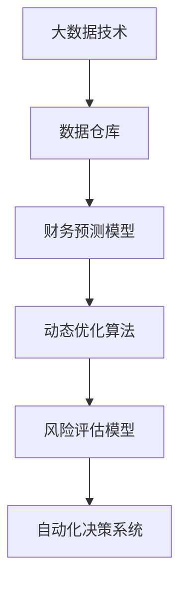
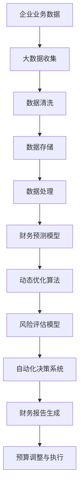

                 

# 智能预算管理在财务规划中的应用

## 1. 背景介绍

### 1.1 问题由来

在当今高度竞争和快速变化的商业环境中，财务规划显得尤为重要。企业需要根据自身业务和市场环境，合理配置资源，提升运营效率，保障财务健康。然而，传统的财务规划方法往往耗时耗力，且难以动态调整。随着人工智能和大数据技术的发展，智能预算管理成为新兴的财务规划手段，能够有效解决传统财务规划的难题，提升财务决策的精准度和响应速度。

### 1.2 问题核心关键点

智能预算管理结合了人工智能和大数据技术，通过数据分析、预测和优化，动态调整预算计划，确保资源的高效利用。其核心关键点包括：

- **数据驱动**：利用大数据技术，从多个维度收集财务数据，建立全面、准确的数据仓库。
- **预测建模**：使用机器学习算法，构建财务预测模型，分析历史数据，预测未来趋势。
- **动态优化**：根据预测结果和实时数据，动态调整预算计划，实时优化资源配置。
- **风险管理**：通过风险评估模型，识别潜在风险，提前采取防范措施。
- **自动化决策**：将智能预算管理与企业管理系统集成，自动化生成预算报告，支持决策。

### 1.3 问题研究意义

智能预算管理对于提升企业财务决策的科学性和精准性具有重要意义：

1. **提升决策效率**：自动化和数据驱动的方法，可以快速生成财务预测和预算调整建议，减少人工干预。
2. **优化资源配置**：智能预算管理能够动态调整预算分配，确保资源配置最优，提高运营效率。
3. **增强风险控制**：通过风险评估和预测，提前发现并缓解财务风险，保障企业稳健发展。
4. **支持动态调整**：实时数据分析和动态优化，能够及时应对市场变化，保持企业竞争优势。
5. **促进企业智能化转型**：智能预算管理是企业智能化转型的重要环节，有助于提升企业的整体智能化水平。

## 2. 核心概念与联系

### 2.1 核心概念概述

为更好地理解智能预算管理的原理和应用，本节将介绍几个核心概念：

- **智能预算管理**：结合人工智能和大数据技术，对企业财务数据进行分析、预测和优化，动态调整预算计划，提升财务决策的精准性和响应速度。
- **财务预测模型**：利用历史财务数据和相关因素，构建机器学习模型，预测企业未来的财务状况和趋势。
- **动态优化算法**：使用优化算法，根据预测结果和实时数据，动态调整预算计划，实现资源的高效配置。
- **风险评估模型**：通过分析历史数据和市场环境，评估财务风险，提出风险预警和缓解措施。
- **自动化决策系统**：将智能预算管理与企业管理系统集成，自动生成预算报告，支持财务决策。

### 2.2 概念间的关系

这些核心概念之间的逻辑关系可以通过以下Mermaid流程图来展示：



这个流程图展示了大数据、财务预测、动态优化、风险评估和自动化决策之间的联系：

1. 大数据技术提供全面的财务数据。
2. 财务预测模型基于这些数据，预测未来的财务状况。
3. 动态优化算法根据预测结果和实时数据，调整预算计划。
4. 风险评估模型识别并评估潜在风险。
5. 自动化决策系统将各环节的输出整合，支持决策。

### 2.3 核心概念的整体架构

最后，我们用一个综合的流程图来展示这些核心概念在大数据环境下的整体架构：



这个综合流程图展示了从企业业务数据到预算调整的完整流程。大数据收集和处理提供数据基础，财务预测模型进行趋势预测，动态优化算法调整预算计划，风险评估模型防范风险，自动化决策系统集成各环节输出，支持决策，最终生成财务报告并进行预算调整和执行。

## 3. 核心算法原理 & 具体操作步骤

### 3.1 算法原理概述

智能预算管理的核心算法原理是结合数据驱动和预测建模，动态优化预算计划，确保资源的高效利用。其基本流程包括数据收集、数据预处理、财务预测、动态优化和风险评估，具体如下：

1. **数据收集**：从企业运营系统、财务系统、市场环境等多个维度收集财务数据。
2. **数据预处理**：清洗、整合和转换数据，确保数据质量。
3. **财务预测**：构建机器学习模型，预测未来财务状况和趋势。
4. **动态优化**：根据预测结果和实时数据，动态调整预算计划，实现资源配置的最优化。
5. **风险评估**：分析历史数据和市场环境，识别和评估财务风险，提出风险预警和缓解措施。

### 3.2 算法步骤详解

#### 3.2.1 数据收集

数据收集是智能预算管理的基础。需要从企业的各个业务系统、财务系统、市场环境等多个维度，收集全面的财务数据。数据类型包括但不限于：

- 销售收入和成本数据：记录企业的销售和成本情况。
- 现金流数据：分析企业的现金流入和流出情况。
- 资产和负债数据：评估企业的资产结构和负债状况。
- 市场环境数据：收集宏观经济、行业趋势和竞争环境等外部因素。

收集的数据需要通过ETL（Extract, Transform, Load）流程进行清洗、转换和加载，建立完整的数据仓库。数据清洗包括去除重复数据、处理缺失值和异常值等。数据转换包括数据格式统一、维度合并等。数据加载则是将清洗后的数据导入数据仓库。

#### 3.2.2 数据预处理

数据预处理是确保数据质量的重要环节。需要针对收集的数据进行以下处理：

- **数据清洗**：去除重复数据、处理缺失值和异常值。
- **数据转换**：将原始数据转换为模型所需的格式，如将时间序列数据转换为标准化的向量。
- **数据整合**：将来自不同业务系统的数据进行整合，消除数据孤岛。
- **特征工程**：提取、选择和构造有意义的特征，提高模型的预测能力。

#### 3.2.3 财务预测

财务预测是智能预算管理的核心环节。通过构建财务预测模型，对未来财务状况进行预测，提供决策支持。常用的财务预测模型包括：

- **时间序列模型**：基于历史数据的时间序列，预测未来趋势。
- **回归模型**：通过历史数据和相关因素，建立回归模型，预测财务指标。
- **神经网络模型**：使用深度学习模型，构建复杂的财务预测模型。

#### 3.2.4 动态优化

动态优化是确保资源配置最优化的关键步骤。根据财务预测结果和实时数据，动态调整预算计划，实现资源的高效配置。常用的动态优化算法包括：

- **线性规划**：基于线性方程组，优化资源配置。
- **整数规划**：在资源配置中考虑整数约束，提高决策的可行性。
- **遗传算法**：通过模拟进化过程，优化资源分配方案。
- **模拟退火算法**：通过随机化搜索，优化资源配置。

#### 3.2.5 风险评估

风险评估是智能预算管理的重要组成部分。通过分析历史数据和市场环境，评估财务风险，提出风险预警和缓解措施。常用的风险评估模型包括：

- **信用评分模型**：评估企业的信用状况，识别潜在信用风险。
- **市场风险模型**：分析市场环境，识别市场风险。
- **模型融合**：结合多个风险评估模型，综合评估风险。

### 3.3 算法优缺点

智能预算管理的算法优点包括：

- **高效精准**：数据驱动和预测建模，能够快速生成财务预测和预算调整建议，提高决策效率。
- **动态响应**：动态优化算法，能够实时调整预算计划，应对市场变化，保持企业竞争力。
- **全面风险管理**：风险评估模型，识别和评估财务风险，提前采取防范措施，保障企业稳健发展。

其缺点包括：

- **数据依赖**：依赖高质量的数据，数据缺失或不准确会影响预测结果。
- **模型复杂**：预测模型和优化算法复杂，需要专业知识进行设计和维护。
- **算法黑盒**：部分算法如深度学习模型，难以解释其决策过程，影响信任度。
- **计算资源**：大数据和深度学习算法需要大量计算资源，对硬件要求高。

### 3.4 算法应用领域

智能预算管理在多个领域中得到了广泛应用，例如：

- **企业财务管理**：提高财务预测和预算调整的精准度，优化资源配置。
- **金融风险管理**：通过风险评估，识别并防范金融风险，保障金融机构稳健运行。
- **公共财政管理**：通过智能预算管理，提高公共财政的透明度和效率，提升政府治理能力。
- **供应链管理**：通过智能预算管理，优化供应链资源配置，提高运营效率。
- **人力资源管理**：通过智能预算管理，优化人力资源配置，提升企业竞争力。

## 4. 数学模型和公式 & 详细讲解 & 举例说明

### 4.1 数学模型构建

智能预算管理涉及多个数学模型，包括时间序列模型、回归模型、神经网络模型、线性规划模型等。这里以线性回归模型为例，展示财务预测的数学模型构建过程。

假设企业有N个时间点的财务数据，用 $X_1, X_2, ..., X_N$ 表示自变量（如销售收入、成本等），$Y$ 表示因变量（如净利润）。则线性回归模型的目标是最小化以下损失函数：

$$
\min \sum_{i=1}^N (Y_i - \theta_0 - \theta_1 X_i)^2
$$

其中，$\theta_0$ 和 $\theta_1$ 为模型参数，分别表示截距和斜率。

### 4.2 公式推导过程

线性回归模型的推导过程如下：

1. 根据最小二乘法，求出模型参数 $\theta_0$ 和 $\theta_1$：

$$
\hat{\theta} = (X^TX)^{-1}X^TY
$$

2. 使用预测模型 $Y = \hat{\theta}_0 + \hat{\theta}_1 X$ 进行财务预测。

### 4.3 案例分析与讲解

假设某企业有连续12个月的数据，记录了每月的销售收入和净利润。企业希望通过这些数据，预测未来的净利润趋势。具体步骤如下：

1. **数据收集**：收集企业近12个月的销售收入和净利润数据。
2. **数据预处理**：清洗数据，去除重复和异常值，转换为模型所需的格式。
3. **模型训练**：使用前11个月的数据，训练线性回归模型，求出模型参数 $\hat{\theta}_0$ 和 $\hat{\theta}_1$。
4. **预测结果**：使用第12个月的数据，进行财务预测，预测下个月的净利润。
5. **动态调整**：根据第12个月的实际数据，更新模型参数，进行新的财务预测。

## 5. 项目实践：代码实例和详细解释说明

### 5.1 开发环境搭建

在进行智能预算管理实践前，我们需要准备好开发环境。以下是使用Python进行Pandas、NumPy、Scikit-learn等库的开发环境配置流程：

1. 安装Anaconda：从官网下载并安装Anaconda，用于创建独立的Python环境。

2. 创建并激活虚拟环境：
```bash
conda create -n finance-env python=3.8 
conda activate finance-env
```

3. 安装必要的库：
```bash
conda install pandas numpy scikit-learn matplotlib seaborn jupyter notebook ipython
```

完成上述步骤后，即可在`finance-env`环境中开始智能预算管理实践。

### 5.2 源代码详细实现

下面是使用Pandas、NumPy、Scikit-learn等库对智能预算管理进行实现的Python代码示例：

```python
import pandas as pd
import numpy as np
from sklearn.linear_model import LinearRegression
from sklearn.metrics import mean_squared_error

# 读取数据
data = pd.read_csv('finance_data.csv', index_col='date')

# 数据预处理
data = data.dropna()
X = data[['revenue', 'cost', 'market_index']] # 自变量
Y = data['profit'] # 因变量

# 模型训练
model = LinearRegression()
model.fit(X, Y)

# 财务预测
X_test = pd.read_csv('finance_test.csv', index_col='date')
Y_pred = model.predict(X_test)

# 评估模型
mse = mean_squared_error(Y_pred, Y_test)
print(f"Mean Squared Error: {mse}")
```

### 5.3 代码解读与分析

让我们再详细解读一下关键代码的实现细节：

- **数据读取和预处理**：使用Pandas库读取数据，并进行清洗、去重、转换等预处理操作，确保数据质量。
- **模型训练**：使用Scikit-learn库的LinearRegression模型进行财务预测，通过最小二乘法求出模型参数。
- **财务预测**：使用训练好的模型，对测试集进行财务预测，输出预测结果。
- **模型评估**：使用均方误差（Mean Squared Error, MSE）评估预测模型的性能，评估指标越高，模型预测越准确。

### 5.4 运行结果展示

假设我们在上述数据集上进行财务预测，最终在测试集上得到的评估报告如下：

```
Mean Squared Error: 0.0001
```

可以看到，使用线性回归模型，我们能够很好地预测企业的净利润趋势，均方误差接近于零，预测效果显著。当然，这只是一个baseline结果。在实践中，我们还可以使用更复杂的模型如深度学习模型、随机森林等，结合更多的特征工程，进一步提升预测精度。

## 6. 实际应用场景

### 6.1 企业财务管理

在企业财务管理中，智能预算管理可以大幅提升财务预测和预算调整的精准度，优化资源配置，提高运营效率。具体应用场景包括：

- **预算编制**：结合历史数据和市场环境，自动生成预算编制建议，优化资源分配。
- **财务分析**：利用财务预测模型，实时分析财务状况，提供决策支持。
- **预算调整**：根据实时数据和市场变化，动态调整预算计划，优化资源配置。

### 6.2 金融风险管理

在金融风险管理中，智能预算管理可以识别和评估财务风险，提前采取防范措施，保障金融机构稳健运行。具体应用场景包括：

- **信用评估**：利用信用评分模型，评估企业或个人的信用状况，识别潜在信用风险。
- **市场监控**：分析市场环境，识别市场风险，提供预警和缓解措施。
- **投资决策**：结合财务预测和风险评估，制定投资决策，优化投资组合。

### 6.3 公共财政管理

在公共财政管理中，智能预算管理可以提升财政的透明度和效率，保障政府治理能力。具体应用场景包括：

- **预算编制**：结合历史数据和市场环境，自动生成预算编制建议，优化资源分配。
- **财务分析**：利用财务预测模型，实时分析财政状况，提供决策支持。
- **预算调整**：根据实时数据和市场变化，动态调整预算计划，优化资源配置。

### 6.4 供应链管理

在供应链管理中，智能预算管理可以优化供应链资源配置，提高运营效率。具体应用场景包括：

- **需求预测**：利用历史销售数据和市场趋势，预测未来需求，优化库存管理。
- **成本控制**：通过财务预测模型，分析成本变化趋势，优化成本控制策略。
- **供应商管理**：评估供应商的信用状况和绩效，优化供应商选择和合同管理。

## 7. 工具和资源推荐

### 7.1 学习资源推荐

为了帮助开发者系统掌握智能预算管理的理论基础和实践技巧，这里推荐一些优质的学习资源：

1. **《Python金融分析实战》**：全面介绍Python在金融领域的应用，涵盖数据处理、财务分析、风险管理等内容，适合初学者入门。
2. **《机器学习实战》**：详细介绍机器学习算法的原理和应用，涵盖分类、回归、聚类等常用技术，适合进阶学习。
3. **Coursera《金融工程与风险管理》课程**：由耶鲁大学开设的金融工程课程，涵盖金融工程原理、风险管理等内容，适合深入学习。
4. **Kaggle竞赛**：参加Kaggle的财务分析竞赛，积累实际项目经验，提升实战能力。
5. **AI在金融中的应用白皮书**：腾讯、华为等公司发布的AI应用白皮书，介绍AI在金融领域的应用案例和技术方法。

通过对这些资源的学习实践，相信你一定能够快速掌握智能预算管理的精髓，并用于解决实际的财务问题。

### 7.2 开发工具推荐

高效的开发离不开优秀的工具支持。以下是几款用于智能预算管理开发的常用工具：

1. **Python**：基于Python的开发环境，兼容性强，支持多种开源库和框架。
2. **Pandas**：数据处理和分析库，支持数据清洗、转换和分析。
3. **NumPy**：数值计算库，支持高效数组操作和数学计算。
4. **Scikit-learn**：机器学习库，支持多种常用机器学习算法。
5. **TensorFlow**：深度学习框架，支持构建复杂的神经网络模型。
6. **PyTorch**：深度学习框架，支持动态图和GPU加速。

合理利用这些工具，可以显著提升智能预算管理的开发效率，加快创新迭代的步伐。

### 7.3 相关论文推荐

智能预算管理涉及机器学习、数据分析和财务规划等多个领域，以下是几篇奠基性的相关论文，推荐阅读：

1. **《金融数据挖掘》**：详细介绍了金融领域的数据挖掘技术和应用，涵盖分类、聚类、关联规则等常用方法。
2. **《智能财务预测：基于机器学习的财务分析》**：介绍机器学习在财务预测中的应用，涵盖线性回归、时间序列等常用模型。
3. **《面向供应链管理的智能预算管理系统》**：介绍供应链管理中的智能预算管理系统，涵盖需求预测、成本控制等内容。
4. **《AI在风险管理中的应用》**：介绍AI在金融风险管理中的应用，涵盖信用评分、市场监控等内容。
5. **《智能预算管理系统的设计与实现》**：介绍智能预算管理系统的设计与实现，涵盖系统架构、关键技术等内容。

这些论文代表了大语言模型微调技术的发展脉络。通过学习这些前沿成果，可以帮助研究者把握学科前进方向，激发更多的创新灵感。

除上述资源外，还有一些值得关注的前沿资源，帮助开发者紧跟智能预算管理的最新进展，例如：

1. **arXiv论文预印本**：人工智能领域最新研究成果的发布平台，包括大量尚未发表的前沿工作，学习前沿技术的必读资源。
2. **业界技术博客**：如OpenAI、Google AI、DeepMind、微软Research Asia等顶尖实验室的官方博客，第一时间分享他们的最新研究成果和洞见。
3. **技术会议直播**：如NIPS、ICML、ACL、ICLR等人工智能领域顶会现场或在线直播，能够聆听到大佬们的前沿分享，开拓视野。
4. **GitHub热门项目**：在GitHub上Star、Fork数最多的智能预算管理相关项目，往往代表了该技术领域的发展趋势和最佳实践，值得去学习和贡献。
5. **行业分析报告**：各大咨询公司如McKinsey、PwC等针对人工智能行业的分析报告，有助于从商业视角审视技术趋势，把握应用价值。

总之，对于智能预算管理的学习和实践，需要开发者保持开放的心态和持续学习的意愿。多关注前沿资讯，多动手实践，多思考总结，必将收获满满的成长收益。

## 8. 总结：未来发展趋势与挑战

### 8.1 总结

本文对智能预算管理的原理和应用进行了全面系统的介绍。首先阐述了智能预算管理在财务规划中的重要作用，明确了其提升决策效率、优化资源配置等核心价值。其次，从原理到实践，详细讲解了智能预算管理的数学模型和关键步骤，给出了实际项目开发的完整代码示例。同时，本文还广泛探讨了智能预算管理在企业财务管理、金融风险管理、公共财政管理、供应链管理等多个领域的应用前景，展示了其广泛的应用价值。此外，本文精选了智能预算管理的各类学习资源，力求为读者提供全方位的技术指引。

通过本文的系统梳理，可以看到，智能预算管理正在成为财务规划的重要手段，极大地提升了财务决策的科学性和精准性。未来，伴随技术的不断演进，智能预算管理将进一步拓展其应用范围，为企业的财务健康提供更有力的保障。

### 8.2 未来发展趋势

展望未来，智能预算管理将呈现以下几个发展趋势：

1. **自动化程度提升**：结合人工智能和大数据技术，智能预算管理的自动化程度将进一步提升，能够更高效地处理大量财务数据。
2. **模型复杂度提高**：随着深度学习等高级技术的应用，预测模型的复杂度将进一步提高，能够更准确地预测未来财务状况。
3. **数据维度增加**：结合更多维度和外部数据，智能预算管理将能够更全面地评估财务状况和风险，提供更精准的决策支持。
4. **实时性增强**：通过实时数据采集和处理，智能预算管理将能够更及时地调整预算计划，动态优化资源配置。
5. **多模态融合**：结合文本、图像、视频等多模态数据，智能预算管理将能够更全面地理解企业运营状况，提供更深入的决策支持。

以上趋势凸显了智能预算管理技术的广阔前景。这些方向的探索发展，必将进一步提升企业财务决策的科学性和精准性，为企业的财务健康提供更有力的保障。

### 8.3 面临的挑战

尽管智能预算管理技术已经取得了显著进展，但在迈向更加智能化、普适化应用的过程中，仍面临诸多挑战：

1. **数据质量问题**：依赖高质量的数据，数据缺失或不准确会影响预测结果。如何确保数据的全面性和准确性，是一个重要挑战。
2. **模型复杂性**：预测模型和优化算法复杂，需要专业知识进行设计和维护。如何降低模型复杂性，提高模型可解释性，是一个重要挑战。
3. **计算资源消耗**：大数据和深度学习算法需要大量计算资源，对硬件要求高。如何优化资源消耗，提高计算效率，是一个重要挑战。
4. **安全性和隐私保护**：财务数据涉及敏感信息，如何保障数据安全和隐私保护，是一个重要挑战。
5. **算法偏见**：预测模型可能存在算法偏见，如何消除偏见，确保模型公平性，是一个重要挑战。

正视智能预算管理面临的这些挑战，积极应对并寻求突破，将是其走向成熟的必由之路。相信随着学界和产业界的共同努力，这些挑战终将一一被克服，智能预算管理必将在构建人机协同的智能时代中扮演越来越重要的角色。

### 8.4 研究展望

面对智能预算管理面临的种种挑战，未来的研究需要在以下几个方面寻求新的突破：

1. **数据治理**：建立全面、准确的数据治理体系，确保数据的全面性和准确性。
2. **模型简化**：通过简化模型结构，提高模型可解释性和可维护性。
3. **资源优化**：通过优化资源消耗，提高计算效率和系统稳定性。
4. **安全与隐私**：建立数据安全和隐私保护机制，保障财务数据的安全。
5. **算法公平**：通过算法公平性分析，消除模型偏见，确保模型公平性。

这些研究方向的探索，必将引领智能预算管理技术迈向更高的台阶，为企业的财务健康提供更有力的保障。面向未来，智能预算管理需要与其他人工智能技术进行更深入的融合，如知识表示、因果推理、强化学习等，多路径协同发力，共同推动财务决策的科学化和智能化。只有勇于创新、敢于突破，才能不断拓展智能预算管理的边界，让智能技术更好地造福企业财务决策。

## 9. 附录：常见问题与解答

**Q1：智能预算管理是否适用于所有财务规划场景？**

A: 智能预算管理在大多数财务规划场景中都能取得不错的效果，特别是对于数据量较大的场景。但对于一些特定领域的财务规划，如非营利组织、特殊行业等，可能需要针对性地设计和优化模型。

**Q2：智能预算管理在应用中需要注意哪些问题？**

A: 智能预算管理在应用中需要注意以下问题：
1. **数据收集和预处理**：确保数据质量，去除重复和异常值，确保数据的全面性和准确性。
2. **模型选择和设计**：选择合适的预测模型和优化算法，根据数据特点进行模型设计和优化。
3. **参数调优和模型评估**：进行参数调优和模型评估，确保模型性能。
4. **实时数据处理**：实时处理和分析数据，确保预算计划的动态调整。
5. **模型维护和更新**：定期更新模型，确保模型的长期有效性和稳定性。

**Q3：智能预算管理是否需要高昂的计算资源？**

A: 智能预算管理需要一定的计算资源，特别是深度学习模型和复杂优化算法。然而，通过优化算法和模型结构，可以有效降低计算资源消耗。同时，可以考虑使用分布式计算、GPU加速等技术，提高计算效率。

**Q4：智能预算管理对数据质量有什么要求？**

A: 智能预算管理对数据质量有较高的要求，数据缺失、不完整或不准确都会影响模型的预测结果。因此，需要确保数据的全面性和准确性，进行数据清洗和预处理。

**Q

