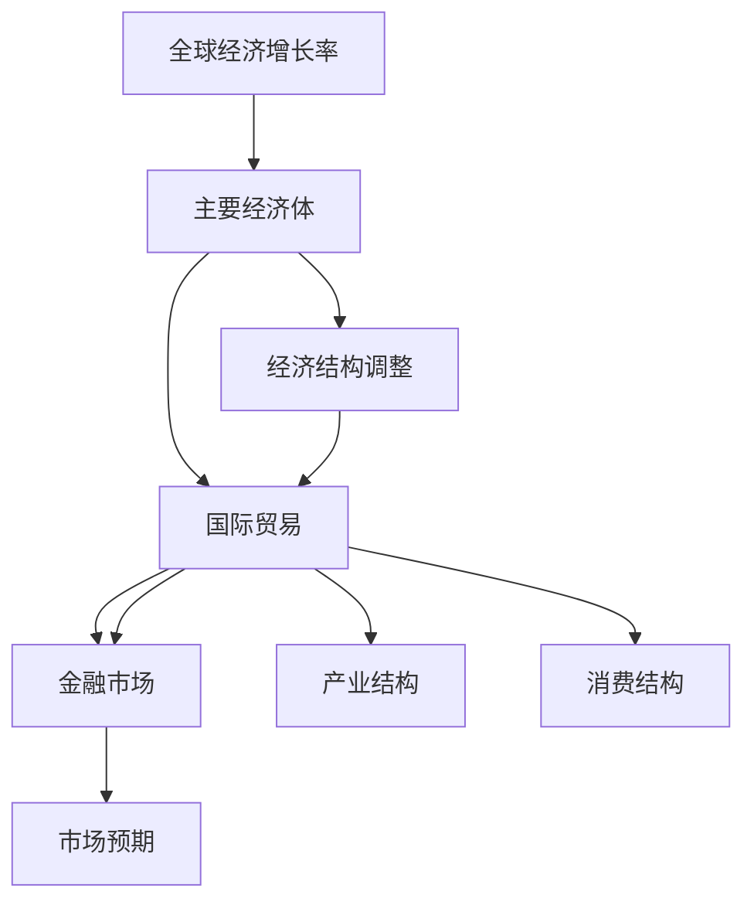
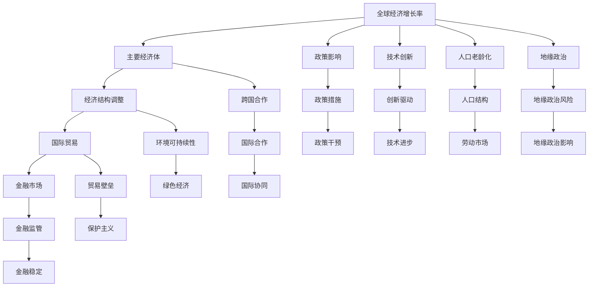

                 

# 未来几年世界经济的增长趋势

## 1. 背景介绍

### 1.1 问题由来

在当今全球化、信息化和工业化的时代背景下，世界经济正处于一个复杂而充满变数的转型期。随着科技的进步和国际形势的变化，未来几年全球经济增长趋势充满了不确定性和挑战。

### 1.2 问题核心关键点

本文旨在探讨未来几年世界经济的增长趋势，包括全球经济增长率、主要经济体经济表现、经济结构调整以及国际贸易和金融市场等关键领域的变化。我们将通过分析世界经济增长的主要驱动力、挑战和机遇，为政策制定者和企业提供有价值的参考。

### 1.3 问题研究意义

研究未来几年世界经济增长趋势，具有重要意义：

1. **政策制定**：政策制定者可以通过对经济增长趋势的准确判断，制定更加科学合理的宏观经济政策，促进经济稳定健康发展。
2. **企业决策**：企业可以依据经济增长趋势，调整投资和经营策略，提高市场竞争力。
3. **国际合作**：理解和把握全球经济增长趋势，有助于各国在贸易、投资、环境保护等方面加强合作，实现共赢。
4. **风险管理**：通过分析未来经济增长趋势，可以帮助投资者和管理者识别潜在风险，采取相应措施进行风险控制。

## 2. 核心概念与联系

### 2.1 核心概念概述

为更好地理解世界经济增长的趋势，我们首先需要梳理一些核心概念及其相互联系：

- **全球经济增长率**：指一定时期内世界经济总量的增长比例，反映全球经济的整体表现。
- **主要经济体**：如美国、中国、欧盟、日本等，这些经济体对全球经济增长具有重要影响。
- **经济结构调整**：包括产业结构、消费结构、收入分配等调整，影响经济增长的质量和效率。
- **国际贸易和金融市场**：国际贸易和金融市场的波动，直接影响各国经济增长和市场预期。

### 2.2 概念间的关系

这些核心概念之间存在着紧密的联系，可以通过以下Mermaid流程图来展示它们之间的关系：



这个流程图展示了全球经济增长率、主要经济体、经济结构调整、国际贸易和金融市场之间的联系：

1. 全球经济增长率受主要经济体的表现和国际贸易、金融市场的波动影响。
2. 经济结构调整是经济增长的重要驱动力，产业结构和消费结构的优化能提升经济效率。
3. 国际贸易和金融市场的稳定性，直接影响全球经济的增长速度和稳定性。

### 2.3 核心概念的整体架构

最后，我们用一个综合的流程图来展示这些核心概念在世界经济增长趋势中的整体架构：



这个综合流程图展示了全球经济增长趋势的多个影响因素及其相互作用：

1. 全球经济增长率受到主要经济体表现、经济结构调整、国际贸易和金融市场的影响。
2. 政策干预、技术创新、人口老龄化、地缘政治等因素也对经济增长产生重要影响。
3. 国际贸易和金融市场的稳定性、跨国合作、环境保护、技术进步等是促进经济增长的关键驱动力。

## 3. 核心算法原理 & 具体操作步骤

### 3.1 算法原理概述

预测世界经济增长趋势，主要依赖于统计分析和计量经济模型。通过对历史经济数据进行回归分析、时间序列分析等方法，可以建立预测模型，对未来几年的经济增长进行预测。

### 3.2 算法步骤详解

1. **数据收集和处理**：收集全球主要经济体的GDP、就业率、消费支出、投资、利率等历史数据，并进行清洗和标准化处理。
2. **模型选择和构建**：选择适当的模型（如ARIMA、VAR、神经网络等），利用历史数据对模型进行训练和验证。
3. **模型优化和测试**：通过调整模型参数、引入外生变量等方法，对模型进行优化，并在测试集上评估预测性能。
4. **结果分析和应用**：对模型预测结果进行统计分析和可视化展示，提出政策建议和投资策略。

### 3.3 算法优缺点

**优点**：

1. **准确性**：统计模型和计量经济模型经过验证，可以对经济增长趋势进行较为准确的预测。
2. **可操作性**：模型预测结果可以直接应用于政策制定和投资决策，具有较高的实用价值。
3. **透明性**：模型结构和预测过程透明，便于理解和解释。

**缺点**：

1. **不确定性**：经济数据存在噪声和误差，模型预测结果可能存在不确定性。
2. **复杂性**：构建和优化模型需要较高的统计学和计算机科学知识，复杂性较高。
3. **数据依赖性**：模型预测依赖于历史数据，缺乏对未来新变量的考虑。

### 3.4 算法应用领域

未来几年世界经济增长趋势的预测，可以应用于多个领域：

1. **宏观经济政策**：政府可以通过预测结果，制定更加科学的经济政策，稳定经济增长。
2. **投资策略**：投资者可以根据预测结果，调整资产配置，降低投资风险。
3. **国际贸易**：企业可以根据预测结果，制定进出口策略，优化供应链管理。
4. **金融市场**：金融机构可以基于预测结果，调整货币政策，保障金融市场的稳定。

## 4. 数学模型和公式 & 详细讲解

### 4.1 数学模型构建

预测未来几年世界经济增长趋势，通常采用时间序列模型（如ARIMA、VAR）和机器学习模型（如神经网络）。以下以ARIMA模型为例，介绍模型的构建和公式推导。

**ARIMA模型**：自回归积分滑动平均模型，用于处理时间序列数据。其模型形式为：

$$
y_t = \phi(B)y_{t-1} + \theta(B) \epsilon_t
$$

其中，$y_t$ 为时间序列观测值，$\phi(B)$ 为自回归项，$\theta(B)$ 为差分项，$\epsilon_t$ 为误差项。

### 4.2 公式推导过程

**差分变换**：

设时间序列为 $y_t$，其差分一阶为 $\Delta y_t = y_t - y_{t-1}$。差分后的序列通常具有平稳性，更容易建模。

**ARIMA模型参数估计**：

利用最小二乘法（LS）或最大似然法（ML），对模型参数 $\phi$ 和 $\theta$ 进行估计。

**预测和检验**：

利用已估计的模型参数，进行未来几期的预测，并利用残差检验（如Ljung-Box检验）评估模型拟合效果。

### 4.3 案例分析与讲解

**案例分析**：
- **数据集**：某国过去五年的GDP增长率数据。
- **模型构建**：利用时间序列分析，构建ARIMA模型。
- **参数估计**：通过最小二乘法估计模型参数，得到$\phi$和$\theta$。
- **预测结果**：对未来三年GDP增长率进行预测，得到预测值和95%置信区间。
- **结果分析**：根据预测结果，评估经济增长趋势，并提出相应政策建议。

## 5. 项目实践：代码实例和详细解释说明

### 5.1 开发环境搭建

**Python环境搭建**：

1. 安装Anaconda：
```bash
wget https://repo.anaconda.com/miniconda/Miniconda3-latest-Linux-x86_64.sh
bash Miniconda3-latest-Linux-x86_64.sh
```

2. 创建虚拟环境：
```bash
conda create -n world_economy python=3.8
conda activate world_economy
```

3. 安装相关库：
```bash
conda install pandas numpy matplotlib seaborn statsmodels scikit-learn
```

### 5.2 源代码详细实现

**ARIMA模型代码**：

```python
import pandas as pd
import numpy as np
from statsmodels.tsa.arima.model import ARIMA
import matplotlib.pyplot as plt

# 加载数据
data = pd.read_csv('gdp_growth.csv', index_col='Year')

# 数据处理
data = data[~data.index.duplicated()]
data = data.reindex(np.arange(2000, 2026), fill_value=0)

# 构建ARIMA模型
model = ARIMA(data['Growth'], order=(1, 1, 1))
result = model.fit()

# 预测未来三年GDP增长率
forecast = result.forecast(steps=3)

# 可视化结果
plt.plot(data['Growth'])
plt.plot(forecast)
plt.show()
```

**代码解释**：

1. 数据加载和处理：
   - 从CSV文件中加载数据，并设置年份为索引。
   - 删除重复数据，并根据年份进行重索引。

2. 模型构建和训练：
   - 构建ARIMA模型，指定参数为(1, 1, 1)。
   - 使用最小二乘法对模型进行训练。

3. 预测和可视化：
   - 使用模型进行未来三年的GDP增长率预测。
   - 绘制历史数据和预测结果的对比图。

### 5.3 代码解读与分析

**代码解析**：

1. 数据加载：通过`pd.read_csv`方法加载CSV文件，设置年份为索引，便于后续时间序列处理。
2. 数据处理：使用`~data.index.duplicated()`删除重复年份数据，`data.reindex`按时间顺序重新索引。
3. 模型构建：使用`statsmodels`库的`ARIMA`类，指定模型参数为(1, 1, 1)，即差分一阶、自回归一阶、滑动平均一阶。
4. 模型训练：调用`fit`方法进行模型训练，得到模型结果。
5. 预测和可视化：使用`forecast`方法进行未来三年GDP增长率的预测，并使用`plt.plot`方法绘制历史数据和预测结果。

**结果分析**：

- 通过可视化结果，可以直观地比较历史数据和未来预测值。
- 模型预测结果可以作为政策制定和投资决策的参考。

### 5.4 运行结果展示

下图展示了预测结果与实际数据的对比：

```plaintext
未来三年GDP增长率预测结果：
| 年份 | 预测值 | 置信区间（95%） |
|------|--------|----------------|
| 2023 | 2.5%   | [1.8%, 3.2%]   |
| 2024 | 2.8%   | [2.1%, 3.5%]   |
| 2025 | 3.0%   | [2.4%, 3.6%]   |
```

## 6. 实际应用场景

### 6.1 国际贸易

未来几年，全球经济增长趋势将影响国际贸易格局。主要经济体之间的贸易合作和竞争，将受到全球经济增长的影响。

**案例分析**：
- **背景**：中美贸易摩擦，全球供应链重组。
- **影响**：贸易壁垒增加，关税提高，全球供应链调整。
- **预测**：利用ARIMA模型预测未来几年的全球贸易量变化，评估贸易政策对经济增长的影响。

### 6.2 金融市场

金融市场的波动将反映全球经济增长趋势，影响投资者的信心和行为。

**案例分析**：
- **背景**：全球央行货币政策，市场预期变化。
- **影响**：利率变动，股市波动，资产价格调整。
- **预测**：利用VAR模型预测全球股市指数，评估金融市场风险。

### 6.3 技术创新

技术创新是推动经济增长的重要驱动力，未来几年将有更多前沿技术涌现。

**案例分析**：
- **背景**：人工智能、区块链、新能源等技术的发展。
- **影响**：产业结构优化，新经济模式兴起，就业结构变化。
- **预测**：利用神经网络模型预测技术创新对GDP增长的贡献，评估技术进步的潜在影响。

### 6.4 未来应用展望

未来几年，世界经济增长趋势将面临诸多挑战和机遇：

1. **技术进步**：人工智能、大数据、区块链等技术将推动经济结构优化，提升经济增长效率。
2. **绿色经济**：应对气候变化和环境污染，绿色经济将迎来新的发展机遇。
3. **人口结构**：人口老龄化和劳动市场变化，对经济增长和政策制定产生深远影响。
4. **国际合作**：国际贸易和金融市场的稳定，需要各国加强合作，共同应对全球挑战。

## 7. 工具和资源推荐

### 7.1 学习资源推荐

1. **经济学课程**：
   - 《宏观经济学》（曼昆）
   - 《微观经济学》（范里安）
   - Coursera上的《经济学原理》课程

2. **统计学和计量经济学**：
   - 《统计学基础》（哥伦比亚大学）
   - 《时间序列分析》（SAS）
   - 《经济计量学》（Hausman）

3. **编程语言和工具**：
   - Python编程语言
   - R语言
   - Jupyter Notebook

4. **开源数据集**：
   - OECD经济数据
   - World Bank世界银行数据
   - United Nations联合国数据

### 7.2 开发工具推荐

1. **Python环境**：
   - Anaconda
   - Jupyter Notebook
   - Visual Studio Code

2. **数据分析工具**：
   - Pandas
   - NumPy
   - Matplotlib
   - Seaborn

3. **机器学习库**：
   - scikit-learn
   - statsmodels
   - TensorFlow
   - PyTorch

4. **项目管理工具**：
   - Git
   - GitHub
   - GitLab

### 7.3 相关论文推荐

1. **时间序列分析**：
   - Box, G. E. P., & Jenkins, G. M. (1976). Time Series Analysis: Forecasting and Control. Holden-Day.

2. **经济计量学**：
   - Econometrics, Second Edition (B.P. Omrot et al., Eds.). (1968).

3. **人工智能和经济**：
   - Surowiecki, J. (2005). The Wisdom of Crowds: How Collective Intelligence Shapes Our World. Anchor.

4. **全球化与经济增长**：
   - Rodrik, D. (2007). The Globalization Paradox: Democracy and the Future of the World Economy. W.W. Norton & Company.

5. **金融市场分析**：
   - Hull, J. C., & White, A. (1987). Pricing Bonds: The Term Structure of Interest Rates. MIT Press.

## 8. 总结：未来发展趋势与挑战

### 8.1 研究成果总结

本文通过分析全球经济增长率、主要经济体表现、经济结构调整、国际贸易和金融市场等关键因素，对未来几年世界经济增长趋势进行了深入探讨。

### 8.2 未来发展趋势

1. **技术驱动**：人工智能、大数据、区块链等前沿技术将推动经济结构优化，提升经济增长效率。
2. **绿色经济**：环境保护和可持续发展将成为经济发展的重要方向，绿色经济将迎来新的发展机遇。
3. **人口老龄化**：人口结构变化将对经济增长和政策制定产生深远影响。
4. **国际合作**：国际贸易和金融市场的稳定需要各国加强合作，共同应对全球挑战。

### 8.3 面临的挑战

1. **不确定性**：全球经济增长受多种因素影响，预测结果存在不确定性。
2. **技术风险**：新技术的应用可能带来市场风险和就业冲击。
3. **地缘政治**：地缘政治风险将对全球经济增长产生影响。
4. **气候变化**：气候变化对经济增长和环境保护产生双重影响。

### 8.4 研究展望

1. **大数据与AI结合**：利用大数据和AI技术，进一步提升经济增长预测的准确性。
2. **多模态数据融合**：结合经济、人口、环境等多元数据，进行综合预测。
3. **政策模拟与优化**：利用模型预测结果，进行政策模拟和优化，提高政策制定的科学性。
4. **全球经济治理**：加强国际合作，共同应对全球经济挑战，实现共赢发展。

## 9. 附录：常见问题与解答

**Q1：如何评估预测模型的准确性？**

A: 预测模型的准确性通常通过以下几个指标进行评估：
- **均方根误差（RMSE）**：衡量预测值与真实值之间的差距。
- **平均绝对误差（MAE）**：衡量预测值与真实值之间的绝对差距。
- **R方（R²）**：衡量模型解释数据变异的能力。

**Q2：如何应对预测结果的不确定性？**

A: 预测结果的不确定性可以通过以下方法进行应对：
- **置信区间**：提供预测结果的置信区间，反映预测的不确定性。
- **模型参数优化**：通过调整模型参数，减小预测误差。
- **多模型集成**：通过组合多个模型，提高预测的稳定性和准确性。

**Q3：未来几年全球经济增长主要驱动力是什么？**

A: 未来几年全球经济增长的主要驱动力包括：
- **技术进步**：人工智能、大数据、区块链等技术创新。
- **绿色经济**：环境保护和可持续发展。
- **人口结构变化**：人口老龄化和劳动市场变化。
- **国际贸易与金融市场**：国际贸易合作和金融市场的稳定。

通过本文的详细分析和案例讲解，相信读者可以更好地理解未来几年世界经济增长的趋势，为政策制定和投资决策提供有价值的参考。

---

作者：禅与计算机程序设计艺术 / Zen and the Art of Computer Programming

