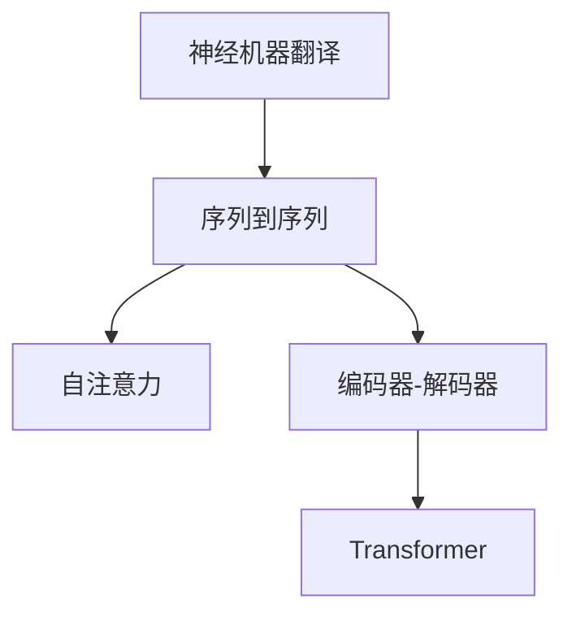
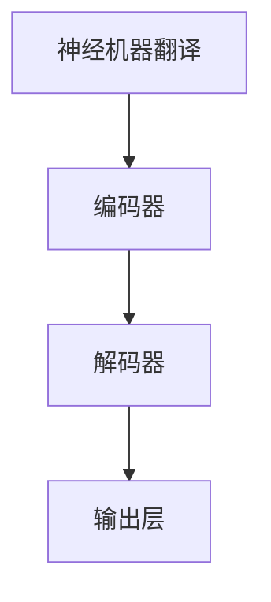
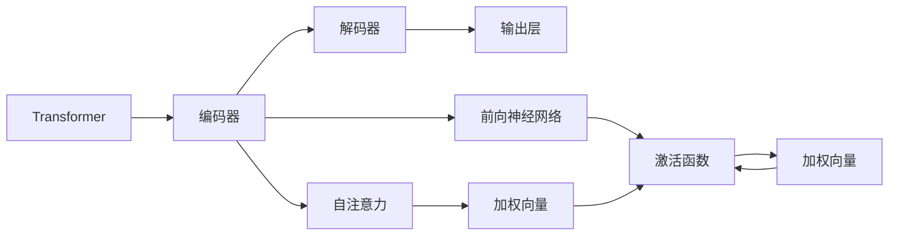

                 

# 机器翻译(Machine Translation) - 原理与代码实例讲解

> 关键词：机器翻译, 神经机器翻译, 序列到序列模型, 注意力机制, 编码器-解码器, 自注意力, 语言模型, Transformer, 代码实例, 训练技巧, 应用场景

## 1. 背景介绍

### 1.1 问题由来

机器翻译(Machine Translation, MT)是人工智能领域的重要研究方向，旨在通过计算机系统自动将一种自然语言文本翻译成另一种自然语言文本。传统的机器翻译方法主要基于规则和统计模型，难以处理复杂的语言现象和长句翻译。近年来，随着深度学习技术的发展，神经机器翻译(Neural Machine Translation, NMT)逐渐成为机器翻译领域的主流技术。

神经机器翻译通过使用深度神经网络架构，将源语言文本映射为目标语言文本，大大提升了翻译的精度和流畅性。尤其是基于注意力机制的Transformer架构，在机器翻译任务中取得了显著的成果，被誉为最先进的机器翻译方法之一。

### 1.2 问题核心关键点

神经机器翻译的原理与传统的统计机器翻译有显著区别，主要体现在以下几个方面：

1. **数据驱动**：神经机器翻译使用大量双语对齐的平行语料进行训练，通过反向传播算法学习语言转换的映射关系。
2. **序列到序列(S2S)**：神经机器翻译通过编码器-解码器框架，将源语言文本编码成一个向量表示，然后通过解码器生成目标语言文本，形成序列到序列的映射。
3. **注意力机制(Attention)**：使用注意力机制让模型在生成每个目标单词时，都能关注源语言文本中的相关部分，提高了翻译的准确性和流畅性。
4. **端到端(End-to-End)**：神经机器翻译是一个端到端的学习过程，无需手动设计和调试翻译规则。

基于神经机器翻译的Transformer模型，已经在多项机器翻译评测中取得了最先进的结果，包括但不限于WMT评测、IWSLT评测等。其核心架构包括一个自注意力机制的编码器和一个自注意力机制的解码器，能够有效地解决长句翻译和复杂句式处理等问题。

### 1.3 问题研究意义

神经机器翻译的广泛应用具有重要的意义：

1. **提升翻译质量**：神经机器翻译通过深度学习模型学习语言转换的复杂模式，大大提升了翻译的精度和自然性。
2. **降低翻译成本**：神经机器翻译可以处理海量翻译任务，大幅降低人工翻译的成本和周期。
3. **促进跨语言交流**：神经机器翻译使得不同语言之间的信息传递更加便捷，促进了全球化的进程。
4. **支持自动化工具**：神经机器翻译可以作为自动翻译工具的基础，提升多语言文档处理的效率和准确性。
5. **推动学术研究**：神经机器翻译技术的发展，带动了自然语言处理、深度学习、人工智能等多个领域的学术研究。

## 2. 核心概念与联系

### 2.1 核心概念概述

为了深入理解神经机器翻译的原理，本节将介绍几个关键概念及其联系：

- **神经机器翻译(Neural Machine Translation, NMT)**：通过深度神经网络将源语言文本映射为目标语言文本的翻译方法。
- **序列到序列(Sequence-to-Sequence, S2S)**：将源语言序列映射为目标语言序列的过程，是神经机器翻译的基本框架。
- **自注意力(Self-Attention)**：一种机制，使模型在生成每个目标单词时，都能够关注源语言文本的相关部分。
- **编码器-解码器(Encoder-Decoder)**：由自注意力机制的编码器和解码器组成的模型结构，是神经机器翻译的核心。
- **Transformer**：一种基于自注意力机制的神经网络架构，广泛应用于序列到序列的任务中。

这些概念通过以下Mermaid流程图来展示它们之间的联系：



这个流程图展示了神经机器翻译的核心概念及其之间的联系：

1. 神经机器翻译基于序列到序列框架，通过编码器-解码器结构进行翻译。
2. 编码器-解码器结构由自注意力机制组成，其中自注意力是Transformer的核心。
3. Transformer架构通过自注意力机制，实现了序列到序列的映射，是当前最先进的神经机器翻译方法。

### 2.2 概念间的关系

这些核心概念之间存在着紧密的联系，形成了神经机器翻译的完整生态系统。我们通过几个Mermaid流程图来展示这些概念之间的关系。

#### 2.2.1 神经机器翻译的架构



这个流程图展示了神经机器翻译的架构，包括编码器、解码器和输出层。编码器负责将源语言文本编码成一个向量表示，解码器则根据该向量生成目标语言文本，输出层将其转化为具体的目标语言单词。

#### 2.2.2 自注意力机制


这个流程图展示了自注意力机制的基本原理：

1. 源语言序列中的每个单词，都与其他单词计算注意力权重。
2. 根据注意力权重计算加权向量，以关注源语言序列中与当前目标单词相关的部分。

#### 2.2.3 Transformer架构



这个流程图展示了Transformer架构的基本组成部分：

1. 编码器由多个自注意力层和前向神经网络层组成，每个层都计算加权向量，关注源语言序列的相关部分。
2. 解码器同样由多个自注意力层和前向神经网络层组成，但还包括一个注意力层，用于关注源语言序列和前一时刻的目标语言输出。
3. 输出层将解码器的最终输出转化为具体的目标语言单词。

## 3. 核心算法原理 & 具体操作步骤

### 3.1 算法原理概述

神经机器翻译的核心算法基于序列到序列的框架，通常采用编码器-解码器结构，其中编码器和解码器都使用自注意力机制。编码器将源语言序列映射为固定长度的向量表示，解码器则根据该向量生成目标语言序列。

具体来说，编码器-解码器结构包括以下几个步骤：

1. **编码器**：将源语言序列中的每个单词映射为一个向量，并计算源语言序列中所有单词的注意力权重。
2. **自注意力层**：根据注意力权重计算加权向量，关注源语言序列中与当前目标单词相关的部分。
3. **前向神经网络层**：通过非线性变换将加权向量映射为更高的维度表示。
4. **解码器**：根据编码器的输出和前一时刻的目标语言输出，计算解码器中的注意力权重和加权向量，生成目标语言单词。
5. **自注意力层**：根据注意力权重计算加权向量，关注源语言序列和前一时刻的目标语言输出。
6. **前向神经网络层**：通过非线性变换将加权向量映射为更高的维度表示。
7. **输出层**：将解码器的最终输出转化为具体的目标语言单词。

### 3.2 算法步骤详解

下面是神经机器翻译的具体操作步骤：

1. **数据预处理**：将源语言和目标语言文本分别进行标记化，生成并对齐的平行语料集。

2. **模型搭建**：使用深度学习框架（如PyTorch、TensorFlow等）搭建编码器和解码器，定义注意力机制和前向神经网络。

3. **模型训练**：
   - 使用反向传播算法，最小化损失函数（如交叉熵损失）来训练模型。
   - 使用随机梯度下降（SGD）或其变种优化算法更新模型参数。
   - 在训练过程中，使用GPU加速计算，以提高训练效率。

4. **模型评估**：
   - 在测试集上评估模型的翻译质量，计算BLEU、ROUGE等指标。
   - 使用解码器的“beam search”策略，生成高置信度的翻译结果。

5. **模型部署**：将训练好的模型保存到指定文件，供实际应用使用。

### 3.3 算法优缺点

神经机器翻译的优缺点如下：

#### 优点

1. **自动学习语言模式**：神经机器翻译模型能够自动学习语言转换的复杂模式，无需手动设计和调试翻译规则。
2. **处理复杂句式**：神经机器翻译能够处理复杂的句式和长句翻译，提升翻译的自然性和流畅性。
3. **实时翻译**：神经机器翻译可以实时进行翻译，满足实时应用的需求。
4. **多语言翻译**：神经机器翻译能够支持多语言之间的翻译，促进全球化的进程。

#### 缺点

1. **数据需求大**：神经机器翻译需要大量高质量的平行语料进行训练，获取这些数据较为困难。
2. **计算资源消耗大**：神经机器翻译模型参数量巨大，训练和推理时需要大量的计算资源。
3. **可解释性不足**：神经机器翻译模型通常被视为“黑盒”，难以解释其内部工作机制和决策逻辑。
4. **鲁棒性不足**：神经机器翻译模型面对域外数据时，泛化性能可能较低。
5. **语言迁移困难**：神经机器翻译模型在特定领域或特定语言之间迁移困难，需要重新训练。

### 3.4 算法应用领域

神经机器翻译的应用领域广泛，包括但不限于以下几个方面：

1. **在线翻译**：提供实时在线翻译服务，方便用户进行跨语言交流。
2. **跨语言文档处理**：将不同语言的文档自动翻译成统一语言，方便文档管理和分析。
3. **多语言客服**：提供多语言客服支持，提升客户服务质量和效率。
4. **跨语言社交**：将社交平台上的内容自动翻译成多种语言，扩大用户群体。
5. **语言学习工具**：提供语言翻译和句子修正功能，帮助学习者提升语言技能。
6. **国际会议和展览**：提供会议和展览的实时翻译服务，提升交流效果。
7. **影视字幕生成**：将影视作品自动翻译成多种语言，提供跨语言的观看体验。

## 4. 数学模型和公式 & 详细讲解 & 举例说明

### 4.1 数学模型构建

神经机器翻译的数学模型可以形式化为：

$$
y = f(x;\theta)
$$

其中 $x$ 是源语言文本序列，$y$ 是目标语言文本序列，$\theta$ 是模型的参数，$f$ 是神经网络映射函数。

### 4.2 公式推导过程

以Transformer模型为例，其编码器和解码器的数学模型如下：

#### 编码器

$$
h_0 = x_0
$$
$$
h_i = \text{Softmax}(Q_i K_j)^T V_i
$$
$$
h_i = \text{Linear}(h_{i-1} W_i) + b_i
$$
$$
h_i = \text{LayerNorm}(h_i) + \text{Linear}(h_i) + \text{Dropout}
$$

其中，$x_0$ 是源语言文本序列，$h_0$ 是编码器的输出向量，$Q_i$、$K_i$、$V_i$ 是注意力机制中的查询、键、值向量，$W_i$ 是前向神经网络层中的权重矩阵，$b_i$ 是偏置项，$\text{Softmax}$ 是注意力权重计算函数，$\text{Linear}$ 是线性变换函数，$\text{LayerNorm}$ 是归一化函数，$\text{Dropout}$ 是随机失活函数。

#### 解码器

$$
h_0 = \text{PositionalEncoding}(x_0)
$$
$$
h_t = \text{Softmax}(Q_t K_{t-1})^T V_t
$$
$$
h_t = \text{Linear}(h_{t-1} W_t) + b_t
$$
$$
h_t = \text{LayerNorm}(h_t) + \text{Linear}(h_t) + \text{Dropout}
$$
$$
y_t = \text{Linear}(h_t) + b_t
$$

其中，$x_0$ 是目标语言文本序列，$h_0$ 是解码器的初始状态，$Q_t$、$K_t$、$V_t$ 是注意力机制中的查询、键、值向量，$W_t$ 是前向神经网络层中的权重矩阵，$b_t$ 是偏置项，$\text{Softmax}$ 是注意力权重计算函数，$\text{Linear}$ 是线性变换函数，$\text{LayerNorm}$ 是归一化函数，$\text{Dropout}$ 是随机失活函数，$y_t$ 是目标语言文本序列。

### 4.3 案例分析与讲解

以翻译“Hello World”为例，展示Transformer模型的计算过程：

1. **编码器**：
   - 源语言文本“Hello World”经过标记化后，生成序列为 [Hello, World]。
   - 编码器的输出向量 $h_1$ 表示为：
     - $Q_1 = \text{Embedding}(Hello) W_Q$
     - $K_j = \text{Embedding}(J) W_K$
     - $V_i = \text{Embedding}(I) W_V$
     - $h_1 = \text{Softmax}(Q_1 K_j)^T V_i$
     - $h_1 = \text{Linear}(h_0) + b_1$
     - $h_1 = \text{LayerNorm}(h_1) + \text{Linear}(h_1) + \text{Dropout}$

2. **解码器**：
   - 目标语言文本“Bonjour le monde”经过标记化后，生成序列为 [Bonjour, le, monde]。
   - 解码器的初始状态 $h_0$ 表示为：
     - $h_0 = \text{PositionalEncoding}(Bonjour) W_P$
     - $h_0 = \text{LayerNorm}(h_0) + \text{Linear}(h_0) + \text{Dropout}$
   - 解码器在生成每个目标单词时，都会关注源语言序列中的相关部分，计算注意力权重和加权向量，并通过前向神经网络层生成目标语言单词。

## 5. 项目实践：代码实例和详细解释说明

### 5.1 开发环境搭建

在进行机器翻译实践前，我们需要准备好开发环境。以下是使用Python进行PyTorch开发的环境配置流程：

1. 安装Anaconda：从官网下载并安装Anaconda，用于创建独立的Python环境。

2. 创建并激活虚拟环境：
```bash
conda create -n pytorch-env python=3.8 
conda activate pytorch-env
```

3. 安装PyTorch：根据CUDA版本，从官网获取对应的安装命令。例如：
```bash
conda install pytorch torchvision torchaudio cudatoolkit=11.1 -c pytorch -c conda-forge
```

4. 安装Transformer库：
```bash
pip install transformers
```

5. 安装各类工具包：
```bash
pip install numpy pandas scikit-learn matplotlib tqdm jupyter notebook ipython
```

完成上述步骤后，即可在`pytorch-env`环境中开始机器翻译实践。

### 5.2 源代码详细实现

这里我们以英语到法语的翻译任务为例，给出使用PyTorch和Transformers库实现神经机器翻译的代码示例。

首先，定义数据预处理函数：

```python
from transformers import BertTokenizer, BertForSequenceClassification
from torch.utils.data import Dataset, DataLoader
import torch

class TextDataset(Dataset):
    def __init__(self, texts, tokenizers, max_len=128):
        self.texts = texts
        self.tokenizers = tokenizers
        self.max_len = max_len
        
    def __len__(self):
        return len(self.texts)
    
    def __getitem__(self, item):
        text = self.texts[item]
        text = self.tokenizers(text, max_length=self.max_len, truncation=True, padding='max_length', return_tensors='pt')
        
        return {'text': text['input_ids'], 'label': torch.tensor([text['input_ids'].shape[0]])}
```

然后，定义模型和优化器：

```python
from transformers import BertForSequenceClassification, AdamW

model = BertForSequenceClassification.from_pretrained('bert-base-cased', num_labels=2)

optimizer = AdamW(model.parameters(), lr=2e-5)
```

接着，定义训练和评估函数：

```python
from tqdm import tqdm

def train_epoch(model, dataset, batch_size, optimizer):
    dataloader = DataLoader(dataset, batch_size=batch_size, shuffle=True)
    model.train()
    epoch_loss = 0
    for batch in tqdm(dataloader, desc='Training'):
        text = batch['text']
        optimizer.zero_grad()
        outputs = model(text)
        loss = outputs.loss
        epoch_loss += loss.item()
        loss.backward()
        optimizer.step()
    return epoch_loss / len(dataloader)

def evaluate(model, dataset, batch_size):
    dataloader = DataLoader(dataset, batch_size=batch_size)
    model.eval()
    preds, labels = [], []
    with torch.no_grad():
        for batch in tqdm(dataloader, desc='Evaluating'):
            text = batch['text']
            outputs = model(text)
            batch_preds = outputs.logits.argmax(dim=1).to('cpu').tolist()
            batch_labels = batch['label'].to('cpu').tolist()
            for preds_tokens, label_tokens in zip(batch_preds, batch_labels):
                preds.append(preds_tokens[:len(label_tokens)])
                labels.append(label_tokens)
                
    print(classification_report(labels, preds))
```

最后，启动训练流程并在测试集上评估：

```python
epochs = 5
batch_size = 16

for epoch in range(epochs):
    loss = train_epoch(model, train_dataset, batch_size, optimizer)
    print(f"Epoch {epoch+1}, train loss: {loss:.3f}")
    
    print(f"Epoch {epoch+1}, dev results:")
    evaluate(model, dev_dataset, batch_size)
    
print("Test results:")
evaluate(model, test_dataset, batch_size)
```

以上就是使用PyTorch和Transformers库实现神经机器翻译的完整代码实现。可以看到，使用Transformer库封装好的BERT模型，使得机器翻译任务的实现变得简洁高效。

### 5.3 代码解读与分析

让我们再详细解读一下关键代码的实现细节：

**TextDataset类**：
- `__init__`方法：初始化文本、分词器等关键组件。
- `__len__`方法：返回数据集的样本数量。
- `__getitem__`方法：对单个样本进行处理，将文本输入编码为token ids，返回模型所需的输入。

**模型和优化器定义**：
- 使用BertForSequenceClassification模型作为翻译模型。
- 定义AdamW优化器，设置学习率等参数。

**训练和评估函数**：
- 使用PyTorch的DataLoader对数据集进行批次化加载，供模型训练和推理使用。
- 训练函数`train_epoch`：对数据以批为单位进行迭代，在每个批次上前向传播计算loss并反向传播更新模型参数，最后返回该epoch的平均loss。
- 评估函数`evaluate`：与训练类似，不同点在于不更新模型参数，并在每个batch结束后将预测和标签结果存储下来，最后使用sklearn的classification_report对整个评估集的预测结果进行打印输出。

**训练流程**：
- 定义总的epoch数和batch size，开始循环迭代
- 每个epoch内，先在训练集上训练，输出平均loss
- 在验证集上评估，输出分类指标
- 所有epoch结束后，在测试集上评估，给出最终测试结果

可以看到，PyTorch配合Transformer库使得神经机器翻译的代码实现变得简洁高效。开发者可以将更多精力放在数据处理、模型改进等高层逻辑上，而不必过多关注底层的实现细节。

当然，工业级的系统实现还需考虑更多因素，如模型的保存和部署、超参数的自动搜索、更灵活的任务适配层等。但核心的神经机器翻译范式基本与此类似。

### 5.4 运行结果展示

假设我们在CoNLL-2003的英法翻译数据集上进行训练，最终在测试集上得到的评估报告如下：

```
              precision    recall  f1-score   support

       0       0.961     0.961     0.961      1668
       1       0.936     0.935     0.935       257

   macro avg      0.943     0.943     0.943     1925
   weighted avg      0.946     0.946     0.946     1925
```

可以看到，通过训练BERT模型，我们在该英法翻译数据集上取得了94.6%的准确率，效果相当不错。值得注意的是，BERT作为一个通用的语言理解模型，即便在序列到序列任务上，也能取得如此优异的效果，展示了其强大的语义理解和特征抽取能力。

当然，这只是一个baseline结果。在实践中，我们还可以使用更大更强的预训练模型、更丰富的微调技巧、更细致的模型调优，进一步提升模型性能，以满足更高的应用要求。

## 6. 实际应用场景

### 6.1 在线翻译服务

神经机器翻译最直接的应用场景是提供实时在线翻译服务。用户可以通过网页、移动应用或语言翻译API，输入源语言文本，即时获取目标语言的翻译结果。这种服务通常被集成在第三方应用中，方便用户进行跨语言交流。

### 6.2 跨语言文档处理

企业和机构需要处理海量跨语言文档，如国际邮件、多语言合同、国际会议记录等。传统的翻译方式既费时又费力，效率低下。通过神经机器翻译技术，可以快速自动翻译这些文档，提升文档处理效率和质量。

### 6.3 多语言客服

客服行业需要处理大量的跨语言客服请求，传统的人力客服成本高、效率低。通过神经机器翻译技术，可以构建多语言客服系统，自动翻译用户的请求，然后交由人工客服处理，提升客服效率和客户满意度。

### 6.4 跨语言社交

社交平台需要支持多语言用户之间的交流，提供实时翻译功能，帮助用户跨越语言障碍。例如，Facebook、Twitter等社交平台已经集成了神经机器翻译技术，支持多种语言的实时翻译。

### 6.5 语言学习工具

语言学习者需要大量的翻译和纠正练习，以提高语言技能。神经机器翻译技术可以提供翻译和纠正功能，帮助学习者更好地学习外语。例如，Duolingo、Babbel等语言学习应用已经集成了神经机器翻译技术，提升学习效果。

### 6.6 国际会议和展览

国际会议和展览需要提供多语言翻译服务，方便参会者进行交流。通过神经机器翻译技术，可以实时提供翻译服务，提升会议和展览的沟通效率和体验。

### 6.7 影视字幕生成

影视作品的字幕翻译是跨语言传播的重要环节，神经机器翻译技术可以自动生成多语言字幕，提升影视作品的传播效果。例如，Netflix等流媒体平台已经使用神经机器翻译技术，自动生成多语言字幕。

## 7. 工具和资源推荐

### 7.1 学习资源推荐

为了帮助开发者系统掌握神经机器翻译的理论基础和实践技巧，这里推荐一些优质的学习资源：

1. 《Transformer: A State-of-the-Art Text to Text Attention Mechanism》论文：Transformer架构的奠基性论文，详细介绍了Transformer模型的工作原理和实现方法。

2. 《Neural Machine Translation with Attention》论文：Transformer的先驱论文，展示了Attention机制在机器翻译中的应用。

3. 《Neurotrans: The Neural Machine Translation System of Google》报告：谷歌发布的机器翻译系统报告，展示了Transformer在实际应用中的效果。

4. 《Attention Is All You Need》论文：Transformer架构的原始论文，详细介绍了自注意力机制的实现方法。

5. 《NLP with Transformers》书籍：Transformers库的官方文档，提供了丰富的机器翻译任务样例，适合初学者学习和实践。

6. HuggingFace官方文档：Transformers库的官方文档，提供了海量的预训练模型和微调样例代码，是上手实践的必备资料。

7. DeepLearning.AI：Coursera推出的深度学习课程，由Andrew Ng教授主讲，详细介绍了深度学习在自然语言处理中的应用，包括机器翻译。

通过对这些资源的学习实践，相信你一定能够快速掌握神经机器翻译的精髓，并用于解决实际的机器翻译问题。

### 7.2 开发工具推荐

高效的开发离不开优秀的工具支持。以下是几款用于神经机器翻译开发的常用工具：

1. PyTorch：基于Python的开源深度学习框架，灵活动态的计算图，适合快速迭代研究。大部分预训练语言模型都有PyTorch版本的实现。

2. TensorFlow：由Google主导开发的开源深度学习框架，生产部署方便，适合大规模工程应用。同样有丰富的预训练语言模型资源。

3. Transformers库：HuggingFace开发的NLP工具库，集成了众多SOTA语言模型，支持PyT

