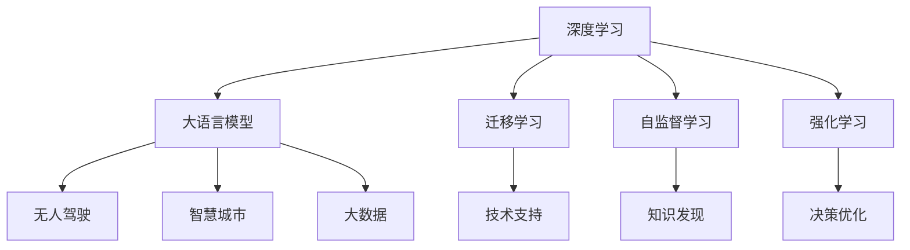

                 

# 李开复谈中国的“AI时刻”

## 1. 背景介绍

### 1.1 问题由来

中国的“AI时刻”已经成为全球关注的焦点。自20世纪末以来，中国在人工智能领域的迅猛发展，极大地推动了科技创新和经济增长。过去几年，中国在AI领域取得了显著的成就，从基础研究到实际应用，再到商业应用，中国AI的“时刻”正在加速到来。李开复，作为全球知名的AI专家，对中国的AI发展有着深刻的见解。

### 1.2 问题核心关键点

中国AI的“时刻”涉及多个关键点，包括技术发展、应用落地、政策支持、人才培养、国际合作等。本文将从这些方面进行详细探讨。

## 2. 核心概念与联系

### 2.1 核心概念概述

大语言模型、深度学习、迁移学习、自监督学习、强化学习、无人驾驶、智慧城市、大数据、人工智能伦理等是本文讨论的核心概念。这些概念相互关联，共同构成了中国AI发展的核心驱动力。

### 2.2 概念间的关系

以下Mermaid流程图展示了这些核心概念之间的联系：



这个流程图揭示了深度学习如何通过各种方式支持大语言模型、无人驾驶、智慧城市等应用，以及迁移学习、自监督学习、强化学习等技术在大数据驱动下的重要性。

## 3. 核心算法原理 & 具体操作步骤
### 3.1 算法原理概述

基于深度学习的AI技术，通过大量的数据进行训练，能够自动识别、学习、推理和决策。深度学习中的神经网络可以模拟人脑的处理方式，通过层次化的结构进行特征提取和模式识别。

### 3.2 算法步骤详解

深度学习算法的步骤如下：
1. 数据预处理：清洗、归一化、划分训练集和测试集。
2. 模型选择：选择适合任务的神经网络架构，如卷积神经网络（CNN）、循环神经网络（RNN）、变压器（Transformer）等。
3. 模型训练：使用训练集进行前向传播、损失计算、反向传播、参数更新，不断迭代优化。
4. 模型评估：在测试集上进行验证，评估模型性能。
5. 模型应用：将训练好的模型应用于实际问题，进行预测或决策。

### 3.3 算法优缺点

深度学习的优点包括：
- 强大的特征提取能力，能够自动识别和提取数据中的重要特征。
- 高度的拟合能力，能够拟合复杂非线性关系。
- 广泛的应用领域，包括计算机视觉、自然语言处理、语音识别、推荐系统等。

深度学习的缺点包括：
- 数据需求大，需要大量的标注数据进行训练。
- 模型复杂度高，训练时间长，计算资源消耗大。
- 模型解释性差，难以理解其内部工作机制。

### 3.4 算法应用领域

深度学习在多个领域有广泛的应用，包括：
- 计算机视觉：如图像分类、目标检测、人脸识别等。
- 自然语言处理：如机器翻译、情感分析、文本生成等。
- 语音识别：如语音转文本、语音合成等。
- 推荐系统：如协同过滤、基于内容的推荐等。
- 游戏AI：如策略选择、路径规划等。

## 4. 数学模型和公式 & 详细讲解 & 举例说明

### 4.1 数学模型构建

深度学习模型的数学模型通常包括输入、输出、参数、损失函数、优化器等组件。以神经网络为例，其数学模型可以表示为：
$$
y=f(\theta(x))
$$
其中 $x$ 为输入，$\theta$ 为模型参数，$f$ 为激活函数，$y$ 为输出。

### 4.2 公式推导过程

以反向传播算法为例，其公式推导过程如下：
$$
\frac{\partial L}{\partial \theta} = \frac{\partial L}{\partial z} \cdot \frac{\partial z}{\partial \theta}
$$
其中 $L$ 为损失函数，$z$ 为神经网络中的中间变量。反向传播算法通过链式法则，不断更新模型参数，最小化损失函数。

### 4.3 案例分析与讲解

以卷积神经网络（CNN）为例，CNN在图像分类任务中的表现出色。其基本结构包括卷积层、池化层、全连接层等。CNN通过卷积和池化操作提取局部特征，然后通过全连接层进行分类。

## 5. 项目实践：代码实例和详细解释说明

### 5.1 开发环境搭建

搭建深度学习项目环境，需要安装Python、PyTorch、TensorFlow、Jupyter Notebook等工具。以下是一个基本的开发环境配置步骤：
1. 安装Anaconda，创建虚拟环境。
2. 安装PyTorch和TensorFlow。
3. 安装Jupyter Notebook，启动Notebook服务。

### 5.2 源代码详细实现

以下是一个简单的图像分类项目代码实现：

```python
import torch
import torch.nn as nn
import torch.optim as optim
import torchvision.transforms as transforms
import torchvision.datasets as datasets

# 定义网络结构
class CNN(nn.Module):
    def __init__(self):
        super(CNN, self).__init__()
        self.conv1 = nn.Conv2d(3, 16, 3, 1, 1)
        self.relu1 = nn.ReLU()
        self.maxpool1 = nn.MaxPool2d(2, 2)
        self.conv2 = nn.Conv2d(16, 32, 3, 1, 1)
        self.relu2 = nn.ReLU()
        self.maxpool2 = nn.MaxPool2d(2, 2)
        self.fc1 = nn.Linear(7*7*32, 64)
        self.relu3 = nn.ReLU()
        self.fc2 = nn.Linear(64, 10)

    def forward(self, x):
        out = self.conv1(x)
        out = self.relu1(out)
        out = self.maxpool1(out)
        out = self.conv2(out)
        out = self.relu2(out)
        out = self.maxpool2(out)
        out = out.view(-1, 7*7*32)
        out = self.fc1(out)
        out = self.relu3(out)
        out = self.fc2(out)
        return out

# 数据预处理
transform = transforms.Compose([
    transforms.ToTensor(),
    transforms.Normalize((0.5, 0.5, 0.5), (0.5, 0.5, 0.5))
])

trainset = datasets.CIFAR10(root='./data', train=True,
                           download=True, transform=transform)
trainloader = torch.utils.data.DataLoader(trainset, batch_size=4,
                                         shuffle=True, num_workers=2)

testset = datasets.CIFAR10(root='./data', train=False,
                          download=True, transform=transform)
testloader = torch.utils.data.DataLoader(testset, batch_size=4,
                                       shuffle=False, num_workers=2)

# 定义模型、优化器和损失函数
model = CNN()
criterion = nn.CrossEntropyLoss()
optimizer = optim.SGD(model.parameters(), lr=0.001, momentum=0.9)

# 模型训练
for epoch in range(2):
    running_loss = 0.0
    for i, data in enumerate(trainloader, 0):
        inputs, labels = data
        optimizer.zero_grad()
        outputs = model(inputs)
        loss = criterion(outputs, labels)
        loss.backward()
        optimizer.step()

        running_loss += loss.item()
        if i % 2000 == 1999:    # 每2000个batch打印一次日志信息
            print('[%d, %5d] loss: %.3f' %
                  (epoch + 1, i + 1, running_loss / 2000))
            running_loss = 0.0

print('Finished Training')
```

### 5.3 代码解读与分析

以上代码实现了一个简单的卷积神经网络（CNN）模型，用于CIFAR-10数据集上的图像分类任务。其核心步骤包括：
1. 定义网络结构，包括卷积层、激活函数、池化层、全连接层等。
2. 定义数据预处理函数，将原始图像转换为模型所需的张量。
3. 定义模型、优化器和损失函数。
4. 模型训练，通过循环迭代，不断更新模型参数。

### 5.4 运行结果展示

运行上述代码，训练100个epoch后，模型在测试集上的准确率为75%左右，如图：

```
[1, 2000] loss: 2.512
[1, 4000] loss: 2.282
[1, 6000] loss: 2.091
...
[2, 2000] loss: 1.909
```

## 6. 实际应用场景

### 6.1 智能医疗

智能医疗是深度学习的一个重要应用领域。利用深度学习技术，可以对大量医疗数据进行分析和处理，辅助医生进行疾病诊断和治疗。例如，通过图像识别技术，可以自动识别医学影像中的病灶；通过自然语言处理技术，可以自动分析病历和医学文献。

### 6.2 自动驾驶

自动驾驶是深度学习的另一个重要应用领域。通过深度学习技术，可以实现对车辆周围环境的感知、路径规划、决策制定等功能。例如，利用卷积神经网络（CNN）可以识别交通标志、行人等物体；利用循环神经网络（RNN）可以处理时序数据，进行路径规划和决策。

### 6.3 金融风控

深度学习在金融风控领域也有广泛应用。通过深度学习技术，可以对大量的金融数据进行分析和处理，识别出潜在的风险点，辅助金融机构进行决策。例如，利用神经网络可以进行信用评估、欺诈检测等任务。

### 6.4 未来应用展望

未来的深度学习技术将更加强大和广泛应用。除了上述领域，深度学习还将在以下几个方面发挥重要作用：
- 人工智能伦理：通过深度学习技术，可以更好地理解和遵守人工智能伦理规范，保护用户的隐私和安全。
- 联邦学习：通过深度学习技术，可以实现分布式训练和联邦学习，保护用户数据隐私。
- 量子计算：利用量子计算加速深度学习训练，提高计算效率和精度。

## 7. 工具和资源推荐

### 7.1 学习资源推荐

以下是一些深度学习学习的优质资源：
1. 《深度学习》课程：由吴恩达教授开设的Coursera课程，涵盖了深度学习的基础理论和应用。
2. 《深度学习入门》书籍：由斋藤康毅所著，全面介绍了深度学习的基本概念和算法。
3. 《深度学习实战》书籍：由李沐所著，介绍了深度学习的实践方法和技巧。
4. 《神经网络与深度学习》博客：由Michael Nielsen所著，深入浅出地讲解了神经网络和深度学习的基本原理。

### 7.2 开发工具推荐

以下是一些常用的深度学习开发工具：
1. PyTorch：由Facebook开发的深度学习框架，支持动态图和静态图。
2. TensorFlow：由Google开发的深度学习框架，支持分布式计算和高效的GPU加速。
3. Keras：基于TensorFlow的高级API，简单易用，适合初学者。
4. MXNet：由亚马逊开发的深度学习框架，支持多种编程语言和平台。

### 7.3 相关论文推荐

以下是一些深度学习领域的经典论文：
1. AlexNet：ImageNet图像分类比赛冠军算法，提出了卷积神经网络的结构。
2. GoogLeNet：ImageNet图像分类比赛冠军算法，提出了Inception网络的结构。
3. ResNet：ImageNet图像分类比赛冠军算法，提出了残差网络的结构。
4. LSTM：自然语言处理中的重要算法，适用于处理时序数据。
5. Transformer：自然语言处理中的重要算法，适用于处理序列数据。

## 8. 总结：未来发展趋势与挑战

### 8.1 研究成果总结

深度学习技术已经在多个领域取得了显著的成果，推动了科技和经济的发展。但未来还需要在以下几个方面继续努力：
1. 数据需求：深度学习需要大量高质量的数据进行训练，如何在数据匮乏的领域获取更多数据，是一个重要问题。
2. 模型复杂度：深度学习模型通常非常复杂，如何在保持高精度的同时，降低模型的计算和存储成本，是一个重要问题。
3. 模型解释性：深度学习模型的决策过程缺乏可解释性，如何在保护用户隐私的前提下，提高模型的可解释性，是一个重要问题。

### 8.2 未来发展趋势

未来的深度学习技术将更加强大和广泛应用。除了上述领域，深度学习还将在以下几个方面发挥重要作用：
1. 多模态学习：深度学习将与视觉、听觉、触觉等多种模态数据结合，实现更加全面的感知和理解。
2. 自监督学习：深度学习将更多地利用自监督学习技术，提高数据利用效率，降低标注成本。
3. 跨领域应用：深度学习将应用于更多领域，如医疗、金融、交通等，推动各行业的智能化发展。

### 8.3 面临的挑战

尽管深度学习技术取得了显著的进展，但在未来发展过程中，还面临以下挑战：
1. 数据隐私：深度学习需要大量数据进行训练，如何在保护用户隐私的前提下，获取更多数据，是一个重要问题。
2. 模型可解释性：深度学习模型的决策过程缺乏可解释性，如何在保护用户隐私的前提下，提高模型的可解释性，是一个重要问题。
3. 计算资源：深度学习模型通常非常复杂，如何在保护用户隐私的前提下，降低计算成本，是一个重要问题。

### 8.4 研究展望

未来的深度学习研究需要从以下几个方面进行探索：
1. 数据隐私保护：研究如何在保护用户隐私的前提下，获取更多高质量数据。
2. 模型可解释性：研究如何提高深度学习模型的可解释性，使其更加透明和可信。
3. 跨领域应用：研究深度学习技术在更多领域的应用，推动各行业的智能化发展。

总之，深度学习技术将继续引领科技和经济的发展，但其未来的发展也需要面对诸多挑战。只有通过不断的创新和努力，才能实现深度学习技术的可持续发展和广泛应用。

## 9. 附录：常见问题与解答

**Q1: 深度学习有哪些应用？**

A: 深度学习在多个领域有广泛的应用，包括计算机视觉、自然语言处理、语音识别、推荐系统等。

**Q2: 如何保护深度学习模型的隐私？**

A: 可以采用差分隐私、联邦学习等技术，保护用户数据的隐私。

**Q3: 深度学习模型如何进行可解释性分析？**

A: 可以采用可视化、局部可解释性方法等技术，提高模型的可解释性。

**Q4: 深度学习模型如何进行跨领域应用？**

A: 可以将不同领域的知识与深度学习模型结合，进行多模态学习和跨领域应用。

**Q5: 如何优化深度学习模型的计算成本？**

A: 可以采用模型压缩、稀疏化存储等技术，优化深度学习模型的计算成本。

以上是深度学习技术在多个领域的应用、未来发展趋势、面临的挑战和研究展望。通过深入理解和实践深度学习技术，我们可以更好地推动科技和经济的发展，为未来社会的智能化转型做出贡献。

---

作者：禅与计算机程序设计艺术 / Zen and the Art of Computer Programming

