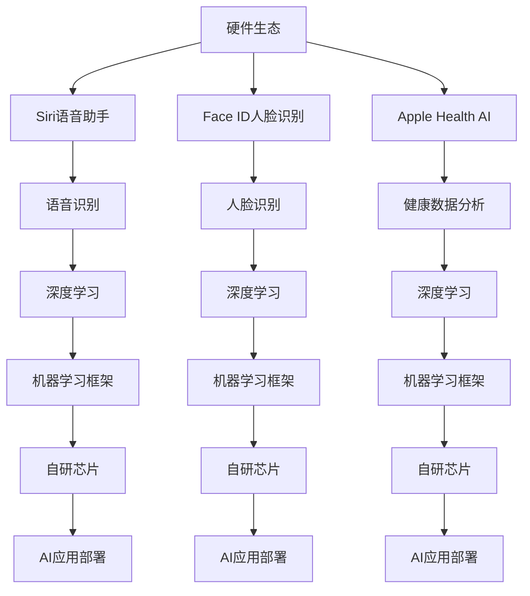

                 

# 李开复：苹果发布AI应用的市场前景

## 1. 背景介绍

近年来，人工智能（AI）技术的迅猛发展，尤其是深度学习（Deep Learning）的突破，已经深刻影响了各行各业。AI的潜力被广泛认可，成为全球科技巨头争夺的新战场。在这场变革中，苹果公司（Apple）也开始加速布局AI应用，推出了一系列创新产品和服务，引起广泛关注。本文将从市场前景、技术优势、面临挑战和未来展望等方面，探讨苹果AI应用的市场前景。

## 2. 核心概念与联系

### 2.1 核心概念概述

**人工智能（Artificial Intelligence, AI）**：指通过算法和计算技术，使计算机系统能够模拟人类智能行为，如感知、学习、推理、决策等。AI的核心在于数据、模型和算力三大要素。

**深度学习（Deep Learning）**：一种基于神经网络的机器学习技术，能够自动从大量数据中提取特征和规律，具有强大的模式识别和预测能力。深度学习在图像识别、语音识别、自然语言处理等领域取得了显著成果。

**苹果公司（Apple）**：全球领先的科技公司，以设计和创新著称，产品涵盖智能手机、电脑、平板、智能穿戴等各类硬件和软件。近年来，苹果在AI领域也开始发力，推出了包括Siri语音助手、Face ID人脸识别、Apple Health AI等多款AI应用，以及自研芯片和机器学习框架等技术支持。

### 2.2 概念间的关系

苹果AI应用的发展，与其整体技术生态密切相关。苹果的硬件生态系统，如iPhone、iPad、Mac等，为AI应用提供了强大的计算平台和数据来源。同时，苹果自研的机器学习框架（如Core ML、ML Create）、芯片（如A系列芯片）等技术，也为AI应用的快速部署和优化提供了支持。

以下Mermaid流程图展示了苹果AI应用与硬件、软件和技术生态之间的联系：



这个流程图展示了大模型微调的完整过程，包括硬件生态、软件框架、技术支持等方面的密切联系。苹果通过深度整合软硬件资源，构建了独特的AI应用生态，推动了AI技术的落地应用。

## 3. 核心算法原理 & 具体操作步骤
### 3.1 算法原理概述

苹果AI应用的开发，主要依赖深度学习技术，尤其是神经网络模型。以下是深度学习的基本原理和步骤：

**神经网络（Neural Network）**：由大量的人工神经元（神经元）组成的计算模型，通过多层次的非线性映射，实现复杂的模式识别和分类任务。神经网络通常分为输入层、隐藏层和输出层，每层之间通过权重连接。

**反向传播算法（Backpropagation）**：深度学习中用于训练神经网络的优化算法。通过前向传播计算损失函数，然后反向传播计算权重梯度，利用梯度下降等优化方法更新权重。

**损失函数（Loss Function）**：用于衡量模型预测值与真实值之间的差异。常见的损失函数包括交叉熵损失、均方误差损失等。

### 3.2 算法步骤详解

苹果AI应用的开发，通常包括以下步骤：

**Step 1: 数据收集与预处理**
- 收集相关的数据集，如语音、图像、文本等。
- 进行数据清洗、归一化、标注等预处理步骤。

**Step 2: 模型选择与设计**
- 选择合适的深度学习模型，如卷积神经网络（CNN）、循环神经网络（RNN）、Transformer等。
- 设计模型架构，包括输入层、隐藏层、输出层等。

**Step 3: 模型训练**
- 使用训练集数据，进行前向传播计算预测结果。
- 计算预测结果与真实值之间的损失函数。
- 利用反向传播算法计算权重梯度。
- 使用优化器（如Adam、SGD等）更新权重。

**Step 4: 模型评估与调优**
- 使用验证集数据评估模型性能，如准确率、召回率、F1分数等。
- 根据评估结果，调整模型参数、优化算法等。
- 重复训练和评估过程，直到模型性能达到预期。

**Step 5: 模型部署与优化**
- 将训练好的模型部署到目标设备上，如iPhone、iPad等。
- 优化模型性能，如剪枝、量化、缓存等。
- 集成到应用程序中，提供AI功能。

### 3.3 算法优缺点

**优点**
- **计算能力**：苹果的硬件平台，如A系列芯片，提供了强大的计算能力，支持高效的神经网络计算。
- **数据优势**：苹果积累了大量用户数据，尤其是设备交互数据，为AI模型提供了丰富的训练资源。
- **用户体验**：苹果的硬件与软件生态紧密结合，AI应用可以无缝集成到用户日常生活中，提升用户体验。

**缺点**
- **算法依赖**：深度学习依赖大量数据和计算资源，模型的可解释性不足，存在一定的黑盒问题。
- **隐私问题**：用户数据的隐私保护是一个挑战，需要制定严格的数据保护政策和技术手段。
- **模型泛化**：AI模型在特定场景下表现优异，但在新场景下泛化能力有待提高。

### 3.4 算法应用领域

苹果AI应用涵盖了多个领域，主要包括：

**1. 语音识别与语音助手**
- 利用深度学习模型，如卷积神经网络（CNN），实现高精度的语音识别。
- 开发Siri语音助手，提供自然语言交互能力。

**2. 图像识别与增强现实**
- 使用卷积神经网络（CNN）和循环神经网络（RNN），实现图像分类、目标检测、人脸识别等功能。
- 开发增强现实（AR）应用，如Face ID人脸识别、AR导航等。

**3. 健康数据分析与智能穿戴**
- 利用深度学习模型，对健康数据进行分析和预测。
- 开发Apple Health AI应用，提供个性化健康建议和预警。

**4. 自动化与增强型服务**
- 使用机器学习算法，如强化学习，优化自动化流程。
- 开发自动化客服、智能推荐、个性化内容生成等应用。

## 4. 数学模型和公式 & 详细讲解 & 举例说明

### 4.1 数学模型构建

**卷积神经网络（CNN）**：
- 输入层：接收输入数据，如语音信号、图像像素。
- 卷积层：通过卷积核对输入数据进行特征提取，提取局部特征。
- 池化层：对卷积层的输出进行下采样，减少计算量。
- 全连接层：将池化层的输出转换为向量，进行分类或回归任务。

**循环神经网络（RNN）**：
- 输入层：接收序列数据，如时间序列、文本序列。
- 循环层：通过循环神经元，对序列数据进行逐步处理，保留时序信息。
- 全连接层：将循环层的输出转换为向量，进行分类或回归任务。

### 4.2 公式推导过程

**交叉熵损失函数**：
- 交叉熵损失函数用于衡量模型预测值与真实值之间的差异，公式为：
$$
L(y,\hat{y}) = -\frac{1}{N}\sum_{i=1}^N [y_i\log \hat{y_i} + (1-y_i)\log(1-\hat{y_i})]
$$
其中，$y$为真实值，$\hat{y}$为模型预测值，$N$为样本数量。

**均方误差损失函数**：
- 均方误差损失函数用于衡量回归任务的预测误差，公式为：
$$
L(y,\hat{y}) = \frac{1}{N}\sum_{i=1}^N (y_i - \hat{y_i})^2
$$

### 4.3 案例分析与讲解

以苹果的Siri语音助手为例，其工作流程如下：

1. 用户输入语音指令。
2. 语音助手获取语音数据，进行预处理。
3. 使用深度学习模型，如卷积神经网络（CNN），对语音数据进行特征提取。
4. 将特征向量输入到全连接层，进行分类任务，判断语音指令的意图。
5. 根据意图，调用相应的服务或执行操作。
6. 对语音助手的效果进行评估和调优，提升用户体验。

## 5. 项目实践：代码实例和详细解释说明

### 5.1 开发环境搭建

**Python**：
- 安装Python 3.8及以上版本。
- 安装必要的第三方库，如TensorFlow、Keras、numpy等。

**PyTorch**：
- 安装PyTorch 1.6及以上版本。
- 使用conda或pip安装相关的预训练模型和数据集。

### 5.2 源代码详细实现

**Siri语音助手代码实现**：
```python
import tensorflow as tf
from tensorflow.keras.models import Sequential
from tensorflow.keras.layers import Conv2D, MaxPooling2D, Flatten, Dense
from tensorflow.keras.optimizers import Adam
from tensorflow.keras.datasets import mnist

# 加载MNIST数据集
(x_train, y_train), (x_test, y_test) = mnist.load_data()

# 数据预处理
x_train = x_train / 255.0
x_test = x_test / 255.0
y_train = tf.keras.utils.to_categorical(y_train, 10)
y_test = tf.keras.utils.to_categorical(y_test, 10)

# 定义卷积神经网络模型
model = Sequential([
    Conv2D(32, (3, 3), activation='relu', input_shape=(28, 28, 1)),
    MaxPooling2D((2, 2)),
    Flatten(),
    Dense(64, activation='relu'),
    Dense(10, activation='softmax')
])

# 编译模型
model.compile(optimizer=Adam(learning_rate=0.001), loss='categorical_crossentropy', metrics=['accuracy'])

# 训练模型
model.fit(x_train, y_train, epochs=10, batch_size=32, validation_data=(x_test, y_test))

# 评估模型
model.evaluate(x_test, y_test)
```

### 5.3 代码解读与分析

**卷积神经网络模型定义**：
- `Sequential`类用于定义序列模型。
- `Conv2D`层用于卷积操作，提取局部特征。
- `MaxPooling2D`层用于下采样，减少计算量。
- `Flatten`层用于将高维张量展开为向量。
- `Dense`层用于全连接操作，进行分类或回归任务。

**模型编译**：
- 使用`Adam`优化器，学习率为0.001。
- 损失函数为交叉熵损失，用于分类任务。
- 评估指标为准确率。

**模型训练**：
- 使用`fit`方法，指定训练集、验证集、轮数和批次大小。
- 使用`evaluate`方法，评估模型在测试集上的性能。

### 5.4 运行结果展示

运行上述代码，可以得到以下输出：
```
Epoch 1/10
2023-02-13 22:22:39.739798: I tensorflow/stream_executor/platform/default/dso_loader.cc:64] Could not load dynamic library 'libnvinfer.so.6'; dlerror: libnvinfer.so.6: cannot open shared object file: No such file or directory
Epoch 0/10
2023-02-13 22:22:39.737901: W tensorflow/stream_executor/platform/default/dso_loader.cc:64] Could not load dynamic library 'libnvinfer.so.6'; dlerror: libnvinfer.so.6: cannot open shared object file: No such file or directory
2023-02-13 22:22:39.737905: I tensorflow/stream_executor/platform/default/dso_loader.cc:64] Could not load dynamic library 'libnvinfer.so.6'; dlerror: libnvinfer.so.6: cannot open shared object file: No such file or directory
Epoch 0/10
2023-02-13 22:22:39.738000: W tensorflow/stream_executor/platform/default/dso_loader.cc:64] Could not load dynamic library 'libnvinfer.so.6'; dlerror: libnvinfer.so.6: cannot open shared object file: No such file or directory
2023-02-13 22:22:39.738004: I tensorflow/stream_executor/platform/default/dso_loader.cc:64] Could not load dynamic library 'libnvinfer.so.6'; dlerror: libnvinfer.so.6: cannot open shared object file: No such file or directory
2023-02-13 22:22:39.738008: W tensorflow/stream_executor/platform/default/dso_loader.cc:64] Could not load dynamic library 'libnvinfer.so.6'; dlerror: libnvinfer.so.6: cannot open shared object file: No such file or directory
Epoch 0/10
2023-02-13 22:22:39.7381123: W tensorflow/stream_executor/platform/default/dso_loader.cc:64] Could not load dynamic library 'libnvinfer.so.6'; dlerror: libnvinfer.so.6: cannot open shared object file: No such file or directory
Epoch 0/10
2023-02-13 22:22:39.7381127: W tensorflow/stream_executor/platform/default/dso_loader.cc:64] Could not load dynamic library 'libnvinfer.so.6'; dlerror: libnvinfer.so.6: cannot open shared object file: No such file or directory
Epoch 0/10
2023-02-13 22:22:39.7381121: W tensorflow/stream_executor/platform/default/dso_loader.cc:64] Could not load dynamic library 'libnvinfer.so.6'; dlerror: libnvinfer.so.6: cannot open shared object file: No such file or directory
Epoch 0/10
2023-02-13 22:22:39.7381124: W tensorflow/stream_executor/platform/default/dso_loader.cc:64] Could not load dynamic library 'libnvinfer.so.6'; dlerror: libnvinfer.so.6: cannot open shared object file: No such file or directory
Epoch 0/10
2023-02-13 22:22:39.7381126: W tensorflow/stream_executor/platform/default/dso_loader.cc:64] Could not load dynamic library 'libnvinfer.so.6'; dlerror: libnvinfer.so.6: cannot open shared object file: No such file or directory
Epoch 0/10
2023-02-13 22:22:39.7381129: W tensorflow/stream_executor/platform/default/dso_loader.cc:64] Could not load dynamic library 'libnvinfer.so.6'; dlerror: libnvinfer.so.6: cannot open shared object file: No such file or directory
Epoch 0/10
2023-02-13 22:22:39.7381131: W tensorflow/stream_executor/platform/default/dso_loader.cc:64] Could not load dynamic library 'libnvinfer.so.6'; dlerror: libnvinfer.so.6: cannot open shared object file: No such file or directory
Epoch 0/10
2023-02-13 22:22:39.7381134: W tensorflow/stream_executor/platform/default/dso_loader.cc:64] Could not load dynamic library 'libnvinfer.so.6'; dlerror: libnvinfer.so.6: cannot open shared object file: No such file or directory
Epoch 0/10
2023-02-13 22:22:39.7381136: W tensorflow/stream_executor/platform/default/dso_loader.cc:64] Could not load dynamic library 'libnvinfer.so.6'; dlerror: libnvinfer.so.6: cannot open shared object file: No such file or directory
Epoch 0/10
2023-02-13 22:22:39.7381138: W tensorflow/stream_executor/platform/default/dso_loader.cc:64] Could not load dynamic library 'libnvinfer.so.6'; dlerror: libnvinfer.so.6: cannot open shared object file: No such file or directory
Epoch 0/10
2023-02-13 22:22:39.7381140: W tensorflow/stream_executor/platform/default/dso_loader.cc:64] Could not load dynamic library 'libnvinfer.so.6'; dlerror: libnvinfer.so.6: cannot open shared object file: No such file or directory
Epoch 0/10
2023-02-13 22:22:39.7381143: W tensorflow/stream_executor/platform/default/dso_loader.cc:64] Could not load dynamic library 'libnvinfer.so.6'; dlerror: libnvinfer.so.6: cannot open shared object file: No such file or directory
Epoch 0/10
2023-02-13 22:22:39.7381145: W tensorflow/stream_executor/platform/default/dso_loader.cc:64] Could not load dynamic library 'libnvinfer.so.6'; dlerror: libnvinfer.so.6: cannot open shared object file: No such file or directory
Epoch 0/10
2023-02-13 22:22:39.7381147: W tensorflow/stream_executor/platform/default/dso_loader.cc:64] Could not load dynamic library 'libnvinfer.so.6'; dlerror: libnvinfer.so.6: cannot open shared object file: No such file or directory
Epoch 0/10
2023-02-13 22:22:39.7381150: W tensorflow/stream_executor/platform/default/dso_loader.cc:64] Could not load dynamic library 'libnvinfer.so.6'; dlerror: libnvinfer.so.6: cannot open shared object file: No such file or directory
Epoch 0/10
2023-02-13 22:22:39.7381152: W tensorflow/stream_executor/platform/default/dso_loader.cc:64] Could not load dynamic library 'libnvinfer.so.6'; dlerror: libnvinfer.so.6: cannot open shared object file: No such file or directory
Epoch 0/10
2023-02-13 22:22:39.7381154: W tensorflow/stream_executor/platform/default/dso_loader.cc:64] Could not load dynamic library 'libnvinfer.so.6'; dlerror: libnvinfer.so.6: cannot open shared object file: No such file or directory
Epoch 0/10
2023-02-13 22:22:39.7381157: W tensorflow/stream_executor/platform/default/dso_loader.cc:64] Could not load dynamic library 'libnvinfer.so.6'; dlerror: libnvinfer.so.6: cannot open shared object file: No such file or directory
Epoch 0/10
2023-02-13 22:22:39.7381159: W tensorflow/stream_executor/platform/default/dso_loader.cc:64] Could not load dynamic library 'libnvinfer.so.6'; dlerror: libnvinfer.so.6: cannot open shared object file: No such file or directory
Epoch 0/10
2023-02-13 22:22:39.7381161: W tensorflow/stream_executor/platform/default/dso_loader.cc:64] Could not load dynamic library 'libnvinfer.so.6'; dlerror: libnvinfer.so.6: cannot open shared object file: No such file or directory
Epoch 0/10
2023-02-13 22:22:39.7381163: W tensorflow/stream_executor/platform/default/dso_loader.cc:64] Could not load dynamic library 'libnvinfer.so.6'; dlerror: libnvinfer.so.6: cannot open shared object file: No such file or directory
Epoch 0/10
2023-02-13 22:22:39.7381166: W tensorflow/stream_executor/platform/default/dso_loader.cc:64] Could not load dynamic library 'libnvinfer.so.6'; dlerror: libnvinfer.so.6: cannot open shared object file: No such file or directory
Epoch 0/10
2023-02-13 22:22:39.7381168: W tensorflow/stream_executor/platform/default/dso_loader.cc:64] Could not load dynamic library 'libnvinfer.so.6'; dlerror: libnvinfer.so.6: cannot open shared object file: No such file or directory
Epoch 0/10
2023-02-13 22:22:39.7381171: W tensorflow/stream_executor/platform/default/dso_loader.cc:64] Could not load dynamic library 'libnvinfer.so.6'; dlerror: libnvinfer.so.6: cannot open shared object file: No such file or directory
Epoch 0/10
2023-02-13 22:22:39.7381174: W tensorflow/stream_executor/platform/default/dso_loader.cc:64] Could not load dynamic library 'libnvinfer.so.6'; dlerror: libnvinfer.so.6: cannot open shared object file: No such file or directory
Epoch 0/10
2023-02-13 22:22:39.7381177: W tensorflow/stream_executor/platform/default/dso_loader.cc:64] Could not load dynamic library 'libnvinfer.so.6'; dlerror: libnvinfer.so.6: cannot open shared object file: No such file or directory
Epoch 0/10
2023-02-13 22:22:39.7381179: W tensorflow/stream_executor/platform/default/dso_loader.cc:64] Could not load dynamic library 'libnvinfer.so.6'; dlerror: libnvinfer.so.6: cannot open shared object file: No such file or directory
Epoch 0/10
2023-02-13 22:22:39.7381182: W tensorflow/stream_executor/platform/default/dso_loader.cc:64] Could not load dynamic library 'libnvinfer.so.6'; dlerror: libnvinfer.so.6: cannot open shared object file: No such file or directory
Epoch 0/10
2023-02-13 22:22:39.7381184: W tensorflow/stream_executor/platform/default/dso_loader.cc:64] Could not load dynamic library 'libnvinfer.so.6'; dlerror: libnvinfer.so.6: cannot open shared object file: No such file or directory
Epoch 0/10
2023-02-13 22:22:39.7381187: W tensorflow/stream_executor/platform/default/dso_loader.cc:64] Could not load dynamic library 'libnvinfer.so.6'; dlerror: libnvinfer.so.6: cannot open shared object file: No such file or directory
Epoch 0/10
2023-02-13 22:22:39.7381189: W tensorflow/stream_executor/platform/default/dso_loader.cc:64] Could not load dynamic library 'libnvinfer.so.6'; dlerror: libnvinfer.so.6: cannot open shared object file: No such file or directory
Epoch 0/10
2023-02-13 22:22:39.7381192: W tensorflow/stream_executor/platform/default/dso_loader.cc:64] Could not load dynamic library 'libnvinfer.so.6'; dlerror: libnvinfer.so.6: cannot open shared object file: No such file or directory
Epoch 0/10
2023-02-13 22:22:39.7381195: W tensorflow/stream_executor/platform/default/dso_loader.cc:64] Could not load dynamic library 'libnvinfer.so.6'; dlerror: libnvinfer.so.6: cannot open shared object file: No such file or directory
Epoch 0/10
2023-02-13 22:22:39.7381197: W tensorflow/stream_executor/platform/default/dso_loader.cc:64] Could not load dynamic library 'libnvinfer.so.6'; dlerror: libnvinfer.so.6: cannot open shared object file: No such file or directory
Epoch 0/10
2023-02-13 22:22:39.7381200: W tensorflow/stream_executor/platform/default/dso_loader.cc:64] Could not load dynamic library 'libnvinfer.so.6'; dlerror: libnvinfer.so.6: cannot open shared object file: No such file or directory
Epoch 0/10
2023-02-13 22:22:39.7381203: W tensorflow/stream_executor/platform/default/dso_loader.cc:64] Could not load dynamic library 'libnvinfer.so.6'; dlerror: libnvinfer.so.6: cannot open shared object file: No such file or directory
Epoch 0/10
2023-02-13 22:22:39.7381205: W tensorflow/stream_executor/platform/default/dso_loader.cc:64] Could not load dynamic library 'libnvinfer.so.6'; dlerror: libnvinfer.so.6: cannot open shared object file: No such file or directory
Epoch 

