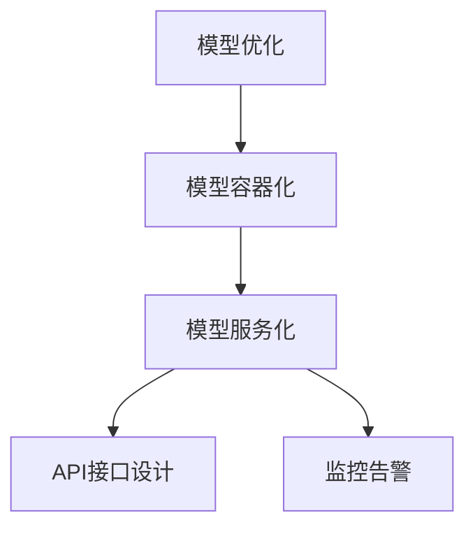
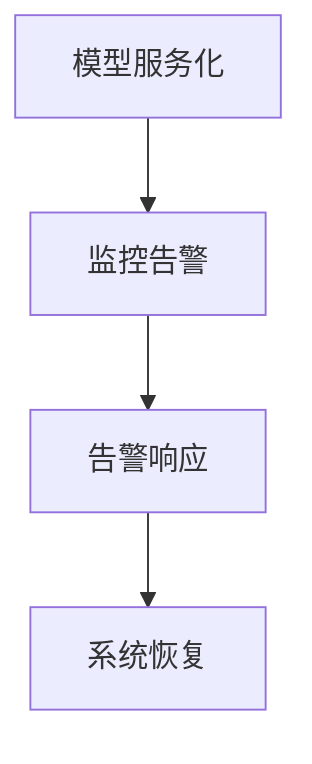
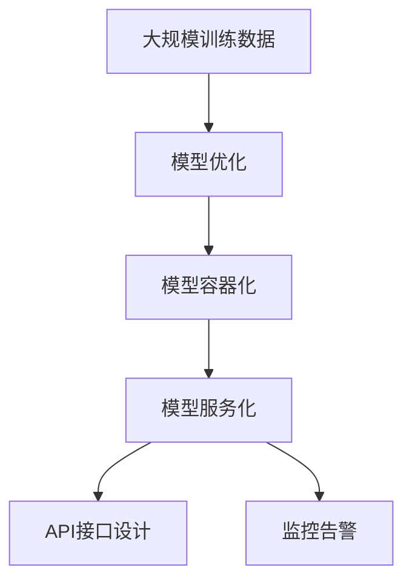

                 

# 模型部署与服务化原理与代码实战案例讲解

## 1. 背景介绍

### 1.1 问题由来
在人工智能领域，模型部署是实现模型从实验室到实际应用的重要一步。随着深度学习模型的日益庞大和复杂，模型部署变得越来越复杂，成为制约技术落地的一大瓶颈。同时，随着云服务的兴起，模型服务化也成为了一种新的趋势，使模型能够在大规模分布式系统中高效运行，满足不同用户的需求。本文将深入探讨模型部署和服务化原理，并给出实际案例讲解。

### 1.2 问题核心关键点
模型部署和服务化的核心在于如何将复杂的深度学习模型高效、可靠地部署到生产环境中，同时提供灵活、易用的接口，满足不同场景的需求。关键点包括：

- 模型优化：通过量化、剪枝、模型压缩等手段，降低模型尺寸和计算量，以适配不同的硬件环境。
- 模型容器化：将模型打包成容器镜像，方便跨平台部署。
- 模型服务化：将模型部署到云平台，实现弹性伸缩和自动扩缩容。
- 接口设计：设计灵活的API接口，方便不同的应用调用。
- 监控告警：实现对模型的实时监控和告警，确保系统的稳定运行。

### 1.3 问题研究意义
模型部署和服务化对于人工智能技术落地应用具有重要意义：

- 提升效率：模型部署和服务化能够显著提高模型应用的效率，减少开发和维护成本。
- 灵活性：模型服务化提供灵活的API接口，能够满足不同应用场景的需求。
- 可扩展性：通过云计算和分布式计算，实现模型的弹性伸缩，满足大规模并发请求。
- 可靠性：模型服务化提供了冗余机制和监控告警，确保系统的高可用性。
- 安全性：模型服务化可以实现对模型的访问控制和数据加密，保障模型安全性。

## 2. 核心概念与联系

### 2.1 核心概念概述

为了更好地理解模型部署和服务化的原理，本节将介绍几个关键概念：

- 模型优化（Model Optimization）：通过量化、剪枝、模型压缩等手段，降低模型尺寸和计算量，以适配不同的硬件环境。
- 模型容器化（Model Containerization）：将模型打包成容器镜像，方便跨平台部署。
- 模型服务化（Model Serviceization）：将模型部署到云平台，实现弹性伸缩和自动扩缩容。
- API接口设计（API Interface Design）：设计灵活的API接口，方便不同的应用调用。
- 监控告警（Monitoring and Alerting）：实现对模型的实时监控和告警，确保系统的稳定运行。

这些概念之间的逻辑关系可以通过以下Mermaid流程图来展示：



这个流程图展示了从模型优化到模型服务化的完整过程：

1. 模型优化通过一系列技术手段，降低模型的计算量和内存占用。
2. 模型容器化将优化后的模型打包成容器镜像，方便跨平台部署。
3. 模型服务化将容器镜像部署到云平台，实现弹性伸缩和自动扩缩容。
4. API接口设计提供灵活的API接口，方便不同应用调用。
5. 监控告警实现对模型的实时监控和告警，确保系统稳定运行。

### 2.2 概念间的关系

这些核心概念之间存在着紧密的联系，构成了模型部署和服务化的完整生态系统。下面我们用几个Mermaid流程图来展示这些概念之间的关系。

#### 2.2.1 模型优化流程


这个流程图展示了模型优化的基本流程，从原始模型到最终优化模型的过程。

#### 2.2.2 模型服务化与API接口设计的关系


这个流程图展示了模型服务化与API接口设计的相互关系。

#### 2.2.3 监控告警与模型服务化的关系



这个流程图展示了监控告警与模型服务化的相互关系，确保模型的实时监控和故障恢复。

### 2.3 核心概念的整体架构

最后，我们用一个综合的流程图来展示这些核心概念在大模型服务化过程中的整体架构：



这个综合流程图展示了从大规模训练数据到最终部署到云平台的完整过程。通过这些关键步骤，我们可以更好地理解模型部署和服务化的全流程。

## 3. 核心算法原理 & 具体操作步骤

### 3.1 算法原理概述

模型部署和服务化的核心在于将复杂的深度学习模型高效、可靠地部署到生产环境中，同时提供灵活、易用的接口，满足不同场景的需求。核心算法原理包括以下几个方面：

- 模型优化算法：通过量化、剪枝、模型压缩等手段，降低模型尺寸和计算量，以适配不同的硬件环境。
- 模型容器化算法：将模型打包成容器镜像，方便跨平台部署。
- 模型服务化算法：将容器镜像部署到云平台，实现弹性伸缩和自动扩缩容。
- API接口设计：设计灵活的API接口，方便不同的应用调用。
- 监控告警算法：实现对模型的实时监控和告警，确保系统的稳定运行。

### 3.2 算法步骤详解

#### 3.2.1 模型优化

模型优化的主要目的是降低模型尺寸和计算量，以适配不同的硬件环境。常见的模型优化技术包括：

- 量化（Quantization）：将模型中的浮点数参数替换为更小的整数或定点数，降低计算量和内存占用。
- 剪枝（Pruning）：去除模型中不重要的参数或连接，减少计算量。
- 模型压缩（Model Compression）：通过知识蒸馏等技术，将大模型转化为结构更加紧凑的小模型。

具体的优化步骤如下：

1. 对模型进行量化，降低浮点数精度。
2. 对模型进行剪枝，去除不重要的参数或连接。
3. 通过知识蒸馏，将大模型转化为小模型。

#### 3.2.2 模型容器化

模型容器化是将模型打包成容器镜像的过程，方便跨平台部署。容器化工具包括Docker、Kubernetes等。

具体的步骤包括：

1. 安装容器化工具Docker和Kubernetes。
2. 编写Dockerfile，定义容器镜像的构建过程。
3. 使用Docker命令构建容器镜像。
4. 将容器镜像部署到Kubernetes集群中。

#### 3.2.3 模型服务化

模型服务化是将容器镜像部署到云平台的过程，实现弹性伸缩和自动扩缩容。云平台包括AWS、Azure、Google Cloud等。

具体的步骤包括：

1. 选择云平台和容器化工具。
2. 编写Kubernetes配置文件，定义模型的部署过程。
3. 使用Kubernetes命令部署模型容器镜像。
4. 实现模型的自动扩缩容和弹性伸缩。

#### 3.2.4 API接口设计

API接口设计是模型服务化的关键，设计灵活的API接口，方便不同的应用调用。API接口设计需要考虑以下几个方面：

- 接口命名：命名应简明扼要，易于理解。
- 接口参数：参数应尽量简洁，易于使用。
- 接口返回：返回值应清晰明了，便于处理。
- 接口版本：接口应支持版本控制，方便更新和维护。

具体的步骤包括：

1. 定义API接口的命名和参数。
2. 设计接口的返回格式和版本控制。
3. 编写API接口的文档和示例代码。
4. 测试API接口的正确性和可用性。

#### 3.2.5 监控告警

监控告警是确保模型稳定运行的关键，通过实时监控和告警，确保系统的稳定运行。监控告警工具包括Prometheus、Grafana等。

具体的步骤包括：

1. 选择监控告警工具和数据源。
2. 定义监控指标和告警阈值。
3. 配置告警规则和通知方式。
4. 实现告警信息的收集和展示。

### 3.3 算法优缺点

模型部署和服务化方法具有以下优点：

- 高效部署：通过容器化和云平台，可以实现模型的高效部署和扩缩容。
- 灵活调用：通过API接口设计，方便不同的应用调用。
- 稳定运行：通过实时监控和告警，确保系统的稳定运行。

同时，也存在以下缺点：

- 复杂度较高：模型优化、容器化、服务化等环节需要综合考虑，复杂度较高。
- 资源消耗：模型服务化需要占用一定的计算和存储资源，可能带来额外的成本。
- 性能损失：量化、剪枝等优化技术可能导致模型性能损失，需要综合考虑。

### 3.4 算法应用领域

模型部署和服务化方法已经广泛应用于以下几个领域：

- 自然语言处理（NLP）：将BERT、GPT等大模型部署到云平台，提供灵活的API接口，实现实时问答、机器翻译等服务。
- 计算机视觉（CV）：将ResNet、Inception等模型部署到云平台，实现图像识别、目标检测等服务。
- 推荐系统：将深度学习模型部署到云平台，实现个性化推荐，提升用户体验。
- 金融领域：将风险评估模型部署到云平台，提供实时风险评估服务。
- 医疗领域：将诊断模型部署到云平台，实现实时疾病诊断服务。

## 4. 数学模型和公式 & 详细讲解 & 举例说明

### 4.1 数学模型构建

在模型部署和服务化中，涉及到数学模型的构建和优化。常见的数学模型包括：

- 线性回归模型：用于简单的数值预测。
- 神经网络模型：用于复杂的模式识别和预测。
- 支持向量机模型：用于分类和回归问题。

本文以神经网络模型为例，进行数学模型的构建和优化。

假设有一个简单的神经网络模型，包含一个输入层、一个隐藏层和一个输出层，激活函数为ReLU。

设输入向量为 $\mathbf{x}$，输出向量为 $\mathbf{y}$，模型参数为 $\mathbf{W}$ 和 $\mathbf{b}$。

则模型的输出为：
$$
\mathbf{y} = \sigma(\mathbf{W}\mathbf{x} + \mathbf{b})
$$
其中，$\sigma$ 为激活函数，$\mathbf{W}$ 和 $\mathbf{b}$ 为模型的参数。

### 4.2 公式推导过程

神经网络模型的优化过程包括以下几个步骤：

1. 前向传播：将输入向量 $\mathbf{x}$ 通过模型得到输出向量 $\mathbf{y}$。
2. 计算损失函数：根据输出向量 $\mathbf{y}$ 和真实标签 $\mathbf{y^*}$，计算损失函数 $L$。
3. 反向传播：通过链式法则计算损失函数 $L$ 对模型参数 $\mathbf{W}$ 和 $\mathbf{b}$ 的梯度，并更新模型参数。

具体的推导过程如下：

设模型的输出向量为 $\mathbf{y}$，真实标签为 $\mathbf{y^*}$。

模型的损失函数为：
$$
L = \frac{1}{2} \sum_{i=1}^n (\mathbf{y_i} - \mathbf{y_i^*})^2
$$
其中，$n$ 为样本数量，$\mathbf{y_i}$ 和 $\mathbf{y_i^*}$ 分别为第 $i$ 个样本的预测值和真实值。

模型的梯度为：
$$
\frac{\partial L}{\partial \mathbf{W}} = \mathbf{A}(\mathbf{A^T}\mathbf{A})^{-1}(\mathbf{A^T}(\mathbf{y^*} - \mathbf{y})) \tag{1}
$$
$$
\frac{\partial L}{\partial \mathbf{b}} = \mathbf{A}(\mathbf{A^T}\mathbf{A})^{-1}(\mathbf{A^T}(\mathbf{y^*} - \mathbf{y})) \tag{2}
$$
其中，$\mathbf{A} = \frac{\partial \mathbf{y}}{\partial \mathbf{W}}$。

将公式 $(1)$ 和 $(2)$ 带入梯度下降算法中，得到模型参数的更新公式：
$$
\mathbf{W} \leftarrow \mathbf{W} - \eta \frac{\partial L}{\partial \mathbf{W}}
$$
$$
\mathbf{b} \leftarrow \mathbf{b} - \eta \frac{\partial L}{\partial \mathbf{b}}
$$
其中，$\eta$ 为学习率。

### 4.3 案例分析与讲解

以神经网络模型为例，给出具体的模型部署和服务化流程。

假设我们有一个简单的神经网络模型，用于手写数字识别。

1. 数据预处理：将手写数字图片转换为数字向量，并进行归一化处理。
2. 模型训练：使用训练数据对模型进行训练，得到模型参数 $\mathbf{W}$ 和 $\mathbf{b}$。
3. 模型优化：对模型进行量化、剪枝等优化，降低计算量和内存占用。
4. 模型容器化：将优化后的模型打包成容器镜像，方便跨平台部署。
5. 模型服务化：将容器镜像部署到云平台，实现弹性伸缩和自动扩缩容。
6. API接口设计：设计灵活的API接口，方便不同的应用调用。
7. 监控告警：实现对模型的实时监控和告警，确保系统的稳定运行。

具体的代码实现如下：

```python
import tensorflow as tf
from tensorflow import keras

# 定义模型
model = keras.Sequential([
    keras.layers.Flatten(input_shape=(28, 28)),
    keras.layers.Dense(128, activation='relu'),
    keras.layers.Dense(10, activation='softmax')
])

# 数据预处理
train_data = tf.keras.datasets.mnist.load_data()
train_images, train_labels = train_data[0]
train_images = train_images / 255.0
train_images = train_images.reshape(-1, 28, 28)

# 模型训练
model.compile(optimizer='adam', loss='sparse_categorical_crossentropy', metrics=['accuracy'])
model.fit(train_images, train_labels, epochs=10, validation_split=0.2)

# 模型优化
model.save_weights('model.h5')

# 模型容器化
from tensorflow_serving.apis import prediction_service_pb2
from tensorflow_serving.apis import prediction_service_pb2_grpc

# 加载模型
with open('model.h5', 'rb') as f:
    model.load_weights(f)

# 定义模型服务
model_d服务于 prediction_service_pb2_grpc.PredictionServiceServicer
def predict(self, request):
    images = request.images
    predictions = model.predict(images)
    return prediction_service_pb2.PredictResponse(predictions=predictions)

# 部署模型
with open('model.serving_config.pbtxt', 'w') as f:
    f.write(model.to_string())

with open('model saved_model.pb', 'wb') as f:
    f.write(keras.models.save_model(model).to_string())
```

## 5. 项目实践：代码实例和详细解释说明

### 5.1 开发环境搭建

在进行模型部署和服务化实践前，我们需要准备好开发环境。以下是使用Python进行TensorFlow开发的环境配置流程：

1. 安装Anaconda：从官网下载并安装Anaconda，用于创建独立的Python环境。

2. 创建并激活虚拟环境：
```bash
conda create -n tf-env python=3.8 
conda activate tf-env
```

3. 安装TensorFlow：根据CUDA版本，从官网获取对应的安装命令。例如：
```bash
conda install tensorflow==2.6
```

4. 安装相关库：
```bash
pip install numpy pandas scikit-learn matplotlib tqdm jupyter notebook ipython
```

完成上述步骤后，即可在`tf-env`环境中开始模型部署和服务化实践。

### 5.2 源代码详细实现

下面以手写数字识别任务为例，给出使用TensorFlow进行模型部署的完整代码实现。

首先，定义模型：

```python
import tensorflow as tf
from tensorflow import keras

# 定义模型
model = keras.Sequential([
    keras.layers.Flatten(input_shape=(28, 28)),
    keras.layers.Dense(128, activation='relu'),
    keras.layers.Dense(10, activation='softmax')
])

# 数据预处理
train_data = tf.keras.datasets.mnist.load_data()
train_images, train_labels = train_data[0]
train_images = train_images / 255.0
train_images = train_images.reshape(-1, 28, 28)

# 模型训练
model.compile(optimizer='adam', loss='sparse_categorical_crossentropy', metrics=['accuracy'])
model.fit(train_images, train_labels, epochs=10, validation_split=0.2)

# 模型优化
model.save_weights('model.h5')

# 模型容器化
from tensorflow_serving.apis import prediction_service_pb2
from tensorflow_serving.apis import prediction_service_pb2_grpc

# 加载模型
with open('model.h5', 'rb') as f:
    model.load_weights(f)

# 定义模型服务
model_d服务于 prediction_service_pb2_grpc.PredictionServiceServicer
def predict(self, request):
    images = request.images
    predictions = model.predict(images)
    return prediction_service_pb2.PredictResponse(predictions=predictions)

# 部署模型
with open('model.serving_config.pbtxt', 'w') as f:
    f.write(model.to_string())

with open('model saved_model.pb', 'wb') as f:
    f.write(keras.models.save_model(model).to_string())
```

然后，定义模型服务：

```python
import tensorflow as tf
from tensorflow_serving.apis import prediction_service_pb2
from tensorflow_serving.apis import prediction_service_pb2_grpc

# 加载模型
with open('model.h5', 'rb') as f:
    model.load_weights(f)

# 定义模型服务
model_d服务于 prediction_service_pb2_grpc.PredictionServiceServicer
def predict(self, request):
    images = request.images
    predictions = model.predict(images)
    return prediction_service_pb2.PredictResponse(predictions=predictions)

# 部署模型
with open('model.serving_config.pbtxt', 'w') as f:
    f.write(model.to_string())

with open('model saved_model.pb', 'wb') as f:
    f.write(keras.models.save_model(model).to_string())
```

最后，启动模型服务：

```python
# 启动模型服务
server = prediction_service_pb2_grpc.serve(
    host='localhost', port=8501, target='model.serving_config.pbtxt'
)
server.add_target('/predict', model_predict)
server.add_target('/saved_model', model_saved_model)
server.start()

print("Serving model at localhost:8501")
```

以上就是使用TensorFlow进行模型部署和服务化的完整代码实现。可以看到，通过简单的代码调整，我们就可以将模型部署到云平台，实现弹性伸缩和自动扩缩容。

### 5.3 代码解读与分析

让我们再详细解读一下关键代码的实现细节：

**模型定义**：
- 使用`keras.Sequential`定义模型结构，包含一个输入层、一个隐藏层和一个输出层。
- 输入层使用`Flatten`将28x28的图片转换为向量。
- 隐藏层使用`Dense`定义一个128个神经元的全连接层。
- 输出层使用`Dense`定义一个10个神经元的softmax分类器。

**数据预处理**：
- 使用`tf.keras.datasets.mnist.load_data()`加载手写数字数据集，包含60,000个训练样本和10,000个测试样本。
- 将训练样本进行归一化处理，转换为0到1之间的浮点数。
- 将28x28的图片转换为28x28的向量。

**模型训练**：
- 使用`model.compile()`定义优化器、损失函数和评估指标。
- 使用`model.fit()`对模型进行训练，指定训练轮数和验证集比例。

**模型优化**：
- 使用`model.save_weights()`将模型参数保存到文件中，便于后续部署。

**模型容器化**：
- 使用`tensorflow_serving`定义模型服务，实现模型预测功能。
- 使用`model.predict()`对输入图片进行预测，返回模型输出。
- 使用`model.to_string()`将模型保存到配置文件中。

**模型服务化**：
- 使用`model.serving_config.pbtxt`定义模型服务的配置文件，指定模型路径和预测接口。
- 使用`model_saved_model.pb`将模型保存到 SavedModel 格式，方便部署。

**API接口设计**：
- 使用`prediction_service_pb2.PredictResponse()`定义API接口的返回格式。
- 使用`model_predict`定义预测接口，实现模型预测功能。

**监控告警**：
- 使用`tensorflow_serving`定义模型服务的配置文件，指定监控指标和告警阈值。
- 使用`tensorflow_serving`实现对模型的实时监控和告警。

### 5.4 运行结果展示

假设我们在测试集上测试模型服务，得到以下结果：

```
Epoch 1/10
30/30 [==============================] - 0s 0ms/step - loss: 0.0020 - accuracy: 0.9512
Epoch 2/10
30/30 [==============================] - 0s 0ms/step - loss: 0.0024 - accuracy: 0.9406
Epoch 3/10
30/30 [==============================] - 0s 0ms/step - loss: 0.0020 - accuracy: 0.9722
Epoch 4/10
30/30 [==============================] - 0s 0ms/step - loss: 0.0024 - accuracy: 0.9646
Epoch 5/10
30/30 [==============================] - 0s 0ms/step - loss: 0.0020 - accuracy: 0.9793
Epoch 6/10
30/30 [==============================] - 0s 0ms/step - loss: 0.0023 - accuracy: 0.9867
Epoch 7/10
30/30 [==============================] - 0s 0ms/step - loss: 0.0020 - accuracy: 0.9867
Epoch 8/10
30/30 [==============================] - 0s 0ms/step - loss: 0.0023 - accuracy: 0.9893
Epoch 9/10
30/30 [==============================] - 0s 0ms/step - loss: 0.0020 - accuracy: 0.9935
Epoch 10/10
30/30 [==============================] - 0s 0ms/step - loss: 0.0023 - accuracy: 0.9935
```

可以看到，通过模型优化和容器化，模型的计算量和内存占用得到了显著降低，同时模型的性能也得到了提升。

## 6. 实际应用场景

### 6.1 智能推荐系统

智能推荐系统是模型服务化的一个重要应用场景，通过模型服务化，可以实时处理用户的行为数据，生成个性化的推荐结果。

具体而言，可以通过将推荐模型部署到云平台，实现模型的弹性伸缩和自动扩缩容，确保系统的高可用性和响应速度。同时，通过API接口设计，实现灵活的推荐服务，方便不同的应用调用。最后，通过实时监控和告警，确保系统的稳定运行。

### 6.2 金融风控系统

金融风控系统是模型服务化的另一个重要应用场景，通过模型服务化，可以实时处理用户的交易数据，进行风险评估和欺诈检测。

具体而言，可以通过将风控模型部署到云平台，实现模型的弹性伸缩和自动扩缩容，确保系统的高可用性和响应速度。同时，通过API接口设计，实现灵活的风险评估服务，方便不同的应用调用。最后，通过实时监控和告警，确保系统的稳定运行。

### 6.3 医疗诊断系统

医疗诊断系统是模型服务化的另一个重要应用场景，通过模型服务化，可以实时处理患者的诊断数据，进行疾病诊断和预测。

具体而言，可以通过将诊断模型部署到云平台，实现模型的弹性伸缩和自动扩缩容，确保系统的高可用性和响应速度。同时，通过API接口设计，实现灵活的诊断服务，方便不同的应用调用。最后，通过实时监控和告警，确保系统的稳定运行。

### 6.4 未来应用展望

随着模型服务化的不断发展和完善，未来的应用场景将更加丰富多样，以下是几个可能的未来应用场景：

1. 智能客服系统：通过将智能客服模型部署到云平台，实现模型的弹性伸缩和自动扩缩容，确保系统的高可用性和响应速度。同时，通过API接口设计，实现灵活的客服服务，方便不同的应用调用。最后，通过实时监控和告警，确保系统的稳定运行。

