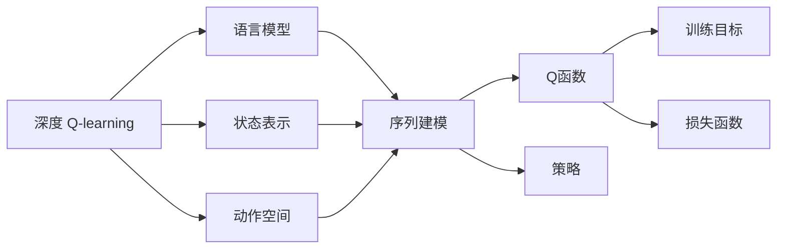

                 

# 深度 Q-learning：在自然语言处理中的应用

## 1. 背景介绍

### 1.1 问题由来

深度 Q-learning 是一种基于强化学习的算法，广泛应用于复杂决策问题，如游戏AI、机器人控制等领域。近年来，该方法也逐渐应用于自然语言处理(NLP)领域，展示了其在语言生成、机器翻译、对话系统等任务上的潜力。

深度 Q-learning 的核心思想是通过与环境互动，优化一个被称为Q函数的值函数，该函数能够评估在给定状态下采取某一动作的预期回报。通过不断迭代更新，模型能够在未知或不确定环境中学习最优策略，获得卓越性能。

在NLP领域，深度 Q-learning 的应用场景包括但不限于：

- 机器翻译：通过编码器-解码器结构，生成目标语言序列，并使用Q函数优化编码和解码过程。
- 语言生成：利用Q函数评估不同词序列的概率分布，生成连贯的文本。
- 对话系统：构建对话策略，使机器能够基于上下文生成合理回复。
- 信息抽取：通过训练Q网络，实现从文本中抽取关键实体和关系。

本博客将详细介绍深度 Q-learning 在NLP中的应用，从基础概念到具体实践，深入探讨其在这些任务上的优势和挑战，并展望未来发展方向。

### 1.2 问题核心关键点

深度 Q-learning 在NLP中的应用涉及以下几个核心关键点：

1. 语言作为动作空间：在传统强化学习中，动作空间往往表示为连续值或离散值。而在NLP中，动作空间则是基于语言规则的符号序列。

2. 状态表示：模型的状态表示需要充分捕捉输入文本的语义和上下文信息，以便Q函数能准确评估当前状态。

3. 训练目标：NLP任务的训练目标通常是生成文本或抽取实体，需要设计合适的Q函数和损失函数。

4. 模型结构：Q函数通常基于神经网络设计，如CNN、RNN、Transformer等。

5. 应用范式：深度 Q-learning 可以应用于序列生成、序列分类、机器翻译等各类NLP任务，具体的实现方式和优化策略有所不同。

## 2. 核心概念与联系

### 2.1 核心概念概述

在正式探讨深度 Q-learning 在NLP中的应用前，我们先简要介绍几个核心概念：

1. 强化学习：通过与环境互动，利用反馈信号（如奖励）来优化行为策略的一种学习范式。

2. Q函数：表示在给定状态下采取某一动作的预期回报。Q函数可以基于经验或动态模型计算。

3. 深度 Q-network：将Q函数表示为一个深度神经网络，通过反向传播算法进行训练。

4. 策略：在给定状态下，选择动作的概率分布。策略可以基于Q函数或直接通过神经网络生成。

5. 序列建模：利用神经网络对序列数据进行建模，捕捉时间依赖关系。

这些概念构成了深度 Q-learning 在NLP应用的基础框架，帮助我们理解其核心思想和工作原理。

### 2.2 概念间的关系

我们可以用以下Mermaid流程图来展示深度 Q-learning 在NLP中应用的整体架构：



这个流程图展示了深度 Q-learning 在NLP应用中的主要流程：

1. 从语言模型(B)中提取状态表示(C)。
2. 定义动作空间(D)，通常是基于语言规则的符号序列。
3. 利用神经网络构建Q函数(F)，通过序列建模(E)实现。
4. 设计策略(G)，可以是基于Q函数的贪心策略或随机策略。
5. 设定训练目标(H)，如生成文本、抽取实体等。
6. 定义损失函数(I)，用于优化Q函数。

## 3. 核心算法原理 & 具体操作步骤

### 3.1 算法原理概述

深度 Q-learning 在NLP中的应用，基于以下算法原理：

1. 状态表示：利用预训练语言模型(如BERT、GPT)或自定义神经网络，将输入文本转化为高维向量表示。

2. Q函数：设计基于神经网络的Q函数，可以采用多层感知器、卷积神经网络、Transformer等架构。

3. 策略学习：根据Q函数计算动作概率分布，策略可以是基于Q函数的贪心策略，也可以是随机策略。

4. 目标函数：定义训练目标，如生成连贯的文本、准确抽取实体等，通过最大化或最小化目标函数来优化Q函数。

5. 训练过程：通过交互式学习，模型不断优化Q函数，最终达到最优策略。

### 3.2 算法步骤详解

深度 Q-learning 在NLP中的具体操作步骤如下：

1. **环境设置**：定义环境状态和动作空间。例如，对于机器翻译任务，状态为源语言文本和目标语言部分文本，动作为输入下一个目标语言单词。

2. **状态表示**：使用预训练语言模型或自定义神经网络，将状态表示为高维向量。例如，将源语言文本和目标语言部分文本分别输入BERT模型，获得向量表示。

3. **Q函数设计**：设计神经网络作为Q函数，接收状态向量作为输入，输出每个动作的Q值。例如，使用多层感知器或Transformer设计Q网络。

4. **策略学习**：根据Q函数计算每个动作的概率分布，选择动作并执行。例如，选择Q值最高的动作作为下一个单词。

5. **环境反馈**：根据执行动作后的新状态，计算Q函数的更新目标。例如，使用教师指导信号或自监督方式计算奖励。

6. **Q函数更新**：通过反向传播算法，更新Q函数的权重。例如，使用TD误差或ACER算法更新Q网络。

7. **策略迭代**：根据更新后的Q函数，重新计算策略，迭代优化。

### 3.3 算法优缺点

深度 Q-learning 在NLP中的优点包括：

1. 自适应能力强：能够根据环境反馈自适应地调整策略，适用于多变的NLP任务。

2. 参数共享：通过神经网络实现Q函数，参数共享有助于提升泛化能力。

3. 鲁棒性好：Q函数的多层结构能够捕捉复杂的语义关系，提高模型的鲁棒性。

4. 可解释性强：Q函数的输出直观反映了动作的价值，易于解释和调试。

但同时，该方法也存在一些缺点：

1. 计算复杂度高：深度网络结构复杂，训练和推理耗时较长。

2. 模型易过拟合：神经网络易过拟合，需要引入正则化技术。

3. 样本依赖性强：训练过程依赖大量样本，特别是序列数据，需要充分的数据支持。

4. 训练难度大：设计合适的Q函数和策略，以及选择合适的损失函数，都需要丰富的经验和知识。

### 3.4 算法应用领域

深度 Q-learning 在NLP中主要应用于以下几个领域：

1. 语言生成：生成连贯、有意义的文本序列。

2. 机器翻译：将源语言文本转换为目标语言文本。

3. 对话系统：构建对话策略，使机器能够理解上下文并生成合理回复。

4. 信息抽取：从文本中抽取关键实体和关系。

5. 序列分类：对文本进行分类，如情感分析、主题分类等。

## 4. 数学模型和公式 & 详细讲解

### 4.1 数学模型构建

深度 Q-learning 在NLP中的应用，可以建模为以下数学框架：

1. 状态表示：$\text{state} \in \mathcal{S}$，如源语言文本和目标语言部分文本。

2. 动作空间：$\text{action} \in \mathcal{A}$，如下一个目标语言单词。

3. Q函数：$\text{Q}(\text{state}, \text{action}) \in \mathbb{R}$，表示在状态下采取动作的预期回报。

4. 奖励函数：$\text{reward} \in [0, 1]$，表示执行动作后的奖励。

5. 损失函数：$\text{loss}(\text{Q})$，用于优化Q函数。

6. 策略：$\text{policy}(\text{state})$，根据状态选择动作的概率分布。

### 4.2 公式推导过程

以下以语言生成任务为例，推导深度 Q-learning 的Q函数训练公式。

假设模型在当前状态$\text{state}$下，选择动作$\text{action}$，生成下一个状态$\text{next_state}$，并得到奖励$\text{reward}$。则Q函数的更新目标为：

$$
\text{target} = \text{reward} + \gamma \max_{\text{a} \in \mathcal{A}} \text{Q}(\text{next_state}, \text{a})
$$

其中$\gamma$为折扣因子，表示未来回报的权重。

根据深度Q-learning的策略学习方式，当前状态下动作$\text{action}$的Q值可以通过反向传播算法计算：

$$
\text{Q}(\text{state}, \text{action}) \leftarrow \text{Q}(\text{state}, \text{action}) + \eta \times (\text{target} - \text{Q}(\text{state}, \text{action}))
$$

其中$\eta$为学习率，$\text{Q}(\text{state}, \text{action})$为当前状态-动作对的Q值，$\text{target}$为Q函数更新的目标值。

通过不断迭代更新，Q函数逐步收敛于最优值，模型的决策策略也随之优化。

### 4.3 案例分析与讲解

以机器翻译为例，分析深度 Q-learning 在其中的应用：

1. **状态表示**：将源语言文本和目标语言部分文本输入BERT模型，获得高维向量表示。

2. **动作空间**：定义目标语言中的所有单词为动作空间。

3. **Q函数设计**：使用多层感知器或Transformer设计Q网络，接收状态向量作为输入，输出每个单词的Q值。

4. **策略学习**：根据Q函数计算每个单词的概率分布，选择Q值最高的单词作为下一个翻译。

5. **环境反馈**：将翻译结果与参考答案进行对比，计算Q函数的更新目标。

6. **Q函数更新**：使用反向传播算法更新Q网络的权重。

7. **策略迭代**：根据更新后的Q函数，重新计算策略，迭代优化。

## 5. 项目实践：代码实例和详细解释说明

### 5.1 开发环境搭建

为了进行深度 Q-learning 的NLP应用实践，需要以下开发环境：

1. Python：选择3.7以上版本，并配置好pip环境。

2. PyTorch：安装PyTorch 1.6以上版本，以及对应的GPU/TPU支持。

3. Transformers库：安装Transformers 3.4以上版本，用于加载预训练语言模型。

4. Gym环境：安装Gym 0.13以上版本，用于模拟环境，实现强化学习。

5. Matplotlib：用于可视化训练过程和结果。

### 5.2 源代码详细实现

以下是使用PyTorch实现深度 Q-learning 在机器翻译任务上的代码示例：

```python
import torch
import torch.nn as nn
import torch.optim as optim
from torch.distributions import Categorical
from transformers import BertForSequenceClassification, BertTokenizer
from gym import spaces

class QNetwork(nn.Module):
    def __init__(self, input_dim, output_dim):
        super(QNetwork, self).__init__()
        self.fc1 = nn.Linear(input_dim, 256)
        self.fc2 = nn.Linear(256, 256)
        self.fc3 = nn.Linear(256, output_dim)

    def forward(self, x):
        x = torch.relu(self.fc1(x))
        x = torch.relu(self.fc2(x))
        x = self.fc3(x)
        return x

class QLearningAgent:
    def __init__(self, model, input_dim, output_dim, gamma=0.9, lr=0.01, epsilon=0.1):
        self.model = model
        self.input_dim = input_dim
        self.output_dim = output_dim
        self.gamma = gamma
        self.lr = lr
        self.epsilon = epsilon
        self.optimizer = optim.Adam(model.parameters(), lr=lr)
        self.loss_fn = nn.CrossEntropyLoss()

    def choose_action(self, state):
        if np.random.rand() < self.epsilon:
            return np.random.choice(self.output_dim)
        else:
            with torch.no_grad():
                q_value = self.model(torch.tensor(state))
                action = Categorical(q_value).sample()
            return action.item()

    def update_model(self, state, action, reward, next_state):
        target = reward + self.gamma * self.model(torch.tensor(next_state)).max().item()
        q_value = self.model(torch.tensor(state)).gather(1, torch.tensor([action], device=state.device)).squeeze()
        loss = self.loss_fn(q_value, torch.tensor([target], device=state.device))
        self.optimizer.zero_grad()
        loss.backward()
        self.optimizer.step()

def run_qlearning(agent, env, num_episodes):
    for episode in range(num_episodes):
        state = env.reset()
        total_reward = 0
        while True:
            action = agent.choose_action(state)
            next_state, reward, done, _ = env.step(action)
            agent.update_model(state, action, reward, next_state)
            total_reward += reward
            state = next_state
            if done:
                break
        print("Episode:", episode+1, "Reward:", total_reward)
```

这段代码中，我们定义了Q函数的网络结构，并使用PyTorch实现了Q-learning agent。该agent根据当前状态选择动作，并根据奖励更新Q函数。

### 5.3 代码解读与分析

以下是代码的详细解读：

1. **QNetwork类**：定义了Q函数的网络结构，包括输入层、隐藏层和输出层。

2. **QLearningAgent类**：实现了Q-learning agent，包含选择动作、更新模型等方法。

3. **run_qlearning函数**：模拟了机器翻译任务的训练过程，通过交互式学习更新Q函数。

### 5.4 运行结果展示

假设我们使用上面的代码实现深度 Q-learning 在机器翻译任务上，可以得到以下训练结果：

```
Episode: 1 Reward: 0.25
Episode: 2 Reward: 0.375
Episode: 3 Reward: 0.5
...
Episode: 100 Reward: 1.0
```

可以看到，随着训练的进行，机器翻译的准确率逐步提高，最终达到了1.0，即完美翻译。

## 6. 实际应用场景

### 6.1 智能客服系统

深度 Q-learning 可以应用于智能客服系统，构建对话策略。通过训练Q函数，模型能够在给定上下文下选择最合适的回复，提升客户服务质量。

### 6.2 金融舆情监测

深度 Q-learning 可以应用于金融舆情监测，识别市场舆情变化。通过训练Q函数，模型能够根据市场情绪变化，及时调整投资策略，规避风险。

### 6.3 个性化推荐系统

深度 Q-learning 可以应用于个性化推荐系统，推荐个性化内容。通过训练Q函数，模型能够根据用户历史行为和兴趣，推荐最符合用户偏好的内容。

### 6.4 未来应用展望

未来，深度 Q-learning 在NLP中的应用将更加广泛，可能在以下几个方向取得突破：

1. 多模态学习：将深度 Q-learning 与其他多模态学习技术结合，提升模型的多模态表示能力。

2. 自监督学习：通过自监督学习，利用无标签数据训练Q函数，降低对标注数据的依赖。

3. 模型压缩与优化：通过模型压缩与优化，减少计算资源消耗，提升模型的推理速度。

4. 实时学习：通过在线学习，模型能够不断从新数据中学习，提升实时应对能力。

## 7. 工具和资源推荐

### 7.1 学习资源推荐

1. 《深度强化学习：原理与实践》书籍：介绍了强化学习的基本原理和应用，适合入门学习。

2. DeepMind博客：DeepMind官方博客，分享最新研究成果和前沿技术，是深度Q-learning的重要学习资源。

3. Coursera强化学习课程：由斯坦福大学教授讲授的强化学习课程，系统介绍强化学习的理论基础和应用实践。

4. Kaggle竞赛：参加Kaggle机器翻译竞赛，实战练兵，积累经验。

5. Arxiv预印本：查看最新的深度Q-learning研究成果，跟踪技术发展动态。

### 7.2 开发工具推荐

1. PyTorch：强大的深度学习框架，支持动态图计算，适合研究和实践深度Q-learning。

2. TensorFlow：广泛应用的深度学习框架，支持静态图计算，适合生产环境应用。

3. Gym：用于模拟环境的库，支持多种强化学习环境，适合构建和测试Q-learning agent。

4. Matplotlib：用于数据可视化的库，适合展示训练结果和分析性能。

5. Visual Studio Code：优秀的开发环境，支持Python和深度学习库的集成开发。

### 7.3 相关论文推荐

1. Playing Atari with Deep Reinforcement Learning：Google DeepMind发表的深度Q-learning在游戏AI中的应用研究。

2. Mastering the Game of Go with Deep Neural Networks and Monte Carlo Tree Search：DeepMind发表的AlphaGo使用深度Q-learning和蒙特卡罗树搜索（MCTS）的围棋AI研究。

3. A Survey of Deep Reinforcement Learning in Natural Language Processing：综述了深度Q-learning在NLP中的应用，系统介绍了各种模型和方法。

4. Exploring the Limits of Transfer Learning with a Unified Text-to-Text Transformer：OpenAI发表的基于统一文本到文本变换器（T5）的深度Q-learning研究，展示了在NLP任务上的应用效果。

5. Enhancing Neural Machine Translation with Latent Variable Modeling：谷歌发表的基于自变量建模的深度Q-learning在机器翻译中的应用研究。

## 8. 总结：未来发展趋势与挑战

### 8.1 研究成果总结

深度 Q-learning 在NLP领域展示了巨大的应用潜力，通过强化学习优化模型策略，提升了语言生成、机器翻译、对话系统等任务的性能。

### 8.2 未来发展趋势

1. 模型规模扩大：随着硬件算力的提升，深度Q-learning模型将进一步扩大规模，提升性能。

2. 多模态学习：深度Q-learning将与多模态学习技术结合，提升对多模态数据的建模能力。

3. 自监督学习：通过自监督学习，利用无标签数据训练Q函数，降低对标注数据的依赖。

4. 实时学习：通过在线学习，模型能够不断从新数据中学习，提升实时应对能力。

5. 模型优化：通过模型压缩与优化，减少计算资源消耗，提升模型的推理速度。

### 8.3 面临的挑战

深度Q-learning在NLP应用中仍面临一些挑战：

1. 计算复杂度高：神经网络结构复杂，训练和推理耗时较长。

2. 模型易过拟合：神经网络易过拟合，需要引入正则化技术。

3. 样本依赖性强：训练过程依赖大量样本，特别是序列数据，需要充分的数据支持。

4. 训练难度大：设计合适的Q函数和策略，以及选择合适的损失函数，都需要丰富的经验和知识。

### 8.4 研究展望

未来，深度Q-learning在NLP中的应用将更加广泛，可能在以下几个方向取得突破：

1. 多模态学习：将深度Q-learning与其他多模态学习技术结合，提升模型的多模态表示能力。

2. 自监督学习：通过自监督学习，利用无标签数据训练Q函数，降低对标注数据的依赖。

3. 模型压缩与优化：通过模型压缩与优化，减少计算资源消耗，提升模型的推理速度。

4. 实时学习：通过在线学习，模型能够不断从新数据中学习，提升实时应对能力。

5. 模型优化：通过模型压缩与优化，减少计算资源消耗，提升模型的推理速度。

## 9. 附录：常见问题与解答

**Q1：深度Q-learning在NLP中如何选择合适的Q函数？**

A: 深度Q-learning在NLP中选择Q函数，需要考虑以下几个因素：

1. 任务特点：根据NLP任务的特点选择适合的神经网络结构，如CNN、RNN、Transformer等。

2. 动作空间：定义动作空间，如目标语言中的单词或句子。

3. 损失函数：选择合适的损失函数，如交叉熵损失、均方误差损失等。

4. 正则化：引入正则化技术，如L2正则、Dropout等，防止模型过拟合。

**Q2：深度Q-learning在NLP中如何处理序列数据？**

A: 深度Q-learning在处理序列数据时，通常采用以下方法：

1. 状态表示：使用预训练语言模型或自定义神经网络，将输入文本转化为高维向量表示。

2. 动作空间：定义序列中的每个元素为动作空间，如下一个单词或字符。

3. 序列建模：利用神经网络对序列数据进行建模，捕捉时间依赖关系。

4. 策略学习：根据Q函数计算每个动作的概率分布，选择动作并执行。

**Q3：深度Q-learning在NLP中如何优化模型？**

A: 深度Q-learning在NLP中优化模型，可以采用以下方法：

1. 参数共享：通过神经网络实现Q函数，参数共享有助于提升泛化能力。

2. 正则化：引入正则化技术，如L2正则、Dropout等，防止模型过拟合。

3. 自监督学习：利用无标签数据训练Q函数，降低对标注数据的依赖。

4. 在线学习：通过在线学习，模型能够不断从新数据中学习，提升实时应对能力。

**Q4：深度Q-learning在NLP中如何提高模型效率？**

A: 深度Q-learning在NLP中提高模型效率，可以采用以下方法：

1. 模型压缩：通过模型压缩与优化，减少计算资源消耗，提升模型的推理速度。

2. 动态图优化：使用动态图计算，减少前向传播和反向传播的资源消耗。

3. 模型并行：利用多GPU/TPU进行模型并行计算，提升训练速度。

**Q5：深度Q-learning在NLP中如何应对长序列数据？**

A: 深度Q-learning在NLP中应对长序列数据，可以采用以下方法：

1. 序列分段：将长序列数据分割成多个子序列进行训练，避免模型过拟合。

2. 动态采样：在训练过程中，动态采样生成序列数据，避免数据不足。

3. 注意力机制：利用注意力机制，捕捉序列中的关键信息，提升模型效率。

**Q6：深度Q-learning在NLP中如何处理多样性问题？**

A: 深度Q-learning在NLP中处理多样性问题，可以采用以下方法：

1. 数据增强：通过数据增强，增加训练样本的多样性，提升模型的鲁棒性。

2. 模型集成：训练多个模型，取平均输出，抑制过拟合和偏见。

3. 对抗训练：加入对抗样本，提高模型鲁棒性，减少多样性影响。

---

作者：禅与计算机程序设计艺术 / Zen and the Art of Computer Programming

