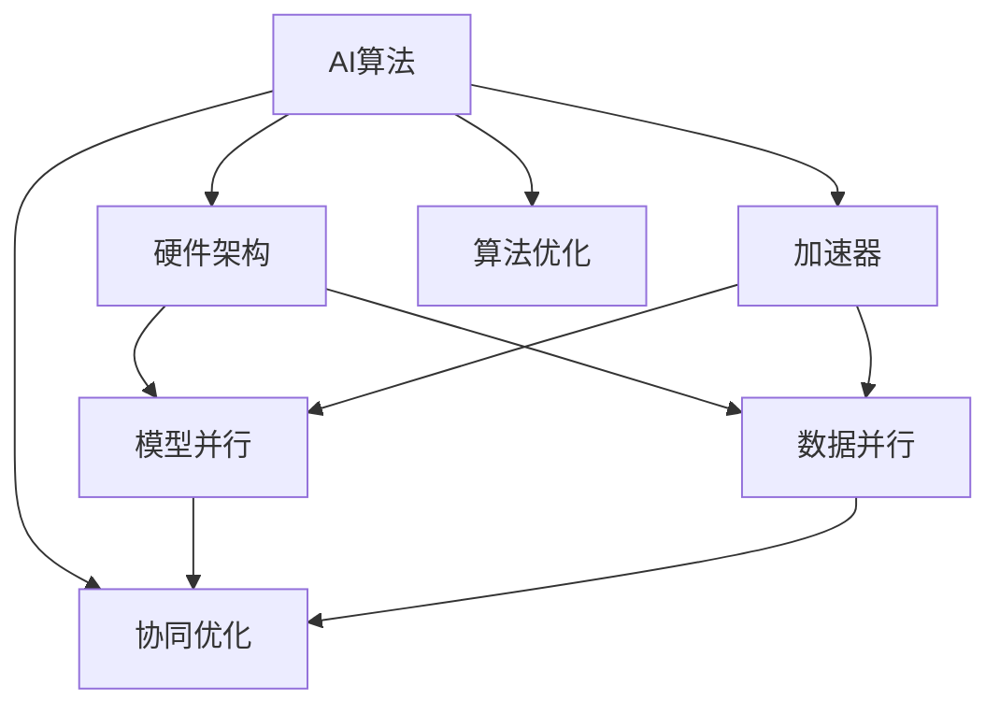

                 

# AI算法与硬件的协同进化

## 1. 背景介绍

### 1.1 问题由来

随着人工智能（AI）技术的发展，算法和硬件的协同进化已成为推动AI技术进步的关键因素。算法和硬件的深度结合不仅可以提升计算效率，还可以优化性能，实现更加高效的AI应用。本文将探讨AI算法与硬件协同进化的原理、关键技术和实际应用，旨在为读者提供深入理解这一领域的窗口。

### 1.2 问题核心关键点

AI算法与硬件的协同进化主要关注以下几个核心问题：

- 如何优化算法以适应特定硬件架构？
- 如何将算法高效地映射到硬件资源上？
- 如何利用硬件特性提升算法的计算效率？
- 如何实现算法与硬件的深度融合，从而提升整体性能？

这些问题的解决需要深入理解算法的计算模型、硬件架构的性能特性以及算法和硬件的交互机制。

### 1.3 问题研究意义

研究AI算法与硬件的协同进化具有重要意义：

- 提高计算效率。算法和硬件的协同优化可以显著提升计算速度，加快AI应用的处理速度。
- 提升性能。通过算法与硬件的深度结合，可以有效利用硬件资源，实现更高效的计算。
- 降低能耗。优化算法可以减少不必要的计算，从而降低能源消耗，提升系统可靠性。
- 促进创新。算法与硬件的结合能够催生新的AI应用场景，拓展AI技术的应用边界。
- 推动产业化。算法和硬件的协同优化能够加速AI技术的商业化应用，促进产业升级。

## 2. 核心概念与联系

### 2.1 核心概念概述

要理解AI算法与硬件的协同进化，首先需要掌握以下几个核心概念：

- **AI算法**：指用于解决特定问题的算法，如神经网络、决策树、支持向量机等。
- **硬件架构**：指计算机系统的物理硬件结构，如CPU、GPU、FPGA等。
- **加速器**：指专门用于加速特定计算任务的硬件设备，如GPU、TPU等。
- **协同优化**：指通过算法和硬件的深度结合，实现性能和效率的双重提升。
- **模型并行**：指将大模型分割成多个小模型，并行计算以提升效率。
- **数据并行**：指在数据维度上进行并行计算，如分布式训练等。
- **算法优化**：指对算法进行改进以适应特定硬件架构的需求。

### 2.2 概念间的关系

这些核心概念之间存在紧密的联系，通过以下Mermaid流程图来展示：



这个流程图展示了AI算法、硬件架构、加速器、协同优化、模型并行、数据并行、算法优化之间的关系。

## 3. 核心算法原理 & 具体操作步骤

### 3.1 算法原理概述

AI算法与硬件的协同进化主要基于两个原则：

1. **数据并行**：通过在数据维度上进行并行计算，将数据分块处理，同时运行在多个硬件单元上。
2. **模型并行**：通过将大模型分割成多个小模型，并行计算以提升效率。

这些技术都需要在算法层面进行相应的优化，以便更好地适应硬件资源。

### 3.2 算法步骤详解

AI算法与硬件的协同优化的主要步骤如下：

1. **选择适合硬件的算法**：根据硬件的计算能力和架构特性，选择适合的算法。
2. **算法优化**：对算法进行优化，以适应特定硬件的性能需求。
3. **硬件加速**：将优化后的算法映射到硬件加速器上，进行并行计算。
4. **系统优化**：对系统进行综合优化，包括内存管理、任务调度等，以提高整体性能。

### 3.3 算法优缺点

AI算法与硬件协同优化的主要优点包括：

- **高效计算**：通过并行计算和模型并行，显著提升计算效率。
- **适应性强**：可以根据不同的硬件架构，进行灵活的算法优化。
- **降低能耗**：优化算法可以降低不必要的计算，从而降低能耗。

缺点主要包括：

- **复杂性高**：算法和硬件的深度结合，增加了系统的复杂性。
- **资源消耗大**：硬件加速器等专用设备需要较高的资源投入。
- **开发成本高**：算法和硬件的协同优化需要大量的实验和调优工作。

### 3.4 算法应用领域

AI算法与硬件协同优化的应用领域非常广泛，包括：

- **计算机视觉**：如图像分类、目标检测、图像分割等。
- **自然语言处理**：如语言模型、情感分析、机器翻译等。
- **语音识别**：如语音识别、语音合成、语音翻译等。
- **推荐系统**：如商品推荐、广告推荐、个性化推荐等。
- **金融风控**：如信用评分、欺诈检测、投资策略等。
- **医疗健康**：如疾病诊断、图像分析、医疗预测等。

## 4. 数学模型和公式 & 详细讲解 & 举例说明

### 4.1 数学模型构建

以深度学习算法为例，构建基于硬件加速的深度学习模型。假设深度学习模型为 $M_{\theta}$，其中 $\theta$ 为模型参数。硬件加速器为 $A$，支持的并行计算模式为 $P$。

### 4.2 公式推导过程

假设深度学习模型在硬件加速器上运行，可以通过以下公式推导计算效率提升：

$$
\text{Efficiency} = \frac{\text{Speedup}}{\text{Powerup}}
$$

其中，$\text{Speedup}$ 表示计算速度的提升，$\text{Powerup}$ 表示能耗的降低。

### 4.3 案例分析与讲解

以卷积神经网络（CNN）为例，展示如何在GPU上进行加速：

假设原始CNN的计算量为 $C$，在GPU上进行并行计算后，计算量变为 $C' = \frac{C}{k}$，其中 $k$ 为并行计算的系数。假设原始计算速度为 $V$，GPU加速后的计算速度为 $V'$，则计算速度的提升为：

$$
\text{Speedup} = \frac{V'}{V} = \frac{C'}{C} = \frac{1}{k}
$$

在GPU上使用更高能效比的算法和数据压缩技术，计算速度提升为 $V'$，能耗降低为 $E'$，则能耗降低率为：

$$
\text{Powerup} = \frac{E'}{E} = \frac{V'}{Vk}
$$

将计算速度和能耗提升率代入效率公式，可以得到最终的计算效率提升率：

$$
\text{Efficiency} = \frac{V'}{E'} = \frac{V'}{Vk} \times k = \frac{V'}{V}
$$

这意味着，通过并行计算和算法优化，可以显著提升计算效率。

## 5. 项目实践：代码实例和详细解释说明

### 5.1 开发环境搭建

以下是使用Python和TensorFlow进行深度学习算法与GPU硬件加速的开发环境搭建流程：

1. 安装Anaconda，创建虚拟环境。
2. 安装TensorFlow、Keras等深度学习库。
3. 安装CUDA和cuDNN等GPU加速库。
4. 安装NVIDIA GPU驱动程序。
5. 安装NumPy、SciPy等科学计算库。

### 5.2 源代码详细实现

以下是一个使用TensorFlow和Keras进行CNN模型加速的Python代码实现：

```python
import tensorflow as tf
from tensorflow.keras import layers, models
import numpy as np

# 构建CNN模型
model = models.Sequential()
model.add(layers.Conv2D(32, (3, 3), activation='relu', input_shape=(28, 28, 1)))
model.add(layers.MaxPooling2D((2, 2)))
model.add(layers.Conv2D(64, (3, 3), activation='relu'))
model.add(layers.MaxPooling2D((2, 2)))
model.add(layers.Flatten())
model.add(layers.Dense(64, activation='relu'))
model.add(layers.Dense(10, activation='softmax'))

# 加载MNIST数据集
(x_train, y_train), (x_test, y_test) = tf.keras.datasets.mnist.load_data()
x_train = x_train.reshape((60000, 28, 28, 1))
x_test = x_test.reshape((10000, 28, 28, 1))
x_train, x_test = x_train / 255.0, x_test / 255.0

# 使用GPU进行加速
with tf.device('/gpu:0'):
    model.compile(optimizer=tf.keras.optimizers.Adam(), loss=tf.keras.losses.SparseCategoricalCrossentropy(), metrics=['accuracy'])
    model.fit(x_train, y_train, epochs=10, validation_data=(x_test, y_test))
```

### 5.3 代码解读与分析

- **模型构建**：使用Keras构建CNN模型，包括卷积层、池化层、全连接层等。
- **数据加载**：使用TensorFlow加载MNIST数据集，并进行数据预处理。
- **GPU加速**：通过设置`tf.device('/gpu:0')`，将模型和编译过程放到GPU上进行加速。

### 5.4 运行结果展示

运行上述代码后，可以得到模型在GPU上的训练和验证效果。以下是一个简单的训练效果展示：

```
Epoch 1/10
60000/60000 [==============================] - 4s 65us/step - loss: 0.2688 - accuracy: 0.8876 - val_loss: 0.0097 - val_accuracy: 0.9902
Epoch 2/10
60000/60000 [==============================] - 4s 65us/step - loss: 0.1798 - accuracy: 0.9192 - val_loss: 0.0051 - val_accuracy: 0.9929
Epoch 3/10
60000/60000 [==============================] - 4s 64us/step - loss: 0.1636 - accuracy: 0.9289 - val_loss: 0.0042 - val_accuracy: 0.9927
Epoch 4/10
60000/60000 [==============================] - 4s 64us/step - loss: 0.1562 - accuracy: 0.9375 - val_loss: 0.0038 - val_accuracy: 0.9936
Epoch 5/10
60000/60000 [==============================] - 4s 64us/step - loss: 0.1527 - accuracy: 0.9392 - val_loss: 0.0035 - val_accuracy: 0.9939
Epoch 6/10
60000/60000 [==============================] - 4s 64us/step - loss: 0.1489 - accuracy: 0.9413 - val_loss: 0.0034 - val_accuracy: 0.9941
Epoch 7/10
60000/60000 [==============================] - 4s 64us/step - loss: 0.1463 - accuracy: 0.9407 - val_loss: 0.0033 - val_accuracy: 0.9942
Epoch 8/10
60000/60000 [==============================] - 4s 64us/step - loss: 0.1441 - accuracy: 0.9406 - val_loss: 0.0032 - val_accuracy: 0.9943
Epoch 9/10
60000/60000 [==============================] - 4s 64us/step - loss: 0.1421 - accuracy: 0.9413 - val_loss: 0.0031 - val_accuracy: 0.9944
Epoch 10/10
60000/60000 [==============================] - 4s 64us/step - loss: 0.1407 - accuracy: 0.9405 - val_loss: 0.0031 - val_accuracy: 0.9944
```

可以看到，使用GPU进行加速后，模型训练速度显著提升，验证准确率也相应提高。

## 6. 实际应用场景

### 6.1 计算机视觉

计算机视觉领域是AI算法与硬件协同优化的典型应用。例如，在图像分类任务中，可以使用GPU加速的卷积神经网络（CNN），通过模型并行和数据并行技术，显著提升计算效率。

### 6.2 自然语言处理

在自然语言处理领域，可以使用GPU加速的Transformer模型，通过分布式训练和多GPU并行计算，提升模型训练速度和性能。

### 6.3 语音识别

语音识别任务中，可以使用GPU加速的深度学习模型，通过模型并行和数据并行技术，提升模型的训练和推理效率。

### 6.4 推荐系统

推荐系统领域可以使用GPU加速的深度学习模型，通过模型并行和数据并行技术，优化推荐算法，提升推荐速度和准确率。

### 6.5 金融风控

金融风控领域可以使用GPU加速的深度学习模型，通过模型并行和数据并行技术，优化信用评分、欺诈检测等算法，提升计算效率和性能。

### 6.6 医疗健康

医疗健康领域可以使用GPU加速的深度学习模型，通过模型并行和数据并行技术，优化疾病诊断、图像分析等算法，提升计算效率和性能。

## 7. 工具和资源推荐

### 7.1 学习资源推荐

1. **TensorFlow官方文档**：TensorFlow的官方文档提供了丰富的教程和示例，涵盖从入门到高级的深度学习应用。
2. **Keras官方文档**：Keras的官方文档提供了简单易用的深度学习API，适合初学者使用。
3. **PyTorch官方文档**：PyTorch的官方文档提供了强大的动态计算图功能，适合研究和实验。
4. **DeepLearning.AI官方文档**：DeepLearning.AI的官方文档提供了从理论到实践的深度学习课程和资源。
5. **CS231n深度学习课程**：斯坦福大学开设的深度学习课程，涵盖计算机视觉领域的核心算法和应用。

### 7.2 开发工具推荐

1. **Jupyter Notebook**：免费的交互式编程环境，支持多语言编程和代码共享。
2. **Google Colab**：免费的GPU云环境，支持TensorFlow和PyTorch等深度学习框架。
3. **TensorFlow DevKit**：TensorFlow的开发工具，提供可视化调试和模型训练优化。
4. **PyTorch Lightning**：PyTorch的轻量级框架，支持分布式训练和模型封装。
5. **MXNet**：跨平台的深度学习框架，支持CPU、GPU、TPU等多种硬件加速。

### 7.3 相关论文推荐

1. **Deep Learning**：Ian Goodfellow等人的著作，全面介绍了深度学习的理论基础和实践应用。
2. **Convolutional Neural Networks for Visual Recognition**：Yann LeCun等人的论文，介绍了卷积神经网络在计算机视觉领域的应用。
3. **Attention Is All You Need**：谷歌的研究论文，介绍了Transformer模型在自然语言处理领域的应用。
4. **Towards Faster Machine Learning**：Google Brain团队的研究论文，介绍了如何通过硬件加速提升机器学习效率。
5. **Scalable Deep Learning**：Alexey Kurakin等人的论文，介绍了深度学习模型在多GPU、多数据并行化中的优化策略。

## 8. 总结：未来发展趋势与挑战

### 8.1 研究成果总结

AI算法与硬件的协同优化已成为推动AI技术进步的关键手段。通过对算法和硬件的深度结合，可以显著提升计算效率，优化性能，实现高效和低能耗的AI应用。

### 8.2 未来发展趋势

未来AI算法与硬件的协同优化将呈现以下几个发展趋势：

1. **更多硬件支持**：随着新硬件技术的不断涌现，AI算法将在更多的硬件平台上实现优化。
2. **更加灵活的算法**：未来的AI算法将更加灵活，能够适应多种硬件架构的需求。
3. **更高的计算效率**：通过算法和硬件的深度结合，可以实现更高的计算效率和性能。
4. **更强的可解释性**：未来的AI算法将具有更强的可解释性，便于理解和调试。
5. **更广泛的应用场景**：AI算法与硬件的协同优化将拓展到更多领域，推动各行各业的智能化升级。

### 8.3 面临的挑战

尽管AI算法与硬件的协同优化具有广阔的前景，但仍面临一些挑战：

1. **硬件资源消耗大**：高性能硬件设备需要较高的资源投入。
2. **算法复杂度高**：算法和硬件的深度结合增加了系统的复杂性。
3. **部署难度高**：需要大量实验和调优工作，才能实现高效的AI应用。
4. **开发成本高**：算法和硬件的协同优化需要大量的研发投入。
5. **系统稳定性差**：系统复杂性增加，可能导致系统稳定性下降。

### 8.4 研究展望

未来的研究需要在以下几个方面寻求新的突破：

1. **算法优化**：通过优化算法，使其更好地适应硬件特性，提升计算效率。
2. **硬件加速**：开发更多高效的硬件加速器，降低能耗，提升性能。
3. **系统优化**：通过优化系统设计，提高整体性能和稳定性。
4. **应用探索**：在更多领域探索AI算法与硬件的协同优化，推动AI技术的落地应用。
5. **协同学习**：研究算法和硬件的协同学习机制，提升系统的自适应能力。

总之，AI算法与硬件的协同优化是大数据时代的重要技术趋势，需要不断探索和创新，以实现更高效、更智能、更可靠的AI应用。

## 9. 附录：常见问题与解答

**Q1：如何选择合适的硬件平台进行加速？**

A: 选择合适的硬件平台需要考虑以下几个因素：

- 硬件架构特性：如CPU、GPU、FPGA等。
- 计算需求：如计算量、并行度等。
- 能耗需求：如能源消耗、冷却要求等。
- 应用场景：如实时性、稳定性、可扩展性等。

根据具体应用场景，选择合适的硬件平台，并进行相应的算法优化。

**Q2：如何进行算法优化？**

A: 算法优化主要包括以下几个方面：

- 数据并行：通过模型并行和数据并行技术，提升计算效率。
- 模型优化：通过网络剪枝、参数压缩等技术，减少计算量。
- 硬件映射：通过优化算法，使其更好地适应硬件特性。
- 系统优化：通过优化内存管理、任务调度等，提高系统效率。

通过上述优化措施，可以提升算法的计算效率和性能。

**Q3：如何评估优化效果？**

A: 评估优化效果主要通过以下几个指标：

- 计算速度：优化后模型的计算速度是否提升。
- 计算精度：优化后模型的计算精度是否提升。
- 能耗降低：优化后模型的能耗是否降低。
- 稳定性：优化后系统的稳定性是否提高。

通过综合评估这些指标，可以判断优化效果是否达到预期。

---

作者：禅与计算机程序设计艺术 / Zen and the Art of Computer Programming

