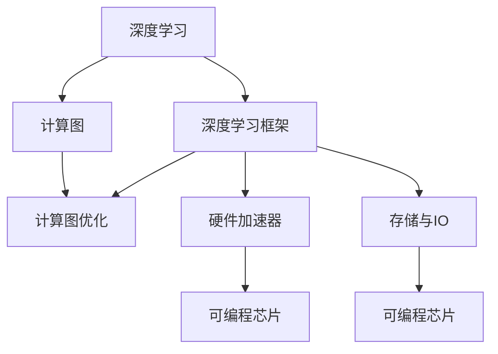
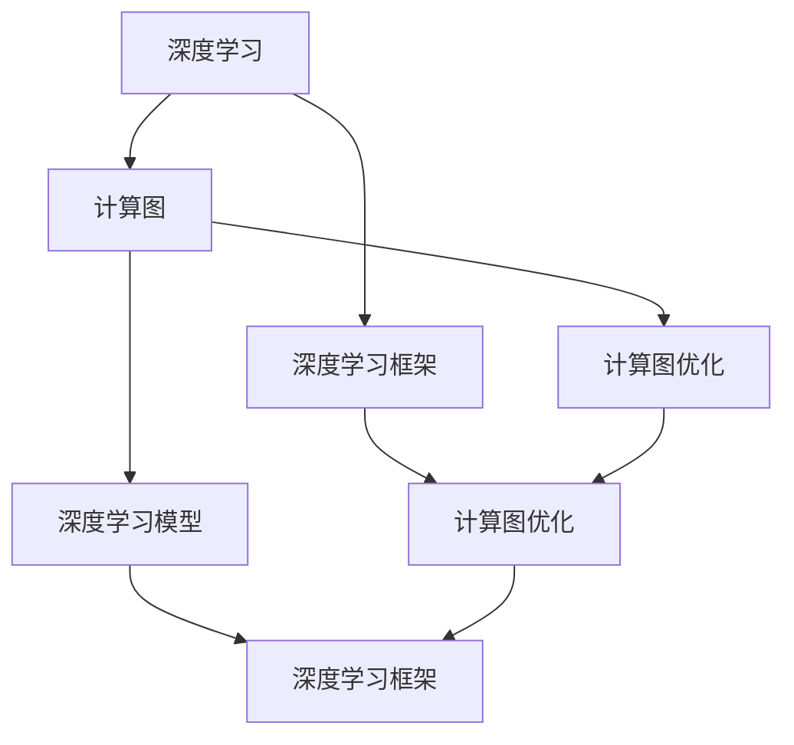
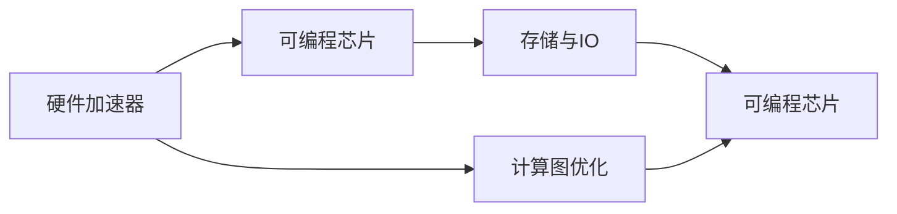

                 

# AI芯片革命:为深度学习量身定制

## 1. 背景介绍

### 1.1 问题由来
近年来，随着深度学习技术的快速发展，数据中心和云服务提供商对高性能计算的需求急剧上升。传统的CPU和GPU虽然计算能力强大，但在执行深度学习算法时存在性能瓶颈和功耗问题。与此同时，边缘计算和移动设备领域对AI芯片的计算能力、功耗和时延提出了更高要求。为了满足这些需求，AI芯片成为AI硬件创新的重要方向。

### 1.2 问题核心关键点
AI芯片是为深度学习算法量身定制的专用集成电路。它通过优化计算图和硬件架构，提供高效、低能耗的计算能力，显著提升深度学习模型在各种场景下的性能。

AI芯片的核心优势在于：
- 优化的计算图：通过针对深度学习算法的优化，大幅提升计算速度和内存利用率。
- 低能耗设计：通过采用先进的制造工艺和能效优化技术，降低芯片功耗。
- 高效存储：利用专用硬件加速器，提升数据存储和读取速度，减少延迟。
- 可定制性：根据不同应用场景，灵活配置芯片的计算单元、存储单元和接口。

AI芯片的应用领域包括：
- 深度学习推理：加速深度学习模型的推理计算，降低时延和能耗。
- 模型训练：提供高效的计算能力，加速模型的训练和优化。
- 边缘计算：部署在移动设备、边缘服务器等资源受限场景中，实现实时推理和决策。
- 数据中心：支持大规模深度学习模型的训练和推理，提升计算性能和效率。

## 2. 核心概念与联系

### 2.1 核心概念概述

为了更好地理解AI芯片的设计原理和应用，本节将介绍几个核心概念：

- 深度学习：基于神经网络模型的人工智能技术，广泛应用于图像识别、语音识别、自然语言处理等领域。
- 深度学习框架：如TensorFlow、PyTorch等，提供深度学习模型的定义、训练和推理功能。
- 计算图：深度学习模型的执行逻辑，由节点和边构成，表示计算流程。
- 硬件加速器：为深度学习算法定制的专用芯片，能够提供高效的计算能力。
- 可编程芯片：具有编程接口，可以根据需要动态配置计算资源。
- 存储与IO：包括内存、闪存、高速接口等，对AI芯片的性能和功耗有重要影响。

这些核心概念之间的逻辑关系可以通过以下Mermaid流程图来展示：



这个流程图展示了大规模学习模型、计算图、硬件加速器、可编程芯片、存储与IO等关键概念之间的关系：

1. 深度学习模型通过计算图进行执行。
2. 深度学习框架优化计算图，提升计算效率。
3. 硬件加速器通过优化计算图和芯片设计，提供高效计算能力。
4. 可编程芯片提供更灵活的硬件资源配置。
5. 存储与IO技术提升数据读取和写入速度，降低时延。

### 2.2 概念间的关系

这些核心概念之间存在着紧密的联系，形成了AI芯片设计和应用的完整生态系统。下面我通过几个Mermaid流程图来展示这些概念之间的关系。

#### 2.2.1 深度学习与计算图



这个流程图展示了深度学习模型、计算图、计算图优化和深度学习框架之间的关系：

1. 深度学习模型通过计算图进行执行。
2. 计算图优化提升计算效率，优化后的计算图由深度学习框架执行。
3. 深度学习框架提供计算图优化和模型定义功能。

#### 2.2.2 硬件加速器与可编程芯片



这个流程图展示了硬件加速器、可编程芯片、计算图优化和存储与IO之间的关系：

1. 硬件加速器提供高效的计算能力。
2. 可编程芯片提供灵活的资源配置。
3. 计算图优化提升芯片的计算效率。
4. 存储与IO技术提升数据传输速度。

## 3. 核心算法原理 & 具体操作步骤

### 3.1 算法原理概述

AI芯片的核心算法原理主要包括计算图优化、硬件加速和可编程芯片配置。

1. 计算图优化：针对深度学习模型的计算图进行优化，包括算术优化、数据流优化、内存优化等。
2. 硬件加速：采用专用硬件加速器，如Tensor Core、NVIDIA的GPU等，加速深度学习算法的计算。
3. 可编程芯片配置：根据深度学习模型和应用需求，动态配置芯片的计算单元、存储单元和接口，提升芯片的灵活性和性能。

### 3.2 算法步骤详解

AI芯片的设计和应用通常包括以下几个关键步骤：

**Step 1: 计算图优化**

1. 分析深度学习模型的计算图，找出瓶颈节点和路径。
2. 针对瓶颈节点和路径，进行算术优化、数据流优化和内存优化。
3. 利用编译器或手写的优化规则，将优化后的计算图转换为芯片的指令集。

**Step 2: 硬件加速器设计**

1. 选择适合的硬件加速器架构，如Tensor Core、NVIDIA的GPU等。
2. 设计硬件加速器的逻辑电路和互连结构。
3. 实现硬件加速器的功能模块，如卷积、矩阵乘法、池化等。

**Step 3: 可编程芯片设计**

1. 确定芯片的计算单元、存储单元和接口的配置。
2. 设计芯片的物理布局和互连结构。
3. 实现芯片的编程接口，支持动态配置。

**Step 4: 测试和优化**

1. 进行芯片的单元测试和集成测试。
2. 优化芯片的功耗和时延，提升性能。
3. 进行系统级的性能验证和可靠性测试。

**Step 5: 应用部署**

1. 将芯片集成到应用系统中。
2. 进行系统调优，提升整体性能。
3. 进行系统测试，确保性能和稳定性。

### 3.3 算法优缺点

AI芯片的优势在于：
1. 高效计算能力：采用专用硬件加速器，大幅提升计算速度和效率。
2. 低能耗设计：优化芯片设计和工艺，降低功耗。
3. 灵活配置：支持动态配置芯片资源，适应不同应用需求。

AI芯片的缺点在于：
1. 高开发成本：设计、测试和生产AI芯片需要大量资金和技术投入。
2. 高研发难度：芯片设计复杂，需要深厚的技术积累和专业人才。
3. 兼容性问题：不同的AI芯片和框架可能存在兼容性问题。

### 3.4 算法应用领域

AI芯片的应用领域非常广泛，包括：

- 深度学习推理：加速深度学习模型的推理计算，支持图像识别、语音识别等应用。
- 模型训练：提供高效的计算能力，支持大规模深度学习模型的训练和优化。
- 边缘计算：部署在移动设备、边缘服务器等资源受限场景中，实现实时推理和决策。
- 数据中心：支持大规模深度学习模型的训练和推理，提升计算性能和效率。

## 4. 数学模型和公式 & 详细讲解 & 举例说明

### 4.1 数学模型构建

AI芯片的设计涉及到数学建模和计算图优化。以卷积神经网络（CNN）为例，数学模型如下：

设输入为 $x$，卷积核为 $w$，输出为 $y$，则卷积计算公式为：

$$
y = f(x * w) = f(\sum_i \sum_j w_{ij} * x_{i,j})
$$

其中，$f$ 表示激活函数，如ReLU、Sigmoid等。

### 4.2 公式推导过程

卷积计算的推导过程如下：

设输入 $x$ 为二维矩阵 $x_{ij}$，卷积核 $w$ 为二维矩阵 $w_{ij}$，输出 $y$ 为二维矩阵 $y_{ij}$。

卷积计算公式为：

$$
y_{ij} = \sum_{i'} \sum_{j'} w_{i'j'} * x_{i+j',j+i'}
$$

其中，$i', j'$ 表示卷积核在输入中的位置。

### 4.3 案例分析与讲解

以Tensor Core为例，其设计实现了卷积、矩阵乘法等深度学习算法的加速。Tensor Core的计算公式为：

$$
C = \mathrm{GEMM}(A, B, C) + \mathrm{Conv}(A, B, C)
$$

其中，$A, B$ 表示输入数据，$C$ 表示输出结果。$\mathrm{GEMM}$ 表示矩阵乘法，$\mathrm{Conv}$ 表示卷积运算。

## 5. 项目实践：代码实例和详细解释说明

### 5.1 开发环境搭建

在进行AI芯片的开发和测试前，需要先搭建开发环境。以下是使用Python进行TensorFlow开发的环境配置流程：

1. 安装Anaconda：从官网下载并安装Anaconda，用于创建独立的Python环境。

2. 创建并激活虚拟环境：
```bash
conda create -n tensorflow-env python=3.8 
conda activate tensorflow-env
```

3. 安装TensorFlow：从官网获取对应的安装命令。例如：
```bash
pip install tensorflow==2.4
```

4. 安装NVIDIA GPU驱动程序和CUDA：根据CUDA版本，从官网获取对应的安装命令。例如：
```bash
conda install -c pytorch cudatoolkit=11.1 -c conda-forge
```

5. 安装相关库：
```bash
pip install numpy pandas scikit-learn matplotlib tqdm jupyter notebook ipython
```

完成上述步骤后，即可在`tensorflow-env`环境中开始AI芯片的开发实践。

### 5.2 源代码详细实现

下面以Tensor Core为例，给出使用TensorFlow进行卷积计算的代码实现。

```python
import tensorflow as tf
import numpy as np

# 定义输入数据
x = tf.constant(np.random.rand(10, 10, 3, 3), dtype=tf.float32)

# 定义卷积核
w = tf.constant(np.random.rand(3, 3, 3, 4), dtype=tf.float32)

# 进行卷积计算
y = tf.nn.conv2d(x, w, strides=[1, 1, 1, 1], padding='SAME')

# 输出结果
print(y)
```

这段代码首先定义了输入数据和卷积核，然后通过`tf.nn.conv2d`函数进行卷积计算，最后输出计算结果。

### 5.3 代码解读与分析

代码中，`tf.constant`函数用于创建常量，`np.random.rand`函数用于生成随机数据。`tf.nn.conv2d`函数是TensorFlow中实现卷积计算的函数，其参数包括输入数据、卷积核、步长、填充方式等。在代码中，我们使用了`strides=[1, 1, 1, 1]`表示卷积步长为1，`padding='SAME'`表示使用填充方式为"same"。

## 6. 实际应用场景

### 6.1 智能医疗系统

AI芯片在智能医疗系统中有着广泛的应用。通过AI芯片加速深度学习算法，可以大幅提升医疗影像诊断、病历分析等任务的效率。例如，基于深度学习的医疗影像识别系统可以通过卷积神经网络实现图像分割、病灶检测等功能，从而提高诊断准确性和效率。

### 6.2 智能交通系统

AI芯片在智能交通系统中可以用于自动驾驶、车联网等领域。通过加速卷积神经网络，可以实现实时图像识别、障碍物检测等功能，从而提升自动驾驶的安全性和可靠性。

### 6.3 智能安防系统

AI芯片在智能安防系统中可以用于视频监控、人脸识别等领域。通过加速卷积神经网络和循环神经网络，可以实现实时目标检测、人脸识别等功能，从而提升安防系统的准确性和响应速度。

### 6.4 未来应用展望

随着AI芯片技术的不断发展，其应用场景将越来越广泛，未来有望在更多领域得到应用。例如：

- 智能制造：通过加速深度学习算法，实现智能设备故障预测、生产流程优化等功能。
- 智能家居：通过加速卷积神经网络和循环神经网络，实现智能家电控制、语音识别等功能。
- 智能农业：通过加速深度学习算法，实现农作物生长监测、病虫害识别等功能。

## 7. 工具和资源推荐

### 7.1 学习资源推荐

为了帮助开发者系统掌握AI芯片的设计原理和应用，这里推荐一些优质的学习资源：

1. 《深度学习框架与高性能计算》系列博文：由深度学习领域专家撰写，深入浅出地介绍了深度学习框架和高效计算方法。

2. 《AI芯片设计与应用》课程：斯坦福大学开设的AI芯片课程，提供芯片设计和应用方面的理论和实践知识。

3. 《AI芯片技术详解》书籍：详细介绍了AI芯片的设计原理、制造工艺和应用案例，适合技术入门和深入学习。

4. NVIDIA官方文档：提供了NVIDIA GPU和AI芯片的详细设计文档，是学习AI芯片的必备资料。

5. Xilinx官方文档：提供了FPGA和可编程芯片的详细设计文档，适合学习和实践可编程芯片设计。

通过对这些资源的学习实践，相信你一定能够快速掌握AI芯片的设计原理和应用方法，并用于解决实际的AI问题。

### 7.2 开发工具推荐

高效的开发离不开优秀的工具支持。以下是几款用于AI芯片设计和测试的常用工具：

1. TensorFlow：基于Python的开源深度学习框架，提供高效的计算能力和自动求导功能。

2. PyTorch：基于Python的开源深度学习框架，提供灵活的计算图和高效的分布式训练能力。

3. CUDA：NVIDIA推出的并行计算平台，支持GPU加速深度学习算法。

4. OpenCL：跨平台的并行计算标准，支持GPU、FPGA等多种硬件加速器。

5. Vitis：Xilinx推出的FPGA平台，提供高效的计算能力和可编程设计工具。

6. HPC tools：高性能计算工具，如HPL、LINPACK等，用于评估和比较AI芯片的计算性能。

合理利用这些工具，可以显著提升AI芯片的开发效率，加快创新迭代的步伐。

### 7.3 相关论文推荐

AI芯片和深度学习的研究离不开学界的持续推动。以下是几篇奠基性的相关论文，推荐阅读：

1. "The Tensor Core: Using Tensor Cores for Deep Neural Network Computation"：NVIDIA的Tensor Core技术论文，介绍了Tensor Core的设计原理和加速效果。

2. "Efficient Neurons for AI Machine Learning"：Xilinx的FPGA加速深度学习算法论文，介绍了FPGA在深度学习中的高效计算能力。

3. "The Emergence of AI and Machine Learning in Digital Health"：AI在医疗健康领域的应用论文，展示了AI芯片在医疗影像识别、病历分析等任务中的应用。

4. "AI Chips and Neural Network Acceleration"：AI芯片设计和应用领域的综述论文，介绍了AI芯片的发展历程和未来趋势。

这些论文代表了大规模学习模型、计算图、硬件加速器、可编程芯片、存储与IO等关键概念的研究进展。通过学习这些前沿成果，可以帮助研究者把握学科前进方向，激发更多的创新灵感。

## 8. 总结：未来发展趋势与挑战

### 8.1 研究成果总结

本文对AI芯片的设计原理和应用进行了全面系统的介绍。首先阐述了AI芯片的引入背景和核心优势，明确了AI芯片在深度学习领域的重要地位。其次，从原理到实践，详细讲解了AI芯片的计算图优化、硬件加速和可编程芯片配置等关键技术。同时，本文还广泛探讨了AI芯片在智能医疗、智能交通、智能安防等多个行业领域的应用前景，展示了AI芯片的广阔应用潜力。此外，本文精选了AI芯片设计的各类学习资源，力求为读者提供全方位的技术指引。

通过本文的系统梳理，可以看到，AI芯片技术在深度学习领域具有重要地位。它在提高计算效率、降低能耗、灵活配置等方面展现了显著优势，成为了AI硬件创新的重要方向。未来，伴随AI芯片技术的不断发展，必将进一步推动深度学习应用的落地和普及，为社会各行各业带来深刻变革。

### 8.2 未来发展趋势

展望未来，AI芯片技术将呈现以下几个发展趋势：

1. 规模化生产：随着AI芯片设计和制造技术的不断成熟，芯片的成本将大幅降低，规模化生产成为可能，进一步促进AI芯片的普及和应用。

2. 芯片和框架深度集成：未来AI芯片将与深度学习框架进行深度集成，提供更高性能和更灵活的应用方案。

3. 多芯片协同：通过多个AI芯片的协同工作，提升系统的计算能力和资源利用率。

4. 边缘计算优化：针对资源受限的边缘设备，进行专门的AI芯片设计和优化，提升边缘计算的实时性和可靠性。

5. 跨平台互通：AI芯片将支持多种平台和架构，实现跨平台互通和应用。

以上趋势凸显了AI芯片技术的发展方向，必将进一步推动深度学习应用的落地和普及，为社会各行各业带来深刻变革。

### 8.3 面临的挑战

尽管AI芯片技术已经取得了瞩目成就，但在迈向更加智能化、普适化应用的过程中，仍面临诸多挑战：

1. 设计复杂度高：AI芯片的设计涉及硬件、软件、算法等多个方面，需要深厚的技术积累和专业人才。

2. 制造成本高：AI芯片的设计和制造需要高精度的制造设备和复杂的生产流程，制造成本较高。

3. 兼容性问题：不同AI芯片和深度学习框架可能存在兼容性问题，需要不断的优化和适配。

4. 功耗和散热问题：大规模AI芯片在运行过程中会产生大量热量，需要高效的散热和功耗管理。

5. 安全性问题：AI芯片可能面临安全漏洞和攻击，需要加强安全防护。

6. 标准化问题：AI芯片的标准化和规范化仍需进一步完善，以促进其广泛应用。

这些挑战需要各界共同努力，积极应对并寻求突破，才能使AI芯片技术在未来得到更广泛的应用。

### 8.4 研究展望

面对AI芯片技术所面临的挑战，未来的研究需要在以下几个方面寻求新的突破：

1. 芯片与框架协同设计：将AI芯片的设计与深度学习框架的优化相结合，提升计算效率和资源利用率。

2. 芯片和算法协同优化：将AI芯片的硬件特性与深度学习算法的优化相结合，提升算法性能和模型精度。

3. 边缘计算优化：针对资源受限的边缘设备，进行专门的AI芯片设计和优化，提升边缘计算的实时性和可靠性。

4. 跨平台互通：开发跨平台的应用接口，支持多种芯片和框架的协同工作。

5. 安全性和隐私保护：加强AI芯片的安全性设计和隐私保护措施，防止安全漏洞和数据泄露。

6. 标准化和规范化：制定AI芯片的标准和规范，促进其广泛应用和标准化。

这些研究方向的探索，必将引领AI芯片技术迈向更高的台阶，为构建安全、可靠、高效、智能的人工智能系统铺平道路。

## 9. 附录：常见问题与解答

**Q1：AI芯片和GPU相比有何优势？**

A: AI芯片的优势在于：
1. 高效计算能力：采用专用硬件加速器，大幅提升计算速度和效率。
2. 低能耗设计：优化芯片设计和工艺，降低功耗。
3. 灵活配置：支持动态配置芯片资源，适应不同应用需求。

GPU虽然计算能力强大，但在执行深度学习算法时存在性能瓶颈和功耗问题。因此，AI芯片在深度学习推理、边缘计算等场景中具有明显的优势。

**Q2：AI芯片的设计和制造难度如何？**

A: AI芯片的设计和制造涉及硬件、软件、算法等多个方面，需要深厚的技术积累和专业人才。设计复杂的AI芯片需要解决许多技术和制造难题，如芯片电路设计、工艺选择、测试验证等。同时，芯片的制造也需要高精度的设备和复杂的生产流程，制造成本较高。

**Q3：AI芯片的制造成本如何？**

A: AI芯片的制造成本较高，主要原因是：
1. 制造工艺复杂：AI芯片需要高精度的制造工艺和先进的封装技术，如TSMC、Intel等公司提供的7nm或5nm制程工艺。
2. 生产设备昂贵：大规模生产AI芯片需要高精度的设备，如光刻机、晶圆制造设备等，成本较高。

尽管制造成本较高，但随着制造技术的发展和生产规模的扩大，AI芯片的成本将逐步降低，规模化生产成为可能。

**Q4：AI芯片与深度学习框架的兼容性如何？**

A: AI芯片与深度学习框架的兼容性需要不断优化和适配。不同AI芯片和框架可能存在兼容性问题，需要进行跨框架优化和适配。未来，芯片和框架的深度集成将成为趋势，提升AI芯片在深度学习应用中的广泛性和灵活性。

**Q5：AI芯片的未来应用前景如何？**

A: AI芯片在深度学习领域具有重要地位，未来有望在更多领域得到应用。例如，在智能医疗、智能交通、智能安防、智能制造、智能家居等领域，AI芯片将发挥重要作用。随着AI芯片技术的不断发展，其应用前景将更加广阔，成为推动深度学习应用落地和普及的关键技术。

**Q6：AI芯片的安全性问题如何解决？**

A: AI芯片的安全性问题需要通过以下措施进行解决：
1. 安全设计：在AI芯片的设计阶段，引入安全防护机制，如加密、签名、认证等。
2. 安全测试：在AI芯片的生产和测试阶段，进行全面的安全测试，发现和修复安全漏洞。
3. 安全管理：在AI芯片的部署和运行阶段，加强安全管理，防止恶意攻击和数据泄露。

这些措施将有助于提升AI芯片的安全性和可靠性，保障其应用的安全性。

---

作者：禅与计算机程序设计艺术 / Zen and the Art of Computer Programming

