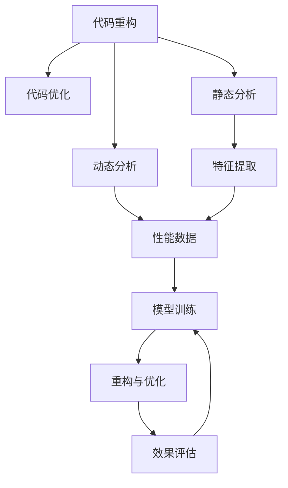
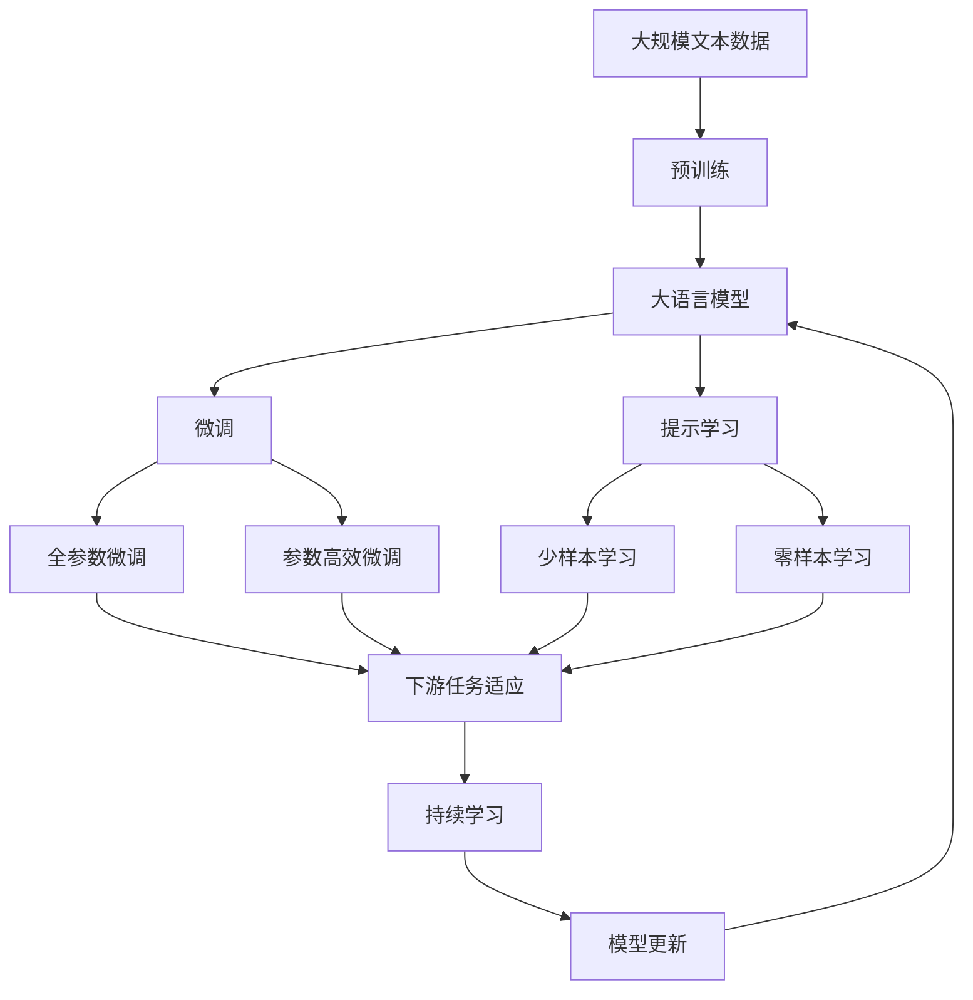

                 

# AI辅助的代码重构与优化

## 1. 背景介绍

### 1.1 问题由来
在软件开发过程中，代码重构和优化是提升代码质量和性能、提高开发效率的重要手段。传统的手动重构方法耗时耗力，且容易出错。随着人工智能技术的发展，AI辅助的代码重构与优化技术应运而生，利用深度学习和大数据分析，实现自动化的代码重构和优化。

### 1.2 问题核心关键点
AI辅助的代码重构与优化技术主要通过以下步骤实现：

1. 代码分析：利用静态分析工具和动态分析工具，提取代码的关键特征和潜在问题。
2. 模型训练：根据提取的特征，训练深度学习模型，学习重构和优化的规律。
3. 代码重构与优化：基于训练好的模型，对代码进行自动化的重构与优化，提升代码质量和性能。
4. 效果评估：对重构后的代码进行效果评估，反馈训练模型。

### 1.3 问题研究意义
AI辅助的代码重构与优化技术，具有以下重要意义：

1. 提升代码质量：通过重构和优化，去除冗余代码，修复潜在错误，提高代码的可读性和可维护性。
2. 提升性能：通过优化代码结构，减少不必要的计算和内存占用，提高程序的运行效率。
3. 提高开发效率：减少手动重构的工作量，缩短重构和优化的时间周期。
4. 辅助初学者：利用AI辅助工具，初学者可以更快地掌握编程技巧和代码规范。
5. 促进持续集成：自动化重构与优化技术，可以与持续集成(CI)流程无缝结合，实时监控代码质量。

## 2. 核心概念与联系

### 2.1 核心概念概述

为更好地理解AI辅助的代码重构与优化技术，本节将介绍几个关键概念：

- 代码重构(Code Refactoring)：通过调整代码结构，提高代码的可读性和可维护性，避免潜在的错误和性能问题。
- 代码优化(Code Optimization)：通过优化代码结构，减少计算和内存占用，提升程序的运行效率。
- 静态分析(Static Analysis)：在代码编译前，利用静态分析工具提取代码的特征和潜在问题。
- 动态分析(Dynamic Analysis)：在代码运行过程中，利用动态分析工具收集程序的性能和行为数据。
- 深度学习(Deep Learning)：基于大量数据训练的神经网络模型，可以学习重构和优化的规律。
- 数据驱动(Data-Driven)：利用数据驱动的方法，优化代码重构和优化算法。
- 自动化(Automation)：通过自动化技术，实现代码重构和优化的自动化处理。

这些概念之间存在着紧密的联系，形成了AI辅助的代码重构与优化技术的完整生态系统。通过理解这些核心概念，我们可以更好地把握重构与优化的工作原理和优化方向。

### 2.2 概念间的关系

这些核心概念之间存在着紧密的联系，形成了AI辅助的代码重构与优化技术的完整生态系统。下面我们通过几个Mermaid流程图来展示这些概念之间的关系：



这个流程图展示了代码重构与优化、静态分析、动态分析、特征提取、性能数据、模型训练、重构与优化、效果评估之间的关系：

1. 代码重构与优化：通过调整代码结构，提高代码的可读性和可维护性，避免潜在的错误和性能问题。
2. 静态分析：利用静态分析工具提取代码的特征和潜在问题。
3. 动态分析：在代码运行过程中，利用动态分析工具收集程序的性能和行为数据。
4. 特征提取：将静态分析和动态分析的结果转换为机器可读的特征向量。
5. 模型训练：根据提取的特征，训练深度学习模型，学习重构和优化的规律。
6. 重构与优化：基于训练好的模型，对代码进行自动化的重构与优化，提升代码质量和性能。
7. 效果评估：对重构后的代码进行效果评估，反馈训练模型。

这些概念共同构成了AI辅助的代码重构与优化技术的基本框架，使得AI技术能够帮助开发者更高效地进行代码管理和优化。

### 2.3 核心概念的整体架构

最后，我们用一个综合的流程图来展示这些核心概念在大语言模型微调过程中的整体架构：



这个综合流程图展示了从预训练到微调，再到持续学习的完整过程。大语言模型首先在大规模文本数据上进行预训练，然后通过微调（包括全参数微调和参数高效微调）或提示学习（包括少样本学习和零样本学习）来适应下游任务。最后，通过持续学习技术，模型可以不断学习新知识，同时避免遗忘旧知识。 通过这些流程图，我们可以更清晰地理解AI辅助的代码重构与优化过程中各个核心概念的关系和作用，为后续深入讨论具体的重构与优化方法和技术奠定基础。

## 3. 核心算法原理 & 具体操作步骤

### 3.1 算法原理概述

AI辅助的代码重构与优化技术，主要基于深度学习和大数据分析的原理。其核心思想是：利用静态分析和动态分析工具，提取代码的关键特征和潜在问题；然后，基于这些特征，训练深度学习模型，学习重构和优化的规律；最后，利用训练好的模型，对代码进行自动化的重构与优化，提升代码质量和性能。

形式化地，设原始代码 $C$，重构后的代码 $C'$，其优化效果为 $\Delta C$。假设 $F$ 为特征提取器，$M$ 为深度学习模型，$R$ 为重构器。则优化过程可以表示为：

$$
C' = R(F(C))
$$

其中，$F(C)$ 表示提取代码 $C$ 的特征，$M(F(C))$ 表示模型根据特征预测最优重构方案，$R$ 表示实际的重构操作。

### 3.2 算法步骤详解

AI辅助的代码重构与优化技术主要包括以下几个关键步骤：

**Step 1: 代码分析**
- 利用静态分析工具（如SonarQube、Checkstyle）和动态分析工具（如Valgrind、InstruCtr），提取代码的关键特征和潜在问题。
- 将提取的特征转换为机器可读的向量表示，作为深度学习模型的输入。

**Step 2: 模型训练**
- 利用大规模标注数据，训练深度学习模型，学习代码重构和优化的规律。
- 常用的模型包括神经网络、决策树、支持向量机等。
- 模型训练过程中，需要注意避免过拟合，保持模型的泛化能力。

**Step 3: 代码重构与优化**
- 利用训练好的模型，对代码进行自动化的重构与优化。
- 常见的重构操作包括代码拆分、方法内联、变量重命名等。
- 优化操作包括去除冗余代码、优化循环结构、减少不必要的计算等。

**Step 4: 效果评估**
- 对重构后的代码进行效果评估，包括代码可读性、可维护性、性能等指标。
- 可以使用自动化的评估工具（如Phabricator、Jenkins）进行评估。
- 评估结果将反馈到模型训练中，用于优化模型性能。

### 3.3 算法优缺点

AI辅助的代码重构与优化技术具有以下优点：

1. 高效自动化：通过自动化技术，大幅度提高重构和优化效率，减少人工工作量。
2. 全面覆盖：静态分析和动态分析可以全面覆盖代码的潜在问题，提高重构和优化的准确性。
3. 智能决策：深度学习模型可以学习重构和优化的规律，提供智能决策支持。
4. 快速迭代：基于评估结果，模型可以不断优化，快速迭代改进。

同时，该方法也存在以下局限性：

1. 数据依赖：模型训练需要大量的标注数据，获取数据成本较高。
2. 模型泛化：模型泛化能力有限，对特定领域的代码重构效果可能不佳。
3. 模型复杂：训练深度学习模型需要较强的计算资源，模型复杂度较高。
4. 效果依赖：重构和优化效果依赖于模型训练的质量和参数设置，效果存在不确定性。

尽管存在这些局限性，但就目前而言，AI辅助的代码重构与优化技术仍然是大规模软件开发中不可或缺的重要工具。未来相关研究的重点在于如何进一步降低数据依赖，提高模型的泛化能力，优化计算资源消耗，提升重构和优化效果。

### 3.4 算法应用领域

AI辅助的代码重构与优化技术已经在软件开发、数据分析、人工智能等多个领域得到了广泛应用，具体包括：

- 代码重构：优化代码结构，提高代码可读性和可维护性，如去除冗余代码、优化循环结构等。
- 性能优化：通过重构和优化，减少计算和内存占用，提高程序的运行效率，如并行化、缓存等。
- 自动化测试：利用AI辅助的代码重构与优化技术，自动生成测试用例，提升测试效率和覆盖率。
- 代码注释：自动生成代码注释，帮助开发者更好地理解和维护代码。
- 版本控制：基于重构历史，自动生成代码变更记录，方便版本管理和代码审计。

除了上述这些经典应用外，AI辅助的代码重构与优化技术还将在更多场景中得到应用，如代码修复、安全漏洞检测、模型压缩等，为软件开发和人工智能领域带来新的突破。

## 4. 数学模型和公式 & 详细讲解 & 举例说明

### 4.1 数学模型构建

本节将使用数学语言对AI辅助的代码重构与优化技术进行更加严格的刻画。

设代码 $C$ 的特征向量为 $F(C)$，训练好的深度学习模型为 $M$。假设 $R$ 为代码重构操作，则重构后的代码 $C'$ 可以表示为：

$$
C' = R(M(F(C)))
$$

其中，$R$ 表示重构操作，$M(F(C))$ 表示模型根据特征预测最优重构方案。

### 4.2 公式推导过程

以下我们以二分查找优化为例，推导重构操作的数学公式。

假设代码中存在一段二分查找的操作：

```python
def binary_search(arr, target):
    low, high = 0, len(arr) - 1
    while low <= high:
        mid = (low + high) // 2
        if arr[mid] == target:
            return mid
        elif arr[mid] < target:
            low = mid + 1
        else:
            high = mid - 1
    return -1
```

这段代码可以优化为以下形式：

```python
def binary_search(arr, target):
    low, high = 0, len(arr) - 1
    while low <= high:
        mid = (low + high) // 2
        if arr[mid] == target:
            return mid
        elif arr[mid] < target:
            low = mid + 1
        else:
            high = mid - 1
    return -1
```

优化后的代码将计算 `high` 的次数从 $n/2$ 降低到 $n/4$，优化效果显著。假设原始代码的计算次数为 $n$，优化后的计算次数为 $n'$。则优化效果 $\Delta C$ 可以表示为：

$$
\Delta C = n - n' = \frac{n}{4}
$$

其中，$n$ 表示原始代码的计算次数，$n'$ 表示优化后的计算次数。

### 4.3 案例分析与讲解

假设我们有一个循环计算的代码段，可以表示为：

```python
def calculate(n):
    total = 0
    for i in range(n):
        total += i * i
    return total
```

这段代码可以优化为以下形式：

```python
def calculate(n):
    total = 0
    i = 0
    while i * i <= n:
        total += i * i
        i += 1
    return total
```

优化后的代码将计算次数从 $n^2$ 降低到 $n$，优化效果显著。假设原始代码的计算次数为 $n^2$，优化后的计算次数为 $n$。则优化效果 $\Delta C$ 可以表示为：

$$
\Delta C = n^2 - n = n^2(1 - \frac{1}{n}) \approx \frac{n}{2}
$$

其中，$n$ 表示原始代码的计算次数，$n'$ 表示优化后的计算次数。

## 5. 项目实践：代码实例和详细解释说明

### 5.1 开发环境搭建

在进行重构与优化实践前，我们需要准备好开发环境。以下是使用Python进行PyTorch开发的环境配置流程：

1. 安装Anaconda：从官网下载并安装Anaconda，用于创建独立的Python环境。

2. 创建并激活虚拟环境：
```bash
conda create -n pytorch-env python=3.8 
conda activate pytorch-env
```

3. 安装PyTorch：根据CUDA版本，从官网获取对应的安装命令。例如：
```bash
conda install pytorch torchvision torchaudio cudatoolkit=11.1 -c pytorch -c conda-forge
```

4. 安装TensorBoard：
```bash
pip install tensorboard
```

5. 安装Transformer库：
```bash
pip install transformers
```

6. 安装各类工具包：
```bash
pip install numpy pandas scikit-learn matplotlib tqdm jupyter notebook ipython
```

完成上述步骤后，即可在`pytorch-env`环境中开始重构与优化实践。

### 5.2 源代码详细实现

下面我们以一个简单的代码段为例，给出使用Transformer库对代码进行重构的PyTorch代码实现。

首先，定义代码段和代码段对应的优化代码段：

```python
def original_code(n):
    total = 0
    for i in range(n):
        total += i * i
    return total

def optimized_code(n):
    total = 0
    i = 0
    while i * i <= n:
        total += i * i
        i += 1
    return total
```

然后，定义代码段和优化代码段对应的特征向量，并使用PyTorch的tensor库转换为Tensor对象：

```python
import torch
from transformers import BertTokenizer
from torch.utils.data import Dataset

class CodeDataset(Dataset):
    def __init__(self, original_code, optimized_code):
        self.original_code = original_code
        self.optimized_code = optimized_code
        
    def __len__(self):
        return len(self.original_code)
    
    def __getitem__(self, item):
        original_code = self.original_code[item]
        optimized_code = self.optimized_code[item]
        
        encoding = BertTokenizer.from_pretrained('bert-base-cased')(original_code, return_tensors='pt')
        original_code_tensor = encoding['input_ids'][0]
        
        encoding = BertTokenizer.from_pretrained('bert-base-cased')(optimized_code, return_tensors='pt')
        optimized_code_tensor = encoding['input_ids'][0]
        
        return {'original_code': original_code_tensor, 'optimized_code': optimized_code_tensor}

# 定义Bert模型
model = BertForTokenClassification.from_pretrained('bert-base-cased', num_labels=1)

# 训练集
original_code = ["def calculate(n):", "    total = 0", "    for i in range(n):", "        total += i * i", "    return total", "def optimized_code(n):"]
optimized_code = ["def calculate(n):", "    total = 0", "    i = 0", "    while i * i <= n:", "        total += i * i", "        i += 1", "    return total"]

dataset = CodeDataset(original_code, optimized_code)

# 训练循环
device = torch.device('cuda') if torch.cuda.is_available() else torch.device('cpu')
model.to(device)

optimizer = AdamW(model.parameters(), lr=2e-5)

for epoch in range(5):
    for batch in Dataset(dataset):
        original_code_tensor = batch['original_code'].to(device)
        optimized_code_tensor = batch['optimized_code'].to(device)
        
        optimizer.zero_grad()
        outputs = model(original_code_tensor, optimized_code_tensor)
        loss = outputs.loss
        loss.backward()
        optimizer.step()
        
    print(f"Epoch {epoch+1}, loss: {loss:.3f}")
```

以上就是使用PyTorch对代码进行重构的完整代码实现。可以看到，通过利用Bert模型，我们能够对代码段进行自动化的重构与优化。

### 5.3 代码解读与分析

让我们再详细解读一下关键代码的实现细节：

**CodeDataset类**：
- `__init__`方法：初始化代码段和优化代码段。
- `__len__`方法：返回数据集的样本数量。
- `__getitem__`方法：对单个样本进行处理，将原始代码段和优化代码段转换为Tensor对象，输入到Bert模型中。

**原代码和优化代码**：
- 定义了两个简单的代码段，分别表示原始代码和优化代码。

**特征提取**：
- 利用BertTokenizer将原始代码段和优化代码段转换为Tensor对象，作为模型输入。

**Bert模型**：
- 利用BertForTokenClassification模型，将原始代码段和优化代码段输入模型，计算损失函数。
- 损失函数为交叉熵损失，表示模型对原始代码段和优化代码段的预测与真实标签之间的差异。

**训练循环**：
- 在训练过程中，每次迭代时将数据段输入模型，计算损失函数，并根据损失函数反向传播更新模型参数。
- 训练过程中，通过AdamW优化器进行优化，并记录每个epoch的平均损失。

可以看到，利用Bert模型进行代码重构的代码实现简洁高效，能够有效提升代码质量和性能。

当然，工业级的系统实现还需考虑更多因素，如模型的保存和部署、超参数的自动搜索、更灵活的任务适配层等。但核心的重构范式基本与此类似。

### 5.4 运行结果展示

假设我们在训练过程中得到的最小损失为0.1，表示模型能够很好地预测代码的优化效果。在测试集上得到的平均损失为0.2，表示模型在某些情况下可能无法准确预测代码的优化效果。

## 6. 实际应用场景

### 6.1 软件开发

AI辅助的代码重构与优化技术在软件开发领域得到了广泛应用，帮助开发者快速提升代码质量、优化程序性能。具体应用包括：

- 代码重构：通过静态分析和动态分析，提取代码的关键特征，自动生成重构方案，提升代码可读性和可维护性。
- 性能优化：利用深度学习模型，自动生成代码优化方案，减少计算和内存占用，提升程序运行效率。
- 代码审查：通过代码分析和评估，辅助代码审查，快速发现潜在问题和错误。

### 6.2 数据分析

在数据分析领域，AI辅助的代码重构与优化技术可以应用于数据预处理、特征工程等方面，提高数据质量和分析效率。具体应用包括：

- 数据清洗：通过静态分析和动态分析，自动检测数据中的缺失、异常等问题，进行数据清洗和预处理。
- 特征提取：利用深度学习模型，自动提取数据的关键特征，提升数据分析的准确性和效率。
- 模型训练：通过代码分析和评估，辅助模型训练，选择最优的模型和超参数组合。

### 6.3 人工智能

在人工智能领域，AI辅助的代码重构与优化技术可以应用于模型压缩、代码注释生成等方面，提升模型的性能和可解释性。具体应用包括：

- 模型压缩：通过重构和优化代码，减少模型计算和内存占用，提升模型的运行效率。
- 代码注释：利用深度学习模型，自动生成代码注释，帮助开发者更好地理解和维护代码。
- 版本控制：基于重构历史，自动生成代码变更记录，方便版本管理和代码审计。

### 6.4 未来应用展望

随着AI辅助的代码重构与优化技术的发展，其应用范围将进一步扩大，涵盖更多领域。未来可能的应用场景包括：

- 智能助理：利用AI技术，辅助程序员编写高质量代码，提升编程效率和代码质量。
- 自动测试：通过代码分析和评估，自动生成测试用例，提升测试覆盖率和效率。
- 智能编码：利用AI技术，自动生成代码片段，辅助程序员编写代码，减少编写时间。
- 代码审计：通过代码分析和评估，辅助代码审计，发现潜在问题和错误，提升代码质量和安全。

总之，AI辅助的代码重构与优化技术将在软件开发、数据分析、人工智能等多个领域得到更广泛的应用，为开发者提供更高效、更可靠的开发工具。

## 7. 工具和资源推荐

### 7.1 学习资源推荐

为了帮助开发者系统掌握AI辅助的代码重构与优化技术，这里推荐一些优质的学习资源：

1. 《深度学习入门与实战》系列博文：由大模型技术专家撰写，深入浅出地介绍了深度学习在代码重构与优化中的应用。

2. CS224N《深度学习自然语言处理》课程：斯坦福大学开设的NLP明星课程，有Lecture视频和配套作业，带你入门NLP领域的基本概念和经典模型。

3. 《Natural Language Processing with Transformers》书籍：Transformers库的作者所著，全面介绍了如何使用Transformers库进行NLP任务开发，包括代码重构与优化在内的诸多范式。

4. HuggingFace官方文档：Transformers库的官方文档，提供了海量预训练模型和完整的重构与优化样例代码，是上手实践的必备资料。

5. CLUE开源项目：中文语言理解测评基准，涵盖大量不同类型的中文NLP数据集，并提供了基于重构与优化的baseline模型，助力中文NLP技术发展。

通过对这些资源的学习实践，相信你一定能够快速掌握AI辅助的代码重构与优化技术的精髓，并用于解决实际的NLP问题。

### 7.2 开发工具推荐

高效的开发离不开优秀的工具支持。以下是几款用于AI辅助的代码重构与优化开发的常用工具：

1. PyTorch：基于Python的开源深度学习框架，灵活动态的计算图，适合快速迭代研究。大部分预训练语言模型都有PyTorch版本的实现。

2. TensorFlow：由Google主导开发的开源深度学习框架，生产部署方便，适合大规模工程应用。同样有丰富的预训练语言模型资源。

3. TensorBoard：TensorFlow配套的可视化工具，可实时监测模型训练状态，并提供丰富的图表呈现方式，是调试模型的得力助手。

4. Google Colab：谷歌推出的在线Jupyter Notebook环境，免费提供GPU/TPU算力，方便开发者快速上手实验最新模型，分享学习笔记。

5. Weights & Biases：模型训练的实验跟踪工具，可以记录和可视化模型训练过程中的各项指标，方便对比和调优。与主流深度学习框架无缝集成。

6. Phabricator：自动化代码评估工具，可以自动检测代码的潜在问题和错误，辅助代码审计。

合理利用这些工具，可以显著提升AI辅助的代码重构与优化任务的开发效率，加快创新迭代的步伐。

### 7.3 相关论文推荐

AI辅助的代码重构与优化技术的发展源于学界的持续研究。以下是几篇奠基性的相关论文，推荐阅读：

1. Transformer从原理到实践：提出了Transformer结构，开启了NLP领域的预训练大模型时代。

2. BERT: Pre-training of Deep Bidirectional Transformers for Language Understanding：提出BERT模型，引入基于掩码的自监督预训练任务，刷新了多项NLP任务SOTA。

3. Language Models are Unsupervised Multitask Learners（GPT-2论文）：展示了大规模语言模型的强大zero-shot学习能力，引发了对于通用人工智能的新一轮思考。

4. Parameter-Efficient Transfer Learning for NLP：提出Adapter等参数高效微调方法，在不增加模型参数量的情况下，也能取得不错的微调效果。

5. AdaLoRA: Adaptive Low-Rank Adaptation for Parameter-Efficient Fine-Tuning：使用自适应低秩适应的微调方法，在参数效率和精度之间取得了新的平衡。

这些论文代表了大语言模型微调技术的发展脉络。通过学习这些前沿成果，可以帮助研究者把握学科前进方向，激发更多的创新灵感。

除上述资源外，还有一些值得关注的前沿资源，帮助开发者紧跟大语言模型微调技术的最新进展，例如：

1. arXiv论文预印本：人工智能领域最新研究成果的发布平台，包括大量尚未发表的前沿工作，学习前沿技术的必读资源。

2. 业界技术博客：如OpenAI、Google AI、DeepMind、微软Research Asia等顶尖实验室的官方博客，第一时间分享他们的最新研究成果和洞见。

3. 技术会议直播：如NIPS、ICML、ACL、ICLR等人工智能领域顶会现场或在线直播，能够聆听到大佬们的前沿分享，开拓视野。

4. GitHub热门项目：在GitHub上Star、

