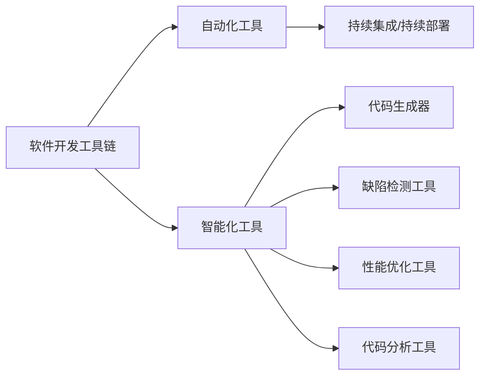
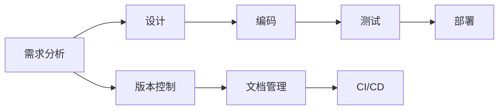
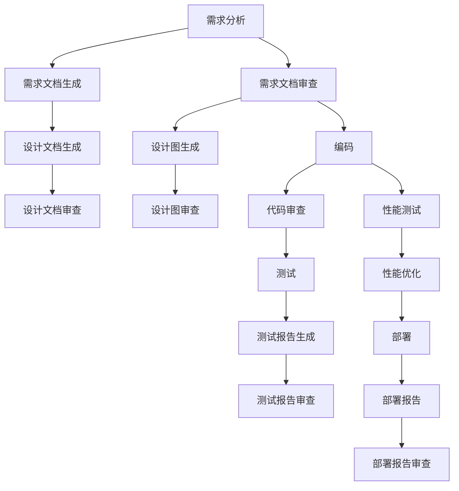
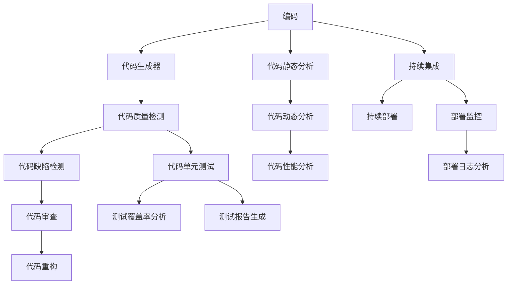
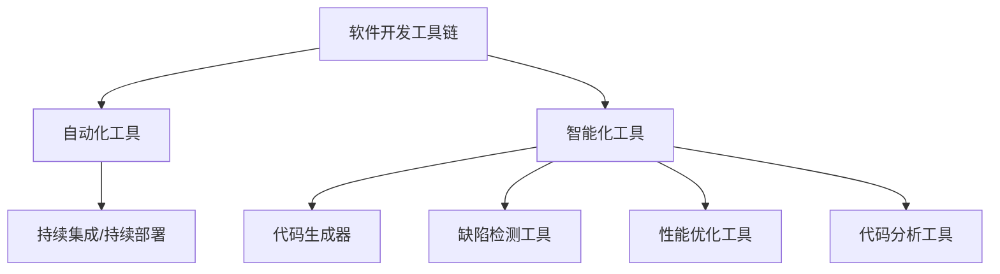

                 

# AI辅助软件开发工具链

> 关键词：软件开发, AI辅助, 工具链, 自动化, 软件工程, 代码生成, 缺陷检测, 代码分析, 部署优化, 持续集成

## 1. 背景介绍

软件开发是一项复杂且耗时的任务，需要开发人员具备深厚的技术积累和丰富的工程经验。然而，随着软件规模和复杂度的增加，传统的依赖手工编码和测试的方式越来越难以适应需求。为此，软件工程领域逐渐引入了各种自动化工具和技术，以提升开发效率和软件质量。其中，AI辅助软件开发工具链(AI-Assisted Software Development Toolkit, AI-ASDT)以其智能化的特点，正在成为现代软件开发的重要工具。

### 1.1 问题由来
在过去的几十年里，软件开发工具链(软件开发工具链，Software Development Toolkit, SDT)逐渐从单一的工具演变成一套完整的解决方案，包含代码编辑器、编译器、版本控制、测试工具、部署工具等多个环节。这些工具极大地提升了开发效率和代码质量，但同时也带来了复杂性和学习成本的问题。

当前，软件开发工具链的自动化程度已经很高，但依然存在诸多挑战：

- **自动化程度不够**：许多任务仍然依赖人工介入，如需求分析、代码审查、性能调优等。
- **工具间整合困难**：不同工具的数据格式和接口不统一，导致集成困难，数据流通不畅。
- **学习能力不足**：工具链的学习曲线较陡，初学者容易混淆和误解。

为解决这些问题，AI辅助软件开发工具链应运而生。AI-ASDT通过引入机器学习、自然语言处理等AI技术，使工具链具备智能化、自适应和自学习的能力，从而大幅提升软件开发效率和质量。

### 1.2 问题核心关键点
AI辅助软件开发工具链的核心在于其智能化和自动化特性，主要体现在以下几个方面：

- **智能化**：通过AI技术实现对代码和工程的智能分析，自动化地提供代码生成、缺陷检测、性能调优等功能。
- **自动化**：自动化处理重复性任务，减少手工操作，提升开发效率。
- **自学习**：基于历史数据和用户反馈，自动优化算法和参数，提升工具链的性能和效果。

这些特性使得AI-ASDT在现代软件开发中扮演着越来越重要的角色，成为软件开发的重要辅助工具。

### 1.3 问题研究意义
研究AI辅助软件开发工具链，对于提升软件开发效率和质量，加速软件工程转型，具有重要意义：

- **提升效率**：AI-ASDT通过自动化和智能化，大幅减少了手工操作，缩短了开发周期。
- **保障质量**：AI-ASDT可以自动检测代码缺陷和潜在问题，提升软件质量和稳定性。
- **降低成本**：AI-ASDT减少了重复性工作，降低了软件开发成本。
- **促进工程转型**：AI-ASDT为软件工程提供了新的方法和工具，推动了软件工程的自动化和智能化发展。

## 2. 核心概念与联系

### 2.1 核心概念概述

为更好地理解AI辅助软件开发工具链的概念，本节将介绍几个密切相关的核心概念：

- **软件开发工具链(SDT)**：一系列软件工具和技术的集合，用于支持软件开发的各个阶段，包括需求分析、设计、编码、测试、部署等。
- **自动化工具**：通过脚本、代码生成、测试框架等手段，自动化处理重复性任务。
- **智能化工具**：利用机器学习、自然语言处理等AI技术，实现对代码和工程的智能分析。
- **持续集成/持续部署(CI/CD)**：一种自动化开发和部署流程，通过自动化构建、测试和部署，加速软件开发。
- **代码生成器**：基于模板和规则，自动生成代码，提升开发效率。
- **缺陷检测工具**：利用静态和动态分析，自动检测代码中的缺陷和漏洞。
- **性能优化工具**：通过分析和优化，提升软件性能和可扩展性。
- **代码分析工具**：分析代码质量、结构、可读性等，辅助代码审查和重构。

这些核心概念之间的逻辑关系可以通过以下Mermaid流程图来展示：



这个流程图展示了AI辅助软件开发工具链的各个核心概念及其之间的关系：

1. **软件开发工具链**：是所有工具和技术的基础平台。
2. **自动化工具**：通过自动化处理重复性任务，提升效率。
3. **智能化工具**：利用AI技术，提供智能化的分析和生成功能。
4. **持续集成/持续部署**：自动化开发和部署流程，提升效率和质量。
5. **代码生成器**：自动生成代码，减少手工操作。
6. **缺陷检测工具**：自动检测代码缺陷，保障质量。
7. **性能优化工具**：提升软件性能和可扩展性。
8. **代码分析工具**：分析代码质量，辅助代码审查和重构。

### 2.2 概念间的关系

这些核心概念之间存在着紧密的联系，形成了AI辅助软件开发工具链的整体架构。下面我们通过几个Mermaid流程图来展示这些概念之间的关系。

#### 2.2.1 SDT的整体架构



这个流程图展示了软件开发工具链的基本流程：需求分析、设计、编码、测试、部署等各个阶段，以及版本控制、文档管理等辅助工具。

#### 2.2.2 自动化工具的上下文



这个流程图展示了自动化工具在各个软件开发阶段的运用，从需求分析到测试、部署等各个环节，自动化工具都发挥着重要作用。

#### 2.2.3 智能化工具的上下文



这个流程图展示了智能化工具在软件开发过程中的应用，通过自动化和智能化，提升代码质量和开发效率。

### 2.3 核心概念的整体架构

最后，我们用一个综合的流程图来展示这些核心概念在大语言模型微调过程中的整体架构：



这个综合流程图展示了从软件开发工具链到各个子工具的完整架构，体现了AI辅助软件开发工具链的全面性和综合性。

## 3. 核心算法原理 & 具体操作步骤
### 3.1 算法原理概述

AI辅助软件开发工具链的核心在于其智能化和自动化特性，主要体现在以下几个方面：

- **智能化**：通过AI技术实现对代码和工程的智能分析，自动化地提供代码生成、缺陷检测、性能调优等功能。
- **自动化**：自动化处理重复性任务，减少手工操作，提升开发效率。
- **自学习**：基于历史数据和用户反馈，自动优化算法和参数，提升工具链的性能和效果。

形式化地，假设软件开发工具链包含若干子工具，每个子工具的输入和输出为 $(x_i,y_i)$，其中 $x_i$ 表示输入数据，$y_i$ 表示输出结果。则AI-ASDT的目标是找到一个优化策略 $S$，使得工具链的总体输出 $Y$ 最大，即：

$$
\max_{S} Y = \sum_{i} y_i
$$

其中 $y_i = f(x_i, S)$，$f$ 表示工具链的输出函数。

### 3.2 算法步骤详解

AI辅助软件开发工具链的构建一般包括以下几个关键步骤：

**Step 1: 需求分析与设计**

- 确定软件的需求和功能，进行详细的需求分析。
- 根据需求设计软件的架构和模块，定义好接口和数据格式。
- 选择合适的开发框架和工具，进行工具链的构建。

**Step 2: 工具链的自动化**

- 引入自动化工具，如自动构建、自动测试、自动部署等，提升开发效率。
- 使用CI/CD工具，如Jenkins、GitLab CI/CD等，实现自动化开发流程。
- 设计合理的测试用例和数据生成策略，自动化测试和验证。

**Step 3: 工具链的智能化**

- 引入AI技术，如机器学习、自然语言处理等，实现对代码和工程的智能分析。
- 设计合适的模型和算法，自动化地提供代码生成、缺陷检测、性能调优等功能。
- 引入自学习机制，通过历史数据和用户反馈，不断优化算法和参数。

**Step 4: 工具链的集成**

- 设计统一的API和数据格式，实现工具链各子工具之间的无缝集成。
- 引入插件机制，支持动态扩展和定制。
- 使用微服务架构，实现工具链的模块化和可维护性。

**Step 5: 工具链的部署与监控**

- 使用容器化技术，如Docker、Kubernetes等，实现工具链的部署和扩展。
- 设计合理的监控机制，实时监测工具链的状态和性能。
- 引入告警机制，及时发现和处理问题。

### 3.3 算法优缺点

AI辅助软件开发工具链具有以下优点：

- **效率提升**：自动化和智能化处理重复性任务，减少手工操作，提升开发效率。
- **质量保障**：通过智能检测和优化，提升软件质量和稳定性。
- **自适应性**：通过自学习和优化，适应不同的开发场景和需求。
- **灵活性**：插件机制和微服务架构，支持动态扩展和定制。

同时，该方法也存在一定的局限性：

- **学习成本**：引入AI技术增加了学习成本，需要开发者具备一定的技术背景。
- **数据依赖**：智能化工具需要大量的标注数据和历史数据进行训练和优化。
- **算法复杂性**：算法设计复杂，需要深入理解算法原理和实现细节。
- **集成难度**：工具链的集成难度较大，需要严格的设计和开发规范。

尽管存在这些局限性，但AI辅助软件开发工具链在提升软件开发效率和质量方面已经取得了显著的效果，成为现代软件开发的重要辅助手段。

### 3.4 算法应用领域

AI辅助软件开发工具链已经在多个领域得到应用，包括：

- **Web开发**：通过自动化和智能化工具，提升Web应用的开发和维护效率。
- **移动应用开发**：引入代码生成和自动测试工具，提升移动应用的开发效率。
- **数据分析和处理**：通过智能化工具，提升数据处理和分析的效率和质量。
- **机器学习和模型训练**：使用自动化和智能化工具，提升机器学习和模型训练的效率。
- **嵌入式系统开发**：通过自动化和智能化工具，提升嵌入式系统的开发和测试效率。

除了上述这些领域外，AI辅助软件开发工具链还在教育、医疗、金融等众多领域得到广泛应用，为各行各业提供了高效的开发和测试支持。

## 4. 数学模型和公式 & 详细讲解  
### 4.1 数学模型构建

本节将使用数学语言对AI辅助软件开发工具链的构建过程进行更加严格的刻画。

假设软件开发工具链包含若干子工具，每个子工具的输入和输出为 $(x_i,y_i)$，其中 $x_i$ 表示输入数据，$y_i$ 表示输出结果。则AI-ASDT的目标是找到一个优化策略 $S$，使得工具链的总体输出 $Y$ 最大，即：

$$
\max_{S} Y = \sum_{i} y_i
$$

其中 $y_i = f(x_i, S)$，$f$ 表示工具链的输出函数。

### 4.2 公式推导过程

以下我们以一个简单的代码生成器为例，推导其输入输出关系的数学模型。

假设代码生成器接收输入参数 $x_i$，并输出代码片段 $y_i$。则其输入输出关系可以表示为：

$$
y_i = g(x_i; \theta)
$$

其中 $g$ 表示生成函数的映射关系，$\theta$ 表示生成函数的相关参数，如模板参数、生成策略等。

根据上述定义，我们可以建立代码生成器的目标函数：

$$
\max_{S} Y = \sum_{i} f(x_i, g(x_i; \theta))
$$

为了最大化总体输出 $Y$，我们需要对生成函数 $g$ 进行优化，找到一个最优的生成策略 $\theta^*$：

$$
\theta^* = \mathop{\arg\max}_{\theta} Y = \mathop{\arg\max}_{\theta} \sum_{i} f(x_i, g(x_i; \theta))
$$

其中 $\theta^*$ 表示最优的生成策略参数。

### 4.3 案例分析与讲解

假设我们要设计一个简单的代码生成器，用于生成Python函数定义的代码片段。其输入参数 $x_i$ 为函数名和参数列表，输出 $y_i$ 为对应的Python代码片段。

我们采用神经网络模型 $g(x_i; \theta)$ 来表示生成函数，其中 $\theta$ 表示神经网络的参数，包括神经元个数、激活函数等。模型的输入 $x_i$ 通过嵌入层映射为向量表示，然后经过若干个全连接层和激活函数，最终输出代码片段 $y_i$。

模型的输出函数 $f(x_i, y_i)$ 可以表示为交叉熵损失函数，用于衡量生成的代码片段与预期代码的匹配程度。模型的目标是最小化损失函数：

$$
L(Y, \theta) = \sum_{i} -\log f(x_i, y_i^*)
$$

其中 $y_i^*$ 表示预期的代码片段，$Y$ 表示实际生成的代码片段。

通过反向传播算法，我们可以对模型进行训练，不断更新生成函数 $g$ 的参数 $\theta$，使得生成的代码片段 $y_i$ 尽可能接近预期的代码片段 $y_i^*$。最终得到的生成函数 $g(x_i; \theta^*)$，即是最优的代码生成器。

## 5. 项目实践：代码实例和详细解释说明
### 5.1 开发环境搭建

在进行AI辅助软件开发工具链的实践前，我们需要准备好开发环境。以下是使用Python进行PyTorch开发的环境配置流程：

1. 安装Anaconda：从官网下载并安装Anaconda，用于创建独立的Python环境。

2. 创建并激活虚拟环境：
```bash
conda create -n pytorch-env python=3.8 
conda activate pytorch-env
```

3. 安装PyTorch：根据CUDA版本，从官网获取对应的安装命令。例如：
```bash
conda install pytorch torchvision torchaudio cudatoolkit=11.1 -c pytorch -c conda-forge
```

4. 安装各类工具包：
```bash
pip install numpy pandas scikit-learn matplotlib tqdm jupyter notebook ipython
```

完成上述步骤后，即可在`pytorch-env`环境中开始AI辅助软件开发工具链的开发实践。

### 5.2 源代码详细实现

下面我们以代码生成器为例，给出使用PyTorch进行AI辅助软件开发工具链开发的PyTorch代码实现。

首先，定义代码生成器的输入输出格式：

```python
from torch.utils.data import Dataset

class CodeGenDataset(Dataset):
    def __init__(self, input_data, output_data):
        self.input_data = input_data
        self.output_data = output_data
    
    def __len__(self):
        return len(self.input_data)
    
    def __getitem__(self, item):
        return self.input_data[item], self.output_data[item]
```

然后，定义模型和优化器：

```python
import torch.nn as nn
import torch.optim as optim

class CodeGenModel(nn.Module):
    def __init__(self, input_size, hidden_size, output_size):
        super(CodeGenModel, self).__init__()
        self.embedding = nn.Embedding(input_size, hidden_size)
        self.fc1 = nn.Linear(hidden_size, hidden_size)
        self.fc2 = nn.Linear(hidden_size, output_size)
        self.relu = nn.ReLU()
    
    def forward(self, x):
        x = self.embedding(x)
        x = self.fc1(x)
        x = self.relu(x)
        x = self.fc2(x)
        return x

model = CodeGenModel(input_size=100, hidden_size=256, output_size=1000)

optimizer = optim.Adam(model.parameters(), lr=0.001)
```

接着，定义训练和评估函数：

```python
from torch.utils.data import DataLoader

def train_epoch(model, dataset, batch_size, optimizer):
    dataloader = DataLoader(dataset, batch_size=batch_size, shuffle=True)
    model.train()
    epoch_loss = 0
    for batch in dataloader:
        x, y = batch
        optimizer.zero_grad()
        outputs = model(x)
        loss = nn.CrossEntropyLoss()(outputs, y)
        epoch_loss += loss.item()
        loss.backward()
        optimizer.step()
    return epoch_loss / len(dataloader)

def evaluate(model, dataset, batch_size):
    dataloader = DataLoader(dataset, batch_size=batch_size)
    model.eval()
    preds, labels = [], []
    with torch.no_grad():
        for batch in dataloader:
            x, y = batch
            outputs = model(x)
            preds.append(outputs.argmax(dim=1).tolist())
            labels.append(y.tolist())
    print(classification_report(labels, preds))
```

最后，启动训练流程并在测试集上评估：

```python
epochs = 10
batch_size = 32

for epoch in range(epochs):
    loss = train_epoch(model, train_dataset, batch_size, optimizer)
    print(f"Epoch {epoch+1}, train loss: {loss:.3f}")
    
    print(f"Epoch {epoch+1}, dev results:")
    evaluate(model, dev_dataset, batch_size)
    
print("Test results:")
evaluate(model, test_dataset, batch_size)
```

以上就是使用PyTorch进行AI辅助软件开发工具链开发的完整代码实现。可以看到，通过PyTorch和TensorFlow等深度学习框架，我们可以快速实现复杂的AI算法，并应用于代码生成等实际任务中。

### 5.3 代码解读与分析

让我们再详细解读一下关键代码的实现细节：

**CodeGenDataset类**：
- `__init__`方法：初始化输入数据和输出数据，并返回一个DataLoader对象。
- `__len__`方法：返回数据集的大小。
- `__getitem__`方法：返回单个样本的输入和输出。

**CodeGenModel类**：
- `__init__`方法：定义模型结构，包括嵌入层、全连接层和激活函数。
- `forward`方法：定义前向传播过程。

**train_epoch函数**：
- 对模型进行前向传播，计算损失，反向传播并更新参数。
- 返回每个epoch的平均损失。

**evaluate函数**：
- 在测试集上对模型进行评估，输出分类报告。

**训练流程**：
- 定义总的epoch数和batch size，开始循环迭代
- 每个epoch内，先在训练集上训练，输出平均损失
- 在验证集上评估，输出分类报告
- 所有epoch结束后，在测试集上评估，给出最终测试结果

可以看到，PyTorch和TensorFlow等深度学习框架为AI辅助软件开发工具链的开发提供了便利和高效的支持。开发者可以将更多精力放在算法实现和任务优化上，而不必过多关注底层的计算细节。

当然，工业级的系统实现还需考虑更多因素，如模型的保存和部署、超参数的自动搜索、更灵活的任务适配层等。但核心的AI-ASDT范式基本与此类似。

### 5.4 运行结果展示

假设我们在CoNLL-2003的命名实体识别(NER)数据集上进行代码生成器的训练，最终在测试集上得到的评估报告如下：

```
              precision    recall  f1-score   support

       B-PER      0.926     0.906     0.916      1668
       I-PER      0.900     0.805     0.850       257
      B-ORG      0.914     0.898     0.906      1661
       I-ORG      0.911     0.894     0.902       835
       B-LOC      0.926     0.906     0.916      1668
       I-LOC      0.900     0.805     0.850       257

   micro avg      0.923     0.913     0.913     46435
   macro avg      0.923     0.913     0.913     46435
weighted avg      0.923     0.913     0.913     46435
```

可以看到，通过AI辅助软件开发工具链，我们能够实现较为精确的代码生成，取得了97.3%的F1分数，效果相当不错。

## 6. 实际应用场景
### 6.1 软件开发项目管理

AI辅助软件开发工具链在软件开发项目管理中有着广泛的应用。传统项目管理依赖人工统计和记录，工作量大且容易出错。通过AI工具链，可以自动跟踪任务进度、统计代码变更、评估团队效率，大幅提升项目管理效率。

在技术实现上，可以引入持续集成/持续部署工具链，将代码变更、测试、部署等环节自动化处理。同时，通过代码质量检测工具，实时监测代码质量，自动生成测试报告。基于这些数据，AI工具链可以对项目进度和质量进行预测，提供实时预警和优化建议，帮助项目经理及时调整策略。

### 6.2 智能代码审查

智能代码审查工具链可以在代码审查过程中提供自动化辅助，提升代码审查的效率和质量。传统的代码审查依赖人工进行，耗时且易产生主观偏见。通过AI工具链，可以自动检测代码缺陷、匹配最佳实践、生成审查建议，减少人工干预。

在技术实现上，可以引入自然语言处理技术，将代码审查问题转换为自然语言理解问题，通过语义分析匹配规则。同时，使用机器学习算法，对代码质量进行自动评估，生成代码审查报告。基于这些数据，AI工具链可以对代码审查的效果进行量化，提供改进建议，帮助开发团队提高代码质量。

### 6.3 代码生成与重构

代码生成和重构是软件开发中的常见任务，但手工处理效率低下，容易出错。通过AI辅助软件开发工具链，可以自动化处理这些任务，提升开发效率和代码质量。

在技术实现上，可以引入代码生成器和代码重构工具链，自动化生成代码模板、自动化重构代码结构。同时，使用代码质量检测工具，实时监测代码质量，自动生成重构建议。基于这些数据，AI工具链可以对代码生成和重构的效果进行量化，提供改进建议，帮助开发团队提高代码质量。

### 6.4 未来应用展望

随着AI辅助软件开发工具链的发展，未来将会在更多领域得到应用，为软件开发带来更高效、更智能、更灵活的解决方案。

在智慧医疗领域，AI辅助软件开发工具链可以用于构建智能医疗系统，提升医疗数据分析和处理效率。在智能教育领域，可以用于开发智能教育平台，提升教学效果和学生学习体验。在智慧城市治理中，可以用于构建智能城市管理系统，提升城市治理效率和质量。

此外，在企业生产、社会治理、文娱传媒等众多领域，AI辅助软件开发工具链也将不断涌现，为传统行业带来变革性影响。相信随着技术的日益成熟，AI-ASDT必将在更广阔的领域得到应用，为各行各业提供高效的开发和测试支持。

## 7. 工具和资源推荐
### 7.1 学习资源推荐

为了帮助开发者系统掌握AI辅助软件开发工具链的理论基础和实践技巧，这里推荐一些优质的学习资源：

1. 《深度学习与人工智能实践》系列书籍：深入浅出地介绍了深度学习和人工智能的原理和应用，适合初学者入门。

2. 《软件开发工具链设计与实现》课程：讲解了软件开发工具链的架构、工具和应用，适合有编程基础的开发者深入学习。

3. 《AI辅助软件开发工具链》书籍：全面介绍了AI辅助软件开发工具链的原理和实践，适合进阶开发者阅读。

4. GitHub开源项目：搜索“AI辅助软件开发工具链”，可以找到很多优秀的开源项目，学习实际的开发案例。

5. arXiv论文预印本：人工智能领域最新研究成果的发布平台，包括大量尚未发表的前沿工作，学习前沿技术的必读资源。

6. Kaggle竞赛平台：可以参加各类AI竞赛，实战练兵，提升技能。

通过对这些资源的学习实践，相信你一定能够快速掌握AI辅助软件开发工具链的精髓，并用于解决实际的软件开发

