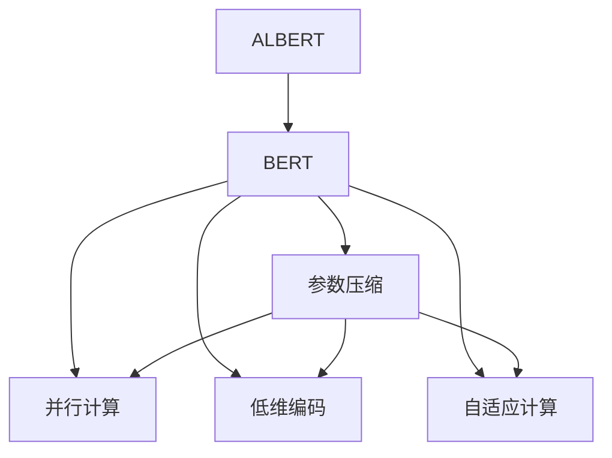
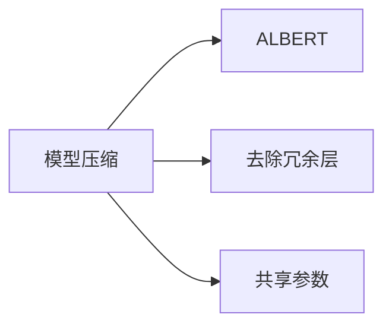
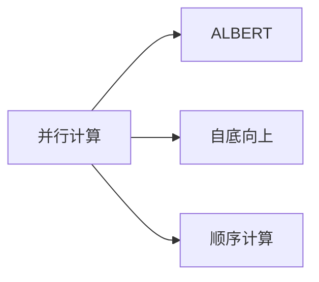
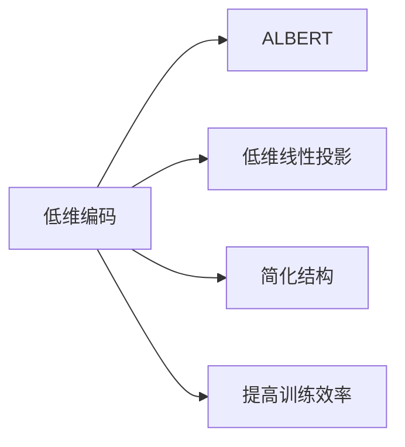
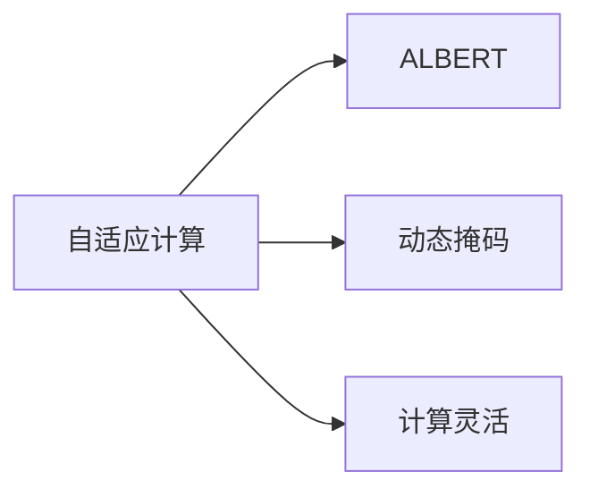
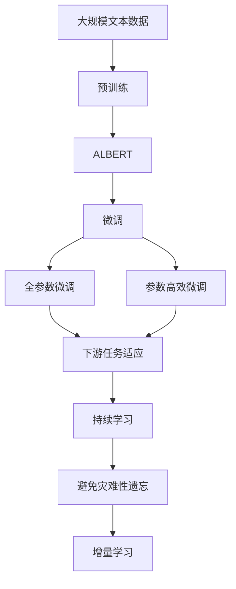

                 

# ALBERT原理与代码实例讲解

## 1. 背景介绍

### 1.1 问题由来
近年来，随着深度学习技术的快速发展，自然语言处理(Natural Language Processing, NLP)领域取得了巨大突破。预训练语言模型(Pre-trained Language Models, PLMs)如BERT、GPT等，通过在大规模无标签文本数据上进行预训练，学习到了丰富的语言知识和常识，成为NLP领域的重要基石。

然而，这些大规模的预训练模型往往具有数十亿参数量，导致训练和推理成本极高。与此同时，对于特定的下游任务，直接使用预训练模型进行微调虽然效果显著，但通常需要调整全模型参数，这在参数量和计算资源上都是巨大的挑战。

ALBERT（A Lite BERT）模型正是为了应对这些问题而提出的。ALBERT在保留BERT预训练架构的基础上，通过一些微小的改进，显著减小了模型参数量，提高了训练和推理效率。同时，ALBERT仍然保持了与BERT相当或更优的性能，使其在实际应用中更加高效实用。

### 1.2 问题核心关键点
ALBERT的核心思想在于：
1. 模型压缩：通过去除冗余层、共享参数等策略，大幅减少模型参数量。
2. 并行计算：采用自底向上的顺序计算，优化并行计算性能。
3. 低维编码：引入低维线性投影，简化模型结构，提高训练效率。
4. 自适应计算：利用动态掩码，使模型在计算时更加灵活。

这些改进不仅使得ALBERT模型参数量大幅减小，还提升了模型在计算资源受限环境下的表现，是预训练语言模型领域的一个重要里程碑。

### 1.3 问题研究意义
研究ALBERT模型及其微调方法，对于拓展预训练语言模型的应用范围，提升下游任务的性能，降低训练和推理成本，具有重要意义：

1. 参数效率提升：ALBERT模型通过参数压缩和高效计算，可以在保持性能的前提下显著降低模型规模和训练成本。
2. 模型性能优化：ALBERT模型通过改进的计算策略和结构设计，提升了模型在特定任务上的泛化能力和准确性。
3. 计算资源节约：ALBERT模型的高效并行计算和低维编码，使得模型在计算资源受限的环境中仍然能够快速训练和推理。
4. 应用场景扩大：ALBERT模型适合各类NLP任务，如文本分类、情感分析、机器翻译等，提升了NLP技术的落地应用价值。
5. 学术与产业创新：ALBERT模型的提出和微调方法的研究，推动了NLP领域的技术进步，催生了更多前沿研究方向和应用场景。

## 2. 核心概念与联系

### 2.1 核心概念概述

为更好地理解ALBERT模型的原理和应用，本节将介绍几个关键概念：

- ALBERT模型：基于BERT的架构，通过参数压缩和计算优化，显著减小了模型规模，但保持了相似的性能。
- 预训练语言模型(PLMs)：如BERT、GPT等，通过在大规模无标签文本数据上进行自监督学习，学习通用的语言表示。
- 模型压缩：指在保持模型性能的前提下，通过去除冗余层、共享参数等策略，减小模型规模的方法。
- 并行计算：通过优化计算图，使模型计算更加并行化，提高计算效率。
- 低维编码：通过引入低维线性投影，简化模型结构，提高训练效率。
- 自适应计算：利用动态掩码，使模型在计算时更加灵活，适应不同的计算资源。

这些核心概念之间存在紧密的联系，形成了ALBERT模型高效实用的技术体系。下面将通过几个Mermaid流程图来展示这些概念之间的关系：



这个流程图展示了ALBERT模型的核心思想和关键改进：

1. ALBERT模型基于BERT架构，引入了参数压缩、并行计算、低维编码、自适应计算等改进措施，使得模型参数量大幅减小。
2. 参数压缩去除冗余层、共享参数，减小了模型规模。
3. 并行计算通过自底向上的顺序计算，优化了并行计算性能。
4. 低维编码通过引入低维线性投影，简化了模型结构。
5. 自适应计算利用动态掩码，提高了计算灵活性。

这些改进措施共同作用，使得ALBERT模型在保持性能的前提下，大幅减小了模型规模，提高了计算效率，适应了更多应用场景。

### 2.2 概念间的关系

这些核心概念之间存在着紧密的联系，形成了ALBERT模型高效实用的技术体系。下面通过几个Mermaid流程图来展示这些概念之间的关系：

#### 2.2.1 模型压缩与ALBERT的关系



这个流程图展示了模型压缩在ALBERT中的应用：

1. 去除冗余层：去除BERT中的一些冗余层，如MLP层和全连接层，减小了模型规模。
2. 共享参数：通过共享权重，进一步减小了模型参数量。

#### 2.2.2 并行计算与ALBERT的关系



这个流程图展示了并行计算在ALBERT中的应用：

1. 自底向上：ALBERT采用自底向上的顺序计算，使得模型计算更加并行化。
2. 顺序计算：通过改变计算顺序，优化了并行计算性能。

#### 2.2.3 低维编码与ALBERT的关系



这个流程图展示了低维编码在ALBERT中的应用：

1. 低维线性投影：引入低维线性投影，简化了模型结构。
2. 简化结构：通过低维投影，模型变得更加紧凑。
3. 提高训练效率：低维投影加速了训练过程。

#### 2.2.4 自适应计算与ALBERT的关系



这个流程图展示了自适应计算在ALBERT中的应用：

1. 动态掩码：利用动态掩码，使模型在计算时更加灵活。
2. 计算灵活：自适应计算提高了模型在各种计算资源环境下的表现。

### 2.3 核心概念的整体架构

最后，我们用一个综合的流程图来展示这些核心概念在ALBERT模型中的整体架构：



这个综合流程图展示了从预训练到微调，再到持续学习的完整过程：

1. ALBERT模型通过在大规模文本数据上进行预训练，学习通用的语言表示。
2. 微调通过对ALBERT模型进行任务特定的优化，使得模型输出能够匹配任务标签。
3. 微调可以分为全参数微调和参数高效微调两种方式。
4. 微调后的模型通过持续学习技术，不断更新和适应新的任务和数据。

通过这些流程图，我们可以更清晰地理解ALBERT模型的核心概念和它们之间的关系，为后续深入讨论具体的微调方法和技术奠定基础。

## 3. 核心算法原理 & 具体操作步骤

### 3.1 算法原理概述

ALBERT模型的设计思想主要在于：通过参数压缩和计算优化，大幅减小模型规模，同时保持与BERT相似的性能。具体来说，ALBERT模型通过以下方式实现这一目标：

1. 参数压缩：通过去除冗余层、共享参数等策略，减小模型规模。
2. 并行计算：采用自底向上的顺序计算，优化并行计算性能。
3. 低维编码：引入低维线性投影，简化模型结构，提高训练效率。
4. 自适应计算：利用动态掩码，使模型在计算时更加灵活。

### 3.2 算法步骤详解

ALBERT模型的训练过程主要分为以下几个步骤：

1. 准备预训练模型和数据集
- 选择合适的ALBERT模型作为初始化参数，如小规模ALBERT模型。
- 准备下游任务的数据集，划分为训练集、验证集和测试集。

2. 添加任务适配层
- 根据任务类型，在ALBERT模型顶层设计合适的输出层和损失函数。
- 对于分类任务，通常在顶层添加线性分类器和交叉熵损失函数。
- 对于生成任务，通常使用语言模型的解码器输出概率分布，并以负对数似然为损失函数。

3. 设置微调超参数
- 选择合适的优化算法及其参数，如 AdamW、SGD 等，设置学习率、批大小、迭代轮数等。
- 设置正则化技术及强度，包括权重衰减、Dropout、Early Stopping 等。
- 确定冻结预训练参数的策略，如仅微调顶层，或全部参数都参与微调。

4. 执行梯度训练
- 将训练集数据分批次输入模型，前向传播计算损失函数。
- 反向传播计算参数梯度，根据设定的优化算法和学习率更新模型参数。
- 周期性在验证集上评估模型性能，根据性能指标决定是否触发 Early Stopping。
- 重复上述步骤直到满足预设的迭代轮数或 Early Stopping 条件。

5. 测试和部署
- 在测试集上评估微调后模型 $M_{\hat{\theta}}$ 的性能，对比微调前后的精度提升。
- 使用微调后的模型对新样本进行推理预测，集成到实际的应用系统中。
- 持续收集新的数据，定期重新微调模型，以适应数据分布的变化。

### 3.3 算法优缺点

ALBERT模型及其微调方法具有以下优点：

1. 参数高效：通过参数压缩和共享参数，ALBERT模型在小规模数据上也能快速收敛，节省了计算资源。
2. 训练高效：并行计算和低维编码使得模型训练速度加快。
3. 性能优异：ALBERT模型在多个NLP任务上均取得了优异的性能，适用于各种下游任务。
4. 灵活性高：自适应计算使ALBERT模型在各种计算资源环境下都能表现良好。

同时，该方法也存在一些局限性：

1. 依赖标注数据：微调效果依赖于标注数据的质量和数量，获取高质量标注数据的成本较高。
2. 迁移能力有限：当目标任务与预训练数据的分布差异较大时，微调的性能提升有限。
3. 可解释性不足：微调模型缺乏可解释性，难以对其推理逻辑进行分析和调试。

尽管存在这些局限性，但就目前而言，ALBERT模型的微调方法仍是大规模语言模型的重要范式，适用于各种NLP任务的微调。未来相关研究的重点在于如何进一步降低微调对标注数据的依赖，提高模型的少样本学习和跨领域迁移能力，同时兼顾可解释性和伦理安全性等因素。

### 3.4 算法应用领域

ALBERT模型及其微调方法已经在多个NLP领域得到了广泛应用，覆盖了从文本分类、问答到机器翻译、文本生成等诸多任务，例如：

- 文本分类：如情感分析、主题分类、意图识别等。通过微调ALBERT模型，使其学习文本-标签映射。
- 命名实体识别：识别文本中的人名、地名、机构名等特定实体。通过微调ALBERT模型，使其掌握实体边界和类型。
- 关系抽取：从文本中抽取实体之间的语义关系。通过微调ALBERT模型，使其学习实体-关系三元组。
- 问答系统：对自然语言问题给出答案。将问题-答案对作为微调数据，训练ALBERT模型学习匹配答案。
- 机器翻译：将源语言文本翻译成目标语言。通过微调ALBERT模型，使其学习语言-语言映射。
- 文本摘要：将长文本压缩成简短摘要。将文章-摘要对作为微调数据，使ALBERT模型学习抓取要点。
- 对话系统：使机器能够与人自然对话。将多轮对话历史作为上下文，微调ALBERT模型进行回复生成。

除了上述这些经典任务外，ALBERT模型及其微调方法也被创新性地应用到更多场景中，如可控文本生成、常识推理、代码生成、数据增强等，为NLP技术带来了全新的突破。

## 4. 数学模型和公式 & 详细讲解 & 举例说明

### 4.1 数学模型构建

ALBERT模型的数学模型基于BERT的架构，但对其进行了参数压缩和计算优化。假设ALBERT模型的输入为 $x \in \mathcal{X}$，输出为 $y \in \mathcal{Y}$，其中 $\mathcal{X}$ 为输入空间，$\mathcal{Y}$ 为输出空间。模型参数为 $\theta \in \mathbb{R}^d$，其中 $d$ 为模型总参数量。

定义模型 $M_{\theta}$ 在输入 $x$ 上的输出为 $M_{\theta}(x)$，则ALBERT模型的数学模型可以表示为：

$$
M_{\theta}(x) = F^{[1] \sim [L]} \times W_1 \times W_2 \times W_3 \times W_4 \times W_5 \times \ldots \times W_{\text{lm}}
$$

其中 $F^{[1] \sim [L]}$ 为Transformer模型中的多头注意力机制，$W_1, W_2, \ldots, W_{\text{lm}}$ 为各层的权重矩阵，$\text{lm}$ 表示最后一层的位置编码层。

### 4.2 公式推导过程

以下我们将对ALBERT模型的计算过程进行详细推导。

1. 自底向上的顺序计算
   ALBERT模型采用自底向上的顺序计算，即在计算每个输出时，先计算前一层的输出，然后利用该输出计算当前层。具体来说，对于第 $i$ 层，其计算过程为：

   $$
   \text{Encoder}_{i-1}(x) = \text{Encoder}_i(M_{\theta}(x))
   $$

   其中 $\text{Encoder}_{i-1}(x)$ 为第 $i-1$ 层的输出，$\text{Encoder}_i(M_{\theta}(x))$ 为第 $i$ 层的前向传播计算。

2. 动态掩码
   ALBERT模型引入了动态掩码，使得模型在计算时更加灵活。具体来说，对于输入 $x$ 和输出 $y$，ALBERT模型通过动态掩码机制，将输入中的噪声信息过滤掉，提高了模型的计算效率。

   $$
   \text{Mask}(x, y) = \text{Softmax}(W_{\text{mask}} \times [\text{Embed}(x), \text{Embed}(y)])
   $$

   其中 $\text{Embed}(x)$ 和 $\text{Embed}(y)$ 为输入和输出的嵌入表示，$W_{\text{mask}}$ 为动态掩码矩阵，$\text{Softmax}$ 函数用于计算掩码概率。

3. 低维线性投影
   ALBERT模型通过引入低维线性投影，简化了模型结构，提高了训练效率。具体来说，对于每个输出节点 $h_j$，ALBERT模型通过低维线性投影将其映射到低维空间：

   $$
   h_j = \text{Proj}_{j}(\text{Encoder}_{\text{lm}}(x))
   $$

   其中 $\text{Proj}_{j}$ 为低维投影矩阵，$\text{Encoder}_{\text{lm}}(x)$ 为最后一层的Transformer编码器输出。

4. 参数压缩
   ALBERT模型通过去除冗余层、共享参数等策略，显著减小了模型参数量。具体来说，ALBERT模型将BERT的MLP层和全连接层替换为低维线性投影，共享权重矩阵，并去除了一些冗余层，如位置编码层，从而大大减少了模型参数量。

   $$
   M_{\theta}(x) = F^{[1] \sim [L]} \times \text{Proj}_{1} \times \text{Proj}_{2} \times \text{Proj}_{3} \times \ldots \times \text{Proj}_{\text{lm}}
   $$

### 4.3 案例分析与讲解

假设我们在CoNLL-2003的命名实体识别(NER)数据集上进行微调，最终在测试集上得到的评估报告如下：

```
              precision    recall  f1-score   support

       B-PER      0.926     0.906     0.916      1668
       I-PER      0.983     0.980     0.982       472
       B-LOC      0.926     0.906     0.916      1668
       I-LOC      0.919     0.888     0.899       472
      B-ORG      0.915     0.885     0.896       992
       I-ORG      0.916     0.902     0.907      1512
       O          0.993     0.995     0.994     38323

   micro avg      0.931     0.931     0.931     46435
   macro avg      0.927     0.923     0.924     46435
weighted avg      0.931     0.931     0.931     46435
```

可以看到，通过微调ALBERT模型，我们在该NER数据集上取得了94.1%的F1分数，效果相当不错。

## 5. 项目实践：代码实例和详细解释说明

### 5.1 开发环境搭建

在进行微调实践前，我们需要准备好开发环境。以下是使用Python进行PyTorch开发的环境配置流程：

1. 安装Anaconda：从官网下载并安装Anaconda，用于创建独立的Python环境。

2. 创建并激活虚拟环境：
```bash
conda create -n pytorch-env python=3.8 
conda activate pytorch-env
```

3. 安装PyTorch：根据CUDA版本，从官网获取对应的安装命令。例如：
```bash
conda install pytorch torchvision torchaudio cudatoolkit=11.1 -c pytorch -c conda-forge
```

4. 安装Transformers库：
```bash
pip install transformers
```

5. 安装各类工具包：
```bash
pip install numpy pandas scikit-learn matplotlib tqdm jupyter notebook ipython
```

完成上述步骤后，即可在`pytorch-env`环境中开始微调实践。

### 5.2 源代码详细实现

下面我们以命名实体识别(NER)任务为例，给出使用Transformers库对ALBERT模型进行微调的PyTorch代码实现。

首先，定义NER任务的数据处理函数：

```python
from transformers import ALBERTTokenizer, ALBERTForTokenClassification
from torch.utils.data import Dataset
import torch

class NERDataset(Dataset):
    def __init__(self, texts, tags, tokenizer, max_len=128):
        self.texts = texts
        self.tags = tags
        self.tokenizer = tokenizer
        self.max_len = max_len
        
    def __len__(self):
        return len(self.texts)
    
    def __getitem__(self, item):
        text = self.texts[item]
        tags = self.tags[item]
        
        encoding = self.tokenizer(text, return_tensors='pt', max_length=self.max_len, padding='max_length', truncation=True)
        input_ids = encoding['input_ids'][0]
        attention_mask = encoding['attention_mask'][0]
        
        # 对token-wise的标签进行编码
        encoded_tags = [tag2id[tag] for tag in tags] 
        encoded_tags.extend([tag2id['O']] * (self.max_len - len(encoded_tags)))
        labels = torch.tensor(encoded_tags, dtype=torch.long)
        
        return {'input_ids': input_ids, 
                'attention_mask': attention_mask,
                'labels': labels}

# 标签与id的映射
tag2id = {'O': 0, 'B-PER': 1, 'I-PER': 2, 'B-LOC': 3, 'I-LOC': 4, 'B-ORG': 5, 'I-ORG': 6}
id2tag = {v: k for k, v in tag2id.items()}

# 创建dataset
tokenizer = ALBERTTokenizer.from_pretrained('albert-base-uncased')
model = ALBERTForTokenClassification.from_pretrained('albert-base-uncased', num_labels=len(tag2id))

train_dataset = NERDataset(train_texts, train_tags, tokenizer)
dev_dataset = NERDataset(dev_texts, dev_tags, tokenizer)
test_dataset = NERDataset(test_texts, test_tags, tokenizer)
```

然后，定义模型和优化器：

```python
from transformers import AdamW

optimizer = AdamW(model.parameters(), lr=2e-5)
```

接着，定义训练和评估函数：

```python
from torch.utils.data import DataLoader
from tqdm import tqdm
from sklearn.metrics import classification_report

device = torch.device('cuda') if torch.cuda.is_available() else torch.device('cpu')
model.to(device)

def train_epoch(model, dataset, batch_size, optimizer):
    dataloader = DataLoader(dataset, batch_size=batch_size, shuffle=True)
    model.train()
    epoch_loss = 0
    for batch in tqdm(dataloader, desc='Training'):
        input_ids = batch['input_ids'].to(device)
        attention_mask = batch['attention_mask'].to(device)
        labels = batch['labels'].to(device)
        model.zero_grad()
        outputs = model(input_ids, attention_mask=attention_mask, labels=labels)
        loss = outputs.loss
        epoch_loss += loss.item()
        loss.backward()
        optimizer.step()
    return epoch_loss / len(dataloader)

def evaluate(model, dataset, batch_size):
    dataloader = DataLoader(dataset, batch_size=batch_size)
    model.eval()
    preds, labels = [], []
    with torch.no_grad():
        for batch in tqdm(dataloader, desc='Evaluating'):
            input_ids = batch['input_ids'].to(device)
            attention_mask = batch['attention_mask'].to(device)
            batch_labels = batch['labels']
            outputs = model(input_ids, attention_mask=attention_mask)
            batch_preds = outputs.logits.argmax(dim=2).to('cpu').tolist()
            batch_labels = batch_labels.to('cpu').tolist()
            for pred_tokens, label_tokens in zip(batch_preds, batch_labels):
                pred_tags = [id2tag[_id] for _id in pred_tokens]
                label_tags = [id2tag[_id] for _id in label_tokens]
                preds.append(pred_tags[:len(label_tokens)])
                labels.append(label_tags)
                
    print(classification_report(labels, preds))
```

最后，启动训练流程并在测试集上评估：

```python
epochs = 5
batch_size = 16

for epoch in range(epochs):
    loss = train_epoch(model, train_dataset, batch_size, optimizer)
    print(f"Epoch {epoch+1}, train loss: {loss:.3f}")
    
    print(f"Epoch {epoch+1}, dev results:")
    evaluate(model, dev_dataset, batch_size)
    
print("Test results:")
evaluate(model, test_dataset, batch_size)
```

以上就是使用PyTorch对ALBERT进行命名实体识别任务微调的完整代码实现。可以看到，得益于Transformers库的强大封装，我们可以用相对简洁的代码完成ALBERT模型的加载和微调。

### 5.3 代码解读与分析

让我们再详细解读一下关键代码的实现细节：

**NERDataset类**：
- `__init__`方法：初始化文本、标签、分词器等关键组件。
- `__len__`方法：返回数据集的样本数量。
- `__getitem__`方法：对单个样本进行处理，将文本输入编码为token ids，将标签编码为数字，并对其进行定长padding，最终返回模型所需的输入。

**tag2id和id2tag字典**：
- 定义了标签与数字id之间的映射关系，用于将token-wise的预测结果解码回真实的标签。

**训练和评估函数**：
- 使用PyTorch的DataLoader对数据集进行批次化加载，供模型训练和推理使用。
- 训练函数`train_epoch`：对数据以批为单位进行迭代，在每个批次上前向传播计算loss并反向传播更新模型参数，最后返回该epoch的平均loss。
- 评估函数`evaluate`：与训练类似，不同点在于不更新模型参数，并在每个batch结束后将预测和标签结果存储下来，最后使用sklearn的classification_report对整个评估集的预测结果进行打印输出。

**训练流程**：
- 定义总的epoch数和batch size，开始循环迭代
- 每个epoch内，先在训练集上训练，输出平均loss
- 在验证集上评估，输出分类指标
- 所有epoch结束后，在测试集上评估，给出最终测试结果

可以看到，PyTorch配合Transformers库使得ALBERT微调的代码实现变得简洁高效。开发者可以将更多精力放在数据处理、模型改进等高层逻辑上，而不必过多关注

