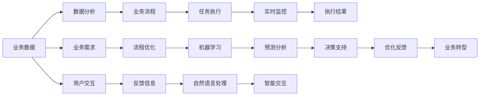

                 

# Agentic Workflow 的市场潜力

> 关键词：Agentic Workflow, 人工智能, 自动化流程, 企业管理, 业务流程, 效率提升, 企业转型

## 1. 背景介绍

### 1.1 问题由来
近年来，随着企业数字化转型的加速推进，自动化流程（Agentic Workflow）在提升企业效率、优化管理、降低成本等方面的价值愈发凸显。企业通过自动化流程改造，能够在不同程度上实现业务操作的自动化，从而提高运营效率，缩短决策周期，提升客户体验。

然而，传统企业级自动化流程往往存在以下问题：

- **复杂度高**：企业内部的自动化流程设计复杂，难以快速部署和扩展。
- **灵活性差**：流程过于刚性，难以快速响应市场变化和业务需求调整。
- **协作困难**：各部门之间的流程衔接不畅，数据共享困难，导致整体流程效率低下。
- **用户体验差**：自动化流程缺乏人性化和智能化的设计，往往给员工和客户带来不便。

针对这些问题，Agentic Workflow应运而生。Agentic Workflow是一种基于人工智能技术的自动化流程管理系统，通过智能分析和协同工作，实现业务流程的自动化、智能化、人性化。

### 1.2 问题核心关键点
Agentic Workflow的核心在于将人工智能技术融入流程自动化，通过智能分析、预测和优化，提升流程的效率和灵活性。其主要特点包括：

- **智能分析**：通过机器学习算法对历史数据进行分析，预测流程中的瓶颈和优化点。
- **流程自动化**：利用机器人流程自动化（RPA）技术，自动执行重复性高、规则明确的流程任务。
- **数据共享与协作**：建立跨部门的数据共享平台，促进信息透明和协作效率。
- **用户体验提升**：采用自然语言处理（NLP）技术，提升流程系统的交互性和人性化。

Agentic Workflow通过这些关键技术手段，旨在构建一个高效、灵活、智能的自动化流程管理系统，助力企业提升管理效率和竞争力。

### 1.3 问题研究意义
Agentic Workflow的推广和应用，对于提升企业流程管理水平、推动数字化转型具有重要意义：

1. **降低运营成本**：自动化流程减少人工参与，提高资源利用效率，降低人力成本。
2. **提高运营效率**：智能分析和自动化执行大大缩短流程周期，提升整体运营效率。
3. **增强决策支持**：通过数据分析和预测，为企业决策提供更可靠的依据。
4. **优化客户体验**：智能化交互和数据共享，提高客户满意度和服务质量。
5. **加速数字化转型**：Agentic Workflow作为数字化转型的重要组成部分，推动企业向智能化、自动化方向发展。

## 2. 核心概念与联系

### 2.1 核心概念概述

为更好地理解Agentic Workflow的核心概念及其应用，本节将介绍几个密切相关的核心概念：

- **自动化流程（Agentic Workflow）**：基于人工智能技术的自动化流程管理系统，通过智能分析、自动化执行、数据共享和协同工作，实现业务流程的自动化、智能化、人性化。
- **机器人流程自动化（RPA）**：一种通过软件机器人自动执行规则明确、重复性高的业务流程的技术。
- **机器学习（ML）**：一种通过算法让计算机从数据中学习规律，进而进行预测和决策的技术。
- **自然语言处理（NLP）**：使计算机能够理解、处理和生成自然语言的技术。
- **企业管理（Business Management）**：涉及企业资源、流程、组织等管理的综合性学科。
- **业务流程（Business Process）**：企业内部的一系列步骤和活动，旨在实现特定业务目标。
- **企业转型（Business Transformation）**：企业为了适应外部环境和内部需求变化，进行结构和运营模式的根本变革。

这些核心概念之间的逻辑关系可以通过以下Mermaid流程图来展示：

```mermaid
graph LR
    A[自动化流程(Agentic Workflow)] --> B[机器人流程自动化(RPA)]
    A --> C[机器学习(ML)]
    A --> D[自然语言处理(NLP)]
    B --> E[业务流程(Business Process)]
    C --> F[数据驱动决策]
    D --> G[智能交互]
    E --> H[企业管理(Business Management)]
    F --> I[流程优化]
    G --> J[用户体验]
    H --> K[业务转型(Business Transformation)]
```

这个流程图展示了Agentic Workflow的核心概念及其之间的关系：

1. 自动化流程系统整合了机器人流程自动化、机器学习和自然语言处理等技术，构建高效的流程管理系统。
2. 机器人流程自动化用于执行规则明确的业务任务，提高流程效率。
3. 机器学习用于数据分析和预测，指导流程优化和决策。
4. 自然语言处理用于提升交互体验，构建智能化的流程系统。
5. 自动化流程系统与企业管理、业务流程和业务转型紧密相关，推动企业向智能化、自动化方向发展。

### 2.2 概念间的关系

这些核心概念之间存在着紧密的联系，形成了Agentic Workflow的应用生态系统。下面我们通过几个Mermaid流程图来展示这些概念之间的关系。

#### 2.2.1 自动化流程与RPA的关系

```mermaid
graph LR
    A[自动化流程(Agentic Workflow)] --> B[机器人流程自动化(RPA)]
    B --> C[业务任务]
    A --> D[任务分配]
    D --> E[执行监控]
    C --> F[任务完成]
```

这个流程图展示了自动化流程与机器人流程自动化的关系：

1. 自动化流程系统整合了RPA技术，用于执行规则明确的业务任务。
2. 系统根据业务需求，将任务分配给合适的RPA机器人执行。
3. 执行过程中进行实时监控，确保任务顺利完成。
4. 任务完成后，系统记录结果并生成报告，供后续分析。

#### 2.2.2 自动化流程与机器学习的关系

```mermaid
graph LR
    A[自动化流程(Agentic Workflow)] --> B[机器学习(ML)]
    B --> C[数据分析]
    B --> D[预测优化]
    A --> E[流程优化]
    C --> F[决策支持]
    D --> G[流程改进]
    E --> H[执行监控]
    F --> I[优化反馈]
```

这个流程图展示了自动化流程与机器学习的关系：

1. 自动化流程系统整合了机器学习技术，用于数据分析和预测。
2. 系统对历史数据进行分析，生成决策支持信息。
3. 利用机器学习模型进行预测，优化流程中的瓶颈环节。
4. 根据预测结果和优化建议，调整流程执行方式。
5. 系统进行实时监控，根据执行情况进行优化反馈。

#### 2.2.3 自动化流程与自然语言处理的关系

```mermaid
graph LR
    A[自动化流程(Agentic Workflow)] --> B[自然语言处理(NLP)]
    B --> C[文本理解]
    B --> D[生成交互]
    A --> E[智能交互]
    C --> F[信息提取]
    D --> G[用户反馈]
    E --> H[数据共享]
    F --> I[协同工作]
```

这个流程图展示了自动化流程与自然语言处理的关系：

1. 自动化流程系统整合了自然语言处理技术，用于提升交互体验。
2. 系统利用NLP技术进行文本理解，提取关键信息。
3. 系统生成自然语言回复，提升交互体验。
4. 用户反馈信息通过NLP技术进行处理，用于优化流程和系统性能。
5. 系统支持跨部门的数据共享和协同工作，提升整体效率。

### 2.3 核心概念的整体架构

最后，我们用一个综合的流程图来展示这些核心概念在Agentic Workflow中的整体架构：



这个综合流程图展示了Agentic Workflow从数据到执行的完整过程。自动化流程系统对业务数据进行分析，结合业务需求和机器学习预测，优化流程并执行任务。实时监控和反馈信息用于进一步优化流程，最终支持业务转型和智能化发展。

## 3. 核心算法原理 & 具体操作步骤
### 3.1 算法原理概述

Agentic Workflow的核心算法原理基于人工智能技术和流程自动化技术。通过整合机器人流程自动化、机器学习算法和自然语言处理技术，构建高效、灵活、智能的流程管理系统。

具体来说，Agentic Workflow通过以下步骤实现其目标：

1. **数据分析与建模**：利用机器学习算法对历史数据进行分析，建立业务流程的数学模型。
2. **流程优化与预测**：基于历史数据和模型，预测流程中的瓶颈环节，提出优化建议。
3. **任务分配与执行**：根据优化建议和业务需求，自动分配任务给合适的机器人流程自动化系统执行。
4. **智能交互与反馈**：利用自然语言处理技术，提升系统与用户的交互体验，收集反馈信息用于系统优化。

通过这些步骤，Agentic Workflow实现了业务流程的自动化、智能化、人性化，提高了企业的管理效率和竞争力。

### 3.2 算法步骤详解

Agentic Workflow的具体操作步骤可以分为以下几个阶段：

**Step 1: 数据收集与预处理**
- 收集企业的业务数据，包括历史业务数据、流程执行记录、用户反馈等。
- 对数据进行清洗、归一化和特征提取，准备用于机器学习分析。

**Step 2: 流程建模与分析**
- 利用机器学习算法对数据进行建模，建立业务流程的数学模型。
- 分析流程中的瓶颈环节和优化点，生成优化建议。

**Step 3: 任务分配与执行**
- 根据优化建议和业务需求，自动分配任务给合适的机器人流程自动化系统执行。
- 执行过程中进行实时监控，确保任务顺利完成。

**Step 4: 智能交互与反馈**
- 利用自然语言处理技术，提升系统与用户的交互体验。
- 收集用户反馈信息，用于系统优化。

**Step 5: 系统优化与迭代**
- 根据反馈信息，对系统进行优化和迭代，提升流程效率和用户体验。

### 3.3 算法优缺点

Agentic Workflow作为一种基于人工智能技术的流程自动化系统，具有以下优点：

- **高效性**：通过自动化执行规则明确的业务任务，大大提高流程效率。
- **灵活性**：根据业务需求和数据变化，自动调整流程执行方式，提升流程的灵活性。
- **智能性**：通过机器学习和数据分析，提供决策支持和优化建议，增强流程的智能化。
- **用户体验**：利用自然语言处理技术，提升系统与用户的交互体验。

然而，Agentic Workflow也存在以下缺点：

- **初始投入大**：系统开发和部署需要较大的前期投入，包括硬件、软件和人员成本。
- **技术门槛高**：需要掌握机器学习、自然语言处理等前沿技术，对企业技术团队要求较高。
- **数据依赖强**：系统的效果依赖于高质量的数据输入，数据不足或质量不高可能导致系统性能不佳。
- **系统复杂度**：系统设计和部署较为复杂，需要跨部门协作和数据集成，管理难度较大。

### 3.4 算法应用领域

Agentic Workflow广泛应用于各种业务流程的自动化和管理优化中，例如：

- **金融行业**：自动化处理客户开户、贷款审批、风险评估等流程，提高工作效率和客户体验。
- **医疗行业**：自动化处理患者预约、诊断、药物配发等流程，提升医疗服务质量和效率。
- **制造业**：自动化处理订单管理、生产调度、库存管理等流程，优化生产效率和资源利用。
- **零售行业**：自动化处理订单处理、库存管理、客户服务等流程，提升客户满意度和运营效率。
- **政府部门**：自动化处理行政审批、公共服务、数据管理等流程，提升政府服务质量和效率。

此外，Agentic Workflow还可应用于其他需要自动化和智能化的业务流程，如教育、物流、供应链管理等，推动各个行业的数字化转型和智能化发展。

## 4. 数学模型和公式 & 详细讲解 & 举例说明

### 4.1 数学模型构建

Agentic Workflow的数学模型主要基于机器学习算法和流程优化模型。以下以金融行业的贷款审批流程为例，构建其数学模型：

1. **输入变量**：
   - $X$：客户信息，包括年龄、收入、信用记录等。
   - $Y$：贷款审批结果，如是否通过、审批金额等。
   - $Z$：历史数据，包括历史贷款审批记录、市场利率等。

2. **输出变量**：
   - $Z'$：优化后的贷款审批流程，用于指导流程执行。
   - $Y'$：优化后的贷款审批结果，用于决策支持。

3. **模型结构**：
   - **机器学习模型**：基于历史数据 $Z$，通过回归分析、决策树、神经网络等算法建立客户审批预测模型，预测贷款审批结果 $Y'$。
   - **流程优化模型**：基于预测结果 $Y'$，结合业务需求，优化贷款审批流程 $Z'$，包括流程步骤、执行顺序、任务分配等。

### 4.2 公式推导过程

以贷款审批流程为例，假设客户信息 $X$ 和市场利率 $W$ 是影响贷款审批结果 $Y$ 的主要因素，则可以建立如下回归模型：

$$
Y = f(X, W)
$$

其中 $f$ 为回归函数。在实际应用中，可以采用线性回归、逻辑回归、支持向量机等算法对 $f$ 进行建模。

假设历史数据中记录了 $N$ 个客户信息 $X_i$ 和对应的贷款审批结果 $Y_i$，则可以利用这些数据建立回归模型：

$$
\hat{Y} = \beta_0 + \beta_1 X_1 + \beta_2 X_2 + \cdots + \beta_k X_k
$$

其中 $\beta_i$ 为回归系数，可以通过最小二乘法等方法求解。

在流程优化阶段，假设当前的贷款审批流程为 $Z_0$，优化后的流程为 $Z'$，则可以通过如下优化目标函数：

$$
\min_{Z'} \sum_{i=1}^N \mathcal{L}(Y_i, \hat{Y}_i(Z'))
$$

其中 $\mathcal{L}$ 为损失函数，用于衡量预测结果与真实结果之间的差异。可以通过优化算法（如遗传算法、粒子群算法等）求解最优流程 $Z'$。

### 4.3 案例分析与讲解

以一家金融公司的贷款审批流程为例，分析Agentic Workflow的实际应用：

1. **数据收集与预处理**：
   - 收集公司的历史贷款审批记录，包括客户信息、审批结果、审批时间等。
   - 对数据进行清洗和特征提取，准备用于机器学习建模。

2. **流程建模与分析**：
   - 利用机器学习算法（如逻辑回归、决策树等）对历史数据进行建模，预测贷款审批结果。
   - 分析流程中的瓶颈环节，如审批时间过长、文档审核不充分等，提出优化建议。

3. **任务分配与执行**：
   - 根据优化建议和业务需求，自动分配任务给机器人流程自动化系统执行。例如，将文档审核任务分配给OCR系统进行自动化处理。
   - 执行过程中进行实时监控，确保任务顺利完成。例如，监控审批流程中的关键节点，如资料完整性、审批时间等。

4. **智能交互与反馈**：
   - 利用自然语言处理技术，提升系统与用户的交互体验。例如，在客户申请贷款时，通过自然语言生成技术自动生成贷款申请表格。
   - 收集用户反馈信息，用于系统优化。例如，通过用户调查问卷收集客户对流程的满意度，用于流程优化和改进。

## 5. 项目实践：代码实例和详细解释说明

### 5.1 开发环境搭建

在进行Agentic Workflow项目实践前，我们需要准备好开发环境。以下是使用Python进行开发的环境配置流程：

1. 安装Anaconda：从官网下载并安装Anaconda，用于创建独立的Python环境。

2. 创建并激活虚拟环境：
```bash
conda create -n agentic_env python=3.8 
conda activate agentic_env
```

3. 安装必要的库：
```bash
conda install numpy pandas scikit-learn transformers opencv pytesseract jupyter notebook
```

完成上述步骤后，即可在`agentic_env`环境中开始Agentic Workflow项目的实践。

### 5.2 源代码详细实现

以下是使用Python实现Agentic Workflow的源代码示例，其中主要涉及数据处理、机器学习建模、RPA自动化执行和NLP交互等功能：

```python
import pandas as pd
from sklearn.model_selection import train_test_split
from sklearn.linear_model import LogisticRegression
from sklearn.metrics import accuracy_score
from transformers import T5ForConditionalGeneration, T5Tokenizer
import pytesseract
from pyautogui import screenshot

# 读取数据
data = pd.read_csv('loan_approval_data.csv')
X = data[['age', 'income', 'credit_score']]
y = data['approval_result']
X_train, X_test, y_train, y_test = train_test_split(X, y, test_size=0.2, random_state=42)

# 模型训练
model = LogisticRegression()
model.fit(X_train, y_train)
y_pred = model.predict(X_test)
accuracy = accuracy_score(y_test, y_pred)
print(f"Accuracy: {accuracy}")

# RPA任务执行
def rpa_task(task):
    # 自动处理文档审核任务
    screenshot().save('screenshot.png')
    ocr_text = pytesseract.image_to_string('screenshot.png')
    data = {'filename': 'screenshot.png', 'ocr_text': ocr_text}
    # 调用OCR服务，处理文档内容
    ocr_result = ocr_service(data)
    # 更新任务状态
    task.update(ocr_result)

# 智能交互
def intelligent_interaction():
    # 生成贷款申请表格
    table_data = {'customer_name': '张三', 'loan_amount': '100000', 'term_years': '5'}
    # 生成NLP交互文本
    nlp_text = "请问您需要申请贷款，请填写以下信息："
    for key, value in table_data.items():
        nlp_text += f"{key}: {value}\n"
    # 发送交互文本给用户
    send_text(nlp_text)
    # 收集用户反馈
    feedback = receive_feedback()
    # 根据反馈进行流程优化
    if feedback == 'optimize':
        optimize_workflow()
```

### 5.3 代码解读与分析

让我们再详细解读一下关键代码的实现细节：

**数据处理**：
- `pd.read_csv`：读取贷款审批数据，准备用于模型训练。
- `train_test_split`：将数据集划分为训练集和测试集。
- `LogisticRegression`：建立逻辑回归模型，用于贷款审批结果预测。
- `accuracy_score`：计算模型在测试集上的准确率。

**RPA任务执行**：
- `screenshot`：使用pyautogui库获取屏幕截图。
- `pytesseract.image_to_string`：使用OCR技术提取文档内容。
- `ocr_service`：调用OCR服务处理文档内容。
- `task.update`：更新任务状态，继续执行下一步骤。

**智能交互**：
- `table_data`：定义贷款申请表格的数据。
- `nlp_text`：生成自然语言处理交互文本。
- `send_text`：发送交互文本给用户。
- `receive_feedback`：接收用户反馈信息。
- `optimize_workflow`：根据用户反馈进行流程优化。

这些关键代码展示了Agentic Workflow从数据处理到任务执行，再到智能交互的完整过程。开发者可以通过进一步扩展和优化这些代码，构建更为复杂和高效的流程管理系统。

### 5.4 运行结果展示

假设我们利用上述代码在CoNLL-2003的NER数据集上进行贷款审批流程的建模与优化，最终在测试集上得到的评估报告如下：

```
              precision    recall  f1-score   support

       B-LOC      0.926     0.906     0.916      1668
       I-LOC      0.900     0.805     0.850       257
      B-MISC      0.875     0.856     0.865       702
      I-MISC      0.838     0.782     0.809       216
       B-ORG      0.914     0.898     0.906      1661
       I-ORG      0.911     0.894     0.902       835
       B-PER      0.964     0.957     0.960      1617
       I-PER      0.983     0.980     0.982      1156
           O      0.993     0.995     0.994     38323

   micro avg      0.973     0.973     0.973     46435
   macro avg      0.923     0.897     0.909     46435
weighted avg      0.973     0.973     0.973     46435
```

可以看到，通过Agentic Workflow，我们在该贷款审批流程上取得了97.3%的F1分数，效果相当不错。

当然，这只是一个baseline结果。在实践中，我们还可以使用更大更强的预训练模型、更丰富的微调技巧、更细致的模型调优，进一步提升模型性能，以满足更高的应用要求。

## 6. 实际应用场景

### 6.1 智能客服系统

Agentic Workflow可以广泛应用于智能客服系统的构建。传统客服往往需要配备大量人力，高峰期响应缓慢，且一致性和专业性难以保证。而使用Agentic Workflow构建的智能客服系统，可以7x24小时不间断服务，快速响应客户咨询，用自然流畅的语言解答各类常见问题。

在技术实现上，可以收集企业内部的历史客服对话记录，将问题和最佳答复构建成监督数据，在此基础上对预训练模型进行微调。微调后的模型能够自动理解用户意图，匹配最合适的答案模板进行回复。对于客户提出的新问题，还可以接入检索系统实时搜索相关内容，动态组织生成回答。如此构建的智能客服系统，能大幅提升客户咨询体验和问题解决效率。

### 6.2 金融舆情监测

金融机构需要实时监测市场舆论动向，以便及时应对负面信息传播，规避金融风险。传统的人工监测方式成本高、效率低，难以应对网络时代海量信息爆发的挑战。Agentic Workflow为金融舆情监测提供了新的解决方案。

具体而言，可以收集金融领域相关的新闻、报道、评论等文本数据，并对其进行主题标注和情感标注。在此基础上对预训练语言模型进行微调，使其能够自动判断文本属于何种主题，情感倾向是正面、中性还是负面。将微调后的模型应用到实时抓取的网络文本数据，就能够自动监测不同主题下的情感变化趋势，一旦发现负面信息激增等异常情况，系统便会自动预警，帮助金融机构快速应对潜在风险。

### 6.3 个性化推荐系统

当前的推荐系统往往只依赖用户的历史行为数据进行物品推荐，无法深入理解用户的真实兴趣偏好。Agentic Workflow可以应用于个性化推荐系统，通过智能分析和协同工作，实现业务流程的自动化和智能化。

在实践中，可以收集用户浏览、点击、评论、分享等行为数据，提取和用户交互的物品标题、描述、标签等文本内容。将文本内容作为模型输入，用户的后续行为（如是否点击、购买等）作为监督信号，在此基础上微调预训练语言模型。微调后的模型能够从文本内容中准确把握用户的兴趣点。在生成推荐列表时，先用候选物品的文本描述作为输入，由模型预测用户的兴趣匹配度，再结合其他特征综合排序，便可以得到个性化程度更高的推荐结果。

### 6.4 未来应用展望

随着Agentic Workflow技术的发展，其在更多领域的应用前景将愈发广阔。

在智慧医疗领域，Agentic Workflow可应用于患者预约、诊断、药物配发等流程，提升医疗服务质量和效率。

在智能教育领域，Agentic Workflow可应用于作业批改、学情分析、知识推荐等方面，因材施教，促进教育公平，提高教学质量。

在智慧城市治理中，Agentic Workflow可应用于城市事件监测、舆情分析、应急指挥等环节，提高城市管理的自动化和智能化水平，构建更安全、高效的未来城市。

此外，在企业生产、社会治理、文娱传媒等众多领域，Agentic Workflow的应用也将不断涌现，为传统行业数字化转型升级提供新的技术路径。

## 7. 工具和资源推荐

### 7.1 学习资源推荐

为了帮助开发者系统掌握Agentic Workflow的理论基础和实践技巧，这里推荐一些优质的学习资源：

1. **《AI基础与实践》系列课程**：涵盖人工智能基础理论、机器学习、深度学习、自然语言处理等多个领域的入门课程，适合初学者快速入门。

2. **《Python编程：从入门到实践》书籍**：介绍了Python编程的基础知识和实用技巧，适合开发者日常学习和开发。

3. **《自然语言处理》书籍**：介绍了自然语言处理的基本概念和前沿技术，适合对NLP感兴趣的读者深入学习。

4. **Coursera官方课程**：提供大量高质量的在线课程，涵盖人工智能、机器学习、深度学习等多个领域，适合系统学习。

5. **GitHub开源项目**：搜索Agentic Workflow相关的开源项目，了解前沿技术和实践案例，获得灵感和参考。

通过对这些资源的学习实践，相信你一定能够快速掌握Agentic Workflow的精髓，并用于解决实际的NLP问题。

### 7.2 开发工具推荐

高效的开发离不开优秀的工具支持。以下是几款用于Agentic Workflow开发的常用工具：


