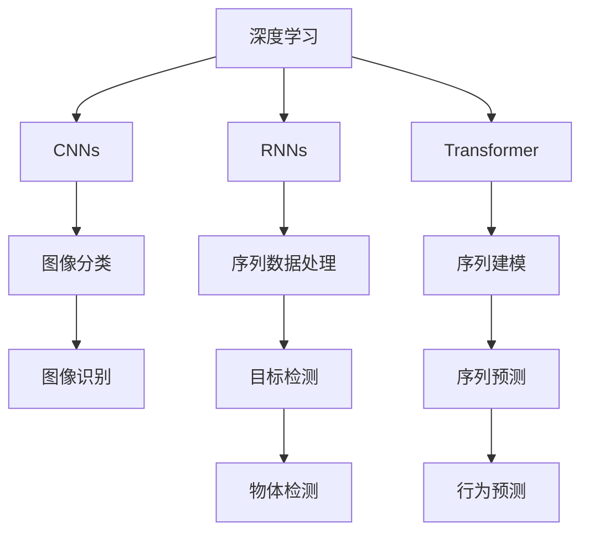

                 

# Andrej Karpathy的AI演讲亮点

## 1. 背景介绍

### 1.1 问题由来
Andrej Karpathy是人工智能领域的知名专家，斯坦福大学计算机科学系教授，同时担任特斯拉AI部门的领导。他的演讲通常覆盖最新的AI研究进展、技术实践和行业应用，内容深入浅出、富有洞察力。本文将总结Andrej Karpathy在多次公开演讲中提到的AI亮点，包括深度学习、计算机视觉、强化学习、自动驾驶等方面的创新观点和技术突破。

### 1.2 问题核心关键点
Andrej Karpathy的演讲重点在于分享其在深度学习领域的最新研究成果、技术实践和行业应用，揭示AI技术的未来发展方向。以下是他演讲中经常提及的核心关键点：

- 深度学习架构和算法：如卷积神经网络(CNNs)、循环神经网络(RNNs)、Transformer等。
- 计算机视觉任务：如图像分类、目标检测、图像生成等。
- 强化学习与自动驾驶：如自动驾驶中的路径规划、行为预测等。
- AI伦理与社会责任：如AI的隐私保护、偏见识别、公平性等。

这些关键点构成了Andrej Karpathy演讲的核心内容，帮助听众全面了解AI技术的现状与未来发展方向。

## 2. 核心概念与联系

### 2.1 核心概念概述

Andrej Karpathy演讲中涉及的核心概念众多，这里重点介绍几个关键概念及其相互联系：

- **深度学习(Deep Learning)**：一种通过构建多层次的非线性特征表示来学习数据表示的技术。深度学习广泛应用于图像识别、语音识别、自然语言处理等任务中。
- **卷积神经网络(CNNs)**：一种专门用于处理图像数据的网络结构，通过卷积操作提取局部特征，并应用池化操作减少特征维度。
- **循环神经网络(RNNs)**：一种处理序列数据的网络结构，通过循环操作保持序列数据的上下文信息。
- **Transformer**：一种用于处理序列数据的自注意力机制，适用于多种序列建模任务。
- **目标检测(Object Detection)**：从图像中定位并识别出物体，具有代表性的是YOLO和Faster R-CNN。
- **自动驾驶(Autonomous Driving)**：利用AI技术实现车辆的自动导航，包括路径规划、行为预测等。

这些概念通过一系列演讲和研究论文相互联系，构成了现代AI技术的核心框架。

### 2.2 概念间的关系

这些核心概念之间的关系可以通过以下Mermaid流程图来展示：



这个流程图展示了深度学习技术在图像识别、序列建模、自动驾驶等应用中的具体实现方式。

## 3. 核心算法原理 & 具体操作步骤

### 3.1 算法原理概述

Andrej Karpathy的演讲涉及多种深度学习算法和架构，下面简要介绍其中的一些核心算法原理：

- **卷积神经网络(CNNs)**：CNNs通过卷积操作提取局部特征，池化操作减少特征维度。其核心思想是通过多层卷积核和池化层逐步抽象出更高级别的特征，最终用于分类或回归任务。
- **循环神经网络(RNNs)**：RNNs通过循环操作处理序列数据，每个时间步的输出会作为下一个时间步的输入，从而保持序列信息的上下文关系。
- **Transformer**：Transformer通过自注意力机制来处理序列数据，每个位置都可以根据整个序列信息进行特征计算，有效解决了RNNs在长序列上的梯度消失问题。

这些算法和架构在各自的领域内都具有重要意义，通过它们可以解决不同的机器学习任务。

### 3.2 算法步骤详解

Andrej Karpathy在演讲中详细介绍了如何应用这些算法进行图像分类、目标检测、自动驾驶等任务。以下以图像分类为例，详细介绍CNNs的基本步骤：

1. **数据预处理**：将原始图像数据进行归一化、标准化等预处理，以便于模型训练。
2. **构建CNN模型**：设计多层卷积和池化层，搭建卷积神经网络的基本结构。
3. **模型训练**：使用标注数据训练CNN模型，最小化损失函数。
4. **模型评估**：在测试集上评估模型的准确率和误差率，调整模型超参数。
5. **模型应用**：将训练好的模型应用于新图像的分类任务。

### 3.3 算法优缺点

CNNs的主要优点包括：

- **局部连接**：减少了参数数量，提高了训练速度。
- **参数共享**：减少了过拟合风险，提高了模型的泛化能力。
- **局部感受野**：通过卷积操作提取局部特征，能够捕捉图像的局部结构。

其主要缺点包括：

- **信息丢失**：由于池化操作的引入，部分信息可能会被丢失。
- **计算复杂度**：卷积操作和池化操作需要大量计算资源。

### 3.4 算法应用领域

CNNs和RNNs等深度学习算法在多个领域都有广泛应用，包括但不限于：

- **计算机视觉**：如图像分类、物体检测、图像分割等。
- **自然语言处理**：如文本分类、机器翻译、语音识别等。
- **自动驾驶**：如图像识别、行为预测、路径规划等。
- **医学影像分析**：如肿瘤检测、病变分类等。

## 4. 数学模型和公式 & 详细讲解 & 举例说明

### 4.1 数学模型构建

以下是CNNs的数学模型构建过程：

- **输入层**：原始图像数据，假设大小为$H\times W\times C$，其中$H$和$W$为图像高和宽，$C$为通道数（一般为3）。
- **卷积层**：通过卷积操作提取特征，假设卷积核大小为$k\times k$，步长为$s$，输出通道数为$n_f$。
- **激活函数**：常用的激活函数包括ReLU、Sigmoid、Tanh等。
- **池化层**：通过最大池化操作减少特征维度，假设池化窗口大小为$p\times p$，步长为$s$。
- **全连接层**：将池化后的特征映射到类别空间，假设输出类别数为$n_c$。

### 4.2 公式推导过程

以图像分类任务为例，CNN的输出为：

$$
y = \sigma(W_l \sigma(W_{l-1} \sigma(\cdots \sigma(W_1 x + b_1) + b_2) + \cdots) + b_l)
$$

其中，$\sigma$为激活函数，$W_i$和$b_i$为第$i$层的权重和偏置。

### 4.3 案例分析与讲解

假设我们有一个卷积神经网络，用于图像分类任务。使用MNIST手写数字数据集进行训练，网络结构如下：

```
Conv1: 5x5x1 --> 20
MaxPool: 2x2
ReLU
Conv2: 5x5x20 --> 100
MaxPool: 2x2
ReLU
Flatten
Dense: 100 --> 10
Softmax
```

首先，输入图像$x$经过第一层卷积和池化后，输出特征图的大小为$6\times 6 \times 20$。然后经过第二层卷积和池化后，输出特征图的大小为$3\times 3 \times 100$。最后通过全连接层得到输出$y$，用于分类预测。

## 5. 项目实践：代码实例和详细解释说明

### 5.1 开发环境搭建

要在Python中使用TensorFlow进行CNN模型的开发，需要安装TensorFlow和相关依赖包。以下是安装步骤：

1. 安装Anaconda：从官网下载并安装Anaconda，用于创建独立的Python环境。
2. 创建并激活虚拟环境：
```bash
conda create -n tf-env python=3.8 
conda activate tf-env
```

3. 安装TensorFlow和相关依赖包：
```bash
pip install tensorflow
pip install numpy scipy matplotlib
```

4. 导入TensorFlow库：
```python
import tensorflow as tf
```

### 5.2 源代码详细实现

以下是一个使用TensorFlow实现CNN模型进行图像分类的示例代码：

```python
import tensorflow as tf
from tensorflow.keras import layers

# 定义模型结构
model = tf.keras.Sequential([
    layers.Conv2D(32, (3, 3), activation='relu', input_shape=(28, 28, 1)),
    layers.MaxPooling2D((2, 2)),
    layers.Flatten(),
    layers.Dense(10, activation='softmax')
])

# 编译模型
model.compile(optimizer='adam', loss='sparse_categorical_crossentropy', metrics=['accuracy'])

# 训练模型
model.fit(train_images, train_labels, epochs=10, validation_data=(test_images, test_labels))
```

### 5.3 代码解读与分析

上述代码中，首先定义了一个包含卷积层、池化层和全连接层的CNN模型。使用`Sequential`模型构建序列结构，并通过`compile`方法指定优化器、损失函数和评估指标。最后通过`fit`方法训练模型。

## 6. 实际应用场景

### 6.1 智能交通系统

Andrej Karpathy在演讲中提到，自动驾驶技术将成为未来智能交通系统的核心。自动驾驶依赖于计算机视觉、路径规划和行为预测等技术。通过构建基于CNNs的自动驾驶模型，可以有效识别道路标志、行人、车辆等目标，实现精准的路径规划和行为预测。

### 6.2 医学影像分析

在医学影像分析领域，CNNs可以用于肿瘤检测、病变分类等任务。通过在大规模医疗影像数据集上进行预训练，CNNs可以学习到丰富的医学知识，并应用于新影像的分析和诊断。

### 6.3 金融数据分析

在金融数据分析领域，CNNs可以用于股票价格预测、市场风险评估等任务。通过在历史交易数据上训练CNN模型，可以捕捉市场趋势和周期性变化，为金融决策提供依据。

### 6.4 未来应用展望

Andrej Karpathy认为，未来AI技术将更加普及和应用广泛。自动驾驶、机器人、智能家居等将成为AI技术的主要应用场景。同时，AI技术的伦理和社会责任也将成为重要的研究课题。

## 7. 工具和资源推荐

### 7.1 学习资源推荐

以下是Andrej Karpathy推荐的学习资源：

1. 《Deep Learning》：Ian Goodfellow等人编写的深度学习经典教材，涵盖了深度学习的基础理论和实践技巧。
2. 《Programming Deep Learning in Python》：Andrej Karpathy的博客和书籍，系统介绍了深度学习的基本原理和实际应用。
3. 《CS231n: Convolutional Neural Networks for Visual Recognition》：斯坦福大学计算机视觉课程，涵盖图像分类、目标检测等任务。
4. 《CS224n: Natural Language Processing with Deep Learning》：斯坦福大学自然语言处理课程，涵盖语言模型、序列建模等任务。

### 7.2 开发工具推荐

以下是Andrej Karpathy推荐的开发工具：

1. TensorFlow：由Google开发的深度学习框架，支持分布式计算和GPU加速。
2. PyTorch：由Facebook开发的深度学习框架，灵活易用，支持动态计算图。
3. Keras：高层次的深度学习框架，易于上手，支持多种后端。
4. Jupyter Notebook：交互式编程环境，支持代码编写、数据可视化等。
5. Google Colab：免费的GPU和TPU计算环境，支持Python编程。

### 7.3 相关论文推荐

以下是Andrej Karpathy推荐的几篇重要论文：

1. "Deep Residual Learning for Image Recognition"：He等人提出的深度残差网络，是深度学习领域的重要贡献。
2. "ResNeXt: Aggregated Residual Transformations for Deep Neural Networks"：Xie等人提出的ResNeXt网络，提升了网络深度和宽度，提高了模型性能。
3. "Fast R-CNN"：Girshick等人提出的目标检测算法，引入ROI池化层，提高了目标检测的准确率。
4. "End to End Training for Scene Understanding"：Long等人提出的端到端场景理解方法，利用CNNs进行场景分类、实例分割和行为预测。

## 8. 总结：未来发展趋势与挑战

### 8.1 研究成果总结

Andrej Karpathy的演讲涵盖了深度学习、计算机视觉、强化学习、自动驾驶等领域的最新研究成果，展示了AI技术的广阔应用前景。他强调了模型架构、算法优化和应用实践的重要性，并提出了未来AI技术的发展方向。

### 8.2 未来发展趋势

未来AI技术将更加普及和应用广泛，自动驾驶、机器人、智能家居等将成为主要应用场景。同时，AI技术的伦理和社会责任也将成为重要的研究课题。

### 8.3 面临的挑战

AI技术的发展也面临着诸多挑战：

1. 数据隐私和安全：大规模数据的应用需要确保数据隐私和安全，防止数据泄露和滥用。
2. 算法公平性和偏见：AI算法可能存在偏见，需要确保算法的公平性和公正性。
3. 计算资源和成本：大规模深度学习模型的训练和部署需要大量计算资源和成本，需要优化资源使用。
4. 模型可解释性：AI模型的决策过程需要可解释性，确保模型的透明性和可信度。

### 8.4 研究展望

未来AI技术的研究方向包括：

1. 无监督学习和少样本学习：通过无监督学习和少样本学习，降低对大规模标注数据的依赖。
2. 模型压缩和优化：通过模型压缩和优化，提高模型效率和部署性能。
3. 多模态融合：将视觉、语音、文本等多模态数据融合，提升AI系统的综合能力。
4. 人工智能伦理：研究AI技术的伦理和社会责任，确保AI系统的健康发展。

总之，AI技术的发展离不开模型架构、算法优化和应用实践的不断创新和改进。只有积极应对挑战，才能实现AI技术的全面普及和应用。

## 9. Andrej Karpathy的演讲亮点总结

Andrej Karpathy的演讲内容丰富、深入浅出，涵盖了深度学习、计算机视觉、强化学习、自动驾驶等领域的最新研究成果和实践经验。他的演讲不仅展示了AI技术的广阔应用前景，也提出了未来技术发展的方向和面临的挑战。

通过学习Andrej Karpathy的演讲，我们可以更好地理解AI技术的原理和应用，把握未来的发展方向，为AI技术的创新和实践提供有力支持。

---

作者：禅与计算机程序设计艺术 / Zen and the Art of Computer Programming

