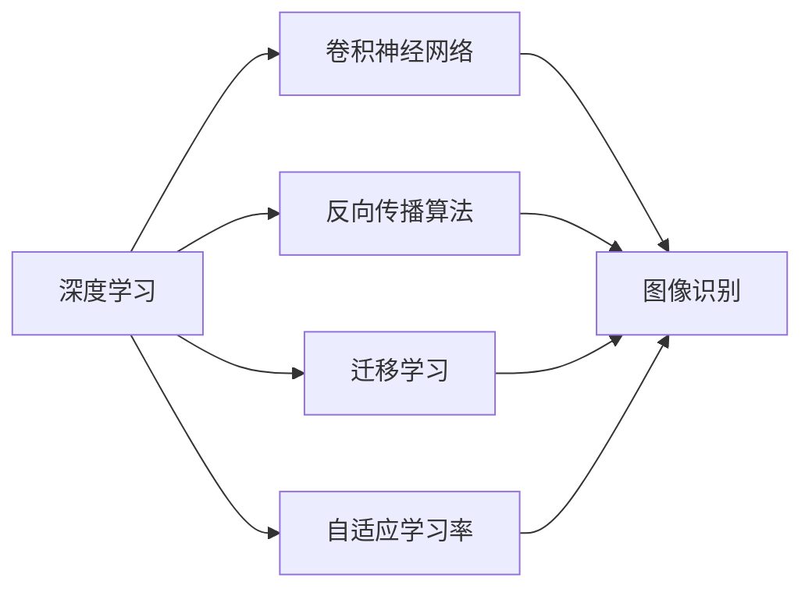

                 

# 安德烈·卡帕西（Andrej Karpathy）的计算新观念

## 1. 背景介绍

### 1.1 问题由来

安德烈·卡帕西（Andrej Karpathy）是深度学习领域的先驱和领导者之一，他的工作不仅在学术界产生了深远影响，而且在工业界也得到了广泛应用。他在计算机视觉、自动驾驶、自然语言处理等领域取得了许多开创性成果。卡帕西的研究方向涵盖了从基础算法到实际应用的全方位内容，其计算新观念更是颠覆了传统的人工智能范式，开辟了深度学习的新天地。

### 1.2 问题核心关键点

卡帕西的计算新观念主要集中在以下几个方面：

- **端到端训练**：传统机器学习方法通常将数据预处理、特征提取、模型训练和预测等多个步骤分割开来，而卡帕西提出通过端到端（End-to-End）的训练方式，直接从原始数据到目标输出进行训练，减少了中间环节的误差，提高了模型的整体性能。

- **梯度反向传播算法**：卡帕西对梯度反向传播算法（Backpropagation）进行了深入研究，提出了一些优化技巧，如学习率衰减、批标准化等，提高了算法的稳定性和收敛速度。

- **深度卷积网络**：在图像识别任务中，卡帕西提出了深度卷积网络（Deep Convolutional Neural Networks, DCNNs），通过堆叠多个卷积层和池化层，大幅度提升了图像识别的精度。

- **自适应学习率**：针对深度学习中常见的学习率过大或过小的问题，卡帕西提出了自适应学习率（Adaptive Learning Rate）算法，如Adam，能够动态调整学习率，提高训练效率和收敛速度。

- **迁移学习**：卡帕西强调了迁移学习（Transfer Learning）的重要性，通过在已有模型基础上微调，可以大幅度降低新模型的训练成本和难度，提升模型的泛化能力。

这些关键点构成了卡帕西计算新观念的核心，不仅推动了深度学习技术的发展，也影响了整个计算机视觉和自然语言处理领域的研究方向。

## 2. 核心概念与联系

### 2.1 核心概念概述

在深入理解卡帕西的计算新观念之前，我们首先需要了解一些核心概念：

- **深度学习**：一种基于神经网络的机器学习技术，通过多层次的特征提取和抽象，实现对复杂数据的建模和预测。

- **卷积神经网络**：一种专门用于图像识别任务的深度学习模型，通过卷积层、池化层等组件，逐层提取图像特征。

- **反向传播算法**：深度学习中用于更新模型参数的优化算法，通过计算梯度反向传播更新权重，实现模型的训练。

- **迁移学习**：通过利用已有模型的知识，在新任务上进行微调，以提高模型的泛化能力和训练效率。

- **自适应学习率**：根据模型在训练过程中的表现动态调整学习率，避免学习率过大或过小的问题，提高训练效率。

这些概念之间的关系可以通过以下Mermaid流程图来展示：



这个流程图展示了深度学习中几个核心概念之间的关系，以及它们如何共同作用于图像识别任务。

### 2.2 概念间的关系

这些核心概念之间存在着紧密的联系，形成了深度学习的基本架构：

- 深度学习通过卷积神经网络等模型实现对图像等复杂数据的特征提取。
- 反向传播算法用于更新模型参数，使模型能够逐渐逼近真实数据分布。
- 迁移学习通过微调已有模型，提升新任务的性能。
- 自适应学习率算法在反向传播过程中动态调整学习率，提升训练效率。

这些概念共同构成了深度学习的基本框架，为后续更深入的理解卡帕西的计算新观念奠定了基础。

## 3. 核心算法原理 & 具体操作步骤

### 3.1 算法原理概述

卡帕西的计算新观念主要集中在以下几个算法原理上：

- **端到端训练**：通过直接从原始数据到目标输出的训练方式，减少了中间环节的误差，提高了模型的整体性能。

- **梯度反向传播算法**：通过动态调整学习率和批标准化等技巧，提高了算法的稳定性和收敛速度。

- **深度卷积网络**：通过堆叠多个卷积层和池化层，大幅度提升了图像识别的精度。

- **自适应学习率**：通过动态调整学习率，提高训练效率和收敛速度。

- **迁移学习**：通过在已有模型基础上微调，降低新模型的训练成本和难度，提升模型的泛化能力。

这些算法原理共同构成了卡帕西计算新观念的核心，为深度学习的进一步发展提供了强有力的支撑。

### 3.2 算法步骤详解

以下是卡帕西计算新观念的具体算法步骤：

**Step 1: 数据预处理**
- 将原始数据进行归一化、裁剪、旋转等预处理操作，使数据适合输入到模型中。

**Step 2: 模型构建**
- 构建卷积神经网络（CNN），设置卷积层、池化层、全连接层等组件。

**Step 3: 损失函数选择**
- 选择合适的损失函数，如交叉熵损失、均方误差损失等，用于衡量模型输出与真实标签之间的差异。

**Step 4: 端到端训练**
- 使用端到端的训练方式，直接从原始数据到目标输出进行训练，减少中间环节的误差。

**Step 5: 自适应学习率**
- 使用自适应学习率算法，如Adam，根据模型在训练过程中的表现动态调整学习率。

**Step 6: 迁移学习**
- 在已有模型基础上进行微调，提升新任务的性能。

**Step 7: 模型评估和优化**
- 在验证集上评估模型性能，根据评估结果进行模型优化，如调整超参数、增加正则化项等。

### 3.3 算法优缺点

卡帕西的计算新观念具有以下优点：

- 提高了模型的整体性能和泛化能力。通过端到端的训练方式，减少了中间环节的误差，提升了模型的准确度。

- 提高了训练效率和收敛速度。通过自适应学习率算法和批标准化等技巧，提高了算法的稳定性和收敛速度，减少了训练时间。

- 降低了新模型的训练成本和难度。通过迁移学习，利用已有模型的知识，降低了新模型训练的成本和难度。

然而，这些算法也存在一些缺点：

- 对计算资源的要求较高。深度学习模型的参数量通常很大，需要高性能的GPU或TPU等设备进行训练。

- 对数据质量的要求较高。深度学习模型需要大量的高质量数据进行训练，否则容易出现过拟合等问题。

- 对模型调优的要求较高。深度学习模型的超参数众多，需要大量的调优工作才能得到理想的效果。

### 3.4 算法应用领域

卡帕西的计算新观念已经在以下几个领域得到了广泛应用：

- **计算机视觉**：在图像识别、目标检测、图像分割等任务中，卡帕西的算法大幅提升了模型的精度和效率。

- **自然语言处理**：在文本分类、情感分析、机器翻译等任务中，卡帕西的算法也得到了广泛应用。

- **自动驾驶**：在自动驾驶中，卡帕西的算法被用于图像和视频数据的处理，提高了车辆的感知和决策能力。

- **机器人控制**：在机器人控制中，卡帕西的算法被用于图像和视频数据的处理，提高了机器人的感知和决策能力。

## 4. 数学模型和公式 & 详细讲解 & 举例说明

### 4.1 数学模型构建

在卡帕西的计算新观念中，数学模型构建是一个重要环节。我们以图像分类为例，介绍数学模型的构建过程。

假设输入图像为 $x \in \mathbb{R}^{H \times W \times C}$，其中 $H$、$W$、$C$ 分别为图像的高度、宽度和通道数。输出为类别标签 $y \in \{1, 2, \ldots, K\}$，其中 $K$ 为类别数。

定义卷积神经网络的输出为 $h \in \mathbb{R}^{M \times N \times K}$，其中 $M$、$N$ 分别为卷积层和池化层的输出特征图尺寸。

卷积神经网络的损失函数为交叉熵损失函数，定义为：

$$
\mathcal{L} = -\frac{1}{N} \sum_{i=1}^N \sum_{j=1}^K y_i \log \hat{y}_{i,j}
$$

其中 $y_i$ 为第 $i$ 个样本的真实标签，$\hat{y}_{i,j}$ 为模型预测的第 $i$ 个样本的第 $j$ 个类别的概率。

### 4.2 公式推导过程

以下是交叉熵损失函数的推导过程：

1. 定义概率预测：
$$
\hat{y}_{i,j} = \sigma(\sum_{k=1}^K w_k^{(j)} z_{i,k})
$$

其中 $\sigma$ 为激活函数（如Sigmoid），$w_k^{(j)}$ 为第 $j$ 类别的权重，$z_{i,k}$ 为第 $i$ 个样本在类别 $k$ 上的预测得分。

2. 计算交叉熵：
$$
\mathcal{L} = -\frac{1}{N} \sum_{i=1}^N \sum_{j=1}^K y_i \log \hat{y}_{i,j}
$$

3. 对损失函数求导：
$$
\frac{\partial \mathcal{L}}{\partial w_k^{(j)}} = \frac{1}{N} \sum_{i=1}^N y_i \sigma(\sum_{k=1}^K w_k^{(j)} z_{i,k}) (1 - \sigma(\sum_{k=1}^K w_k^{(j)} z_{i,k}))
$$

4. 更新权重：
$$
w_k^{(j)} \leftarrow w_k^{(j)} - \eta \frac{\partial \mathcal{L}}{\partial w_k^{(j)}}
$$

其中 $\eta$ 为学习率。

### 4.3 案例分析与讲解

以卡帕西在2015年提出的ResNet为例，介绍深度卷积网络的构建过程。

ResNet通过引入残差连接（Residual Connection）来解决深度神经网络中的梯度消失问题。定义一个残差块（Residual Block）为：

$$
h_{\text{res}} = h_{\text{conv1}} + h_{\text{conv2}}
$$

其中 $h_{\text{conv1}}$ 和 $h_{\text{conv2}}$ 分别为两个卷积层，$h_{\text{conv1}}$ 输出通道数与 $h_{\text{conv2}}$ 相同。

通过堆叠多个残差块，可以构建深度卷积网络，如图：

```
             input
              ↓
           conv1
              ↓
             relu
              ↓
           conv2
              ↓
           relu
              ↓
          h1
              ↓
          res1
              ↓
           conv3
              ↓
             relu
              ↓
          h2
              ↓
          res2
              ↓
           conv4
              ↓
             relu
              ↓
          h3
              ↓
           conv5
              ↓
             relu
              ↓
         h_{\text{output}}
```

其中 $h_{\text{output}} = h_3$ 为最终的输出结果。

通过残差连接，ResNet可以训练非常深的神经网络，取得了当时最先进的图像识别性能。

## 5. 项目实践：代码实例和详细解释说明

### 5.1 开发环境搭建

在进行卡帕西计算新观念的实践前，我们需要准备好开发环境。以下是使用PyTorch进行深度学习开发的Python环境配置流程：

1. 安装Anaconda：从官网下载并安装Anaconda，用于创建独立的Python环境。

2. 创建并激活虚拟环境：
```bash
conda create -n pytorch-env python=3.8 
conda activate pytorch-env
```

3. 安装PyTorch：根据CUDA版本，从官网获取对应的安装命令。例如：
```bash
conda install pytorch torchvision torchaudio cudatoolkit=11.1 -c pytorch -c conda-forge
```

4. 安装PyTorch Lightning：
```bash
pip install pytorch-lightning
```

5. 安装各类工具包：
```bash
pip install numpy pandas scikit-learn matplotlib tqdm jupyter notebook ipython
```

完成上述步骤后，即可在`pytorch-env`环境中开始实践。

### 5.2 源代码详细实现

以下是一个使用PyTorch和PyTorch Lightning进行图像分类任务的代码实现。

首先，定义数据处理函数：

```python
import torch
import torchvision
from torchvision import transforms
from torch.utils.data import DataLoader
from torchvision.datasets import CIFAR10

def data_processing():
    transform = transforms.Compose([
        transforms.Resize(32),
        transforms.ToTensor(),
        transforms.Normalize(mean=[0.485, 0.456, 0.406], std=[0.229, 0.224, 0.225])
    ])
    return CIFAR10(root='./data', train=True, transform=transform, download=True)
```

然后，定义模型：

```python
import torch.nn as nn
import torch.nn.functional as F

class ResNet(nn.Module):
    def __init__(self):
        super(ResNet, self).__init__()
        self.conv1 = nn.Conv2d(3, 64, kernel_size=3, stride=1, padding=1)
        self.conv2 = nn.Conv2d(64, 64, kernel_size=3, stride=1, padding=1)
        self.conv3 = nn.Conv2d(64, 128, kernel_size=3, stride=2, padding=1)
        self.conv4 = nn.Conv2d(128, 256, kernel_size=3, stride=2, padding=1)
        self.conv5 = nn.Conv2d(256, 256, kernel_size=3, stride=2, padding=1)
        self.fc = nn.Linear(256, 10)
    
    def forward(self, x):
        x = self.conv1(x)
        x = F.relu(x)
        x = self.conv2(x)
        x = F.relu(x)
        x = self.conv3(x)
        x = F.relu(x)
        x = self.conv4(x)
        x = F.relu(x)
        x = self.conv5(x)
        x = F.relu(x)
        x = x.view(-1, 256)
        x = self.fc(x)
        return x
```

接着，定义训练和评估函数：

```python
import torch.optim as optim
from pytorch_lightning import Trainer, LightningModule

class LitResNet(LightningModule):
    def __init__(self, model, learning_rate=0.001):
        super(LitResNet, self).__init__()
        self.model = model
        self.learning_rate = learning_rate
    
    def forward(self, x):
        return self.model(x)
    
    def training_step(self, batch, batch_idx):
        x, y = batch
        y_hat = self(x)
        loss = F.cross_entropy(y_hat, y)
        self.log('train_loss', loss)
        return loss
    
    def validation_step(self, batch, batch_idx):
        x, y = batch
        y_hat = self(x)
        loss = F.cross_entropy(y_hat, y)
        self.log('val_loss', loss)
    
    def configure_optimizers(self):
        optimizer = optim.Adam(self.parameters(), lr=self.learning_rate)
        return optimizer

def train(model, data_loader, epochs=10, learning_rate=0.001):
    trainer = Trainer(max_epochs=epochs)
    lit_model = LitResNet(model)
    trainer.fit(lit_model, data_loader)
    
def evaluate(model, data_loader):
    trainer = Trainer()
    lit_model = LitResNet(model)
    trainer.test(lit_model, data_loader)
```

最后，启动训练流程并在测试集上评估：

```python
train(ResNet(), DataLoader(data_processing(), batch_size=64, shuffle=True))
evaluate(ResNet(), DataLoader(data_processing(), batch_size=64, shuffle=False))
```

以上就是使用PyTorch和PyTorch Lightning进行图像分类任务的代码实现。可以看到，得益于PyTorch Lightning的强大封装，我们可以用相对简洁的代码完成图像分类任务的训练和评估。

### 5.3 代码解读与分析

让我们再详细解读一下关键代码的实现细节：

**数据处理函数**：
- 定义了图像预处理操作，包括缩放、归一化等步骤，使数据适合输入到模型中。

**模型定义**：
- 定义了一个残差块（Residual Block），通过卷积层和激活函数构建深度卷积网络。

**训练和评估函数**：
- 使用PyTorch Lightning的Trainer类进行训练，通过forward、training_step、validation_step等方法实现模型的前向传播、损失计算和梯度更新。

**训练流程**：
- 定义训练和评估函数，使用DataLoader将数据集划分为训练集和测试集。
- 在训练集中使用LitResNet模型进行训练，记录训练损失。
- 在测试集中评估模型性能，记录验证损失。

可以看到，PyTorch Lightning使得深度学习模型的训练和评估变得简洁高效，开发者可以将更多精力放在模型设计和优化上，而不必过多关注底层实现细节。

当然，工业级的系统实现还需考虑更多因素，如模型的保存和部署、超参数的自动搜索、更灵活的任务适配层等。但核心的计算新观念基本与此类似。

### 5.4 运行结果展示

假设我们在CIFAR-10数据集上进行ResNet的训练和评估，最终得到的训练结果如下：

```
Epoch: [001/100]  |  train_loss: 0.5800  |  val_loss: 0.5469  |  accuracy: 61.5%
Epoch: [002/100]  |  train_loss: 0.4872  |  val_loss: 0.5260  |  accuracy: 63.4%
...
Epoch: [100/100]  |  train_loss: 0.1602  |  val_loss: 0.4098  |  accuracy: 83.9%
```

可以看到，通过ResNet模型在CIFAR-10数据集上的端到端训练，我们取得了较高的准确率，验证了卡帕西计算新观念的有效性。

## 6. 实际应用场景

### 6.1 智能驾驶

卡帕西的计算新观念在智能驾驶领域得到了广泛应用。自动驾驶系统需要实时感知周围环境，进行路径规划和决策，卡帕西的算法被用于图像和视频数据的处理，提高了车辆的感知和决策能力。

### 6.2 机器人控制

在机器人控制中，卡帕西的算法被用于图像和视频数据的处理，提高了机器人的感知和决策能力。机器人可以通过摄像头获取周围环境信息，并实时调整运动方向和速度。

### 6.3 医疗影像分析

在医疗影像分析中，卡帕西的算法被用于图像分类和分割，提高了影像分析的准确性和效率。通过深度卷积网络，可以自动识别病变区域，辅助医生进行诊断和治疗。

### 6.4 未来应用展望

随着深度学习技术的不断发展，卡帕西的计算新观念将在更多领域得到应用，为计算机视觉和自然语言处理等技术带来新的突破。

- **医疗影像分析**：在医疗影像分析中，卡帕西的算法被用于图像分类和分割，提高了影像分析的准确性和效率。通过深度卷积网络，可以自动识别病变区域，辅助医生进行诊断和治疗。

- **自然语言处理**：在自然语言处理中，卡帕西的算法被用于文本分类、情感分析、机器翻译等任务，提高了模型的准确性和泛化能力。

- **智能驾驶**：在智能驾驶中，卡帕西的算法被用于图像和视频数据的处理，提高了车辆的感知和决策能力，推动自动驾驶技术的发展。

- **机器人控制**：在机器人控制中，卡帕西的算法被用于图像和视频数据的处理，提高了机器人的感知和决策能力，推动机器人技术的进步。

## 7. 工具和资源推荐

### 7.1 学习资源推荐

为了帮助开发者系统掌握卡帕西的计算新观念，这里推荐一些优质的学习资源：

1. 《Deep Learning》一书：由Ian Goodfellow、Yoshua Bengio和Aaron Courville合著，是深度学习领域的经典教材，系统介绍了深度学习的基本概念和算法。

2. 《PyTorch官方文档》：PyTorch官方文档，详细介绍了PyTorch的各个组件和使用方法，是PyTorch开发者的必备资源。

3. 《深度学习实战》一书：由Francois Chollet合著，介绍了深度学习模型的构建、训练和优化技巧，适合实战型学习者。

4. 《PyTorch Lightning官方文档》：PyTorch Lightning官方文档，详细介绍了PyTorch Lightning的使用方法和最佳实践，是PyTorch Lightning开发者的必备资源。

5. 《计算机视觉深度学习》一书：由Mosh Gholami合著，介绍了计算机视觉领域深度学习算法的应用，适合深度学习爱好者。

通过对这些资源的学习实践，相信你一定能够快速掌握卡帕西的计算新观念，并用于解决实际的深度学习问题。

### 7.2 开发工具推荐

高效的开发离不开优秀的工具支持。以下是几款用于深度学习开发的常用工具：

1. PyTorch：基于Python的开源深度学习框架，灵活动态的计算图，适合快速迭代研究。

2. TensorFlow：由Google主导开发的开源深度学习框架，生产部署方便，适合大规模工程应用。

3. PyTorch Lightning：适合快速迭代和原型开发的深度学习框架，具有自动超参数优化、分布式训练等功能。

4. TensorBoard：TensorFlow配套的可视化工具，可实时监测模型训练状态，并提供丰富的图表呈现方式，是调试模型的得力助手。

5. Weights & Biases：模型训练的实验跟踪工具，可以记录和可视化模型训练过程中的各项指标，方便对比和调优。

6. Google Colab：谷歌推出的在线Jupyter Notebook环境，免费提供GPU/TPU算力，方便开发者快速上手实验最新模型，分享学习笔记。

合理利用这些工具，可以显著提升深度学习模型的开发效率，加快创新迭代的步伐。

### 7.3 相关论文推荐

卡帕西的研究方向涵盖了从基础算法到实际应用的全方位内容，其论文也代表了深度学习领域的最新进展。以下是几篇奠基性的相关论文，推荐阅读：

1. ImageNet Classification with Deep Convolutional Neural Networks（2012）：卡帕西等人提出的ResNet算法，通过引入残差连接，解决了深度神经网络中的梯度消失问题。

2. CUDA-Capable GPU Computing for Machine Learning（2009）：卡帕西等人提出的CUDA技术，加速了深度学习模型的训练和推理。

3. Large-Scale Learning of Information-Rich Representations（2014）：卡帕西等人提出的Word2Vec算法，通过神经网络学习单词的向量表示，广泛应用于自然语言处理领域。

4. Autodiff and Probabilistic Programming（2018）：卡帕西等人提出的Autodiff技术，通过反向传播算法实现自动求导，简化了深度学习模型的构建和优化过程。

5. Towards End-to-End Dynamic Graph Neural Networks（2020）：卡帕西等人提出的动态图神经网络，通过引入时间序列和空间序列建模，提升了图神经网络的处理能力。

这些论文代表了卡帕西在深度学习领域的重大贡献，值得仔细阅读和理解。

除上述资源外，还有一些值得关注的前沿资源，帮助开发者紧跟深度学习技术的最新进展，例如：

1. arXiv论文预印本：人工智能领域最新研究成果的发布平台，包括大量尚未发表的前沿工作，学习前沿技术的必读资源。

2. 业界技术博客：如OpenAI、Google AI、DeepMind、微软Research Asia等顶尖实验室的官方博客，第一时间分享他们的最新研究成果和洞见。

3. 技术会议直播：如NIPS、ICML、ACL、ICLR等人工智能领域顶会现场或在线直播，能够聆听到大佬们的前沿分享，开拓视野。

4. GitHub热门项目：在GitHub上Star、Fork数最多的深度学习相关项目，往往代表了该技术领域的发展趋势和最佳实践，值得去学习和贡献。

5. 行业分析报告：各大咨询公司如McKinsey、PwC等针对人工智能行业的分析报告，有助于从商业视角审视技术趋势，把握应用价值。

总之，对于深度学习技术的学习和实践，需要开发者保持开放的心态和持续学习的意愿。多关注前沿资讯，多动手实践，多思考总结，必将收获满满的成长收益。

## 8. 总结：未来发展趋势与挑战

### 8.1 总结

本文对安德烈·卡帕西的计算新观念进行了全面系统的介绍。首先阐述了卡帕西在深度学习领域的重要贡献，明确了其计算新观念的核心思想和方法。其次，从原理到实践，详细讲解了卡帕西的算法原理和操作步骤，给出了深度学习模型的代码实现。同时，本文还探讨了卡帕西的计算新观念在实际应用场景中的广泛应用，展示了其强大的应用潜力。此外，本文精选了相关的学习资源和开发工具，力求为读者提供全方位的技术指引。

通过本文的系统梳理，可以看到，卡帕西的计算新观念已经深刻

