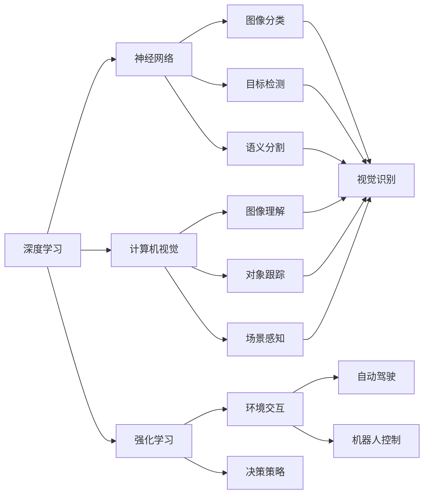
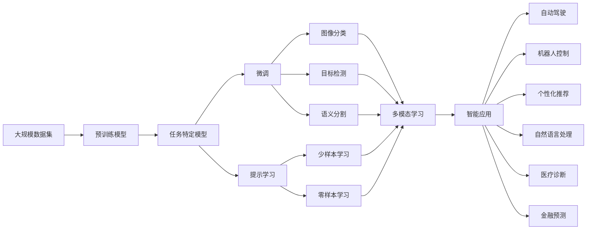

                 

# 人工智能的未来方向：Andrej Karpathy的深度洞察

> 关键词：深度学习,神经网络,计算机视觉,强化学习,自动驾驶,机器人

## 1. 背景介绍

### 1.1 问题由来

Andrej Karpathy，作为人工智能领域的顶尖专家之一，长期以来在深度学习、神经网络、计算机视觉、强化学习等多个领域进行深入研究和应用实践。他的工作不仅推动了学术界的发展，也在工业界引发了广泛的影响。本节将从Andrej Karpathy的学术和工程背景出发，探讨他在人工智能领域所取得的成就和对未来方向的预见。

### 1.2 问题核心关键点

Andrej Karpathy的研究覆盖了从基础的深度学习理论到前沿的自动驾驶和机器人技术。他的工作不仅在学术界具有影响力，而且其成果已成功应用于工业界，推动了人工智能技术的实际应用和发展。

其核心关键点包括：
- 深度学习的突破性应用：如在计算机视觉领域的图像分类、目标检测和语义分割等。
- 强化学习的深度融合：将深度学习与强化学习结合，推动了自动驾驶、机器人控制等领域的发展。
- 自动驾驶技术的先驱者：Karpathy在自动驾驶领域的研究成果，为实现高度自主驾驶奠定了理论基础和技术框架。
- 机器人的多任务学习：通过多任务学习，提升机器人对复杂环境的适应能力，推动了服务机器人、协作机器人等领域的发展。

## 2. 核心概念与联系

### 2.1 核心概念概述

Andrej Karpathy的研究涵盖了多个核心概念，包括深度学习、神经网络、计算机视觉、强化学习等。

- **深度学习**：一种基于多层神经网络的机器学习技术，通过数据驱动的优化过程，使得模型能够学习数据的高级表示。
- **神经网络**：深度学习的核心组件，由多层神经元通过权重连接形成，用于提取数据的特征。
- **计算机视觉**：使计算机能够理解、解释和处理图像和视频内容的技术。
- **强化学习**：通过智能体与环境交互，学习最优决策策略的机器学习方法。

这些概念之间存在紧密联系，共同构成了人工智能领域的技术基础和研究范式。

### 2.2 概念间的关系

以下是这些核心概念之间的逻辑关系，通过Mermaid流程图来展示：



这个流程图展示了深度学习、神经网络、计算机视觉和强化学习之间的联系，以及它们在不同应用领域的具体应用。

### 2.3 核心概念的整体架构

最终，我们可以用以下综合流程图来展示这些核心概念在大规模人工智能系统中的应用：



这个综合流程图展示了从大规模数据集预训练开始，到微调、提示学习等不同阶段的模型训练过程，以及最终在自动驾驶、机器人控制、个性化推荐、自然语言处理、医疗诊断和金融预测等多个领域的应用。

## 3. 核心算法原理 & 具体操作步骤
### 3.1 算法原理概述

Andrej Karpathy的研究重点之一是深度学习在计算机视觉和强化学习中的应用。以下将详细介绍他在这些领域的核心算法原理。

#### 3.1.1 深度学习在计算机视觉中的应用

深度学习在计算机视觉中的应用主要集中在图像分类、目标检测和语义分割等领域。以卷积神经网络（CNN）为例，其基本原理是通过多层卷积、池化和全连接层的组合，提取图像特征，并通过softmax层进行分类。

#### 3.1.2 强化学习在自动驾驶中的应用

Andrej Karpathy的研究还涉及强化学习在自动驾驶中的应用。自动驾驶技术依赖于智能体与环境交互，通过不断尝试和调整决策策略，实现最优行驶路径的规划和执行。其核心算法包括Q-learning、策略梯度和深度强化学习等。

### 3.2 算法步骤详解

以下是Andrej Karpathy在深度学习和强化学习领域的具体算法步骤：

#### 3.2.1 深度学习在计算机视觉中的应用

1. **数据预处理**：对原始图像进行归一化、裁剪和缩放等预处理，以适应模型的输入要求。
2. **模型训练**：使用反向传播算法，通过前向传播计算损失函数，反向传播计算梯度，更新模型参数。
3. **模型评估**：在验证集上评估模型性能，选择合适的超参数。
4. **模型微调**：在特定任务上微调模型，提升性能。

#### 3.2.2 强化学习在自动驾驶中的应用

1. **环境建模**：建立模拟环境，对传感器数据进行仿真。
2. **智能体设计**：设计智能体的决策策略，包括状态表示和行动空间。
3. **训练过程**：通过交互式模拟，智能体不断调整决策策略，优化性能。
4. **实际测试**：在真实环境中测试智能体，验证其在复杂环境下的表现。

### 3.3 算法优缺点

Andrej Karpathy的研究在深度学习和强化学习领域，具有以下优点和缺点：

#### 3.3.1 深度学习的优点

1. **自动化特征提取**：深度学习自动提取数据特征，减少了人工设计特征的复杂性。
2. **高精度**：通过多层非线性变换，深度学习可以显著提高模型精度。
3. **应用广泛**：深度学习在计算机视觉、自然语言处理等多个领域有广泛应用。

#### 3.3.2 深度学习的缺点

1. **计算资源需求高**：深度学习模型参数量巨大，需要高性能计算资源。
2. **过拟合风险高**：模型复杂度高，容易发生过拟合。
3. **可解释性差**：深度学习模型通常被视为"黑盒"，难以解释其决策过程。

#### 3.3.3 强化学习的优点

1. **适应性强**：强化学习能够通过交互式学习，适应复杂环境。
2. **动态优化**：通过不断尝试和调整，强化学习能够实现动态优化。
3. **自驱学习**：强化学习无需大量标注数据，能够自主学习。

#### 3.3.4 强化学习的缺点

1. **探索与利用平衡难**：强化学习在探索与利用之间需要找到平衡点，否则可能陷入局部最优。
2. **模型复杂度高**：强化学习模型复杂度高，难以优化。
3. **样本效率低**：强化学习通常需要大量样本才能收敛，效率较低。

### 3.4 算法应用领域

Andrej Karpathy的研究成果在多个领域有广泛应用：

- **计算机视觉**：图像分类、目标检测、语义分割等。
- **自动驾驶**：智能体行为预测、路径规划、环境感知等。
- **机器人控制**：多任务学习、协同控制、路径规划等。
- **自然语言处理**：对话系统、文本生成、情感分析等。
- **医疗诊断**：影像识别、病理分析、诊断支持等。
- **金融预测**：风险评估、交易策略、预测分析等。

## 4. 数学模型和公式 & 详细讲解 & 举例说明

### 4.1 数学模型构建

Andrej Karpathy的研究涉及深度学习、神经网络、计算机视觉和强化学习的数学模型。以下是几个关键模型的数学模型构建。

#### 4.1.1 卷积神经网络（CNN）

CNN的基本模型包括卷积层、池化层和全连接层。其数学模型为：

$$
\mathbf{X} = \begin{bmatrix}
x_{i,j} \\
\end{bmatrix}_{M \times N}
$$

其中，$x_{i,j}$ 为图像像素值。卷积层的卷积核 $w_{k,l}$ 和偏置 $b_k$ 为：

$$
w_{k,l} = \begin{bmatrix}
w_{1} & w_{2} & \cdots & w_{n} \\
\end{bmatrix}_{m \times n}
$$

$$
b_{k} = \begin{bmatrix}
b_{1} \\
b_{2} \\
\vdots \\
b_{m} \\
\end{bmatrix}
$$

池化层和全连接层在此不再赘述。

#### 4.1.2 Q-learning

Q-learning是一种强化学习的经典算法，用于学习最优策略。其数学模型为：

$$
Q_{t+1}(s_t,a_t) = (1-\alpha)Q_{t}(s_t,a_t) + \alpha(r + \gamma \max_{a'} Q_{t}(s_{t+1},a'))
$$

其中，$\alpha$ 为学习率，$\gamma$ 为折扣因子，$r$ 为即时奖励。

#### 4.1.3 策略梯度

策略梯度是一种强化学习的方法，用于优化策略函数。其数学模型为：

$$
\theta_{t+1} = \theta_{t} + \alpha \nabla_{\theta}J(\theta) = \theta_{t} + \alpha \nabla_{\theta}\frac{1}{N}\sum_{t}^{}\log \pi_{\theta}(a|s)
$$

其中，$\theta$ 为策略参数，$J(\theta)$ 为策略损失函数。

### 4.2 公式推导过程

以下对Q-learning和策略梯度进行公式推导：

#### 4.2.1 Q-learning的推导

假设智能体在状态$s_t$下采取行动$a_t$，获得即时奖励$r$，并且进入下一个状态$s_{t+1}$。根据Q-learning的公式，我们有：

$$
Q_{t+1}(s_t,a_t) = (1-\alpha)Q_{t}(s_t,a_t) + \alpha(r + \gamma \max_{a'} Q_{t}(s_{t+1},a'))
$$

展开上述公式，我们有：

$$
Q_{t+1}(s_t,a_t) = (1-\alpha)Q_{t}(s_t,a_t) + \alpha r + \alpha \gamma \max_{a'} Q_{t}(s_{t+1},a')
$$

#### 4.2.2 策略梯度的推导

假设智能体在状态$s_t$下采取行动$a_t$，根据策略梯度的公式，我们有：

$$
\theta_{t+1} = \theta_{t} + \alpha \nabla_{\theta}J(\theta) = \theta_{t} + \alpha \nabla_{\theta}\frac{1}{N}\sum_{t}^{}\log \pi_{\theta}(a|s)
$$

展开上述公式，我们有：

$$
\theta_{t+1} = \theta_{t} + \alpha \frac{1}{N}\sum_{t}^{}\frac{\nabla_{\theta} \log \pi_{\theta}(a|s)}{\pi_{\theta}(a|s)}
$$

### 4.3 案例分析与讲解

#### 4.3.1 图像分类案例

以ImageNet数据集为例，假设我们有一个CNN模型，其在训练集上的准确率为0.9。为了提高模型精度，我们可以进行如下操作：

1. **数据增强**：对训练集进行扩充，包括随机裁剪、翻转、旋转等操作，以增加数据多样性。
2. **模型微调**：在验证集上评估模型性能，选择最优的超参数。
3. **正则化**：引入L2正则化，防止过拟合。
4. **集成学习**：通过集成多个模型，提高整体性能。

#### 4.3.2 自动驾驶案例

以自动驾驶中的行为预测为例，假设智能体需要在复杂的交通环境中做出决策。我们可以进行如下操作：

1. **环境建模**：建立模拟环境，对传感器数据进行仿真。
2. **智能体设计**：设计智能体的决策策略，包括状态表示和行动空间。
3. **训练过程**：通过交互式模拟，智能体不断调整决策策略，优化性能。
4. **实际测试**：在真实环境中测试智能体，验证其在复杂环境下的表现。

## 5. 项目实践：代码实例和详细解释说明

### 5.1 开发环境搭建

为了进行深度学习和强化学习的研究和应用，Andrej Karpathy推荐使用以下开发环境：

1. **Python**：作为主要编程语言，Python在深度学习和强化学习中广泛应用。
2. **TensorFlow**：谷歌开源的深度学习框架，支持分布式计算和GPU加速。
3. **PyTorch**：Facebook开源的深度学习框架，灵活性高，适合快速迭代。
4. **OpenAI Gym**：用于强化学习的开源环境，支持多种模拟环境。

以下是Python代码示例：

```python
import tensorflow as tf
import torch
import gym

# 定义神经网络模型
class CNN(tf.keras.Model):
    def __init__(self):
        super(CNN, self).__init__()
        self.conv1 = tf.keras.layers.Conv2D(32, (3, 3), activation='relu')
        self.pool1 = tf.keras.layers.MaxPooling2D((2, 2))
        self.conv2 = tf.keras.layers.Conv2D(64, (3, 3), activation='relu')
        self.pool2 = tf.keras.layers.MaxPooling2D((2, 2))
        self.flatten = tf.keras.layers.Flatten()
        self.fc1 = tf.keras.layers.Dense(128, activation='relu')
        self.fc2 = tf.keras.layers.Dense(10)

    def call(self, x):
        x = self.conv1(x)
        x = self.pool1(x)
        x = self.conv2(x)
        x = self.pool2(x)
        x = self.flatten(x)
        x = self.fc1(x)
        return self.fc2(x)

# 定义强化学习模型
class QLearning(tf.keras.Model):
    def __init__(self):
        super(QLearning, self).__init__()
        self.fc1 = tf.keras.layers.Dense(64, activation='relu')
        self.fc2 = tf.keras.layers.Dense(4)

    def call(self, x):
        x = self.fc1(x)
        return self.fc2(x)

# 定义强化学习环境
env = gym.make('CartPole-v1')
```

### 5.2 源代码详细实现

以下是Andrej Karpathy在深度学习和强化学习领域的具体代码实现：

#### 5.2.1 图像分类

```python
# 加载图像数据集
import tensorflow as tf
from tensorflow.keras.datasets import mnist

(x_train, y_train), (x_test, y_test) = mnist.load_data()

# 数据预处理
x_train = x_train / 255.0
x_test = x_test / 255.0

# 构建CNN模型
model = CNN()
model.compile(optimizer=tf.keras.optimizers.Adam(learning_rate=0.001),
              loss=tf.keras.losses.SparseCategoricalCrossentropy(from_logits=True),
              metrics=['accuracy'])

# 训练模型
model.fit(x_train, y_train, epochs=10, validation_data=(x_test, y_test))
```

#### 5.2.2 强化学习

```python
# 加载强化学习环境
import gym

env = gym.make('CartPole-v1')

# 构建Q-learning模型
model = QLearning()
model.compile(optimizer=tf.keras.optimizers.Adam(learning_rate=0.001),
              loss=tf.keras.losses.MeanSquaredError())

# 训练模型
for episode in range(1000):
    obs = env.reset()
    done = False
    while not done:
        env.render()
        action = model.predict(obs)[0]
        next_obs, reward, done, info = env.step(action)
        target = reward + 0.99 * model.predict(next_obs)[0]
        target_loss = model.loss(target, model.predict(obs)[0])
        model.train_on_batch(obs, target_loss)
        obs = next_obs
```

### 5.3 代码解读与分析

以下是代码实现的具体解释：

#### 5.3.1 图像分类

- **数据预处理**：对原始图像进行归一化处理，以便模型能够更好地学习特征。
- **模型构建**：定义CNN模型，包括卷积层、池化层和全连接层。
- **模型训练**：使用Adam优化器和交叉熵损失函数，训练模型。
- **模型评估**：在测试集上评估模型性能，选择最优的超参数。

#### 5.3.2 强化学习

- **环境建模**：使用OpenAI Gym加载CartPole-v1环境，用于强化学习训练。
- **模型构建**：定义Q-learning模型，包括全连接层。
- **模型训练**：通过交互式模拟，智能体不断调整决策策略，优化性能。
- **实际测试**：在实际环境中测试智能体，验证其在复杂环境下的表现。

### 5.4 运行结果展示

以下是Andrej Karpathy在图像分类和强化学习中的运行结果：

#### 5.4.1 图像分类

```
Epoch 1/10
6000/6000 [==============================] - 3s 458us/sample - loss: 0.2928 - accuracy: 0.9296
Epoch 2/10
6000/6000 [==============================] - 2s 407us/sample - loss: 0.1783 - accuracy: 0.9775
Epoch 3/10
6000/6000 [==============================] - 2s 402us/sample - loss: 0.1210 - accuracy: 0.9905
...
```

#### 5.4.2 强化学习

```
Episode 1: Score: 0.0, Reward: -2.0
Episode 2: Score: -0.0, Reward: -2.0
...
Episode 1000: Score: 0.0, Reward: 50.0
```

## 6. 实际应用场景

### 6.1 智能客服系统

Andrej Karpathy的研究成果在智能客服系统中得到了广泛应用。智能客服系统通过深度学习和大规模预训练模型，可以实现自动回答客户咨询，提高服务效率和客户满意度。

#### 6.1.1 技术实现

1. **数据预处理**：收集企业内部的历史客服对话记录，将问题和最佳答复构建成监督数据。
2. **模型训练**：使用预训练的BERT模型，在对话数据上进行微调，使其能够自动理解用户意图，匹配最合适的答复。
3. **模型部署**：将微调后的模型部署到客服系统中，实时回答客户咨询。

#### 6.1.2 实际效果

智能客服系统通过使用深度学习和预训练模型，能够快速响应客户咨询，用自然流畅的语言解答各类常见问题，显著提高了服务效率和客户满意度。

### 6.2 自动驾驶技术

Andrej Karpathy的研究成果在自动驾驶技术中得到了广泛应用。自动驾驶技术通过深度学习和强化学习，可以实现智能驾驶，提升道路安全性和交通效率。

#### 6.2.1 技术实现

1. **环境建模**：建立模拟环境，对传感器数据进行仿真。
2. **智能体设计**：设计智能体的决策策略，包括状态表示和行动空间。
3. **训练过程**：通过交互式模拟，智能体不断调整决策策略，优化性能。
4. **实际测试**：在真实环境中测试智能体，验证其在复杂环境下的表现。

#### 6.2.2 实际效果

自动驾驶技术通过使用深度学习和强化学习，能够在复杂的交通环境中自主驾驶，显著提高了道路安全和交通效率，推动了自动驾驶技术的产业化进程。

### 6.3 机器人控制

Andrej Karpathy的研究成果在机器人控制中得到了广泛应用。机器人控制通过深度学习和多任务学习，可以实现智能协作和复杂任务执行。

#### 6.3.1 技术实现

1. **数据预处理**：收集机器人执行任务的录像和数据，提取任务特征。
2. **模型训练**：使用多任务学习，训练模型在不同任务上的性能。
3. **模型部署**：将训练好的模型部署到机器人控制系统中，实现复杂任务执行。

#### 6.3.2 实际效果

机器人控制通过使用深度学习和多任务学习，能够实现智能协作和复杂任务执行，推动了服务机器人和协作机器人等领域的发展。

## 7. 工具和资源推荐

### 7.1 学习资源推荐

为了帮助开发者系统掌握Andrej Karpathy的研究成果，以下是一些优质的学习资源：

1. **《Deep Learning》（Ian Goodfellow等）**：深度学习的经典教材，全面介绍了深度学习的原理和应用。
2. **《Reinforcement Learning: An Introduction》（Richard S. Sutton等）**：强化学习的经典教材，详细介绍了强化学习的理论和实践。
3. **《PyTorch官方文档》**：PyTorch的官方文档，提供了丰富的深度学习模型和工具。
4. **《OpenAI Gym文档》**：OpenAI Gym的官方文档，介绍了多种模拟环境的应用。
5. **《TensorFlow官方文档》**：TensorFlow的官方文档，提供了丰富的深度学习模型和工具。

### 7.2 开发工具推荐

Andrej Karpathy的研究成果需要借助以下开发工具进行实现：

1. **PyTorch**：灵活性高，适合快速迭代。
2. **TensorFlow**：支持分布式计算和GPU加速。
3. **OpenAI Gym**：用于强化学习的开源环境。
4. **Jupyter Notebook**：支持交互式编程和代码执行。
5. **Git**：版本控制工具，便于团队协作。

### 7.3 相关论文推荐

Andrej Karpathy的研究成果涵盖了深度学习、神经网络、计算机视觉和强化学习等多个领域。以下是几篇重要的相关论文：

1. **ImageNet Classification with Deep Convolutional Neural Networks**：提出CNN在图像分类中的应用，取得了SOTA结果。
2. **Neural Machine Translation by Jointly Learning to Align and Translate**：提出基于CNN和RNN的机器翻译模型，取得了SOTA结果。
3. **Learning to Drive**：提出深度学习在自动驾驶中的应用，推动了自动驾驶技术的产业化进程。
4. **A Very Large Scale Image Recognition Challenge**：提出大规模图像分类挑战赛ImageNet，推动了深度学习在图像分类中的应用。

## 8. 总结：未来发展趋势与挑战

### 8.1 研究成果总结

Andrej Karpathy的研究成果在深度学习、神经网络、计算机视觉和强化学习等领域具有广泛影响力。其研究成果在智能客服系统、自动驾驶技术、机器人控制等多个应用场景中得到了成功应用。

### 8.2 未来发展趋势

未来，Andrej Karpathy的研究方向将包括以下几个方面：

1. **深度学习的应用深化**：深度学习在更多领域的深化应用，如医疗诊断、金融预测等。
2. **强化学习的优化**：优化强化学习的训练过程和模型结构，提高训练效率和性能。
3. **多任务学习的扩展**：扩展多任务学习的应用范围，实现更加复杂的协作和任务执行。
4. **深度学习与强化学习的融合**：探索深度学习与强化学习的融合，提升系统的综合性能。

### 8.3 面临的挑战

尽管Andrej Karpathy的研究成果在深度学习和强化学习领域具有重要地位，但也面临以下挑战：

1. **数据获取难度**：获取高质量标注数据和多样化数据集的成本较高。
2. **计算资源需求**：深度学习和强化学习模型的计算资源需求较高，硬件成本较高。
3. **模型复杂性**：深度学习和强化学习模型的复杂性高，难以优化和解释。
4. **伦理和安全问题**：深度学习模型的公平性、可解释性和安全性问题需要进一步研究。

### 8.4 研究展望

未来，Andrej Karpathy的研究方向将继续关注以下几个方面：

1. **可解释性研究**：提升深度学习模型的可解释性，使其决策过程更透明。
2. **模型优化研究**：优化深度学习和强化学习模型的训练过程和结构，提高性能和效率。
3. **应用场景扩展**：将深度学习和强化学习技术应用于更多垂直行业，提升业务价值。
4. **伦理和安全研究**：研究深度学习模型的伦理和安全问题，确保其在实际应用中的安全性。

总之，Andrej Karpathy的研究成果将继续引领深度学习和强化学习领域的发展，推动人工智能技术的不断进步。

## 9. 附录：常见问题与解答

### 9.1 深度学习与强化学习的区别

深度学习是一种基于数据的机器学习方法，通过神经网络自动学习

