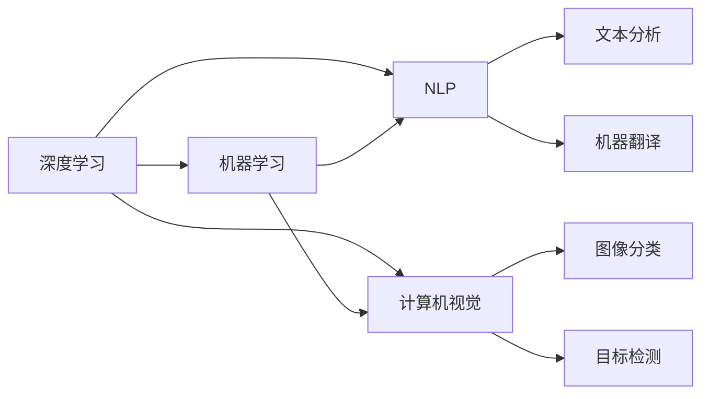
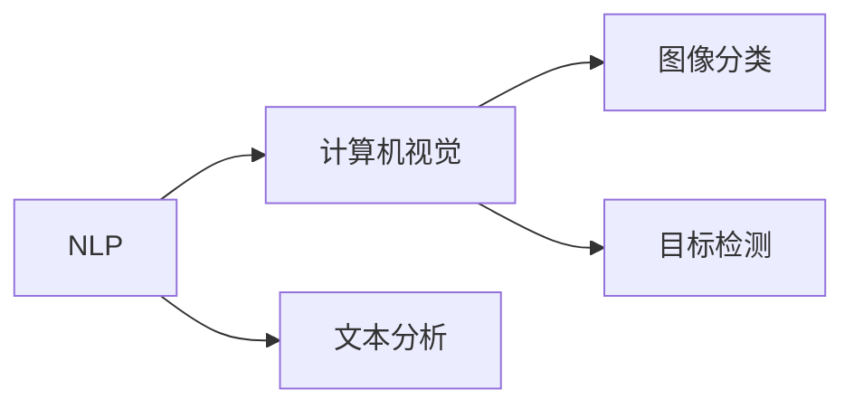
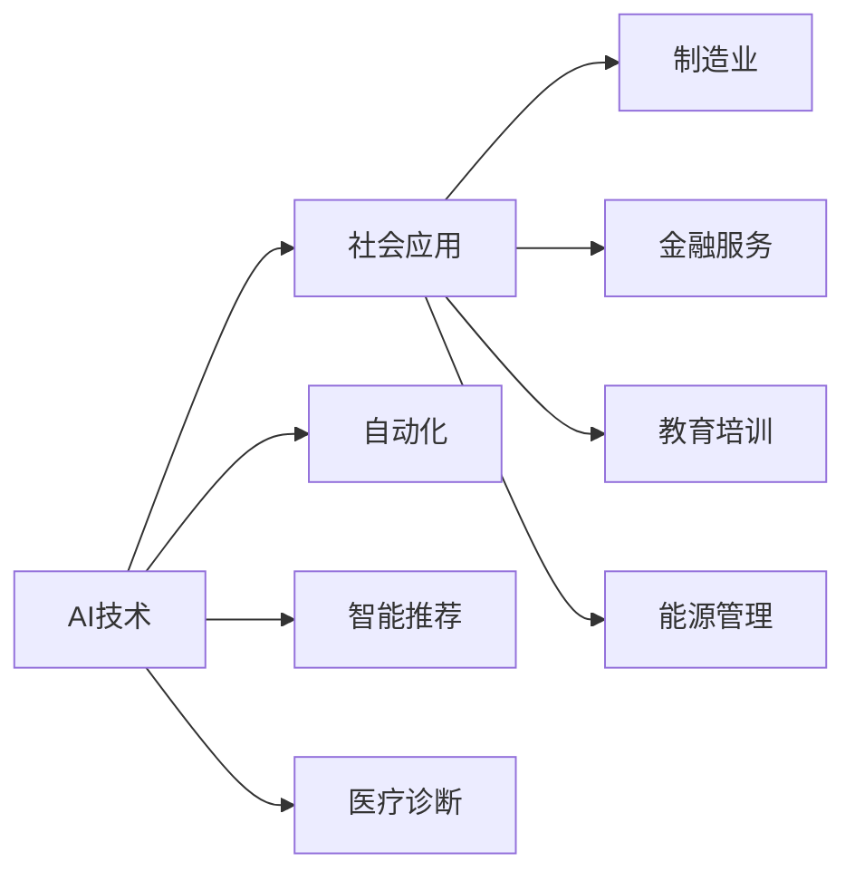
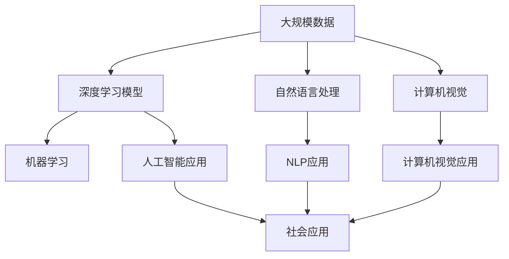
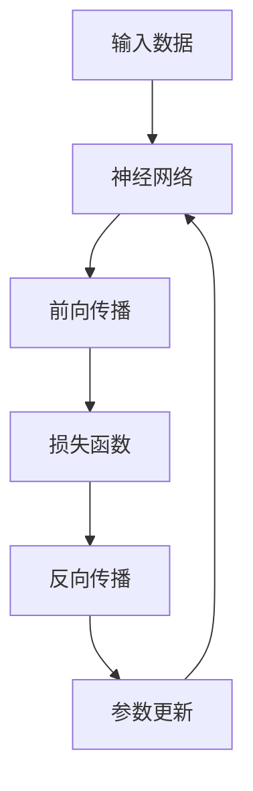

                 

# Andrej Karpathy：人工智能的未来趋势

> 关键词：人工智能,深度学习,机器学习,自然语言处理,NLP,计算机视觉,计算机科学

## 1. 背景介绍

### 1.1 问题由来
Andrej Karpathy，斯坦福大学计算机科学系教授，深度学习与计算机视觉领域的权威。他的研究主要聚焦于计算机视觉、机器学习及神经网络理论。在这篇文章中，他将分享他对人工智能未来趋势的独到见解。

### 1.2 问题核心关键点
本文将围绕Andrej Karpathy对AI未来发展的预测和见解展开，涉及深度学习、机器学习、自然语言处理（NLP）、计算机视觉、以及AI对社会的影响。他的观点基于多年在AI领域的深入研究和实践经验，旨在为读者提供宝贵的洞见。

### 1.3 问题研究意义
Andrej Karpathy的分享，能够帮助读者理解AI技术的最新发展方向，把握技术前沿，从而在实际应用中更加高效地使用这些技术。此外，他的观点也将激发研究者和从业者对AI未来发展方向的思考和探索。

## 2. 核心概念与联系

### 2.1 核心概念概述

本文将介绍几个核心的概念及其相互之间的联系，包括深度学习、机器学习、自然语言处理（NLP）、计算机视觉等。

- **深度学习（Deep Learning）**：通过多层神经网络模拟人脑的计算过程，自动学习和改进算法。深度学习广泛应用于图像识别、语音识别、自然语言处理等领域。

- **机器学习（Machine Learning）**：通过数据驱动的方法，使机器具有学习能力和自我改进能力，广泛应用于预测、分类、聚类等任务。

- **自然语言处理（NLP）**：使计算机能够理解和处理人类语言的技术，包括文本分析、机器翻译、语音识别等。

- **计算机视觉（Computer Vision）**：使计算机能够“看”懂图像和视频，包括图像分类、目标检测、图像生成等。

这些概念通过Mermaid流程图展示它们之间的联系：



这些核心概念构成了AI技术的基石，通过它们之间的相互结合，推动AI技术在各个领域的应用和发展。

### 2.2 概念间的关系

以下通过Mermaid流程图展示这些核心概念之间的关系。

#### 2.2.1 深度学习与机器学习的关系


深度学习是机器学习的一个分支，利用神经网络进行模型训练和预测。深度学习的核心是神经网络，通过多层非线性变换，实现对复杂数据的有效表示和处理。

#### 2.2.2 自然语言处理与计算机视觉的关系



NLP和计算机视觉都是AI的重要分支。NLP处理文本数据，而计算机视觉处理图像和视频数据。两者在技术上有许多交叉应用，如OCR技术（光学字符识别）、视频字幕生成等。

#### 2.2.3 AI技术与社会的联系



AI技术的应用不仅限于技术和研究领域，还深入社会各个方面，从自动化生产到智能推荐，从医疗诊断到能源管理，AI技术正深刻改变着人类的生活方式。

### 2.3 核心概念的整体架构

以下是一个综合的Mermaid流程图，展示这些核心概念在大规模应用中的整体架构：



这个流程图展示了从大规模数据到深度学习模型，再到具体NLP和计算机视觉应用，最终应用于社会的整体架构。

## 3. 核心算法原理 & 具体操作步骤

### 3.1 算法原理概述

Andrej Karpathy将深度学习的核心算法原理概述为以下几个方面：

- **神经网络（Neural Networks）**：深度学习的核心，由多层神经元组成，通过前向传播和反向传播实现数据处理和模型优化。
- **反向传播（Backpropagation）**：通过链式法则，计算梯度并更新模型参数，使得模型能够自动改进。
- **激活函数（Activation Function）**：如ReLU、Sigmoid等，用于非线性变换，增强模型的表达能力。
- **损失函数（Loss Function）**：如交叉熵、均方误差等，衡量模型输出与真实标签之间的差距。
- **优化器（Optimizer）**：如Adam、SGD等，调整模型参数以最小化损失函数。

### 3.2 算法步骤详解

以下是一个基于神经网络的前向传播和反向传播的详细流程图：



1. **前向传播**：将输入数据输入神经网络，通过逐层非线性变换，得到最终的输出结果。
2. **计算损失**：将输出结果与真实标签进行对比，计算损失函数值。
3. **反向传播**：通过链式法则计算每个参数的梯度，将梯度从输出层反传回输入层。
4. **参数更新**：使用优化器根据梯度更新模型参数，最小化损失函数。

### 3.3 算法优缺点

Andrej Karpathy指出，深度学习虽然强大，但也存在以下优缺点：

#### 优点

- **自动特征提取**：无需手动设计特征，通过神经网络自动学习特征表示。
- **适应性强**：能够处理大量复杂的数据集，并在不断迭代中提高模型性能。
- **应用广泛**：在图像识别、语音识别、自然语言处理等众多领域都有广泛应用。

#### 缺点

- **计算资源需求高**：大规模神经网络需要大量的计算资源，如GPU/TPU。
- **数据依赖性**：深度学习模型的性能很大程度上依赖于数据的质量和数量。
- **可解释性差**：深度学习模型通常被认为是“黑盒”，难以解释其内部工作机制。

### 3.4 算法应用领域

深度学习技术已经广泛应用于以下领域：

- **计算机视觉**：图像分类、目标检测、图像生成等。
- **自然语言处理**：机器翻译、文本分类、情感分析等。
- **语音识别**：语音转文字、语音合成等。
- **推荐系统**：个性化推荐、广告投放等。
- **医疗诊断**：图像识别、基因分析等。

## 4. 数学模型和公式 & 详细讲解 & 举例说明

### 4.1 数学模型构建

深度学习的数学模型通常由以下几个部分构成：

- **输入层**：原始数据，如图像、文本等。
- **隐藏层**：神经网络的核心，通过多层非线性变换处理输入数据。
- **输出层**：最终输出结果，如分类、回归等。

数学模型可以表示为：

$$
y = f(x; \theta)
$$

其中，$y$ 是输出结果，$x$ 是输入数据，$f$ 是神经网络模型，$\theta$ 是模型参数。

### 4.2 公式推导过程

以单层神经网络为例，其前向传播过程可以表示为：

$$
h = g(Wx + b)
$$

其中，$h$ 是隐藏层输出，$x$ 是输入数据，$W$ 是权重矩阵，$b$ 是偏置向量，$g$ 是激活函数。

反向传播过程可以表示为：

$$
\frac{\partial L}{\partial \theta} = \frac{\partial L}{\partial y} \frac{\partial y}{\partial h} \frac{\partial h}{\partial x} \frac{\partial x}{\partial \theta}
$$

其中，$L$ 是损失函数，$\theta$ 是模型参数，$y$ 是输出结果。

### 4.3 案例分析与讲解

以图像分类为例，深度学习模型可以表示为：

$$
y = softmax(Wx + b)
$$

其中，$softmax$ 函数将输出结果转化为概率分布，$W$ 和 $b$ 是卷积层和全连接层的参数。

## 5. 项目实践：代码实例和详细解释说明

### 5.1 开发环境搭建

以下是搭建深度学习开发环境的步骤：

1. **安装Python**：使用Anaconda创建虚拟环境，安装必要的Python包。
2. **安装深度学习框架**：如TensorFlow、PyTorch等。
3. **安装数据处理库**：如Pandas、NumPy等。
4. **安装可视化工具**：如Matplotlib、TensorBoard等。

### 5.2 源代码详细实现

以下是一个使用TensorFlow实现图像分类的代码示例：

```python
import tensorflow as tf
from tensorflow.keras import layers

# 定义模型
model = tf.keras.Sequential([
    layers.Conv2D(32, (3, 3), activation='relu', input_shape=(28, 28, 1)),
    layers.MaxPooling2D((2, 2)),
    layers.Conv2D(64, (3, 3), activation='relu'),
    layers.MaxPooling2D((2, 2)),
    layers.Flatten(),
    layers.Dense(64, activation='relu'),
    layers.Dense(10, activation='softmax')
])

# 编译模型
model.compile(optimizer='adam',
              loss='sparse_categorical_crossentropy',
              metrics=['accuracy'])

# 训练模型
model.fit(train_images, train_labels, epochs=10)

# 评估模型
test_loss, test_acc = model.evaluate(test_images, test_labels)
print('Test accuracy:', test_acc)
```

### 5.3 代码解读与分析

这段代码展示了使用TensorFlow构建和训练一个简单的卷积神经网络。首先定义了模型结构，包括卷积层、池化层、全连接层等。然后使用`compile`方法指定了优化器、损失函数和评估指标。接着使用`fit`方法进行模型训练。最后使用`evaluate`方法评估模型在测试集上的性能。

### 5.4 运行结果展示

训练完成后，可以在测试集上评估模型性能，输出测试准确率。

## 6. 实际应用场景

### 6.1 计算机视觉

深度学习在计算机视觉领域有广泛应用，如图像分类、目标检测、图像生成等。以下是一个目标检测的实际应用场景：

在智能监控系统中，使用深度学习模型对视频帧进行目标检测，自动识别和跟踪进入画面的人和车。通过实时分析和告警，可以有效预防和应对安全威胁。

### 6.2 自然语言处理

深度学习在NLP领域也有广泛应用，如机器翻译、文本分类、情感分析等。以下是一个机器翻译的实际应用场景：

在多语言翻译软件中，使用深度学习模型对输入的文本进行翻译，实现不同语言之间的实时翻译。通过不断训练和优化，翻译质量逐渐提升，支持更多语言和领域。

### 6.3 医疗诊断

深度学习在医疗诊断领域也有重要应用，如图像识别、基因分析等。以下是一个医学图像分类的实际应用场景：

在医学影像中，使用深度学习模型对不同类型的肿瘤进行分类，自动辅助医生进行诊断。通过不断训练和优化，提高了诊断的准确性和效率。

### 6.4 未来应用展望

Andrej Karpathy认为，未来深度学习将继续在多个领域发挥重要作用，以下是他的展望：

1. **自动驾驶**：深度学习在自动驾驶中用于图像识别、目标检测、路径规划等，推动汽车行业的智能化发展。
2. **智能家居**：深度学习在智能家居中用于语音识别、场景理解、行为预测等，提升人机交互体验。
3. **个性化推荐**：深度学习在推荐系统中用于用户行为分析、兴趣匹配等，实现个性化推荐。
4. **金融科技**：深度学习在金融科技中用于风险管理、交易分析、客户服务等，提升金融服务的智能化水平。

## 7. 工具和资源推荐

### 7.1 学习资源推荐

以下是一些推荐的深度学习和AI学习资源：

1. **Coursera**：提供由斯坦福大学、MIT等知名大学开设的深度学习课程。
2. **Udacity**：提供深度学习纳米学位课程，涵盖深度学习理论和实践。
3. **Kaggle**：提供数据科学竞赛和开源数据集，参与实践项目。

### 7.2 开发工具推荐

以下是一些推荐的深度学习和AI开发工具：

1. **PyTorch**：由Facebook开源的深度学习框架，支持动态图和静态图。
2. **TensorFlow**：由Google开源的深度学习框架，支持分布式训练。
3. **JAX**：由Google开源的高性能深度学习库，支持自动微分和向量-向量（Vector-Vector）优化。

### 7.3 相关论文推荐

以下是一些推荐的深度学习和AI研究论文：

1. **ImageNet Classification with Deep Convolutional Neural Networks**：AlexNet论文，展示了深度学习在图像分类任务上的突破。
2. **Rethinking the Inception Architecture for Computer Vision**：Inception论文，提出了GoogleNet网络结构，提升了深度学习模型的性能。
3. **Attention is All You Need**：Transformer论文，提出了Transformer网络结构，推动了自然语言处理的发展。

## 8. 总结：未来发展趋势与挑战

### 8.1 研究成果总结

Andrej Karpathy指出，深度学习在过去十年中取得了巨大进展，但未来仍需解决以下挑战：

1. **数据依赖性**：深度学习模型的性能很大程度上依赖于数据的质量和数量。
2. **可解释性**：深度学习模型通常被认为是“黑盒”，难以解释其内部工作机制。
3. **计算资源需求**：大规模神经网络需要大量的计算资源，如GPU/TPU。

### 8.2 未来发展趋势

Andrej Karpathy认为，未来深度学习将继续在多个领域发挥重要作用，以下是他的展望：

1. **自动驾驶**：深度学习在自动驾驶中用于图像识别、目标检测、路径规划等，推动汽车行业的智能化发展。
2. **智能家居**：深度学习在智能家居中用于语音识别、场景理解、行为预测等，提升人机交互体验。
3. **个性化推荐**：深度学习在推荐系统中用于用户行为分析、兴趣匹配等，实现个性化推荐。
4. **金融科技**：深度学习在金融科技中用于风险管理、交易分析、客户服务等，提升金融服务的智能化水平。

### 8.3 面临的挑战

Andrej Karpathy认为，未来深度学习仍需解决以下挑战：

1. **数据依赖性**：深度学习模型的性能很大程度上依赖于数据的质量和数量。
2. **可解释性**：深度学习模型通常被认为是“黑盒”，难以解释其内部工作机制。
3. **计算资源需求**：大规模神经网络需要大量的计算资源，如GPU/TPU。

### 8.4 研究展望

Andrej Karpathy认为，未来深度学习的研究方向可能包括：

1. **无监督学习**：开发更多无监督学习方法，减少对标注数据的依赖。
2. **可解释性**：提高深度学习模型的可解释性，提升其透明性和可信度。
3. **分布式训练**：开发更高效的分布式训练方法，提升模型训练效率。

## 9. 附录：常见问题与解答

**Q1: 深度学习与传统机器学习的区别是什么？**

A: 深度学习是机器学习的一个分支，通过多层神经网络实现自动特征提取和表示学习。深度学习不需要手动设计特征，通过神经网络自动学习特征表示，而传统机器学习需要手工设计特征。

**Q2: 深度学习的应用场景有哪些？**

A: 深度学习在图像识别、语音识别、自然语言处理、医疗诊断、自动驾驶等多个领域都有广泛应用。

**Q3: 深度学习的未来发展方向是什么？**

A: 未来深度学习的研究方向可能包括无监督学习、可解释性、分布式训练等，提升深度学习模型的性能和应用范围。

**Q4: 如何提高深度学习模型的可解释性？**

A: 可以通过可视化、符号化表示、解释性模型等方法，提高深度学习模型的可解释性，使其透明性和可信度得到提升。

**Q5: 深度学习在实际应用中需要注意哪些问题？**

A: 深度学习在实际应用中需要注意数据依赖性、可解释性、计算资源需求等问题，合理使用深度学习技术，提升其应用效果和可信度。

