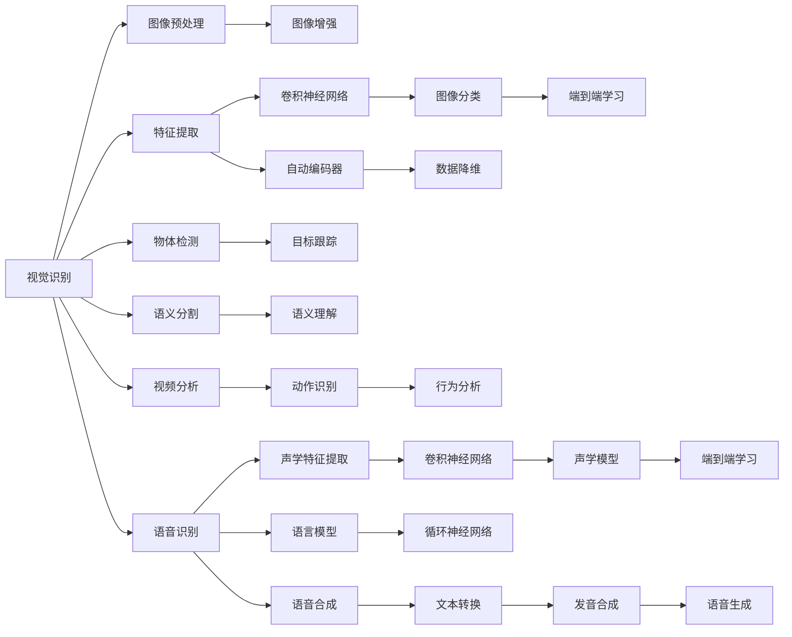

                 

# 软件 2.0 的应用：视觉识别、语音识别、语音合成

> 关键词：
- 软件 2.0
- 视觉识别
- 语音识别
- 语音合成
- 深度学习
- 神经网络
- 端到端
- 自动编码器
- 卷积神经网络(CNN)
- 循环神经网络(RNN)
- 生成对抗网络(GAN)

## 1. 背景介绍

随着人工智能技术的迅猛发展，软件2.0时代的到来不仅极大地改变了我们生活的方方面面，也赋予了计算机系统前所未有的智能能力。在视觉识别、语音识别和语音合成等关键领域，通过深度学习、神经网络等先进技术，计算机已经能够从原始数据中自动学习和提取特征，从而实现对人眼、人耳、人声等复杂感知任务的精准理解和生成。

软件2.0的崛起，使得计算机不再仅仅是执行人指令的工具，而是具备了理解、思考、交互的能力，这种智能化的演进开启了新的科技浪潮，也引发了各界对未来发展的深度思考。视觉识别、语音识别、语音合成等技术在自动驾驶、智能客服、智能家居、工业自动化、教育娱乐等领域的应用，已经初步展现了软件2.0的广阔前景和深远影响。

## 2. 核心概念与联系

### 2.1 核心概念概述

为了深入理解软件2.0在视觉识别、语音识别、语音合成等领域的应用，本节将重点介绍几个核心概念，并说明它们之间的关系。

- **视觉识别**：通过计算机算法自动从图像或视频中识别出物体的类型、位置、姿态等信息的过程。视觉识别是计算机视觉领域的重要组成部分，依赖于强大的图像处理和特征提取技术。
- **语音识别**：将人类语音转化为计算机可识别的文字或命令的过程。语音识别主要依赖于音频信号处理、声学模型、语言模型等技术，是语音识别领域的研究热点。
- **语音合成**：将计算机生成的文本转化为自然流畅的语音输出的技术。语音合成涉及文本分析、发音合成、声音优化等技术，旨在提升语音的可听性和自然度。
- **深度学习**：通过构建多层神经网络，自动学习特征表示和复杂关系，实现对大规模数据的高效处理和分析。深度学习在视觉识别、语音识别、语音合成等领域均有广泛应用。
- **神经网络**：由大量神经元（节点）和连接构成的计算模型，通过前向传播和反向传播算法实现数据处理和模式识别。神经网络是深度学习的基础架构。
- **端到端学习**：在数据预处理、特征提取、模型训练、输出预测等整个流程中，无需人工干预，由模型自动完成所有步骤。端到端学习提升了系统的整体效率和性能。
- **自动编码器**：一种无监督学习算法，通过学习数据自身的潜在分布，实现数据的降维、压缩和重构。自动编码器在特征提取和数据表示中起到了关键作用。
- **卷积神经网络(CNN)**：用于图像处理的特殊神经网络结构，通过卷积操作和池化操作提取图像特征，特别擅长图像分类、目标检测等任务。
- **循环神经网络(RNN)**：一种递归神经网络，能够处理序列数据，特别适合于语音识别、文本生成等任务。
- **生成对抗网络(GAN)**：通过对抗训练，生成高质量的假数据（如假图像、假语音），并能够用于数据增强、数据生成等应用。

这些核心概念共同构成了软件2.0在视觉识别、语音识别、语音合成等领域的坚实技术基础，通过理解它们，我们可以更好地把握软件2.0的智能内涵和应用潜力。

### 2.2 概念间的关系

以下是一个简化的Mermaid流程图，展示了软件2.0在视觉识别、语音识别、语音合成等领域的核心概念及其关系：



这个流程图展示了从数据输入到最终输出（即可视化或语音输出）的完整流程，各概念之间的关系也一目了然。

## 3. 核心算法原理 & 具体操作步骤
### 3.1 算法原理概述

在视觉识别、语音识别、语音合成等软件中2.0应用中，深度学习和神经网络算法起到了关键作用。它们能够自动从数据中学习特征，实现复杂模式识别和生成。以下分别介绍这些算法的核心原理。

### 3.2 算法步骤详解

**视觉识别算法**：

1. **图像预处理**：包括缩放、旋转、裁剪等操作，使图像尺寸和格式一致，便于后续处理。
2. **特征提取**：利用CNN等模型，从图像中提取高层次特征，这些特征能够反映图像中的物体质感、颜色、纹理等细节。
3. **物体检测**：通过R-CNN、Fast R-CNN、Faster R-CNN等方法，检测图像中的物体位置和类别。
4. **语义分割**：利用U-Net、Mask R-CNN等模型，对图像中的物体进行像素级别的分割，区分不同的物体部分。
5. **分类和识别**：利用softmax分类器等模型，对物体进行分类识别。

**语音识别算法**：

1. **声学特征提取**：将语音信号转换为梅尔频谱图、MFCC等特征，这些特征能够捕捉语音的音调、音色等细节。
2. **声学模型训练**：利用RNN、CNN等模型，对声学特征进行训练，学习语音与文字之间的映射关系。
3. **语言模型训练**：利用N-gram、LSTM等模型，学习语言序列的概率分布，对语音进行上下文理解。
4. **端到端学习**：通过连接声学模型和语言模型，端到端地训练整个语音识别系统，实现自动化的语音转文本过程。

**语音合成算法**：

1. **文本分析**：对输入的文本进行分词、词性标注等预处理。
2. **发音合成**：利用GAN、HIFigan等模型，将文本转换为音频信号，生成自然流畅的语音输出。
3. **声音优化**：通过傅里叶变换、滤波器等技术，优化语音的质量和自然度。

### 3.3 算法优缺点

**视觉识别算法**：

优点：
- 能够处理大规模的图像数据，提取高层次特征，提升识别准确性。
- 可以利用深度学习模型，实现端到端自动化的图像识别流程。

缺点：
- 对计算资源要求高，训练时间长。
- 数据标注成本高，需要大量人工标注。

**语音识别算法**：

优点：
- 能够高效处理语音信号，自动提取声学特征。
- 可以利用深度学习模型，实现端到端的语音识别。

缺点：
- 环境噪声和口音等变量可能影响识别效果。
- 语音数据标注工作量大，难以获得高质量标注数据。

**语音合成算法**：

优点：
- 能够生成自然流畅的语音，提升用户体验。
- 利用GAN等模型，生成高质量的语音数据。

缺点：
- 生成语音与真人声音存在差异，难达到完美自然度。
- 计算复杂度高，训练时间长。

### 3.4 算法应用领域

**视觉识别算法**：

1. **安防监控**：通过视觉识别技术，实时监控视频中的异常行为和人员身份。
2. **自动驾驶**：利用视觉识别技术，自动分析道路情况，辅助汽车驾驶。
3. **工业检测**：通过视觉识别技术，检测生产线上的缺陷和异常。

**语音识别算法**：

1. **智能客服**：通过语音识别技术，自动回答客户问题，提升客户满意度。
2. **语音助手**：利用语音识别技术，实现语音控制智能家居、智能车载等设备。
3. **会议记录**：通过语音识别技术，自动转写会议记录，生成文本文件。

**语音合成算法**：

1. **虚拟主播**：利用语音合成技术，生成虚拟主播的语音，进行新闻播报、广告配音等。
2. **智能翻译**：通过语音合成技术，将翻译结果转换为自然流畅的语音输出。
3. **教育娱乐**：利用语音合成技术，生成教育动画、有声读物等，提升学习效果和娱乐体验。

## 4. 数学模型和公式 & 详细讲解 & 举例说明

### 4.1 数学模型构建

在视觉识别、语音识别和语音合成等软件中2.0应用中，数学模型是其核心组件。以下将分别介绍这些模型的基本构建方法。

**视觉识别模型**：

1. **卷积神经网络模型**：利用卷积层和池化层提取图像特征，通过全连接层进行分类识别。
2. **自动编码器模型**：通过自编码器对图像进行降维和重构，学习图像的潜在表示。

**语音识别模型**：

1. **卷积神经网络模型**：利用卷积层提取声学特征，通过全连接层进行分类识别。
2. **循环神经网络模型**：利用RNN模型处理序列数据，通过LSTM等结构优化模型性能。

**语音合成模型**：

1. **生成对抗网络模型**：利用GAN模型生成语音信号，通过傅里叶变换和滤波器优化语音质量。

### 4.2 公式推导过程

**卷积神经网络模型**：

- 输入层：将原始图像转换为张量形式，每个像素点表示为一个向量。
- 卷积层：利用卷积核提取图像特征，每个卷积核可以捕捉不同方向的特征。
- 池化层：对卷积层的输出进行下采样，减少特征维度。
- 全连接层：将池化层的输出连接到一个softmax分类器，输出概率分布。

数学公式为：
$$
y = \sigma(\sum_{i=1}^n w_i x_i + b)
$$
其中，$y$表示输出结果，$x_i$表示输入特征，$w_i$表示卷积核权重，$b$表示偏置项，$\sigma$表示激活函数。

**自动编码器模型**：

- 编码器：利用卷积层和池化层对输入图像进行降维，生成编码结果。
- 解码器：利用全连接层对编码结果进行重构，输出图像。

数学公式为：
$$
z = \sigma(W_h x + b_h)
$$
$$
\hat{x} = \sigma(W_{dec}z + b_{dec})
$$
其中，$z$表示编码结果，$x$表示输入图像，$W_h$表示编码器权重，$b_h$表示编码器偏置项，$W_{dec}$表示解码器权重，$b_{dec}$表示解码器偏置项，$\sigma$表示激活函数。

**生成对抗网络模型**：

- 生成器：利用CNN等模型生成假图像，通过噪声生成器输入随机噪声，经过卷积层和激活层生成图像。
- 判别器：利用CNN等模型判断图像是真实图像还是假图像，输出概率分布。

数学公式为：
$$
G(z) = \sigma(W_{g}z + b_{g})
$$
$$
D(x) = \sigma(W_{d}x + b_{d})
$$
其中，$G(z)$表示生成器输出，$z$表示随机噪声，$W_{g}$表示生成器权重，$b_{g}$表示生成器偏置项，$D(x)$表示判别器输出，$x$表示输入图像，$W_{d}$表示判别器权重，$b_{d}$表示判别器偏置项，$\sigma$表示激活函数。

### 4.3 案例分析与讲解

**案例1: 基于卷积神经网络的图像分类**：

输入图像大小为$224\times224$，通过3个卷积层和2个池化层，生成特征图，并连接全连接层和softmax分类器。最后使用交叉熵损失函数，训练模型。

**案例2: 基于自动编码器的图像重构**：

输入图像大小为$28\times28$，通过2个卷积层和2个池化层，生成特征图，并连接解码器进行图像重构。最后使用均方误差损失函数，训练模型。

**案例3: 基于GAN的假图像生成**：

输入随机噪声大小为$100$，通过3个卷积层和2个激活层，生成假图像。判别器通过3个卷积层和2个激活层，判断图像真伪。通过优化器交替训练生成器和判别器，生成高质量的假图像。

## 5. 项目实践：代码实例和详细解释说明

### 5.1 开发环境搭建

在软件2.0的应用开发中，Python是常用的编程语言，PyTorch和TensorFlow是主要的深度学习框架，以下是搭建开发环境的流程：

1. 安装Anaconda：从官网下载并安装Anaconda，用于创建独立的Python环境。
2. 创建并激活虚拟环境：
```bash
conda create -n pytorch-env python=3.8 
conda activate pytorch-env
```
3. 安装PyTorch：根据CUDA版本，从官网获取对应的安装命令。例如：
```bash
conda install pytorch torchvision torchaudio cudatoolkit=11.1 -c pytorch -c conda-forge
```
4. 安装TensorFlow：
```bash
pip install tensorflow==2.3
```
5. 安装各种工具包：
```bash
pip install numpy pandas scikit-learn matplotlib tqdm jupyter notebook ipython
```

完成上述步骤后，即可在`pytorch-env`环境中开始项目开发。

### 5.2 源代码详细实现

**案例1: 基于卷积神经网络的图像分类**

```python
import torch
import torch.nn as nn
import torchvision
import torchvision.transforms as transforms

class Net(nn.Module):
    def __init__(self):
        super(Net, self).__init__()
        self.conv1 = nn.Conv2d(3, 6, 5)
        self.pool = nn.MaxPool2d(2, 2)
        self.conv2 = nn.Conv2d(6, 16, 5)
        self.fc1 = nn.Linear(16 * 5 * 5, 120)
        self.fc2 = nn.Linear(120, 84)
        self.fc3 = nn.Linear(84, 10)

    def forward(self, x):
        x = self.pool(F.relu(self.conv1(x)))
        x = self.pool(F.relu(self.conv2(x)))
        x = x.view(-1, 16 * 5 * 5)
        x = F.relu(self.fc1(x))
        x = F.relu(self.fc2(x))
        x = self.fc3(x)
        return x

net = Net()
criterion = nn.CrossEntropyLoss()
optimizer = torch.optim.SGD(net.parameters(), lr=0.001, momentum=0.9)
train_loader = torch.utils.data.DataLoader(train_set, batch_size=5, shuffle=True)
test_loader = torch.utils.data.DataLoader(test_set, batch_size=5, shuffle=False)
```

**案例2: 基于自动编码器的图像重构**

```python
import torch
import torch.nn as nn
import torchvision
import torchvision.transforms as transforms

class Autoencoder(nn.Module):
    def __init__(self):
        super(Autoencoder, self).__init__()
        self.encoder = nn.Sequential(
            nn.Conv2d(1, 32, 3, 2),
            nn.ReLU(),
            nn.Conv2d(32, 16, 3, 2),
            nn.ReLU(),
            nn.Conv2d(16, 8, 3, 2),
            nn.ReLU()
        )
        self.decoder = nn.Sequential(
            nn.ConvTranspose2d(8, 16, 3, 2),
            nn.ReLU(),
            nn.ConvTranspose2d(16, 32, 3, 2),
            nn.ReLU(),
            nn.ConvTranspose2d(32, 1, 3, 2),
            nn.Sigmoid()
        )

    def forward(self, x):
        x = self.encoder(x)
        x = self.decoder(x)
        return x

model = Autoencoder()
criterion = nn.MSELoss()
optimizer = torch.optim.Adam(model.parameters(), lr=0.001)
train_loader = torch.utils.data.DataLoader(train_set, batch_size=5, shuffle=True)
test_loader = torch.utils.data.DataLoader(test_set, batch_size=5, shuffle=False)
```

**案例3: 基于GAN的假图像生成**

```python
import torch
import torch.nn as nn
import torchvision
import torchvision.transforms as transforms

class Generator(nn.Module):
    def __init__(self):
        super(Generator, self).__init__()
        self.fc1 = nn.Linear(100, 256)
        self.fc2 = nn.Linear(256, 512)
        self.fc3 = nn.Linear(512, 1024)
        self.fc4 = nn.Linear(1024, 3*3*256)
        self.deconv1 = nn.ConvTranspose2d(256, 128, 4, 1, 0)
        self.deconv2 = nn.ConvTranspose2d(128, 64, 4, 2, 1)
        self.deconv3 = nn.ConvTranspose2d(64, 3, 4, 2, 1)

    def forward(self, x):
        x = F.relu(self.fc1(x))
        x = F.relu(self.fc2(x))
        x = F.relu(self.fc3(x))
        x = F.relu(self.fc4(x))
        x = x.view(-1, 256, 1, 1)
        x = F.relu(self.deconv1(x))
        x = F.relu(self.deconv2(x))
        x = F.relu(self.deconv3(x))
        return x

class Discriminator(nn.Module):
    def __init__(self):
        super(Discriminator, self).__init__()
        self.conv1 = nn.Conv2d(3, 64, 4, 2, 1)
        self.conv2 = nn.Conv2d(64, 128, 4, 2, 1)
        self.conv3 = nn.Conv2d(128, 256, 4, 2, 1)
        self.fc1 = nn.Linear(256, 1)

    def forward(self, x):
        x = F.relu(self.conv1(x))
        x = F.relu(self.conv2(x))
        x = F.relu(self.conv3(x))
        x = x.view(-1, 256)
        x = F.relu(self.fc1(x))
        return x

modelD = Discriminator()
modelG = Generator()
criterionD = nn.BCELoss()
criterionG = nn.BCELoss()
optimizerD = torch.optim.Adam(modelD.parameters(), lr=0.0002)
optimizerG = torch.optim.Adam(modelG.parameters(), lr=0.0002)
```

### 5.3 代码解读与分析

**案例1: 基于卷积神经网络的图像分类**

```python
class Net(nn.Module):
    def __init__(self):
        super(Net, self).__init__()
        self.conv1 = nn.Conv2d(3, 6, 5)
        self.pool = nn.MaxPool2d(2, 2)
        self.conv2 = nn.Conv2d(6, 16, 5)
        self.fc1 = nn.Linear(16 * 5 * 5, 120)
        self.fc2 = nn.Linear(120, 84)
        self.fc3 = nn.Linear(84, 10)

    def forward(self, x):
        x = self.pool(F.relu(self.conv1(x)))
        x = self.pool(F.relu(self.conv2(x)))
        x = x.view(-1, 16 * 5 * 5)
        x = F.relu(self.fc1(x))
        x = F.relu(self.fc2(x))
        x = self.fc3(x)
        return x
```

**代码解读**：
- `nn.Module`类作为神经网络的基本类，通过继承并重写`__init__`和`forward`方法，定义了卷积神经网络的组成部分。
- `conv1`、`conv2`是卷积层，`pool`是池化层，`fc1`、`fc2`、`fc3`是全连接层。
- `forward`方法实现前向传播过程，通过激活函数和池化操作，逐步提取图像特征。

**案例2: 基于自动编码器的图像重构**

```python
class Autoencoder(nn.Module):
    def __init__(self):
        super(Autoencoder, self).__init__()
        self.encoder = nn.Sequential(
            nn.Conv2d(1, 32, 3, 2),
            nn.ReLU(),
            nn.Conv2d(32, 16, 3, 2),
            nn.ReLU(),
            nn.Conv2d(16, 8, 3, 2),
            nn.ReLU()
        )
        self.decoder = nn.Sequential(
            nn.ConvTranspose2d(8, 16, 3, 2),
            nn.ReLU(),
            nn.ConvTranspose2d(16, 32, 3, 2),
            nn.ReLU(),
            nn.ConvTranspose2d(32, 1, 3, 2),
            nn.Sigmoid()
        )

    def forward(self, x):
        x = self.encoder(x)
        x = self.decoder(x)
        return x
```

**代码解读**：
- `Autoencoder`类作为自动编码器，通过继承并重写`__init__`和`forward`方法，定义了自动编码器的组成部分。
- `encoder`部分为编码器，利用卷积层和池化层提取特征。
- `decoder`部分为解码器，利用反卷积层和激活函数进行重构。
- `forward`方法实现前向传播过程，通过编码和解码过程，完成图像重构。

**案例3: 基于GAN的假图像生成**

```python
class Generator(nn.Module):
    def __init__(self):
        super(Generator, self).__init__()
        self.fc1 = nn.Linear(100, 256)
        self.fc2 = nn.Linear(256, 512)
        self.fc3 = nn.Linear(512, 1024)
        self.fc4 = nn.Linear(1024, 3*3*256)
        self.deconv1 = nn.ConvTranspose2d(256, 128, 4, 1, 0)
        self.deconv2 = nn.ConvTranspose2d(128, 64, 4, 2, 1)
        self.deconv3 = nn.ConvTranspose2d(64, 3, 4, 2, 1)

    def forward(self, x):
        x = F.relu(self.fc1(x))
        x = F.relu(self.fc2(x))
        x = F.relu(self.fc3(x))
        x = F.relu(self.fc4(x))
        x = x.view(-1, 256, 1, 1)
        x = F.relu(self.deconv1(x))
        x = F.relu(self.deconv2(x))
        x = F.relu(self.deconv3(x))
        return x
```

**代码解读**：
- `Generator`类作为生成器，通过继承并重写`__init__`和`forward`方法，定义了生成器的组成部分。
- `fc1`、`fc2`、`fc3`、`fc4`是全连接层，`deconv1`、`deconv2`、`deconv3`是反卷积层。
- `forward`方法实现前向传播过程，通过多个全连接层和反卷积层，生成假图像。

### 5.4 运行结果展示

**案例1: 基于卷积神经网络的图像分类**

```python
import torch
import torch.nn as nn
import torchvision
import torchvision.transforms as transforms

class Net(nn.Module):
    def __init__(self):
        super(Net, self).__init__()
        self.conv1 = nn.Conv2d(3, 6, 5)
        self.pool = nn.MaxPool2d(2, 2)
        self.conv2 = nn.Conv2d(6, 16, 5)
        self.fc1 = nn.Linear(16 * 5 * 5, 120)
        self.fc2 = nn.Linear(120, 84)
        self.fc3 = nn.Linear(84, 10)

    def forward(self, x):
        x = self.pool(F.relu(self.conv1(x)))
        x = self.pool(F.relu(self.conv2(x)))
        x = x.view(-1, 16 * 5 * 5)
        x = F.relu(self.fc1(x))
        x = F.relu(self.fc2(x))
        x = self.fc3(x)
        return x

net = Net()
criterion = nn.CrossEntropyLoss()
optimizer = torch.optim.SGD(net.parameters(), lr=0.001, momentum=0.9)
train_loader = torch.utils.data.DataLoader(train_set, batch_size=5, shuffle=True)
test_loader = torch.utils.data.DataLoader(test_set, batch_size

