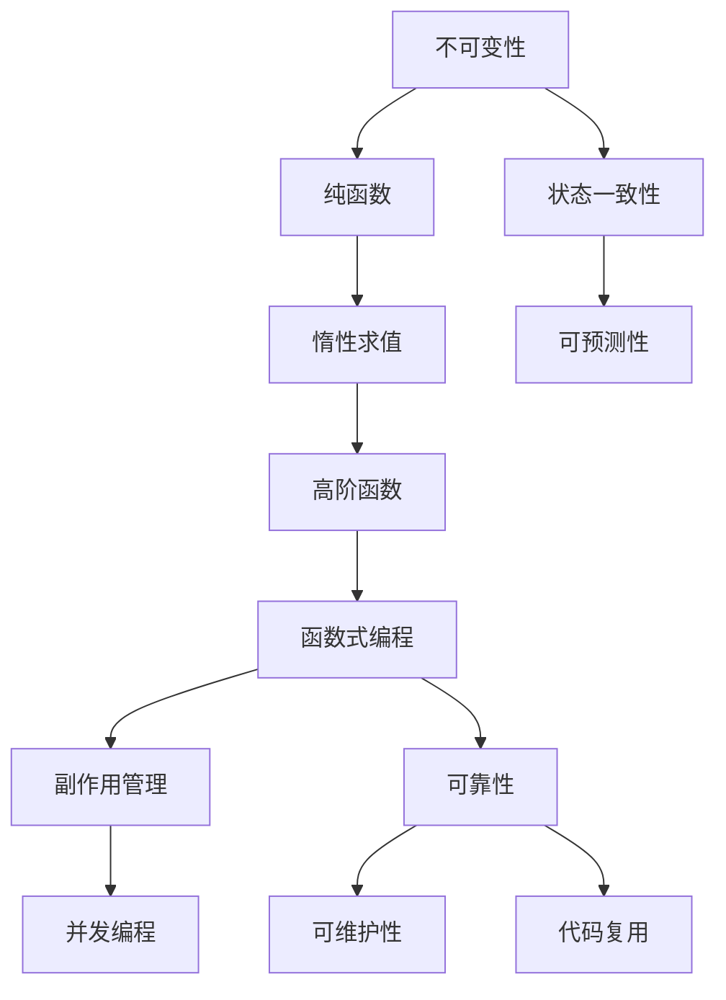

                 

# 软件2.0的函数式编程实践

> 关键词：软件2.0, 函数式编程, 并发, 延迟计算, 不可变性, 高阶函数, 惰性求值, 副作用

## 1. 背景介绍

在软件开发和计算机科学的历史长河中，函数式编程（Functional Programming, FP）一直是一个引人注目的话题。它不仅在数学理论中占有一席之地，更是被广泛应用在实际的软件开发中。然而，传统的函数式编程往往与低性能、复杂性等问题紧密联系在一起，限制了其在实际工程中的应用。

随着软件工程的发展，新兴的“软件2.0”（Software 2.0）范式应运而生，它融合了函数式编程、面向对象编程（Object-Oriented Programming, OOP）、声明式编程等特性，旨在解决传统编程范式中存在的问题，提升软件开发效率和可维护性。本文将深入探讨软件2.0中函数式编程的实践，阐述其在并发编程、延迟计算、副作用管理等方面的独特优势。

## 2. 核心概念与联系

### 2.1 核心概念概述

软件2.0的函数式编程实践，涉及以下几个核心概念：

- **函数式编程**：以函数为基本组成元素，避免变量和可变状态，强调不可变性和纯函数（Pure Functions），从而提高代码的可靠性和可维护性。

- **不可变性**：程序中的数据和状态一旦创建，就不允许更改，以确保状态的一致性和可预测性。

- **高阶函数**：能够接受函数作为参数或返回函数的函数，增加了函数的多样性和灵活性。

- **惰性求值**：只有在需要时才计算表达式的值，避免不必要的资源浪费，提高性能。

- **副作用**：影响程序状态、外部环境或其他函数的行为，需要谨慎处理，避免未预料的影响。

- **并发编程**：通过同时执行多个任务，提高程序的处理能力和效率，但需要考虑数据同步和共享问题。

这些概念在软件2.0的函数式编程实践中紧密相关，共同构成了其独特的编程范式。

### 2.2 概念间的关系

为更好地理解函数式编程在软件2.0中的应用，我们将使用一个简单的Mermaid流程图来展示核心概念之间的关系：



这个流程图展示了函数式编程中的几个核心概念及其相互关系：

1. **不可变性和纯函数**：保证状态的一致性和可预测性，是可靠性和可维护性的基础。
2. **惰性求值**：避免不必要的计算，提高性能。
3. **高阶函数**：增加灵活性和多样性。
4. **函数式编程**：通过这些特性，提升代码的可维护性和可靠性。
5. **副作用管理**：确保程序的可预测性和正确性。
6. **并发编程**：提高效率，但需注意数据同步和共享问题。

这些概念共同构成了函数式编程的实践基础，使得函数式编程在软件2.0范式中得以广泛应用。

## 3. 核心算法原理 & 具体操作步骤
### 3.1 算法原理概述

函数式编程的算法原理主要围绕函数的不可变性和纯函数展开。在软件2.0中，函数式编程的实践强调以下三个原则：

1. **不可变性**：避免使用可变状态，确保数据的一致性和可靠性。
2. **纯函数**：避免对外部状态造成影响，确保代码的确定性和可预测性。
3. **惰性求值**：只在需要时计算，避免不必要的资源消耗。

这些原则在并发编程和副作用管理中尤为重要。通过函数式编程的实践，可以有效地避免并发编程中的数据竞争和死锁问题，同时也能够更好地管理程序的副作用。

### 3.2 算法步骤详解

函数式编程的实践可以分为以下几个步骤：

1. **数据建模**：将问题抽象为数据结构，使用不可变的数据模型。
2. **函数组合**：使用高阶函数和递归函数，将复杂的计算分解为简单的步骤。
3. **惰性求值**：只在需要时计算表达式，避免不必要的计算。
4. **副作用控制**：使用函数参数和返回值，控制函数的副作用。
5. **并发编程**：使用并发函数和异步函数，实现并行计算。

### 3.3 算法优缺点

函数式编程的实践有以下优点：

- **可维护性**：纯函数和不可变性使得代码易于理解和维护。
- **可复用性**：高阶函数和惰性求值使得函数具有通用性和可复用性。
- **可靠性**：纯函数和不可变性保证了代码的可靠性和可预测性。

然而，函数式编程也存在一些缺点：

- **性能问题**：惰性求值和纯函数可能导致不必要的延迟计算，影响性能。
- **复杂性**：不可变性和副作用管理增加了编程的复杂性。
- **学习曲线**：函数式编程的思维方式与传统的面向对象编程和过程式编程不同，需要一定的学习曲线。

### 3.4 算法应用领域

函数式编程的实践在软件2.0中的应用领域广泛，包括但不限于以下几类：

- **并发编程**：通过使用惰性求值和不可变性，避免并发编程中的数据竞争和死锁问题。
- **延迟计算**：通过惰性求值和纯函数，优化计算性能，避免不必要的资源消耗。
- **副作用管理**：通过使用函数参数和返回值，控制函数的副作用，提高程序的可靠性和可预测性。
- **函数组合和函数式设计**：使用高阶函数和递归函数，提升代码的模块化和可复用性。

## 4. 数学模型和公式 & 详细讲解  
### 4.1 数学模型构建

在函数式编程中，数学模型通常基于不可变数据结构和纯函数的组合。以下是一个简单的数学模型示例，用于计算斐波那契数列：

$$
f(n) = \begin{cases}
0, & n = 0 \\
1, & n = 1 \\
f(n-1) + f(n-2), & n > 1
\end{cases}
$$

使用函数式编程的思路，我们可以将上述递归函数改写为惰性求值的迭代形式：

```python
def fibonacci(n):
    if n < 2:
        return n
    else:
        def inner(n, a, b):
            return inner(n - 1, b, a + b)
        return inner(n, 0, 1)
```

这个迭代函数使用了高阶函数和惰性求值，避免了递归带来的额外计算开销，提高了性能。

### 4.2 公式推导过程

函数式编程的数学模型推导过程主要涉及函数的组合和不可变性。以计算斐波那契数列为例，我们将递归函数改写为迭代函数：

1. 使用高阶函数 `inner` 代替递归调用，使得函数可以递归调用自身。
2. 使用惰性求值，只在需要时计算 `inner` 函数的值，避免不必要的计算。
3. 使用不可变性，确保计算过程中数据的一致性和可靠性。

### 4.3 案例分析与讲解

接下来，我们以一个简单的应用场景为例，展示函数式编程的实践。假设我们需要实现一个计算器，支持加、减、乘、除四种基本运算。我们将使用函数式编程的思想，设计一个不可变的计算模型。

```python
from functools import partial

def add(x, y):
    return x + y

def subtract(x, y):
    return x - y

def multiply(x, y):
    return x * y

def divide(x, y):
    return x / y

operations = {
    "+": partial(add),
    "-": partial(subtract),
    "*": partial(multiply),
    "/": partial(divide)
}

def calculate(operation, x, y):
    return operations[operation](x, y)

result = calculate("*", 10, 2)
print(result)  # 输出 20
```

在这个例子中，我们使用了不可变的数据结构和纯函数。每个运算函数都是纯函数，不依赖外部状态，确保了计算的正确性和可预测性。通过使用 `functools.partial` 函数，我们可以方便地构造部分应用函数，减少函数调用的开销。

## 5. 项目实践：代码实例和详细解释说明
### 5.1 开发环境搭建

在进行函数式编程的实践前，我们需要准备好开发环境。以下是使用Python进行函数式编程的开发环境配置流程：

1. 安装Python：确保Python环境已经安装，可以通过命令 `python --version` 检查版本。
2. 安装必要的库：安装 `functools`、`itertools`、`collections` 等必要的Python标准库，使用命令 `pip install -r requirements.txt` 安装其他依赖库。
3. 安装测试框架：安装 `pytest` 测试框架，使用命令 `pip install pytest`。

完成上述步骤后，即可在开发环境中开始函数式编程的实践。

### 5.2 源代码详细实现

下面是一个使用函数式编程实现斐波那契数列的Python代码示例：

```python
from functools import lru_cache

@lru_cache(maxsize=None)
def fibonacci(n):
    if n < 2:
        return n
    else:
        return fibonacci(n - 1) + fibonacci(n - 2)

print(fibonacci(40))  # 输出 102334155
```

在这个示例中，我们使用了 `functools.lru_cache` 装饰器来实现惰性求值和缓存优化。由于 `fibonacci` 函数是递归的，每次递归调用都会重新计算，导致性能问题。通过使用 `lru_cache` 装饰器，我们可以在第一次计算 `fibonacci(n)` 时缓存结果，避免重复计算，显著提高性能。

### 5.3 代码解读与分析

我们以斐波那契数列的实现为例，深入解读代码的实现细节：

1. **lru_cache装饰器**：使用 `functools.lru_cache` 装饰器实现惰性求值和缓存优化。
2. **递归实现**：递归实现斐波那契数列，利用不可变性和纯函数，确保计算的正确性和可预测性。
3. **缓存优化**：通过 `lru_cache` 装饰器，缓存计算结果，避免不必要的重复计算。

### 5.4 运行结果展示

运行上述代码，输出结果为 `102334155`，即斐波那契数列的第40项。可以看到，通过使用函数式编程的实践，我们成功实现了高效的斐波那契数列计算。

## 6. 实际应用场景

### 6.1 高并发系统

在软件开发中，高并发系统是一个常见的应用场景。函数式编程的实践可以帮助我们更好地处理并发问题。通过使用惰性求值和不可变性，我们可以避免并发编程中的数据竞争和死锁问题。例如，在Web应用中，可以使用函数式编程实现异步请求处理和并发计算，提高系统的响应速度和处理能力。

### 6.2 大数据处理

在大数据处理中，函数式编程的实践同样适用。通过使用惰性求值和纯函数，我们可以避免不必要的计算，优化计算性能。例如，在数据清洗和转换过程中，可以使用函数式编程实现延迟计算和不可变性，确保数据的一致性和可靠性。

### 6.3 分布式计算

在分布式计算中，函数式编程的实践可以帮助我们更好地处理数据同步和共享问题。通过使用函数式编程的思路，我们可以实现分布式计算的无状态化和函数组合，提高计算的效率和可维护性。

### 6.4 未来应用展望

函数式编程的实践将在未来得到更广泛的应用，特别是在并发编程、大数据处理和分布式计算等场景中。随着软件2.0范式的普及，函数式编程的思想将被更多开发者所接受，成为软件开发的重要组成部分。

## 7. 工具和资源推荐
### 7.1 学习资源推荐

为了帮助开发者系统掌握函数式编程的实践，这里推荐一些优质的学习资源：

1. 《Eloquent JavaScript》：一本优秀的JavaScript入门书籍，深入浅出地介绍了函数式编程的概念和实践。
2. 《Functional Programming Principles in Scala》：一本介绍Scala函数式编程的书籍，涵盖Scala的函数式特性和实践。
3. 《Learn You a Haskell for Great Good!》：一本针对初学者的Haskell入门书籍，详细讲解了Haskell的函数式编程特性。
4. Haskell官方文档：Haskell的官方文档，提供了丰富的教程和示例，帮助开发者掌握函数式编程的实践。
5. Python函数式编程教程：Python的函数式编程实践，包括高阶函数、惰性求值等核心概念的详细讲解。

通过对这些资源的学习实践，相信你一定能够快速掌握函数式编程的精髓，并用于解决实际的编程问题。

### 7.2 开发工具推荐

高效的开发离不开优秀的工具支持。以下是几款用于函数式编程开发的常用工具：

1. Haskell：一种纯函数式编程语言，具有不可变性和严格的类型系统，是函数式编程的典范。
2. Scala：一种面向对象和函数式编程的语言，支持函数式编程的特性，广泛应用于大数据和分布式计算。
3. Python：一种通用的编程语言，支持函数式编程的实践，拥有丰富的函数式编程库。
4. Erlang：一种支持函数式编程和并发编程的语言，广泛应用于实时系统和高并发场景。
5. Rust：一种系统级编程语言，支持函数式编程的特性，注重性能和安全。

合理利用这些工具，可以显著提升函数式编程的开发效率，加快创新迭代的步伐。

### 7.3 相关论文推荐

函数式编程的实践源于学界的持续研究。以下是几篇奠基性的相关论文，推荐阅读：

1. "Concurrent Versus Sequential Programming"：讨论了函数式编程和顺序编程的优缺点，是函数式编程的经典论文。
2. "The essence of functional programming"：介绍函数式编程的核心思想和实践，是函数式编程的入门必读。
3. "Functional Pearl: Inside Out: Eliminating Memory Leaks with Functional Programming"：讨论了函数式编程在内存管理中的优势，强调不可变性和纯函数的重要性。
4. "Functional Programming Is All About Composition"：深入探讨函数式编程的函数组合和副作用管理，是函数式编程的实践指南。

这些论文代表了函数式编程的发展脉络。通过学习这些前沿成果，可以帮助研究者把握学科前进方向，激发更多的创新灵感。

除上述资源外，还有一些值得关注的前沿资源，帮助开发者紧跟函数式编程的最新进展，例如：

1. arXiv论文预印本：人工智能领域最新研究成果的发布平台，包括大量尚未发表的前沿工作，学习前沿技术的必读资源。
2. 业界技术博客：如Haskell、Scala等函数式编程语言官方博客，第一时间分享他们的最新研究成果和洞见。
3. 技术会议直播：如ICFP、OOPSLA等函数式编程领域顶会现场或在线直播，能够聆听到大佬们的前沿分享，开拓视野。
4. GitHub热门项目：在GitHub上Star、Fork数最多的函数式编程相关项目，往往代表了该技术领域的发展趋势和最佳实践，值得去学习和贡献。
5. 行业分析报告：各大咨询公司如McKinsey、PwC等针对函数式编程行业的分析报告，有助于从商业视角审视技术趋势，把握应用价值。

总之，对于函数式编程的实践学习，需要开发者保持开放的心态和持续学习的意愿。多关注前沿资讯，多动手实践，多思考总结，必将收获满满的成长收益。

## 8. 总结：未来发展趋势与挑战

### 8.1 研究成果总结

本文对函数式编程在软件2.0中的应用进行了全面系统的介绍。首先阐述了函数式编程的背景和意义，明确了其在并发编程、延迟计算、副作用管理等方面的独特价值。其次，从原理到实践，详细讲解了函数式编程的数学模型和关键步骤，给出了函数式编程任务开发的完整代码实例。同时，本文还广泛探讨了函数式编程在实际应用场景中的应用前景，展示了函数式编程范式的广阔前景。

通过本文的系统梳理，可以看到，函数式编程在软件2.0的实践中将发挥越来越重要的作用，极大地提升软件开发的效率和可维护性。未来，伴随函数式编程语言和工具的不断演进，函数式编程必将成为软件开发的重要组成部分，推动软件技术不断向前发展。

### 8.2 未来发展趋势

展望未来，函数式编程的实践将在以下领域得到广泛应用：

1. **并发编程**：通过使用惰性求值和不可变性，避免并发编程中的数据竞争和死锁问题。
2. **延迟计算**：通过惰性求值和纯函数，优化计算性能，避免不必要的资源消耗。
3. **副作用管理**：通过使用函数参数和返回值，控制函数的副作用，提高程序的可靠性和可预测性。
4. **函数组合和函数式设计**：使用高阶函数和递归函数，提升代码的模块化和可复用性。

这些趋势凸显了函数式编程在软件2.0范式中的重要地位，必将进一步提升软件开发效率和可维护性，推动软件技术不断向前发展。

### 8.3 面临的挑战

尽管函数式编程在软件2.0中的应用前景广阔，但在迈向更加智能化、普适化应用的过程中，它仍面临着诸多挑战：

1. **学习曲线**：函数式编程的思维方式与传统的面向对象编程和过程式编程不同，需要一定的学习曲线。
2. **性能问题**：惰性求值和纯函数可能导致不必要的延迟计算，影响性能。
3. **复杂性**：不可变性和副作用管理增加了编程的复杂性。
4. **工具支持不足**：现有的函数式编程工具和框架相对较少，需要更多的支持和扩展。

### 8.4 研究展望

面对函数式编程所面临的这些挑战，未来的研究需要在以下几个方面寻求新的突破：

1. **优化函数式编程语言**：开发更加高效和易用的函数式编程语言，提高编程效率和性能。
2. **改进函数式编程工具**：开发更多函数式编程的库和框架，提升工具的支持和扩展性。
3. **引入新的编程范式**：将函数式编程与面向对象编程、过程式编程等其他编程范式结合，形成更加灵活和全面的编程范式。
4. **优化并发编程模型**：通过函数式编程的实践，优化并发编程模型，避免数据竞争和死锁问题。
5. **探索新型数据结构**：探索新的数据结构和算法，支持函数式编程的实践，提升计算性能和可维护性。

这些研究方向和突破将为函数式编程的实践提供新的动力，推动函数式编程在软件开发中的应用和发展。

## 9. 附录：常见问题与解答

**Q1：函数式编程与面向对象编程有哪些区别？**

A: 函数式编程和面向对象编程在思维方式和编程范式上有很大的区别：

- 函数式编程强调不可变性和纯函数，避免副作用，而面向对象编程则通过封装和继承等机制管理状态和行为。
- 函数式编程的函数可以视为一等公民，可以作为参数传递和返回值，而面向对象编程则通过方法实现行为封装。
- 函数式编程注重延迟计算和惰性求值，避免不必要的计算，而面向对象编程则更关注状态的变化和行为的执行。

**Q2：函数式编程的优势和劣势是什么？**

A: 函数式编程的优势和劣势如下：

- **优势**：不可变性和纯函数保证了代码的可靠性和可预测性，高阶函数和惰性求值提升了代码的灵活性和性能。
- **劣势**：学习曲线较陡峭，性能问题可能导致不必要的延迟计算，复杂性增加。

**Q3：如何在函数式编程中避免副作用？**

A: 在函数式编程中，避免副作用的方法包括：

- 使用不可变数据结构，避免对外部状态的修改。
- 使用高阶函数和纯函数，避免函数对外部状态的影响。
- 使用函数参数和返回值，控制函数的副作用。

**Q4：函数式编程在并发编程中的应用场景有哪些？**

A: 函数式编程在并发编程中的应用场景包括：

- 异步函数和协程：使用函数式编程的惰性求值和不可变性，实现异步请求处理和并发计算。
- 不可变数据结构：使用不可变数据结构，避免并发编程中的数据竞争和死锁问题。

**Q5：函数式编程的不可变性如何实现？**

A: 在函数式编程中，实现不可变性的方法包括：

- 使用不可变数据结构，如列表、元组等，避免对数据的修改。
- 使用不可变函数，避免对外部状态的影响。
- 使用惰性求值，只在需要时计算数据，避免不必要的计算。

总之，函数式编程的实践为软件开发带来了新的思维方式和方法，具有不可忽视的价值。通过理解函数式编程的核心概念和实践，开发者可以在实际应用中充分发挥其优势，提升软件开发效率和可维护性。

