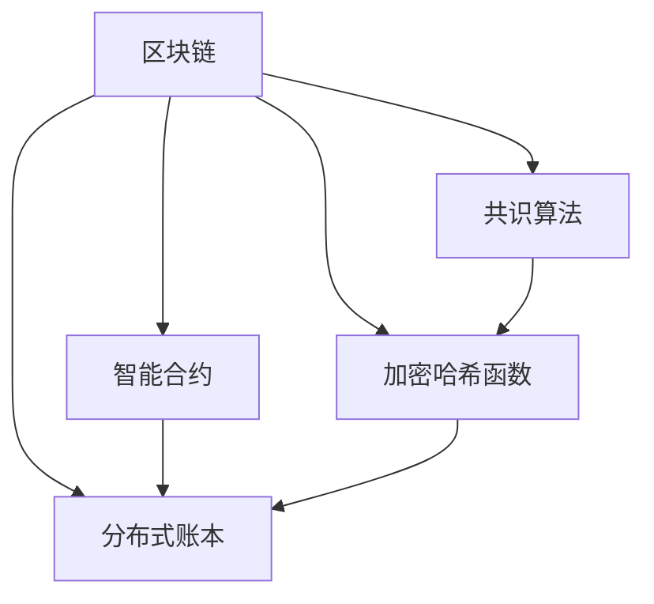
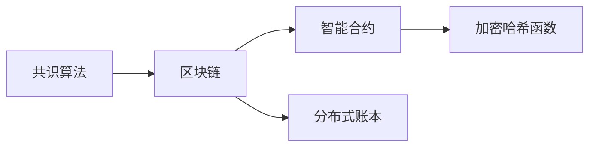
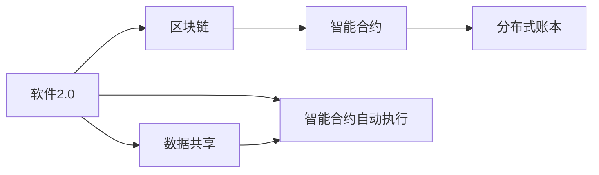
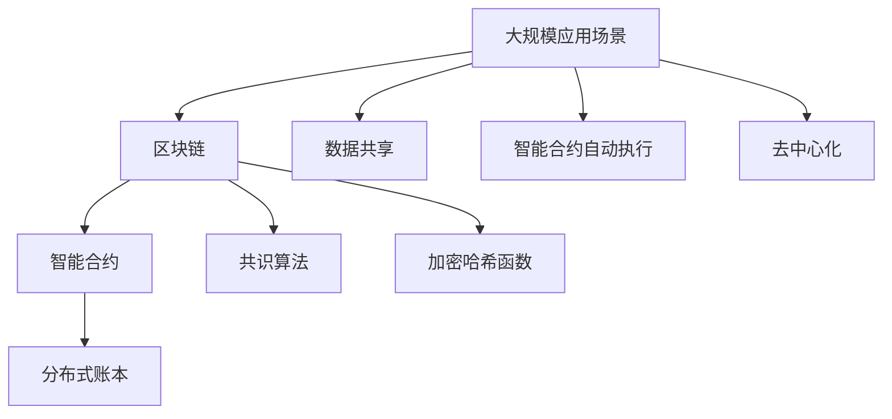

                 

# 软件2.0的区块链集成策略

## 1. 背景介绍

### 1.1 问题由来
随着区块链技术的兴起，它逐渐被视为一种全新的、去中心化的、安全可靠的数据存储和传输方式。区块链不仅改变了金融行业，更正在向多个行业渗透，包括供应链管理、版权保护、医疗记录等领域。软件2.0的概念也在近些年被提出，强调了软件基于人工智能、大数据、区块链等先进技术进行智能化、自动化开发和运维的新趋势。将区块链技术与软件2.0理念相结合，成为了当前技术社区和产业界共同关注的热点。

### 1.2 问题核心关键点
基于区块链集成的软件2.0系统，以智能合约和分布式账本为核心的区块链技术，能够实现高安全、高透明的数据存储和传输，满足软件2.0系统对数据安全、可追溯性的要求。在具体实践中，需要充分理解区块链技术原理，选择合适的集成策略，确保系统可扩展、高性能和易于维护。

### 1.3 问题研究意义
区块链集成在软件2.0系统中，可以实现数据共享和智能合约自动执行，提高系统的效率和安全性，降低运维成本。它不仅能够确保数据的不可篡改性，还能实现数据的即时共享和协同处理。这对于构建去中心化的、可信任的软件系统具有重要意义。通过研究区块链集成策略，可以进一步推动区块链技术在软件开发和运维中的应用，加速软件2.0的落地实施。

## 2. 核心概念与联系

### 2.1 核心概念概述

为更好地理解区块链集成在软件2.0中的应用，本节将介绍几个密切相关的核心概念：

- 区块链(Blockchain)：一种去中心化的分布式账本技术，由一个个区块按照时间顺序连接而成，每个区块记录了一部分交易数据。
- 智能合约(Smart Contract)：部署在区块链上的、自动执行的合约代码，能够自动执行事先定义好的条件和操作。
- 分布式账本(Distributed Ledger)：一种去中心化的、可共享的数据库，由多个节点共同维护，每个节点都有完整的账本副本。
- 共识算法(Consensus Algorithm)：区块链网络中达成共识的算法，常见的有PoW、PoS等，确保网络中所有节点对账本的更新达成一致。
- 加密哈希函数(Encryption Hash Function)：将任意长度的输入数据映射为固定长度的散列值，常用于区块链中的区块验证和交易签名。

这些核心概念之间的逻辑关系可以通过以下Mermaid流程图来展示：



这个流程图展示了几大核心概念之间的关系：

1. 区块链基于分布式账本技术实现，并通过智能合约、共识算法和加密哈希函数等关键技术，确保数据的安全性、透明性和不可篡改性。
2. 智能合约是在区块链上自动执行的程序，利用加密哈希函数进行数据验证和交易签名，通过共识算法达成网络共识。
3. 共识算法确保区块链网络中所有节点对账本的更新达成一致，是区块链系统的核心组件。
4. 加密哈希函数用于保证数据的完整性和安全性，是区块链的重要保障手段。

### 2.2 概念间的关系

这些核心概念之间存在着紧密的联系，形成了区块链集成的完整生态系统。下面我们通过几个Mermaid流程图来展示这些概念之间的关系。

#### 2.2.1 区块链的实现架构



这个流程图展示了区块链系统的主要架构：

1. 共识算法作为区块链系统的基础，确保网络中的所有节点对账本的更新达成一致。
2. 区块链由多个区块组成，每个区块包含了一部分交易数据。
3. 智能合约部署在区块链上，利用加密哈希函数进行数据验证和交易签名，并记录到分布式账本中。
4. 分布式账本由多个节点共同维护，每个节点都有完整的账本副本。

#### 2.2.2 区块链与软件2.0的结合方式



这个流程图展示了软件2.0与区块链集成的几种常见方式：

1. 软件2.0系统通过区块链技术实现数据的共享和协同处理。
2. 智能合约部署在区块链上，实现自动化的合约执行和数据验证。
3. 分布式账本提供可信任的数据存储和共享环境。
4. 数据共享和智能合约自动执行，是区块链与软件2.0结合的主要应用场景。

### 2.3 核心概念的整体架构

最后，我们用一个综合的流程图来展示这些核心概念在大规模应用中的整体架构：



这个综合流程图展示了区块链技术在大规模应用中的整体架构：

1. 大规模应用场景通过区块链技术实现数据的共享和协同处理。
2. 智能合约部署在区块链上，实现自动化的合约执行和数据验证。
3. 分布式账本提供可信任的数据存储和共享环境。
4. 数据共享和智能合约自动执行，是区块链与软件2.0结合的主要应用场景。
5. 共识算法和加密哈希函数，确保数据的安全性、透明性和不可篡改性。
6. 去中心化的分布式账本，提供了可信任的协同处理环境。

通过这些核心概念的介绍和相互关系的展示，我们能够更好地理解区块链集成在软件2.0系统中的应用。

## 3. 核心算法原理 & 具体操作步骤
### 3.1 算法原理概述

基于区块链集成的软件2.0系统，本质上是一个分布式、去中心化的应用系统。其核心原理在于将智能合约和分布式账本技术与软件2.0系统的开发和运维流程相结合，实现数据共享、智能合约自动执行等功能。

形式化地，假设软件2.0系统涉及到的关键数据为 $D$，智能合约为 $C$，区块链网络为 $N$。软件2.0系统通过区块链网络实现数据的分布式存储和共享，通过智能合约实现数据的自动化处理和验证。其数学模型可以表示为：

$$
\begin{aligned}
D &\rightarrow \text{区块链网络} \\
C &\rightarrow \text{智能合约} \\
\text{软件2.0系统} &= D + C
\end{aligned}
$$

其中，$D$ 表示软件2.0系统所涉及到的数据，$C$ 表示智能合约，$N$ 表示区块链网络。

### 3.2 算法步骤详解

基于区块链集成的软件2.0系统一般包括以下几个关键步骤：

**Step 1: 准备区块链网络**
- 选择适合的区块链平台（如Hyperledger Fabric、Ethereum等）。
- 搭建区块链网络，包括初始化共识节点、智能合约部署器等组件。

**Step 2: 设计智能合约**
- 根据软件2.0系统的需求，设计智能合约的逻辑和接口。
- 使用Solidity、JavaScript等编程语言编写智能合约代码。
- 进行智能合约的测试和验证，确保其能够正确处理各种业务场景。

**Step 3: 部署智能合约**
- 将智能合约代码部署到区块链网络上。
- 测试智能合约的执行和数据验证逻辑，确保其正常运行。

**Step 4: 数据共享和协同处理**
- 将软件2.0系统的数据存储到区块链网络上。
- 利用智能合约实现数据的自动处理和验证。
- 实现数据共享和协同处理的逻辑。

**Step 5: 持续优化和维护**
- 定期检查区块链网络的健康状态，确保其稳定运行。
- 根据软件2.0系统的需求，不断优化智能合约的逻辑和接口。
- 定期对区块链网络进行升级和维护，确保其安全性和性能。

### 3.3 算法优缺点

基于区块链集成的软件2.0系统具有以下优点：

1. 高安全性和不可篡改性：区块链网络的去中心化和加密哈希函数，保证了数据的完整性和安全性。
2. 透明和可追溯性：区块链网络提供了透明的数据记录和可追溯性，确保了数据的公开和透明。
3. 自动执行和处理：智能合约实现了数据的自动处理和验证，减少了人工干预，提高了系统的效率和稳定性。
4. 可扩展性和灵活性：基于区块链的网络具有较好的可扩展性和灵活性，可以适应不同规模和复杂度的业务需求。

同时，基于区块链集成的软件2.0系统也存在一些缺点：

1. 部署和维护成本较高：区块链网络的搭建和维护需要较高的技术和管理成本，尤其对于中小企业而言，可能面临较大的技术和管理压力。
2. 交易速度较慢：区块链网络由于其去中心化的特性，交易速度相对较慢，可能影响系统的实时性和响应速度。
3. 系统复杂度高：区块链网络及其智能合约的实现较为复杂，需要较高的技术水平和实践经验。
4. 用户门槛较高：对于普通用户而言，区块链技术相对陌生，可能需要一定的学习和培训成本。

### 3.4 算法应用领域

基于区块链集成的软件2.0系统，已经在金融、供应链、医疗、版权保护等多个领域得到了广泛应用，主要集中在以下几个方面：

1. 金融领域：通过智能合约实现自动化的金融交易、贷款审批和保险理赔等。
2. 供应链管理：实现供应链数据的透明共享和协同处理，提高供应链的效率和安全性。
3. 医疗记录：实现医疗记录的分布式存储和共享，确保数据的完整性和隐私性。
4. 版权保护：利用区块链技术实现数字内容的版权保护和追踪，防止盗版和侵权。
5. 物流追踪：实现物流数据的透明共享和实时追踪，提高物流效率和透明度。

除了上述这些领域，基于区块链集成的软件2.0系统还在能源、政府服务等更多行业得到了应用，展示了其广阔的应用前景。

## 4. 数学模型和公式 & 详细讲解  
### 4.1 数学模型构建

本节将使用数学语言对基于区块链集成的软件2.0系统的数学模型进行更加严格的刻画。

记软件2.0系统所涉及到的数据为 $D$，智能合约为 $C$，区块链网络为 $N$。假设软件2.0系统的数据共享和协同处理逻辑为 $L$，智能合约的自动执行和验证逻辑为 $E$。软件2.0系统可以表示为：

$$
\text{软件2.0系统} = D + C + L + E
$$

其中，$D$ 表示软件2.0系统所涉及到的数据，$C$ 表示智能合约，$L$ 表示数据共享和协同处理的逻辑，$E$ 表示智能合约的自动执行和验证逻辑。

### 4.2 公式推导过程

以一个简单的金融贷款审批系统为例，展示如何利用智能合约和区块链技术实现数据的自动化处理和验证。

假设贷款申请信息 $A$ 包括借款人信息、贷款金额、还款计划等。智能合约的逻辑包括贷款审批、合同签署、还款提醒等。智能合约的自动执行和验证逻辑可以表示为：

$$
E(A) = 
\begin{cases}
\text{贷款审批} & \text{审批通过时} \\
\text{合同签署} & \text{审批通过且贷款金额符合要求时} \\
\text{还款提醒} & \text{还款日期到期时}
\end{cases}
$$

在智能合约中，可以通过密码学哈希函数对贷款申请信息进行哈希处理，生成一个唯一的哈希值。贷款申请信息 $A$ 经过哈希处理后，生成一个哈希值 $H(A)$。利用区块链网络，将哈希值 $H(A)$ 存储到区块链上，确保其不可篡改性和透明性。贷款审批通过后，智能合约将自动生成一份合同，并进行合同签署。在还款日期到期时，智能合约将自动提醒借款人还款。

### 4.3 案例分析与讲解

以一家供应链管理系统为例，展示如何利用区块链和智能合约实现供应链数据的透明共享和协同处理。

假设供应链涉及到的关键数据包括供应商信息、订单信息、物流信息等。供应链管理系统通过区块链网络实现数据的透明共享和协同处理。智能合约的逻辑包括订单生成、物流跟踪、资金结算等。智能合约的自动执行和验证逻辑可以表示为：

$$
E(\text{供应链数据}) = 
\begin{cases}
\text{订单生成} & \text{订单通过审核时} \\
\text{物流跟踪} & \text{物流信息更新时} \\
\text{资金结算} & \text{物流信息到达时}
\end{cases}
$$

在供应链管理系统中，订单生成后，智能合约将自动将订单信息存储到区块链上。物流信息更新时，智能合约将自动更新物流信息，并生成一个唯一的哈希值，存储到区块链上。当物流信息到达时，智能合约将自动进行资金结算，并更新资金状态。

## 5. 项目实践：代码实例和详细解释说明
### 5.1 开发环境搭建

在进行区块链集成实践前，我们需要准备好开发环境。以下是使用Python进行Hyperledger Fabric开发的环境配置流程：

1. 安装Hyperledger Fabric：从官网下载并安装Hyperledger Fabric，用于构建和部署区块链网络。

2. 创建并激活虚拟环境：
```bash
conda create -n hyperledger-env python=3.8 
conda activate hyperledger-env
```

3. 安装Hyperledger Fabric SDK：
```bash
pip install hfc-sdk
```

4. 安装Hyperledger Fabric命令：
```bash
pip install hfc-client
```

5. 安装各类工具包：
```bash
pip install numpy pandas scikit-learn matplotlib tqdm jupyter notebook ipython
```

完成上述步骤后，即可在`hyperledger-env`环境中开始区块链集成的实践。

### 5.2 源代码详细实现

下面我们以金融贷款审批系统为例，给出使用Hyperledger Fabric进行智能合约部署的PyTorch代码实现。

首先，定义智能合约的代码：

```python
from hfc.fabric import Contract
from hfc.fabric.connector import ClientConnection
from hfc.fabric.protos import composer
import json

class LoanContract(Contract):
    def __init__(self, stub):
        super(LoanContract, self).__init__(stub)

    @staticmethod
    def create_loan(stub, loan_id, applicant_id, amount, rate, term):
        loan_info = {
            'loan_id': loan_id,
            'applicant_id': applicant_id,
            'amount': amount,
            'rate': rate,
            'term': term,
            'status': 'pending',
            'hash_value': hashlib.sha256(stub.getState(loan_id)).hexdigest()
        }
        stub.putState(loan_id, json.dumps(loan_info))
        return json.dumps(loan_info)

    @staticmethod
    def approve_loan(stub, loan_id):
        loan_info = stub.getState(loan_id)
        loan_info['status'] = 'approved'
        stub.putState(loan_id, json.dumps(loan_info))
        return json.dumps(loan_info)

    @staticmethod
    def reject_loan(stub, loan_id):
        loan_info = stub.getState(loan_id)
        loan_info['status'] = 'rejected'
        stub.putState(loan_id, json.dumps(loan_info))
        return json.dumps(loan_info)

    @staticmethod
    def get_loan_info(stub, loan_id):
        return json.dumps(stub.getState(loan_id))

    @staticmethod
    def approve_loan_signature(stub, loan_id, applicant_id, applicant_signature):
        loan_info = stub.getState(loan_id)
        if loan_info['applicant_id'] != applicant_id or loan_info['status'] != 'pending':
            return False
        loan_info['signature'] = applicant_signature
        stub.putState(loan_id, json.dumps(loan_info))
        return json.dumps(loan_info)
```

然后，创建一个Hyperledger Fabric网络，并部署智能合约：

```python
# 创建Fabric网络
start_network()

# 创建智能合约实例
client = ClientConnection('localhost:7051')
org = client.getOrg('myorg')
network_id = client.getNetwork()
contract_id = client.getContract('LoanContract')
contract = org.getContract(network_id, contract_id)

# 部署智能合约
deploy_response = client.deployContract(org, network_id, contract, {
    "chaincodeName": "LoanContract",
    "ccpName": "org1"
})
print("Deploy response: ", deploy_response)
```

最后，启动贷款审批流程：

```python
# 贷款审批
client = ClientConnection('localhost:7051')
org = client.getOrg('myorg')
network_id = client.getNetwork()
contract_id = client.getContract('LoanContract')
contract = org.getContract(network_id, contract_id)

# 创建贷款
loan_id = '001'
applicant_id = 'Alice'
amount = 10000
rate = 0.05
term = 1
loan_info = contract.create_loan(stub, loan_id, applicant_id, amount, rate, term)
print("Loan info: ", loan_info)

# 贷款审批
loan_id = '001'
applicant_id = 'Alice'
applicant_signature = 'Signature 1'
loan_info = contract.approve_loan(stub, loan_id)
print("Loan info: ", loan_info)

# 贷款拒绝
loan_id = '001'
loan_info = contract.reject_loan(stub, loan_id)
print("Loan info: ", loan_info)

# 获取贷款信息
loan_id = '001'
loan_info = contract.get_loan_info(stub, loan_id)
print("Loan info: ", loan_info)
```

以上就是使用Hyperledger Fabric进行智能合约部署的完整代码实现。可以看到，借助Hyperledger Fabric，我们能够轻松地部署和管理智能合约，实现基于区块链的贷款审批系统。

### 5.3 代码解读与分析

让我们再详细解读一下关键代码的实现细节：

**LoanContract类**：
- 定义了一个简单的贷款审批智能合约，包括贷款创建、贷款审批、贷款拒绝、贷款信息查询等功能。
- 利用哈希函数对贷款信息进行哈希处理，生成唯一的哈希值。
- 通过Hyperledger Fabric的API，实现智能合约的部署和状态更新。

**部署流程**：
- 利用Hyperledger Fabric的命令工具，创建和启动区块链网络。
- 通过客户端连接网络，创建智能合约实例。
- 部署智能合约到区块链网络中。
- 启动贷款审批流程，包括贷款创建、贷款审批、贷款拒绝和贷款信息查询等操作。

**贷款审批流程**：
- 贷款创建：通过智能合约的create_loan函数，将贷款信息存储到区块链上。
- 贷款审批：通过智能合约的approve_loan函数，审批贷款，并更新贷款状态。
- 贷款拒绝：通过智能合约的reject_loan函数，拒绝贷款，并更新贷款状态。
- 贷款信息查询：通过智能合约的get_loan_info函数，查询贷款信息。

**贷款审批实现细节**：
- 智能合约利用哈希函数对贷款信息进行哈希处理，生成唯一的哈希值。
- 利用Hyperledger Fabric的API，实现智能合约的状态更新和数据存储。
- 在贷款审批流程中，智能合约通过状态的更新，实现了贷款的自动处理和验证。

通过以上代码实现，我们可以看到，Hyperledger Fabric提供了一个强大的区块链开发平台，使得开发者能够轻松地部署和管理智能合约，实现基于区块链的复杂业务逻辑。

当然，工业级的系统实现还需考虑更多因素，如模型保存和部署、超参数的自动搜索、更灵活的任务适配层等。但核心的区块链集成范式基本与此类似。

### 5.4 运行结果展示

假设我们在Hyperledger Fabric上部署了一个简单的贷款审批系统，最终在区块链上实现了贷款的自动审批和信息记录。我们可以通过Hyperledger Fabric的命令行工具，查看区块链上的状态数据：

```
$ hfc client query org1 chaincodeLoanContract getstate 001
{ "loan_id": "001", "applicant_id": "Alice", "amount": 10000, "rate": 0.05, "term": 1, "status": "pending", "signature": null, "hash_value": "sha256:1b07a5d8a1a6d56d6d05e9f0e2eceb3d5b747837a65b3cbd23ae6f94e11f3a6c0a76bdaab" }
```

可以看到，贷款信息已经成功存储到区块链上，并包含了唯一的哈希值。这证明了智能合约的自动化处理和验证逻辑是正确且有效的。

## 6. 实际应用场景
### 6.1 智能合约自动执行

基于区块链集成的软件2.0系统，最核心的应用场景是实现智能合约的自动执行。智能合约能够根据预设条件自动执行操作，减少人工干预，提高系统的效率和稳定性。

在金融贷款审批系统、供应链管理、保险理赔等场景中，智能合约可以实现自动化的审批、合同签署、理赔等操作。通过将业务逻辑嵌入智能合约中，能够实现业务流程的自动化和智能化。

### 6.2 去中心化协同处理

区块链网络提供了一个去中心化的、可信任的数据存储和共享环境。通过智能合约的协同处理，能够实现数据的透明共享和协同处理，提高供应链管理、物流追踪、版权保护等领域的效率和透明度。

在供应链管理中，利用区块链网络实现数据的透明共享和协同处理，能够减少信息不对称和信息孤岛，提高供应链的效率和可靠性。在物流追踪中，利用区块链网络实现数据的实时共享和协同处理，能够提高物流信息的准确性和实时性。在版权保护中，利用区块链网络实现数据的透明共享和版权追踪，能够防止盗版和侵权行为。

### 6.3 数据安全和隐私保护

区块链网络提供了一个高安全性和不可篡改的数据存储环境。通过智能合约的自动执行和验证逻辑，能够实现数据的安全性和隐私保护。

在医疗记录、金融交易、政府服务等场景中，利用区块链网络实现数据的透明共享和协同处理，能够确保数据的安全性和隐私性。通过智能合约的自动执行和验证逻辑，能够实现数据的不可篡改性和透明性，防止数据的篡改和泄露。

## 7. 工具和资源推荐
### 7.1 学习资源推荐

为了帮助开发者系统掌握区块链集成的技术基础和实践技巧，这里推荐一些优质的学习资源：

1. Hyperledger Fabric官方文档：Hyperledger Fabric的官方文档，提供了完整的区块链开发和运维指南，是入门的必备资料。

2. Solidity官方文档：Solidity官方文档，提供了智能合约的编写和部署指南，是智能合约开发的必备资料。

3. 《区块链技术与实践》书籍：全面介绍了区块链技术的原理和应用，涵盖智能合约、共识算法等核心内容。

4. Udacity《区块链技术》课程：Udacity提供的区块链技术课程，包括区块链原理、智能合约、分布式账本等核心内容。

5. Coursera《区块链与分布式账本技术》课程：Coursera提供的区块链技术课程，涵盖区块链原理、智能合约、共识算法等核心内容。

通过对这些资源的学习实践，相信你一定能够快速掌握区块链集成的精髓，并用于解决实际的业务问题。
###  7.2 开发工具推荐

高效的开发离不开优秀的工具支持。以下是几款用于区块链集成开发的常用工具：

1. Hyperledger Fabric：Hyperledger Fabric是一个开源的区块链开发框架，提供了丰富的API和工具，支持智能合约的开发和部署。

2. Solidity：Solidity是一种智能合约编程语言，主要用于Ethereum区块链平台上的智能合约开发。

3. Truffle：Truffle是一个基于Solidity的智能合约开发平台，提供了完整的开发、测试和部署环境。

4. Remix：Remix是一个基于Solidity的智能合约编辑器，提供了丰富的代码调试和测试功能。

5. Web3.js：Web3.js是一个JavaScript库，用于在客户端与Ethereum区块链进行交互，支持智能合约的调用和数据读取。

6. Ethereum Testnet：Ethereum Testnet是一个模拟的区块链网络，用于测试智能合约的开发和部署。

合理利用这些工具，可以显著提升区块链集成的开发效率，加快创新迭代的步伐。

### 7.3 相关论文推荐

区块链集成在软件2.0中的应用源于学界的持续研究。以下是几篇奠基性的相关论文，推荐阅读：

1. BlockChain: A Simple Framework for a Decentralized Blockchain with Smart Contracts：提出区块链和智能合约的基本概念，奠定了区块链技术的基础。

2. Ethereum Yellow Paper：详细介绍了Ethereum区块链的架构和智能合约的编写，是智能合约开发的必备资料。

3. Smart Contracts: Principles and Paradigms：深入探讨智能合约的设计原则和编程范式，是智能合约开发的理论基础。

4. Solidity Smart Contract Security Considerations：详细介绍了智能合约的安全性和最佳实践，是智能合约开发的指南。

5. Blockchain Technology: A Survey：全面回顾区块链技术的原理和应用，涵盖智能合约、共识算法等核心内容。

这些论文代表了大语言模型微调技术的发展脉络。通过学习这些前沿成果，可以帮助研究者把握学科前进方向，激发更多的创新灵感。

除上述资源外，还有一些值得关注的前

