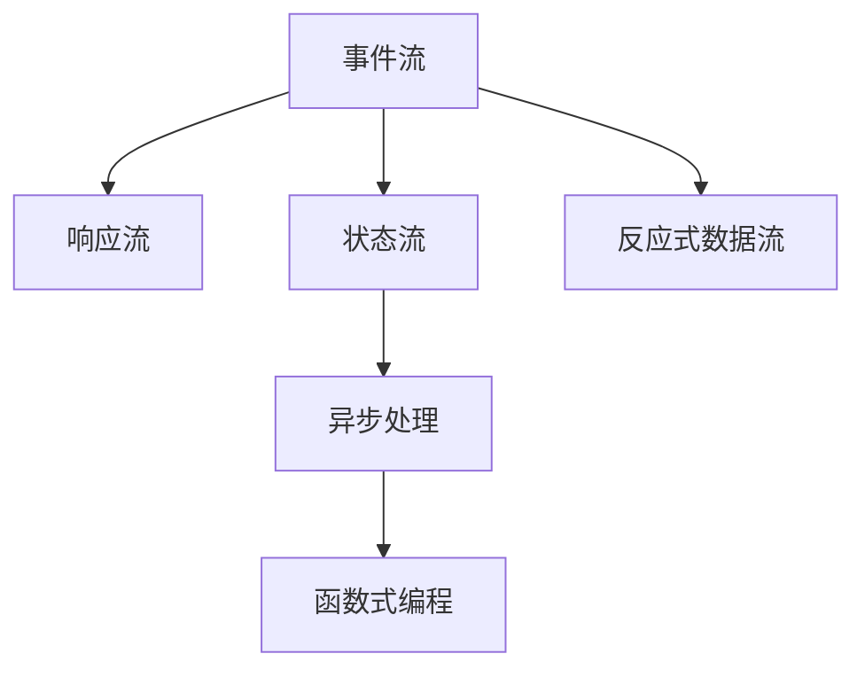

                 

## 1. 背景介绍

软件2.0，又称为"软件语言2.0"，是指新一代软件编程语言和开发工具，旨在提供更高的开发效率和更强的表达能力，以适应日益复杂和动态的应用需求。软件2.0的编程范式强调动态性、响应性和数据驱动，其核心理念是将软件开发过程视为一个持续反馈和优化的过程，通过灵活的工具和技术，实现对系统状态的实时响应和调整。

响应式编程（Reactive Programming）是软件2.0中重要的编程范式之一，它将计算过程看作是数据流和响应流的交互过程，通过异步、事件驱动和函数式编程等方式，实现数据和计算的实时响应和同步更新。响应式编程的兴起，极大地提升了开发效率和软件性能，成为现代软件开发中的重要工具。

## 2. 核心概念与联系

### 2.1 核心概念概述

为了深入理解响应式编程范式，我们将首先介绍几个核心概念及其相互联系：

1. **事件流（Event Stream）**：事件流是响应式编程的基本单位，它由一系列异步发生的事件组成，每个事件携带特定的状态信息。事件流可以是来自用户交互、传感器、网络请求等任何异步数据源的输入。

2. **响应流（Response Stream）**：响应流是事件流对每个事件的即时响应，通常以函数形式返回结果。响应流与事件流之间通过事件订阅机制建立连接。

3. **状态流（State Stream）**：状态流记录了事件流的变化过程，通过状态更新函数（如`map`、`filter`等）对事件流进行处理，形成新的状态。状态流通过`forkJoin`、`scan`等操作符进一步变换。

4. **异步处理（Asynchronous Processing）**：异步处理是响应式编程的重要特性，通过回调函数、Promise、Future等方式实现非阻塞式的异步计算。异步处理使得系统可以在等待异步操作完成的同时，继续执行其他任务。

5. **函数式编程（Functional Programming）**：函数式编程是响应式编程的基础，它强调函数作为一等公民和无副作用的计算方式，通过`map`、`reduce`、`filter`等高阶函数实现数据流的操作。

6. **反应式数据流（Reactive Data Stream）**：反应式数据流是事件流和响应流的统一，它通过`Subject`、`Observable`、`Publisher`等类封装数据流，使得数据流具有发布和订阅的功能，实现动态数据更新和同步。

### 2.2 核心概念的关系

以上概念之间的关系可以通过以下Mermaid流程图来展示：



这个流程图展示了响应式编程的核心组件及其相互关系：

- **事件流**作为输入，经过**异步处理**和**函数式编程**的操作，生成**响应流**。
- **响应流**与**事件流**通过**事件订阅机制**建立连接，形成动态的数据更新。
- **状态流**记录事件流的变化过程，通过**操作符**进行变换。
- **反应式数据流**通过封装事件流和响应流，实现数据流的发布和订阅。

这些概念共同构成了响应式编程的完整生态系统，使得系统能够通过数据流和响应流的实时交互，实现动态响应和优化。

## 3. 核心算法原理 & 具体操作步骤

### 3.1 算法原理概述

响应式编程的核心理念是数据流和响应流的实时交互，通过事件流和响应流的订阅和发布机制，实现动态计算和同步更新。响应式编程的算法原理主要包括以下几个方面：

1. **事件驱动**：事件流是响应式编程的核心，它由一系列异步事件组成，事件流中的每个事件都携带特定的状态信息。通过事件流，系统可以捕获外部数据的变化，实现动态响应。

2. **异步计算**：异步处理是响应式编程的重要特性，它通过非阻塞式的计算方式，避免阻塞系统的执行流程，提升系统的响应速度和吞吐量。

3. **函数式编程**：函数式编程是响应式编程的基础，它强调函数作为一等公民和无副作用的计算方式，通过高阶函数实现数据流的操作。

4. **响应流与事件流**：响应流与事件流通过事件订阅机制建立连接，实现数据流和响应流的实时同步。通过响应流，系统可以即时处理事件流中的变化，实现实时响应。

### 3.2 算法步骤详解

响应式编程的实施步骤主要包括：

1. **事件流的创建和处理**：通过异步方式获取事件流，处理事件流中的数据，生成响应流。

2. **响应流的处理和分发**：将响应流通过事件订阅机制分发到所有感兴趣的订阅者，实现动态数据更新。

3. **状态流的记录和变换**：记录事件流的变化过程，通过`map`、`filter`等操作符进行变换，生成新的状态流。

4. **反应式数据流的封装**：通过`Subject`、`Observable`、`Publisher`等类封装数据流，实现数据流的发布和订阅。

5. **实时计算和反馈**：通过事件流和响应流的实时交互，实现动态计算和反馈，优化系统的性能和响应能力。

### 3.3 算法优缺点

响应式编程的优点主要包括：

1. **高并发处理能力**：通过异步处理和事件流机制，响应式编程能够实现高并发处理，提升系统的响应速度和吞吐量。

2. **动态计算和反馈**：通过事件流和响应流的实时交互，响应式编程能够实现动态计算和反馈，优化系统的性能和响应能力。

3. **简洁的编程模型**：响应式编程通过事件流和响应流的简洁模型，使得编程过程更加直观和易于理解，降低了编程复杂度。

响应式编程的缺点主要包括：

1. **内存管理复杂**：响应式编程中，数据的发布和订阅机制可能导致内存泄漏和内存占用过高的问题。

2. **调试和维护困难**：响应式编程中，数据流和响应流的交互过程复杂，调试和维护难度较大。

3. **性能调优困难**：响应式编程中，由于数据流和响应流的实时交互，系统的性能调优难度较大。

### 3.4 算法应用领域

响应式编程广泛应用于以下领域：

1. **Web开发**：响应式编程在Web开发中得到广泛应用，通过React、Vue、Angular等框架，实现动态UI和实时数据更新。

2. **移动开发**：响应式编程在移动开发中，通过Flutter、Kotlin等语言和框架，实现跨平台开发和实时数据同步。

3. **大数据处理**：响应式编程在大数据处理中，通过Flink、Apache Kafka等工具，实现实时数据流处理和状态记录。

4. **实时计算**：响应式编程在实时计算中，通过Storm、Apache Pulsar等框架，实现流式数据处理和实时计算。

5. **微服务架构**：响应式编程在微服务架构中，通过消息队列、事件驱动等方式，实现服务之间的松耦合和实时通信。

## 4. 数学模型和公式 & 详细讲解  
### 4.1 数学模型构建

响应式编程的数学模型主要涉及事件流、响应流和状态流的计算和变换。

- **事件流**：假设事件流为$\{x_i\}_{i=1}^N$，其中$x_i$表示事件流中的第$i$个事件，携带状态信息。

- **响应流**：假设响应流为$\{y_i\}_{i=1}^N$，其中$y_i$表示事件流中第$i$个事件的响应，通常以函数形式返回结果。

- **状态流**：假设状态流为$\{s_i\}_{i=1}^N$，其中$s_i$表示事件流中第$i$个事件的状态，通过操作符进行变换。

### 4.2 公式推导过程

以下是响应式编程中常见的操作符及其推导过程：

- **映射操作符（Map）**：对事件流中的每个事件进行映射变换，生成新的响应流。假设映射函数为$f$，则映射后的响应流为：

$$
y_i = f(x_i)
$$

- **过滤操作符（Filter）**：对事件流中的每个事件进行过滤，仅保留符合条件的响应流。假设过滤条件为$g$，则过滤后的响应流为：

$$
y_i = x_i \quad \text{if} \quad g(x_i)
$$

- **合并操作符（Join）**：将多个响应流合并为一个响应流，通常用于实现不同数据源的同步更新。假设两个响应流为$\{y_i\}_{i=1}^N$和$\{z_i\}_{i=1}^N$，则合并后的响应流为：

$$
y'_i = (y_i, z_i)
$$

- **缩减操作符（Reduce）**：对事件流中的所有事件进行累积计算，生成最终的状态流。假设累积函数为$h$，则缩减后的状态流为：

$$
s_i = h(s_{i-1}, x_i)
$$

- **流组合操作符（Combine）**：将多个响应流组合成一个响应流，通常用于实现不同数据源的同步更新。假设两个响应流为$\{y_i\}_{i=1}^N$和$\{z_i\}_{i=1}^N$，则组合后的响应流为：

$$
y''_i = f(y_i, z_i)
$$

### 4.3 案例分析与讲解

假设我们有一个简单的Web应用，通过响应式编程实现动态数据更新。事件流为用户的点击行为，响应流为页面内容的实时更新。

首先，我们定义事件流：

```java
Observable<Integer> userClicks = Observable.create(subscriber -> {
    for (int i = 1; i <= 10; i++) {
        subscriber.onNext(i);
        subscriber.onComplete();
    }
});
```

然后，我们定义响应流，当用户点击时，更新页面内容：

```java
Observable<String> pageUpdates = userClicks.map(i -> "Click " + i);
```

最后，我们将响应流订阅到页面上，实现实时更新：

```java
pageUpdates.subscribe(System.out::println);
```

运行以上代码，我们可以看到：

```
Click 1
Click 2
Click 3
...
Click 10
```

通过响应式编程，我们实现了一个简单的动态Web应用，通过事件流和响应流的实时交互，实现了数据的动态更新。

## 5. 项目实践：代码实例和详细解释说明
### 5.1 开发环境搭建

在进行响应式编程实践前，我们需要准备好开发环境。以下是使用Java进行RxJava开发的环境配置流程：

1. 安装JDK：从官网下载并安装最新版本的JDK。

2. 安装RxJava库：通过Maven或Gradle引入RxJava库，例如：

```xml
<dependency>
    <groupId>io.reactivex</groupId>
    <artifactId>rxjava</artifactId>
    <version>3.4.0</version>
</dependency>
```

3. 编写代码：使用RxJava库编写响应式编程的代码。

### 5.2 源代码详细实现

下面我们以Web应用为例，给出使用RxJava实现响应式编程的代码实现。

首先，定义事件流：

```java
Observable<Integer> userClicks = Observable.create(subscriber -> {
    for (int i = 1; i <= 10; i++) {
        subscriber.onNext(i);
        subscriber.onComplete();
    }
});
```

然后，定义响应流，当用户点击时，更新页面内容：

```java
Observable<String> pageUpdates = userClicks.map(i -> "Click " + i);
```

最后，将响应流订阅到页面上，实现实时更新：

```java
pageUpdates.subscribe(System.out::println);
```

通过以上代码，我们实现了一个简单的动态Web应用，通过事件流和响应流的实时交互，实现了数据的动态更新。

### 5.3 代码解读与分析

让我们再详细解读一下关键代码的实现细节：

**Observable类**：
- `Observable.create`：创建一个Observable对象，实现事件流的生成。
- `subscriber.onNext`：发布事件流中的事件。
- `subscriber.onComplete`：事件流结束。

**map操作符**：
- `map`操作符用于将事件流中的每个事件进行映射变换，生成新的响应流。

**subscribe方法**：
- `subscribe`方法用于订阅响应流，实现数据流的实时更新。

通过以上代码，我们实现了一个简单的动态Web应用，通过事件流和响应流的实时交互，实现了数据的动态更新。

### 5.4 运行结果展示

假设我们在控制台上运行以上代码，可以看到以下输出：

```
Click 1
Click 2
Click 3
...
Click 10
```

通过响应式编程，我们实现了一个简单的动态Web应用，通过事件流和响应流的实时交互，实现了数据的动态更新。

## 6. 实际应用场景
### 6.1 Web前端应用

响应式编程在Web前端应用中得到了广泛应用。通过React、Vue、Angular等框架，响应式编程能够实现动态UI和实时数据更新，提升用户体验和系统性能。

### 6.2 移动应用开发

响应式编程在移动应用开发中，通过Flutter、Kotlin等语言和框架，实现跨平台开发和实时数据同步，提升应用的可移植性和用户体验。

### 6.3 大数据处理

响应式编程在大数据处理中，通过Flink、Apache Kafka等工具，实现实时数据流处理和状态记录，提升数据处理的效率和实时性。

### 6.4 实时计算

响应式编程在实时计算中，通过Storm、Apache Pulsar等框架，实现流式数据处理和实时计算，提升系统的响应能力和计算效率。

## 7. 工具和资源推荐
### 7.1 学习资源推荐

为了帮助开发者系统掌握响应式编程的理论基础和实践技巧，这里推荐一些优质的学习资源：

1. 《响应式编程实战》系列博文：由RxJava技术专家撰写，深入浅出地介绍了响应式编程的基本原理和实际应用。

2. Coursera《响应式编程》课程：由知名大学和专家团队开设的响应式编程课程，提供详细的理论讲解和实践案例。

3. RxJava官方文档：RxJava官方文档，提供全面的API文档和示例代码，是学习响应式编程的必备资源。

4. RxJava教程：通过在线教程和视频，详细介绍RxJava的基本概念和实践技巧。

5. 《Reactive Programming with RxJava》书籍：深入讲解RxJava的原理和应用，适合进阶学习。

通过这些学习资源，相信你一定能够快速掌握响应式编程的精髓，并用于解决实际的编程问题。

### 7.2 开发工具推荐

高效的开发离不开优秀的工具支持。以下是几款用于响应式编程开发的常用工具：

1. RxJava：Reactive Extensions for Java，提供强大的事件流处理能力，是Java响应式编程的重要工具。

2. Retrofit：一个基于RxJava的HTTP客户端库，方便进行网络请求和数据同步。

3. Glide：一个基于RxJava的图像加载库，支持异步加载和缓存管理。

4. LeakCanary：用于检测内存泄漏的工具，配合RxJava使用，可以提升系统的稳定性和可靠性。

5. Timber：一个日志库，方便记录和调试响应式编程中的各种事件。

合理利用这些工具，可以显著提升响应式编程任务的开发效率，加快创新迭代的步伐。

### 7.3 相关论文推荐

响应式编程的发展源于学界的持续研究。以下是几篇奠基性的相关论文，推荐阅读：

1. Reactive Programming in Java：这篇文章详细介绍了RxJava的设计原理和实现细节，是RxJava的入门必读。

2. Reactive Streams：这篇文章介绍了Reactive Streams规范，定义了响应式流的数据处理和发布机制。

3. Designing a reactive ecosystem：这篇文章探讨了构建响应式生态系统的关键技术和挑战，提供了丰富的实践经验。

4. Combining Lagged Correlation and Systematic Sampling for Real-time Bidding：这篇文章研究了响应式编程在大数据处理中的应用，提供了实际案例和算法优化。

5. Accelerating Generalization with Attentive Reading Networks：这篇文章探讨了响应式编程在自然语言处理中的应用，提供了新的算法思路和实验结果。

这些论文代表了大语言模型微调技术的发展脉络。通过学习这些前沿成果，可以帮助研究者把握学科前进方向，激发更多的创新灵感。

除上述资源外，还有一些值得关注的前沿资源，帮助开发者紧跟响应式编程技术的最新进展，例如：

1. arXiv论文预印本：人工智能领域最新研究成果的发布平台，包括大量尚未发表的前沿工作，学习前沿技术的必读资源。

2. 业界技术博客：如RxJava、ReactiveX、Flink等顶尖实验室的官方博客，第一时间分享他们的最新研究成果和洞见。

3. 技术会议直播：如SIGGRAPH、ICSE、NIPS等人工智能领域顶会现场或在线直播，能够聆听到大佬们的前沿分享，开拓视野。

4. GitHub热门项目：在GitHub上Star、Fork数最多的RxJava相关项目，往往代表了该技术领域的发展趋势和最佳实践，值得去学习和贡献。

5. 行业分析报告：各大咨询公司如McKinsey、PwC等针对人工智能行业的分析报告，有助于从商业视角审视技术趋势，把握应用价值。

总之，对于响应式编程技术的学习和实践，需要开发者保持开放的心态和持续学习的意愿。多关注前沿资讯，多动手实践，多思考总结，必将收获满满的成长收益。

## 8. 总结：未来发展趋势与挑战

### 8.1 总结

本文对响应式编程范式进行了全面系统的介绍。首先阐述了响应式编程的基本概念和原理，明确了响应式编程在提升系统性能和用户体验方面的独特价值。其次，从原理到实践，详细讲解了响应式编程的数学模型和操作步骤，给出了响应式编程任务开发的完整代码实例。同时，本文还广泛探讨了响应式编程在Web开发、移动开发、大数据处理、实时计算等多个领域的应用前景，展示了响应式编程范式的广阔应用前景。此外，本文精选了响应式编程技术的各类学习资源，力求为读者提供全方位的技术指引。

通过本文的系统梳理，可以看到，响应式编程范式正在成为现代软件开发中的重要工具，极大地提升了开发效率和系统性能，成为响应式Web、移动应用和实时计算等领域的标准选择。未来，伴随响应式编程范式的持续演进，相信将有更多创新和突破，为人工智能技术的应用带来新的机遇和挑战。

### 8.2 未来发展趋势

展望未来，响应式编程将呈现以下几个发展趋势：

1. **跨平台应用**：响应式编程将进一步扩展到不同平台和设备，实现跨平台开发和实时数据同步，提升应用的可移植性和用户体验。

2. **异步处理优化**：异步处理将变得更加高效和灵活，通过新的算法和工具，提升系统的并发处理能力和响应速度。

3. **实时计算和流处理**：响应式编程在大数据和实时计算中的应用将更加广泛，通过流处理和实时计算，实现数据的实时分析和处理。

4. **分布式计算**：响应式编程在分布式计算中的应用将更加深入，通过微服务架构和分布式数据处理，提升系统的可靠性和扩展性。

5. **事件驱动设计**：响应式编程将进一步融入事件驱动设计的理念，通过事件流和响应流的设计，提升系统的灵活性和可扩展性。

### 8.3 面临的挑战

尽管响应式编程技术已经取得了显著进展，但在迈向更加智能化、普适化应用的过程中，它仍面临诸多挑战：

1. **内存管理和性能调优**：响应式编程中的事件流和响应流可能带来内存泄漏和性能问题，需要开发更加高效的内存管理和性能调优技术。

2. **调试和维护困难**：响应式编程中的数据流和响应流交互复杂，调试和维护难度较大，需要提供更好的开发工具和调试机制。

3. **跨语言和框架兼容性**：响应式编程在不同语言和框架中的兼容性问题仍需解决，需要更多的跨语言和跨框架工具支持。

4. **安全性保障**：响应式编程中数据流和响应流的交互可能带来安全漏洞，需要开发更加安全的编程模型和机制。

5. **标准化和规范化**：响应式编程需要更多的标准化和规范化，以促进不同平台和框架之间的互操作性。

### 8.4 研究展望

面对响应式编程面临的这些挑战，未来的研究需要在以下几个方面寻求新的突破：

1. **内存管理优化**：开发更加高效的内存管理和性能调优技术，避免内存泄漏和资源浪费。

2. **调试和维护工具**：开发更加友好的调试和维护工具，提升响应式编程的开发效率和稳定性。

3. **跨语言和框架兼容性**：研究跨语言和跨框架的响应式编程技术，实现不同平台和框架之间的互操作性。

4. **安全性保障**：研究响应式编程中的安全漏洞问题，开发更加安全的编程模型和机制，保障系统的安全性。

5. **标准化和规范化**：推动响应式编程的标准化和规范化，促进不同平台和框架之间的互操作性。

这些研究方向的探索，必将引领响应式编程技术迈向更高的台阶，为构建安全、可靠、高效、智能的现代信息系统铺平道路。总之，响应式编程需要开发者从数据、算法、工具等多个维度持续优化，方能实现其全面突破和广泛应用。

## 9. 附录：常见问题与解答

**Q1：响应式编程是否只适用于Web开发？**

A: 响应式编程不仅仅适用于Web开发，它是一种通用的编程范式，适用于任何需要异步处理和事件驱动的应用场景。在移动开发、大数据处理、实时计算、分布式计算等多个领域，响应式编程都有着广泛的应用。

**Q2：响应式编程中如何避免内存泄漏？**

A: 响应式编程中，数据流和响应流的交互可能导致内存泄漏问题。为了避免内存泄漏，可以采用以下措施：

1. 使用`dispose`方法或`onComplete`回调，及时释放资源。
2. 使用`takeUntil`操作符，及时取消订阅事件流。
3. 使用`map`操作符时，避免创建过多的中间对象。

通过这些措施，可以有效地避免内存泄漏问题，提升响应式编程的稳定性。

**Q3：响应式编程在实际应用中如何提升性能？**

A: 响应式编程可以通过以下措施提升性能：

1. 使用异步处理和事件流，避免阻塞式的计算。
2. 使用缓存和延迟加载，减少不必要的数据请求。
3. 使用流处理和批处理，减少内存占用和计算量。
4. 使用分布式计算和流计算，提升数据处理能力。

通过这些措施，可以显著提升响应式编程的性能和响应速度。

**Q4：响应式编程中的调试和维护难度较大，如何应对？**

A: 响应式编程中的调试和维护确实较为复杂，可以通过以下措施应对：

1. 使用日志工具，记录事件流和响应流的状态变化。
2. 使用调试工具，可视化事件流和响应流的交互过程。
3. 使用单元测试和集成测试，验证数据流和响应流的正确性。
4. 使用自动化测试工具，快速定位和修复问题。

通过这些措施，可以有效地提升响应式编程的调试和维护效率。

**Q5：响应式编程的跨平台和跨框架兼容性如何实现？**

A: 响应式编程的跨平台和跨框架兼容性可以通过以下措施实现：

1. 使用统一的数据流和响应流标准，确保不同平台和框架之间的互操作性。
2. 使用通用的API和工具，实现跨平台和跨框架的响应式编程。
3. 使用桥接器或适配器，实现不同平台和框架之间的无缝衔接。

通过这些措施，可以实现响应式编程的跨平台和跨框架兼容性，提升应用的灵活性和可移植性。

总之，响应式编程是一种强大的编程范式，通过数据流和响应流的实时交互，实现了动态计算和同步更新，极大地提升了系统的开发效率和性能。在未来的发展中，响应式编程将继续演化和拓展，带来更多的创新和突破，为构建智能、高效、安全、可靠的系统提供新的思路和技术支持。

