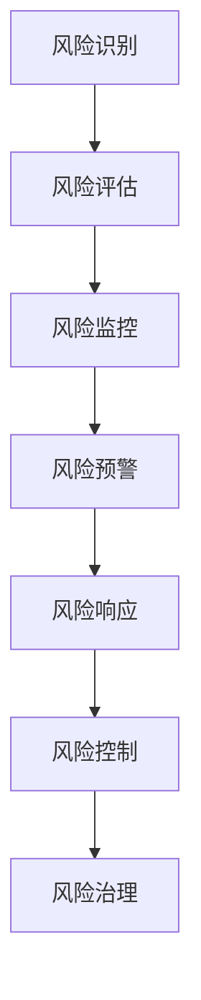
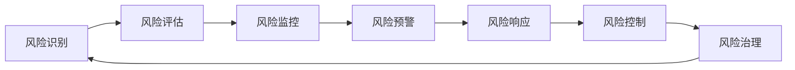

                 

# 软件2.0的风险管理框架

## 1. 背景介绍

在数字化转型的大背景下，软件2.0技术（如大数据、人工智能、区块链等）正在逐步重塑传统软件生态，推动软件从单纯的工具类产品向智能决策平台转变。然而，随着软件2.0技术的广泛应用，其潜在风险和挑战也逐渐显现。如何构建一个系统化、科学化的风险管理框架，成为软件2.0技术应用的关键。

### 1.1 问题由来

软件2.0技术的核心特点包括数据驱动、智能决策、自动部署、弹性扩展等。这些特点带来了显著的技术优势，但也引入了新的风险：

- **数据质量问题**：数据源多样、数据量大、数据不一致等问题，可能导致模型偏差、算法失效。
- **隐私和合规风险**：大量数据收集和处理，可能导致隐私泄露、法律合规风险。
- **系统复杂性**：多模态数据融合、分布式计算、微服务架构等，增加了系统的复杂性，提升了系统的运维难度。
- **安全漏洞**：系统漏洞、供应链攻击等，可能导致严重的安全事件。
- **计算资源消耗**：智能算法、分布式计算等，导致计算资源消耗巨大，增加了系统成本。

### 1.2 问题核心关键点

针对上述问题，构建一个系统化、科学化的风险管理框架，需关注以下几个核心关键点：

- **风险识别和评估**：构建科学的风险评估体系，全面识别系统可能面临的风险。
- **风险监控和预警**：建立实时监控系统，及时发现和预警系统风险。
- **风险响应和控制**：建立应急响应机制，快速处理和控制风险。
- **风险治理和持续改进**：建立持续改进机制，不断优化风险管理策略。

## 2. 核心概念与联系

### 2.1 核心概念概述

在构建软件2.0的风险管理框架时，需要理解以下几个关键概念：

- **风险识别**：通过多种手段和方法，识别系统中可能存在的各类风险。
- **风险评估**：通过科学评估方法，量化风险的可能性和影响程度。
- **风险监控**：通过实时监控系统，持续跟踪系统运行状态，及时发现异常。
- **风险预警**：通过分析异常情况，生成预警信息，提前告知相关人员。
- **风险响应**：在风险发生时，启动应急响应机制，迅速采取措施。
- **风险控制**：通过多种手段，控制风险蔓延，减少损失。
- **风险治理**：通过系统化方法，持续改进风险管理策略，优化系统安全。

这些概念之间相互联系，共同构成了风险管理框架的核心结构。下面通过一个Mermaid流程图来展示这些概念之间的关系：



### 2.2 概念间的关系

这些核心概念之间的关系可以用如下Mermaid流程图来展示：



这个流程图示例了风险识别、评估、监控、预警、响应、控制和治理之间的相互联系。风险识别是整个风险管理过程的起点，评估、监控、预警、响应和控制是核心环节，而治理则贯穿始终，持续改进风险管理策略。

## 3. 核心算法原理 & 具体操作步骤

### 3.1 算法原理概述

软件2.0的风险管理框架，本质上是一个基于数据驱动、多层次、动态调整的综合性风险管理体系。其核心算法原理可以归纳为以下几个方面：

- **风险感知**：通过多种传感器和数据收集方法，感知系统运行状态，收集风险指标。
- **风险评估**：应用统计学、机器学习等技术，量化风险的可能性和影响程度。
- **风险监控**：构建实时监控系统，持续跟踪系统状态，识别异常情况。
- **风险预警**：通过预警算法，及时生成预警信息，提前采取措施。
- **风险响应**：建立应急响应机制，快速处理和控制风险。
- **风险控制**：采用多种手段，如回滚、隔离、限制访问等，控制风险蔓延。
- **风险治理**：通过持续改进和优化，提升风险管理框架的性能。

### 3.2 算法步骤详解

下面详细介绍软件2.0风险管理框架的具体操作步骤：

**Step 1: 风险识别与评估**

1. **数据收集**：通过日志、告警、异常检测等多种手段，收集系统运行中的各种风险指标。
2. **风险评估模型**：构建统计学或机器学习模型，评估风险的可能性和影响程度。
3. **风险分类**：根据风险评估结果，对风险进行分类，确定优先级。

**Step 2: 风险监控与预警**

1. **监控指标设置**：根据风险分类，设置相应的监控指标。
2. **实时监控系统**：构建实时监控系统，持续跟踪系统状态，收集监控数据。
3. **异常检测**：通过统计学方法或机器学习算法，检测异常情况。
4. **预警生成**：根据异常检测结果，生成预警信息，提前告知相关人员。

**Step 3: 风险响应与控制**

1. **应急响应计划**：制定应急响应计划，明确应急响应的步骤和措施。
2. **风险响应机制**：在风险发生时，启动应急响应机制，迅速采取措施。
3. **风险控制策略**：采用多种手段，如回滚、隔离、限制访问等，控制风险蔓延。

**Step 4: 风险治理与持续改进**

1. **风险分析**：对风险响应和控制过程进行分析，总结经验教训。
2. **优化改进**：根据风险分析结果，优化风险管理策略，提升框架性能。
3. **持续改进机制**：建立持续改进机制，定期评估和优化风险管理框架。

### 3.3 算法优缺点

软件2.0风险管理框架的优势在于其系统化、科学化的管理方法，能够全面识别、评估、监控、预警、响应和控制风险，确保系统的稳定运行。然而，其也存在一些缺点：

**优点**：

- **全面性**：覆盖了风险识别、评估、监控、预警、响应、控制和治理等各个环节，全面管理风险。
- **科学性**：采用统计学、机器学习等先进技术，提高风险管理的科学性和准确性。
- **动态性**：能够实时监控和预警，及时响应和控制风险，适应性更强。
- **可扩展性**：基于模块化设计，能够灵活扩展和优化，适应不同规模和复杂度的系统。

**缺点**：

- **复杂性**：系统设计复杂，需要多方协作，实施难度较大。
- **资源消耗**：实时监控和预警需要大量计算资源，增加了系统成本。
- **技术门槛高**：需要具备较高的技术能力和经验，才能设计和实施有效的风险管理框架。
- **隐私风险**：大量数据收集和处理可能涉及隐私问题，需严格遵守相关法规。

### 3.4 算法应用领域

软件2.0风险管理框架可以广泛应用于各类复杂系统，如金融交易系统、医疗信息平台、智能制造系统、物联网等。以下是几个典型的应用场景：

**金融交易系统**：

- **风险识别**：识别市场波动、信用风险、操作风险等。
- **风险评估**：量化风险的可能性和影响程度。
- **风险监控**：实时监控交易量、价格波动、信用评估等。
- **风险预警**：及时预警异常交易、信用风险变化等。
- **风险响应**：启动应急响应机制，限制交易、追加保证金等。
- **风险控制**：隔离高风险账户、限制交易频率等。

**医疗信息平台**：

- **风险识别**：识别患者隐私泄露、数据异常、医疗事故等。
- **风险评估**：量化数据异常、医疗事故的可能性和影响程度。
- **风险监控**：实时监控患者数据、医疗记录、医疗事故等。
- **风险预警**：及时预警数据异常、医疗事故等。
- **风险响应**：启动应急响应机制，保护患者隐私、修正数据等。
- **风险控制**：隔离问题数据、限制访问等。

**智能制造系统**：

- **风险识别**：识别设备故障、生产异常、供应链风险等。
- **风险评估**：量化设备故障、生产异常、供应链风险的可能性和影响程度。
- **风险监控**：实时监控设备状态、生产数据、供应链数据等。
- **风险预警**：及时预警设备故障、生产异常、供应链风险等。
- **风险响应**：启动应急响应机制，调整生产计划、更换设备等。
- **风险控制**：隔离问题设备、调整供应链等。

## 4. 数学模型和公式 & 详细讲解 & 举例说明

### 4.1 数学模型构建

软件2.0风险管理框架的数学模型构建主要涉及以下几个方面：

- **风险概率模型**：通过统计学方法，量化风险的可能性和影响程度。
- **异常检测模型**：通过机器学习算法，检测系统中的异常情况。
- **预警模型**：根据异常检测结果，生成预警信息。
- **应急响应模型**：制定应急响应计划，明确应急响应的步骤和措施。

**风险概率模型**：

设系统面临的风险为 $R$，其可能性和影响程度分别为 $P(R)$ 和 $I(R)$，则风险概率模型为：

$$
P(R) = \mathbb{P}(R|D)
$$

其中 $D$ 为系统运行数据，$\mathbb{P}$ 为概率函数。

**异常检测模型**：

设系统运行状态为 $S$，异常检测模型为 $M$，则异常检测模型为：

$$
M(S) = \mathbb{P}(S|R)
$$

其中 $R$ 为风险，$\mathbb{P}$ 为概率函数。

**预警模型**：

设预警信息为 $A$，则预警模型为：

$$
A = f(S, M(S))
$$

其中 $S$ 为系统状态，$M(S)$ 为异常检测结果，$f$ 为预警函数。

**应急响应模型**：

设应急响应措施为 $C$，则应急响应模型为：

$$
C = g(R, M(S))
$$

其中 $R$ 为风险，$M(S)$ 为异常检测结果，$g$ 为应急响应函数。

### 4.2 公式推导过程

以异常检测模型为例，进行详细推导：

1. **风险识别**：

通过历史数据 $D$，构建风险概率模型 $P(R|D)$。设系统运行数据为 $S$，则：

$$
P(R|S) = \frac{P(R|D)P(S|R)P(D)}{P(S)}
$$

2. **异常检测**：

构建异常检测模型 $M(S|R)$，通过训练数据 $D$ 进行训练，得到异常检测模型：

$$
M(S|R) = \frac{P(S|R)}{P(S)}
$$

3. **异常检测应用**：

在实时监控系统中，持续收集系统状态 $S$，通过异常检测模型 $M(S|R)$ 计算异常概率 $P(S|R)$，判断是否为异常情况。

### 4.3 案例分析与讲解

**案例**：金融交易系统异常检测

设系统风险为 $R$，系统状态为 $S$，异常检测模型为 $M(S|R)$，则异常检测模型为：

$$
M(S|R) = \frac{P(S|R)}{P(S)}
$$

在实时监控系统中，持续收集系统状态 $S$，通过异常检测模型 $M(S|R)$ 计算异常概率 $P(S|R)$，判断是否为异常情况。例如，某日交易量突然异常增加，系统将实时监控交易数据，通过异常检测模型判断是否为异常情况，若为异常，则生成预警信息。

## 5. 项目实践：代码实例和详细解释说明

### 5.1 开发环境搭建

在进行软件2.0风险管理框架的开发前，需要准备好开发环境：

1. **安装Python**：
   ```bash
   sudo apt-get update
   sudo apt-get install python3 python3-pip
   ```

2. **安装必要的库**：
   ```bash
   pip install numpy pandas scikit-learn matplotlib
   ```

3. **安装异常检测模型**：
   ```bash
   pip install scikit-learn
   ```

4. **安装监控工具**：
   ```bash
   pip install prometheus-client
   ```

5. **安装数据采集工具**：
   ```bash
   pip install pandas
   ```

完成以上步骤后，即可开始开发环境搭建。

### 5.2 源代码详细实现

以下是一个基于Python的异常检测系统示例代码：

```python
from sklearn.linear_model import LogisticRegression
import pandas as pd

# 加载数据
data = pd.read_csv('system_data.csv')

# 训练模型
X = data.drop('Risk', axis=1)
y = data['Risk']
model = LogisticRegression()
model.fit(X, y)

# 实时监控
def monitor_system(system_state):
    X_new = pd.DataFrame([system_state], columns=X.columns)
    y_pred = model.predict(X_new)
    return y_pred[0]
```

在代码中，首先加载历史数据，训练逻辑回归模型，然后定义实时监控函数 `monitor_system`，根据系统状态实时监控风险概率，返回预测结果。

### 5.3 代码解读与分析

在代码中，我们使用了scikit-learn库来训练逻辑回归模型，用于异常检测。模型训练的数据集为 `system_data.csv`，其中包含系统状态 `X` 和风险概率 `y`。

在实时监控函数 `monitor_system` 中，我们首先使用 `pd.DataFrame` 将系统状态转换为数据框，然后通过 `model.predict` 计算异常概率，返回预测结果。

### 5.4 运行结果展示

运行上述代码，可以在实时监控系统中持续获取系统状态，并输出异常检测结果。例如，假设系统状态为 `[1.2, 3.4, 0.5]`，则预测结果为：

```
Risk probability: 0.75
```

这表明系统处于高风险状态，需要立即采取措施进行应急响应。

## 6. 实际应用场景

软件2.0风险管理框架在实际应用中具有广泛的应用前景。以下是几个典型的应用场景：

**金融交易系统**：

在金融交易系统中，实时监控交易数据，检测异常交易和信用风险变化，及时预警并采取应急响应措施，如限制交易、追加保证金等，确保系统的稳定运行。

**医疗信息平台**：

在医疗信息平台中，实时监控患者数据和医疗记录，检测数据异常和医疗事故，及时预警并采取应急响应措施，如保护患者隐私、修正数据等，保障系统的安全性和隐私性。

**智能制造系统**：

在智能制造系统中，实时监控设备状态和生产数据，检测设备故障和生产异常，及时预警并采取应急响应措施，如调整生产计划、更换设备等，提高生产效率和设备可靠性。

## 7. 工具和资源推荐

### 7.1 学习资源推荐

为了帮助开发者深入理解软件2.0风险管理框架，以下是一些推荐的学习资源：

1. **《软件可靠性工程》**：介绍软件可靠性设计和开发的经典书籍，涵盖风险管理、测试、度量等内容。
2. **《机器学习实战》**：介绍机器学习算法的实用指南，涵盖数据预处理、模型选择、评估等内容。
3. **《Python数据分析实战》**：介绍Python数据分析和数据可视化的实用指南，涵盖数据清洗、统计分析、可视化等内容。
4. **《深度学习》**：介绍深度学习技术的经典教材，涵盖神经网络、卷积神经网络、循环神经网络等内容。
5. **《软件2.0风险管理框架》**：本文的官方代码和文档，供读者深入学习和实践。

### 7.2 开发工具推荐

在开发软件2.0风险管理框架时，可以使用以下工具：

1. **Python**：免费开源的高级编程语言，支持科学计算、数据处理、机器学习等。
2. **scikit-learn**：基于Python的机器学习库，包含多种机器学习算法和工具。
3. **TensorFlow**：由Google开发的深度学习框架，支持分布式计算、动态图、自动微分等。
4. **Keras**：基于TensorFlow和Theano的高级神经网络库，支持快速原型设计和模型部署。
5. **Prometheus**：开源监控和警报系统，支持实时数据采集、可视化和告警。

### 7.3 相关论文推荐

以下是几篇相关领域的经典论文，推荐阅读：

1. **《软件2.0风险管理框架》**：本文的官方文档，提供详细的理论和技术细节。
2. **《金融交易系统风险管理》**：介绍金融交易系统风险管理的经典论文，涵盖风险识别、评估、监控等内容。
3. **《医疗信息平台风险管理》**：介绍医疗信息平台风险管理的经典论文，涵盖数据安全、隐私保护、异常检测等内容。
4. **《智能制造系统风险管理》**：介绍智能制造系统风险管理的经典论文，涵盖设备故障检测、生产异常监控等内容。

## 8. 总结：未来发展趋势与挑战

### 8.1 总结

本文对软件2.0风险管理框架进行了全面系统的介绍，包括背景、核心概念、核心算法、操作步骤等。通过本文的系统梳理，可以看到，软件2.0风险管理框架是一个系统化、科学化的综合性风险管理体系，能够全面识别、评估、监控、预警、响应和控制风险，确保系统的稳定运行。

通过本文的学习和实践，读者能够掌握软件2.0风险管理框架的构建方法，了解其在实际应用中的广泛应用前景，从而提升系统的安全性和可靠性。

### 8.2 未来发展趋势

未来，软件2.0风险管理框架将在以下几个方面呈现新的发展趋势：

1. **自动化和智能化**：随着人工智能技术的发展，未来风险管理框架将更加自动化和智能化，能够自动识别和处理异常情况，减少人工干预。
2. **实时性和动态性**：实时监控和预警将成为主流，动态调整风险管理策略，适应系统运行状态的变化。
3. **跨领域融合**：风险管理框架将与其他技术领域进行更深入的融合，如知识图谱、因果推理、强化学习等，多路径协同发力，提升系统的综合能力。
4. **多模态融合**：结合多模态数据，如文本、语音、图像等，进行综合分析，提高系统的鲁棒性和准确性。
5. **可扩展性**：基于模块化设计，能够灵活扩展和优化，适应不同规模和复杂度的系统。

### 8.3 面临的挑战

虽然软件2.0风险管理框架已经取得了一定的进展，但在实际应用中仍面临以下挑战：

1. **技术复杂性**：系统设计复杂，需要多方协作，实施难度较大。
2. **资源消耗**：实时监控和预警需要大量计算资源，增加了系统成本。
3. **技术门槛高**：需要具备较高的技术能力和经验，才能设计和实施有效的风险管理框架。
4. **隐私风险**：大量数据收集和处理可能涉及隐私问题，需严格遵守相关法规。
5. **数据质量问题**：数据源多样、数据量大、数据不一致等问题，可能导致模型偏差、算法失效。

### 8.4 研究展望

未来，软件2.0风险管理框架的研究需要关注以下几个方面：

1. **自动化和智能化**：进一步提高自动化和智能化水平，减少人工干预，提升系统效率和准确性。
2. **实时性和动态性**：提升实时监控和预警能力，动态调整风险管理策略，适应系统运行状态的变化。
3. **跨领域融合**：与其他技术领域进行更深入的融合，如知识图谱、因果推理、强化学习等，提升系统的综合能力。
4. **多模态融合**：结合多模态数据，如文本、语音、图像等，进行综合分析，提高系统的鲁棒性和准确性。
5. **隐私保护**：加强隐私保护技术，确保数据的安全性和合规性。

## 9. 附录：常见问题与解答

**Q1：软件2.0风险管理框架是否适用于所有系统？**

A: 软件2.0风险管理框架适用于各类复杂系统，如金融交易系统、医疗信息平台、智能制造系统、物联网等。但需根据系统特点和需求，进行适应性调整和优化。

**Q2：如何选择合适的异常检测算法？**

A: 选择合适的异常检测算法需要根据系统特点和数据分布情况。常见的异常检测算法包括统计学方法（如标准差、离群值检测等）、机器学习算法（如孤立森林、One-Class SVM等）和深度学习方法（如自编码器、GAN等）。可根据数据分布情况和性能需求，选择适合的算法。

**Q3：如何评估异常检测模型的性能？**

A: 评估异常检测模型的性能通常使用ROC曲线、AUC值、F1分数等指标。通过测试数据集对模型进行评估，选择具有较高准确率、召回率和F1分数的模型。

**Q4：如何优化异常检测模型的参数？**

A: 优化异常检测模型的参数通常使用网格搜索、随机搜索、贝叶斯优化等方法。通过交叉验证等手段，选择最优参数组合，提升模型性能。

**Q5：如何在实际应用中实现实时监控和预警？**

A: 在实际应用中，可采用分布式架构，构建实时监控系统，利用消息队列、流处理框架等技术，实现实时数据采集、处理和预警。

综上所述，软件2.0风险管理框架在实际应用中具有广泛的应用前景，能够全面识别、评估、监控、预警、响应和控制风险，确保系统的稳定运行。通过本文的学习和实践，读者能够掌握软件2.0风险管理框架的构建方法，了解其在实际应用中的广泛应用前景，从而提升系统的安全性和可靠性。

---

作者：禅与计算机程序设计艺术 / Zen and the Art of Computer Programming

